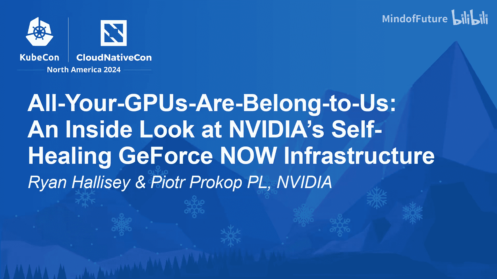

# 028：揭秘NVIDIA的自愈GPU舰队管理



在本节课中，我们将学习NVIDIA如何利用一个名为“Notify Maintenance API”的自定义Kubernetes解决方案，来大规模、自动化地管理其GeForce Now云游戏服务的GPU基础设施维护工作。我们将深入探讨其设计哲学、核心架构以及在实际场景（尤其是故障修复）中的应用。

## 概述：维护GPU舰队的挑战与哲学

NVIDIA的GeForce Now服务在全球数据中心运行着超过40个Kubernetes集群、3万多个节点以及6万多个GPU。维护如此庞大的舰队（包括GPU更新、Kubernetes升级、驱动更新、操作系统补丁等）是一项巨大挑战。

他们的维护哲学可以类比为打造一辆赛车：**第一要务是造一辆快车（提供优质服务），第二要务是能在赛道上维修它（在生产中维护）**。两者同等重要。这意味着必须在确保服务持续可用、不影响最终用户体验的前提下，完成所有基础设施的维护和修复工作。

## 核心解决方案：Notify Maintenance API

面对维护需求，NVIDIA团队认为缺少一个统一的“维护API”来跟踪和管理维护状态。他们的核心论点是：**如果能准确定义维护过程所经历的所有状态，就能围绕它构建强大的工具链**。

于是，他们创建了 **`NotifyMaintenance`** 这个Kubernetes自定义资源定义（CRD）。它本质上是一个**有限状态机（Finite State Machine）**，用一系列规范化的状态来描述一次维护的生命周期。

以下是NotifyMaintenance API的一个简化示例：

```yaml
apiVersion: maintenance.nvidia.com/v1alpha1
kind: NotifyMaintenance
metadata:
  name: node-maintenance-example
spec:
  additionalMessageChannels:
    - slack
    - sns
  maintenanceId: "bios-042b" # 此次维护任务的唯一标识
  maintenanceType: "Planned" # 或 "Unplanned"
  slaExpires: "2024-05-15T23:59:59Z" # 工作负载必须迁移的截止时间
status:
  maintenanceStatus: "MaintenanceScheduled" # 当前状态
```

该API主要包含以下关键字段：
*   **`additionalMessageChannels`**: 用于将维护事件通知到Kubernetes外部（如Slack、SNS），实现“通知（Notify）”功能。
*   **`maintenanceId`**: 维护任务UID，用于聚合跨节点的相同维护操作。
*   **`maintenanceType`**: 区分 **`Planned`**（计划内）和 **`Unplanned`**（计划外/故障）维护，这对处理逻辑至关重要。
*   **`slaExpires`**: 与服务等级协议（SLA）相关，设定工作负载必须迁出的最后期限。
*   **`maintenanceStatus`**: 代表维护的当前状态，是状态机的核心。

## 维护状态机：八个核心状态

基于对维护流程的抽象，他们定义了维护操作通常会经历的八个核心状态。理解这些状态是理解整个方案的关键。

1.  **`MaintenanceScheduled` (计划排期)**: 决定对某个节点开始维护，并通知相关方。
2.  **`MaintenanceStarted` (开始驱逐)**: 启动工作负载驱逐流程。这可能简单如执行 `kubectl drain`，也可能复杂如涉及QEMU/KVM的实时迁移。
3.  **`Drained` (已驱逐)**: 节点上的工作负载已被清空，可以安全进行维护。
4.  **`Maintenance` (执行维护)**: 实际执行维护操作（如升级BIOS、Kubernetes版本、操作系统等）。具体操作由用户定义的控制器实现。
5.  **`MaintenanceComplete` / `MaintenanceFailed` (维护完成/失败)**: 维护操作执行完毕或中途失败。
6.  **`Validating` (验证中)**: 维护后验证节点状态（如运行健康检查、确认版本号）。
7.  **`ValidationComplete` / `ValidationFailed` (验证完成/失败)**: 验证通过或失败。若多次验证失败，可能需人工介入。
8.  **`MaintenanceComplete` (返回生产)**: 所有步骤成功，节点健康，返回集群继续服务。

通过这套状态机，任何维护操作都可以被清晰地跟踪和协调。

## 系统架构：控制器生态系统

有了标准化的API和状态定义，就可以围绕它构建一个控制器（Operator）生态系统。每个控制器负责推动状态机向下一阶段迁移，或执行特定阶段的操作。

在一个集群内部，架构通常包含以下核心控制器：
*   **维护调度器（Maintenance Scheduler）**: 负责根据策略创建 `NotifyMaintenance` 对象，并推动状态从 `Scheduled` 向 `Started` 等状态转移。
*   **驱逐控制器（Drain Controller）**: 当状态进入 `MaintenanceStarted` 时，该控制器负责安全地驱逐节点上的工作负载，直至达到 `Drained` 状态。
*   **维护控制器（Maintenance Controller）**: 当状态为 `Drained` 时，该控制器执行具体的维护操作（如升级软件），完成后将状态推向 `MaintenanceComplete`。
*   **通知系统**: 贯穿始终，在状态变更时通过Kubernetes Events和外部通道（如SNS）广播消息。

这种设计使得维护逻辑（状态机）与具体的维护动作（控制器实现）解耦，非常灵活。

## 实战应用：自动化故障修复（Unplanned Maintenance）

上一节我们介绍了计划内维护的通用框架，本节中我们来看看它在处理计划外故障（Unplanned Maintenance）时的强大应用。这是该方案带来巨大价值的关键场景。

过去，当节点或GPU发生硬件或软件故障时，需要值班工程师手动诊断、执行修复脚本、验证并恢复节点，耗时耗力且可能遗漏故障。现在，他们利用 `NotifyMaintenance` API 实现了全自动化修复流水线。

以下是自动化故障修复的流程：

1.  **故障检测（Detection）**: 利用 **Node Problem Detector** 或自定义的 **GPU Problem Detector**（作为Device Plugin的一部分），将故障信息写入节点的 `Condition` 字段。
2.  **触发修复（Remediation Trigger）**: 使用开源项目 **Node Healthcheck Operator**。它监控节点Condition，当匹配到预设的故障条件（如“GPU设备故障”持续2分钟）时，自动创建一个 `NodeRemediation` 自定义资源。
3.  **执行修复（Remediation Execution）**: 修复引擎接收到 `NodeRemediation` 资源后，按照**分级升级（Escalating）**策略执行修复操作。例如：
    *   第一级：重启节点。
    *   若失败，第二级：通过IPMI进行电源循环。
    *   若再失败，第三级：标记节点需人工介入，并发出告警。
4.  **驱动维护流程**: 整个修复过程会被包装成一个 `maintenanceType: Unplanned` 的 `NotifyMaintenance` 任务，并遵循前述的状态机流程（驱逐、修复、验证、返回生产）。
5.  **验证（Validation）**: 修复完成后，执行简单的健全性检查（例如，确认主机上所有预期的GPU都存在），确保节点真正健康。
6.  **告警与熔断（Alerting & Circuit Breaking）**: 为避免对持续故障的节点进行无意义的重试，他们设置了告警规则。例如，**如果某个节点在90分钟内被修复超过2次，则触发告警并可能暂停对该节点的自动修复**。

通过这套系统，NVIDIA实现了日均每1000个节点约19次自动化修复，在大规模下相当于每天近千次修复操作，极大解放了工程师的生产力。

## 未来展望：舰队级维护协调

当前架构主要针对单个集群内的维护。未来的方向是**舰队级（Fleet-Level）维护协调**。

目标是实现一个分层调度系统：
1.  在舰队层面，维护调度器根据全局因素（如数据中心区域负载、季节性流量模式、活跃事件）决定在何时、何地（哪个区域）执行维护。
2.  然后，它向目标区域的数据中心集群发起批量创建 `NotifyMaintenance` 任务的指令。
3.  集群内的调度器和控制器再根据本地策略和状态，决定具体对哪些节点、以何种顺序执行维护，并驱动整个流程。

这将实现更智能、更全局化的资源维护优化。

## 总结与开源

本节课中我们一起学习了NVIDIA如何通过设计 `Notify Maintenance API` 这一Kubernetes原生状态机，来解决超大规模GPU基础设施的维护难题。核心要点包括：

*   **哲学**：在生产中维修“赛车”，确保用户零影响。
*   **核心**：用CRD定义维护状态机（8个状态），实现操作标准化与可追踪。
*   **架构**：围绕状态机构建控制器生态系统，实现关注点分离和高度自动化。
*   **应用**：特别在**自动化故障修复**场景下成效显著，通过检测、触发、分级修复、验证的流水线，日均处理大量故障。
*   **未来**：向舰队级智能调度演进。

NVIDIA已将 `Notify Maintenance API` 的核心思想在开源项目 **PCA（Pod Controller Assistant）** 中体现，并积极参与Kubernetes社区关于节点维护的KEP讨论。他们欢迎社区共同参与，探讨如何更好地在大规模、异构加速器环境中进行运维管理。