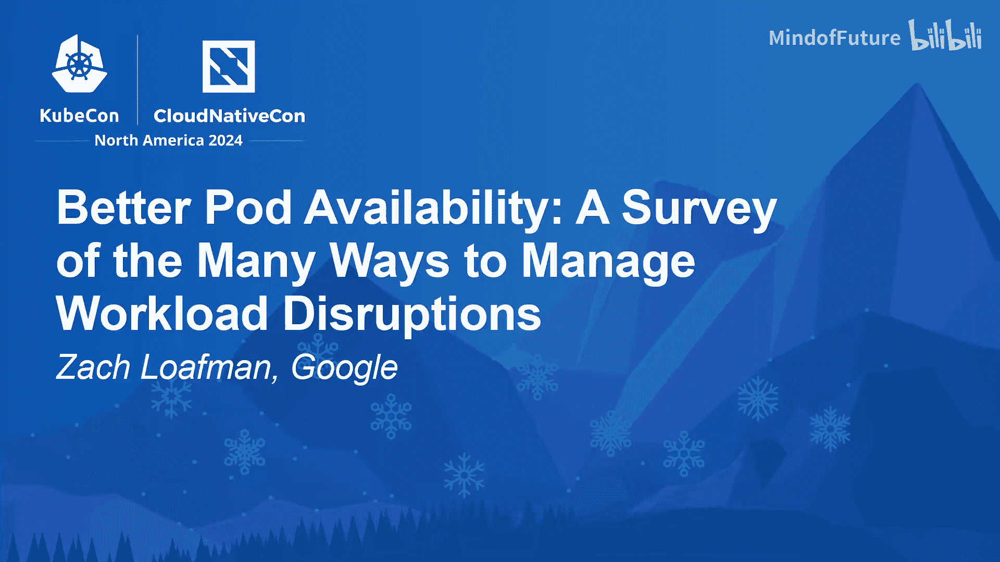

# 029：提升 Pod 可用性——多种管理工作负载中断方式的探讨

## 概述

在本节课中，我们将探讨 Kubernetes 中 Pod 中断的各种类型，并学习如何通过不同的策略和最佳实践来管理工作负载的可用性。我们将从定义中断开始，逐步深入到具体的场景和应对措施，特别是针对那些难以中断的“慢速退出”应用。

---

## 什么是 Pod 中断？

Pod 中断是指任何在应用程序自行退出之前中断 Pod 运行的事件。这是一个非常宽泛的定义，涵盖了多种情况。

Kubernetes 官方文档甚至为此提供了一个分类法，将其分为**非自愿中断**和**自愿中断**。

---

## 中断的分类与应对策略

上一节我们定义了 Pod 中断。本节中，我们来看看 Kubernetes 对中断的分类，并探讨相应的最佳实践。

我们可以将中断大致分为三类：

1.  **非自愿中断（左侧）**：Kubernetes 文档称之为“非自愿中断”。这包括硬件故障、操作系统故障、网络故障等“宕机”事件，它们会突然停止你的 Pod。资源不足导致的驱逐也属于此类。
2.  **自愿中断（右侧）**：这主要是由应用所有者发起的操作，例如滚动更新、删除或重启 Deployment。
3.  **集群管理操作（中间）**：这是一个有趣且“自愿”程度取决于云服务提供商的类别。它包括任何导致节点排空的操作，例如升级、缩容、节点修复等。我们将花较多时间讨论这个类别。

这种分类主要关注 Kubernetes 机制对不同中断源的反应。但我们也可以从另一个角度思考：这是**好的中断**还是**坏的中断**？当然，这是一个定性定义。

*   **好的中断**：Pod 在你希望它被中断时被中断。
*   **坏的中断**：Pod 在意料之外的时间被中断。

基于这个视角，我们可以重新审视之前的分类，并围绕这些中断源描述最佳实践。

---

### 应对“宕机”类事件

对于“硬件/软件故障”这类广泛的非自愿中断，它通常属于坏的中断，主要由硬件和软件质量驱动。

这里的核心最佳实践是：**为故障而设计**。

除了确保硬件/软件质量和及时打补丁（这本身是一个大话题），Kubernetes 也能提供帮助：

*   **使用反亲和性** 和 **拓扑分布约束**：确保复制的应用 Pod 分散在不同的节点或可用区上。

---

### 应对应用所有者发起的中断

这类中断（如配置变更、滚动更新）通常属于好的中断。

这里的核心最佳实践是：**健全的变更管理**。

例如，使用 GitOps 流程并进行适当的代码审查。其他实践包括内部采用的多方授权机制，以确保手动变更至少有人监督。

Kubernetes 本身也提供了帮助，例如 Deployment 的滚动更新策略。但有一个重要的工具需要特别提及：**Pod 中断预算**，因为它与我们后面要讨论的主题密切相关。

以下是关于 PDB 的要点：

*   PDB 指定了中断限制，例如“最多一个 Pod 不可用”或“必须有 80% 的 Pod 可用”。
*   它主要用于保护复制的应用，并可用于任何可伸缩的资源。
*   大多数自愿中断源都会遵守 PDB。
*   一个例外是资源不足驱逐，PDB 在此情况下只是“尽力而为”。

**如果你还没有使用 PDB，你应该开始使用。**

---

### 应对资源不足驱逐

资源不足驱逐是一个有趣的类别。Kubernetes 分类法将其归为非自愿中断，因为在此情况下需要快速做出决策。但它也并非完全“非自愿”，因为你可以自愿配置集群以允许此类驱逐。

这是一个广泛的话题，涉及如何权衡。例如：

*   如果为特定 Pod 调优以获得最高可靠性，你可能需要避免节点资源过度使用（即请求等于限制）。
*   但通常，人们喜欢过度使用节点资源以节省成本，这取决于工作负载类型。此时，**Pod 优先级** 就变得很重要。

资源不足驱逐是 PDB 仅被“尽力而为”遵守的情况之一。特别是当节点负载过高必须驱逐某些 Pod 时，PDB 可能完全不被遵守。

---

## 聚焦：集群管理操作与节点排空

现在，让我们深入探讨中间类别：**集群管理操作**，特别是节点排空。

如今，这些操作大多由自动化驱动，例如集群自动扩缩容、升级和节点修复。我将在接下来的内容中重点讨论这个领域，因为在不同的云服务提供商和实现方案之间，这里存在许多差异。

---

### 案例研究：游戏服务器（Agones）

我们通过一个具体的案例来研究这个问题：**Agones**，一个用于在云中运行专用游戏服务器的框架。

游戏服务器是 Kubernetes 中断管理的一个有趣案例：

*   **问题**：每个 Pod 都是一个游戏会话，拥有自己的内存状态（游戏模拟状态）。会话持续时间从几分钟到数小时甚至更长（如 MMO）。
*   **挑战**：为游戏服务器实现合理的检查点/重启机制，在成本、复杂性和游戏设计上存在权衡。
*   **后果**：对游戏服务器的坏中断意味着“游戏结束”，导致玩家连接断开，给公司带来声誉损失，甚至造成实际的经济损失。

这个场景也适用于 AI 训练任务或 HPC 工作负载，中断一个运行在昂贵 GPU 上的任务可能导致高昂的恢复成本。

对于这些“不能失败”的 Pod，集群管理员面临独特的挑战：

1.  **应对“宕机”事件**：游戏结束。缓解措施是提高硬件/软件质量、加强监控，以便更早地将节点移出服务。
2.  **应对资源不足驱逐**：确保这些内存状态重要且难以检查点的工作负载拥有良好的资源管理（设置合理的请求和限制），并配置适当的 Pod 优先级。
3.  **应对集群管理自动化操作**：这是我们接下来要详细讨论的。

---

### 为什么需要自动化？

为什么我们要关心自动化？因为云服务提供商（包括 Google）希望用户尽可能使用自动化，这对双方都有利。

*   **集群自动扩缩容**：你希望它能够缩容节点，特别是对于具有周期性负载（如昼夜、周末高峰）的游戏服务器舰队，手动管理是不现实的。
*   **节点升级**：你希望保持软件更新。
*   **不使用自动化**：意味着将运维负担留给自己，并可能浪费硬件资源。

因此，对于这些难以中断的应用，存在一个有趣的张力：既需要自动化来管理效率和成本，又需要保护关键工作负载不被意外中断。

---

### 节点排空的工作原理

当自动化或管理员想要将一个节点移出服务时，Kubernetes 的节点排空过程如下：

1.  **等待并尝试遵守 PDB**：如果驱逐某个 Pod 会违反 PDB，则等待。
2.  **优雅终止 Pod**：遵守 `terminationGracePeriodSeconds`（终止宽限期）。

然而，根据你的云服务提供商和配置，上述过程可能并不总是完全按预期工作。

---

### 深入：终止宽限期

当 Kubernetes 想要在这些自愿驱逐情况下停止一个 Pod 时：

1.  在 `terminationGracePeriodSeconds` 期间，如果定义了 `preStop` 钩子，则运行它。
2.  在 `preStop` 钩子运行后，向应用程序发送 `SIGTERM` 信号。
3.  如果 `terminationGracePeriodSeconds` 过后 Pod 仍在运行，则发送 `SIGKILL`。

因此，`terminationGracePeriodSeconds` 实质上是 Pod 的清理期，默认值为 30 秒。大多数 Pod 驱逐都会“尽力”遵守某个宽限期。

---

### 快速退出 vs. 慢速退出应用

基于我们对游戏服务器案例和终止宽限期的理解，可以进一步细化分类：**快速退出应用** 和 **慢速退出应用**。

*   **快速退出应用**：Pod 可以在 **10 分钟** 内被驱逐（这个时间点与集群自动扩缩容的默认设置有关）。这涵盖了大多数 RPC/HTTP 服务器，以及将状态维护在磁盘上的有状态工作负载（如数据库），它们通常可以在此时间内完成检查点。
*   **慢速退出应用**：其他所有工作负载。丢失内存状态的代价很高，可能是金钱（训练任务）或声誉（游戏服务器）。例如：游戏会话服务器、语音聊天、实时视频转码、AI 训练任务、HPC 批处理作业。

---

### 自动化带来的挑战与云提供商差异

现在，我们来谈谈为什么允许自动化对慢速退出应用来说是一个挑战。首要原因是：**云服务提供商选择了不同的机制**。

**1. 升级操作：**
*   **GKE（标准版，激增升级）**：如果 PDB 加上终止宽限期总时间超过 **1 小时**，则会中断你的 Pod。升级操作本身具有优先级。
*   **AKS 和 EKS**：在 **15 或 30 分钟**（可配置）后，升级操作会失败。它们选择将运维负担更多地转移给执行升级的管理员。

**建议：**
*   A. 根据你的提供商，你可能可以调整与中断相关的升级操作超时。
*   B. 许多云提供商开始提供**自动蓝绿升级**，即一边缩容一个节点池/节点集，另一边扩容另一个。

**2. 自动扩缩容器：**
*   **Cluster Autoscaler 和 Karpenter** 都遵守 PDB 和 `terminationGracePeriodSeconds`，但都有限制。
*   **Cluster Autoscaler** 默认在 **10 分钟** 后就会终止你的 Pod，无论 `terminationGracePeriodSeconds` 设置为何值。没有警告、状态或注解。
*   **Karpenter** 使用可配置的每个节点最大值。
*   两者都有一个神奇的注解（如 `cluster-autoscaler.kubernetes.io/safe-to-evict: "false"`）可以阻止驱逐。

---

## 针对慢速退出应用的最佳实践

鉴于以上情况，以下是一些针对慢速退出应用的最佳实践：

1.  **确保应用支持 `SIGTERM`**：如果你想支持自动化，就需要与现有的驱逐系统合作。对于遗留应用，可以使用 `preStop` 钩子来拦截 `SIGTERM`，但这有点棘手。
2.  **调整 Pod 规范中的 `terminationGracePeriodSeconds`**。
3.  **调整自动扩缩容器的最大终止宽限期**：Cluster Autoscaler 和 Karpenter 都支持调整此值。
4.  **调整升级超时或研究自动蓝绿升级**：如果你的工作负载需要运行一小时，可能也需要调整此项。
5.  **（高级）尝试将慢速退出应用调度到相同的节点上**：通常你也希望它们能在相近的时间终止。这是一个更深入的话题，但值得尝试。

---

### 进阶思路：构建可移植的中断策略

在 Agones 中，我们尝试构建一个驱逐 API 来简化此事。核心思想是：通过一个标签（如 `agones.dev/safe-to-evict`）来声明 Pod 是否可安全驱逐，然后根据目标环境将其转换为适当的策略。

即使你不使用 Agones，也可以实现类似的效果：

*   如果你的工作负载都支持 `SIGTERM`（即“云原生”应用），你可以将 `terminationGracePeriodSeconds` 作为一个指标。
*   你可以使用策略引擎或自定义 Webhook 来执行适合你工作负载的策略。例如，如果 `terminationGracePeriodSeconds` 大于某个值，则自动为其添加 `safe-to-evict: "false"` 注解，并确保它们被调度到配置了适当升级和扩缩容超时的节点池或集群上。

这有助于使你的工作负载在不同云环境或不同自动扩缩容方案之间更具可移植性。

实现此类方案需要考虑两个最重要的问题：
1.  应用是否正确处理了 `SIGTERM`？
2.  发送 `SIGTERM` 后，需要多长时间才能安全终止？（即 `terminationGracePeriodSeconds` 的设定）

---

## 总结

本节课中，我们一起学习了 Kubernetes 中 Pod 中断管理的多个方面：

1.  **Pod 中断是权衡的艺术**：它是一个涉及成本、人工运维、应用复杂性等多变量的决策问题。
2.  **思考中断的成本**：中断并非二元（能/不能），而是与“中断这个特定 Pod 的代价是什么”相关。需要据此进行设计。
3.  **给应用所有者的建议**：思考是否能引入检查点机制，或者其成本（复杂性、资源）是否过高。
4.  **给管理员的建议**：
    *   对于**快速退出应用**：确保调优 PDB，考虑拓扑分布等。
    *   对于**慢速退出应用**：确保调优 `terminationGracePeriodSeconds`，并相应地配置自动化工具（扩缩容器、升级策略）。

通过理解中断的类型、成本以及 Kubernetes 和云平台提供的各种控制机制，你可以更好地设计和管理工作负载，在可靠性、成本与运维效率之间找到最佳平衡点。