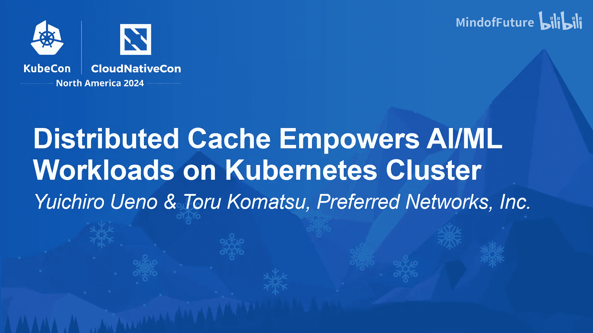
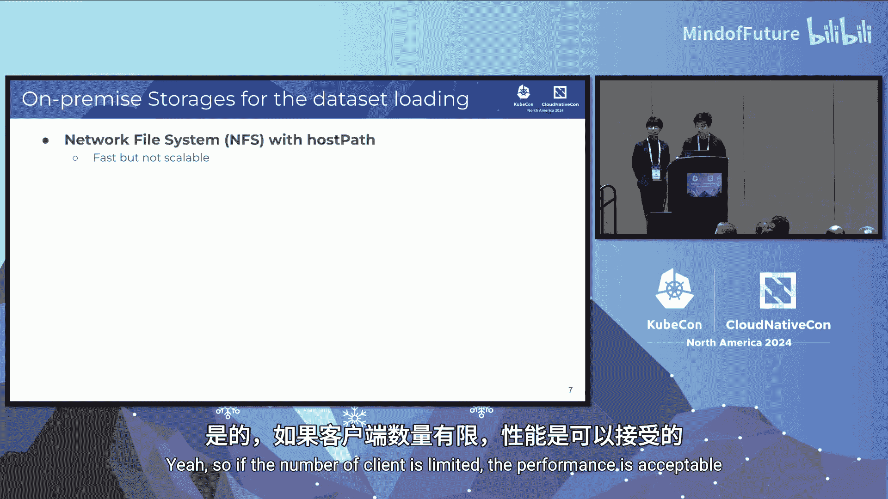

# 030：Kubernetes集群上的分布式缓存系统 🚀

在本教程中，我们将学习如何在Kubernetes集群上构建一个名为“简单缓存服务”的分布式缓存系统，并探讨它如何赋能人工智能和机器学习工作负载。我们将从背景介绍开始，逐步深入到系统设计、实现细节、实际用例以及性能优化技术。

## 背景：Kubernetes上的AI/ML工作负载

首先，我们介绍人工智能和机器学习工作负载的背景。考虑一个训练机器学习模型来识别手写数字的场景。我们有一个包含数字图像的数据集和一个深度神经网络的训练任务。在Kubernetes中，这对应着多个Pod。这些Pod会访问数据并获取数据样本，然后用这些样本填充深度神经网络，从而优化模型。通过持续这个过程，深度神经网络最终能够识别数字。

接下来，我们看看存储这些数据的策略。作为一家拥有本地集群的AI/ML公司，我们需要本地解决方案。

### 存储策略分析

以下是几种常见的存储策略及其优缺点：

*   **网络文件系统**：我们可以使用主机路径卷将NFS存储挂载到Kubernetes Pod。如果NFS服务器拥有快速的直连驱动器和强大的CPU，并且客户端数量有限，其性能是可以接受的。然而，当大量客户端同时访问NFS时，很容易出现性能下降。
*   **对象存储**：我们使用开源软件（如MinIO）构建了与S3兼容的本地对象存储，后端使用硬件磁盘驱动器。通过添加新的硬件磁盘条带，我们可以扩展其性能和容量。但实际上，硬盘驱动器的性能不足以支持数据集的随机读取需求，因此它不能作为数据集读取的解决方案。
*   **节点本地存储**：我们的配备AI加速器的计算节点拥有额外的NVMe驱动器，设计用作AI/ML工作负载的临时卷。这里的问题是，当工作负载迁移到不同的计算节点时，数据将变得不可访问。例如，数据集首先被调度到计算节点A，工作流将数据集缓存到该节点的本地存储。之后，工作负载可能被抢占，并幸运地迁移到另一个计算节点B。此时，我们无法访问计算节点A上的缓存数据，必须重新获取数据，这非常耗时。因此，节点本地存储本身有助于训练，但不能作为最终的存储解决方案。此外，如果训练所需的数据集大小超过其容量，我们就无法将其用作缓存存储，因此它不具备可扩展性。

### 理想存储架构

这是我们为AI/ML工作负载设计的理想存储架构。我们计划结合对象存储和节点本地存储来构建一个分层缓存系统。Pod将访问快速的NVMe驱动器缓存，如果数据存在于缓存中，我们可以跳过对对象存储的访问。如果数据不存在于缓存中，则必须访问对象存储。通过向对象存储添加新的硬盘驱动器，存储容量是可扩展的；通过添加新的计算节点或新的NVMe设备，吞吐量也是可扩展的。因此，我们认为这是适合AI/ML工作负载的基础解决方案。

在本节中，我们将介绍基于云原生技术的分层存储解决方案。利用Kubernetes的特性（如服务发现、身份验证）和Envoy的功能（如其负载均衡技术和灵活性），开发解决方案似乎很困难，但我们实际上可以非常轻松地开发出这个存储系统。

## 核心组件：简单缓存服务介绍

上一节我们介绍了AI/ML工作负载的存储挑战，本节中我们来看看为解决这些问题而设计的核心系统——简单缓存服务。

SGS是一个采用简单、共享无状态架构的缓存服务。它拥有非常基础的HTTP GET/PUT接口，当用户获取数据时，它只是返回节点本地文件。它极其简单且快速。同时，SGS为云原生环境设计，它部署在Kubernetes集群中，并大量使用Kubernetes特性来减少我们自己的实现工作。此外，SGS采用共享无状态架构，这至关重要，因为它使得SGS能够实现线性扩展。另一个需要注意的重点是，SGS只是一个缓存服务，而非持久化存储。换句话说，不需要永久保存数据，删除缓存数据是可以接受的。

### 基本使用方式

以下是如何使用`curl`命令实际使用SGS的示例。这非常简单直接。

第一个`curl`命令将缓存数据（一个JPEG文件）存储到SGS中，第二个命令则从快速的缓存存储中获取该数据。

让我们更仔细地看一下。首先看HTTP方法。第一个`curl`使用PUT来存储数据，第二个使用GET来获取数据。这很自然。接下来是URL。你首先会注意到它使用了HTTP和Kubernetes服务。如果你查看URL的路径，它明确指定了桶和对象。在这个例子中，桶是`project1`，对象是`apple.jpg`。最后是身份验证部分，我们稍后会讨论。请记住，`Authorization`头是必需的。在这一部分，我们通过充分利用Kubernetes的Service Account Token特性，减少了自己的实现工作。

### 系统架构图

让我们看看这些`curl`命令的路径示意图。下图展示了用户如何访问SGS。用户Pod执行类似于我们刚才演示的`curl`命令的操作。SGS将缓存的实际数据存储为文件。如前所述，SGS所做的操作只是提供这个文件。

首先你会注意到，在用户Pod和SGS之间存在着Kubernetes服务和Envoy代理。在我们深入更多细节之前，让我们先仔细看看SGS本身。

SGS由三个主要组件构成：SGS应用程序（一个Go语言应用）、NVMe或其他存储缓存数据的设备，以及一个始终保存元数据（如访问时间戳等）的Envoy代理。每个SGS应用程序都有自己的SQLite数据库。在这个例子中，有四个SQLite数据库，因为对应着四个SGS应用程序。当然，每个SGS都作为我们集群中的一个Pod运行，它们通过DaemonSet进行部署。

回到这个架构图。其中一个最重要的特性是共享无状态架构。这意味着每个SGS Pod之间不共享任何像数据库这样的东西。尽管如此，用户可以从任何网络区域访问缓存数据。为了实现这一点，第7层负载均衡使用了一致性哈希算法。

### 身份验证流程

接下来，这是SGS中的授权流程。它类似于Kubernetes的TokenReview API。如果你使用过它，你会理解这个流程。首先，用户Pod应该挂载服务账户令牌并发送一个令牌审查请求。在验证部分，由SGS负责，它使用TokenReview API来验证令牌。服务账户令牌包含了资源所属的命名空间信息，这可以用于身份验证。因此，用户可以指定能够访问存储桶的命名空间。

### 存储桶定义与管理

我们可以像这样定义一个存储桶。存储桶有两种类型：公共和私有。顶部橙色部分是名为“公共存储桶”的存储桶，任何人都可以访问。下面的蓝色部分称为“私有存储桶”，基于Kubernetes命名空间进行身份验证。可以列出允许访问该存储桶的命名空间。例如，`project-kubernetes`和`user-demo`命名空间被允许访问`bucket1`存储桶。还可以在存储桶的`quota`字段中为每个存储桶设置存储限制。如果超过指定容量，存储桶将基于LRU策略删除缓存数据。

这张图展示了数据是如何基于LRU被删除的。首先看颜色，每种颜色代表一个存储桶。随着时间的推移，它们被加载了越来越多的数据。蓝色阴影中的点是为每个存储桶分配的最大容量。一旦达到这个点，每个存储桶的容量就不再增加，这意味着基于LRU的数据删除从这里开始了。

## 实际应用场景

在了解了SGS的核心架构后，本节我们来看看它在实际生产环境中的两个应用场景。

我们将介绍两个用例。第一个用例是将SGS用作吞吐量存储的缓存。开发SGS的动机正是源于此，它加速了数据集读取的数据加载过程。第二个用例是将SGS作为另一个缓存服务的存储后端。让我们深入探讨一下。

### 用例一：对象存储缓存

首先，考虑从类似S3的对象存储加载数据的情况。为了提高I/O性能，我们为研究人员开发了PFIO库。由于它是开源的，你现在就可以查看。Python中的源代码是一个仅用10行代码从对象存储获取JPEG文件的示例代码。此外，PFIO具有透明缓存功能。只需向`from_url`函数添加`hf_cache`参数，PFIO就会自动缓存内容，并在下次从SGS获取。如果文件在SGS中命中，读取延迟得到改善，因为我们可以跳过从对象存储获取并放入SGS的步骤。

### 用例二：其他缓存服务的后端

接下来，让我们看看如何将SGS用作另一个缓存服务的存储后端。我们还有一些尚未提及的大型文件。首先是容器镜像。用于AI和ML工作负载的容器镜像越来越大。我们早期的容器镜像管理是研究人员的首选，它超过30GB。我们已经对其进行了预热，上周，94%的容器镜像拉取命中了SGS。另一个是模型。众所周知，大语言模型非常庞大。有时我们的研究人员在Hugging Face上评估公共的大语言模型，因此我们缓存了它们。这两种文件都具有临时性、大容量和访问热点的特征。通常，我们使用最新的容器镜像，因此过时的容器镜像应该被删除。这由SGS的驱逐策略来处理。因此，SGS与这些文件的缓存服务组合工作得非常好。

这是一个实现另一个缓存的例子。当然，SGS被用作存储后端。另一个缓存必须实现几个功能，如访问原始服务、访问SGS、用户界面、从原始键到SGS的URL映射等。然而，像缓存驱逐和容量控制这样难以实现的存储管理功能，已经在SGS中实现了。因此，构建另一个缓存变得更加容易。

## 部署与性能优化

在探讨了实际用例后，本节我们将讨论简单缓存服务的部署，并聚焦于两个关键的优化问题。

这里我们有两个问题来优化部署。第一个是，如何优化用户Pod和Envoy之间的网络流量？我们使用Kubernetes服务来发现Envoy Pod。这里我们将考虑Kubernetes服务的配置和Envoy的部署。另一个是，如何配置你的Envoy以将流量路由到SGS？通过考虑这两个问题，我们可以优化从用户Pod到SGS Pod的端到端数据流。

### 网络拓扑与流量优化

首先，让我描述一下SGS当前运行的计算基础设施背景。我们是Preferred Networks，一家人工智能和机器学习公司。我们正在开发像我们的大语言模型这样的机器学习模型，以及许多面向行业的解决方案。这些活动使用我们自己的本地计算基础设施。我们拥有三个用于生产的Kubernetes集群，以及几个用于评估和预发布的集群。总计有超过400个Kubernetes节点，包含30,000个CPU核心、300 TB内存以及用于机器学习模型训练的2,000个GPU。同时，我们正在开发和运营我们自己的名为MN-Core的AI加速器芯片，因此我们几乎从事AI加速器从RTL、板卡设计、服务器设计、驱动程序到Kubernetes设备插件以及图编译器的所有工作。

我还想介绍一下数据中心网络。我们公司Preferred Networks使用Clos网络技术。Clos网络使用叶交换机、深度交换机、脊交换机和外部超级脊交换机。叶交换机是离计算节点最近的交换机。在这里，我们可以根据每个叶交换机定义四个网络区域：区域A、B、C和D。因为位于同一叶交换机下的三个节点可以以无阻塞性能进行通信。然而，不同区域（如区域A和区域B）之间的通信需要经过深度交换机和脊交换机的通信，因此叶交换机和脊交换机之间的网络链路是超额订阅的。换句话说，上行链路比下行链路窄。因此，如果一个网络区域中的旧节点尝试与不同区域通信，就会发生拥塞。所以，我们必须尽可能避免区域间通信，以节省上行链路。

好的，我已经描述了背景。现在让我们考虑从用户Pod到Envoy Pod的网络流量。首先，作为假设，SGS被部署到所有计算节点，以有效利用所有本地NVMe驱动器。同时，用户Pod可能被调度到任何节点，因为所有计算节点都拥有昂贵的加速器，所以让计算资源闲置是没有意义的。那么，在哪里部署Envoy呢？我们决定将Envoy部署到所有计算节点。通过这样做，我们可以减少用户Pod和Envoy Pod之间的网络流量。然而，我们无法优化Envoy和SGS之间的区域间流量，因为SGS已经部署在所有计算节点上，所以我们无法优化区域内的流量。

### Kubernetes服务策略

接下来，我想考虑Kubernetes服务的配置，以减少区域间流量。换句话说，以拓扑感知的方式进行通信。我们在所有计算节点上都有用户Pod和Envoy Pod。因此，有两种方法可以减少区域内流量。一种是内部流量策略，另一种是拓扑感知路由。让我们从内部流量策略开始讨论。内部流量策略将通信限制在服务内部，因此如果服务有许多Envoy Pod作为后端，内部流量策略只将流量路由到同一节点内的Pod，这样我们就不会在计算节点之间产生通信。拓扑感知路由将流量路由到同一区域，因此在这种情况下，我们有三个Envoy Pod来路由流量。它需要在同一区域内进行通信，但不需要在不同区域之间。因此，从网络角度来看，内部流量策略似乎优于拓扑感知路由。然而，从Envoy的CPU负载角度来看，我们得出了不同的结论。内部流量策略不会将流量路由到其他两个Pod，因此，如果某个节点大量使用SGS，我们可以看到该节点中Envoy的高CPU使用率。由于我们将Envoy部署为DaemonSet，因此无法以细粒度的方式增加CPU资源请求。然而，拓扑感知路由利用了三个Envoy后端，因此CPU负载得到平衡。因此，在我们的拓扑中可以看到更一致的延迟数字。所以，我们使用拓扑感知路由来改善Envoy的CPU负载影响，这在网络流量和负载均衡之间取得了良好的平衡。

### Envoy负载均衡配置

下一个问题是如何配置Envoy来路由流量，因此我们将考虑数据流的最后一部分。在这里，让我们考虑键的负载均衡。在SGS中，键对应于存储桶和对象。在这个设计中，我们希望将流量从Envoy一致地路由到SGS。“一致”意味着当我们把一个对象放入某个SGS时，我们希望从同一个SGS获取它。否则，我们将无法获取之前放入的对象。实现这一点的最简单方法是引入从存储桶和对象到SGS后端ID的映射。这会引入一个共享数据库，但有时共享数据库的性能会下降。虽然这可以是一个解决方案，但我们希望使用更简单、更可扩展的方式。因此，这里我们不共享数据库，而是共享用于确定哪个后端负责的函数。我们引入了从存储桶和对象到某个数字的哈希函数，然后根据这个数字决定负责的后端。

确定负责后端的最简单计算方法是直接将哈希值除以后端数量，然后使用余数。这种方法的问题是，当后端数量发生变化时，几乎所有的映射都会改变。这通常发生在节点故障和节点安装期间，因此我们应该避免这种情况。一致性哈希是一种解决这个问题的方法。它旨在减少这种重新映射，因此我们可以预期更低的重新映射率。键的数量除以后端数量就是重新映射的数量。Envoy有两种一致性哈希实现。一种是环哈希。首先，它通过哈希后端信息准备一个带有负责后端的环。当访问发生时，它计算键的哈希值，然后从环中搜索负责的后端。另一种是Maglev哈希。Maglev管理一组负责的哈希槽。两种映射都是从后端信息计算出来的，因此所有Envoy Pod共享这个映射。因此，我们可以在所有Envoy Pod中看到一致的映射。

键的负载均衡非常重要。负责更多键的后端会有几个问题。在这个图中，你可以看到后端3的弧长是后端4的1.5倍。因此，后端3的责任是后端4的1.5倍。这应该避免，因为它会影响性能。后端3的CPU使用率是后端4的1.5倍，因此它可能导致更长的延迟数字。此外，后端3中每个数据的生命周期比后端4短。因此，后端节点发生驱逐的可能性更大。在这里，我们希望看到一致的资源使用率及其生命周期，我们需要一个具有一致键映射大小的一致性哈希算法。

让我们检查两种一致性哈希算法的负载不平衡情况。在这个图中，环哈希的负载不平衡高达1.5倍，然而，Maglev没有引入任何负载不平衡。让我们看看按节点统计的对象数量的截图。该截图取自我们的生产环境。每条线对应每个节点的对象数量，正如你所见，当使用环哈希时，你可以看到带有一些差异的多条线；然而，当使用Maglev时，你只能看到单条线。但实际上有多条线，这意味着Maglev算法的负载均衡是完美的。这就是我们使用Maglev的原因。

## 性能表现与总结

我们已经将SGS部署到生产环境中，现在让我们检查一下性能数据。这是我们过去30天的每秒API请求数。正如你所见，最高达到每秒37,000次请求。同时，这是我们过去30天的每秒聚合吞吐量。正如你所见，最高达到每秒75 GB的聚合吞吐流量。总结来说，我们仅用55个后端服务器就实现了每秒37,000次请求和每秒75 GB的吞吐量。我认为这并不是很多后端服务器，而且这个数字来自真实世界，而非合成基准测试。目前，我们服务着2.68亿个对象。对SGS的请求确实很密集，我们正在持续监控未命中率，以便及时扩展缓存容量。

### 课程总结

本节课中我们一起学习了我们的缓存系统——简单缓存服务。它采用共享无状态架构设计，以实现线性扩展。这通过Envoy的一致性哈希算法轻松实现。同时，我们遵循云原生最佳实践，如利用Kubernetes的服务账户令牌来实现轻松的身份验证。因此，我们的系统可以与PFIO或类似库一起用作对象存储的透明缓存。现在，我们在Web中使用SGS，例如用于数据读取和大模型服务。我们使用了几种优化技术，如拓扑感知路由和Maglev哈希。我们的项目得到了云原生技术和我们三位核心成员的支持。

---

**问答环节摘要**

问：出于好奇，您没有选择集群文件系统（如GPFS、Lustre或Weka）的原因是什么？我已经使用可扩展存储很长时间了，它比NFS可扩展得多。我的集群今天有80 PB的存储，超过1,000个节点和120,000个核心。我很好奇您为什么排除了这个选项。

答：我认为仅仅使用集群或其他类似GPFS的共享文件系统可以是一个解决方案，但实际上我还没有尝试过这样的大型共享文件系统。运营这样的大型存储集群可能存在一些困难，但通过应用云原生技术来管理我们自己的Kubernetes集群，我们可以更轻松地获得存储解决方案，我们认为这些解决方案更容易使用。