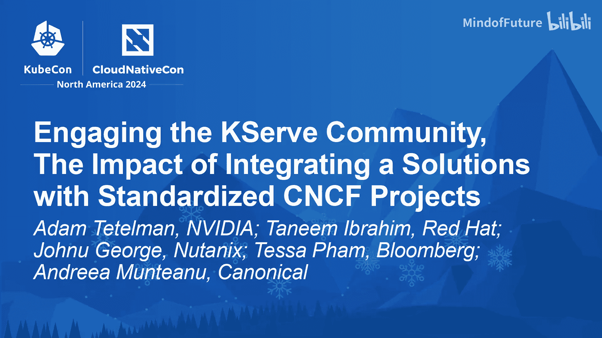

# 031：整合解决方案的影响与社区协作

在本节课中，我们将学习如何有效参与KServe开源社区，以及将解决方案整合到社区中所带来的广泛影响。我们将通过一个专家小组的讨论，了解社区协作的现状、挑战、成功经验以及对未来的展望。

## 专家介绍

大家好，我们将开始本次讨论。我们有五位小组成员，将用35分钟完成本次分享。首先，请各位进行自我介绍。

*   **Tenny Mibrahim**：我是Red Hat Openshift AI Engine团队的软件工程经理。我的团队在KServe社区、Kubeflow社区以及TrustyAI和模型注册表方面进行密切合作。
*   **Tessa Fam**：大家好，我是彭博社AI推理团队的软件工程师，也是KServe的贡献者。我的团队致力于为彭博社的数据科学家和工程师构建和维护推理平台。我们的团队负责人Danson在2019年共同创立了KServe。此后，我们团队对KServe做出了贡献，并将其集成到推理平台和其他内部项目中。
*   **Jon George**：大家好，我是Nutanix AI的技术总监。在日常工作中，我身兼两职。在Nutanix内部，我领导所有AI活动。在开源领域，我领导几个ML社区，包括Kubeflow和ML Commons。Kubeflow是Kubernetes上的MLOps平台。我是Kubeflow指导委员会的成员。在ML Commons，我们共同创立了ML Commons存储工作组，该工作组关注ML训练期间工作负载的存储影响。
*   **Andrea Montano**：大家好，我是Canonical的ML产品经理，Canonical是Ubuntu的发行商。我负责我们的AI/ML产品组合，其中包括已经提到的Kubeflow和KServe，以及其他工具，例如MLflow，以及旨在帮助开发者在Ubuntu工作站上快速入门的数据科学堆栈。
*   **Adam Tleman**：大家好，我是NVIDIA的首席产品架构师。我没有像小组其他成员那样为众多项目做出贡献，但我已经使用所有这些项目很多年了。我使用Kubeflow、KServe及其所有依赖项目。我们进行这次小组讨论的原因是，NVIDIA推出了一款新的AI应用程序产品，我认为将其推向市场并展示给用户的最佳方式是确保它在KServe和开源项目上运行良好。因此，我一直与在座的各位密切合作以实现这一目标。这次小组讨论正是关于在开源社区中协作的历程。

## 社区协作的现状与价值

上一节我们认识了各位专家，本节中我们来看看他们参与KServe社区协作的亲身经历、面临的挑战以及取得的成就，特别是在AI、LLMs和生成式AI等新领域。

**Andrea Montano**：我在开源领域活跃了相当长的时间。回顾过去，我最初面临的最大挑战是如何开始，特别是如果你想做出贡献，你该如何实际参与。感觉有很多优秀的开发者，但每个人对于需要做什么以及如何做都有自己的看法。这是在一个社区内成为贡献者的初始挑战。我注意到许多Kubeflow的新加入者也面临同样的困难，尤其是因为它是一个大型平台，最初并不容易上手。这常常令人望而生畏。因此，我非常享受与其他开发者合作，特别是帮助那些在ML领域和开源领域刚起步的人降低入门门槛，让他们真正感到舒适地提出问题、解决问题、询问疑问、改进文档等所有小事。此外，编写项目也很重要。我认为，拥有像Kubeflow这样强大的平台，如果没有能帮助你入门的项目，比如构建你的第一个模型、找到新的LLM或与Kubernetes和Kubeflow一起运行新模型，那么这些项目正是降低门槛、帮助人们入门的关键。

**Jon George**：我自己从一开始就参与了KServe。看到这个社区发展到如此规模，我感到非常高兴。感谢所有开发者，这一切始于在Kubeflow中训练TensorFlow模型，然后使用TFServing服务相同的TensorFlow模型。从那时起，它已经发展成为一个可以在任何基础设施上大规模运行所有这些大型语言模型的大型框架。最近，我们宣布了Nutanix AI，它以KServe为核心，提供一键部署你选择的大规模语言模型，而无需了解底层系统。如果没有像KServe这样的项目，这是不可能实现的，这是我们作为KServe社区一部分共同努力的成果。如果你仔细想想，它是由许多构建块组合在一起的，就像许多东西汇聚在一起，人们贡献不同的部分，然后整合到一个单一的项目中。所有这些不同的构建块，如果你看面向用户的API，它是开放推理协议的一部分。我们出于某种原因将其放在KServe之外，因为我们希望推理协议也能被其他社区使用。例如，A2I、VTrit等所有人都使用相同的推理协议，而KServe现在也完全实现了它。下一个领域是关于推理运行时，用户可以带来任何你选择的运行时，并通过一个YAML文件将其插入KServe，无需任何代码更改，无论是NVIDIA NIM、vLLM还是任何你选择的运行时。最后，整个堆栈可以在任何硬件上运行，无论是GPU、CPU、AMD加速器还是任何其他硬件。从某种意义上说，这是一个集体项目，是一个社区产品，可以将所有这些构建块整合在一起，这是KServe的核心优势。

**Tessa Fam**：我想从我的个人经历开始说起。我在2022年加入彭博社推理团队后不久，就向KServe做出了我的第一次贡献。我从为KServe贡献的多个PR中发现，整个过程令人惊喜地简单。贡献不仅计入我内部的工作，还能帮助其他公司面临相同问题的人们。识别问题非常容易，因为我们都在这里，我们都知道存在许多共同的挑战，我们都在努力解决。提出问题和提出自己的解决方案，提交给更广泛的KServe社区，获得PR审查、反馈并合并，这个过程非常容易。一旦你的更改生效，它将为你企业的产品解决问题，同时也会为你甚至不认识的其他许多人解决问题。我认为这就是我在开源社区中亲身经历的力量。谈到开源社区的独特好处，数不胜数。你首先要认识到，所有这些都是免费提供给我们的，我们以零成本从更广泛的社区获得最快的众包解决方案。这是你从需要付费且受供应商限制的企业产品中无法获得的首要好处。其次，一旦你参与到开源社区中，你会发现有如此多的协作在进行，每天都有很多创新，人们提出解决方案，聚在一起讨论问题。更酷的是，你正在与来自不同公司、从未谋面、如果只在自己公司工作就没有机会合作的人们协作。最后，仅仅利用更广泛社区的资源和人们聚集在一起的力量，不为别的，只为找到他们和其他人面临的问题的解决方案，你将找到更快的解决方案，更高效。同时，当你回馈社区时，你也会得到同样的回报。这些都是任何人从开源中获得的独特好处，无论是推理AI还是任何开源项目。但同时，也必须认识到其中的挑战，我想谈谈AI领域特有的挑战。

随着近年来LLM的蓬勃发展，模型变得越来越大，我们都希望优化资源和时间、模型启动时间等。作为一个社区，我们共同努力，并正在设计解决方案来解决这些问题。但对于KServe来说，为了使项目变得更好，我们必须同时解决所有这些领域的问题，而每个领域都需要深厚的专业知识。这就是为什么我们每天都在与不同的公司、合作伙伴和其他项目合作，以实现这些解决方案。

**Jon George**：说到Tessa提到的社区协作和开源力量，如果你想想我们最近启动的WG Serving社区，最近的一大成功是有超过250名成员加入了该社区。这是一个伞式项目，旨在解决LLM推理带来的挑战，以及如何在Kubernetes中以云原生的方式跨越多家公司解决这些问题。这是一个快乐的大家庭。另一个有趣的领域是网关项目，我们的彭博社朋友和其他人一直在密切贡献，因为大模型面临的挑战之一也是能够高效地路由它们。你如何知道将请求路由到哪个模型？有时你可能需要SLO、成本考虑，有些模型可能在CPU上推理效果很好，有些模型可能在GPU上效果很好。因此，你需要了解不同的加速器。我们与KServe社区密切合作的LLM实例网关项目是帮助解决这个问题的一种方式。对于语言模型，你必须考虑各种新的指标。如果你来自传统的预测性ML模型生命周期，通常你有CPU请求、线程命中数等常见指标。但对于语言模型，你必须考虑KV缓存利用率、批处理大小、排队令牌数等。这些类型的指标对于模型服务或推理工作负载来说是全新的。我们正在使用Kubernetes生态系统中已有的相同工具集，但我们正在为新型工作负载实现它们，并进行大规模部署。我还要说，最近另一个非常酷的成功是Red Hat一直在密切合作的一个项目，即Trust AI（负责任AI）概念。KServe有一个名为“explainer”的实现，你可以将解释器模型连接到KServe端点，并能够运行各种负责任算法，如LIME、SHAP、反事实解释等。我们正在努力为大型语言模型以及不同类型的评估（如LM Eval）添加这些类型的算法，以便你可以很好地评估你的模型。目前，这可以与VLM和KServe一起使用。这是一个非常有趣的项目，因为例如，模型变得越来越大，但你如何知道你的模型是否真的表现良好？仅仅因为你有一个400亿参数的模型，并不意味着它会满足你的工作需求。你的工作可能需要非常特定领域的任务，也许你是一家服务公司，有支持案例，你想进行案例总结，你可能不需要那么大的模型。像LM Eval这样的工具可以帮助你使用LM Harness工具包为你的特定用例评估这些模型。这是一个非常好的成功故事。我还要说，最近社区聚集在一起讨论如何通过有状态Pod集支持真正庞大的模型，并跨各种实现进行研究。我们研究了领导者-工作者模式、无状态部署、有状态Pod集，以及如何确保这些模型可以跨多个节点部署，因为其中一些大模型显然无法再容纳在一个节点中。这是社区协作解决的一个非常有趣的挑战，相关的PR最近也已合并。

**Adam Tleman**：是的，Tessa，说到你的观点，我记得在我真正深入社区之前，我就在使用这些工具，使用Kubeflow，那大概是五六年前，当时我试图教人们如何使用DGX并训练一个大型BERT模型。Jupyter不够用，因为我需要做流水线，而拥有Kubeflow，我可以直接使用它。它几乎能做所有事情。我能够在大约一周内制作一个研讨会，向人们展示如何训练一个LLM，那是在LLM还没有现在这么大的时候。从个人角度来说，结识你们所有人，进入这个领域，这很有趣。对我来说，这很有趣，我不仅仅是在与我公司的同事合作，还在与许多其他公司的人合作，这其中有乐趣，也有思想的分享。我看到我的世界和我在做的事情，但当我在与Red Hat、Canonical、Nutanix或彭博社的会议中，我了解到你们以略微不同的方式看待世界，所有这些方式都是有效的。思想的分享最终让我们能够解决各种各样的问题，我想你们两位都提到了，外面有大量的用例，我们需要为某些人解决所有这些问题。其中一些问题直到你们在讨论解决方案时展示给我看，我才意识到它们是问题。然后我意识到，是的，在这个层面的缓存对我来说在三个月或六个月内将非常重要，但你们已经解决了两个月，我可以在此基础上继续发展。所以这是一个巨大的胜利。在产品方面，NVIDIA在3月份推出了NVIDIA NIM，这是我们新的AI产品。当我们最初运行时，只有一个`docker run`命令，然后有人意识到我们需要将其部署到生产环境。所以我们为它构建了一个Helm chart。当我们去找客户时，他们说这很好，这是一个Helm chart，但我正在使用这个平台，或那个平台，或另一个平台。那个Helm chart在生产环境中就绪了吗？我关心的不仅仅是应用程序，我还关心所有这些平台级功能。而我正在开发的是一个应用程序，我不想关心那些平台功能，我想接入它们，但我不想实现所有功能。幸运的是，有一个完整的社区，人们正在以不同的方式实现它们，而我的客户已经是你们的客户。因此，进入KServe社区，与你们合作，围绕LLM实现API标准，实现安全性以及我们一直在研究的一些缓存功能，然后我最初与Red Hat合作进行了POC，让NIM在KServe和Openshift AI上运行，然后它在Nutanix AI、Charmed Kubernetes和所有其他平台上运行。所以它就这样工作了，现在我们所有人都从中受益，我受益，你们受益，我们所有的共同客户都受益。这种与开源社区合作的方式为我节省了大量时间，最终对每个人来说都是有趣且双赢的。我真的很享受这一点，我非常感激，我认为这是一件好事。

**Jon George**：只想补充一点，Adam谈到的所有这些构建块都是由社区自己定义的。都是社区的需求和社区贡献的功能。是的，在GitHub上。有趣的是，我们还没有完成。你谈到了WG Serving，我们现在有了它。我查看了一些会议记录，有一个很长的待办事项列表。所有这些新项目都在涌现，但这些项目有新的功能需求列表。我们有很多问题需要解决。作为一个社区，我认为我们需要团结起来，因为环顾KubeCon，我听到人们谈论他们如何以不同的方式一遍又一遍地解决同样的问题，每个人都想团结起来一次性解决它，这样我们都能受益。

## 未来展望与社区参与

上一节我们探讨了社区协作的现状与价值，本节中我们来看看未来的发展方向。有哪些令人兴奋的开源项目？有哪些具体的路线图项目？在LLM/生成式AI领域有哪些挑战？更重要的是，人们如何参与进来？我们如何提供帮助？因为我们在座的每个人都是社区的一部分，明年这个小组的成员可能就是在座的各位，来谈论他们如何取得了帮助他人的巨大胜利。

**Jon George**：太棒了，谢谢Adam，这是个很好的问题。谈到WG Serving，我们需要人手，我们有很多项目在进行中。如果你在CNCF Slack上（我希望你们都在），有一个WG Serving频道。加入这个频道，你一加入就会看到工作组下的一堆子工作组，主题包括LLM实例网关、LLM缓存项目（基本上是提示缓存）、围绕性能基准测试的项目（标准化如何为不同LLM和支持这些模型部署的不同运行时标准化性能基准测试），以及围绕安全的子委员会。如果你对这些领域感兴趣，那里正在发生各种有趣和令人兴奋的事情。回到你的观点，只有我们得到社区的帮助，这些事情才能发生。那里有太多的工作要做，而参与的人却很少，因此扩展对我们来说至关重要。我个人希望看到的是，也许明年我们谈论的不是如何让推理在KServe上工作，而是谈论更高一层，即我们如何将代理、生成式LLM框架、编排与KServe结合起来。因为推理和资源优化可能在一定程度上已经得到解决，不再是我们必须处理的问题。为了达到这个目标，我们需要在座各位的很多支持和帮助。传播信息，加入WG Serving频道，加入KServe频道，帮助我们加入社区。就路线图而言，我真正兴奋的是另一个项目，它并不完全直接在WG Serving之下，而是在WG Batch之下，即DRA项目（动态资源分配器）。如果你不熟悉，它允许你以声明式的方式为你的Pod分配GPU，就像你为存储声明PVC一样。想想那种相同的概念，但是用于GPU或任何加速器。有趣的部分是，你实际上可以利用分片GPU。也许你的模型是一个20亿或10亿参数的模型，因为它是一个非常专门的模型，你可能不需要消耗整个GPU。DRA允许你以某种方式分割GPU，你可以根据需要的比例进行分配。在此基础上，是另一个最近启动的项目，即即时切片，它允许你进行即时GPU切片。在DRA之上，即时切片使DRA的配置更加简单和容易。我对此感到非常兴奋，因为我认为一旦这个项目达到稳定状态，然后我们在其上运行KServe，并与vLLM社区密切合作，看看我们如何允许今天使用KServe的开发者为通过KServe部署的模型分配这些分片GPU，这将是一个非常令人兴奋的项目，我期待着它的发展。我也期待着LLM网关项目的发展。我认为一旦我们解决了这个问题，以及如何通过KServe进行路由并拥有一个抽象层，那也将使推理优化过程变得非常高效。

**Tessa Fam**：谢谢Tenny。我认为Tenny为这个问题设定了正确的主题。更具体地谈谈KServe，我们现在正在解决的一个共同主题是如何降低成本，如何降低服务成本并使其更高效。这是所有推理服务器、开源推理服务器现在都在努力解决的问题。有很多关于GPU分片和GPU时间切片的讨论，人们正在尝试寻找不同的解决方案。在KServe方面，我们确实有多个解决方案正在进行中或设计中。我可以举几个例子，我们可以为此感到兴奋，这些是我们在未来一年内将引入KServe的新功能。第一件事是，这些模型，所有的AOM模型都变得越来越大，我们需要减少模型启动时间，减少延迟。为此，我们提出了一个模型缓存的设计，目前正在进行中。我们有几个来自彭博社和其他公司的团队成员正在研究这个。自动缩放是KServe社区一直在与KEDA社区密切合作的另一个功能。KEDA是基于Kubernetes的事件驱动自动缩放器。这就是我们如何利用其他领域、其他社区的专业知识，共同为用户提供最佳解决方案。是的，所以KServe正在与KEDA密切合作以实现这个自动缩放功能。是的，另一件事是，如果你参加了今天早上的主题演讲，Tim也提到了AI网关，这也是一个令人兴奋的功能，我们期待拥有一个对LLM工作负载更高效的AI网关。是的，这些是目前正在进行的一些项目，我们确实需要人手。这将非常令人兴奋，你将与来自多个不同领域的专家合作。是的，现在是从事推理工作的激动人心的时刻。展望未来，我们也在努力解决提示缓存的挑战。很多人在这次会议上也在讨论提示缓存，这是我们开始设计解决方案的事情。总的来说，对于KServe社区，这些只是KServe和推理服务的一些令人兴奋的功能和增强，我们想给你一个预览。但作为一个社区，我们真的希望让更多的人参与到社区中来。这又是一个不断发展的社区，我们现在有很多大公司参与进来。我们希望让更多的公司参与进来，以便共同制定协议，让所有公司都采用这些通用协议，这样一切才能为每个人服务。是的，就是这样。我们也面临挑战，例如，随着不同公司的聚集，我们都有不同的优先级。如果我们只是参加这些社区会议，讨论所有人的需求和需求，那么我们就可以找到合适的资源来处理这些不同的工作流。是的，最后，是的，只是尝试参与开源。

**Jon George**：是的，我知道我们有很多令人兴奋的项目要做，所以很多项目，这是一个反复出现的主题。是的，关于未来。KServe在传统预测模型方面确实做得很好。所以在过去的一年里，我们正试图转向生成式模型领域。如果你看看所有传统模型，它们都是基于请求的自动缩放和请求指标，这对于传统模型非常有效。但在大型语言模型中，由于其规模、大小和架构，这并不容易，原因有很多。如果你看看大型语言模型，你可能收到一个0令牌的请求，下一秒你可能收到一个10000令牌的请求。GPU处理可能只需要10毫秒，但第一个请求，另一个请求实际上可能需要几秒到几分钟。因此，在LLM世界，特别是在生成式世界中，决定自动缩放和其他因素并不那么容易。换句话说，我们需要将令牌作为大型语言模型在新领域的一等公民。我们内部也在讨论，如何在KServe中集成基于令牌的自动缩放和基于令牌的指标，以实现更可靠的SLA，用于吞吐量和延迟。这是我们关注的一个主要焦点。类似于我们正在寻找的其他标准，再次是为了一个统一的通用指标接口。不同的运行时提供不同的指标，无论是NIM、vLLM，我们需要一个统一的指标接口，类似于我们拥有的推理协议，它可以决定运行时的性能，以及我们如何基于此决定自动缩放。KServe社区作为一个社区，我们可以共同决定我们需要做的正确抽象，甚至从指标和自动缩放部分开始，这样它就可以与下面所有不同的运行时一起工作。从用户的角度来看，他不需要知道任何东西，他只需使用标准的开放推理协议，所有事情都由KServe内部处理。

**Andrea Montano**：谢谢。我认为很多有趣的项目和功能已经被提到了，但补充一下Anil所说的，值得一提的是，作为社区，分享你使用项目或产品的经验对我们来说很重要。如果你一直在使用KServe、Kubeflow或任何其他工具，请与我们分享你的使用情况、遇到的障碍，因为这是我们最终提出功能、想法、项目和路线图的原因。就我个人而言，我喜欢参加KubeCon的另一个原因是，无论我们谈论的是Charmed Kubeflow、KServe还是上游的Kubeflow项目，我真的很喜欢听人们如何使用它，以及他们面临的挑战，因为这给了我们思考如何改进的素材。现在展望未来，我认为有两件事我们还没有在主流讨论中提到。一方面，我们需要更多地关注安全性，无论是KServe中使用的软件包的安全性，还是数据科学和机器学习中使用的项目的安全性，这是一个需要优先考虑的方面，以便能够在生产环境中推出许多项目。另一方面，改善用户体验和降低运行生成式AI项目、生成式AI模型和LLM的门槛将是另一个重点。最后但同样重要的是，如果我回到安全性的想法，让我非常兴奋的是在机密计算VM中运行Kubeflow，可能将来也包括KServe，这将使同一行业内的公司之间能够以完全不同的规模进行协作，我认为这也很令人兴奋。

**Adam Tleman**：Adam，我想你还有一些时间可以补充一些内容。是的，所以，总结一下，我知道你们提到了很多API网关、新功能，这些都是新的东西和路线图，我对此感到兴奋。稍微引申一下，也许回顾一下，我想我站在这里是因为我们取得了一次胜利，而到达这里有一件事非常困难，那是一个完全不同的话题，即说服内部人员开源是一条好路。我真的必须倡导KServe作为一个有用的平台，我真的必须向产品人员和工程领导推销。我需要去对他们说，嘿，这很重要，我们需要投入资源。我真的很期待未来，看到我们都在这里，看到人们接受它，现在我的客户有了平台选择、模型选择、AI选择，这只是给社区更多。我认为这是一次胜利，这将使我更容易回到高层领导那里说，嘿，让我们多做这样的事情，上次我们都赢了，让我们再做一次。我期待着看到更多的参与。我知道Chris Lamb昨天做了一个主题演讲，我希望能让我的团队中更多的人参与到更多的项目中来，这是好事，因为我想提到的另一件事是，有很多新东西我们需要引入开源。你提到了机密容器，这是一个硬件相关的事情，需要大量软件才能使其工作。你提到了多节点推理，我们现在已经有了第一版，但那是另一个硬件相关的事情，我的团队可以在高性能网络和高性能结构方面做很多事情，我们可以让多节点的东西运行得更快，我们可以让时间切片的东西运行得更快。所以我兴奋地看到，DRA是那个故事的一部分，所以我兴奋地看到很多这些东西结合在一起，使得越来越复杂的应用程序管理起来更简单、更高效。最后一件事，生成式AI应用程序正变得越来越复杂，所有这些部分，我们在这里有一个平台，我们有一个单一的推理服务器运行一个单一的模型，然后是Model Mesh，这样我们可以运行多个模型并混合使用，现在我们需要一些全新的东西，因为现在我们有了这些带有RAG的生成式AI应用程序，我们正在定义遥测标准和一些工作组，我们正在定义这些新的网关和其他工作组。因此，确实有这个社区，WG Serving社区确实跨越了许多不同的项目，我们都在努力弄清楚现在的问题是什么。现在是参与的好时机，因为我认为我们刚刚开始掌握所有问题，并开始将解决方案整合在一起。

## 如何参与社区贡献

我们还有时间回答一个问题。有人提问：参与这类MLOps工程工作需要什么样的技能？Python、Kubernetes，擅长某一项比另一项更好，你需要什么？

**Andrea Montano**：如果可以的话，我先开始。我认为这真的取决于情况，但例如在Kubeflow社区，我看到很多学生，他们只是非常优秀的Python工程师，非常热情，非常好奇，他们就这样开始了，边做边学。这可能具有挑战性，但同时也给你带来很多满足感。同时，我认为理解Kubernetes是一个基础部分，它将降低你在KServe方面的入门门槛，并加速你的贡献方式。

**Jon George**：我看到Tenny在点头表示同意。你想补充点什么吗？不，不，不，你来吧。我只想举一个例子。我的一些团队成员两年前对Kubernetes和KServe完全陌生。他们现在是KServe项目的评审者。所以这一切都是由兴趣和投入的努力驱动的，KServe社区欢迎每一个人，每一个人。

**Tessa Fam**：我想说，拥有技术技能显然对贡献非常有帮助，无论你是Python开发者、Go开发者还是MLOps工程师。但我们也需要很多帮助，即使是文档更新。如果你去KServe网站，有很多我们还没有能够添加到文档中的新功能。而这是新用户来使用KServe时首先会去的地方。所以，即使你能通过更新文档做出贡献，那也是一个巨大的贡献。所以我想说，在社区工作就是投入时间，这就是你贡献和帮助的方式。所以，如果你觉得，我不知道Go，我不懂ML，我怎么去贡献？这真的没关系，你可以以各种方式贡献，我们欢迎各种形式的贡献。

**Andrea Montano**：我同意这一点。我认为Kubernetes绝对是基础，只要你熟悉Python和容器，我认为你基本上就可以开始了。你懂什么编程语言并不重要。很多人从这些技术的最终用户变成了开源项目的贡献者。所以你真的可以从任何地方开始，只要你知道我们要解决的问题是什么，或者，是的，甚至只是提出一个问题，那就是一种贡献。

**Adam Tleman**：所以，是的，所以我认为你需要一种想要帮助的热情，我们会帮助你学习剩下的，这就是我刚才听到的。我想我们的时间到了，谢谢大家的参与。祝大家会议愉快。

## 总结

在本节课中，我们一起学习了如何有效参与KServe开源社区。我们通过专家小组的讨论，了解了社区协作的强大力量，它如何加速创新、降低成本，并为所有参与者带来共赢。我们探讨了社区面临的挑战，如降低入门门槛、应对LLM特有的技术难题（如模型缓存、自动缩放、令牌级指标），以及协调不同公司的优先级。同时，我们也看到了社区取得的显著成就，如WG Serving社区的壮大、新项目（如LLM网关、DRA动态资源分配）的推进，以及将负责任AI（Trust AI）集成到KServe中。最重要的是，我们明确了任何人都可以参与贡献，无论技能水平如何，从编写代码、改进文档到提出问题都是宝贵的贡献。未来，社区将继续聚焦于降低成本、提高效率、增强安全性，并简化生成式AI应用的部署与管理。我们鼓励所有感兴趣的人加入CNCF Slack的WG Serving和KServe频道，共同塑造云原生AI推理的未来。