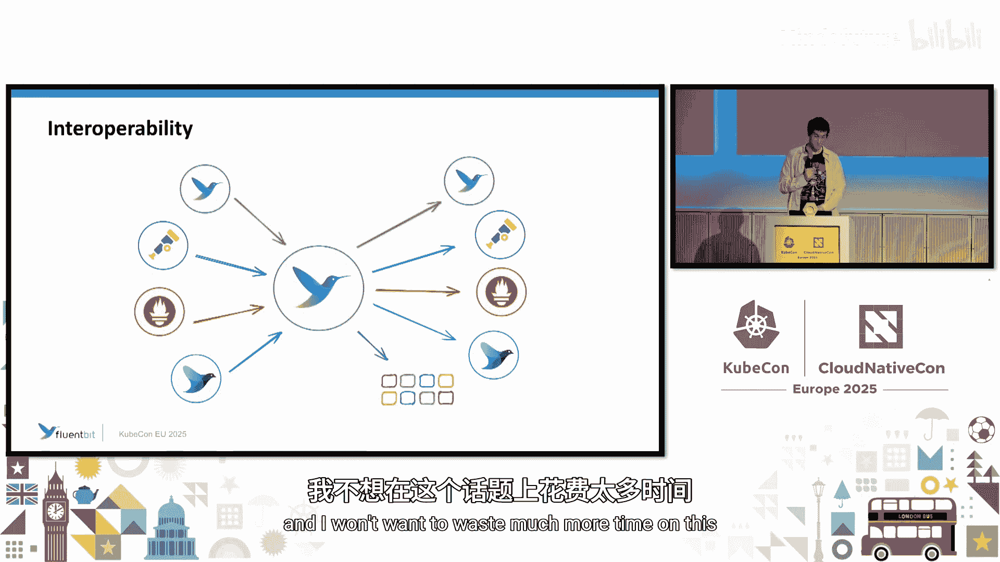

# 001：Fluent Bit v4 - 十年的创新与未来展望 🚀

在本教程中，我们将学习 Fluent Bit 的发展历程、核心设计理念，并重点介绍其最新版本 v4.0 带来的新特性。我们将了解 Fluent Bit 如何帮助我们在日益复杂的可观测性数据海洋中，以低成本、高效率的方式收集、处理和路由日志、指标与追踪数据。

---

## 引言与背景

感谢参加本次分享。我对于准时开始比较在意。

对于那些不得不等待的人，希望你们有机会拍下 Eduardo（项目负责人）大约 20 天后将要进行的网络研讨会的照片。那个研讨会内容会更丰富，比本次分享更详尽。

这些分享可以讨论历史，比如我们从哪里来，现在在哪里，以及未来去向何方。目的是为那些还不了解 Fluent Bit 或我们现状的人提供一个完整清晰的图景。

对于那些已经了解并期待 v4.0 版本的人，我们已于周一发布该版本。我将介绍一些我们刚刚引入的新功能，以及我们希望在近期和长期未来引入的功能。

---

## 可观测性领域的挑战

你可能知道，遥测领域在过去十年甚至更长时间里一直在演变。趋势是数据量呈指数级增长，我们生成的数据越来越多，类型也越来越丰富。仅仅十年前，我们基本上只处理日志，而如今我们从日志到追踪再到性能剖析数据，无所不包。

因此，情况只会变得更加复杂和繁忙。这意味着我们需要格外关注，以便能够利用这些数据，而不是仅仅花钱存储我们不关心的东西。

我想我们都能想象出我们脑海中的图景，就像那个关于真空室里备用椰子牛的玩笑。当我们想到日志、指标和追踪时，我们想象的是我们将分析数据、从中提取价值并感到满意的画面。然而，现实并非如此。

现实情况通常非常混乱，并且每天都在变得更加混乱。我们收到日志、指标、追踪。每个都有不同的标准，有些有自己的标准，有些可能来自旧时代。我们需要理解这些数据，以便提取价值，否则这一切就毫无意义。

我想，当面对这种情况时，感到不知所措的不止我一个人。这就像，我该拿这些数据怎么办？所以我们往往会选择视而不见，任其堆积。

问题在于，我们仍然在为此付费。解决这个问题的一部分方案实际上是理解这些信息，或者以我们想要的方式处理它。我们希望以有意义的方式消费信息，处理它以便我们不把所有东西都发送到所有地方，并且我们希望以更低的成本完成，因为这不是我们想要支付的成本。这就是 Fluent Bit 重要的原因，也是我们正在努力做的事情。我们试图构建一个系统，在处理数据时不会产生大量成本。

---

## Fluent Bit 的起源与设计哲学

如前所述，我们来自一个非常分散的环境。回想过去，当我们只有少数几个收集器，只讨论日志时，所有或大部分数据都是结构化的。因此，要找到一个能按你所需的方式工作的工具相当困难。这就是 Fluent Bit 的由来。

Fluent Bit 的理念是拥有一个与供应商无关的系统，可以获取你想要的任何数据，并将其发送到你想要的任何地方。对我们来说，拥有非常广泛的输入和输出集成至关重要，这样你就可以以现有的格式获取数据，并将其以你想要的格式发送到你想利用它的地方。

我认为我们已经实现了这个目标。我们拥有非常广泛的集成集，支持从日志、指标到追踪的所有内容。我们可以从本地系统获取它们，也可以从遗留系统获取，你可以将你的系统日志接入，可以从 OpenTelemetry 端点获取，可以从 Prometheus 获取，选择非常多。

正如我提到的，Fluent Bit 诞生于需求。它不仅仅是试图以我们认为正确的方式重新发明轮子。十年前，行业需要一种轻量级、没有 CPU 和内存开销的工具，尤其是在物联网领域，那时我们并非每个设备都有树莓派，我们没有千兆字节的内存，可能只有几千字节，也没有八核处理器，可能只有几兆赫兹。这就是 Fluent Bit 早期的主要驱动力之一。

显然，物联网热潮并没有持续太久。但我们为 Kubernetes 社区找到了新的家园。在 Kubernetes 中，即使你可能有一些备用资源，你仍然希望使用不会增加账单的工具。你想要快速、内存占用低、能以最低成本完成你所需工作的工具。这就是我们试图通过 Fluent Bit 实现的目标，并且我们试图以一种不将你锁定在任何供应商或平台上的方式来实现。

作为维护者，对我来说，主要目标之一是服务于社区。我们希望你能在任何生态系统中使用 Fluent Bit。我们希望你能与任何其他现有项目集成。

我认为每个项目都有其价值和位置，我喜欢与它们协作。我认为这不是关于取代它们，而是关于集成。我认为这关乎用户，用户必须选择什么对他们更好。

Fluent Bit 是 Fluent 家族的一部分。Fluent Bit 和 Fluentd 来自同一个地方，属于同一个保护伞下，它们都是 CNCF 的毕业项目。我稍后会再谈这一点，但重要的是要知道我们正在努力改进这种状态，以便为用户提供清晰的信息。

---

## Fluent Bit 的核心能力

回到 Fluent Bit。我们拥有非常广泛的集成安排。你可以使用系统日志，可以处理本地文件，可以处理 Kubernetes。例如，我认为 Kubernetes 社区的一个主要用例是将 Fluent Bit 设置为 DaemonSet 或 Sidecar，从节点获取日志并将其塑形到某个地方。但我们还有 Kubernetes 事件插件，可以让你更深入地了解你的 Kubernetes 集群。

我们还有 Kubernetes 过滤器，允许你用关于集群、服务、命名空间等信息来丰富你捕获的日志。

在输出端，你当然可以灵活地将数据存储到 Splunk、Elasticsearch、PostgreSQL、Datadog 等任何地方，可以发送到 Chosphere（现在赞助 Fluent Bit 的公司），或者发送到任何其他端点，比如 AWS S3 驱动等。我相信这里能满足各种需求。如果没有，我希望听到你的反馈，因为我们认为收集社区需求是最重要的。

我认为 Fluent Bit 可以以不同的方式或多种方式运行。在这个例子中，Fluent Bit 运行在裸机、容器或虚拟机上。我们有操作系统的软件包，有容器镜像，甚至有一个 FreeBSD 移植版（这不是 Linux，但很有趣），我们也有 Windows 安装程序。

Fluent Bit 拥有一个非常有趣且灵活的路由系统。我认为这是 Fluent Bit 的强项之一。你可以以非常动态的方式决定数据的去向，甚至可以基于数据的来源在运行时决定。

在这个例子中，我们有几个以相当简单方式设置的 Fluent Bit 实例，但还有一个设置得更复杂一些。同样，我们可以将 Fluent Bit 作为聚合器运行。你不需要在本地收集日志、指标或追踪，也可以从其他系统接收它们。你可以从其他 Fluent Bit 实例接收，也可以从任何 Fluent 兼容的生产者接收，甚至可以从 Prometheus 端点接收。也许你有一个需要抓取的 Prometheus 端点的应用程序，或者一个产生 OpenTelemetry 追踪的应用程序，甚至是一个你无法替换的遗留系统。你可以使用 Fluent Bit 将所有信息集中到一个中心位置，在那里你可以以与供应商无关的方式进行处理。一旦数据进入 Fluent Bit，无论指标来自 Prometheus、OpenTelemetry，还是你使用日志转指标插件自己转换的指标，它们都是一样的。你可以对所有指标进行相同的处理。

日志转指标插件是一个你可以用来将以文本格式呈现的指标转换为适当指标上下文的插件，然后你可以对其进行操作并发送到正确的地方。这很有趣。我知道你们中有多少人熟悉像 iostat 这样的工具，我认为这是此插件的一个用例。

正如我所说，互操作性是我们的主要关注点之一。

---

## Fluent Bit v4.0 新特性详解

现在，我将详细介绍 Fluent Bit v4.0 的新特性，以便你在使用的平台更新到 v4 或你自己更新到 v4 后知道要关注什么。

我们在追踪处理领域做了一些改进。我们现在有了追踪采样功能。这是我们创建的一个新处理器，允许你对收到的追踪进行降采样。

这个新处理器有两种操作模式。一种称为头部采样，这是概率性的。这意味着你定义的是追踪被存储或丢弃的概率。在我这里的例子中，我们设置了 40% 的概率，你可以看到很多跨度被丢弃了，只有这些最终到达了终点。

我认为这很有趣，并且在与追踪采样处理器的另一种操作模式结合使用时可能非常有用。

另一种操作模式是尾部追踪采样。这意味着你设置一个时间窗口。处理器会缓冲摄入的跨度，直到该窗口过期。这样做的目的是确保在决定是否保留追踪之前，你拥有完整的追踪视图。

假设你有一个网络商店，你想在交易失败时保留追踪。你可以使用 OpenTelemetry 追踪中的状态字段或追踪中的某些属性来实现这一点。在那个用例中，也许你最感兴趣的是存储那些在调试问题时能提供重要信息的追踪，因为你希望尽快获得可操作的信息来解决问题，因为时间就是金钱。

但你有一小部分与失败相关的追踪，还有一大部分与成功相关的追踪。在那个场景中，我会结合使用尾部追踪采样机制来确保我们保留 100% 的失败追踪，同时使用头部采样处理器来确保我们保留一定比例的成功追踪，因为你仍然需要了解情况，但你不想存储所有成功追踪，因为存储它们需要成本。

在 v4 中，我们还为处理器添加了一项新功能，称为条件处理。这允许我们根据一组约束条件来决定是否要对一条信息执行某个处理器操作。

这很有趣，因为在原始的管道模型中，你有输入、过滤阶段和输出。当然，你可以使用路由系统为每个过滤器选择要处理的内容。但处理栈旨在通过将过滤器和处理器直接附加到输入来允许你扩展到更高的程度。在 v4 之前，你无法确定处理栈中的某个元素是否对某条信息执行了操作，这在试图利用处理栈的优势时是一个限制因素。

然而，有了条件处理栈这个新功能，你可以拥有与过滤器相同的灵活性。好处是，关于一条数据是否应该被处理的决策，不仅仅基于路由信息中的标签，而是基于信息本身的上下文。你根据数据本身来选择是否要对其执行操作。

我们做的另一个改进是为 TLS 层添加了一些选项，允许你设置要与 Fluent Bit 交互的最小和最大 TLS 版本。在某些特定部署中，你可能希望确保不与旧版本交互，以防止降级攻击等，或者你可能公司有相关要求。密码套件也是如此。你可能希望确保不允许对端强制你协商可能具有漏洞或以任何方式被破解的较弱密码。这就是这个功能的目的。

我们还引入了一个系统，用于从文件系统中摄取文件内容到配置中所谓的“环境变量”中。这将允许你不必在配置或 ConfigMap 中硬编码一些秘密，而是能够将它们部署在文件中。我认为对于 Lua 脚本用例来说，这很有趣，因为你也应该能够使用此功能从文件系统加载你的 Lua 脚本，这应该会使你的 ConfigMap 更加简洁。

我们还引入了 Zig 语言集成。我不知道你们中有多少人熟悉 Zig 语言。它是像 Rust 那样的新语言之一。但 Rust 更侧重于安全方面，Zig 更像是一种低级系统语言，并且侧重于性能以及安全，但更侧重于性能本身。目前我们只支持用 Zig 编写输出插件，但将其扩展到输入插件、处理器、过滤器以及自定义插件是我们路线图的一部分。

---

## 未来展望

关于现在和未来，我们打算做的是扩展我们的集成。我们希望为所有当前支持的语言提供适当的、符合语言习惯的原生集成，包括 Rust、Zig 和 Go。我们希望它们是功能齐全的，希望你能以符合语言习惯的方式使用这些语言编写插件。

我们希望你能编写输入、处理器、过滤器、输出和自定义插件。我想特别说明一下，因为你们中有些人可能不知道什么是自定义插件。这些插件并非专门用于在管道中操作数据，而是用于执行其他任务，如文件管理或 TLS 证书管理。

我想告诉你们一些我认为非常酷的事情，并且我非常希望社区中有人能参与进来并创建这样的插件。例如，改进 TLS 证书的处理方式。我相信你们知道 CNCF 中还有一个名为 cert-manager 的项目。如果我没记错的话，当前的一个趋势是使用更短生命周期的证书。因此，我很希望看到 Fluent Bit 中有一个功能，可以将其与 cert-manager 集成，以便在每次部署时获取短期证书，而不是必须将证书作为 ConfigMap 的一部分进行部署。

我们还想引入在单个 Fluent Bit 安装中运行并行管道的可能性。

但我想，如果你参加 Roger 在 24 号举办的网络研讨会，你会对未来的图景有比我这里描绘的更清晰的了解。

---

## 问答环节

**问：** 你谈到了存在大量噪音数据，不一定希望全部发送和保留。你认为 Fluent Bit 在哪些方面可以帮助解决这个问题？或者你认为它未来会在这方面提供帮助吗？

**答：** 一种方式是通过新的追踪处理器来丢弃你不需要的数据，即条件采样。对于日志，有许多过滤器。你可以修改日志的部分内容，可以确保不发送任何个人身份信息。实际上，我会将条件处理系统与内容修改处理器结合使用来实现这一点。这只是众多方式之一。你还可以利用系统中的指标来帮助你定义规则。例如，我可以在条件中使用变量吗？比如计数到 100 然后停止发送某些内容，类似阈值这样的？我认为可以，但我想了解更多关于这个用例的信息。也许你可以加入 Fluent Slack 服务器，我们可以就此进行讨论。如果目前无法实现，我希望知道，以便我们能够实现它。

**问：** 随着 Fluent Bit v4 的新功能，这是否让 Fluentd 显得有些多余？

**答：** 我认为这不是关于 v4 的新功能。我总是以诚实的免责声明作为这个问题的回答开头：我不喜欢说其他项目的坏话。我可能错了，但我认为 Fluentd 更多处于维护状态，而不是真正在创新。我不认为 Fluentd 能处理指标或追踪，我也不认为他们有计划采用 OpenTelemetry 模型或继续在那个领域创新。因此，在我看来，这是推动 Fluentd 被 Fluent Bit 取代的因素。

**问：** 如果我理解错了请纠正，但考虑到日志处理的新功能，你会说现在不鼓励使用自定义 Lua 脚本了吗？因为有些操作你现在已经可以使用这些新功能完成了，对吗？

**答：** 我认为凡事都有其适用的场合和时间。Lua 脚本是你可以以最小开销添加到配置中的东西，不会花费你太长时间，你只需要编写 Lua 脚本并将其放入配置中。如果你想编写自定义插件，无论是处理器、过滤器、输入还是输出，你都必须用适当的语言编写并构建它。我不是说这是一个非常漫长的项目，但它会比仅仅在配置文件中编写 Lua 脚本花费更长的时间。在我看来，那些 Lua 脚本并不是真正的问题，因为它们是即时编译的，所以相当快。如果是我来做，我可能会从 Lua 脚本开始，然后花时间编写一个合适的插件来实现，因为当然，插件会更快。我想我之前没有特别提到，但目前我们有一些集成：你可以用 C 编写插件（可能没人想用），可以用 Go 编写，可以用任何能编译成 WebAssembly 的语言编写（比如 Rust），也可以用 Zig 编写。当然，Lua 脚本也能完成工作。我认为如果你能使用常规的东西、构建模块、条件处理，那会快得多。

---

## 总结

在本节课中，我们一起学习了 Fluent Bit 的发展背景、其应对现代可观测性数据挑战的设计哲学，以及 v4.0 版本带来的重要新特性，包括追踪采样、条件处理、TLS 增强和 Zig 语言集成等。Fluent Bit 作为一个轻量级、高性能、供应商无关的数据收集与处理引擎，旨在帮助用户以更低的成本从混乱的数据中提取价值。其强大的路由能力、广泛的集成生态以及对社区需求的关注，使其成为云原生环境中处理日志、指标和追踪数据的强大工具。