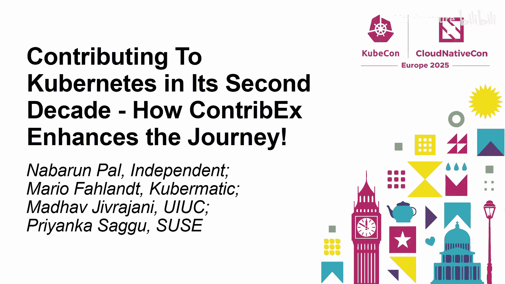
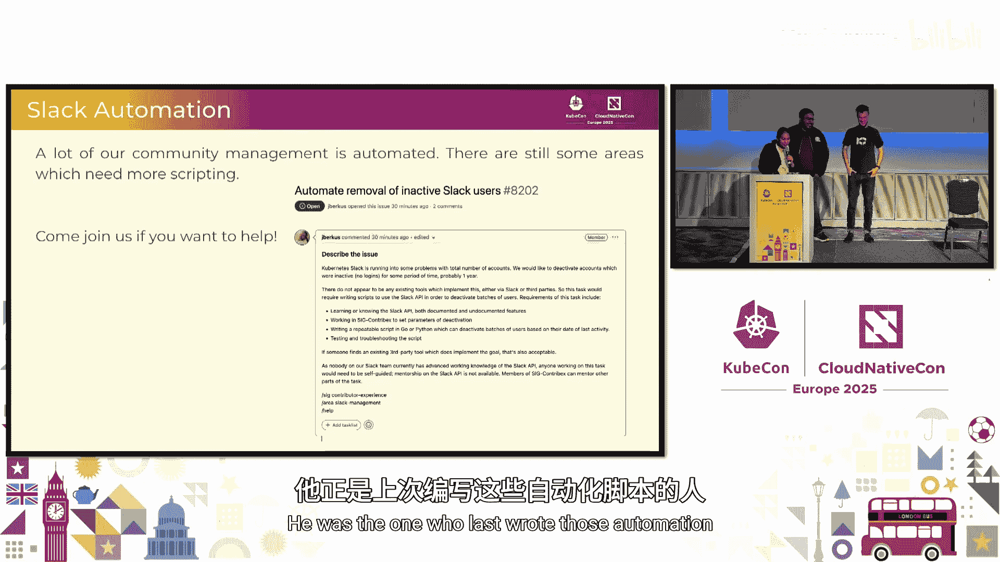
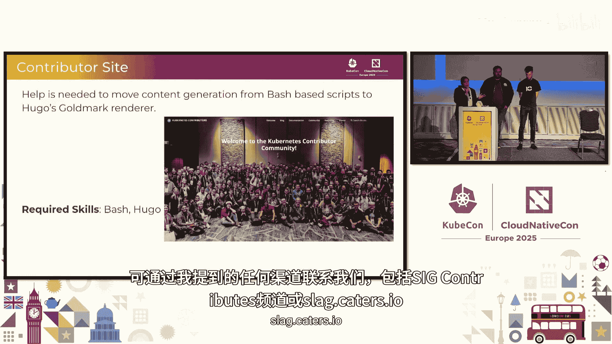
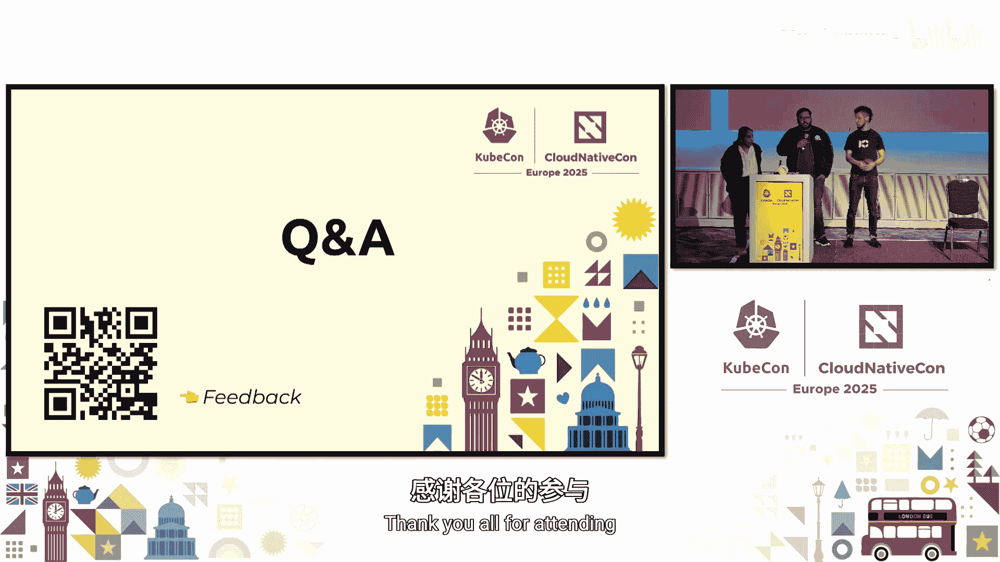

# 002：为 Kubernetes 做出贡献

在本节课中，我们将学习如何为 Kubernetes 项目做出贡献。我们将了解 Kubernetes 庞大的贡献者社区是如何组织的，以及贡献者体验特别兴趣小组（SIG Contributor Experience）如何通过一系列项目和流程来帮助新贡献者融入社区、降低贡献门槛。我们还将探讨社区当前面临的挑战和未来的计划。

## 社区概览与结构

上一节我们介绍了课程目标，本节中我们来看看 Kubernetes 贡献者社区的规模和组织结构。

Kubernetes 拥有一个庞大且活跃的贡献者社区。截至上周，项目在过去的11年中累计拥有约 95,000 名贡献者，贡献了超过 450 万次提交、代码审查等各类活动。这些贡献由项目历史上约 8,000 名审查者支持。这些数字仍在快速增长，预计到明年年底贡献者总数可能达到 10 万。

为了管理如此庞大的项目，社区建立了清晰的结构。社区主要包含三种类型的组：

*   **特别兴趣小组**：用深蓝色表示，负责项目层面的职责，横向维护项目的不同方面。SIG Contributor Experience 就是其中之一。
*   **工作组**：用浅蓝色表示，是短期存在的团队，有非常具体的目标和退出标准。一旦达成目标，其工作会并入一个或多个 SIG 的子项目中。
*   **委员会**：大部分通过选举产生。例如，指导委员会每年由活跃贡献者选举产生，负责代表社区并委任行为准则委员会成员。

在这些 SIG 和工作组中，我们大致将其分为三类：

*   **项目级 SIG**：负责维护项目的不同方面，贯穿整个项目。例如 SIG Contributor Experience、SIG Release、SIG Testing 和 SIG K8s-infra。
*   **横向 SIG**：横向贯穿整个 Kubernetes 项目的技术领域。
*   **纵向 SIG**：专注于项目的特定功能领域或紧密耦合的垂直领域。

社区的结构会根据需求进行增删。例如，服务设备管理工作组就是在去年相关需求出现时新成立的。

## 贡献者成长路径

了解了社区结构后，你可能会想知道作为新贡献者如何一步步成长为维护者。

贡献者的成长是一个阶梯式的过程：

1.  **非成员贡献者**：你可以从为项目的任何领域做贡献开始，此时无需是 GitHub 组织的成员。
2.  **成员贡献者**：在做出一些实质性贡献后，可以请与你合作过的审查者或贡献者作为担保人，推荐你成为组织成员。
3.  **审查者**：随着你在项目特定领域持续工作、审查更多代码，你可以成长为审查者。
4.  **批准者**：在审查者基础上，承担更高级别的代码批准职责。
5.  **子项目所有者**：负责特定子项目的方向和健康度。
6.  **子项目负责人**：领导子项目团队。
7.  **SIG 主席/负责人或工作组负责人**：承担 SIG 或工作组的管理职责。

这个过程需要时间，并且主要基于贡献质量、代码审查质量等定性因素，而不仅仅是贡献数量。

## SIG Contributor Experience 的职责

在介绍了贡献者成长路径后，我们来看看 SIG Contributor Experience 在这个生态系统中扮演的角色。

SIG Contributor Experience 的核心职责是改善所有项目贡献者的体验。我们通过创建和维护促进社区及成员发展的计划和流程来实现这一目标，旨在减少贡献过程中的任何摩擦。我们也会淘汰那些已完成使命或不再有效的旧计划。同时，当社区出现新的需求或倡议以改善贡献者健康度时，我们也会采纳并实施。

我们的工作从技术上划分为以下几个子项目：

*   **社区子项目**：负责 `kubernetes/community` 代码库及相关的文档和群组。
*   **贡献者沟通子项目**：负责在 Kubernetes.io 博客和 Kubernetes.dev 博客上发布所有公告、提醒和内容。
*   **贡献者文档子项目**：管理贡献者指南和面向 Kubernetes 贡献者的 `kubernetes.dev` 网站。
*   **社区管理子项目**：维护不同沟通平台（如 Discuss、Slack、GitHub）的政策。
*   **DevStats 子项目**：维护 Kubernetes 项目的统计数据，例如按地域或公司划分的贡献情况。
*   **选举子项目**：拥有并维护一个名为 `election` 的开源工具，用于社区选举。
*   **活动子项目**：负责组织 Kubernetes 贡献者峰会，并协助 CNCF 运行维护者峰会。
*   **GitHub 管理子项目**：负责组织成员流程和整个代码库管理配置。
*   **导师子项目**：运行诸如 LFX  mentorship 等项目，并在社区内组织导师计划，帮助新贡献者成长为审查者或维护者。
*   **Slack 信息子项目**：维护加入 Kubernetes Slack 的邀请机器人及相关工具。

## 从贡献者峰会到维护者峰会

上一节我们介绍了 SIG Contributor Experience 的各个子项目，本节中我们来看看社区活动的发展。

在过去的九年里，我们一直举办 **Kubernetes 贡献者峰会**。它通常在 KubeCon 前一天举行，让所有 Kubernetes 项目的贡献者齐聚一堂，进行非正式会议、社交和讨论。然而，这个活动只专注于 Kubernetes。

考虑到 CNCF 内有超过 200 个项目，我们意识到需要一个更广泛的平台。因此，我们发起了 **维护者峰会**。这个峰会汇集了来自所有 CNCF 项目的维护者，包括沙盒、孵化及毕业项目。我们还邀请了 CNCF 技术监督委员会和技术咨询小组的成员参与，旨在促进整个项目生态系统的协作，让新项目能从更成熟的项目（如 Kubernetes）中学习经验。

现在，维护者峰会得到了 CNCF 活动团队在后勤方面的大力支持，同时我们仍有来自社区的志愿者负责项目委员会和沟通工作。峰会还引入了正式的 CFP 流程和赞助机会，以便让更多维护者能够参与。

## 新贡献者引导计划

在介绍了面向所有项目维护者的峰会之后，我们回到如何帮助个体新贡献者融入 Kubernetes 社区。

对于新人来说，理解庞大的社区结构、SIG 和委员会是非常困难的。经常出现的情况是，新人在 GitHub 上找到一个标记为 `good first issue` 的问题，但实际上它并不适合新手。

为了解决这个问题，我们启动了 **新贡献者引导计划**。该计划的目标是带领想要贡献的人，向他们介绍社区结构和工作流程。我们每月在第三个星期二举办两次会议（分别适应美洲和亚太/欧洲时区），每次会议约 1.5 小时。会议包括 40 分钟的内容介绍和 20 分钟的问答环节。

会议内容涵盖：
*   Kubernetes 项目欢迎介绍
*   无线 Kubernetes 社区结构
*   贡献工作流程指导
*   常见的贡献者陷阱（例如 `good first issue` 可能并不简单）

我们跟踪会议的参与数据，虽然初期增长后略有下降（主要由于沟通宣传不足），但我们持续有新人加入。我们承诺会改进沟通和内容，以更好地帮助新人。

## 沟通渠道与统计数据

在介绍了帮助新人的计划后，我们来看看 SIG Contributor Experience 如何与社区内外进行沟通。

SIG Contributor Experience 与 SIG Docs 合作，负责维护两个主要的博客渠道：

*   **Kubernetes.dev 博客**：在 2024 年发布了 14 篇博文，此外还有 SIG Spotlight 系列博文，用于介绍其他 SIG。
*   **Kubernetes.io 博客**：在 2024 年协助发布了 45 篇博文。

在社交媒体方面，我们运营着面向最终用户和贡献者的不同渠道：

**面向最终用户的渠道：**
*   **LinkedIn (`Kubernetes`)**: 自 SIG Contributor Experience 的贡献者沟通团队接管以来，粉丝增长约 147%，发布帖子增长约 985%。
*   **X (`Kubernetesio`)**: 拥有相应的统计数据。
*   **Bluesky (`Kubernetes`)**: 自 2024 年 11 月 4 日以来，已拥有 6000 多名关注者。

**面向贡献者的渠道：**
*   **X (`k8scontributors`)**: 由于社区逐渐转向 Bluesky，该账号活跃度下降。
*   **Bluesky (`Kubernetes`)**: 自 2024 年 11 月 4 日以来，拥有 300 多名关注者。
*   **Mastodon**: 我们也在此平台设有账号。

我们要感谢所有出色的贡献者，特别是近期在维护者峰会、博客维护、基础设施等方面提供帮助的各位。

## 需要帮助的领域与如何参与

在展示了我们的工作成果后，我们也要坦诚地指出当前需要帮助的领域。

社区的健康运转离不开更多志愿者的参与。以下是几个急需帮助的领域：

1.  **Slack 自动化**：我们的大部分社区管理工作希望实现自动化，但当前缺乏维护者。如果你对此感兴趣，可以联系 Slack-infra 子项目的管理员。
2.  **选举工具 (`election`)**：这是一个用 Python Flask 编写的内部工具，每年用于两次选举。我们需要帮助进行代码加固、测试重写或扩展。如果你熟悉 Python/Flask 或想学习，这是一个很好的机会。可以联系 SIG Contributor Experience 或 Slack 上的 `#elections` 频道。
3.  **贡献者网站**：我们依赖 Hugo 静态站点生成器和 Docsy 主题来运行博客，但目前主要依靠一位维护者。我们需要更多帮助来维护贡献者网站的基础设施。可以关注相关代码库并联系我们。
4.  **导师子项目**：我们需要更多志愿者来帮助构建结构和运营导师计划。如果你擅长引导或管理任务，这里需要你的帮助。

除了这些特定领域，社区中总有许多临时性的工作需要完成。最好的参与方式是加入我们的双周会议（分别在 APAC/EMEA 和 US 友好时区举行）。在会议上，我们会逐一讨论各个子项目的进展。

## 资源与总结

在本节课的最后，我们为你汇总了所有有用的资源，并做总结。

以下是一些关键资源：
*   **K8s 社区书签**：无论是新人还是老手，这都是了解社区动态、SIG 和工作组的绝佳资源。
*   **Slack (`slack.k8s.io`)**：使用此链接加入 Kubernetes Slack 社区。`#sig-contributor-experience` 是主要的讨论频道。
*   **邮件列表**：通过 Kubernetes SIG Contributor Experience 邮件列表可以获取会议邀请和信息。

我们承认，开始为 Kubernetes 做贡献可能并不容易，甚至令人沮丧，我们大多数人都有过类似经历。关键是坚持下去，观察他人，跟随他们的脚步或从中学习开创自己的道路。如果需要帮助，SIG Contributor Experience 就是寻求帮助的地方。如果我们自己无法直接解决，我们会确保为你找到合适的资源或引荐给正确的人。新贡献者引导计划和我们的双周会议也是为此而设。

本节课中我们一起学习了 Kubernetes 贡献者社区的规模与结构、贡献者的成长路径，以及 SIG Contributor Experience 在改善贡献体验方面的核心工作。我们了解了从贡献者峰会到维护者峰会的发展，认识了帮助新人的引导计划，也看到了社区丰富的沟通渠道。最后，我们明确了社区需要帮助的领域，并为你提供了参与进来的具体路径。感谢你的参与，我们期待在社区中与你相遇、交流或合作！