# 003：云原生控制平面框架介绍与深入探讨

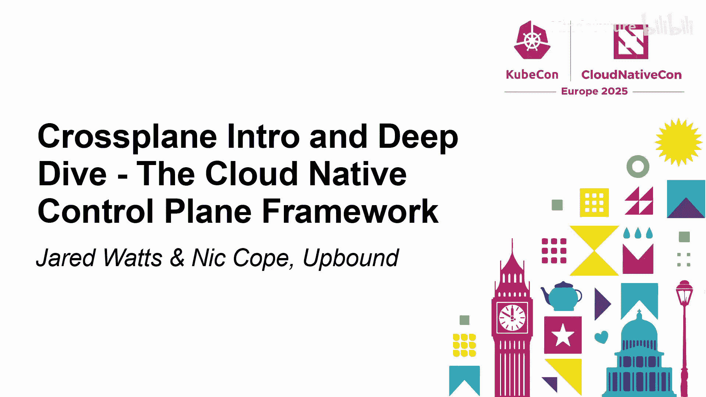

在本节课中，我们将要学习 Crossplane 的核心概念、工作原理以及其最新版本 V2 的重大更新。我们将从基础概念开始，逐步深入到如何使用 Crossplane 构建平台，并了解 V2 版本如何使其变得更简单、更强大。

## 什么是 Crossplane？

Crossplane 是一个云原生控制平面框架。你可以使用它来配置和管理所有资源。你可以将这些资源组合成更高级别的抽象，并将这些抽象提供给开发者，使他们能够自助服务，获取所需的资源。Kubernetes 是容器的优秀控制平面，而 Crossplane 则扩展了 Kubernetes，教会它如何管理其他一切。

控制平面并非新概念。云提供商多年来一直在其后端运行控制平面。现在，Crossplane 为你提供了构建自己的控制平面和平台所需的框架和工具。

## 核心构建模块：托管资源

Crossplane 的基本构建模块被称为“托管资源”。

想象一下所有不同的云提供商、SaaS 产品、本地软件等，有成千上万种不同的资源和服务。Crossplane 的目标是将这些资源引入 Kubernetes 控制平面，并允许你从控制平面进行配置和管理。

在实践中，我们来看一个简单的例子：想象一个 S3 存储桶。Crossplane 在 Kubernetes 控制平面中将其表示为一个 API 对象。就像任何其他 API 对象一样，它有一个 `spec`，你可以在其中以声明式配置指定这个存储桶的期望状态。然后，Crossplane 会获取这个期望状态，并将其应用到现实世界，最终创建一个 S3 存储桶。

就像任何行为良好的 Kubernetes API 对象一样，它们也有一个 `status`，用于提供外部真实资源的观测状态、条件以及描述生命周期历史的事件。

Crossplane 中有成千上万个这样的资源，它们都是行为良好的 Kubernetes API 对象。

## 工作原理

其工作原理可能如你所料。想象一下，你作为用户，将这个存储桶清单应用到控制平面的 API 服务器（可能通过 GitOps 等方式）。Crossplane 中有一组控制器在监视并主动协调这些资源与真实世界。例如，S3 控制器会从 API 服务器接收到事件，看到有人期望一个存储桶的状态，然后使用 Amazon API 与 AWS 通信，在现实世界中配置该存储桶，使实际状态与期望状态匹配。

## 从构建模块到平台：组合

上一节我们介绍了 Crossplane 的基本构建模块——托管资源。现在，让我们看看如何将它们构建成一个实际的平台。

“组合”的概念在 Crossplane 中至关重要。它允许你获取这些细粒度的资源，将它们组装、组合成更高级别的抽象。然后，这些抽象就是你提供给开发者的东西。

例如，如果你想将 GKE 集群、节点池、网络子网等组合在一起，然后将其作为一个简单的集群抽象提供给开发者。你给他们一些有限的配置选项，他们就能够根据平台团队的“黄金路径”配置工作负载集群，而所有底层基础设施的复杂性都被隐藏起来。这为开发者提供了更轻松的体验，使他们能够快速投入生产。

所有这些都基于 Kubernetes API，因此任何了解 Kubernetes 的工具都可以与 Crossplane 兼容。

## 平台 API 与组合逻辑

让我们通过一个图表来可视化这个过程。请注意，这部分在 V2 版本中会有所变化，稍后 Nick 会详细介绍。

在图表中间，作为平台工程师，你需要为开发者定义你的平台 API。你需要指定模式和你希望提供给他们的配置选项——即你向开发者暴露的抽象。在底层，你必须定义一个“组合”——即逻辑：你要组合哪些资源以及如何组合它们。

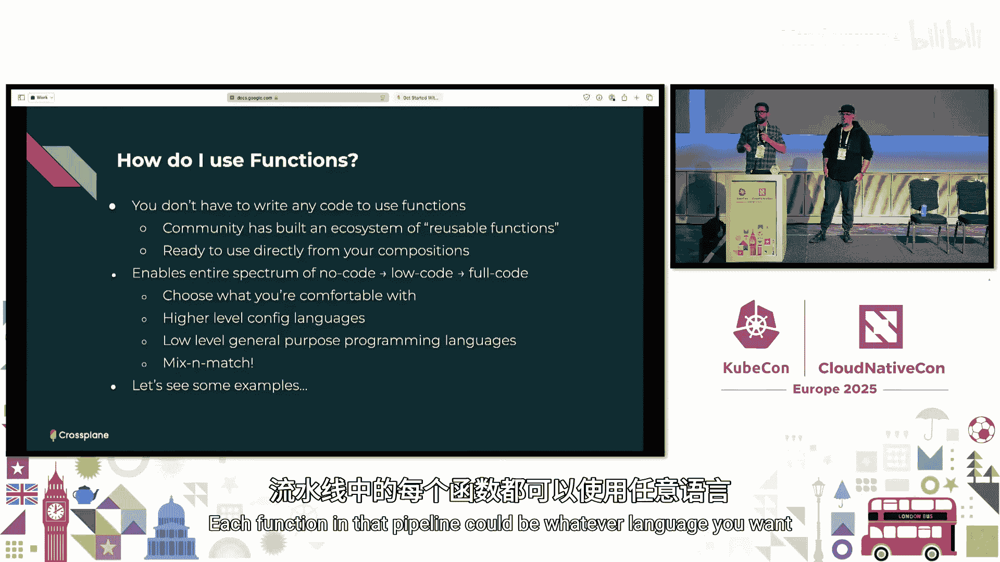

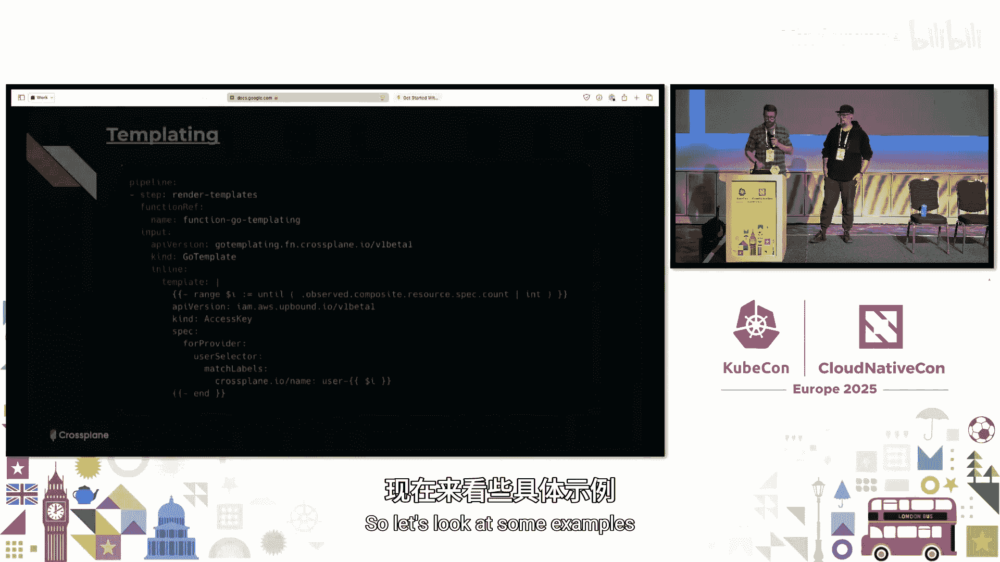

让我们看一个例子：假设你作为平台工程师，想向开发者暴露一个数据库平台 API。你需要定义该 API 的模式（即你想给开发者哪些配置选项）。然后，你的开发者来了，她可能只想创建一个“小型 Postgres”实例。底层的复杂性被抽象并隐藏在你的平台中。

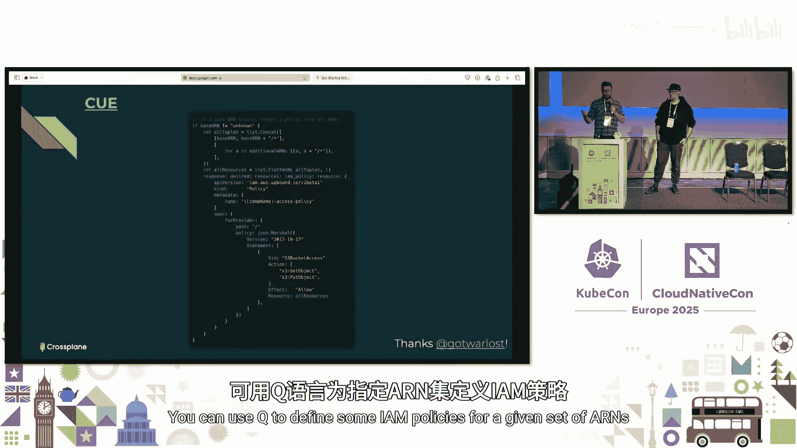

在运行时，对于这个“小型 Postgres”，你可能有一个 GCP 组合、一个阿里云组合、一个 Azure 组合，或者根据成本（便宜/昂贵）或服务等级（银牌/金牌）定义的不同组合。对于 GCP 组合，它可能对应 CloudSQL、SQL 用户、全局地址连接等资源。

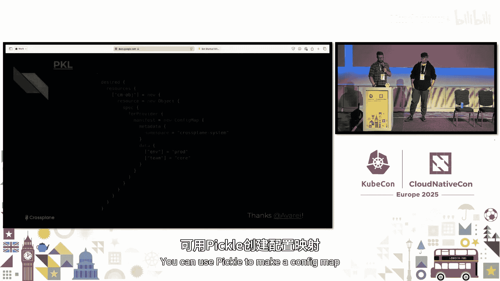

## 如何定义平台 API 和组合逻辑

让我们更详细地看看如何实现这一点。

要定义平台 API 的形状，我们使用“复合资源定义”。你基本上是在定义自定义 API 组，扩展 Kubernetes，为 Kubernetes 提供一个新的 API。你可以定义 API 组、种类以及模式（即你希望开发者拥有的配置选项）。

然后，你必须编写逻辑：你想组合哪些资源，以及如何组合。在 Crossplane 中，我们通过运行一个函数管道来实现资源的组合，这非常重要。

## 组合函数

让我们谈谈函数，因为它们至关重要。

在 Crossplane 中，你运行一个由简单函数组成的管道，这就是你组合资源的方式。对于所有这些函数，你基本上可以使用你选择的编程语言。现在支持多种语言。但关键部分是，你只需要专注于为你的平台编写独特的逻辑——你的“黄金路径”、对你重要的配置。让 Crossplane 处理其他所有事情，比如管理生命周期、繁重的工作、垃圾回收等。你只需编写一个简单的函数管道。

当我说“函数”时，你可能会想到需要自己编写代码。但事实并非如此。Crossplane 社区已经构建了一个由可重用函数组成的完整生态系统。关键要点是，所有这些函数基本上都为你提供了在 Crossplane 中表达逻辑和构建平台的各种新体验。这里有一个完整的谱系：无代码、声明式、低代码、全代码……无论你最习惯哪种方式，都可以使用。它们不会强迫你采用某一种特定的平台构建方式。使用你最熟悉的语言，可能是高级配置语言，也可能是低级通用编程语言，这都没关系。使用你想要的，而且你不必只局限于一种语言，管道中的每个函数都可以是你想要的任何语言，所以你可以混合搭配，以你最舒适的方式构建平台。

以下是几个函数示例：

*   **模板函数**：可以定义可变数量的访问密钥。
*   **Python 函数**：如果你喜欢 Python，可以用它来定义 S3 存储桶。
*   **KCL 函数**：KCL 是一种相对较新的 CNCF 配置语言，可以用它来为可变数量的区域定义 EC2 实例。
*   **CUE 函数**：可以用它来为给定的 IAM 角色集定义一些策略。
*   **Go 函数**：可以下降到像 Go 这样的通用编程语言。一旦你开始使用通用编程语言来定义和构建平台，你就可以开始使用该语言的原生工具，如单元测试、测试框架、代码检查、自动完成、语言服务器等，帮助你像软件项目一样定义平台。

选择权在你手中。

## Crossplane V1 的最新进展与 V2 的未来

上一节我们介绍了如何使用函数构建平台。现在，我们来看看 Crossplane 项目本身的进展。

Crossplane 的最新发布版本是 1.19（大约在 2025 年 2 月）。我们专注于持续完善 Crossplane，使人们正在采用的关键 API 和功能更加成熟。例如，使用量现已进入 Beta 阶段，声明服务也进入 Beta 阶段。我们还从推广 API 的方式中吸取了教训，现在可以安全地升级和降级 Crossplane。此外，我们还致力于使 Crossplane 在更多场景中更有用，例如支持社区高需求的主机网络场景，以及允许使用 Crossplane CLI 与私有仓库交互。

下一个版本 1.20 计划在 5 月初发布。路线图包括将“变更日志”功能推广到所有提供商（该功能已在运行时中存在了几个版本），这能让你拥有 Crossplane 对所有资源所做操作的审计日志。我们还将继续完善关键 API 和功能，并致力于提升可观测性和指标，以提供更多关于 Crossplane 运行情况的洞察。当然，还有 Crossplane V2 的未来，这将是 Nick 接下来要讲的内容。

## Crossplane V2 的重大变化

现在，让我们深入探讨 Crossplane 的未来——V2 版本。本周一，我们发布了 Crossplane V2 的预览版，现在就可以尝试。

我们开发 Crossplane V2 的目标是让它对更多事物更有用，同时更直观、更少让人感到意外。

V2 版本有三个主要变化：
1.  复合资源现在是命名空间作用域的。
2.  托管资源现在是命名空间作用域的。
3.  你可以使用复合资源来组合任何你喜欢的 Kubernetes 资源，而不仅仅是 Crossplane 资源。

过去几年在 KubeCon 上，我经常听到人们说：“我喜欢用 Crossplane 构建基础设施抽象，比如集群抽象、数据库抽象等。但我应该用什么来管理实际使用这些基础设施的应用程序或微服务呢？”这让我思考：为什么不直接使用 Crossplane？或者至少允许人们使用 Crossplane？

因此，Crossplane V2 的一个主题是，它更适合为任何事物（而不仅仅是基础设施）构建 API 抽象，特别是应用程序或微服务。

## 命名空间作用域的复合资源

在 V2 中，所有复合资源和托管资源都将是命名空间作用域的。在 V1 中，它们都是集群作用域的，这有其历史原因（灵感来自 Kubernetes 的持久卷声明和持久卷）。但在这个现代世界中，我们认为这不再合理，因此我们将其改为命名空间作用域。

这意味着我们移除了 Crossplane 中的一个完整概念：在 V2 中不再有“声明”。“声明”在 V1 中是命名空间作用域的代理，你会在命名空间中创建一个声明，然后 Crossplane 会响应并在集群作用域创建一个与之相同的复合资源。现在不需要这样做了，因为复合资源本身就可以是命名空间作用域的。

另一个小变化是，如果你熟悉 Crossplane，会注意到每个复合资源上都有一些配置 Crossplane 工作方式的字段。例如，“composition reference”告诉 Crossplane 当有人创建此应用时，使用哪个配置来创建资源。以前，所有这些 Crossplane 机制字段都直接放在 `spec` 下，这容易让用户混淆哪些是 Crossplane 机制（他们可能不需要关心），哪些是真正重要的内容（比如应用要运行的镜像）。因此，我们将所有这些 Crossplane 机制字段移到了 `spec.crossplane` 下，以便用户更容易区分。

需要说明的是，大多数复合资源将是命名空间作用域的。复合资源定义看起来很像 Kubernetes 的 CRD，我们采用了 CRD 上的 `scope` 字段，并将其放在 XRD 上。现在你可以选择你的 XRD（以及由此产生的 XR）是命名空间作用域还是集群作用域。我们预计，像大多数 Kubernetes 资源一样，绝大多数 XR 将来都会是命名空间作用域的，但集群作用域的 XR 也有一些有趣的用例（例如，打包像 Argo CD 或 Operator 这样的东西，并使用 XR 将其部署到多个集群）。

## 命名空间作用域的托管资源与哲学转变

在 V2 中，托管资源现在也是命名空间作用域的。目前预览版中只更新了 AWS 提供商支持命名空间托管资源，未来几个月将更新所有提供商。这意味着当你创建一个命名空间作用域的 XR 时，可以将其组合成命名空间作用域的托管资源。

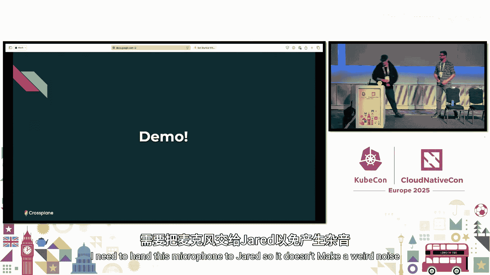

我们不会花太多时间解释 Kubernetes 中命名空间的好处，假设大家都熟悉。租户隔离允许你授予人们在某个命名空间中创建应用 XR 甚至直接管理资源的权限，但不能在其他命名空间中这样做。

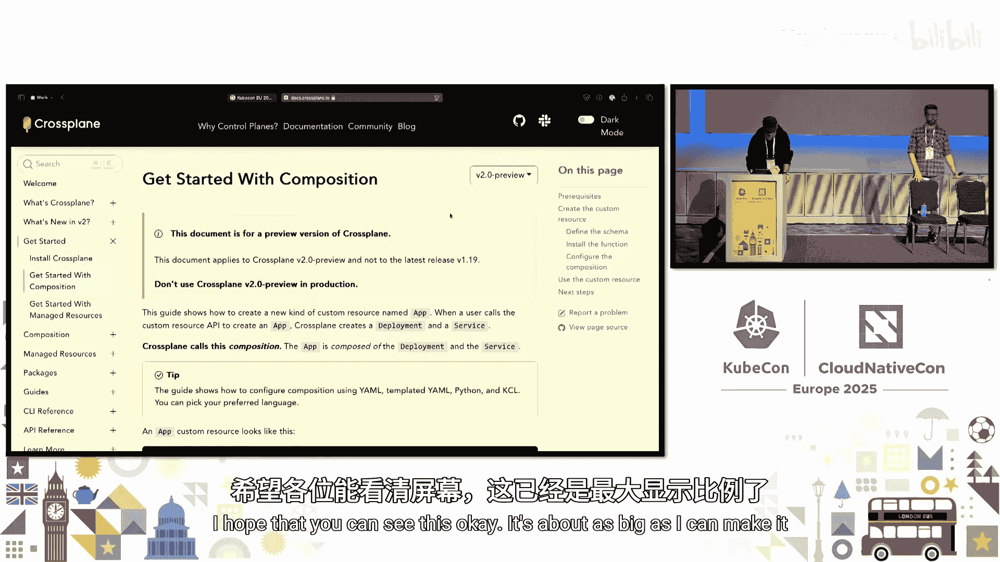

这引出了 V2 的另一个哲学上的变化。在 V1 中，我们认为 Crossplane 是“垂直集成”的，意思是告诉人们不应该直接创建托管资源，也不应该将托管资源放入 Helm Chart 中，而应该通过复合资源来创建。反之亦然，我们说复合资源是用于 Crossplane 托管资源的，而不是用于任意 Kubernetes 资源的。

在 V2 中，我们不再持有这种观点。随着一切都变为命名空间作用域，如果你愿意，使用其他工具创建托管资源变得更有意义，这完全可以。我们认为它与组合功能配合使用效果最佳，但你不必强制使用组合。同样，你可以使用组合来组合任何你想要的 Kubernetes 资源，比如 Deployment、Service，而不仅仅是 Crossplane 托管资源。

## V2 如何简化组合

让我们通过图表看看 V2 如何简化工作流程。别担心，这个看起来很复杂奇怪的图表展示的是 V1 的工作方式。

技术上，V1 已经可以组合任意资源，但方式有点奇怪。例如，平台团队定义了一个新的 API “App”。当有人在命名空间中创建 App 时，平台团队希望 Crossplane 创建一个 Deployment、一个 Service 和一个 RDS 实例。其机制是：在命名空间中创建 App Claim，然后 Crossplane 跳出命名空间，在集群作用域创建 App XR（即 Claim 的镜像）。然后，这个 App XR 由两个对象组成（这本身就很奇怪）：来自 Kubernetes 提供程序的集群作用域托管资源（用于在 Kubernetes 上运行的服务），这些资源会跳回命名空间创建 Deployment 和 Service；同时，RDS 实例是集群作用域的。虽然最终完成了任务，但过程比必要的更复杂。

这是 Crossplane V2 中的样子。你会同意，这个图表中至少少了三个框，因此简单得多。用户创建一个命名空间作用域的 XR，Crossplane 直接响应并创建一个 Deployment、一个 Service 和一个 RDS 实例（现在也是命名空间作用域的）。同样，你根本不必使用托管资源，效果是一样的：用户创建 App，我们创建 Deployment、Service 和一个在集群中运行 Postgres 的云原生 PG 数据库集群（而不是 RDS 或其他云服务）。

## V2 的向后兼容性

Crossplane V2 与 V1 向后兼容。这意味着一旦 V2 正式发布，你将能够从 V1 升级到 V2，大多数人在升级时不会遇到破坏性变更。

我们做了两件事来实现这一点：
1.  如前所述，XRD 有一个 `scope` 字段，可以是 `Namespaced`、`Cluster` 或 `LegacyCluster`。如果你将其设置为 `LegacyCluster`（这将是 V1 风格 XRD API 的默认值），那么它将创建 V1 风格的“遗留” XR，这种 XR 支持 Claims，其工作方式与 V1 完全相同。
2.  我们正在为所有提供商添加命名空间托管资源支持，但不会移除集群作用域的托管资源。

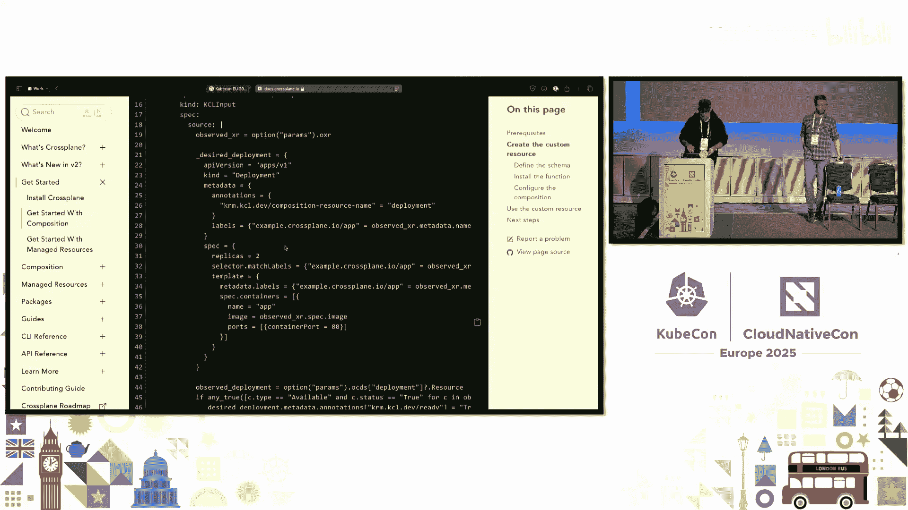

在 V2 中，我们将 V1 风格的集群作用域 XR 和托管资源视为遗留功能。我们希望你迁移到新的命名空间功能，但升级到 V2 时，你不必强制进行迁移，所有 V1 风格的东西仍将受支持。

我们利用这次主版本更新的机会，移除了一些已弃用多个版本的功能，最显著的是 `ControllerConfig`（一种配置提供商的方式，已弃用约 11 个版本，从未走出 Alpha 阶段，但曾被大量使用）和 `Patch and Transform` 组合（这是组合函数的前身，已弃用近三个版本）。如果你在使用 `Patch and Transform`，需要在升级到 V2 前切换到组合函数。

## V2 快速演示

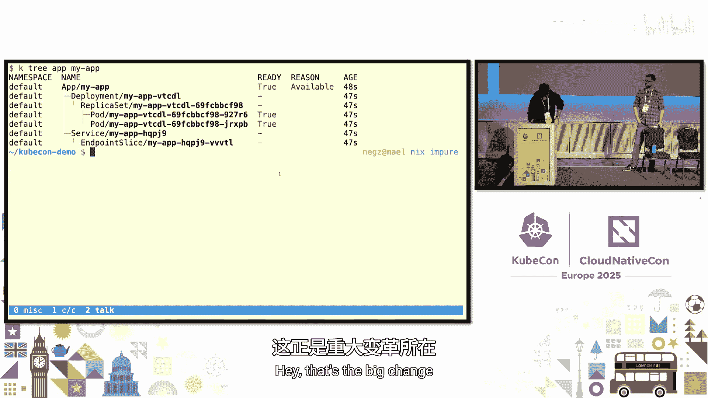

现在，Nick 进行了一个快速的 V2 演示。演示基于 V2 文档中的“快速入门组合指南”，目标是创建一个“App”复合资源，当创建时，Crossplane 会创建一个 Deployment 和一个 Service（不使用托管资源）。

演示步骤包括：
1.  **定义 API**：通过创建 XRD 来定义 App 类型，指定其模式（例如，只有一个 `spec.image` 字段）。
2.  **安装函数**：选择并安装一个组合函数（演示中让观众在 Helm 风格模板 YAML、Python 和 KCL 之间选择，最终选择了 KCL）。
3.  **配置组合**：创建一个 Composition 资源，将 App XRD 与 KCL 函数连接起来，告诉 Crossplane 当创建 App 时调用该函数，并传入如何创建 Deployment 和 Service 的逻辑。
4.  **创建资源**：创建一个 App 实例，Crossplane 会自动协调，创建出对应的 Deployment 和 Service。

演示展示了在 V2 中，由于一切都是命名空间作用域的，并且更像普通的 Kubernetes 资源，因此可以使用像 `kubectl tree` 这样的插件来可视化资源关系，非常简单直观。

## 如何尝试 V2 并提供反馈

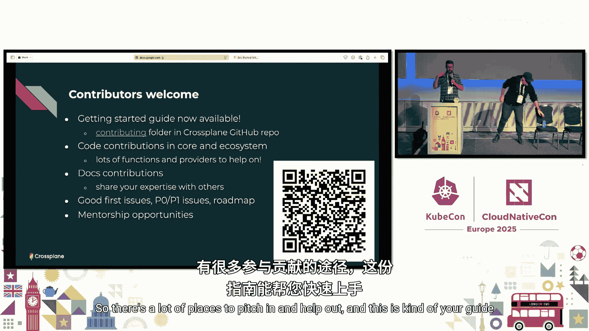

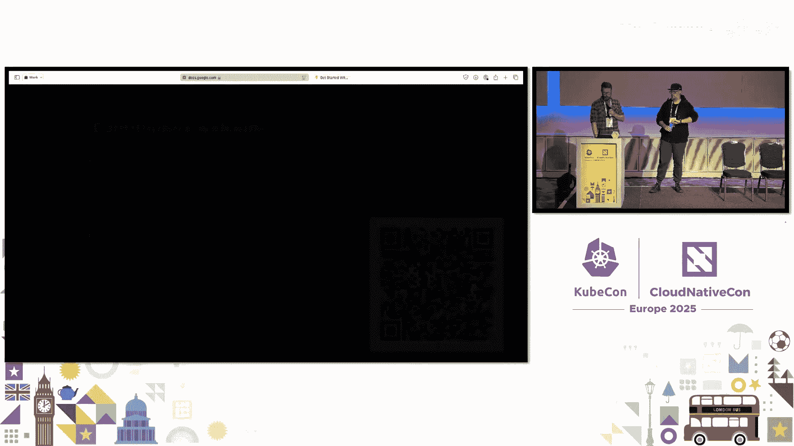

Crossplane V2 预览版现已发布。我们花了大量精力修改了 V2 的文档。你可以通过提供的 URL 或 QR 码访问文档，学习如何开始使用 Crossplane V2 预览版。

之所以是预览版，是因为具体设计仍然开放。我们希望获得更多社区反馈，希望你能安装、试用并告诉我们这是否是正确的方向，然后我们才会将其确定为 Crossplane V2 的真正未来。请务必就 V2 和新文档给我们反馈。

## 社区与贡献

Crossplane 项目离不开其社区。我们欢迎更多贡献者。我们最近编写了一份面向新贡献者的入门指南，位于 Crossplane GitHub 仓库的 `contributing` 文件夹中。它帮助你了解 Crossplane 哪些地方需要贡献、如何开始第一次贡献、如何找到一个好的初级任务等。文档也非常需要帮助。这是你了解如何成为 Crossplane 贡献者的指南。

关键入口点是 `crossplane.io` 网站，你可以从那里找到文档、仓库、博客等所有内容。

## 总结与行动号召

本节课中，我们一起学习了 Crossplane 作为云原生控制平面框架的核心概念。我们了解了其基本构建模块（托管资源）、如何通过组合和函数构建高级抽象平台，并深入探讨了即将到来的 V2 版本的重大变化，包括命名空间作用域的复合资源与托管资源、更灵活的资源组合能力以及更好的向后兼容性。

最后的行动号召是：尝试 Crossplane V2 预览版！我们展示了我们认为非常有用的变化，这些变化将使 Crossplane 更有用、更易用。我们非常希望听到你的反馈。

## 问答环节摘要

在演讲最后的问答环节，讨论了一些问题：
*   **关于类似 Terraform Data Sources 的功能**：Crossplane 有“只观察资源”的原始功能，可以创建资源但不执行云操作，仅镜像状态。结合函数，可以实现类似数据源的功能。社区正在考虑构建更便捷的解决方案。
*   **关于资源部署顺序调度**：可以通过组合函数实现。Crossplane 每次调用函数时会提供世界的观测状态，因此可以在函数中添加逻辑，例如在 Deployment 就绪后再创建 Service。有些现成的函数也支持配置来实现排序。
*   **关于调节协调间隔以避免云提供商速率限制**：每个提供商都提供了配置选项，可以指定同步资源的频率（使其变慢）。此外，Crossplane 还有“暂停”的概念，可以为资源添加暂停注解，Crossplane 将停止协调，直到取消暂停。未来还有一个名为“实时组合”的功能正在开发中，它将使用监听机制而非轮询，有望减少系统中的协调次数。

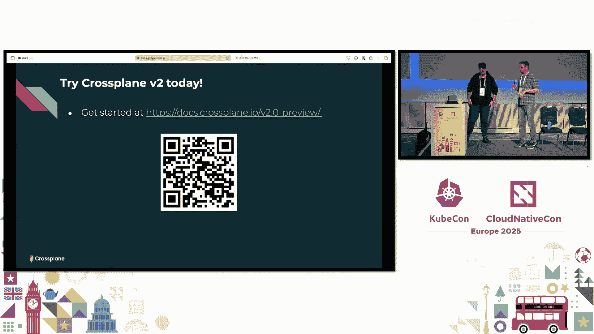

感谢大家的参与，欢迎到展台进一步交流。