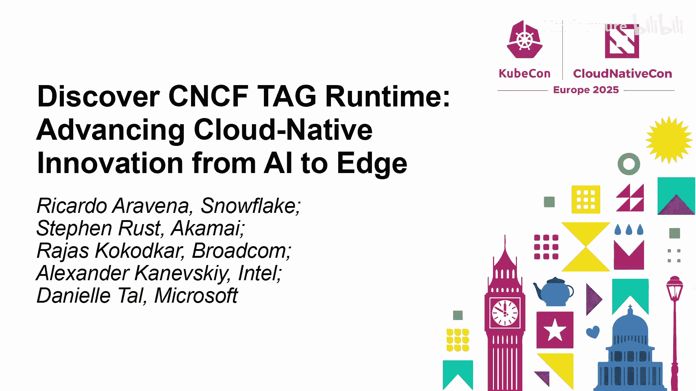
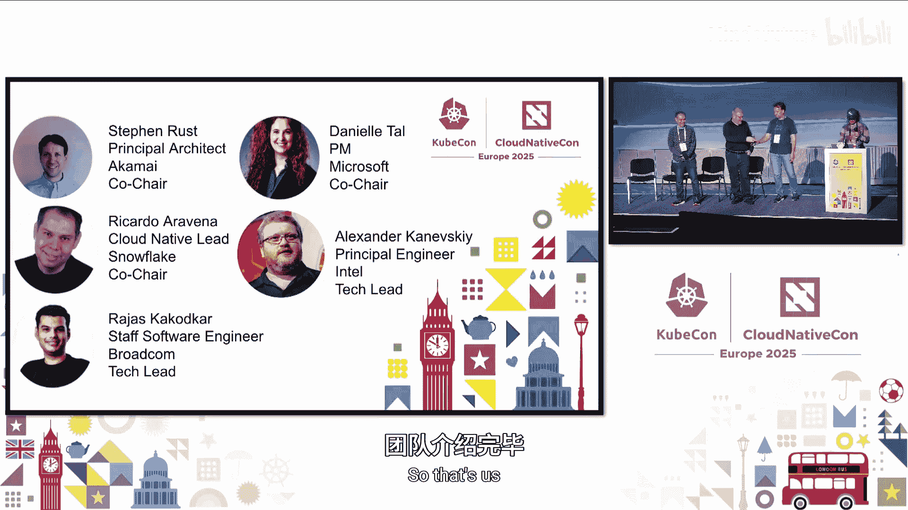
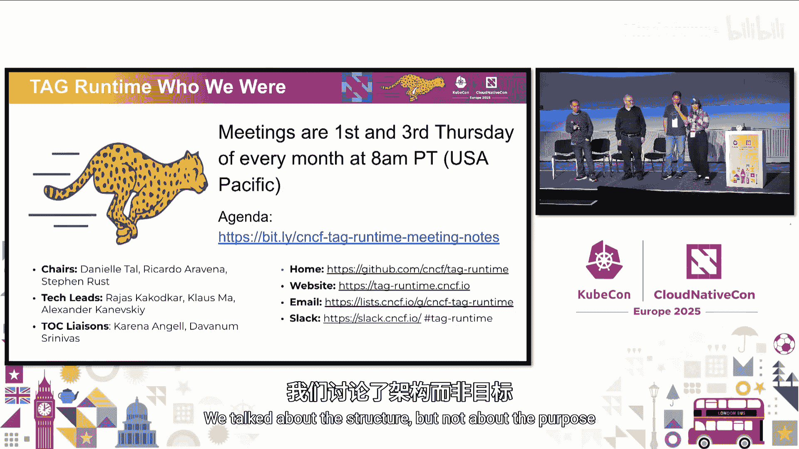
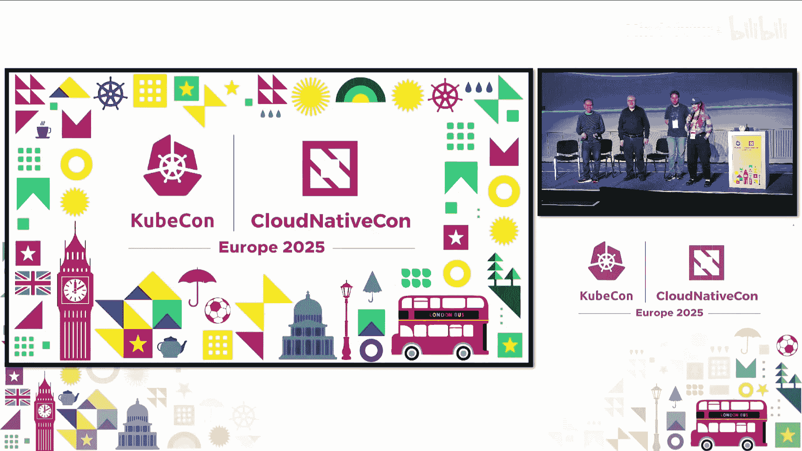

# 004：探索CNCF TAG Runtime - 从AI到边缘，推动云原生创新

在本教程中，我们将学习CNCF技术咨询组（TAG）的概况，特别是TAG Runtime的当前结构、职责范围、下属工作组，以及即将到来的组织架构调整。我们将了解如何参与其中，并探讨这些变化如何更好地服务于快速增长的云原生社区。

## TAG Runtime概述：结构与职责

CNCF技术咨询组（TAG）旨在协助CNCF技术监督委员会（TOC）开展工作，通过贡献技术专长、保持项目完整性并提升质量，来支持CNCF的使命。TAG是TOC与社区之间的桥梁，负责协调特定技术领域的讨论与协作。

目前CNCF共有8个TAG，但随着项目数量的快速增长（从几年前的约50个增长到如今的约200个），现有的结构需要调整以更好地服务社区。TAG Runtime是其中之一，其职责包括：
*   与项目社区建立联系并互动。
*   协助项目进行技术评审。
*   引导和启动新的社区倡议。
*   协调和主持不同工作组（Working Group）的会议。
*   作为项目加入CNCF后的首要联络点。

## TAG Runtime的广泛范畴

上一节我们介绍了TAG的通用职责，本节中我们来看看TAG Runtime具体涵盖哪些技术领域。虽然其名称包含“运行时”，但其范畴远不止容器运行时。

TAG Runtime的范畴非常广泛，主要包括以下领域：
*   **工作负载编排**：例如Kubernetes及其相关生态项目。
*   **运行时**：包括容器运行时（如containerd、CRI-O）、虚拟机运行时以及新兴的WebAssembly运行时。
*   **无服务器计算**：如Knative等项目。
*   **操作系统与虚拟化**：包括特殊用途的Kubernetes发行版（如K3s、K0s）和轻量级操作系统（如Flatcar Container Linux）。
*   **边缘与设备计算**：涉及在边缘场景和物联网设备上运行云原生工作负载。
*   **人工智能**：如何基于云原生技术运行AI工作负载，以及如何利用AI增强云原生运维。

## TAG Runtime下属工作组及其成果

了解了TAG Runtime的广泛范畴后，我们来看看其下属的几个活跃工作组及其取得的成果。以下是几个关键工作组：

*   **云原生AI工作组**：成立约两年，专注于云原生与AI的结合。主要成果包括发布了《云原生AI白皮书》，并正在推进AI安全、GPU调度挑战及可持续性等相关白皮书的编写。
*   **WebAssembly工作组**：作为一个跨公司、跨社区的协作平台，推动了OCI artifacts布局针对WASM的更新，并与Bytecode Alliance合作进行上游代码贡献和W3C标准推进。
*   **批处理系统倡议工作组**：致力于为批处理工作负载定义规范、CRD类型和特定资源。该工作组与AI工作组有紧密联系，因为许多AI工作负载也涉及批处理调度和资源（如GPU）的高效利用。
*   **容器编排设备工作组**：这是一个独特的、直接产出代码规范的工作组。其核心成果是定义了容器内如何暴露设备的规范（CDI），该规范已被众多容器运行时和工具（如Docker、Podman）采用。近期发布了CDI 1.0规范。
*   **物联网边缘工作组**：主要产出技术文档和白皮书，探讨如何将IoT设备连接到Kubernetes集群。
*   **特殊用途操作系统工作组**：通过组织小组讨论和圆桌会议，倡导和探讨特殊用途操作系统的不同方法与实践。

## TAG架构重启与未来展望

前面我们了解了TAG Runtime的现状，本节中我们将探讨CNCF为适应社区快速增长而进行的TAG架构调整，即“TAG Reboot”。

新的CNCF结构将更加灵活，旨在更好地支持社区倡议的发起和成长。核心变化在于在TAG之下引入了新的协作实体：

*   **子项目**：类似于长期的工作组，可以直接与TOC或某个特定的TAG协作。生命周期可以很长（数年），只要社区保持活跃。
*   **倡议**：旨在短期存在，专注于交付特定成果，如一份规范、一段代码或解决一个具体问题的方案。
*   **社区组**：更偏向于技术讨论的定期会议，围绕特定主题进行交流。

在新的架构下，TAG数量将整合为5个，其范围如下：
*   **开发者体验**
*   **工作负载基础**
*   **基础设施**
*   **运维弹性**
*   **安全与合规**

当前的TAG Runtime将主要映射到新的 **TAG 工作负载基础**，其范围包括运行时、容器、虚拟机、批处理调度器、动态扩缩容、CI/CD等。同时，在基础设施、运维弹性等TAG中也会存在相关议题的重叠。

## 现有工作组的转型路径与参与方式

随着新架构的推出，现有的TAG Runtime工作组需要确定其未来的归属形式。以下是对各工作组的建议转型路径：

*   批处理系统倡议工作组：建议申请成为新的“倡议”或根据活跃度决定归档。
*   WebAssembly工作组：建议申请成为新的“倡议”。
*   容器编排设备工作组：建议重新申请（作为子项目或倡议）。
*   物联网边缘工作组：由于活跃度较低，建议归档，但若有社区成员愿意推动可重新激活。
*   特殊用途操作系统工作组：建议申请成为“倡议”或转为“社区组”。
*   云原生AI工作组：建议创建为TOC直属的“子项目”。

**需要强调的是，架构调整的目的是优化在CNCF框架内的协作模式，而非终止社区本身的工作。相关技术社区和讨论将继续存在和发展。**

对于希望参与的个人，参与方式并未发生根本改变。在新架构完全确立之前，所有现有沟通渠道（如Slack频道、定期会议）将继续保持开放和活跃。我们鼓励所有人：
*   参加会议和讨论。
*   帮助评审新项目。
*   提供来自最终用户和领域的反馈。
*   积极申请在新的TAG架构中担任领导角色（如TAG主席或技术负责人）。

整个架构重启的核心目的是使社区能够更敏捷地成长，更轻松地发起和推进倡议，以支持云原生生态下一个十年的指数级增长。

## 总结与互动

本节课中，我们一起学习了CNCF TAG的职责，深入了解了TAG Runtime的广泛技术范畴及其下属工作组取得的成就。我们探讨了即将到来的TAG架构重启，包括新的子项目、倡议和社区组模式，以及现有工作组可能的转型路径。最后，我们明确了社区参与的方式将持续开放，并鼓励大家积极加入，共同推动云原生创新。

架构调整是为了更好地服务社区、促进协作，最终目标是赋能每一个社区成员，共同构建云原生的未来。