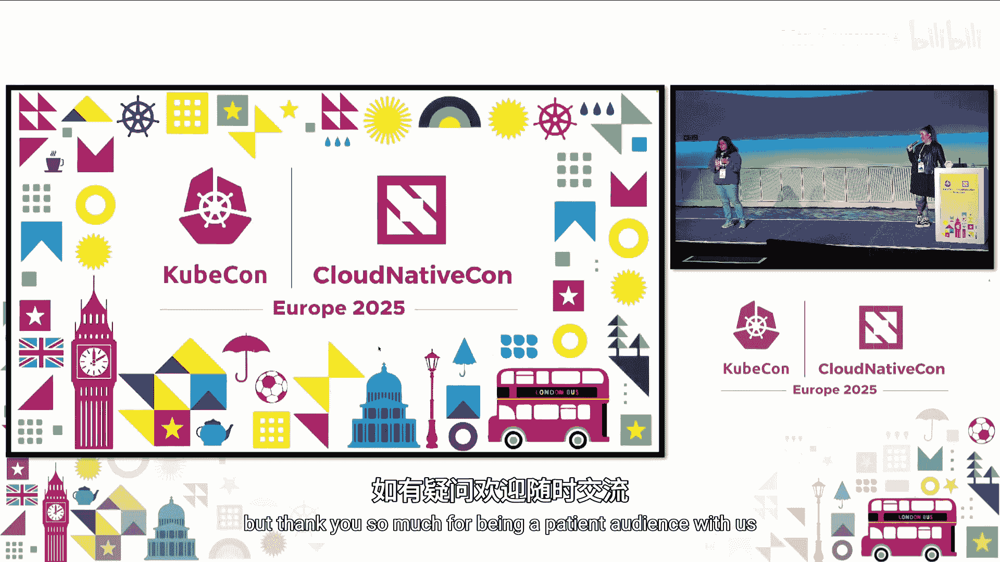

# 005：通过文档弥合开源采用鸿沟

在本教程中，我们将学习 Kubernetes 项目如何通过其文档工作来帮助用户和公司更顺利地采用开源技术。我们将探讨文档团队如何组织工作、如何为不同用户编写内容，以及社区如何参与改进文档。

---

## 概述：为什么文档对开源采用至关重要

在开源领域，文档质量是决定一个项目能否在企业中被成功采用的关键因素之一。Kubernetes 作为全球第二大开源项目，其文档策略和经验值得借鉴。本节我们将介绍本次分享的核心背景。

---

## 章节 1：接近性问题——我们代表谁？

上一节我们介绍了文档的重要性，本节中我们来看看文档创作中面临的一个核心挑战：接近性问题。

文档维护者与开发团队（技术专家）和最终用户之间存在距离。我们无法同时深入参与所有群体，因此必须明确优先代表哪一方的利益。

在 Kubernetes 文档团队（SIG Docs）中，我们做出了明确的选择：
*   **我们代表用户**：我们的核心职责是确保文档**可读**且**可用**。我们制定文档的结构、风格和流程，使其对从初学者到管理员的所有用户都友好。
*   **技术专家确保准确性**：文档的**技术内容**由各个功能特性的负责人（KEP Owner）拥有和保证。他们负责审核，确保所有技术细节的准确性。

因此，我们的协作模式是：SIG Docs 设定易用性标准，而 KEP Owner 确保技术正确性。我们经常需要主动联系 KEP Owner，推动文档符合项目规范。

> **核心协作公式**：`可用的文档 = SIG Docs（易用性） + KEP Owners（技术准确性）`

---

## 章节 2：拥抱多元声音——为不同用户写作

解决了代表性问题后，我们需要思考如何为形形色色的用户服务。Kubernetes 用户背景各异，文档必须覆盖所有技能水平。

我们的文档主要分为以下几类，以满足不同需求：
*   **概念与任务指南**：针对初学者，解释核心概念并提供从零开始的实践教程。
*   **参考文档**：针对开发者、系统管理员和架构师，提供 API 详情、高级概念等深度内容。

我们致力于为不同技能水平的用户提供一致且易于识别的体验。研究表明，文档的**语气和语调**对用户理解信息有巨大影响。因此，我们严格遵循以下风格准则：

*   **使用主动语态**：让用户感觉自己在主导操作。例如，“你创建了一个 Pod” 而非 “一个 Pod 被创建”。
*   **直接称呼用户为“你”**：建立直接联系，将用户置于主体地位。
*   **使用简洁直接的语言**：避免华丽辞藻和复杂句式，确保内容清晰易懂，也便于翻译。

> **代码示例（风格对比）**：
> **不佳（被动）**：`The configuration file is required to be created by the user.`
> **更佳（主动）**：`You must create a configuration file.`

---

## 章节 3：明托金字塔原则——构建可浏览的文档

明确了写作对象和风格后，我们需要一个有效的结构来组织海量信息。这里我们引入了“明托金字塔原则”。

明托金字塔是一种信息组织框架，将内容像金字塔一样构建：
1.  **塔尖**：最重要的结论或摘要。
2.  **中间**：支持结论的关键论点或步骤。
3.  **塔基**：详细的背景信息、数据和证据。

我们将此原则应用于文档，因为研究表明，**79% 的在线读者只会扫读内容**。为了适应这种阅读习惯，我们采用“可浏览文本”原则：

以下是实现可浏览文本的关键方法：
*   **使用清晰的子标题**：将内容分割成逻辑块。
*   **在开头列出要点**：开门见山，给出核心摘要。
*   **善用列表和表格**：将复杂信息结构化、视觉化。

这种结构不仅帮助日常用户快速找到所需信息，甚至对备考（如 CKA/CKAD 认证）的用户进行考前冲刺也特别有效。

---

## 章节 4：社区驱动开发——文档永无止境

有了清晰的结构，但文档内容本身需要持续更新和维护。Kubernetes 文档从来不是完美或完整的，这需要社区的持续贡献。

文档需要持续改进的主要原因包括：
*   **每年三次发布周期**：新功能、旧功能毕业，都需要更新或新增文档。
*   **多语言本地化**：文档被翻译成 16 种语言（包括英文），英文版的更新必然导致其他语言版本的滞后。
*   **多版本支持**：需要维护多个 Kubernetes 版本的文档，增加了复杂性。

因此，我们鼓励“开车式贡献”（Drive-by Contributions）。最棒的贡献方式就是**在使用文档时发现问题并提交修正**。

在评估贡献时，我们秉持“足够好”的原则：
*   **核心问题**：这个贡献是否让文档变得**更好**？只要答案是肯定的，我们就倾向于接受。
*   **工程成本**：每个贡献（即使只是修正一个拼写错误）都需要社区成员花费时间进行审查、合并。我们鼓励贡献者在提交时多思考一步，例如：“我是否发现了同一页的其他错误？”或“这段文字改成列表是否更易读？”。这种能提升整体用户体验的贡献最为宝贵。

---

## 章节 5：改进空间与行动号召

尽管我们已有成熟的流程，但 Kubernetes 文档仍有很大的改进空间。我们在此发出社区贡献的邀请。

目前我们重点寻求帮助的领域包括：
1.  **API 参考文档工具链**：我们正在重建设备生成 API 参考文档的工具链。该项目需要 **Go** 和 **Python** 开发技能。
2.  **博客审阅者**：我们的博客子项目长期缺乏审阅者和批准者。博客内容包括版本发布、功能特性、用例研究等，需要更多人参与内容把关。

如何参与贡献？
*   **加入沟通渠道**：请加入 [Kubernetes Slack](https://slack.k8s.io/) 的 `#sig-docs` 频道。
*   **阅读贡献指南**：在贡献前，请务必阅读官方的 [贡献指南](https://kubernetes.io/docs/contribute/)。
*   **参与社区会议**：可以订阅 SIG Docs 的邮件列表，获取会议邀请。特别推荐每月第一个星期二（UTC 时间 10:30）的“新贡献者见面会”。

你也可以通过以下方式提供反馈：
*   在官网每篇文档页面的底部点击“反馈”（Feedback）按钮。
*   直接点击文档页面右上角的“编辑此页”（Edit this page）链接来提交修改。

---

## 总结

在本教程中，我们一起学习了 Kubernetes 项目如何通过文档弥合开源采用的鸿沟。我们从“接近性问题”出发，明确了文档团队代表用户、技术专家保证准确性的分工。接着，我们探讨了如何为多元用户写作，并引入“明托金字塔原则”来构建可扫读的文档结构。我们还了解了文档如何依靠“社区驱动开发”来保持活力，并秉持“足够好”的哲学来接纳贡献。最后，我们指出了当前的改进领域并发出了具体的贡献邀请。希望这些经验能帮助你更好地理解开源文档工作，并激励你参与其中。