# 006：超越经典密码学

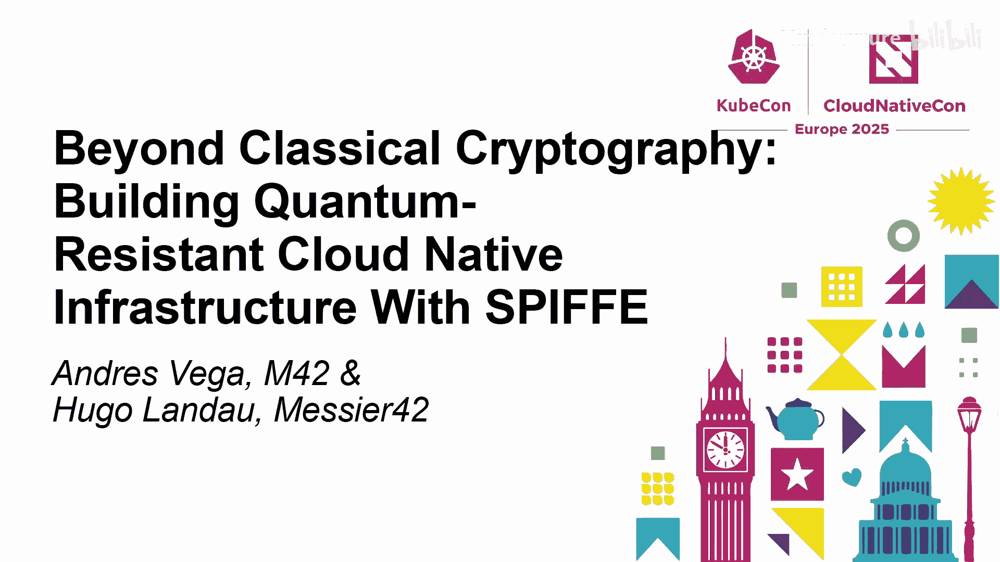

在本节课中，我们将学习量子计算对当前密码学体系的威胁，以及如何为云原生系统构建量子安全的加密体系。我们将探讨量子计算机的基本原理、后量子密码学算法，并了解如何在 Kubernetes 和 SPIFFE/SPIRE 生态系统中实现量子安全通信。

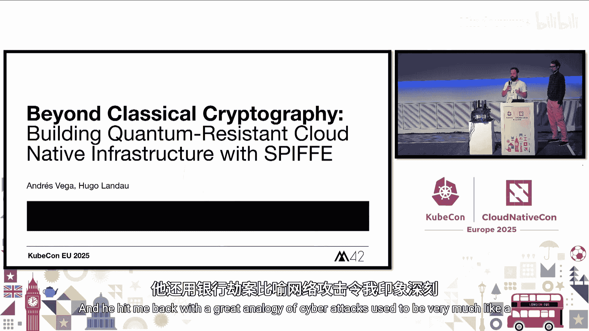

## 概述：量子计算的威胁

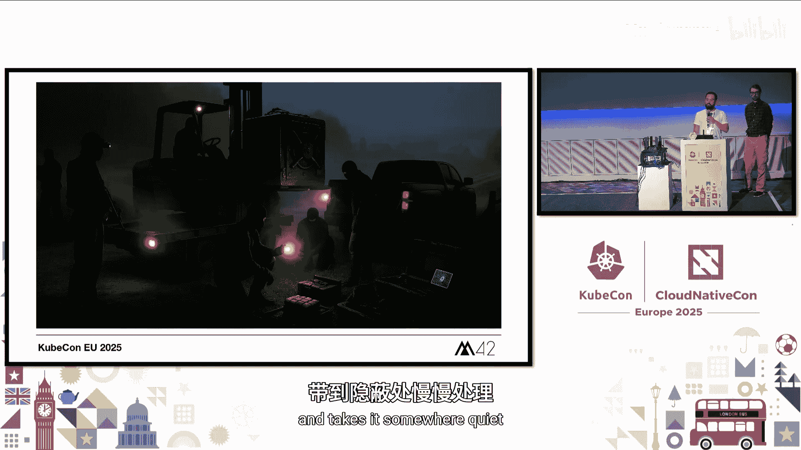

上一节我们介绍了课程背景，本节中我们来看看量子计算带来的具体挑战。

当前的网络攻击模式已经发生变化。过去的攻击像银行抢劫，快速而激烈。现在的攻击则像叉车作业，攻击者窃取整个数据“保险箱”，然后在安静的环境中进行缓慢、有条不紊的解密和利用。

前向保密性可以保护过去和未来的数据，即使长期密钥被泄露。这对于需要数十年保密性的系统（如医疗、金融或国防）至关重要。虽然当前的密码系统仍然稳固，但量子计算机的崛起可能会戏剧性地改变这一点。

## 量子计算机基础

量子计算机使用量子比特进行操作。一个理想的量子比特存在于基态 |0> 和 |1> 的叠加态中，这对应于经典的二进制位 0 和 1。但这些基态实际上是正交向量，构成了线性向量空间的基础。

这意味着单个量子比特可以表达向量 |0> 和 |1> 的任何线性组合。我们称一个量子比特为 |φ>，可以写作：
`|φ> = α|0> + β|1>`
根据定义，α 和 β 被称为概率幅，意味着它们的平方和必须为 1。量子比特允许像 `(|0> + |1>)/√2` 这样的状态，这意味着它以相等的概率同时处于 0 和 1 状态，并且这个特性可以扩展。

## 经典密码学的脆弱性

大多数传统加密算法，如 RSA、椭圆曲线密码学和 Diffie-Hellman，依赖于大数分解或求解离散对数的困难性。然而，量子计算机可以运行 Shor 算法，在多项式时间内分解大数，从而使 RSA 和椭圆曲线加密过时。

Shor 算法于 1994 年提出，防御它需要一套新的数学算法。我们必须使数学问题多样化。这就是美国国家标准与技术研究院已经开始标准化量子安全替代方案的原因。

## 后量子密码学算法

在量子安全算法中，格基密码学为量子安全加密提供了最通用的基础。它支持多种原语，如全同态加密、签名和密钥交换机制。它们提供了对“带错误学习”等问题的强安全性规约，并建立在 n 维格问题的线性代数之上，正如幻灯片所示。这是 Kyber 和 ML-KEM 等方案的基础。

在 NIST 后量子密码学标准化过程的第三轮（于去年结束）中，NIST 选择了 Kyber、ML-KEM 和 ML-DSA 作为联邦信息处理标准 FIPS 203 和 FIPS 204。

## 量子威胁的时间线

现在，破解经典密码学可能感觉还很遥远。我们可能需要数千个物理量子比特才能得到一个可靠的逻辑量子比特，IBM 认为我们可能要到 2030 年代末才能达到那个水平。尽管如此，意外的突破（黑天鹅事件）可能会使进程比预期快得多。

目前，硬件能力与破解现代密码学所需能力之间存在约 10 倍的差距。我们还没有完全达到。阻碍我们达到目标的技术障碍包括：量子比特稳定性不足、计算中存在大量错误以及扩展量子计算机系统的挑战。我们还没有真正解决量子纠错问题，这对于使量子计算机可靠至关重要。

最近几周，我们看到谷歌宣布了 105 量子比特的 Willow，但这在密码学上还不具备相关性。我们需要数百万个量子比特和纠错才能完成这样的任务，当前的重点是量子纠错和可扩展的量子比特。与此同时，专家意见已经开始转变。全球风险调查显示，受访专家认为未来十年内出现突破的可能性约为 30%。考虑到攻击者已经可以窃取数据并“现在加密，以后解密”，这相当严重。

因此，即使现在还没有量子计算机，也存在一个威胁窗口：从今天数据被加密并需要保持安全的时间段，到未来量子计算机使加密被追溯破解的时刻。

如果 `X + Y > 量子威胁`，其中 X 是数据需要保密的时间，Y 是迁移系统所需的时间，那么今天加密的数据就面临风险。例如，需要长期保密约 50 年的医疗数据，如果今天开始迁移到量子安全替代方案需要 10 年，而能够在未来 60 年内破解 RSA 和椭圆曲线的量子计算机出现，那么该组织今天就已经面临风险。

密码学界的 Ryan Hurst 很好地阐述了这一点：如果你处理关键的生命数据，你现在就应该采取行动；如果你的组织处理需要长期保密性的敏感数据，你应该今天就开始考虑；但如果你不处理这些，那么在你的职业生涯中，你的组织可能不会面临这个问题。

## 后量子密码学的额外价值

撇开量子计算机不谈，如果量子计算机永远无法实现，考虑到对这个问题的高度关注，这些算法的价值是什么？

经典密码学存在许多实现缺陷，可能导致严重的漏洞。你可以查看 Python cryptography 库的 hashes 模块文档，它警告说“只有在你 100% 知道自己在做什么时才应该使用它”。诸如时序侧信道攻击、弱熵组攻击或曲线外输入等问题。这些加密库通常暴露非常低级且危险的 API，很容易被误用，就像“搬起石头砸自己的脚”。尽管有强大的标准，但许多有缺陷的实现仍然持续存在这些问题。

因此，这套新算法的优点在于问题的多样化，特别是：
*   **恒定时间实现**：减少时序侧信道攻击的风险。
*   **确定性哈希（如 SHAKE）**：减少因随机性差而导致失败的机会。
*   **定义明确的采样**：阻止攻击者利用偏差和确定性行为。
*   **形式化规范和验证**：许多这些算法是经过形式化规范和验证的。
*   **快速的密钥生成**：这不仅关乎性能，还能实现大规模的前向保密。
*   **经过审查的参数**：防止“自己动手”配置带来的风险。

密钥不能长期存在。特别是在国防领域，政府倾向于使用生命周期约为 25 年的秘密。此外，考虑到“现在加密，以后解密”的攻击，意味着对手可能会存储今天被窃取的加密消息，并在未来拥有足够强大的量子计算机时解密它们。许多政府，如英国和美国，已经开始立法规划系统迁移。这是来自 GCHQ 上周的消息。NSA 去年发布了 CNSA 2.0 的更新，建议考虑量子系统密码学。

我们知道密码学迁移往往需要很长时间。我们可以回顾一下 SHA-2 迁移的时间线。密码算法过渡的阶段包括：选择和开发、标准化、实现、部署和使用。我们今天所处的阶段类似于实现的早期步骤，但大多数行业还没有达到，企业级应用肯定没有。

## 现实世界的采用与行动呼吁

以下是关键数字基础设施的现实世界采用示例（非详尽列表）：
*   OpenSSL 刚刚在上周宣布了其近期路线图。

那么，Kubernetes 社区和云原生社区可以采取哪些行动来准备呢？

限制密钥对攻击者的效用至关重要。密钥生命周期不仅取决于算法，很大程度上取决于密钥的管理方式。使用密钥的时间越短，即使密钥被泄露，暴露的风险也越小。定期轮换密钥将限制风险，同时也有助于你为过渡做好准备。

历史上，作为一个行业，我们做得并不好。如果我们看看像 DigiNotar、Heartbleed、Logjam 这样的高调安全事件，就会发现我们今天实施的许多密钥管理侧重于减少密钥蔓延，而不是真正的保护。即使你使用硬件安全模块，密钥在使用或分发时也是最容易暴露的，而这正是防御最薄弱的地方。

密码学敏捷性是关于领先于不断演变的风险。这意味着能够轻松地交换算法、密码和协议，在整个生命周期内安全管理密钥，并随着标准的变化调整策略，为地平线上的新密码学威胁做好准备。

随着密码学“正确答案”的演变和后量子密码学使用的增加，商业和企业界的焦虑将会增长。这种恐惧通常源于不清楚哪些应用程序使用了密码学，以及更改算法和轮换密钥的未知结果。这阻碍了采用。

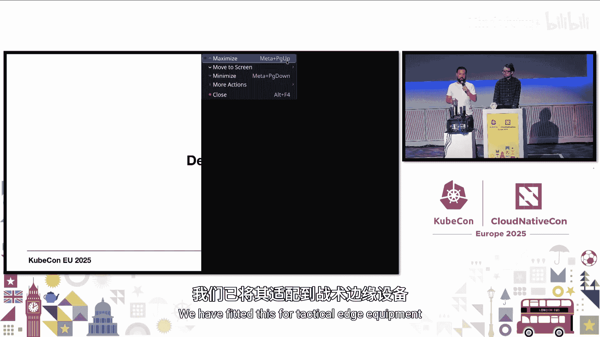

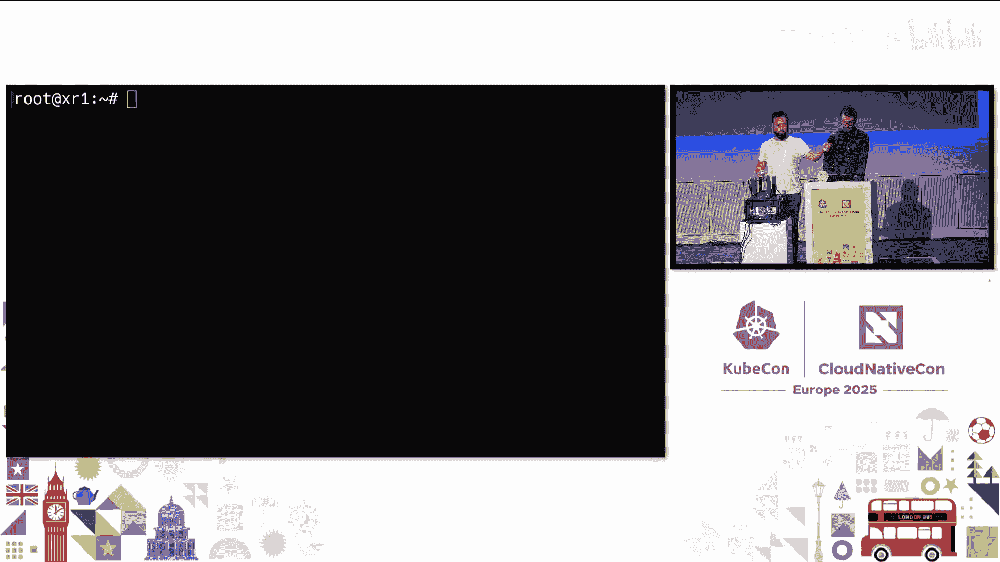

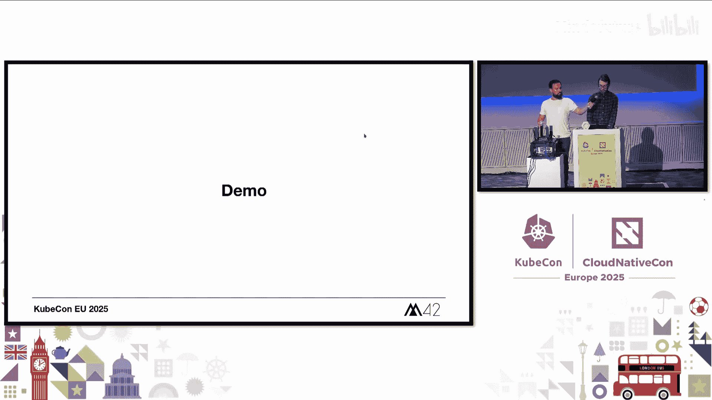

为了克服这种焦虑，你可以采取以下步骤：
*   **消除手动流程**：将人从循环中移除。
*   **利用更好的可见性和可观测性**：帮助信任变更的安全性。
*   **标准化实践**：使一切更容易理解和调试。
*   **定期演练变更**：建立团队所需的信心，以便更快地行动。

Adam Langley 的引言是密码学敏捷性的一个很好的比喻。这个想法相当简单：与其将复杂性分散在整个系统中，不如专注于一个定义明确、可维护的点——“一个润滑良好的关节”。这样，当密码学需要改变时，你将只有一个地方需要更新，使你的系统既适应性强又安全。

密钥管理通常被审计或合规团队视为一个复选框和基于刚性策略的任务。但确保克服策略团队和运营团队之间的脱节至关重要。有许多操作挑战，我不会详细讨论，但为了便于你之后查看，我把它们列在屏幕上。

## SPIFFE/SPIRE 的量子安全实践

现在，让我们回到作为 SPIFFE 维护者的演讲主题。在我过去十年的职业生涯中，我在许多不同的组织中使用过 SPIFFE，我们选择围绕它构建有几个原因：
*   **动态、可验证的身份**：它为每个服务提供动态、可验证的身份，不再需要静态 API 密钥或长期证书。
*   **短期凭证和自动轮换**：凭证是短期的且自动轮换，降低了风险。
*   **身份与可信运行时信号绑定**：身份与可信的运行时信号和工作负载证明绑定。
*   **集中控制**：我们通过策略控制颁发、续订和撤销。

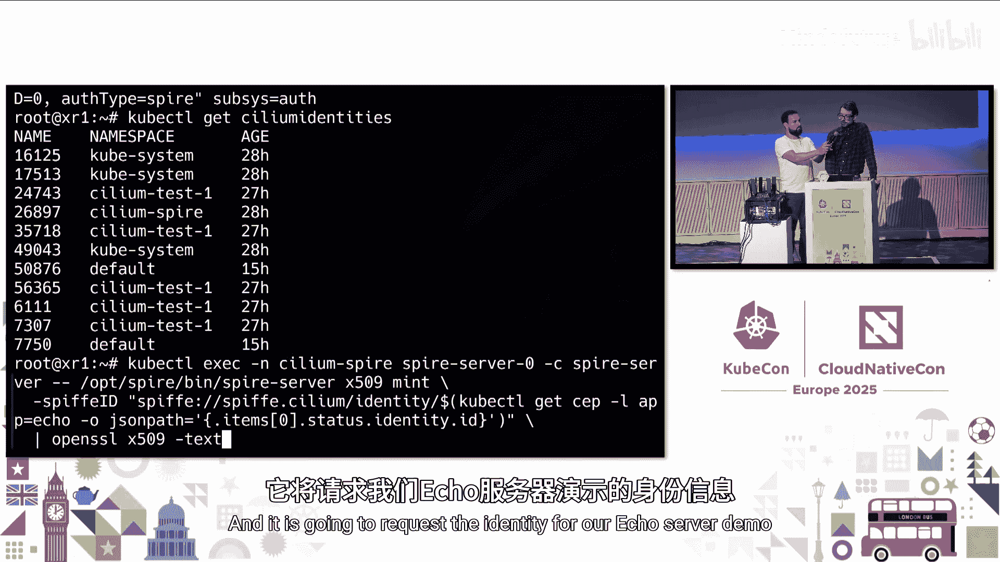

在对工作负载进行身份验证时，服务帐户级别的信任是不够的。你需要工作负载级别的证明：测量代码、验证运行时行为，甚至可能将其与可信执行环境或基于策略的上下文绑定。

SPIFFE 和 SPIRE 以需要适配的方式使用密码学，以实现后量子安全。它基于 TLS/mTLS，具体来说：
*   使用非对称密码学。
*   使用密钥交换机制。
*   使用证书验证器（一种验证对方控制该证书的数据）。

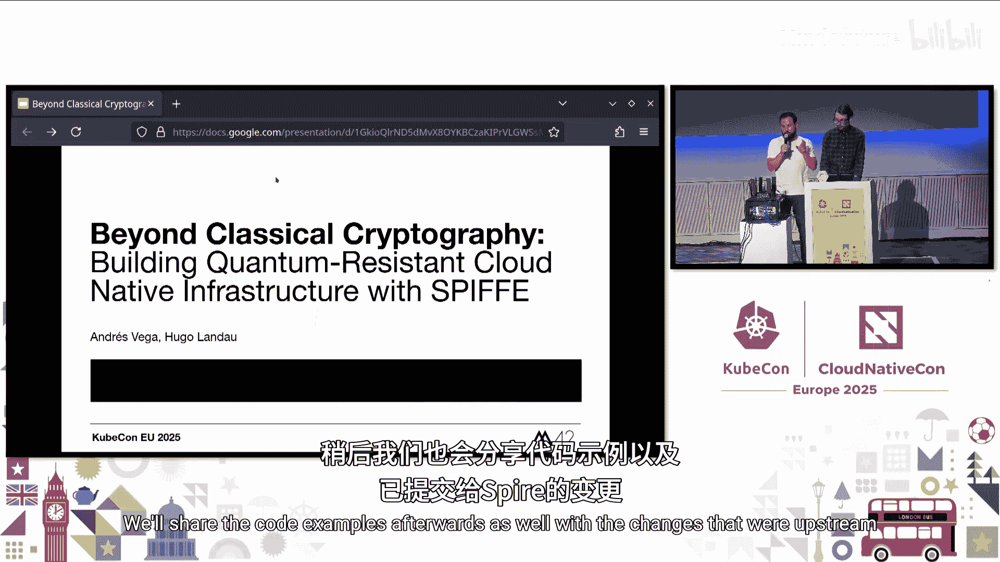

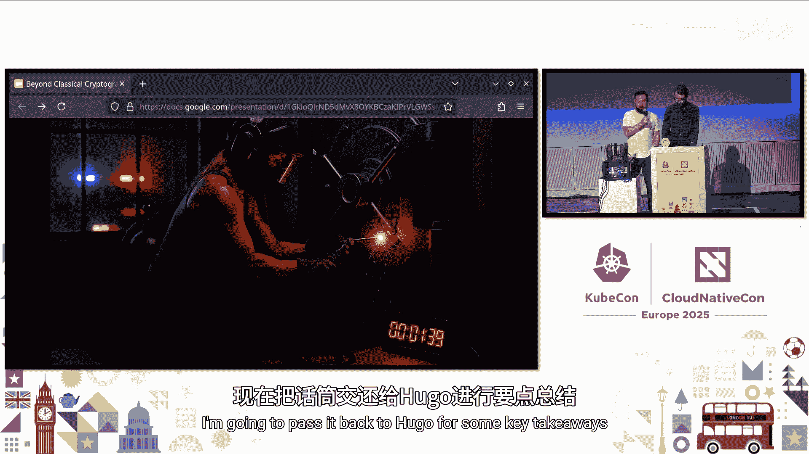

这些都容易受到密码学相关量子计算机的攻击。因此，需要用新的量子安全算法进行改造，以使中立的 TLS 在后量子环境中安全。

SPIFFE 基于 TLS，基于 X.509 证书，也可以使用 JWT 令牌。因此，我们需要用新算法改造这些格式。

在这个领域中，最高威胁是密码学相关量子计算机对密钥交换的威胁，因为这允许攻击者捕获现在加密的数据并存储起来，推测未来某天他们可能拥有密码学相关的量子计算机，然后他们就可以追溯解密今天捕获的所有数据。这意味着你现在就需要考虑这个威胁。

因此，绝对最优先的事项是处理 TLS 栈中的密钥交换部分，并用后量子安全密钥交换算法替换现有的交换算法（如椭圆曲线 Diffie-Hellman）。当然，你最终也希望用后量子安全算法改造 X.509 证书和 JWT 中的签名算法。但由于这需要主动攻击，所以不那么紧迫。

因此，我们将后量子密码学算法集成到 SPIRE 中：
*   我们向 SPIRE 使用的 TLS 栈添加了 **Kyber X25519 混合密钥交换**，这是后量子安全的。
*   我们用 **Dilithium 和 Falcon 签名**增强了 X.509 证书，这些现在是 ML-DSA 的基础，已被 NIST 采用作为认证的基础。

我们已经解决了这两个威胁，既解决了高优先级威胁，也解决了低优先级威胁。

为量子安全设计，我们现在有了带有后量子密码学的 TLS，可以与 Cilium 允许表达的过滤策略一起使用，包括 HTTP 请求片段。这实现了安全的服务间通信。

构建模块是 SPIRE、Cilium 和 Envoy，实际上支持服务网格方法，其中通过 mTLS 发出的 HTTP 请求可以根据 URL 结构在应用级别进行审计、检查、允许和拒绝。

## 演示与关键要点

我们有一个简短的演示。我们有一个运行 Cilium 的三节点 Kubernetes 栈。我们有一个简单的测试应用程序在运行。我们配置了一个 Cilium 网络策略，限制只能向特定端点（如 `/healthz`）发出 HTTP 请求，而访问其他端点（如 `/`）则被拒绝。关键在于，这一切都是通过 Envoy 服务网格在节点间使用后量子安全的 mTLS 进行保护的，因此你的应用程序不需要了解任何后量子算法，节点到节点的通信是安全的，并且你可以在其上添加策略。

我们还可以查看用于 mTLS 通信的 X.509 SVID 证书。证书的签名算法是新的（Dilithium 签名），以至于机器上安装的 OpenSSL 版本都无法识别它。

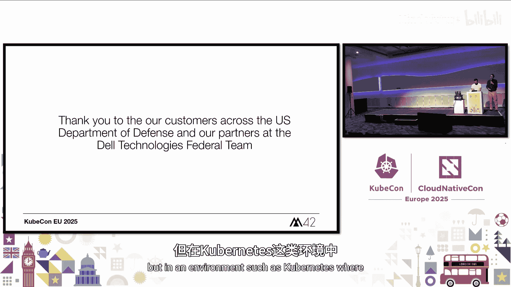

关键要点如下：
*   密码学相关的量子计算机威胁着当前的非对称加密，特别是通过“现在加密，以后解密”的攻击。现在采用至少后量子安全的密钥交换机制对于未来验证 SPIFFE、SPIRE 和其他 API 技术等系统至关重要。
*   这是最高风险。因此，你需要采用后量子安全密钥交换机制，特别是混合机制，如 X25519-Kyber-768，这样你可以对冲未来任一算法变得不安全的可能性。
*   同样，你最终（但优先级较低）希望用后量子安全签名改造 X.509 证书、JWT 令牌和其他使用签名算法的东西。
*   TLS 协议有一些棘手的地方，可能导致特殊的结果，例如连接双方都支持后量子安全密码套件，但由于细微的实现差异，它们实际上没有协商成功。这需要注意。在这种情况下，它们会回退到非量子安全的密钥交换机制。因此，你实际上需要有一种方法来测量你在现场实际协商的内容，并验证其正在被使用。

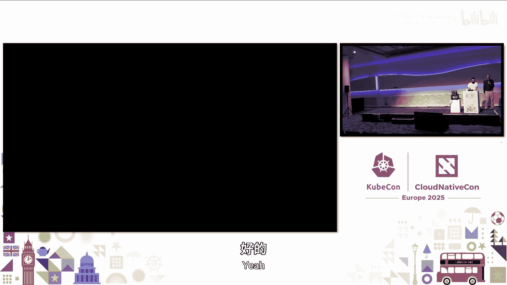

对于 Go 生态系统（当然这与 Kubernetes 高度相关，因为大量软件是用 Go 实现的），Go 现在已经发布了主线的混合密钥交换机制（Go 1.23）。在许多情况下，你可以通过升级到 Go 1.23 在现有的 Go 代码中部署它。对于后量子签名，我们基于 Cloudflare 的 circl 库进行了采用，这是 Cloudflare 为这些 Dilithium 和 Falcon 签名开创的库。NIST 标准现已发布，因此你应该预期会有很多变化。

## 总结与问答

安全永无止境。因此，我们鼓励你开始规划并考虑那些尖锐的问题、权衡和注意事项，以着手迁移到量子安全算法，并与开源社区合作并分享这些经验。

在问答环节，主要讨论了后量子算法带来的开销（更大的密钥和流量大小，更高的计算成本，但在 Kubernetes 等环境中，TLS 握手开销通常不是瓶颈），以及作为最终用户或系统管理员今天可以做什么（主要是关注供应商建议，及时升级软件，例如 Go 1.23 已默认支持后量子密钥交换）。

---

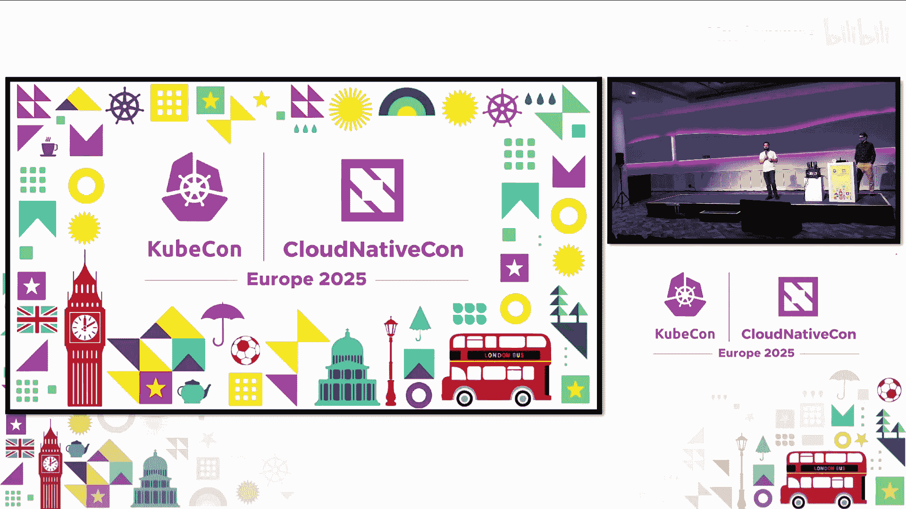

**本节课中我们一起学习了**量子计算对经典密码学的威胁、后量子密码学的基本原理和算法（如 Kyber、Dilithium），以及如何在云原生环境（特别是 SPIFFE/SPIRE 和 Kubernetes 服务网格）中实践量子安全通信。核心在于理解威胁的紧迫性，并通过密码学敏捷性、密钥生命周期管理和采用标准化后量子算法来为未来做好准备。