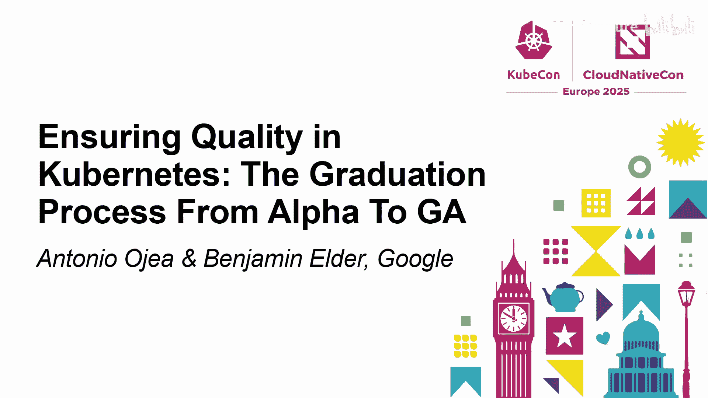
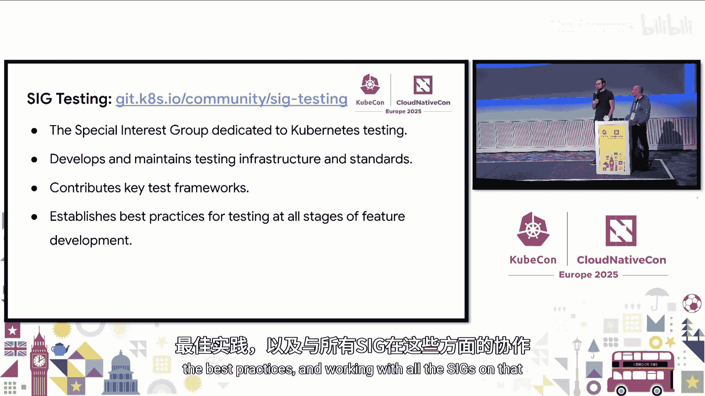
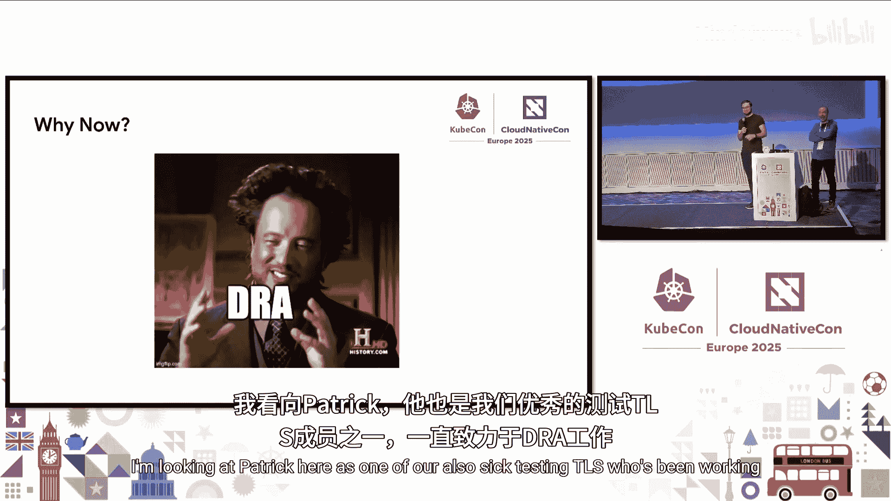
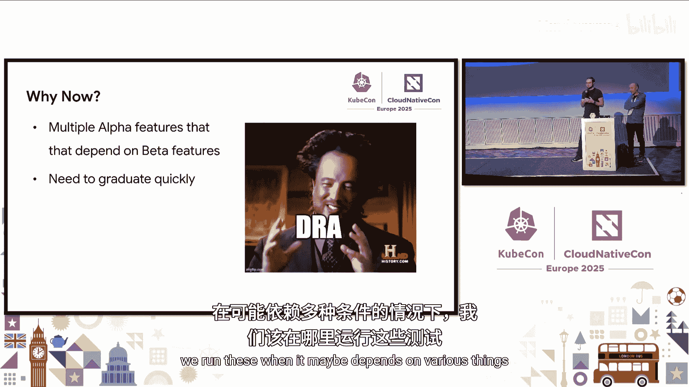
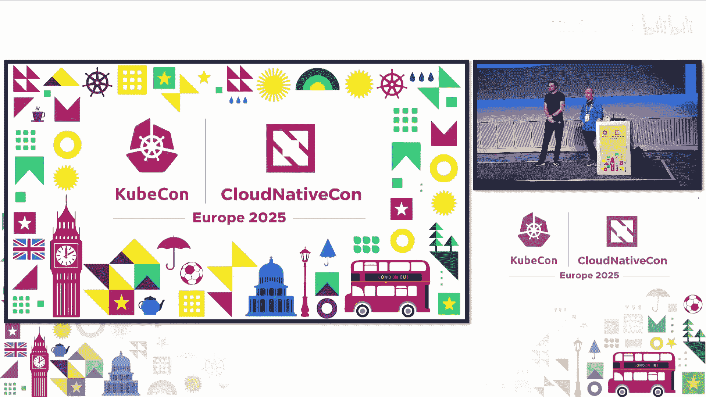

# 007：从Alpha到GA的毕业流程 🎓



在本节课中，我们将学习Kubernetes如何管理新功能的质量，并详细解释一个功能从Alpha阶段发展到稳定版（GA）的完整流程。我们将探讨功能开发、API设计、测试策略以及社区如何协作以确保项目的稳定性和高质量。

---

## 项目组织与功能开发

Kubernetes是一个拥有庞大生态系统的重要开源项目。为了管理这样一个大型项目的开发，我们通过“特殊兴趣小组”（SIGs）进行组织。这些小组可以是横向的（如API机制、CI），也可以是纵向的（如网络、存储）。

为了让项目持续成长和演进，我们需要添加新功能。我们通过“Kubernetes增强提案”（KEPs）流程来组织新功能的开发。这个流程虽然对新贡献者来说可能有些繁重，但其目的是为了在SIGs之间进行充分沟通，确保透明性，并打破各个团队之间的隔阂。

---

## 功能的生命周期阶段

当我们想要添加一个新功能时，需要考虑它的生命周期。Kubernetes的功能有三个主要阶段：Alpha、Beta和GA。

*   **Alpha阶段**：在这个阶段，功能是一个可用的提案。它应该能够工作，但质量门槛较低。我们允许在这个阶段进行创新和收集反馈，因为不可能事先预知所有细节。
*   **Beta阶段**：进入Beta阶段后，对稳定性的要求更高。Beta功能默认是启用的，这意味着每个Kubernetes用户都会在集群中运行这个新功能。因此，我们不能破坏用户的体验，但用户仍需知晓功能细节可能仍有改进空间。
*   **GA阶段**：这是最终阶段，我们对最终用户和实现做出了强有力的承诺。GA功能具有非常高的质量门槛，是生态系统可以依赖的稳定基石。

---

## API的重要性与挑战

Kubernetes最强大的特点之一是其API。大多数功能都依赖于API。API的关键在于它定义了接口和语义，允许成千上万个项目基于这些接口构建，从而实现互操作性和可移植性。

然而，API也带来了挑战。如果一个API停留在Beta阶段，那么所有依赖它的功能也会被默认禁用。因此，我们需要能够同时将功能和API升级到更高阶段，以提供稳定性。

为了确保新功能在生产环境中是可靠的，我们成立了“生产就绪性小组”。当功能提案希望从Beta升级到GA时，这个小组会提出一些尖锐的问题，例如可扩展性要求和故障场景处理。



---

## 质量保证的核心：测试





我们通过测试来强制执行质量标准。我们采用一种测试金字塔模型，但特别强调端到端（e2e）集成测试。

其中最关键的一套测试是**一致性测试**。这套测试的目的是确保应用程序可以在不同的Kubernetes发行版和安装方式上运行，从而保证可移植性。它是Kubernetes集群能够运行可移植应用程序的最低必要标准。

我们投入了大量资源在CI（持续集成）和自动化上，并严重依赖SIGs。在Kubernetes中，质量是**共同责任**。没有专门的测试团队，每个功能的开发者都需要对自己的领域负责。

我们有一项严格的政策：**零容忍测试偶发性失败**。如果一个测试变得不稳定，社区会立即追踪并修复它，或者将其移除。这确保了CI的可靠性和我们对质量的承诺。

SIG Testing小组并不拥有所有测试，但他们负责测试基础设施、标准、框架和最佳实践，并与所有SIG合作。

---

## 改进测试框架：以DRA为例

随着项目发展，测试变得愈加复杂。以“动态资源分配”（DRA）功能为例，它包含多个Alpha和Beta功能，测试依赖关系复杂。

过去，我们通过一个名为`[Feature:XXX]`的标签来标记测试。这个标签的含义非常模糊，可能表示需要功能门控、需要特定集群配置或需要安装外部组件。这导致大多数CI作业直接跳过所有带此标签的测试，开发者需要自行设置复杂的CI流程。

从Kubernetes 1.33开始，我们改进了测试框架，引入了更清晰的注解方法：

*   **对于功能门控**：使用 `WithFeatureGate` 方法，传入标准的特性门定义。
    ```go
    // 示例：在测试中声明依赖的功能门
    framework.WithFeatureGate(features.MyFeatureGate)
    ```
*   **对于其他依赖**：如需要安装控制器或驱动，使用 `WithFeature` 标签。

这些信息现在作为可查询的元数据（通过Ginkgo标签）附加到测试上，而不是塞在测试名称里。这使我们能够建立标准的CI任务，例如：
*   一个任务开启所有Alpha功能门，并运行所有仅依赖这些功能门的测试。
*   另一个任务开启所有Beta功能门，运行相应的测试。

我们期望功能审批者推动一个规范：**任何功能，即使是Alpha阶段，也必须拥有自动化测试**。没有可靠测试的功能不应被推广到Beta阶段。

我们还加强了工具链，确保Alpha功能必须默认关闭的策略被强制执行，避免了向用户传递混乱的质量信号。

对于像DRA这样需要额外设置（如安装模拟驱动）的功能，我们提供了可复用的CI任务模板。社区将在1.34版本周期中广泛宣传这些变化和新的期望。

---

## 测试执行与零容忍策略

以下是关于测试执行和“零容忍”策略的一些细节：

**测试执行时间**：
*   **预合入检查**：针对开发者的代码变更，我们努力将反馈时间控制在1小时左右。
*   **发布阻塞测试**：时限约为2小时。
*   **大规模测试**：如可扩展性测试，可能运行12-14小时，但通常以周期性任务方式运行。

**零容忍策略的实施**：
1.  一旦发现测试不稳定，立即提交问题报告。
2.  功能负责人或社区成员负责调查和修复。
3.  我们拥有强大的工具链（如 `go.k8s.io/triage`），能对CI失败信息进行聚类分析，快速识别广泛出现的问题模式。
4.  SIG Release和CI Signal团队密切监控发布阻塞测试，确保问题被及时跟踪和解决。
5.  这是一种文化转变：让开发者习惯于“测试要么通过，要么失败”，而不是“重试几次或许能过”。当不稳定成为例外而非常态时，整个社区就更愿意主动解决它们。

---

## 总结与展望

本节课我们一起学习了Kubernetes功能从Alpha到GA的毕业流程。我们了解到：

1.  严格的生命周期阶段（Alpha -> Beta -> GA）是平衡创新与稳定的关键。
2.  API的稳定性和清晰的行为定义是Kubernetes成功的基石。
3.  质量是社区的共同责任，通过KEP流程、生产就绪性审查和SIG协作来保障。
4.  测试，尤其是一致性测试，对于保证可移植性至关重要。
5.  我们正在通过改进测试框架（如清晰的特性门控注解）和强化CI标准，将质量保证的关口前移，即使对于Alpha功能也要求拥有自动化测试。
6.  “零容忍测试不稳定”政策是维持高质量CI和开发者信心的核心文化。



展望未来，我们将继续提高标准，确保即使是Alpha功能也不会影响GA功能的稳定性，并让整个流程对贡献者更加清晰和友好。