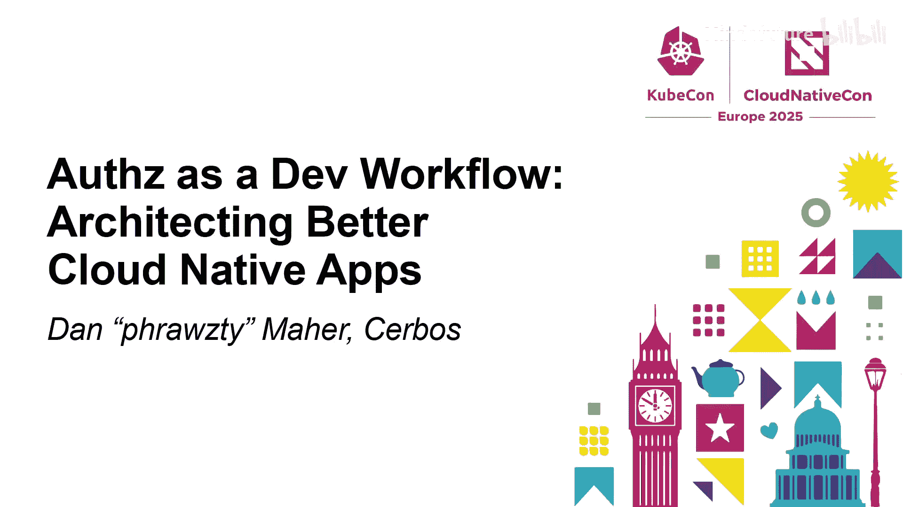
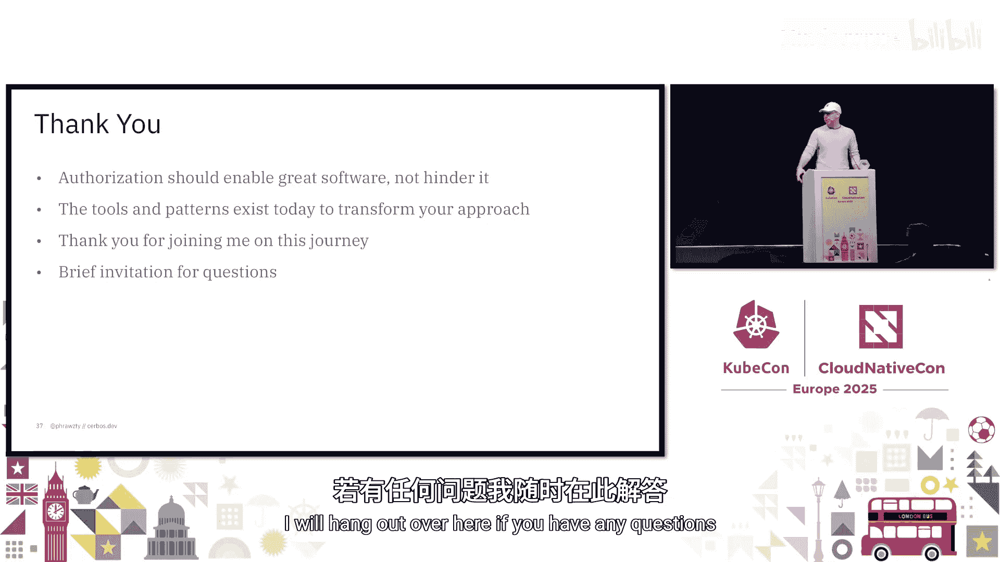

# 008：将授权作为开发者工作流

在本节课中，我们将探讨如何将授权（Authorization）从传统的安全限制转变为提升开发者体验和产品能力的工作流。我们将分析当前授权实践中的问题，介绍核心设计原则，并了解相关的开源工具和实现模式，最终帮助你构建更安全、更易维护的云原生应用。

## 授权悖论与现状

在当今现代化的云原生环境中，每个应用的每个请求都需要回答一个核心问题：**当前用户是否被允许执行此操作？** 这是一个无法避免且对安全至关重要的问题。

然而，授权在我们的架构和工作流中常常被视为事后才考虑的事项，尤其是在开发者和基础设施工程师的工作中。这造成了所谓的“授权悖论”：它无处不在，却缺乏良好的工具和模式来构建，从而产生了摩擦而非流畅的工作流。

上一节我们介绍了授权在当前开发中的困境，本节中我们来看看我们是如何走到这一步的。

## 授权演进的缺失

回顾过去十年，基础设施的许多方面都经历了优雅的转型：
*   **网络**：从手动配置负载均衡器和防火墙规则，发展到声明式的服务网格。
*   **存储**：从管理卷和挂载点，发展到声明持久卷声明。
*   **部署**：从容易出错的手动Shell脚本，发展到自动化、可靠的CI/CD流水线。

这些转型通过提供清晰的抽象和原语，将基础设施的关注点转化为开发者关注点，在提高开发者生产力的同时，也提升了安全性和可靠性。

但授权并未遵循同样的演进路径。它常常与业务逻辑深度耦合，难以提取和标准化。同时，授权需求通常是领域特定的，且现代应用的关系和约束极其复杂，不存在“一刀切”的解决方案。

因此，授权卡在了一个介于基础设施、应用和业务之间的尴尬位置。这种复杂性带来了真实的成本：开发者需要在实现功能和执行权限检查之间不断切换上下文，导致代码中充斥着难以维护的 `if-else` 语句，产生安全漏洞，拖慢开发速度，并给新成员入职带来巨大障碍。

所以，授权不仅是一个安全问题，更是一个开发者体验问题。糟糕的开发者体验会让所有人感到痛苦。

## 核心理念：将授权视为工作流

那么，我们能否换一种思路，将其视为工作流问题呢？开发者体验的核心在于实现“心流”状态，即完全沉浸于解决问题。授权常常会打断这种心流，但它本不必如此。

关键洞察在于：**首先关注工作流**。关注开发者在开发过程中如何与授权交互，是改善安全结果和开发者体验的重要环节。

当我们将授权视为一种创造性的工具而非约束时，它可以变得声明式而非命令式，可以存在于定义良好的位置而非散落在代码库中。借助正确的抽象，授权可以变得直观且易于维护。

## 核心设计原则

为了构建“工作流优先”的授权体系，我们需要遵循以下几个核心设计原则。

### 原则一：领域驱动的授权

这意味着围绕业务领域而非技术结构来建模权限。

**不要**思考对数据库表的CRUD操作。
**应该**使用产品的语言来思考。权限应该讲产品的语言，而非代码库的语言。

例如，一个文档协作系统应将权限建模为 `编辑者`、`审阅者`、`查看者`，而非 `读`、`写`、`删除`。这能在产品、开发和安全团队之间建立一种通用语言，使授权更直观，也更容易随着产品演进而维护。

### 原则二：声明式策略

传统的代码中充满了命令式的权限检查，例如 `if (user.hasPermission()) then allow`。这些检查难以审计、测试和维护。

声明式策略则描述**意图**（应该允许什么），而非**如何**检查权限。它们成为可版本控制、可评审、可独立于应用代码进行测试的人工可读文件。

你的策略应清晰表达“谁能在何种业务规则下做什么”，并存在于应用代码之外。这种方式能更好地应对复杂的权限模型增长。

### 原则三：外部化决策点

将授权与应用逻辑解耦。不要在代码中嵌入权限检查，而是询问一个外部服务：**用户X能否对资源Z执行操作Y？**

这种架构模式能在所有软件中实现一致的执行。当应用增长时，授权决策不会成为需要更新的瓶颈。你可以无需启动整个技术栈来验证权限模型。

授权服务不应是一个黑盒，它应该像你处理其他代码一样被对待——拥有清晰的API和契约。

### 原则四：上下文感知

简单的基于角色的访问控制（RBAC）已不足以满足现代应用的需求。我们需要考虑属性，如时间、地点、资源属性、关系上下文等。

例如，一个医疗系统可能允许在办公时间访问患者记录，但在非办公时间需要额外批准。一个协作工具可能在允许某些操作前检查文档状态。

这意味着需要从RBAC转向更动态的基于属性的访问控制（ABAC），实现更细粒度的权限控制。

## 开发生命周期集成

这些原则需要贯穿整个开发生命周期：
*   **需求收集阶段**：权限模型应与功能特性一同定义，成为产品思考的一部分。
*   **API设计阶段**：授权需求应明确记录在API规范中。
*   **实现阶段**：为授权检查提供清晰的接口，确保集成的一致性。开发者不应发明新的权限检查方式。
*   **测试阶段**：像对待业务逻辑一样，对授权策略进行专门的测试。
*   **运维阶段**：将授权决策纳入日志和审计追踪，进行监控和可观测性分析。

采用这种方式能带来显著收益：减少上下文切换、更清晰的组件契约、自文档化的权限模型、更快的成员入职和功能开发速度。

## 开源工具生态

近年来，开源世界出现了丰富的授权工具生态，其中许多已成为CNCF项目。它们采用不同方法解决授权挑战，但共同目标是使授权更易于管理。

以下是几个代表性工具：

**Open Policy Agent (OPA)**
一个通用的策略引擎，可用于Kubernetes准入控制、微服务API授权等。其核心是Rego策略语言。OPA完全将策略与代码解耦，符合外部化原则。它被Netflix等大公司使用，但Rego语言有一定学习曲线。

**OpenFGA**
一个CNCF沙箱项目，专注于大规模的关系型授权。它基于Google的Zanzibar论文，适用于建模对象间复杂的任意关系（如Google Drive的权限）。它针对高性能和大规模优化，但在RBAC或ABAC方面可能不是最佳选择。

**OpenID Foundation 与 OpenFEN**
OpenID基金会成立了OpenFEN工作组，旨在标准化授权API和接口，促进不同授权系统间的互操作性。这项工作对于授权生态的长期演进非常重要。

**Cerbos**
采用不同的方法，使用人类可读的YAML策略，产品团队也能理解和评审。它内置了用于测试策略的“游乐场”和测试框架，提供了良好的开发者体验，使授权更易于访问。

**如何选择？**
没有放之四海而皆准的方案。选择应取决于你的架构和需求：
*   如果需要超越授权的广泛策略执行（如配置验证），可考虑OPA。
*   如果有复杂的大规模关系型权限，可考虑OpenFGA。
*   如果看重开发者工作流集成和易用性，可考虑Cerbos。
许多团队最终会使用多种工具，这很正常。关键在于坚持我们之前讨论的核心原则。

## 实现模式

理解了原则和工具后，我们来看看一些经过实战检验的实现模式。

### 架构模式

**策略即服务模式**
将所有授权逻辑封装在一个专用服务中。应用程序通过API（如REST或gRPC）调用该服务进行授权请求，并获得简单的“是/否”响应。这能实现跨服务的一致执行，并在规则变更时简化策略更新，非常适合微服务架构或需要集中治理的场景。

**边车模式**
每个应用实例都附带一个授权引擎，通常以边车容器形式部署在同一Pod中。这为授权检查提供了极低的延迟，消除了网络往返开销，尤其适用于将授权置于关键路径且对延迟敏感的环境，在Kubernetes中与Envoy等配合良好。

**多层授权模式**
认识到不同类型的授权属于技术栈的不同层次：
1.  **API网关/入口层**：进行粗粒度检查，如认证验证、基础角色检查。
2.  **服务层**：执行业务逻辑授权，进行用户级检查。
3.  **数据层**：实现行级或对象级的细粒度访问控制。
每层处理其最擅长的部分，这有助于创建纵深防御安全模型。

### 开发与测试模式

**策略驱动设计**
翻转传统的实现顺序。首先编写授权策略和测试，确保其行为符合预期，然后再编写使用这些策略的代码。这类似于测试驱动开发（TDD），能确保授权按预期工作，甚至可以用来驱动API设计。

**请求上下文丰富化**
授权决策通常需要丰富的上下文信息。通过请求中间件或拦截器，将用户属性、资源元数据、环境因素等信息捆绑起来，传递给授权服务。这使得授权规则更强大、更灵活。

**策略测试**
对你的授权策略进行充分测试至关重要。如果所选方案没有内置测试框架，你可能需要考虑其他工具。使用测试夹具、模拟请求、检查追踪记录，确保策略在各种场景下行为正确。

## 总结与行动指南

本节课中，我们一起学习了如何将授权从安全限制转变为开发者工作流和产品能力的关键部分。

我们探讨了当前授权实践中的“授权悖论”和演进缺失问题，提出了“工作流优先”的核心理念。接着，我们深入介绍了四个核心设计原则：**领域驱动授权**、**声明式策略**、**外部化决策点**和**上下文感知**。我们还浏览了包括OPA、OpenFGA和Cerbos在内的开源工具生态，并分析了策略即服务、边车、多层授权等实用的实现模式。

这些转变不仅仅是理论上的，它们正在全球各地的组织中发生。通过采用这些方法和工具，我们可以：
*   **从摩擦转向心流**：让授权成为创意工作流的一部分，而非障碍。
*   **实现安全左移**：将安全从附加项转变为设计之初就内置的架构考量。
*   **赋能开发者**：让开发者能在理解“为什么”的基础上，做出更好的安全和产品决策。

你的旅程可以从这里开始：深入研究提到的工具和模式，在团队中讨论如何将授权更好地集成到开发工作流中，并尝试在小范围内实践这些原则。记住，目标是让授权服务于开发者和产品，而非相反。