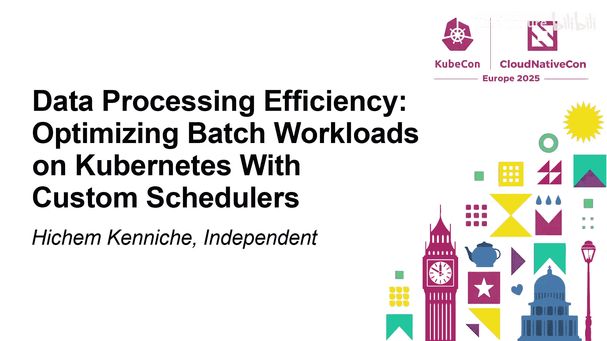
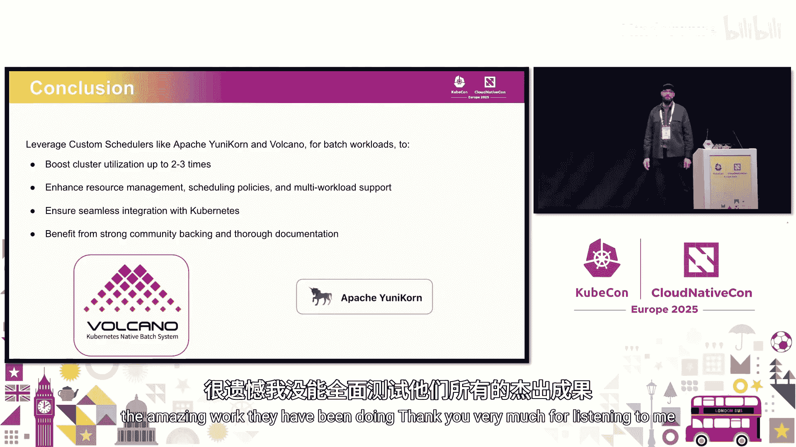

# 009：在Kubernetes上使用自定义调度器优化批处理工作负载效率

在本教程中，我们将探讨如何在Kubernetes上高效运行批处理工作负载，例如ETL、ELT和机器学习训练。我们将重点关注默认Kubernetes调度器的局限性，并介绍两种自定义调度器解决方案：Volcano和Yunikorn。通过学习，您将了解如何利用这些工具提升集群资源利用率，并更好地支持多租户和复杂的批处理作业调度需求。

## 背景与动机

我是一名数据工程师和机器学习工程师。我们来自Hadoop世界，后来迁移到了Kubernetes。Kubernetes最初是为无状态应用设计的，但如今它已成为运行各类工作负载的目标平台。我们最初在Kubernetes上运行批处理工作负载时遇到了很多挑战。

我们的项目源于构建一个开源平台，用于为城市骑行者预测最佳导航路线。这个平台需要处理实时事件（如道路封闭），并据此重新计算路线或重新训练模型。这要求我们的数据处理管道能够优先处理高优先级事件，同时保证平台持续运行。

## 默认Kubernetes调度器的局限性

上一节我们介绍了项目背景，本节中我们来看看为什么默认的Kubernetes调度器在处理批处理工作负载时存在不足。

首先必须承认，默认调度器本身是一项非常出色的技术。它内部包含预过滤、多种算法和概念，功能非常复杂和强大。然而，它并非为批处理世界的需求而设计。

以下是默认调度器在处理批处理工作负载时的主要限制：

*   **缺乏应用级概念**：默认调度器在Pod级别进行调度，无法识别一个应用（如Spark应用、Ray应用）由多个Pod组成。
*   **队列与公平性**：它本质上是一个单一的大队列，缺乏高级的队列管理、公平共享或优先级调度策略。
*   **调度策略有限**：最典型的是不支持“组调度”（Gang Scheduling）。组调度要求一个作业的所有Pod必须同时被调度运行，否则部分Pod运行而另一部分等待会导致资源死锁和低效。
*   **多租户支持有限**：难以在不同团队或业务单元之间有效地划分和保证资源。
*   **资源死锁处理**：例如，两个应用各需要4个Pod，但集群只剩下4个空闲资源。默认调度器可能给每个应用分配2个Pod，导致两者都无法继续，也无法完成，形成死锁。

## 自定义调度器的演进：从KubeBatch到Volcano与Yunikorn

认识到默认调度器的限制后，社区开始探索解决方案。最早的倡议之一是2018年的KubeBatch项目，它为Kubernetes上的批处理调度奠定了基础，可以说是后续所有自定义调度器的“祖先”。虽然现已归档，但其思想被继承和发展。

目前，有两个主流的、由社区支持的自定义调度器解决方案：Volcano和Yunikorn。

### Volcano调度器

Volcano是KubeBatch的一个分支，目前是CNCF旗下的项目。对于生产环境，项目由CNCF或Apache等基金会支持非常重要，这意味着它有活跃的社区和长期维护的承诺。

以下是Volcano的核心特点：

*   **专为批处理设计**：内置了对组调度等批处理场景的原生支持。
*   **丰富的资源管理**：提供复杂的队列、优先级、资源预留和抢占机制。
*   **适合大规模多租户集群**：能够有效地在多个团队间划分和管理集群资源。
*   **支持异构硬件**：对GPU等特殊硬件有良好的支持，这对于昂贵的AI/ML训练任务至关重要。

**适用场景**：AI/ML批处理、HPC工作负载、需要复杂调度策略和多租户管理的场景。

**最佳实践建议**：
以下是部署和使用Volcano时需要考虑的几个方面：
*   **规划队列管理**：提前设计好队列的层次结构和资源分配策略。
*   **明确资源需求**：为作业指定准确的资源请求和限制。
*   **管理工作依赖**：合理设计作业间的依赖关系，避免复杂的“意大利面式”依赖图。

### Yunikorn调度器

Yunikorn的名字源于“YARN Unified with Kubernetes”。它借鉴了Apache Hadoop YARN调度器的优秀理念，并将其引入Kubernetes世界。Yunikorn是Apache软件基金会下的项目。

以下是Yunikorn的核心特点：

*   **提供YARN式特性**：支持队列、公平调度、组调度和资源保障。
*   **非侵入式集成**：作为Kubernetes的一个调度器插件运行，无需大幅改动现有集群。
*   **优先级调度**：支持基于优先级的作业调度。
*   **友好的Web UI**：提供可视化界面，便于监控队列和作业状态（注：最新版Volcano也增加了UI）。

**适用场景**：大数据工作负载、多租户环境、资源需求动态变化的场景。

**最佳实践建议**：
与Volcano类似，使用Yunikorn也需要注意以下几点：
*   **设计队列层次**：根据组织架构或业务需求规划队列树。
*   **配置资源配额**：为不同队列设置资源上限和保障。
*   **利用优先级**：合理设置作业优先级，确保关键任务优先获得资源。

## 实践对比与经验总结

在构建骑行导航平台的过程中，我们在一个多租户集群（包含数据工程、ML、数据科学团队）中，使用有限资源测试了Volcano和Yunikorn。我们模拟了每小时上百个事件的处理，以及节点故障等场景。

以下是我们从实践角度得出的一些主观对比总结（评分：3星/笑脸为优，1星/哭脸为差）：

| 评估维度 | Volcano | Yunikorn | 说明 |
| :--- | :--- | :--- | :--- |
| **多工作负载支持** | ⭐⭐⭐ | ⭐⭐ | Volcano覆盖场景更广。 |
| **配置复杂度** | 😞 (较复杂) | 🙂 (相对简单) | Volcano功能更全面，因此配置项更多。 |
| **资源利用率** | ⭐⭐ | ⭐⭐ | 两者都能较好利用资源。 |
| **容错与恢复** | ⭐⭐ | ⭐⭐ | 在Pod/节点故障及抢占方面表现相似。 |
| **调度延迟** | ⭐⭐ | ⭐⭐ | 差异不大。 |
| **负载分布** | ⭐⭐ | ⭐⭐ | 表现接近。 |
| **作业完成时间** | ⭐⭐ | ⭐⭐ | 对于运行数小时的作业，差异不显著。 |
| **交互式工作负载** | 😞 | 😞 | 两者都不太适合Spark交互式笔记本场景。 |
| **已知问题** | 偶发资源饥饿 | 偶发Spark Driver因抢占失败 | 社区仍在持续改进。 |

**核心结论**：
1.  **两者均优于默认调度器**：无论是Volcano还是Yunikorn，在运行批处理工作负载时，在集群资源利用率方面都比默认调度器有数倍的提升。
2.  **增强了资源管理**：它们提供了更丰富的调度策略（如组调度）、更好的队列管理和多租户支持。
3.  **与Kubernetes无缝集成**：它们以插件方式运行，保持了Kubernetes的原生体验。
4.  **选择取决于具体需求**：Volcano功能更全面强大，适合复杂场景；Yunikorn理念更接近YARN，可能对大数据背景的团队更友好。社区拥有多个选择是一件好事。

**对社区的呼吁**：我们需要更标准化的基准测试方法和数据集（例如类似TPC-DS的基准），以便在更真实、可比较的场景下评估这些调度器的性能。

## 总结

本节课中我们一起学习了如何在Kubernetes上优化批处理工作负载。我们首先分析了默认Kubernetes调度器在处理ETL、ML训练等批处理作业时的局限性，然后介绍了两种主流的自定义调度器解决方案：CNCF的Volcano和Apache的Yunikorn。通过对比它们的特性、适用场景和实践经验，我们了解到这些工具能显著提升集群资源利用率和调度效率。最终，选择哪一个取决于您的具体工作负载复杂度和团队技术背景。希望本教程能帮助您更好地在Kubernetes上运行和管理批处理任务。

