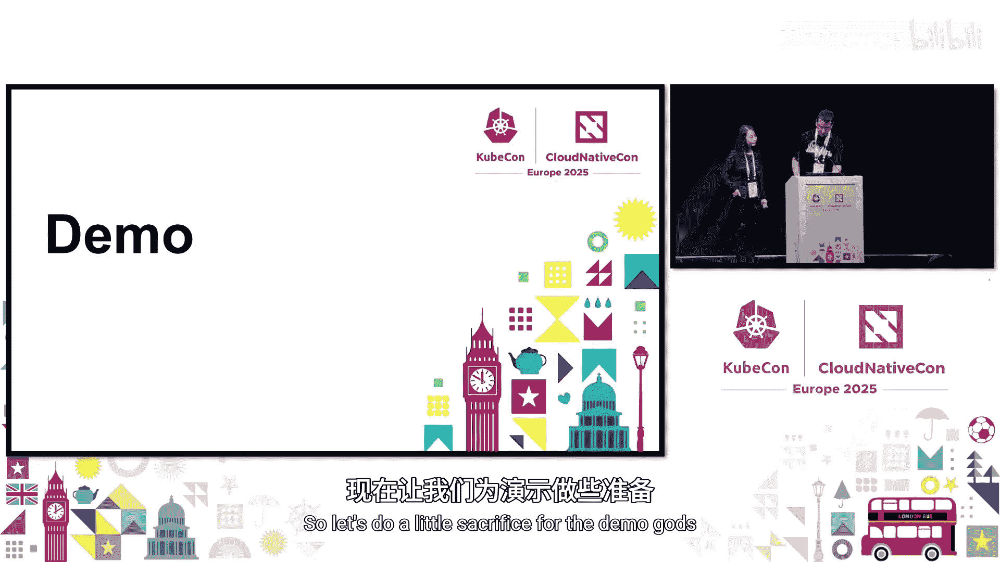
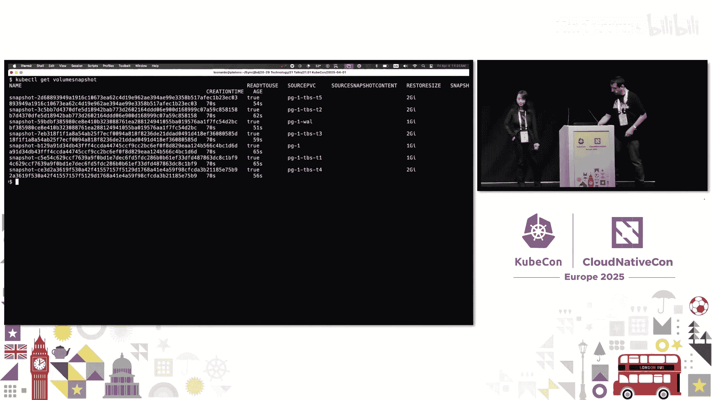
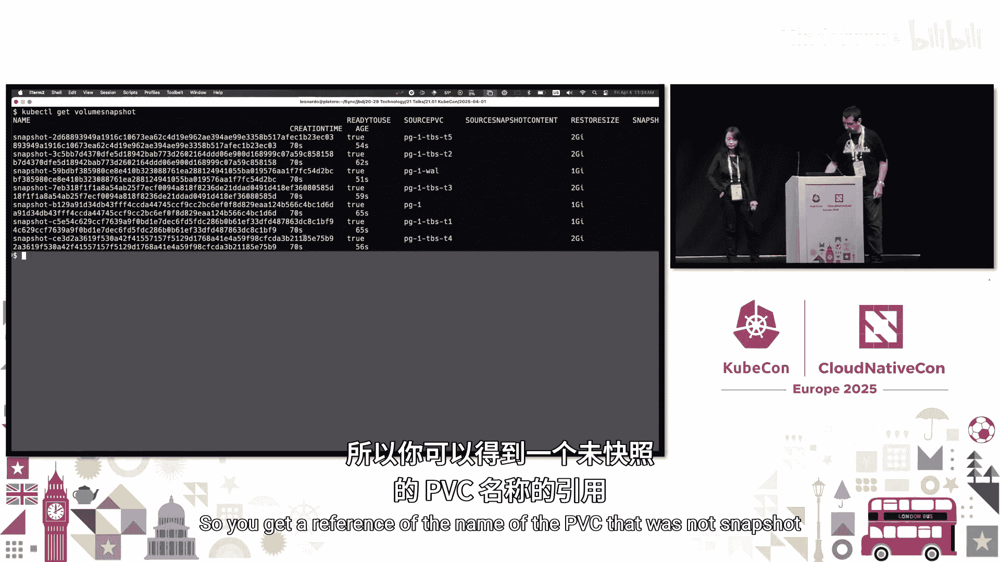

# 011：揭秘一致性卷组快照


## 概述
在本节课中，我们将要学习Kubernetes中的一致性卷组快照功能。我们将探讨为什么需要这个功能、它是如何工作的、以及如何使用它来保护运行在Kubernetes中的多卷应用程序。

## 为什么需要数据保护与灾难恢复
灾难可能随时发生。我们需要保护宝贵的数据免受潜在损失。以下是可能导致灾难的因素：
*   人为错误是主要因素之一。
*   火灾、洪水、网络攻击等。

如果数据中心被烧毁，存储在那里的数据肯定会丢失。然而，如果你在另一个位置备份了数据，你总是可以恢复数据。因此，数据保护和灾难恢复对于关键任务应用程序非常重要。

## 现有卷快照API的局限性
卷快照API在Kubernetes 1.12版本中引入，并在1.20版本中进入GA阶段。它允许你对持久卷进行崩溃一致性快照，并在灾难发生时使用该快照在以后恢复数据。它为保护在Kubernetes中运行的应用程序提供了基础构建块。

我们已经有了用于单个卷的卷快照API。那么为什么还需要卷组快照呢？现在，让我们看一个例子。

假设你有一个应用程序在运行，它使用多个卷来存储其数据、日志等。你想要保护你的应用程序。为了确保应用程序一致性，你需要在拍摄快照前暂停应用程序，并在之后恢复它。但暂停需要很长时间，而且成本很高。因此你可能不想频繁地这样做。但你仍然希望能够更频繁地备份数据。

如果没有应用程序暂停，你在时间点1对第一个卷拍摄快照。然后在时间点2对第二个卷拍摄快照。接着在时间点3对第三个卷拍摄快照。现在，你尝试将相同的应用程序克隆到不同的命名空间，或者你的原始应用程序可能已损坏，你正尝试从这些快照中恢复你的应用程序。

恢复后，你可能会遇到问题，因为快照是在不同时间拍摄的，你得到的数据是不一致的。我们如何解决这个问题？幸运的是，一致性卷组快照来拯救我们了。

## 一致性卷组快照简介
一致性卷组快照允许在**同一时间点**从多个卷拍摄快照，以确保写入顺序一致性。这对于拥有多个卷的应用程序非常重要。

拍摄一致性卷组快照后，你可以从快照创建卷并恢复你的应用程序。请注意，如果你的应用程序是数据库，你仍然需要进行崩溃恢复。Leonardo稍后会给出一个例子。

卷组快照功能支持崩溃一致性。在同一时间点对所有卷进行快照也比一次拍摄一个快照更高效。它提供了更好的性能。

## 卷组快照API设计
我们在卷快照于1.20版本进入GA后不久就开始设计卷组快照功能。但在最终确定设计之前花了一些时间，我们在1.29版本中将其作为Alpha功能引入。然后我们在1.32版本中将其移至Beta阶段。

该功能引入了三个新的API对象：
*   **VolumeGroupSnapshotClass**：由管理员创建，用于描述应如何创建卷组快照。
*   **VolumeGroupSnapshot**：代表用户为多个卷创建卷组快照的请求。
*   **VolumeGroupSnapshotContent**：代表存储系统下的物理卷组快照资源。

在动态配置的情况下，内容由快照控制器创建；在预配置的情况下，由管理员创建。Leonardo稍后将解释这两种配置类型。

### VolumeGroupSnapshotClass
在VolumeGroupSnapshotClass中，我们有CSI驱动程序的名称和参数。参数包含对Kubernetes不透明的信息，仅由CSI驱动程序理解。它包含删除策略。其工作方式与卷快照类中的删除策略相同。它可以是`Delete`或`Retain`。

以下是一个VolumeGroupSnapshotClass的例子。这里的删除策略是`Delete`。
```yaml
apiVersion: snapshot.storage.k8s.io/v1beta1
kind: VolumeGroupSnapshotClass
metadata:
  name: csi-groupsnapshotclass
driver: csi.example.com
deletionPolicy: Delete
```

### VolumeGroupSnapshot
在VolumeGroupSnapshot API的spec中，你需要指定源。源可以是标签选择器或卷组快照内容名称，具体取决于配置类型。卷组快照类名称可以留空，表示将使用默认类。

创建卷组快照后，你可以在状态中看到绑定的卷组快照内容名称和创建时间戳。你还会在状态中看到`readyToUse`参数，该参数指示此卷组快照是否已准备好用于恢复你的PVC。

以下是一个例子。注意这里的标签。你需要在所有要一起快照的PVC上指定该标签。
```yaml
apiVersion: snapshot.storage.k8s.io/v1beta1
kind: VolumeGroupSnapshot
metadata:
  name: my-group-snapshot
spec:
  source:
    selector:
      matchLabels:
        app: my-database
  volumeGroupSnapshotClassName: csi-groupsnapshotclass
```

### VolumeGroupSnapshotContent
在VolumeGroupSnapshotContent对象中，你有删除策略、CSI驱动程序名称、卷组快照类名称和源。源可以是存储系统上卷的卷句柄列表，或组快照句柄（包括卷组快照句柄和存储系统上各个快照句柄的列表）。

卷组快照和卷组快照内容彼此之间存在一对一映射。

在下面的卷组快照内容示例中，我们在源中看到卷句柄。在状态中，我们看到卷组快照句柄以及各个卷句柄和快照句柄对的列表。
```yaml
apiVersion: snapshot.storage.k8s.io/v1beta1
kind: VolumeGroupSnapshotContent
metadata:
  name: snapcontent-abc123
spec:
  volumeGroupSnapshotClassName: csi-groupsnapshotclass
  source:
    volumeGroupSnapshotHandle: group-snap-handle-from-storage
    # 或者使用 volumeHandles
    # volumeHandles:
    #   - handle-1
    #   - handle-2
  volumeGroupSnapshotRef:
    name: my-group-snapshot
    namespace: default
```

## CSI规范支持
为了支持此功能，我们还在CSI规范中添加了卷组快照定义。CSI规范中的此功能在CSI规范1.11版本中进入GA阶段。CSI规范没有Beta阶段。

我们添加了一个新的组控制器服务和一项新能力。我们添加了三个新的RPC：`CreateVolumeGroupSnapshot`、`DeleteVolumeGroupSnapshot`、`GetVolumeGroupSnapshot`。

为了在CSI驱动程序中支持此功能，存储供应商需要实现这个新的控制器服务和新的RPC。

## 系统架构与组件协作
在此图中，我们展示了CSI驱动程序如何部署，以及支持卷组快照的各种组件如何协同工作。我们通过快照控制器和CSI快照器Sidecar添加了卷组快照支持。

快照控制器承担了繁重的工作。它创建卷组快照内容（在动态配置的情况下），并负责绑定卷组快照和卷组快照内容。

CSI快照器Sidecar与CSI驱动程序一起部署。它监视卷组快照内容API对象。它调用CSI驱动程序在存储系统上创建或删除卷组快照。

我们引入了特性门控。由于这是Beta API，特性门控默认是禁用的。

## 两种配置类型的工作流程
现在，让我交给Leonardo。他将解释两种软件配置类型的工作原理。

你可以使用卷组快照做三件主要事情。第一个称为**动态配置**。这是当你需要备份并给定卷组快照类时使用的工作流程。你需要创建一个卷组快照对象。系统将为你配置一切：一个卷组快照内容、一组卷快照和一组卷快照内容。从一个对象中就能得到一切，这很神奇。

第二个工作流程称为**预配置**。这是当你希望Kubernetes集群控制存储中已存在的现有组快照时使用的。要使该工作流程生效，你需要自己创建所有对象：卷组快照内容、卷组快照、卷快照内容和卷快照。



第三个也是最重要的工作流程是**恢复**。这真的很容易做到，因为它被设计成可以像使用普通卷快照一样使用。我们稍后会看到。

### 动态配置详解
现在，我们将解释动态配置的工作原理。由于我是意大利人，喜欢古典音乐和歌剧，我将使用歌剧隐喻。我们将这个过程分为四幕，每幕都有场景。这是一部为四个角色创作的歌剧：Kubernetes管理员、CSI驱动程序、快照器Sidecar和通用快照控制器。

**第一幕**：你是一名Kubernetes管理员，正在办公桌前工作。一切都很顺利。突然，一位开发人员向你要一个数据库。你创建了一些存储。你知道最好将事务日志放在单独的卷中。因此，我将创建两个PVC：一个用于数据，第二个用于PostgreSQL中的事务日志（称为WAL）。这里最重要的部分是持久卷声明中数据卷和WAL卷之间的公共标签，在本例中名为`instance-name`。然后我立即配置一个卷组快照类，因为安全总比担心好。





**第二幕**：现在我们进入控制器管理器内部。有人创建了一个CronJob。CronJob控制器开始处理作业定义，并将其交给作业控制器。作业控制器创建了一个Pod。这个Pod触发你的数据库操作员进行备份。数据库操作员创建了一个卷组快照对象。看，我们有之前见过的`instance-name`标签。这很漂亮。我们还有用于卷组快照类名称的DNS。快照控制器被唤醒。它创建一个内容对象，并获取有关需要快照的卷的所有详细信息。

**第三幕**：我们在CSI驱动程序的Pod内部。快照器Sidecar意识到有一个新的卷组快照内容对象。但它不知道如何自己拍摄快照。它需要询问坐在旁边的CSI驱动程序朋友。因此它以gRPC格式发出`CreateVolumeGroupSnapshot`请求。CSI驱动程序执行工作并拍摄组快照。快照器Sidecar不断查询状态直到它准备就绪。然后它填充所有细节。快照控制器再次被唤醒，因为对象发生了变化。它现在有一个卷组快照对象和一个卷组快照内容对象。它需要创建一组卷快照和一组卷快照内容，因为这是你重新创建PVC时所需要的。它使用之前步骤中发送的数据来创建一切。这就是魔法的工作原理。快照器Sidecar再次被唤醒，因为有新对象。它询问CSI驱动程序这些对象的状态，并填充状态。现在它们已准备就绪，可以使用了。

**第四幕**：我们回到办公室。一切都很顺利。开发人员要求恢复。这总是发生。只需重新创建一个持久卷声明，并在规范内的数据源字段中引用之前步骤中创建的卷快照对象。这就像你使用普通卷快照一样。我们希望恢复变得容易，因为当你需要恢复某些东西时，通常已经遇到了麻烦。最好避免复杂性。这非常重要。

这就是动态配置的工作原理。正如你所看到的，这是团队合作。不仅仅是一个软件组件在施展魔法，而是协作。这里最重要的是所有这些软件组件之间的通信。这比实际的快照实现更重要。

## 故障排查与前提条件
如果某些功能不工作，我们需要知道这目前是一个Beta功能。我们需要检查特性门控是否已启用。通用快照控制器中有特性门控。CSI快照器Sidecar中也有特性门控。显然，我们还需要安装CSI驱动程序。我们需要检查PVC是否真的可以在同一时间一起快照。至少它们需要由同一个CSI驱动程序配置。并且该CSI驱动程序应该是在卷组快照类中引用的那个。

如果检查了所有内容但仍然不工作，那么日志是你的朋友。你需要检查在哪个步骤停止了，发生了什么，然后我们需要修复一些错误。

## 数据库应用示例（PostgreSQL）
我是PostgreSQL用户，所以需要分享一些关于PostgreSQL的内容。但这对于许多像RDBMS这样工作的软件系统都是正确的。基本上，你以一份价格获得两个数据存储。右边那个称为事务日志。每次你更改某些内容时，都会在那里添加一个记录。当你提交时，这会被刷新到永久存储。系统会定期执行检查点。检查点意味着它将把所有内容刷新到你的数据存储（左边的那个），数据存储可以像本例中那样分割到多个卷中。

对于这样的系统，你需要原语之间的协作，就像本例中的卷快照和数据库操作员一样。因此，有人需要启动`pg_start_backup`函数，该函数将在RDBMS内部调整一些旋钮并立即执行检查点。此时系统是一致的。然后你可以拍摄快照。完成后，你需要运行`pg_stop_backup`。这会停止备份过程。

当你需要恢复这种情况时，如果快照是在不同时间点拍摄的，数据库将不一致。数据库只会查找第一个快照之前立即的检查点（即执行`pg_start_backup`的那个），然后回放事务日志直到一致。这将需要一些时间，因为它们不一致。

与此同时，使用组快照，这更容易，因为所有内容都是一致的，并且会快得多。这就是为什么组快照深受像我这样的数据库人员喜爱。这对我们来说是一个很棒的功能。

## 演示回顾
在演示中，我们使用了CloudNativePG（CNPG）操作符。我们创建了一个集群对象，数据库分布在多个卷上。为了备份这个系统，我们运行了CNPG备份命令。它创建了一个备份资源，该资源触发了数据库操作员。操作员创建了一个卷组快照对象，该对象已准备就绪。最重要的部分是选择器。然后你得到其他所有东西，因为CNPG使用数据库状态来注释它。你还会得到一个卷组快照内容对象，以及每个PVC一个卷快照列表和卷快照内容列表。使用它们真的很容易。这是团队合作。

## 未来发展路线图
现在该功能处于Beta阶段，我们一直在努力修复错误，并尝试将此功能引入GA。我们希望看到更多存储供应商的实现，并希望看到更多Kubernetes应用程序的集成，就像Leonardo为PostgreSQL操作员描述的备份资源案例一样。


## 总结
在本节课中，我们一起学习了Kubernetes一致性卷组快照功能。我们了解了为什么需要它来确保多卷应用程序的数据一致性，探索了其API设计和工作原理，并通过示例和演示看到了它的实际应用。该功能为在Kubernetes中运行的有状态应用程序提供了强大的数据保护和灾难恢复基础，特别是对于数据库等复杂应用。随着更多存储供应商和应用程序的集成，它将变得更加普及和强大。