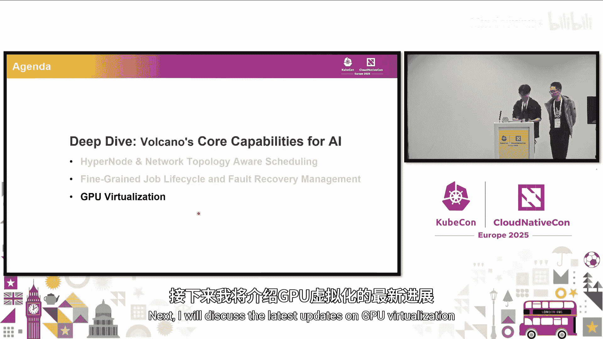
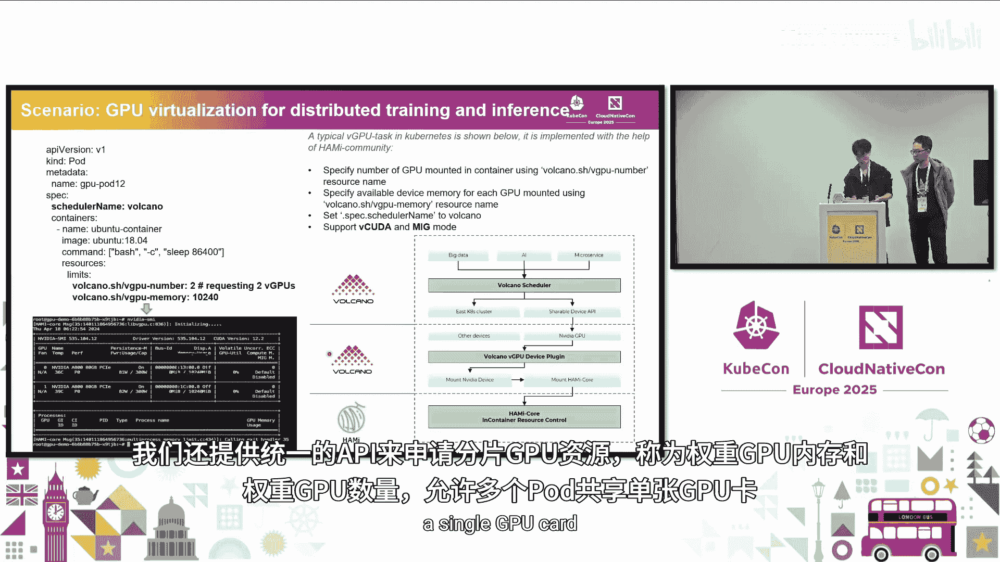
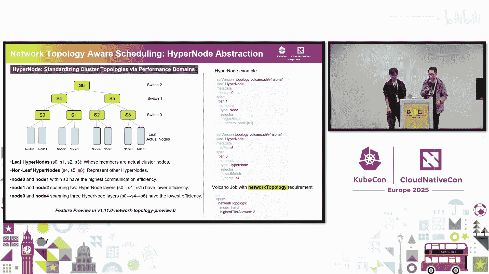

# 014：利用高级调度加速高性能AI训练

在本节课中，我们将分享近期在Volcano项目中为加速高性能AI/机器学习训练所做的工作。我们将重点介绍为AI工作负载开发的新功能，深入探讨调度相关的技术，并展望未来的计划。

## 概述

近年来，AI工作负载，特别是大语言模型（LLMs）快速增长。从规模、效率和性能的角度来看，对基础设施的部署和设置提出了更高级的要求。然而，对于数据科学家等用户而言，他们可能不具备深厚的基础设施背景，因此保持使用的简单性至关重要。我们需要在暴露底层硬件拓扑细节与为用户提供更简单的使用方式之间找到平衡。

基于我们的观察和研究，我们认为有两个关键趋势与云原生AI基础设施密切相关。首先，在资源层，关注点从节点内拓扑（如NUMA感知）扩展到了节点间拓扑，特别是网络拓扑。其次，在基础设施管理层，工作负载（如分布式训练和推理）变得越来越复杂，需要找到更简单的方法将工作负载的部署模式映射到底层基础设施，以更好地利用网络拓扑。

## 深入核心功能：Volcano项目简介

Volcano项目在此领域已工作很长时间。它最初是Kubernetes调度器下的一个子项目，名为`kube-batch`。我们发现，工作负载感知的调度非常重要，不仅仅是逐个调度Pod。我们还需要重用调度算法的中间状态，管理大量工作负载队列，并处理不同用户间的公平共享。因此，我们扩展了其范围，使其成为一个独立的CNCF项目。目前，Volcano是CNCF的孵化级项目，并被许多用户用于训练和推理场景。

Volcano主要支持以下功能：
*   **Batch API**：如Volcano Job、PodGroup和JobFlow。
*   **HyperNode**：用于抽象底层网络拓扑的新API。
*   **广泛的生态集成**：与主流AI框架、大数据框架及高性能计算框架均有良好集成。

## 核心新特性：HyperNode与网络拓扑感知调度

接下来，我们将详细介绍最重要的新特性之一：HyperNode和网络拓扑感知调度。

大型AI集群的设计者正在构建更强大的集群来支持训练和分布式推理工作负载。早期的研究和投资主要集中在节点内拓扑，而近期的需求则聚焦于节点间的网络拓扑。

例如，在NVIDIA DGX中，有“SuperPOD”的概念，即通过高性能GPU网络（如NVLink、InfiniBand）连接的一组节点。其他AI硬件解决方案提供商也设计了类似的概念，将一组节点定义为一个高性能域。尽管底层GPU网络的实现可能不同，但从抽象层看，它们有很多共同点。

因此，我们开始设计名为**HyperNode**的API。它定义了一组在网络性能（尤其是网络空间性能）上相似的节点。在实际用例中，一个HyperNode内的节点通常具有相同的规格。从API设计上，这个数据结构支持嵌套。

例如，底层是实际的Kubernetes节点。我们可以将所有连接到同一层级交换机（如switch0）的节点定义为一个HyperNode（如node7, node6，它们之间只有一跳）。我们还可以定义嵌套的HyperNode，例如将所有通过switch1第二层连接的节点作为一个更大的HyperNode。最终，在集群中会形成多个HyperNode树。你可以从数据中心网络或GPU网络（如InfiniBand）的角度定义不同的树，集群中允许多棵树并存。

当用户配置调度偏好时，可以在PodGroup中添加一个新字段：`networkTopology`。用户可以定义允许的最高层级（`tier`）。例如，将其设置为2，意味着调度器只会接受将Pod组调度到像S5或S4这样的HyperNode中的结果。这使得用户能够轻松地将需要密集通信的一组Pod映射到合适的节点组。

从工作负载的角度看，例如在推理场景中，像Laser之类的框架有“组”的概念来将一组Pod分组。对于训练，我们已经有Volcano Job，它本质上是一组可以协同工作的相似Pod。我们可以将这个组映射到Tier 1节点（即一跳连接的节点）。这样，可以在组内进行张量并行，在组间进行数据并行。这为用户提供了清晰的延迟预期，同时保留了灵活性，因为底层的实际网络配置可以根据所选的硬件提供商而变化。

## 调度工作流程与优势

我们目前正与许多硬件解决方案提供商合作，为不同的硬件加速器和AI集群提供自动发现功能。用户可以使用HyperNode控制器及提供商插件，自动发现底层的真实网络设置，并将其转换为一组HyperNode定义，形成集群内的树状结构。同时，我们依赖此机制收集状态信息，特别是健康检查。在大规模训练中，经常会遇到交换机或线缆连接问题，此功能可以更灵活地监控状态。

用户创建工作负载时，流程与往常一样，唯一增加的是`networkTopology`字段。Volcano调度器会找到最佳方式，将这组Pod映射到底层的HyperNode上。

对于网络拓扑感知调度，我们已工作很长时间。最初我们只是使用节点标签。从2020年开始，我们着手实现调度算法。然而，节点标签存在一些限制。因此，从去年开始，我们致力于将其实现为一个独立的API。

采用API机制有很多优势：
1.  **语义更清晰**：作为一个具有明确字段的API，语义清晰。而节点标签的键值对可能因不同提供商而异。
2.  **配置更简单**：使用标准API，用户可以轻松地复用相同的拓扑约束配置。而使用节点标签，配置可能很复杂。
3.  **粒度更灵活**：HyperNode数据结构的设计提供了粒度上的灵活性和可扩展性。用户可以约束工作负载在Tier 1或Tier 2连接的HyperNode间分布。而使用节点标签，这一切都需要手动完成。
4.  **生命周期管理更便捷**：通过统一的API，可以轻松查看HyperNode包含哪些节点，并监控健康状态。而节点标签需要不断查看和更新，且没有统一的地方来跟踪状态和向系统呈现健康信息。

## 其他关键功能更新

接下来，我们将介绍Volcano的其他一些功能更新。

### 任务生命周期管理与故障恢复

在分布式AI训练和高性能计算环境中，由硬件或软件问题引起的Pod故障可能会中断任务的完成。任务生命周期管理允许用户定义事件和操作来处理这些故障，例如重启整个任务。

最近的更新通过多层重启策略进一步增强了此能力。用户现在可以选择仅重启失败的Pod或单个任务，而不是重启整个任务，从而提高了任务执行效率。此外，还支持时间容忍策略。如果Pod在指定的时间窗口内恢复，则跳过预定义的操作。

### GPU虚拟化

鉴于GPU资源成本高昂且利用率低（尤其在AI推理场景），Volcano提供了vGPU功能以提高效率，支持`vcuda`和`mps`模式。Volcano还提供了一个统一的API来请求分数GPU资源，称为`vgpu-memory`和`vgpu-number`，允许多个Pod共享单个GPU卡。

### 多集群环境下的AI任务调度

越来越多的用户使用多集群来管理工作负载。虽然他们在单个集群中使用Volcano作为调度器，但为了在多集群环境中也利用Volcano的调度能力，Volcano孵化了`volcano-global`子项目，用于多集群调度，包括多租户下的队列优先级调度、公平共享和地域优先级调度。

### 统一云调度与队列管理

除了AI工作负载调度和资源管理，Volcano还提供了统一云调度的附加功能。队列是资源管理中的一个关键概念，可被视为资源分配的基本单位，通常对应不同的团队或部门。

由于部门通常需要共享或回收资源，扁平的队列结构不足以有效管理分层结构中的资源。因此，需要更细粒度的非扁平结构来处理不同部门间的资源分配。这在将大数据从YARN迁移到云原生平台时变得尤为关键。

一个队列有三个重要字段：
*   `capability`：硬性限制。
*   `deserved`：弹性配额，可被其他队列回收。
*   `guarantee`：保留资源，不可共享。

在后续版本中，Volcano引入了资源仪表盘，用户可以查看作业、Pod组和队列，检查资源使用情况以及队列内的关键字段。在即将发布的版本中，Volcano仪表盘将支持创建、删除和更新所有这些资源，提供更多的控制和灵活性。

Volcano原生支持批量作业调度，并完全兼容默认的调度算法。这允许您以统一的方式调度批处理作业和微服务。此外，通过并置在线和离线作业以及动态资源超售，我们可以在确保在线作业的服务级别目标（SLO）的同时，优化资源利用率。

## 未来发展规划

分布式推理是一个关键场景，Volcano正在与Laser等框架的API集成，以支持Gang Scheduling。此外，Volcano将支持对Deployment和StatefulSet等工作负载的弹性副本设置，从而为微服务实现更好的Gang Scheduling。

对于多租户场景，我们正在努力支持不同队列的不同调度策略。我们也在改进调度功能，目前正在推进对DRA（动态资源分配）的支持。如果您有任何功能请求或关于功能优先级的建议，欢迎在相关issue中分享。

## 总结与社区

自开源发布以来，Volcano吸引了大量开发者和用户，目前已被超过60个组织用于生产环境。我们感谢所有的贡献者和用户。欢迎在GitHub上分享您的使用案例，我们的社区是开放的，欢迎任何与Volcano相关的问题或请求。您也可以按照我们的贡献指南进行贡献。最后，您可以通过我们的办公时间、GitHub和Slack频道与我们联系。

