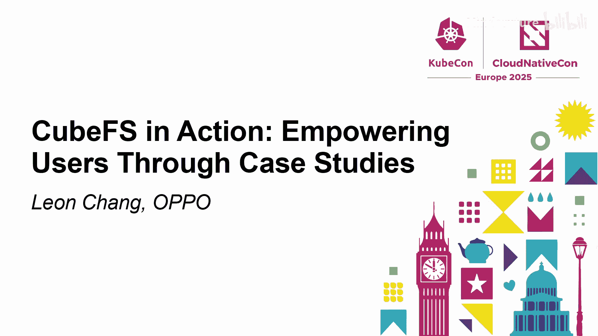
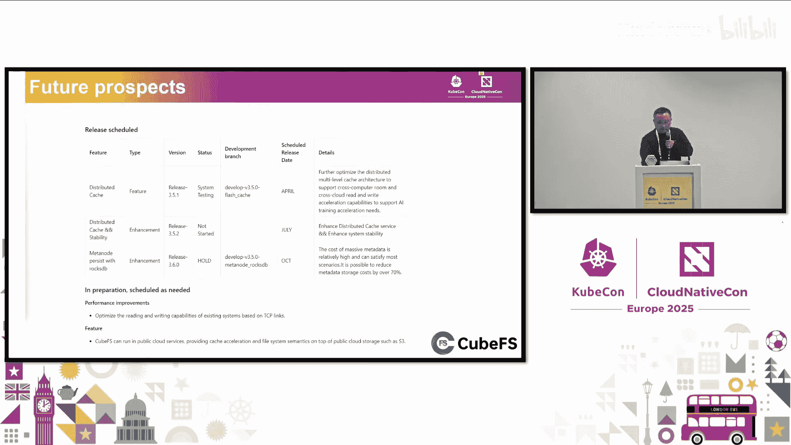
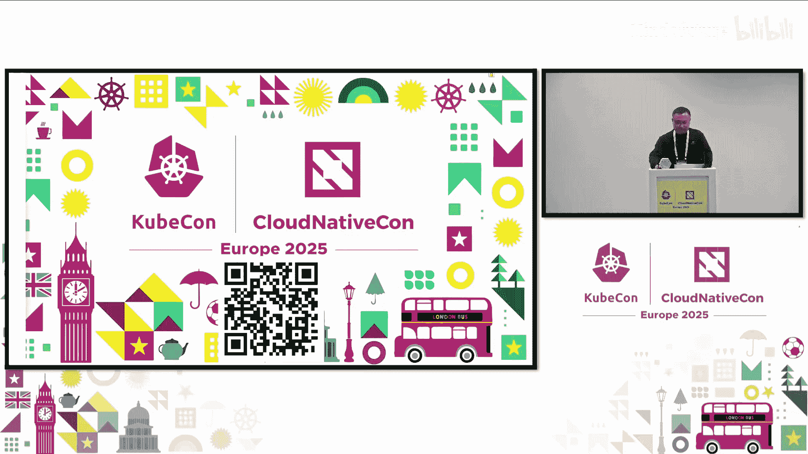

# 015：通过案例研究赋能用户

## 概述

在本节课中，我们将学习开源云原生存储系统 CubeFS 的架构、核心特性，并通过几个实际的终端用户案例，了解它如何解决 AI 存储、计算存储分离等场景下的挑战。课程内容基于 OPPO 工程师在 KubeCon 大会上的分享整理而成。

---

## 第一部分：CubeFS 架构介绍

上一节我们概述了课程内容，本节中我们来看看 CubeFS 的系统架构。

CubeFS 是下一代云原生存储系统，于 2019 年加入 CNCF，经过约五年发展，在去年年底从 CNCF 毕业。它是一个独立、自治的存储系统。

其架构主要包含以下几个子系统：

以下是 CubeFS 的核心组件：

*   **客户端子系统**：这是一个非常复杂的组件，提供 S3、HDFS、POSIX 等多种接口协议的能力。客户端与后端频繁交互，甚至参与整个系统的流程。
*   **缓存子系统**：这是一个为适配不同加速场景而全新设计的系统。目前，为支持 AI 场景，缓存系统变得越来越重要。
*   **元数据子系统**：经过精心设计，具有强一致性且易于扩展。许多系统功能，如回收站、审计和原子操作接口，都需要元数据子系统的支持。
*   **对象访问子系统**：与传统对象存储架构不同，CubeFS 基于文件系统引擎实现对象存储能力，可被视为一个无状态的代理系统。
*   **存储子系统**：这是数据子系统，包含两个引擎。
    *   **多副本引擎**：提供数据冗余。
    *   **纠删码引擎**：这是一个独立的存储子系统，使用纠删码算法，拥有自己的元数据管理、巡检和管理系统。

---

## 第二部分：CubeFS 核心特性

了解了架构后，本节我们来总结 CubeFS 的主要特性。

1.  **多协议支持**：支持 S3、HDFS、POSIX 等多种访问协议。
2.  **双存储引擎**：提供**多副本**和**纠删码**两种存储引擎。
3.  **强一致性**：所有核心组件基于 Raft 和 Quorum 协议实现强一致性。
4.  **分布式缓存**：具备分布式缓存能力，可用于加速场景。
5.  **智能分层**：支持将数据从高性能介质迁移到低成本介质，帮助业务削减预算。
6.  **云原生集成**：提供 CSI 插件，可轻松在 Kubernetes 上部署和使用。

---

## 第三部分：终端用户案例研究

上一节我们介绍了 CubeFS 的特性，本节中我们通过几个实际案例来看看它如何解决用户问题。

### 案例一：基于 CubeFS 构建 AI 存储

近年来，人工智能带来了巨大变革。每次产业升级都给存储带来挑战和机遇。在 AI 领域，我们面临存储容量、性能和数据流转的挑战。

AI 流程主要分为三个阶段，对存储有不同要求：

以下是 AI 流程各阶段对存储的需求：

*   **数据处理阶段**：数据源写入存储系统，同时进行大量数据过滤和清洗。CubeFS 能处理不同数据源，并基于其可扩展能力处理海量数据。
*   **模型训练阶段**：大多数训练场景中，数据读取是重复过程。CubeFS 具备处理高 IOPS 和低延迟的能力。
*   **推理阶段**：需要将训练好的模型快速分发到端点。分发过程要求高吞吐量并在短时间内完成。

**挑战：大语言模型与混合云**
为获得更好模型，需要大量 Token、参数和深度。这产生了巨大的数据集、检查点和模型。同时，计算资源消耗巨大，许多公司选择使用公有云算力。

将计算从私有云转移到公有云（尤其是 Kubernetes 环境）可以实现，但存储面临挑战：数据地理分布变化带来的**存储成本**、**传输成本**和**技术难度**。

**解决方案：缓存加速与智能分层**
OPPO 通过结合公有云缓存与自建云存储来满足 AI 训练需求。完整数据存储在自建云，热数据缓存在公有云。首次读取延迟相对增加，但重复读取性能更好。如果云中心与自建云中心距离短，影响可进一步降低。

**模型分发挑战与缓存系统**
模型分发是跨区域的一大挑战。高效分发建立在缓存系统上。缓存系统需具备以下特性：

以下是模型分发对缓存系统的要求：

*   **及时分发能力**：CubeFS 缓存系统支持路径配置，当写入发生在配置路径内时，文件可同步到指定缓存端点，实现写时预热。
*   **写时控制**：需要写时控制系统，防止客户端访问仍在写入的数据。
*   **主动预热**：支持主动预热能力，以便更好地与业务操作集成。主动预热是一项服务，将请求预热的目录作为特定任务，由管理系统驱动。

缓存系统还需具备高性能、高吞吐以及负载均衡能力，避免热点缓存无法承受海量请求。

**分布式缓存设计**
如架构图所示，AI 训练模型存储在 CubeFS 后，通过缓存系统分发到推理服务终端。缓存系统基于一致性哈希设计。文件被分割成多个段（每段 1MB），每个段映射到一个哈希槽分区，多个哈希槽分区映射到一个缓存节点。

分布式缓存支持内存和磁盘存储形式。在基准测试中，每个拥有 4TB NVMe 磁盘容量的缓存节点可提供 50G 的网络吞吐，瓶颈在于带宽。

**分布式缓存特性**
CubeFS 分布式缓存在设计时考虑了多个方面：

以下是其主要特性：

*   **弹性副本**：可根据业务需求配置缓存副本。主要用于两种场景：一是缓存系统常规运行中应对热数据的海量请求（通常使用单副本）；二是多区域分发场景，数据可基于多副本形式全球分布。
*   **距离感知**：在多副本缓存场景中，允许客户端选择网络延迟最低的副本缓存节点（该能力目前正在开发中）。
*   **任务调度**：预热需求可作为任务运行，由系统调度。大型模型等业务可在实际运行前进行预热。
*   **生态集成**：为集成云生态系统并适应更多使用场景，社区正寻求与 Fluid 等其他社区合作，提供后端数据持久化和云数据缓存加速的解决方案。

**智能数据分层**
在 OPPO，我们曾使用高性能磁盘支持 AI 场景的高吞吐，但存储 10PB 数据在 NVMe 上的年成本相当可观。通过对 AI 业务的数据分析发现，80% 的数据在三个月内不会被读取，热数据通常占总数据量的不到 10%。

平衡计算性能和存储成本的最佳方法是利用高性能介质承接写入压力并支持热数据读取，同时将数据迁移到低成本存储介质，即智能分层。

智能分层涉及几个技术点：

以下是智能分层的技术要点：

*   **生命周期系统**：由 CubeFS 的 Master 节点实现，用于运行分层任务，实现可控、自动的分层过程。
*   **可配置路径**：文件系统的目录可配置为分层路径。
*   **无感迁移**：迁移过程中，使用客户端确保正常的读写操作不受影响。
*   **数据安全**：为保障数据安全，迁移后原始数据会保留一段时间，并进行两端校验以保证数据一致性。

---

### 案例二：ClickHouse 的计算存储分离

计算和存储有不同的资源需求，因此计算存储分离是一个非常合理的解决方案。

在应用计算存储分离之前，ClickHouse 在存储方面存在几个痛点：

以下是 ClickHouse 存储的原有痛点：

*   **单节点存储容量有限**：运维人员需密切关注存储空间并及时操作。
*   **成本高昂**：必须为每个节点使用高容量磁盘以确保系统运行，成本显著。
*   **性能利用率低**：磁盘性能无法充分利用，因为它只能被特定节点访问。
*   **平衡复杂**：一旦节点间空间需要平衡，数据迁移和再平衡会相当复杂，并可能影响在线服务。

所有这些因素导致了与存储相关的稳定性问题。因此，最好将专业的事情交给专业的团队。

**架构演进 1.0：双单副本卷**
这是第一个版本的架构，保留了 ClickHouse 原有结构，使用了 CubeFS 的单副本模式。为确保卷分布彼此独立，ClickHouse 使用两个 CubeFS 集群来存储不同的副本。

这种方法提供了近乎无限的存储空间，并显著降低了成本，同时适应了 ClickHouse 的原始架构。然而，它也有缺点：由于使用了两个独立的单副本卷，存储无法保证一致性，因为两个卷无法感知彼此，存储平台不知道这两个卷的关系。

检查模块需要定期进行巡检以保证一致性。一旦因为单副本导致 CubeFS 出现坏盘，无法自动修复，修复依赖于 ClickHouse 的检查器模块。同时，为加快修复速度，坏盘应及时被 ClickHouse 检测到。然而，巡检和修复需要很长时间。这些系统架构的缺点在一定程度上影响了在线服务，导致请求处理延迟。

**架构演进 2.0：共享存储**
最终，ClickHouse 团队更新了整个架构，使用 CubeFS 作为共享存储。与上一页的设计相比，ClickHouse 无需关心数据修复。可靠性和稳定性远优于仅使用单副本的设计。并且，由于完全依赖 CubeFS，可以自动修复磁盘故障。此外，运维简单，CubeFS 可自行恢复故障，无需干预，业务无感知。

---

### 案例三：基于 SDK 的计算存储分离

ClickHouse 的计算存储分离基于 FUSE 客户端，存储通过 FUSE 访问。FUSE 是访问存储的标准工具，但在现实中，FUSE 可能影响整体性能。

SDK 具有以下特性：高性能和稳定性。这是因为 SDK 完全运行在用户态，绕过了内核态，同时摆脱了 FUSE 的许多限制，例如块大小限制。此外，它还能适应用户态的一些特殊需求。

图中展示的是一个基于 LSM Tree 的典型计算服务，该服务将 WAL 日志和 SST 文件都存储在 CubeFS 中。这是一个典型的仅追加写入的存储应用。

这是一个键值存储的典型架构，通常用于在线服务的大规模键值存储，如 Redis 和 RocksDB。对数据存储稳定性的要求极高，特别是 P99 延迟要求应保持在 1 毫秒以内。基于这些需求，我们在后端实际上做了大量优化。

---

## 第四部分：发展路线与未来展望

上一节我们探讨了 CubeFS 的实际应用案例，本节我们来看看它的发展路线和未来计划。

去年，社区发布了多个版本，包括四个正式版本和三个 Beta 版本。今年，CubeFS 已经发布了 3.5.0 版本，并且计划再正式发布三个版本。

以下是近期的版本计划：

*   **版本 3.5.1**：主要专注于分布式缓存（这在今天的演讲中多次提到）。但这并非最终版本。
*   **版本 3.5.2**：作为分布式缓存的第二阶段，将发布一个增强版本。同时，该版本将是一个稳定性增强版本，包含原子迁移等特性。
*   **混合云与成本优化**：如演讲中提到的，我们将把元数据内存放入低成本存储以降低内存成本，这也是混合云分层的基础。

如果我们还有精力，计划在以下方面进行投入：

以下是未来的重点方向：

*   **性能提升**：持续进行性能改进。
*   **混合云**：希望构建一个完整的混合云系统，支持外部 S3 存储，并使数据自由流动。

---

## 总结

本节课中，我们一起学习了 CubeFS 云原生存储系统。我们从其架构和核心特性入手，了解了它如何通过多协议支持、双存储引擎、强一致性和分布式缓存等能力满足现代应用需求。接着，我们深入研究了三个终端用户案例：在 AI 存储场景中，CubeFS 通过缓存加速和智能分层应对海量数据和混合云挑战；在 ClickHouse 场景中，它实现了计算存储分离，提升了稳定性和可维护性；在基于 SDK 的场景中，它提供了高性能的用户态访问。最后，我们展望了 CubeFS 的未来发展路线。希望本教程能帮助你理解 CubeFS 如何在实际生产中赋能用户。