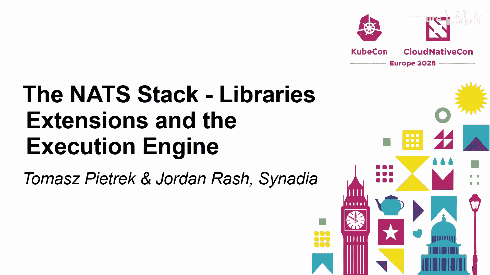
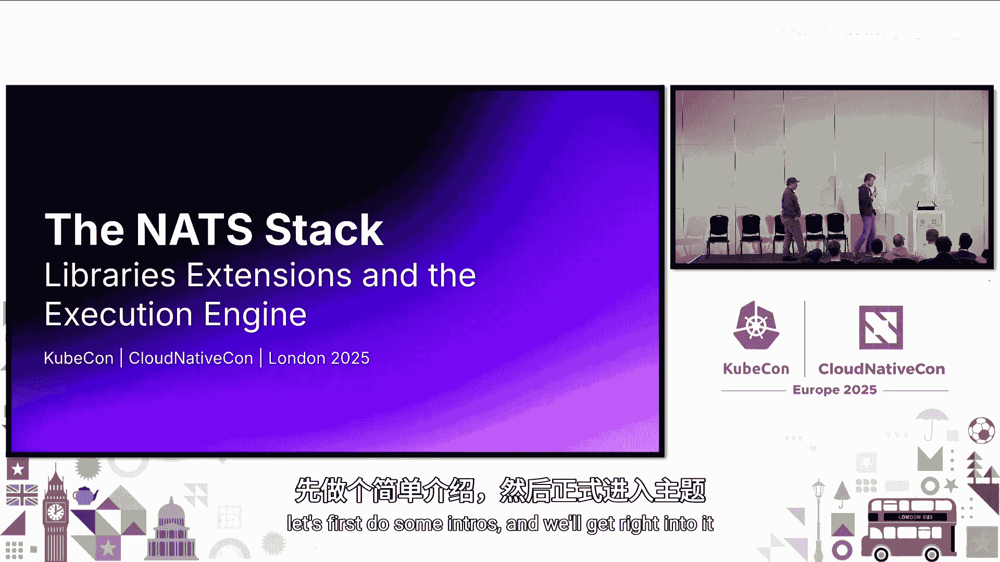
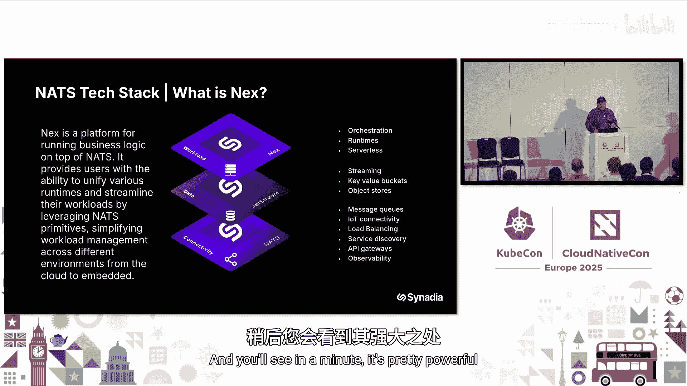
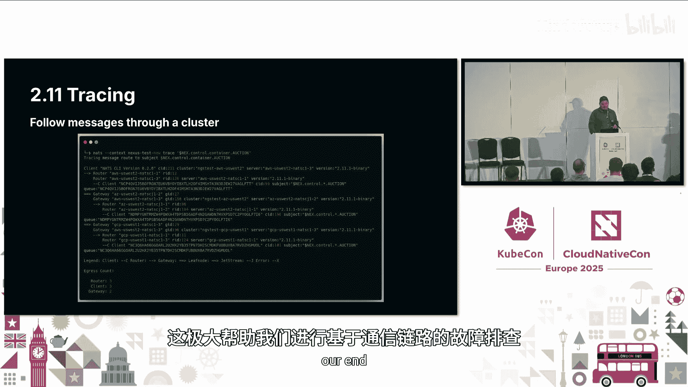
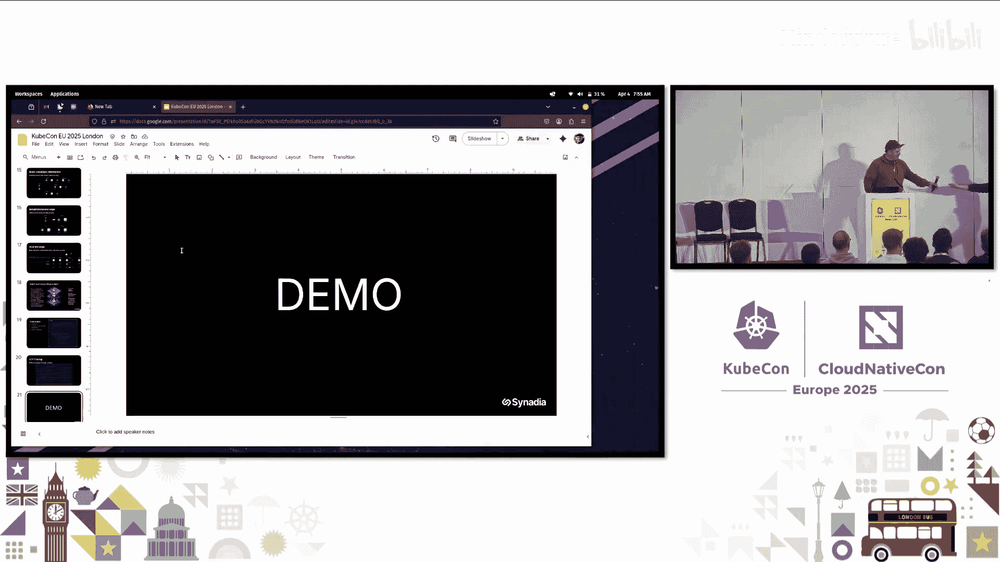
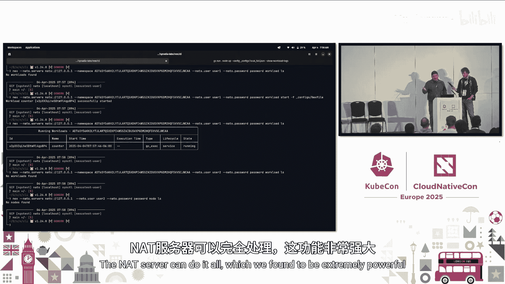
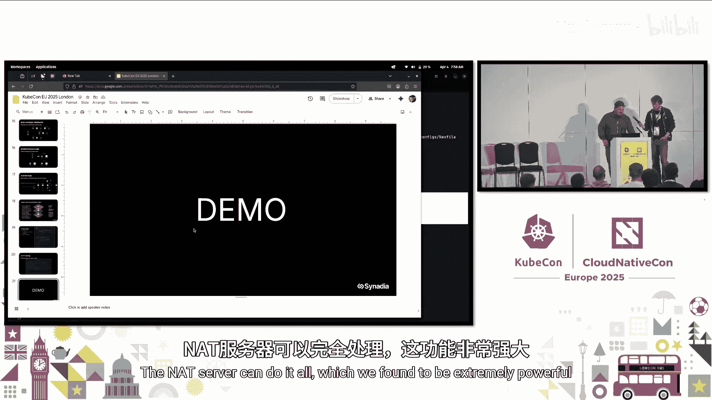
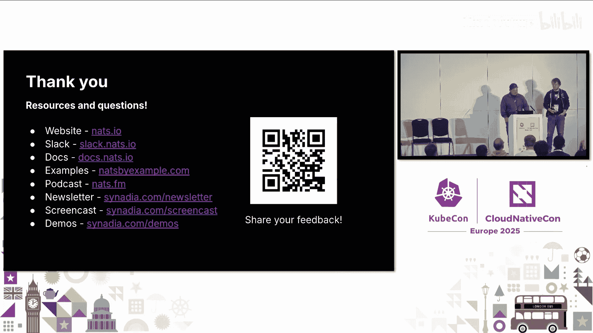

# 016：库、扩展与执行引擎

在本节课中，我们将学习 NATS 消息系统的核心栈，包括其库、扩展功能以及基于 NATS 构建执行引擎的实践经验。我们将探讨 NATS 如何简化分布式系统架构，并展示其在实际应用中的强大能力。

## 项目简介与愿景

上一节我们介绍了课程主题，本节中我们来看看 NATS 项目的核心愿景。

NATS 项目旨在应对现代分布式系统的复杂性。回顾过去，应用架构曾非常简单：一台服务器、一个应用、一个数据库。如今，应用必须分布式部署，可能需要在边缘运行，并且网络连接并不总是可靠。

当前的技术栈通常需要集成多种组件来实现通信、可观测性、持久化等功能。这导致架构变得复杂，开发者需要花费大量时间维护这些基础设施组件，而非专注于业务逻辑。

NATS 希望回归简单。它思考现代分布式系统真正需要什么，并尝试用一个统一的技术栈来满足这些需求，从而简化架构，让开发者能更专注于业务创新。

## NATS 的核心优势

了解了项目愿景后，我们来看看 NATS 具体提供了哪些优势来解决上述问题。

NATS 致力于消除传统架构中的固有局限。它不局限于一对一通信，支持多种通信模式。其设计是去中心化和位置无关的，非常适合边缘计算场景。同时，它力求用单一技术解决多种问题，降低学习和运维成本。

具体而言，NATS 提供以下关键能力：
*   **服务发现**：服务可被自动发现。
*   **灵活的通信模式**：支持请求/回复、发布/订阅等多种模式。
*   **去中心化与多租户**：支持安全的账户和用户体系，实现资源隔离。
*   **智能路由**：可将服务部署到边缘进行本地数据处理。
*   **应对网络问题**：能优雅处理不稳定的网络连接。

NATS 为不同角色的团队成员提供了价值：
*   **开发者**：获得统一的 API 来使用各种通信模式和持久化存储（如键值存储、对象存储）。
*   **架构师**：可以设计跨云、跨地域并延伸至边缘的基础设施。
*   **运维人员**：获得多租户、安全、监控等必要的运维管控能力。

## NATS 2.11 新特性与 Orbit

在理解了 NATS 的核心价值后，我们聚焦于其最新进展。NATS 2.11 版本带来了多项重要更新。

NATS 2.11 是一个备受期待的版本，其主要新特性包括：
*   **分布式消息追踪**：在大规模拓扑中追踪消息流向。
*   **每条消息的 TTL（生存时间）**：可为流中的单条消息设置独立的过期时间，无需为不同寿命的消息创建不同的流。
*   **消费者暂停与恢复**：可以暂停和恢复 JetStream 消费者，便于进行管理和维护。
*   **消费者优先级组**：为未来功能打下基础，例如在服务过载时将请求溢出到其他可用区或云。
*   **批量直接获取**：无需创建消费者，即可通过单个轻量级 API 调用获取多条消息。
*   **Orbit 扩展库**：为解决官方客户端跨语言特性同步和 API 迭代难题而设计。开发者可以为任何语言创建客户端扩展，经过社区验证和迭代后，稳定的 API 可被纳入官方客户端。

此外，NATS Kubernetes 运算符（NACK）进行了重写，现在包含适当的控制循环，并支持管理键值存储和对象存储。JavaScript 客户端也进行了重写，变得更加模块化。

## 灵活的集群架构模式

介绍完新特性，我们来看看 NATS 在实际中如何部署。NATS 支持极其灵活的集群架构。

NATS 服务器有两种运行模式：**服务器模式**和**叶节点模式**。它们是同一个二进制文件，通过不同的配置实现。利用这两种模式，可以构建出适应各种场景的集群拓扑。

以下是几种常见的架构模式：
*   **多云与本地混合**：将本地数据中心与多个云平台（如 AWS、GCP、Azure）的集群连接，共同为终端用户提供服务。
*   **边缘中心辐射型**：在零售门店等边缘位置部署小型集群，它们之间可以互相备份，同时连接到云端的大型中心集群。
*   **跨云 AI 网格**：在不同云中部署服务，通过 NATS 主题总线实时协调模型推理、训练和数据采集，实现资源的动态流动和故障转移。

NATS 不定义“边缘”的具体形态，它可以适配从大型机、服务器到手机、嵌入式设备的各类边缘环境。

## 基于 NATS 构建应用：执行引擎案例

了解了 NATS 的部署灵活性后，我们通过一个具体案例看看如何在其上构建应用。这里以构建“执行引擎”产品为例。

NATS 生态是分层构建的：
1.  **连接层**：提供发布/订阅、负载均衡、服务发现等基础通信能力。
2.  **JetStream 层**：在此之上添加了流、键值存储、对象存储等持久化功能。
3.  **应用层**：开发者可以基于前两层构建自己的应用。

在构建执行引擎时，团队发现无需引入额外的数据库或缓存等组件，许多功能已由 NATS 原生提供。甚至在安全方面，也可以利用 NATS 服务器的**账户系统**、**OAuth 回调**和**基于主题的权限控制**来实现多租户隔离，而无需在应用代码中编写复杂的安全逻辑。

## 实战演示：配置实现安全多租户

理论需要实践验证。接下来，我们通过一个演示来展示如何通过纯配置实现 NATS 的多租户安全。

演示从一个默认的不安全场景开始。两个用户都能看到和执行彼此的工作负载，甚至能执行管理员命令。

通过修改 NATS 服务器配置，创建三个账户（一个管理员，两个普通用户），并定义详细的**导出/导入规则**和**权限**，可以实现：
*   **用户隔离**：用户只能访问和管理自己账户下的工作负载。
*   **权限控制**：普通用户无法执行管理员专属的命令。
*   **高性能拒绝**：未经授权的请求会在 NATS 服务器层被立即拒绝，不会进入应用逻辑。

这证明了通过精心设计的 NATS 配置，可以为应用提供强大的安全基础，而无需在应用代码中重复实现这些逻辑。

## 问答与总结

在最后的互动环节，演讲者回答了观众关于工作负载类型、键值存储性能优化以及执行引擎与 NATS Micro 区别等问题。

关键点包括：
*   **工作负载**：执行引擎可以运行容器等多种类型的工作负载。未来将支持**事件触发**的函数即服务（FaaS）模式。
*   **键值存储性能**：NATS 2.11 引入的**每条消息 TTL** 功能旨在解决键值存储中手动压缩的性能问题，通过自动过期删除来保持存储引擎的轻快。
*   **与 NATS Micro 的关系**：执行引擎不是新的运行时，而是**控制平面**。它基于 NATS Micro 构建，负责将用户的工作负载（如 OCI 镜像）智能地部署到最合适的底层运行时（如 Kubernetes、ECS）中，简化了部署流程。

本节课中我们一起学习了 NATS 消息系统的整体栈、其简化分布式架构的理念、最新版本特性以及如何利用其强大功能（如灵活的集群模式和安全的多租户）来构建上层应用。NATS 通过提供单一、强大且灵活的技术，旨在帮助开发者从复杂的基础设施管理中解脱出来，更专注于创造业务价值。