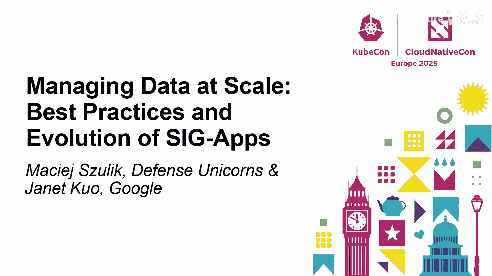
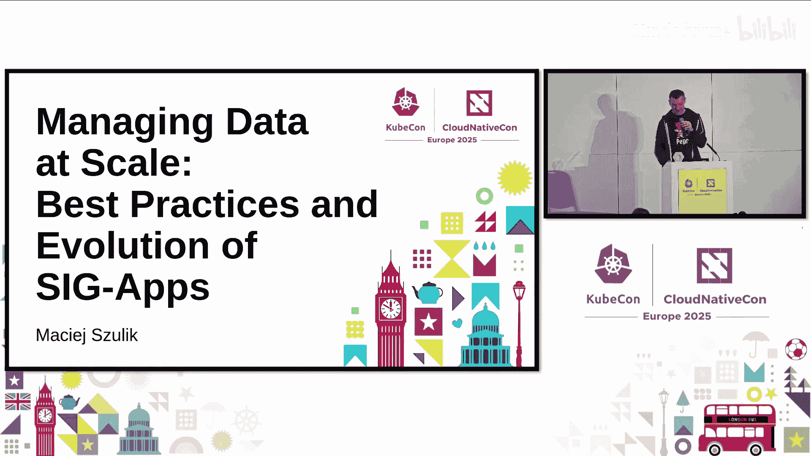
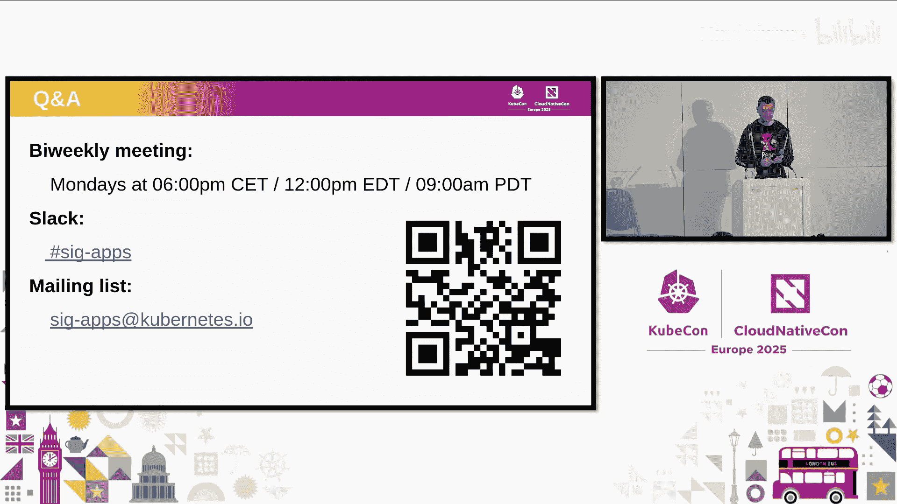

# 017：大规模数据管理 - SIG Apps 的最佳实践与演进






在本教程中，我们将学习 Kubernetes 中的 SIG Apps（应用程序特别兴趣小组）。我们将了解 SIG Apps 的职责、过去一年的主要工作成果、正在开发的新功能，以及如何参与社区贡献。内容将涵盖核心控制器（如 Deployment、Job、StatefulSet）的演进，旨在让初学者对 Kubernetes 应用管理工作负载的原理和未来发展有清晰的认识。

## 如何联系我们 📞

SIG Apps 定期举行会议，并提供了多种社区沟通渠道。

我们每隔一周的周一举行会议。会议时间根据您所在的时区有所不同，具体信息可在我们的网页上找到。

最佳的联络方式是通过 Kubernetes Slack 的 `#sig-apps` 频道，或者通过邮件列表。我们的邮件地址是 `sig-apps@kubernetes.io`。

## SIG Apps 的职责范围 🎯

上一节我们介绍了如何联系 SIG Apps，本节中我们来看看这个小组具体负责哪些工作。

SIG Apps 在 Kubernetes 项目中的影响范围相当广泛。理论上，我们始终欢迎并邀请社区成员来展示他们的工作。

虽然 SIG Apps 主要围绕 Kubernetes 核心控制器进行演进，例如 **Deployment**、**Job**、**CronJob**、**ReplicaSet**、**StatefulSet**，但我们始终乐于听取社区用户在使用 Kubernetes 时遇到的各类问题、解决方案，以及他们对内置资源限制的看法。

如果您发现 SIG 负责的内置资源存在限制，我们非常乐意听取您的问题，并探讨如何解决。多年来社区积累了大量的讨论，我们或许能为您指明正确的方向，或将您与曾处理过类似问题的其他团队或个人联系起来。

此外，我们每年都会撰写一份年度总结报告，概述我们特别兴趣小组的工作。您可以在演讲日程中找到相关链接。

## 近期稳定发布的功能 🚀

在了解了 SIG Apps 的职责后，本节我们将回顾过去一年左右发布的一些重要稳定功能。

以下是过去一年中我们发布的一些稳定功能，括号内标注了它们首次引入的 Kubernetes 版本。您可能已经有机会试用它们。如果您有任何反馈，请告诉我们。

1.  **Pod 中断预算的改进**：Pod 中断预算（PDB）原本会同时计算 **就绪** 和 **未就绪** 的 Pod。此次改进增加了一个新字段，允许您明确指定 PDB 只计算就绪的 Pod。这意味着未就绪的 Pod 可以被驱逐，这在某些情况下有助于节省资源。其配置类似于：
    ```yaml
    apiVersion: policy/v1
    kind: PodDisruptionBudget
    spec:
      selector: ...
      maxUnavailable: 1
      unhealthyPodEvictionPolicy: IfHealthyBudget # 新字段：仅健康Pod计入预算
    ```

2.  **ReplicaSet 缩容随机化**：过去，ReplicaSet 缩容时默认采用一种算法优先选择最新创建的 Pod。现在，我们引入了更多的随机性，使 Pod 选择更加随机，让用户对滚动更新过程有更多控制。

3.  **StatefulSet 起始序号**：此功能允许您为 StatefulSet 的 Pod 指定一个起始序号（例如从 3 开始，而不是默认的 0）。这在跨集群迁移 StatefulSet 时非常有用，可以保持 Pod 序号的一致性。

4.  **StatefulSet 的 PVC 保留策略**：与 SIG Storage 合作，我们为 StatefulSet 引入了明确的持久卷声明（PVC）保留策略。现在，您可以配置 StatefulSet，在缩容或删除时自动删除其关联的 PVC。这是一个需要您明确做出的决定，并且可以分别为“删除”和“缩容”配置不同的策略。

## 由 Batch 工作组驱动的重要功能 ⚙️

上一节我们看了一些通用功能的改进，本节中我们来看看由 Batch（批处理）工作组驱动的一系列重要功能。SIG Apps 近年来的很多工作，特别是过去两三年，都深受 Batch 工作组的影响。

这个工作组帮助确保各类工作负载（无论是 AI/ML 还是高性能计算）都能在 Kubernetes 集群中顺利运行。因此，许多围绕 Job 的改进都来自 Batch 工作组。

1.  **弹性索引 Job**：索引 Job 是 Job 和 StatefulSet 的结合体，每个 Pod 都有一个特定的索引。此功能允许您在同时修改 `completions` 和 `parallelism` 字段时，动态地扩展或修改索引 Job。这对于 MPI 或 HPC 计算场景非常有用。其核心思想是允许 Job 规模动态调整，公式可以理解为：`允许动态调整规模 iff (completions 与 parallelism 被同时且等值修改)`。

2.  **CronJob 创建时间注解**：当 CronJob 创建 Job 时，现在会向 Job 注入一个注解，记录该 Job **本应**被创建的时间。这样，即使集群出现问题导致执行延迟，您也可以在 Job 中检查到原始的计划执行时间。

3.  **Pod 索引注解**：我们为 StatefulSet 和索引 Job 中的 Pod 注入了包含其索引信息的注解。这样，Pod 内的应用程序可以直接读取这个注解来获知自己的索引号，而无需手动注入。例如，在 Pod 内可以通过环境变量或 Downward API 访问此注解。

4.  **每索引回退限制**：在 Job 中，您可以设置全局的重试次数限制（回退限制）。现在，对于索引 Job，此限制可以基于**每个 Pod 索引**单独计算。这意味着，如果一个 Pod 因为所在节点故障而反复失败，它只会消耗自己索引的重试次数，而不会导致整个 Job 因达到全局重试限制而失败。

5.  **Job 成功与完成策略**：此前，Job 必须完成所有指定任务才算成功。现在，您可以定义退出条件，允许 Job 在达到所有预设的完成数量之前就提前结束。这对于某些批处理用例很有用。

6.  **暂停 Job 执行**：此功能主要来自 Kueue 项目。它允许您为 Job 添加一个注解，标明该 Job 由一个外部控制器管理。Kubernetes 内置的 Job 控制器将不会执行这个 Job。我们投入了大量精力来确保 Job 对象的状态验证在 API 服务器中被正确定义和编码，从而强制外部控制器也必须遵守相同的状态报告规则，保证用户无论使用内置还是外部控制器，都能获得一致的 Job 状态体验。Kueue 的主要用例是在多集群环境中，在中心集群定义 Job，而实际执行则发生在子集群中。

## 未来路线图与挑战 🔮

在回顾了已发布的稳定功能后，本节我们展望一下 SIG Apps 正在规划和面临挑战的未来功能。

以下是我们计划在接下来几个版本中推进的一些功能。

1.  **Job Pod 故障策略**：这是一个已经开发了一年多的功能。它允许用户在 Job 中定义一套完整的子规则语言，来描述当 Pod 以特定方式失败时应采取的措施（例如重试、标记为成功等），而不仅仅是基于退出码。

2.  **Deployment 滚动更新同步**：目前，Deployment 在滚动更新时会尽可能快地创建新 Pod 替换旧 Pod。但在某些场景下（例如集群资源配额已满），这可能无法进行。此功能旨在让更新过程更加“同步”，即只有在旧 Pod 进入终止状态后，才创建新 Pod，从而避免触及配额限制。

3.  **增强的节点排空机制**：这是一个正在多个 SIG（如架构、节点、自动扩缩容、Apps）中广泛讨论的话题。目前 Kubernetes 缺乏表达节点排空过程细节的能力，例如排空应持续多久、哪些 Pod 可以强制驱逐等。我们正在探讨如何更好地描述整个排空过程，并引入外部参与者来协助工作负载迁移。

4.  **StatefulSet 的 MaxUnavailable**：这是一个历史悠久的特性提案，旨在为 StatefulSet 引入类似 Deployment 的 `maxUnavailable` 参数，以加速滚动更新。然而，主要的挑战在于如何为 StatefulSet 的滚动更新定义一个可靠且一致的监控指标。对于顺序更新的 StatefulSet，其更新速度受每个 Pod 内应用程序启动时间的显著影响，这使得我们难以定义一个通用的、可判断功能是否正常工作的度量标准。此外，原主要贡献者已转向其他工作，我们正在寻找新的志愿者来推动此功能。

## 总结 📝

本节课中我们一起学习了 Kubernetes SIG Apps 的方方面面。

我们首先了解了如何联系这个社区小组。接着，我们探讨了 SIG Apps 的广泛职责，它不仅负责核心控制器（Deployment、Job、StatefulSet等）的演进，也积极聆听社区反馈。然后，我们回顾了过去一年发布的一系列稳定功能，包括对 PDB、ReplicaSet、StatefulSet 的改进，以及由 Batch 工作组驱动的、针对 Job 的诸多增强功能，如弹性索引 Job、Pod 索引注解、每索引回退限制等。最后，我们展望了未来的开发路线，包括 Job Pod 故障策略、Deployment 同步更新、增强的节点排空以及 StatefulSet 的 MaxUnavailable 等面临挑战但意义重大的功能。

SIG Apps 始终对社区的反馈和贡献持开放态度。如果您对这些功能有任何想法，或希望参与贡献，欢迎通过之前提到的渠道联系我们。



