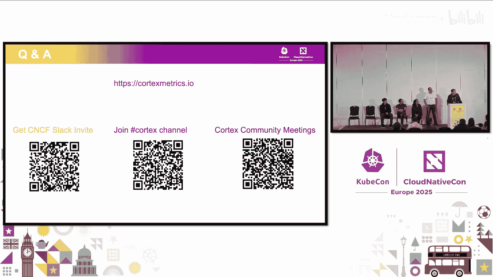

# 019：Cortex - 洞察、更新与路线图 🚀

在本节课中，我们将全面了解云原生监控项目 Cortex。我们将从项目介绍和架构开始，通过演示展示其核心功能，然后深入了解过去一年的重要更新，并展望未来的发展路线图。

---

## 项目介绍与架构 🏗️

感谢各位参与。今天我们将介绍 Cortex 项目，分享过去一年发布的新功能，并介绍未来一年的发展路线图。

我是来自 Apple 的 Aita Sharma。今天还有几位优秀的项目维护者共同参与：来自 Apple 的 Charlie Lee，来自 AWS 的 Daniel Blando，来自 Adobe 的 Daniel Saabay，以及同样来自 Adobe 的 Fririick Gonzalez。所有维护者都为这个项目工作了很长时间，很高兴他们今天能齐聚一堂。

以下是议程安排。我们将从 Cortex 是什么以及其架构开始，深入探讨各个组成部分。Charlie 将通过一个精彩的演示，展示如何开始使用 Cortex，并引导大家了解几个场景。然后，维护者团队将介绍在性能、可扩展性、可靠性等方面发布的新功能。接着，我们将讨论在互操作性、新格式兼容性以及协议升级方面即将推出的酷炫功能。最后，我们将讨论项目毕业的路线图，这是一个非常激动人心的里程碑。如果时间允许，我们将进行问答环节。

Cortex 是一个高度可扩展、特别是水平可扩展、高可用、多租户的 Prometheus 长期存储解决方案。它是许多大中小型组织寻求数据隔离时非常流行的多租户解决方案。Charlie 将深入介绍其功能。

### 什么是 Cortex？

Cortex 是 Prometheus 的水平可扩展版本。它致力于为查询和写入提供尽可能低的响应时间，并提供强大的稳定性保证。它是一个由社区管理的 CNCF 项目，得到多家公司的支持，并有来自世界各地的多样化贡献者共同构建。

### 架构概览

以下是文档中的架构图。从高层次看，存在写入路径和读取路径。

*   **写入路径**（图中橙色线）：OpenTelemetry 或 Prometheus 等工具将指标发送到 Cortex。指标首先到达 **Distributor** 服务，它负责速率限制并将请求分发到 **Ingester**。Ingester 负责在内存中存储指标以便查询。当 Ingester 积累了大约两小时的指标数据后，它会像 Prometheus 服务一样压缩这些数据，然后将压缩后的块发送到您选择的对象存储（如 Amazon S3 或 Google Cloud Storage），实现长期存储。
*   **读取路径**：Grafana 等仪表板查询 Cortex 以获取已发送的指标。查询时，您需要传递一个标头来指定要查询哪个租户的指标。Cortex 还具有许多缓存功能，以避免为获取租户指标而遍历整个查询路径。

### Cortex 的优势

Cortex 与类似解决方案有何不同？

*   **水平可扩展**：之前看到的所有组件都可以水平扩展。
*   **高可用性**：重启任何组件时，都有高可用性设置确保其他实例接管负载，不会出现无法解释的指标中断。
*   **查询速度**：Cortex 非常重视查询速度，并进行了积极优化。
*   **稳定性保证**：新功能总是被标记为“实验性”，以免用户感到意外。
*   **活跃社区**：这是一个 CNCF 项目，得到来自多家公司的众多开发者的支持，社区充满活力且健康。

以下是 Cortex 核心特性的快速概览表：

| 特性 | 描述 |
| :--- | :--- |
| **对象存储** | 支持多种后端（S3, GCS, Azure, Swift）以实现长期存储。 |
| **可扩展性** | 所有组件均可水平扩展。 |
| **性能** | 针对低延迟查询和写入进行了优化。 |
| **数据弹性** | 通过复制和高可用性设计确保数据安全。 |
| **数据灵活性** | 支持多租户隔离和动态配置。 |
| **社区驱动** | 由多元化的贡献者社区积极维护。 |

---

## 快速入门演示 🎬

上一节我们介绍了 Cortex 的架构和优势，本节中我们来看看如何快速上手。我们的文档提供了使用 Docker 或 Kind 快速入门的指南。Docker 方式包含单二进制模式，您可以将 Cortex 作为单个二进制文件在 Docker 中运行；还有微服务模式，您可以将 Cortex 拆分为其组成的微服务，观察各组件如何交互。

我想通过一个演示来展示 Cortex 的实际运行。右侧是一个空的 Kubernetes 集群。我将应用一个 Helm 文件，它将在微服务模式下安装 Cortex 及其相关组件。

*   **Cortex 微服务**：包括存储指标的 **Ingester**、作为指标写入入口的 **Distributor**、HTTP 路由器 **Query Frontend**、执行查询的 **Querier**。所有这些组件都是可扩展的。
*   **Prometheus 实例**：我还部署了一些 Prometheus Pod，它们将抓取集群中的指标，并以各自的租户身份发送到 Cortex。这模拟了开发（dev）和预发布（staging）两个租户的场景，它们之间的数据是隔离的。
*   **Grafana 仪表板**：我将端口转发到 Grafana，并创建数据源和仪表板，以可视化传入的指标。

在仪表板中，我展示了两个租户的样本摄入速率，它们应该发送相同的指标。我还设置了速率限制，目前每个租户的限制是每秒 25，000 个样本。底部显示了每个 Ingester Pod 当前每秒摄入的样本数。

以下是演示中展示的两个核心操作：

1.  **动态调整速率限制**：无需重启任何 Cortex 服务，我可以通过修改 Helm 覆盖值，将开发租户的速率限制从 25，000 动态更改为 2，000。这些值是运行时配置，服务会定期（默认10秒，演示中改为1秒）重新加载。您可以立即在仪表板上看到开发租户的摄入速率下降至 2，000，并且 Ingester Pod 接收的指标也相应减少。
2.  **自动扩展 Ingester**：为了存储更多指标，我可以将 Ingester Pod 的副本数扩展到四个。这可以基于某些指标自动完成。应用更改后，可以看到第四个 Ingester Pod 启动。随着负载在四个 Pod 间重新平衡，新 Pod 的样本摄入量增加，而其他三个 Pod 的摄入量减少。

这个演示展示了如何在多租户环境中快速调整配置并观察其生效。

---

## 社区更新与新功能 🆕

上一节我们通过演示直观感受了 Cortex 的运作，本节中我们来看看社区在过去半年的进展。自上次北美 KubeCon 以来，我们发布了 1.19 版本，新增了 9 位贡献者、3 位协理（Triage），完成了 381 次提交。

我们新增了协理团队，这是一组像外部贡献者一样持续贡献的成员，他们拥有更多权限来管理 PR 和 Issue，以减轻现有维护者团队的管理负担。当前的协理团队包括 Non Raj Goal、Song Jin Li 和我本人。

### 版本 1.19 的新功能

以下是 1.19 版本的主要新功能：

*   **对象存储后端**：OpenStack Swift 作为对象存储后端已结束实验状态。目前官方支持的四个后端是：Amazon S3、Google Cloud Storage、Microsoft Azure Storage 和 OpenStack Swift。
*   **Ruler 组件高可用性**：Ruler 是 Cortex 中评估 Prometheus 格式记录规则和告警规则的组件。在 1.19 之前，它并未实现真正的高可用。现在，我们引入了实验性的高可用支持，采用主/非主模式，而非对等复制。每个规则组被分配给一组 Ruler 实例，但在每个规则同步周期（默认每分钟）内，只由其中一个实例（主实例）进行评估。非主实例会检查主实例的健康状态，如果主实例不健康，非主实例将接管规则评估工作。这种方法最大限度地减少了重启和故障时的评估间隙，同时避免了冗余评估。
*   **Ruler 使用现有查询路径**：现在 Ruler 评估规则时可以选择使用现有的查询路径。这意味着规则评估会经过额外的网络跳转，但可以受益于 Query Frontend 中的缓存和查询拆分性能增强。
*   **分区压缩器**：分区压缩器有助于克服 TSDB 索引 64GB 的限制，并能加速包含大量或较大数据块的压缩过程。
*   **OTLP 兼容性改进**：我们持续改进 OpenTelemetry Protocol 的兼容性。新增了最大请求大小限制以防止内存问题；默认添加了 `target_info` 指标；并实现了一个名为 `promote_resource_attributes` 的新配置，允许为指标添加自定义标签，这在 OTLP 场景中非常有用。
*   **摄入优化**：我们专注于 CPU 和内存的优化。
    *   **Push Workers 池**：为 gRPC 引入了实验性的 Push Workers 池。通过复用 goroutine 而不是每次创建新的，在某些用例中，Ingester 的 CPU 使用率降低了高达 20%。
    *   **扩展 Posting 缓存**：借鉴了 Store Gateway 的思路，我们缓存查询的 Posting 结果而非完整响应。虽然 Ingester 的实现更复杂（需要处理缓存失效），但对于包含大量正则表达式的复杂查询，这也能带来显著的 CPU 性能提升（约 20%）。
*   **Ingester 优雅缩容**：扩展 Ingester 很容易，但缩容更复杂，因为可能丢失数据。我们为 Ingester 在环中引入了一个新的“只读”状态。处于此状态的 Ingester 仍然在环中可见，但不再接收新的写入请求，同时仍可服务查询请求。结合一个新的 API（用于获取 Ingester 上加载的块信息），我们可以安全地判断何时可以缩容 Ingester 而不会丢失查询数据。
*   **高可用性改进**：对于使用 Cortex HA 功能的用户，以前每个请求只接受一个 HA 对。现在，通过一个实验性标志，可以支持混合 HA 对，即在一个请求中包含来自不同 HA 对的样本，无需创建多个请求。

---

## 未来路线图与毕业计划 🗺️

上一节我们回顾了已发布的功能，本节中我们展望 Cortex 的未来。我们正在积极规划未来的版本。

### 持续进行的工作

我们目前正在推进以下工作：

*   **OTLP 兼容性**：继续完善 OTLP 支持，已合并 OTLP 元数据转换功能，预计在下一个版本中发布。
*   **性能优化**：正在探索为 Ingester 引入流式连接，在 Distributor 和 Ingester 之间保持长连接，以减少每次创建和管理连接的开销。初步测试显示可带来约 10% 的 CPU 性能提升。
*   **原生直方图**：目前支持整数直方图，正在努力添加自定义桶（buckets）的原生直方图支持。
*   **Prometheus 3.0 兼容**：我们正在内部积极讨论如何支持 Prometheus 3.0 的更多特性，包括新的远程写入 API 标头和流式传输，后者也将有助于提升 Ingester 的 CPU 性能。

### 项目毕业计划

对于 Cortex 而言，毕业是一个重要的里程碑，而非终点。我们拥有许多公开和私有的用户。为了推动项目毕业，我们需要完成以下工作：

1.  进行第三方安全审查。
2.  完善路线图变更流程的文档，以实现更具包容性的治理。
3.  最终确定发布管理的一些细节。

我们正在使用 GitHub Projects 来组织和管理未来的功能规划。

---

## 总结与问答 💬

本节课中，我们一起深入了解了 Cortex 项目。我们从其作为高性能、多租户 Prometheus 长期存储的定位开始，剖析了其写入和读取路径的架构。通过现场演示，我们看到了动态配置和弹性扩展的实际效果。随后，维护者团队详细介绍了 1.19 版本在可靠性、性能、兼容性等方面的多项重要更新。最后，我们展望了未来的开发重点以及推动项目达到 CNCF 毕业状态的计划。

Cortex 的成功离不开活跃的社区。如果您有兴趣贡献，欢迎访问我们的 GitHub 项目 `cortexproject/cortex`，查看标有 `good first issue` 的议题，我们非常欢迎您的加入。

**问答环节**

*   **问**：Cortex 是否有计划考虑将数据摄入到分析型存储（如 Snowflake、BigQuery）而不仅仅是对象存储？
*   **答**：目前没有。这是我们第一次听到这个建议，欢迎您创建一个 Issue 来发起讨论。通常，如果有社区成员感兴趣并愿意推动，新的想法就有可能实现。

再次感谢大家的参与和聆听，感谢所有为 Cortex 做出贡献的人。