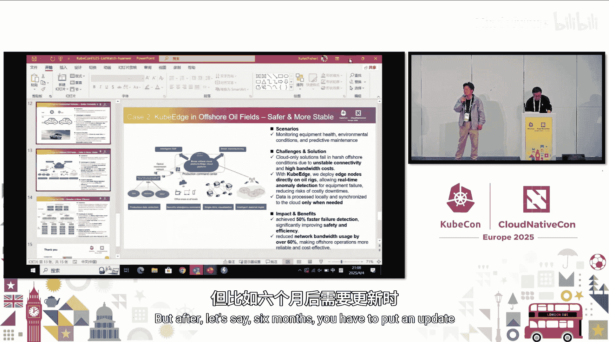
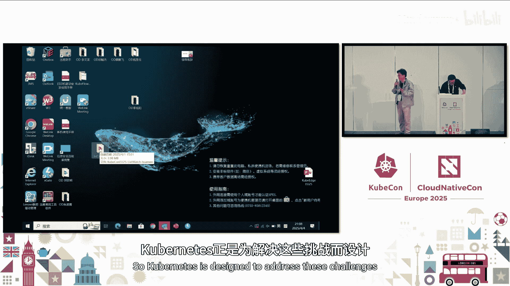
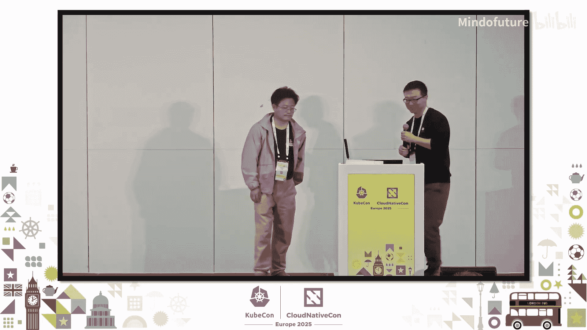

# 021：架构、用例与项目毕业更新 🚀

在本节课中，我们将深入学习 KubeEdge 项目。我们将从其发展历程开始，详细解析其核心架构，探讨关键特性如设备管理和边缘AI，并了解其在多个行业的实际应用案例。最后，我们会介绍其社区治理模式。通过本教程，你将全面理解 KubeEdge 如何将云原生的能力延伸至边缘。

## KubeEdge 项目发展历程 📈

KubeEdge 项目的发展历程清晰地展示了其从诞生到成熟的路径。

以下是其关键里程碑：
*   **项目创建与捐赠**：项目最初被创建，随后捐赠给云原生计算基金会。
*   **发布 v1 版本**：项目发布了第一个主要版本。
*   **大规模用例出现**：项目开始在实际生产环境中得到大规模应用。
*   **成为孵化项目**：在 2020 年，KubeEdge 成为 CNCF 的孵化级项目。
*   **创建子项目**：项目内部创建了专注于边缘AI的子项目 Sedna。
*   **卫星等用例拓展**：应用场景拓展至卫星等更广泛的领域。
*   **大规模测试**：项目进行了大规模部署与稳定性测试。
*   **项目毕业**：去年，KubeEdge 成功毕业，成为 CNCF 首个边缘计算场景的毕业项目。

## 项目背景与概述 🌐

上一节我们回顾了项目历程，本节中我们来看看 KubeEdge 旨在解决的核心问题。

从计算架构的演进来看，计算正从集中的云向区域边缘、现场边缘和近端边缘扩散。大量设备和数据产生于近端边缘。KubeEdge 的目标就是管理边缘侧的节点和应用。

KubeEdge 是首个云原生边缘计算项目。它采用开放的治理模式，在 GitHub 上拥有大量的关注者和贡献者，这些贡献者来自全球不同的组织。

## KubeEdge 核心架构 🏗️

了解了项目背景后，现在我们来深入剖析 KubeEdge 的核心架构。

KubeEdge 架构包含三个主要部分：云部分、边缘部分和物联网设备部分。
*   **云部分**：使用标准的 Kubernetes 控制平面，未作任何修改。同时包含云核心组件，这是 KubeEdge 自主开发的组件，用于增强云边之间在不稳定网络下的通信能力。
*   **边缘部分**：包含边缘核心组件。该组件集成了轻量化的 Kubelet，我们移除了原生 Kubelet 中在边缘场景下不必要的功能。此外，还包含用于物联网设备管理的功能模块。
*   **物联网设备部分**：通过名为 Mapper 的组件，可以将物联网设备连接到 KubeEdge 集群。

## 最新版本特性与组件详解 ⚙️

在掌握了整体架构后，本节我们聚焦于最新版本的特性和关键组件细节。

KubeEdge 的最新版本引入了多项新功能，例如支持批量处理边缘节点、支持云边通信的 IPv6、多语言框架支持、升级了 Kubernetes 依赖版本，并发布了新的仪表盘。

以下是边缘应用管理的详细流程：
1.  云部分通过 WebSocket 协议发送 Pod 元数据。
2.  边缘节点上的 EdgeHub 组件接收元数据。
3.  元数据被存储到边缘存储中。
4.  数据被设置到轻量化的 Kubelet。
5.  最终在边缘节点上运行容器。

对于物联网设备管理，KubeEdge 在边缘定义了一套设备管理接口。在云端，用户可以通过自定义资源定义来管理设备模型和设备实例，从而控制边缘设备的连接和数据采集。

## 网络与安全子项目 🔒

除了核心的编排和设备管理，KubeEdge 还拥有增强网络和安全的子项目。

**KubeEdge Mesh** 是一个网络子项目，专门解决边缘场景下的应用通信问题。在边缘场景中，节点之间通常无法直接连通。Edge Mesh 能够帮助位于不同站点的边缘应用相互通信，它包含了 DNS 等功能。

在安全方面，KubeEdge 是首批达到软件供应链安全三级要求的 CNCF 项目之一。它拥有完整的审计报告，也是首批集成 Falco 进行运行时安全监控的项目，并发布了威胁模型和安全防护分析。

## 边缘AI框架：Sedna 🤖

前面我们介绍了基础架构，现在来看看 KubeEdge 在人工智能领域的扩展——Sedna。

Sedna 是 KubeEdge 下的一个子项目，它是一个边云协同的 AI 框架。其架构同样包含云和边两部分。
*   **云组件**：全局管理器，负责所有边缘AI任务的管理、协调以及模型和数据集的管理。
*   **本地控制器**：运行在云节点和边缘节点上，是云边之间的桥梁。
*   **工作节点**：AI 任务实际运行的地方，可以在云或边缘运行。
*   **协同实验室**：通过该模块，边缘和云上的 AI 工作负载可以进行协同，例如实现联合推理和联邦学习。

## 边云协同推理用例 🧠

Sedna 框架支持一个重要的用例：边云协同推理。

边云协同推理是指在边缘节点部署轻量化的模型，在云端部署复杂的深度模型。推理请求首先在边缘节点进行处理。如果边缘模型计算的置信度较低，请求会被转发到云端进行深度推理；如果置信度满足要求，则直接由边缘节点返回结果。这种方式平衡了响应速度和推理精度。

## 行业应用案例研究 🏭

理论需要结合实际，本节我们将探讨 KubeEdge 在多个行业中的具体应用案例。

以下是几个典型案例：
*   **商用车队管理**：卡车常在网络信号不稳定的偏远地区运营。KubeEdge 使车辆能在本地运行 AI 模型，提前识别潜在故障。即使没有网络连接，车辆也能正常运行，这有助于降低维护成本并优化车队管理。
*   **海上石油钻井平台**：钻井平台通常远离陆地，与云端的网络连接非常弱。设备故障在这种环境下非常危险且代价高昂。KubeEdge 通过在现场处理数据，使客户能在更安全的环境下工作。即使钻井平台与云端的网络中断，系统也能保持稳定运行。
*   **内容分发网络**：CDN 从云端分发内容时，有时会因网络弱导致下载缓慢。KubeEdge 通过部署 AI 模型进行流量预测，确保只从云端获取必要的内容，从而实现更快的加载速度、更少的问题以及更高的服务器性能。

此外，KubeEdge 在智能交通、智慧能源、工业智能等多个传统行业也有广泛应用。

## 社区治理与生态 🤝

KubeEdge 的成功离不开其开放的社区治理和丰富的生态。

KubeEdge 采用开放的治理模型。顶层是技术监督委员会，其下设有多个分委员会和特别兴趣小组。社区拥有多个特别兴趣小组，分别负责如 Sedna、Edge Mesh 等子项目，以及设备管理等工作组。

KubeEdge 社区拥有众多来自不同行业的合作伙伴。社区活动丰富，例如参与 LFx 导师计划，培养来自全球的贡献者。官方网站上提供了合作伙伴的解决方案和详细的应用案例研究，可供查阅。

---

本节课中我们一起学习了 KubeEdge 项目的全貌。我们从其发展历程和项目背景入手，深入解析了其核心的三层架构，了解了设备管理、Edge Mesh 网络和安全性等关键特性。我们还探讨了其边缘AI框架 Sedna 和边云协同推理的用例。通过多个行业的实际案例，我们看到了 KubeEdge 解决实际问题的能力。最后，我们介绍了其开放的社区治理模式和活跃的生态系统。KubeEdge 作为云原生向边缘延伸的典范，为管理分布式边缘资源提供了强大的基础。