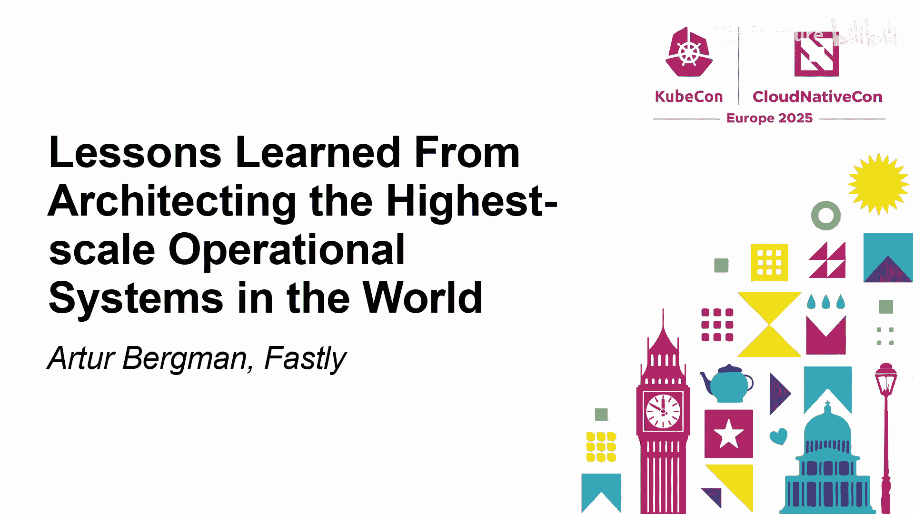
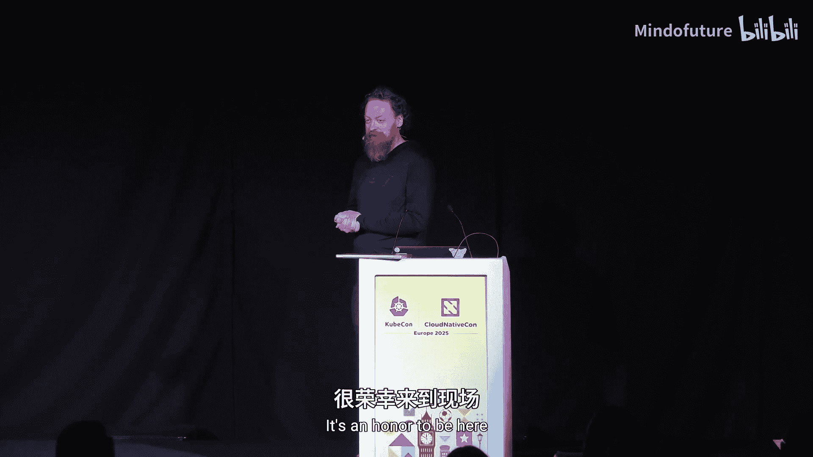
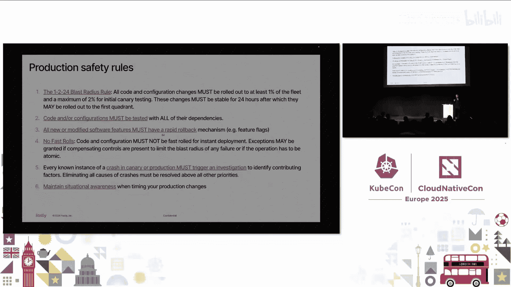

# 023：构建超大规模运营系统的经验教训

在本节课中，我们将学习来自Fastly公司创始人兼CTO Arthur Bergman的经验分享。他将从一个独特的视角，探讨如何构建和运营一个支撑全球数百万请求每秒的超大规模平台，并分享从一家百年工具公司Festool身上领悟到的平台哲学。我们将重点关注平台承诺、异常值处理、结果导向以及如何避免全局故障等核心概念。

---

## P23.1：平台的定义与承诺 🧩

上一节我们介绍了课程背景，本节中我们来看看什么是真正的平台。

Arthur Bergman认为，平台的核心在于其向用户做出的**承诺**。这个承诺是：平台提供的任何新产品、服务或功能，用户都会因为信任这个平台而直接使用，无需额外评估。例如，如果你使用苹果的生态系统，当苹果推出新耳机时，你很可能直接购买，因为你确信它能与你的iPhone无缝协作。

以下是判断一个产品是否构成平台的关键思考：

*   **承诺一致性**：平台新增的任何功能都必须符合其核心承诺。如果打破承诺，用户会感到困惑和不满。
*   **降低认知负荷**：用户选择平台内的新产品，是因为他们已经熟悉其生态系统、工具和术语，这大大降低了采用新事物的心智负担。
*   **价值实现更快**：由于用户无需重新学习，他们能更快地从新功能中获得价值。

这种“平台思维”不仅适用于软件，也适用于实体产品。以德国百年电动工具品牌Festool为例，其所有工具都围绕“集尘系统”和“轨道系统”构建了一个强大的平台。一旦用户购买了第一件Festool工具，他们就会倾向于购买更多，因为新工具能完美融入现有系统，兑现了“高效、整洁、一体化”的承诺。

---

## P23.2：关注异常值，而非平均值 📊

上一节我们探讨了平台的核心是承诺，本节中我们来看看在超大规模运营中，应该关注哪些数据指标。

在Fastly，团队花费大量时间分析数据，但他们关注的焦点不是平均值，而是**异常值**（Outliers）。在每秒处理数千万请求的规模下，即使是99.9%分位（P99.9）的延迟异常，每秒也会发生数十次。

以下是他们的实践方法：

*   **忽略中位数，关注高百分位**：永远不要只看中位数或平均值。应该关注P99、P99.9甚至更高的分位数据。这些“长尾”异常才是影响高端用户感知的关键。
*   **异常即机会**：异常值不是用来忽略的，而是用来深入挖掘和优化的目标。修复一个异常问题，往往能带动整个系统性能的普遍提升。
*   **文化驱动**：在Fastly，形成了一种文化：最复杂、技术最精通的客户首先会发现并抱怨这些异常。因此，主动寻找并修复异常值，是提升平台整体可靠性和用户体验的关键。

例如，他们曾发现P99.9延迟的尖峰，原因是事件循环中意外执行了文件I/O操作。修复这个问题后，不仅P99.9延迟下降，连P95、P90的延迟也得到了改善。

---

## P23.3：聚焦结果，审视“技术债” 🎯

上一节我们学习了关注异常值的重要性，本节中我们来看看如何确保技术工作始终服务于业务目标。

另一个重要经验是始终**聚焦于结果**（Focus on Outcome）。要不断自问：用户或客户试图实现什么目标？我们正在做的事情是否真正帮助他们更好地实现目标？世界上存在大量“无意义的创新”，它们并未解决核心问题。

这引出了对“**技术债**”（Technical Debt）这个词的反思。Arthur建议，永远不要仅仅因为“这是技术债”就提议修复某段代码。这个词的含义过于模糊：

*   **最佳情况**：它确实意味着维护这段代码的成本超过了其带来的收益。
*   **通常情况**：可能只是意味着“我不喜欢这段代码”。
*   **糟糕情况**：可能意味着“我想用新的热门语言或框架重写它”，而这可能只是个人偏好。

代码的运营价值基于 `代码价值 = 运行时间 × 产生的效益` 这个公式。已经稳定运行多年的旧代码，其价值可能远高于尚未经过生产环境考验的新代码。在考虑重构或重写时，必须基于对实际业务结果的清晰评估，而非对“技术债”的泛泛而谈。

---

## P23.4：如何避免全局性故障 🚫

上一节我们强调了以结果为导向，本节中我们来看看在超大规模下保障稳定性的具体策略。

对于全球性平台，如何防止全局故障（Global Outage）是重中之重。一个有效的思考方式是反向推演：**如何引发一次全局故障？** 这通常需要改变全局状态。

以下是Fastly总结的关键规则：

*   **统一代码与配置**：从引发故障的角度看，发布新代码和更新配置没有本质区别。一段沉睡一年的代码，可能因为一个配置开关的开启而被激活，其效果等同于一次新代码发布。任何全局性的、即时生效的状态变更都必须慎之又慎。
*   **快速回滚能力**：无论是代码还是配置，都必须具备快速、 ideally 自动化的回滚能力。这是从故障中恢复的最有效手段。
*   **保持态势感知**：在执行关键变更时，必须始终保持对系统整体状态的清晰认知。Fastly曾有一次故障，源于工程师在更新网络交换机时，未确认前一个交换机已恢复在线就操作了下一个，导致整个节点离线。
*   **实验室的局限性**：在超大规模下，世界上没有任何实验室或开发环境能完全模拟生产环境。因此，变更必须谨慎，并准备好回滚方案。
*   **严查生产环境崩溃**：任何在生产环境中发生的已知实例崩溃，都必须立即触发调查，不能放过任何蛛丝马迹。

---

## P23.5：实用工具与最终建议 🛠️

上一节我们介绍了防止全局故障的策略，本节中我们来看看一些能提升运营效率的实用工具和最终建议。

最后，Arthur分享了一些提升运营效率的实践：

*   **利用AI总结事件**：Fastly尝试将所有历史事件报告输入给大语言模型（LLM）进行训练。这带来了显著价值：
    *   **更快分类**：能够更快速地对新事件进行分类。
    *   **关联历史**：能更有效地关联和回忆起过去的类似事件。
    *   **生成摘要**：可以自动生成清晰的事件摘要，用于内部复盘或客户沟通。这尤其有助于分析那些未造成实际影响的“准事故”，就像航空业对待任何微小事故一样认真。
*   **抽象是关键**：良好的**抽象**（Abstraction）是构建和维护复杂系统的基石。你需要理解你上下各一层的抽象，并确保抽象是正确的。糟糕的、无计划的抽象会导致系统变成难以维护的“温彻斯特神秘屋”（一座没有图纸、随意扩建、结构混乱的建筑）。
*   **团队建设建议**：如果你的架构团队在旧金山湾区，可以组织他们参观温彻斯特神秘屋，这将是一次关于“缺乏规划和抽象会导致什么后果”的生动团队建设课。

---

本节课中我们一起学习了构建超大规模运营平台的多维度经验。我们从Festool的工具平台哲学中理解了**承诺**是平台的基石；通过Fastly的实践认识到关注**异常值**比平均值更重要；我们强调了所有技术活动都应**聚焦于业务结果**，并理性看待“技术债”；我们深入探讨了通过统一看待代码与配置、保持快速回滚能力和态势感知来**避免全局故障**；最后，我们了解了利用AI工具分析事件和建立正确**抽象**的重要性。这些经验对于任何构建或运营复杂、高可用性系统的工程师和架构师都具有宝贵的参考价值。