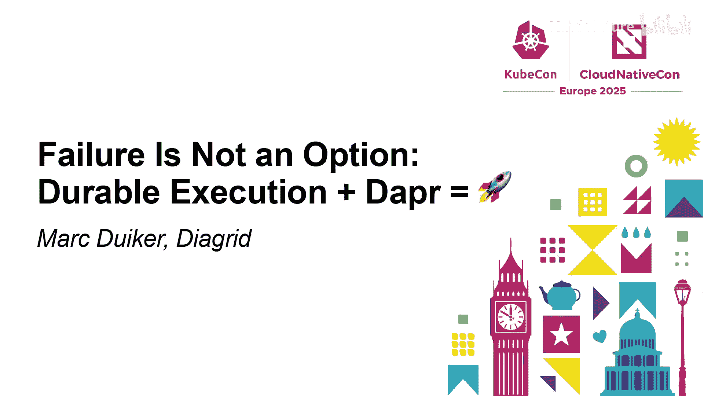
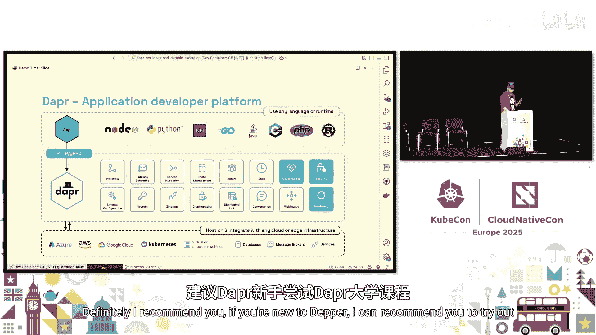
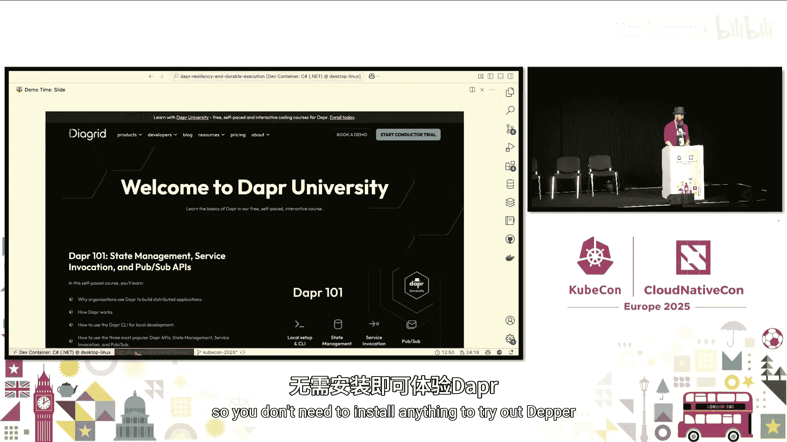
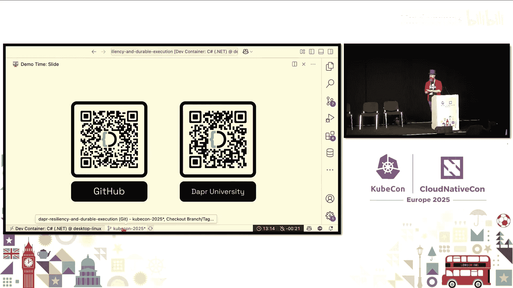

# 025：故障不是选项 - 持久化执行 + Dapr = 🚀



在本节课中，我们将学习如何利用持久化执行和 Dapr 工作流来构建具有弹性、能够自动从故障中恢复的分布式应用程序。我们将探讨故障的必然性、持久化执行的核心概念，并通过一个实际的订单处理示例来演示 Dapr 工作流如何确保业务流程的可靠完成。

---

## 故障是不可避免的

在 IT 领域，故障是不可避免的。无论是作为开发者还是最终用户，我们都亲身体验过各种系统故障。分布式系统尤其复杂，服务之间需要同步或异步通信，涉及消息代理、状态存储等多个移动部件，出错的可能性很高。

这并非新问题。早在 1994 年，人们就总结了“分布式计算的谬误”，指出我们在开始构建分布式系统时，常常会做出一些错误的假设。这些谬误提醒我们，分布式计算本质上是困难的。

## 解决方案：持久化执行





为了应对系统故障并实现自动恢复，同时限制故障的影响，一种有效的解决方案是**持久化执行**。

持久化执行意味着以有状态的方式运行代码。如果运行代码的进程失败，另一个进程可以启动，从持久化存储（如磁盘）中读取之前保存的状态，然后继续执行代码直至完成。

你可能对工作流引擎更熟悉，它们多年来一直在实现持久化执行。工作流由许多任务或活动组成，每个活动都是一个工作单元。工作流引擎通过将所有状态变更持久化到状态存储中来实现可靠性。

以下是持久化执行的基本工作原理：
1.  启动工作流时，其输入被存储到状态存储中。
2.  调度并执行第一个活动，其输入和输出也被存储。
3.  工作流不会立即继续下一个活动，而是会从顶部重新开始“重放”。
4.  它读取第一个活动的状态（知道已完成），然后调度第二个活动，并再次持久化所有数据。
5.  这个过程不断重复，确保即使工作流在任何时刻中断，所有已完成的工作状态都已保存，可以从中断点恢复。

## Dapr 与 Dapr 工作流

大约五年前，Dapr（分布式应用运行时）作为一个开源项目被创建。它通过以 Sidecar 模式运行在应用旁，为开发者提供了构建和运行分布式应用的简化 API，支持多种编程语言。Dapr 已于去年 11 月成为 CNCF 的毕业项目。

Dapr 工作流是 Dapr 的一个功能，它提供了一个“工作流即代码”的解决方案。这意味着你可以用熟悉的编程语言（如 C#、Java、Python、Go）编写工作流逻辑，并将其纳入源代码管理，便于代码审查和单元测试。

Dapr 工作流引擎内置于 Dapr Sidecar 中。当你的应用启动时，它与 Sidecar 之间会建立一个 gRPC 流。你的应用运行业务逻辑，而 Dapr Sidecar 负责调度工作流、持久化状态，并在发生故障时恢复执行。

## 工作流模式

使用工作流即代码解决方案时，你可以利用几种常见模式：

*   **任务链模式**：按特定顺序运行活动，通常前一个活动的输出是后一个活动的输入。
*   **扇出/扇入模式**：并行运行多个独立的活动，然后等待所有活动完成并聚合结果。
*   **监视器模式**：用于周期性任务。执行一个活动后，设置一个定时器（如24小时），工作流会卸载，定时器到期后唤醒并启动一个新的工作流实例。
*   **外部系统交互模式**：使工作流暂停，等待外部事件（如人工审批结果），然后根据事件负载决定后续流程。

在实际应用中，你通常会组合使用这些模式。

## 演示：订单处理工作流

接下来，我们通过一个订单处理示例来具体看看 Dapr 工作流如何运作。该示例包含两个应用：工作流应用和货运服务应用。

工作流的逻辑步骤如下：
1.  **更新库存**：检查是否有足够库存，如果有则扣减。
2.  **获取货运提供商**：查询可用的货运公司。
3.  **获取运费**：并行向所有货运公司查询运费。
4.  **选择最便宜提供商**：计算并选择运费最低的。
5.  **注册货运**：向选定的货运公司注册此次运输。
6.  **补偿动作**：如果注册货运失败，则执行补偿活动（如恢复库存）。

### 代码解析

以下是工作流定义的核心代码（以 C# 为例）：

```csharp
public class ValidateOrderWorkflow : Workflow<Order, OrderValidationResult>
{
    public override async Task<OrderValidationResult> RunAsync(WorkflowContext context, Order order)
    {
        // 1. 活动：更新库存
        var inventoryResult = await context.CallActivityAsync<InventoryResult>(
            "UpdateInventory",
            order
        );

        if (!inventoryResult.SufficientStock)
        {
            return new OrderValidationResult { Success = false, Reason = "库存不足" };
        }

        // 2. 活动：获取货运提供商列表
        var shippingProviders = await context.CallActivityAsync<ShippingProvider[]>(
            "GetShippingProviders",
            order.ProductId,
            new WorkflowTaskOptions { RetryPolicy = RetryPolicy.Constant(3, TimeSpan.FromSeconds(1)) }
        );

        // 3. 扇出：为每个提供商获取运费
        var costTasks = new List<Task<ShippingCost>>();
        foreach (var provider in shippingProviders)
        {
            var task = context.CallActivityAsync<ShippingCost>("GetShippingCost", provider);
            costTasks.Add(task);
        }
        // 扇入：等待所有运费查询完成
        var allCosts = await Task.WhenAll(costTasks);

        // 4. 选择最便宜提供商
        var cheapest = allCosts.MinBy(c => c.Cost);
        var selectedService = cheapest.ServiceName;

        // 5. 活动：注册货运
        try
        {
            await context.CallActivityAsync("RegisterShipment", (order, selectedService));
        }
        catch (WorkflowTaskFailedException ex)
        {
            // 6. 补偿：注册失败，恢复库存
            await context.CallActivityAsync("UndoUpdateInventory", order);
            return new OrderValidationResult { Success = false, Reason = $"货运注册失败: {ex.InnerException.Message}" };
        }

        return new OrderValidationResult { Success = true, TrackingId = cheapest.TrackingId };
    }
}
```

**关键点说明**：
*   `context.CallActivityAsync` 用于调度活动。调用后，工作流代码会暂停，活动由 Dapr 侧车调度执行。
*   `Task.WhenAll` 实现了扇出/扇入模式，并行执行多个活动并等待结果。
*   `try-catch` 和 `WorkflowTaskFailedException` 用于处理活动失败，并触发补偿逻辑。
*   工作流是**确定性**的，避免在流程中使用 `Guid.NewGuid()` 或 `DateTime.Now` 等非确定性调用，应使用 `context.NewGuid()` 和 `context.CurrentUtcDateTime`。

### 配置与运行

工作流和活动需要在应用启动时向 Dapr 注册：

```csharp
builder.Services.AddDaprWorkflow(options =>
{
    options.RegisterWorkflow<ValidateOrderWorkflow>();
    options.RegisterActivity<UpdateInventoryActivity>();
    // ... 注册其他活动
});
```

状态存储通过 `statestore.yaml` 组件文件配置（本例使用 Redis）：

```yaml
apiVersion: dapr.io/v1alpha1
kind: Component
metadata:
  name: orderstatestore
spec:
  type: state.redis
  version: v1
  metadata:
  - name: actorStateStore
    value: "true" # 工作流需要此设置
```

使用 `dapr run` 命令同时启动工作流应用和货运服务应用。

### 演示故障恢复

在演示中，我们启动工作流处理订单。在查询运费的过程中，我们手动停止所有应用进程，模拟系统崩溃。此时，工作流状态已持久化到 Redis。

当我们重新运行 `dapr run` 启动所有应用后，Dapr 工作流引擎会自动检测到未完成的工作流实例，并从上次持久化的状态点（即查询运费时）继续执行，最终完成订单处理，无需人工干预或重新触发。这完美展示了持久化执行带来的自动故障恢复能力。

## 使用工作流的注意事项

尽管工作流功能强大，但在使用时也需注意以下挑战：

1.  **确定性代码**：工作流逻辑必须是确定性的，以确保重放时行为一致。避免在流程中使用随机数或当前时间，应将非确定性逻辑封装在活动中。
2.  **幂等性活动**：Dapr 工作流保证活动**至少执行一次**，因此活动代码必须是幂等的。例如，数据库写入操作应考虑使用“upsert”或先检查后插入。
3.  **版本管理**：对工作流定义（如活动顺序、输入参数）进行重大更改是破坏性的。建议采用**工作流版本化**策略（如 `ValidateOrderV1`、`ValidateOrderV2`），而不是修改现有工作流。
4.  **状态大小**：在活动间传递的参数会被持久化。应尽量传递小对象（如ID），避免传递大型文档，否则会降低效率并增加存储开销。可以将相关操作合并到更粗粒度的活动中。

---



本节课中，我们一起学习了如何利用 Dapr 工作流实现持久化执行，从而构建能够从容应对故障的分布式应用。我们了解了其核心原理、常见模式，并通过实例看到了它如何确保业务流程的可靠性。记住，在分布式系统中，故障不是是否发生的问题，而是何时发生的问题。借助持久化执行，我们可以让故障发生时，系统依然能够成功地完成其任务。