# 027：使用 Nix 和 Flux 进行 Kubernetes 团队开发 🚀

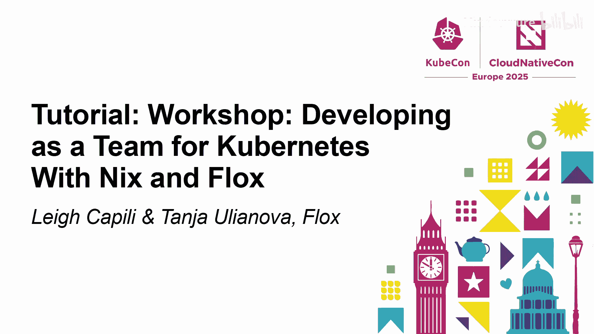

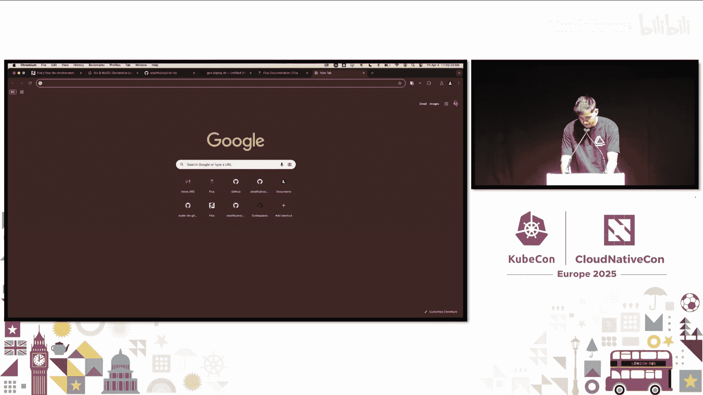

在本教程中，我们将学习如何结合使用 Nix 和 Flux 来构建一个可重现、声明式的开发与部署工作流。我们将从本地开发环境搭建开始，逐步构建一个 Go 应用，并将其容器化，最终部署到 Kubernetes 集群中，体验从代码到生产的完整、一致的协作流程。

---

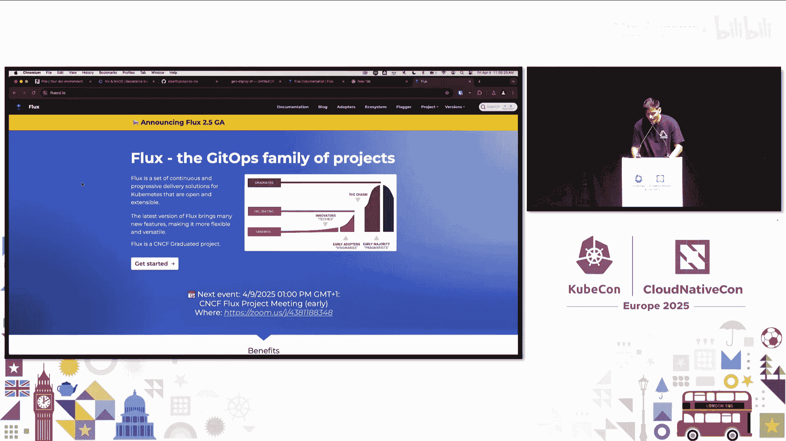

## 环境准备与项目概览 💻

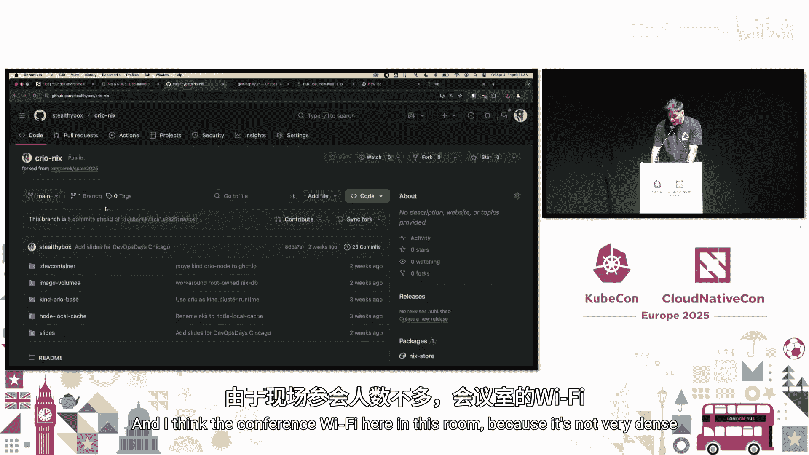

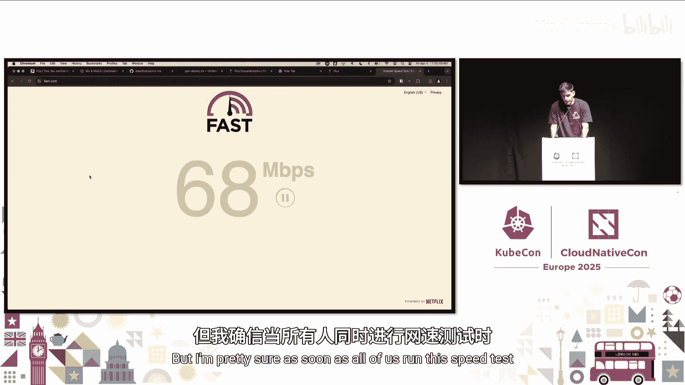

首先，我们需要准备开发环境。我们将使用一个预配置的 GitHub Codespace，其中包含了 Nix、Flux 和 Kubernetes 工具链。

以下是设置步骤：
1.  访问 GitHub 仓库 `stealthybox/cryo-nix`。
2.  点击绿色的 “Code” 按钮，选择 “Open with codespaces”，然后点击 “New with options”。
3.  建议将核心数提升至 4 核，以获得更快的计算速度。
4.  创建 Codespace 后，在终端中克隆第二个演示仓库：`git clone https://github.com/stealthybox/scale-nix-gitops`。
5.  在 VSCode 中，按 `Cmd+Shift+P` (Mac) 或 `Ctrl+Shift+P` (Windows/Linux) 打开命令面板，输入 “> Add Folder to Workspace”，将 `scale-nix-gitops` 文件夹添加到当前工作区。

这个开发容器已经使用 Nix 和 Flux 声明式地配置了所有依赖，包括 Docker、Kubernetes 命令行工具和 `kind` 集群。

---

## 理解依赖管理与 Nix 的优势 📦

在团队协作中，依赖管理是一个常见痛点。不同的操作系统、不同的包管理器（如 Homebrew、apt、pacman）可能导致团队成员使用不同版本的软件，引发“在我机器上能运行”的问题。

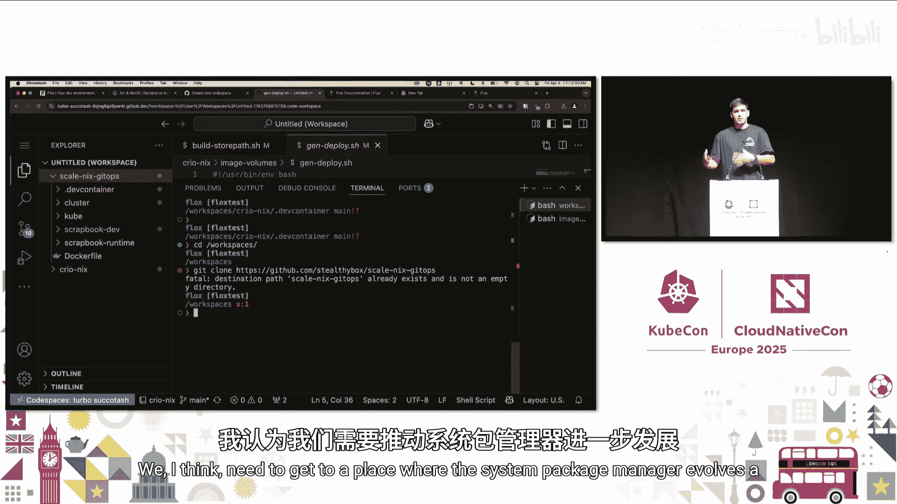

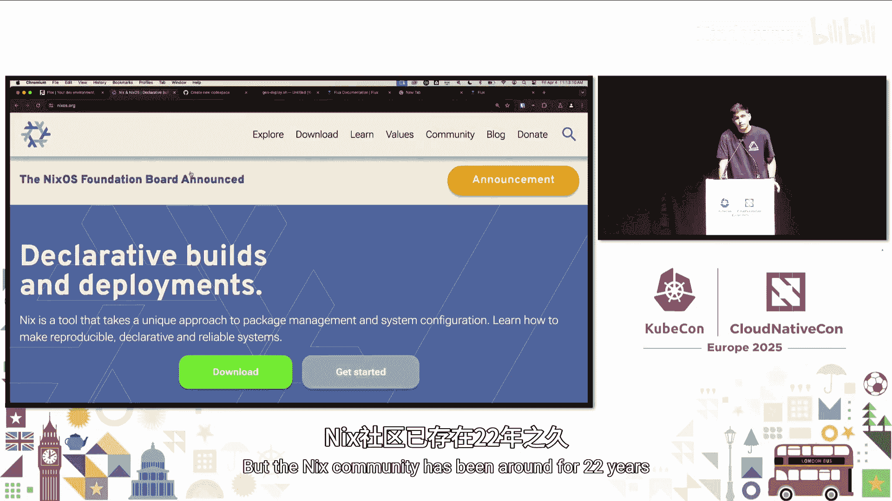

容器化（如 Docker）部分解决了环境一致性问题，但它引入了虚拟机开销，并且无法充分利用宿主机的原生硬件性能（如 GPU）。

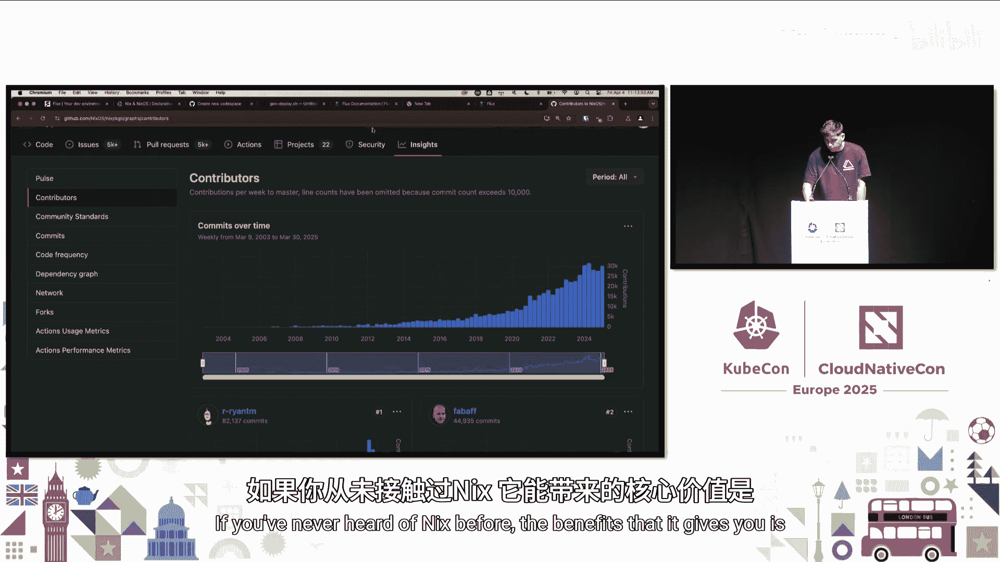

Nix 是一个功能强大的**函数式包管理器**，它通过声明式和**密闭的**方式构建可重现的软件。其核心优势在于：
*   **声明式构建**：软件构建过程由声明式语言描述。
*   **可重现性**：相同的输入（描述）总是产生相同的输出（二进制包）。
*   **依赖图**：软件由其依赖关系图精确组装。
*   **跨平台支持**：一个软件包可以针对多种操作系统和 CPU 架构进行交叉构建。

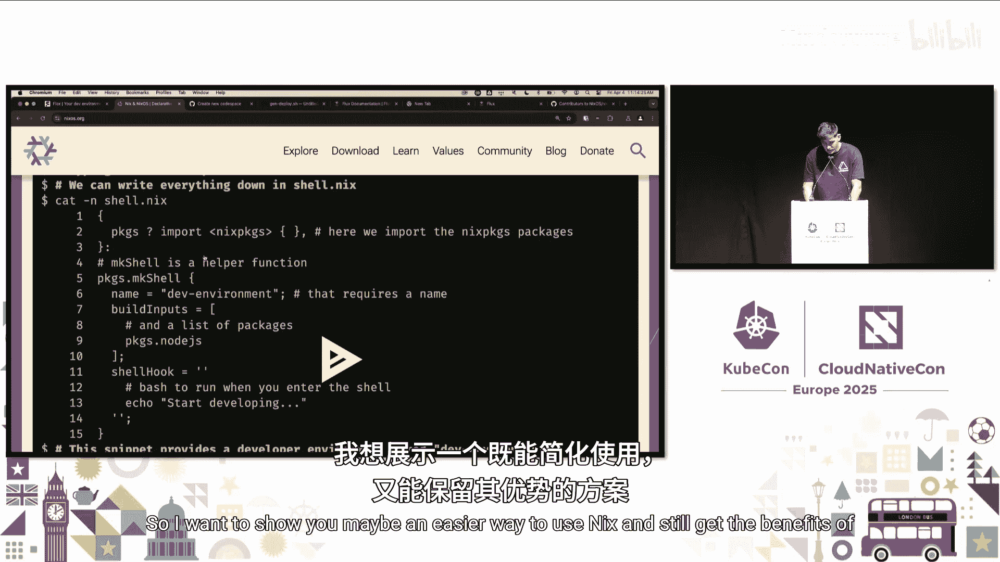

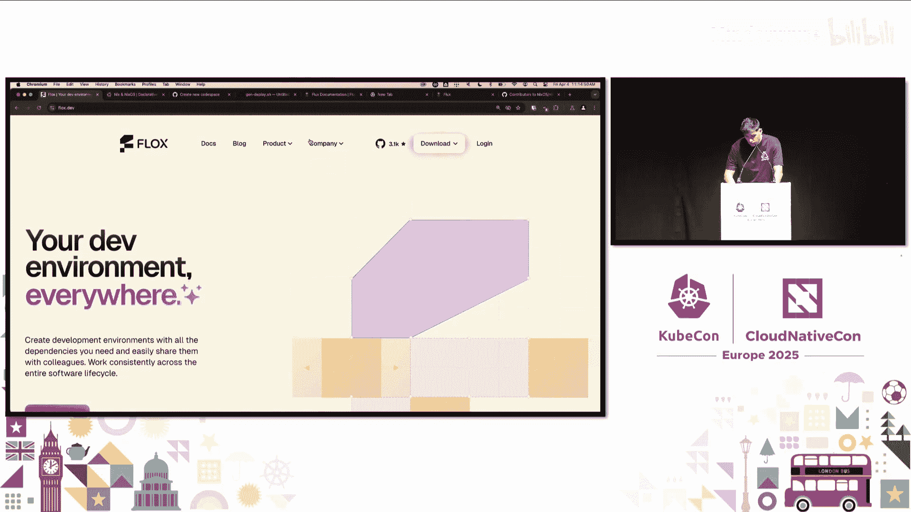

Nix 拥有超过 12 万个软件包，但其原生语言对初学者可能有些复杂。因此，我们将使用 **Flakes**（一个构建在 Nix 之上的易用层）来简化操作。

---

## 使用 Flux 管理声明式开发环境 ⚙️

Flux 允许我们创建和管理**声明式的开发环境**。这些环境定义了项目所需的所有依赖，并锁定其版本，确保跨机器和跨平台的一致性。

在我们的项目 `scale-nix-gitops/scrapbook-dev` 中，已经定义了一个开发环境。

首先，我们激活这个环境来获取 Go 语言工具链等开发依赖：
```bash
cd scale-nix-gitops/scrapbook-dev
flux activate
```
激活后，我们进入了一个子 shell，其中包含了环境定义的所有工具。我们可以列出当前环境中的包：
```bash
flux list
```
输出将显示类似 `ca-certificates`、`gcc`、`go`、`imagemagick` 等包。

这个环境是声明式定义的。如果我们想添加新包（例如 Python 3），可以运行：
```bash
flux install python3
```
这个命令不仅会安装包，还会自动更新项目根目录下 `.flux/envs/<环境名>/manifest.toml` 文件。这是一个类似 `package.json` 的清单文件，记录了所有依赖。同时，它还会生成一个 `lock.toml` 文件，锁定每个依赖的具体版本和哈希值。

这意味着，当你将包含 `manifest.toml` 和 `lock.toml` 的代码提交到 Git 仓库后，任何克隆该仓库的团队成员，只需运行 `flux activate`，就能获得**完全相同的依赖版本**，无论是在 Linux、macOS 还是其他架构上。

---

## 构建和运行本地 Go 应用 🖥️

上一节我们准备好了开发环境，本节中我们来看看如何构建和运行我们的示例 Go 应用。

我们的应用 (`main.go`) 使用了 Go Fiber 框架、PostgreSQL 驱动以及 ImageMagick 的 C 语言绑定。在激活的 Flux 环境中，我们已经拥有了所有构建依赖。

现在，可以构建应用：
```bash
go build -o go-image-app
```
构建完成后，运行应用：
```bash
./go-image-app
```
应用将在 `localhost:3000` 启动。但是，启动后会立即失败，因为它需要连接一个 PostgreSQL 数据库，而我们还没有启动。

---

## 使用 Flux 环境运行数据库服务 🗄️

为了给应用提供数据库，我们可以使用 Flux 快速创建一个独立的、包含 PostgreSQL 服务的环境。

我们可以从 Flux 的公共仓库获取一个预定义的 PostgreSQL 环境。首先创建一个新目录并初始化环境：
```bash
mkdir postgres && cd postgres
flux init
```
然后，我们可以从 `flox/flox-envs` 仓库复制 PostgreSQL 的环境清单。或者，更简单的方式是直接使用 `flox` 命令拉取并运行一个远程环境：
```bash
# 在 scrapbook-dev 目录外运行
flux activate --remote flox/postgres --start-services
```
如果网络通畅，这个命令会拉取 PostgreSQL 环境，启动数据库服务，并输出连接信息。

如果遇到问题，我们也可以手动配置。假设我们已经将 PostgreSQL 的 `manifest.toml` 复制到当前 `postgres` 目录，现在激活并启动服务：
```bash
flux activate
flux start
```
激活后，PostgreSQL 服务会在本地运行。我们可以使用 `psql` 进行连接并创建应用所需的表。表结构定义在 `scale-nix-gitops/cluster/app/db.yaml` 的 ConfigMap 中。复制其中的 `CREATE TABLE` 语句，在 `psql` 中执行即可。

创建表后，再次返回 `scrapbook-dev` 目录，激活开发环境并运行 Go 应用。这次，应用应该能成功启动并连接到数据库了。

此时，你的终端中可能堆叠了多个 Flux 环境（如基础工具环境、开发环境、数据库环境），这体现了环境隔离和组合的能力。

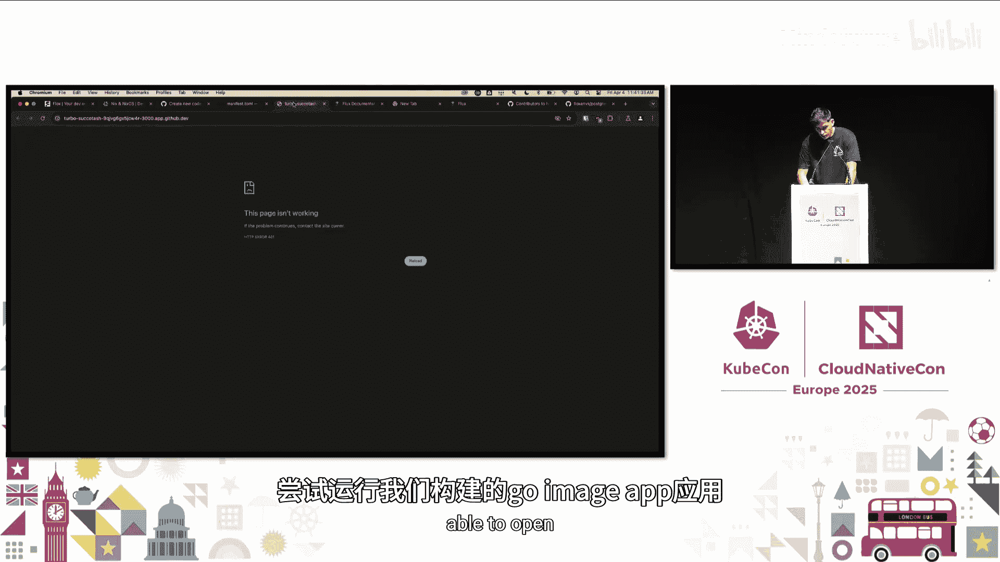

---

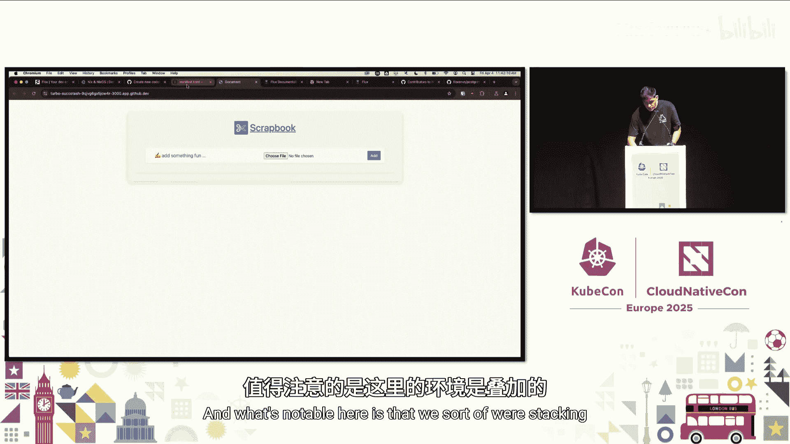

## 将依赖容器化：构建应用基础镜像 🐳

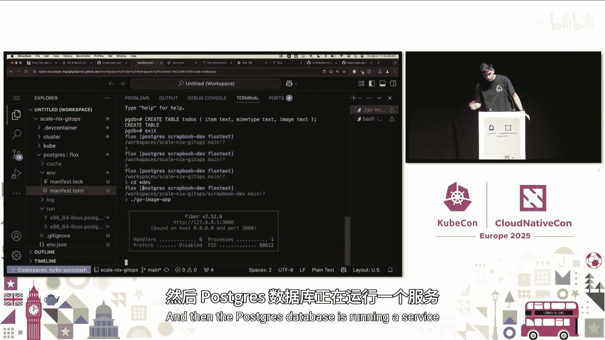

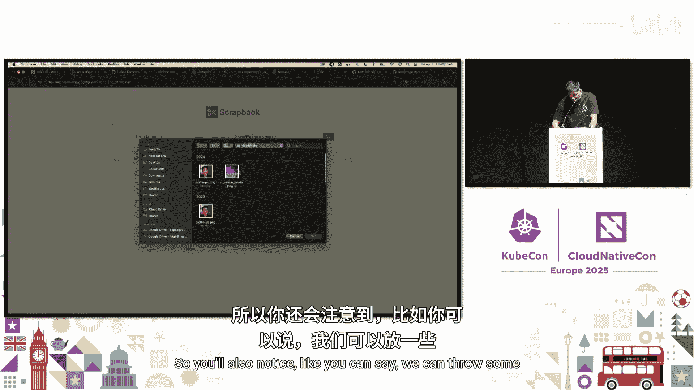

我们的应用目前运行在本地，但为了部署到 Kubernetes，需要将其容器化。传统的 Dockerfile 构建可能引入版本漂移。利用 Nix/Flux，我们可以先构建一个**完全可重现的、包含所有依赖的基础镜像**。

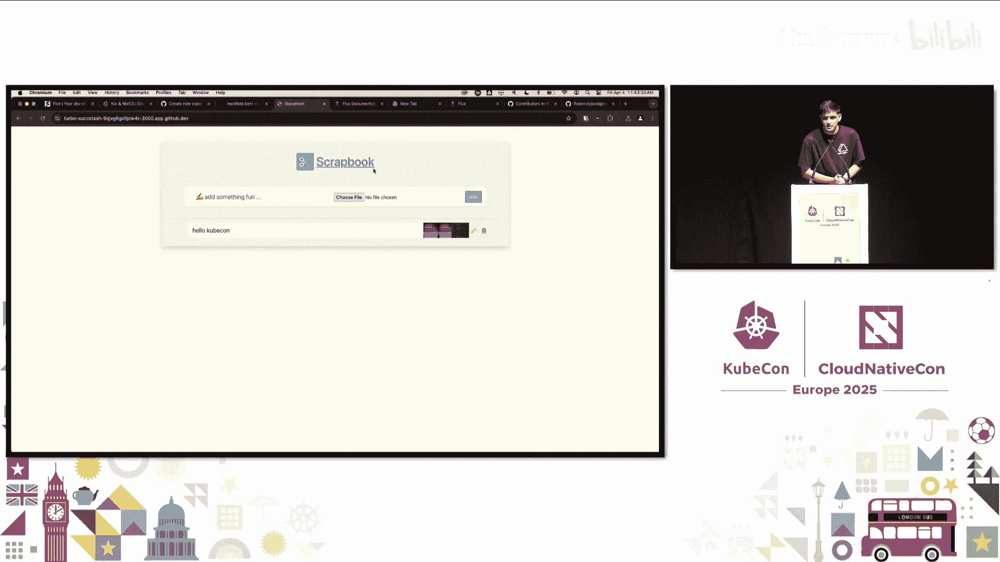

有两种方法可以实现：

**方法一：使用 `flux containerize` 命令**
这个命令可以将当前激活的 Flux 环境中的所有依赖打包成一个容器镜像。
```bash
# 确保在 scrapbook-dev 环境激活状态下运行
flux containerize
```
该命令会生成一个只包含依赖（不包括应用代码）的 Docker 镜像。你可以以此作为基础镜像，在 Dockerfile 中复制你的应用代码进行构建。

**方法二：使用多阶段构建的 Dockerfile**
我们提供了一个示例 Dockerfile (`Dockerfile.flux-nix`)，它展示了如何在一个构建阶段内使用 Flux 环境，并将所有运行时依赖精确地复制到最终的精简镜像中。

其核心步骤包括：
1.  使用一个包含 Flox 的镜像作为构建器。
2.  将项目的 `.flux` 环境目录复制到构建器。
3.  在构建器内激活环境，并查询 Nix 存储，获取该环境所有依赖项的存储路径。
4.  将这些依赖项（通过硬链接）复制到一个单独的目录。
5.  在最终阶段（例如 `alpine`），仅将这些依赖项复制到镜像中。

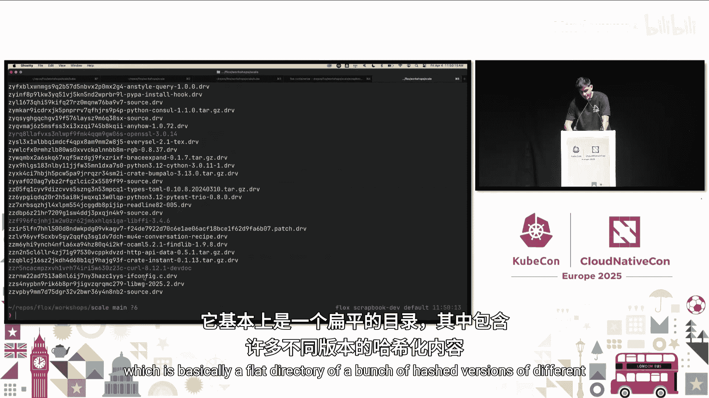

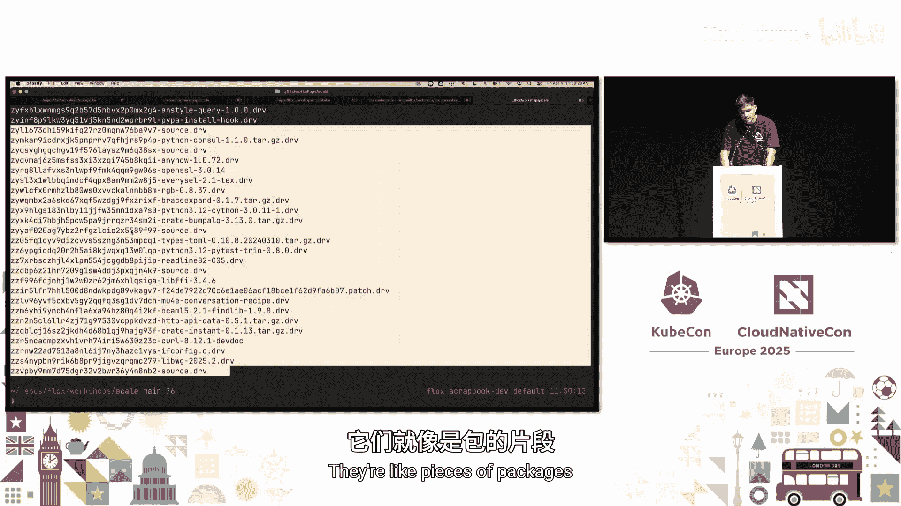

这种方法产生的最终镜像不包含 Nix 或 Flox 本身，只有应用运行所必需的库和二进制文件，并且保持了版本的绝对精确。

无论是哪种方法，关键都在于我们**将声明式的环境定义直接转化为了容器镜像的内容**，确保了从开发到构建的依赖一致性。

---

## 构建完整的应用容器镜像 🏗️

有了包含依赖的基础镜像，我们现在可以构建最终的应用镜像了。我们使用一个多阶段 Dockerfile。

第一阶段（构建阶段）：
*   使用我们之前构建的 `scrapbook-dev` 环境镜像作为基础。
*   设置 `CGO_ENABLED=1` 以启用 C 语言绑定（ImageMagick）。
*   复制应用源代码。
*   **关键步骤**：在构建容器内激活 Flux 环境，以确保编译器能找到正确的头文件和库路径（因为它们位于 Nix 存储的非标准位置）。
*   运行 `go build`。

第二阶段（运行阶段）：
*   使用我们构建的 `scrapbook-runtime` 环境镜像作为基础（仅包含 ImageMagick 等运行时库）。
*   从构建阶段复制编译好的 Go 二进制文件、静态资源等。
*   设置入口点，通过 Flux 环境的包装器来启动应用，确保运行时也能找到正确的动态库。

构建命令如下：
```bash
# 假设 Dockerfile 使用 scrapbook-dev 和 scrapbook-runtime 作为基础镜像名
docker build -t scrapbook-app:latest .
```
构建成功后，你可以运行这个镜像。需要注意的是，启动命令需要通过 Flux 环境的激活脚本来包装，例如：
```bash
docker run --rm scrapbook-app:latest /bin/bash -c “. /nix/store/...-activate && /app/go-image-app”
```
在 Kubernetes 部署中，我们会在 Pod 的 `command` 或 `args` 字段配置这个包装逻辑。

---

## 定义 Kubernetes 清单并连接 GitOps 🔄

现在，我们有了可部署的容器镜像。接下来，我们定义 Kubernetes 清单文件来部署应用。这些文件位于 `scale-nix-gitops/cluster/` 目录下。

主要包含：
1.  `app/scrapbook.yaml`: 定义 Deployment 和 Service，运行我们的 Go 应用容器，并配置通过环境变量连接数据库。
2.  `app/db.yaml`: 定义 PostgreSQL 的 Deployment、Service、ConfigMap（用于初始化表结构）和 Secret（存放数据库连接信息）。

这些清单文件描述了应用在 Kubernetes 中的期望状态。

为了实现 GitOps——即使用 Git 作为声明式基础设施的唯一事实来源——我们可以使用 Flux 本身。在 `cluster/flux-system/` 目录下，可以看到 Flux 的配置：

*   `flux-instance.yaml`: 使用 Flux Operator 在集群中安装指定版本的 Flux。
*   `git-repo.yaml`: 告诉 Flux 监视我们的 Git 仓库（即当前项目）。
*   `kustomization.yaml`: 指示 Flux 从 `cluster/app` 目录协调资源，部署我们的应用和数据库。

当我们将代码推送到 Git 仓库后，Flux 会自动检测变化，并在 Kubernetes 集群中协调出定义的状态。这样，**从开发环境的依赖管理，到应用构建，再到生产部署，整个流程都通过声明式的 Git 仓库进行协作和驱动**，实现了真正的“左移”GitOps。

---

## 总结与展望 🌟

本节课中我们一起学习了如何将 Nix/Flox 与 Flux GitOps 结合，打造一个贯穿开发与部署的声明式协作工作流。

我们回顾一下核心步骤：
1.  **声明式开发环境**：使用 Flox 创建并锁定项目依赖，确保团队所有成员环境一致。
2.  **本地开发与测试**：在隔离的环境中构建、运行应用，并快速启动配套服务（如数据库）。
3.  **可重现的容器构建**：将声明式的环境转化为容器镜像，确保构建过程与本地开发使用完全相同的依赖。
4.  **GitOps 部署**：使用 Kubernetes 清单定义应用，并通过 Flux 实现自动化的 Git 到集群的同步。

这种模式的价值在于：
*   **消除环境差异**：从个人电脑到 CI/CD，再到生产容器，依赖链完全一致。
*   **提升协作效率**：依赖变更通过代码评审进入 Git，自动同步给所有协作者。
*   **增强可追溯性**：任何环境状态都可以由 Git 提交哈希精确重现。

尽管在工具链集成（如 CGO 构建）方面还有一些粗糙的边缘需要打磨，但这条路径展示了一个未来：**将声明式、协作式的 GitOps 实践向左延伸，一直覆盖到开发者的本地工作流**，从而在整个软件生命周期中实现更高的可靠性、安全性和开发体验。

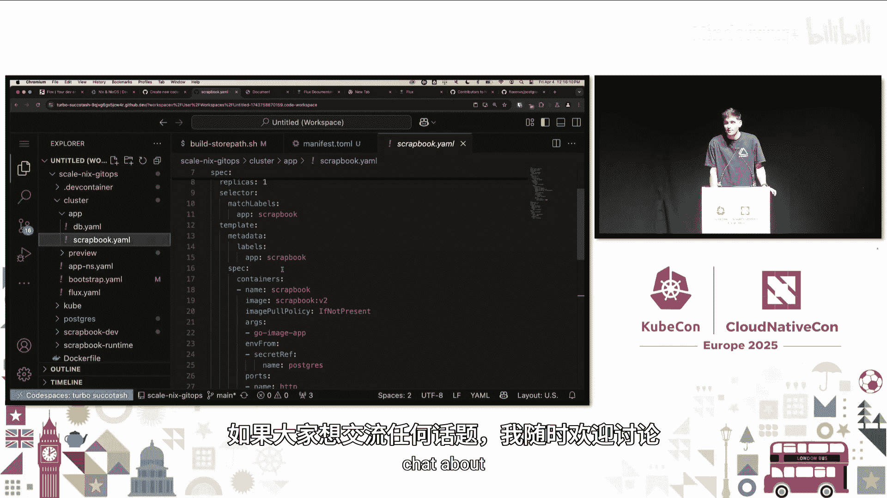

感谢你的参与，希望本教程能为你开启云原生团队开发的新思路。