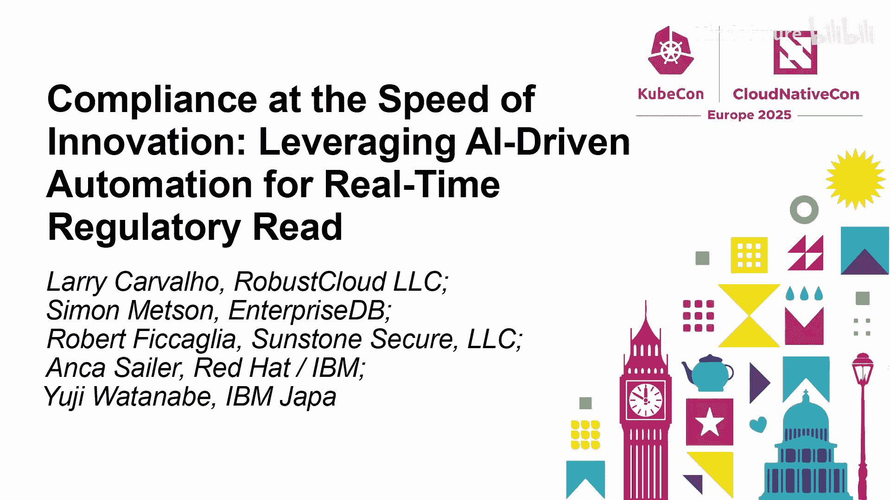
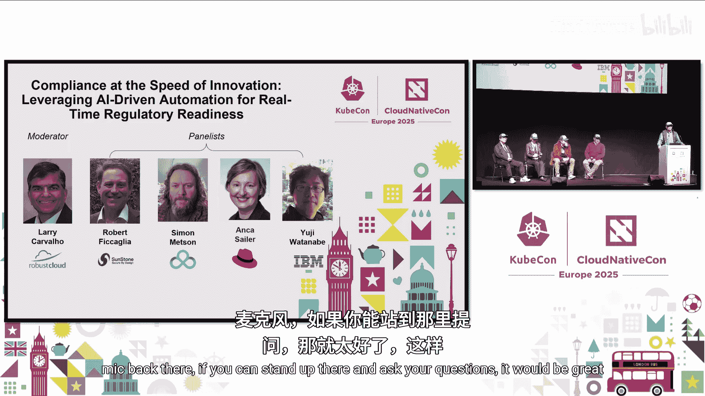
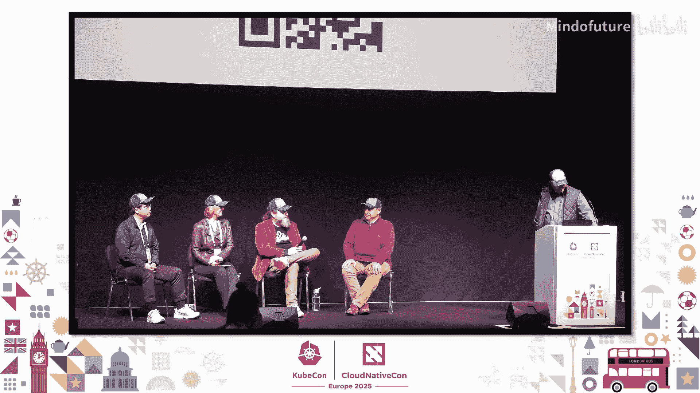
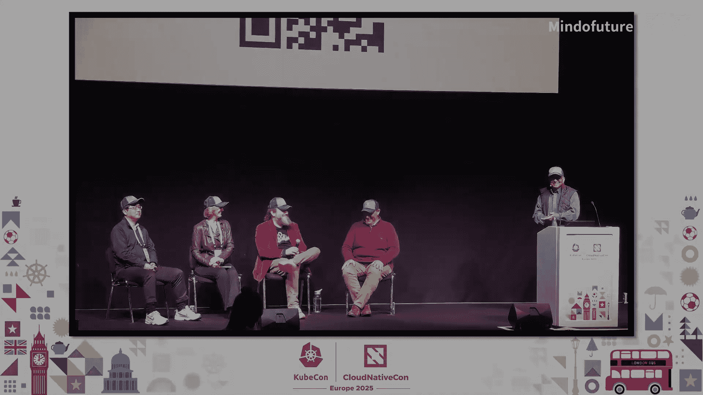

# 029：利用AI驱动自动化实现创新速度下的合规





在本节课中，我们将学习如何利用“合规即代码”的理念和AI驱动的自动化工具，在快速创新的云原生环境中实现持续合规。我们将探讨其核心概念、面临的挑战、实施路径以及未来的发展方向。

---

## 概述：创新速度下的合规挑战

随着云原生和AI技术的快速发展，传统的、基于手动流程和年度审计的合规方法已无法满足需求。企业需要实现**持续合规**，以应对日益增多的法规要求和动态的基础设施环境。本次课程将介绍如何通过自动化、标准化和AI技术来应对这一挑战。

## 章节一：什么是“合规即代码”？

上一节我们概述了当前合规面临的挑战，本节中我们来看看核心解决方案——“合规即代码”的概念。

“合规即代码”是一种将合规要求、安全策略和控制措施转化为机器可读、可执行代码的方法论。它借鉴了“基础设施即代码”的思想，旨在实现合规流程的自动化、可重复和可验证。

其核心架构通常包含多个层次：
*   **法规层**：原始的法规要求（如PDF、电子表格）。
*   **控制目录层**：将法规转化为具体的控制措施（例如，NIST SP 800-53， CIS基准）。
*   **规则映射层**：将控制措施映射到具体技术栈的可执行规则（例如，Kubernetes策略、云配置规则）。
*   **证据收集层**：自动化执行检查并收集合规证据。

一个关键的开源标准是**开放安全控制评估语言（OSCAL）**，它提供了用于定义控制目录、组件和系统的标准化模式（Schema）。

```yaml
# 示例：OSCAL 控制定义简化结构
control:
  id: au-2
  title: 审计事件
  description: 组织必须生成审计记录，包含...
  implementation:
    - component-uuid: logging-system
      description: 集中式日志系统必须捕获所有身份验证事件。
```

## 章节二：云原生环境带来的挑战与机遇

理解了“合规即代码”的基础后，我们来看看它在云原生环境中的具体应用场景。

云原生环境以其**动态性**和**声明式**管理为核心，这对合规提出了新要求，也创造了新机会。

**挑战主要源于动态性：**
*   容器和Pod是短暂的，随时可能创建或销毁。
*   自动扩缩容和开发者自助服务导致环境不断变化。
*   传统的合规控制假设基础设施是静态的，难以适应这种变化。例如，要求“所有变更需经将军批准”与“通过API一键部署上千个实例”的做法相冲突。

**机遇则来自声明式模型：**
*   Kubernetes等平台的声明式配置（如YAML文件）确保了环境的一致性。
*   一旦某个部署模板被验证为合规，后续所有基于该模板的部署都将继承这一合规状态。
*   这种可预测性为自动化合规检查和证据收集提供了坚实基础。合规策略可以嵌入到CI/CD管道中，在部署时即进行验证。

## 章节三：AI如何加速合规流程

面对云原生的动态性，仅靠传统自动化可能仍力不从心。本节中我们来看看AI如何成为关键的加速器。

AI，特别是大语言模型和智能体（Agent），可以从多个环节优化合规生命周期：

1.  **智能分析**：AI可以解析非结构化的法规文档（如PDF），提取关键要求，并将其映射到现有的合规框架和控制措施上，快速识别差距。
2.  **策略生成与优化**：基于识别的差距，AI可以辅助生成或修改具体的策略代码（如OPA策略、Kubernetes网络策略）。
3.  **智能体驱动的工作流**：AI智能体可以协调不同角色的干系人（安全、开发、合规官），在检测到控制变更或新要求时，自动触发通知、任务分配或集成到CI/CD流程中，实现“左移合规”。

以下是AI在合规流程中应用的一个简化示例：

```python
# 概念示例：使用AI分析法规文档并映射控制
from compliance_ai_agent import ComplianceAnalyzer

analyzer = ComplianceAnalyzer(model="gpt-4")
new_regulation_text = open("new_gdpr_clause.pdf").read()
existing_controls = load_controls_from_oscal("nist_800-53.json")

# AI分析新法规，并与现有控制进行交叉映射，找出差距
gap_analysis = analyzer.crosswalk_and_identify_gaps(new_regulation_text, existing_controls)
print(f"已覆盖的控制: {gap_analysis.covered}")
print(f"需要新增的控制: {gap_analysis.missing}")
```

## 章节四：实施路径与关键考量

在引入了AI的强大能力后，我们需要冷静地思考如何将其落地。本节将讨论实施中的现实问题。

实施“合规即代码”并集成AI是一个长期旅程，而非一蹴而就的项目。

**关键步骤与考量：**
1.  **文化变革**：最大的挑战往往来自人员。合规团队通常非技术背景，需要帮助他们理解并接纳自动化、代码化和AI工具。让技术团队提升合规知识，比让合规团队精通技术更为可行。
2.  **技能转变**：安全与合规专家（CISO）未来的角色将更侧重于**判断力**和**风险管理**，利用AI处理海量数据和自动化任务，而人类专注于决策、危机处理和建立信任。
3.  **可信度与审计**：使用AI进行合规，必须解决AI本身的可信度问题。
    *   **基准测试**：建立真实的测试环境（如IBM的“IT基准”），用大量合规场景测试AI智能体的准确性和可靠性。
    *   **可解释性**：记录AI智能体的决策轨迹（Agent Trajectory），确保其过程透明、可审计，以满足合规证据要求。
4.  **时间与成本**：虽然AI能大幅加速策略开发和评估过程，但完整的合规现代化转型可能需要数年时间。初期可以聚焦于利用AI进行快速评估和发现，获取即时价值。总拥有成本预计将显著降低，但需对AI引入的新成本（如基准构建、解释性工程）进行重新评估。

## 章节五：未来展望——AI原生合规

最后，让我们展望一下，当AI深度融入技术栈后，合规的未来图景。

未来的“AI原生合规”将面临更高阶的挑战：
*   **代码生成的规模**：如果由AI智能体自动生成部署代码或容器镜像，其数量和变化速度将远超人工时代。人类如何有效评审和信任这些AI生成的资产？
*   **动态性的极致**：合规控制需要适应由AI驱动、实时调整的极端动态环境。传统的“静态清单”概念将彻底失效。
*   **人机协同循环**：合规将成为一个紧密的人机协同循环。AI负责监控、分析、生成和初步执行，人类负责设定目标、提供关键判断、处理异常和在危机时刻做出最终决策。CISO的角色将演变为“AI赋能的风险管理者”。

## 总结

本节课中我们一起学习了在云原生和AI时代实现合规的现代化路径。核心要点包括：
*   **合规即代码**是自动化合规的基石，通过OSCAL等标准将控制转化为可执行代码。
*   **云原生环境**既带来了动态性的挑战，也通过声明式模型提供了自动化机遇。
*   **AI与智能体**是强大的加速器，能用于法规分析、差距识别、策略生成和工作流协调。
*   **成功实施**依赖于文化变革、技能提升、确保AI可信度以及设定合理的期望与时间线。
*   **未来**的合规将是“AI原生”的，强调在极高动态性下的人机协同与信任构建。





通过拥抱“合规即代码”和AI驱动自动化，组织可以在保持创新速度的同时，有效管理合规风险，实现安全、高效的持续运营。