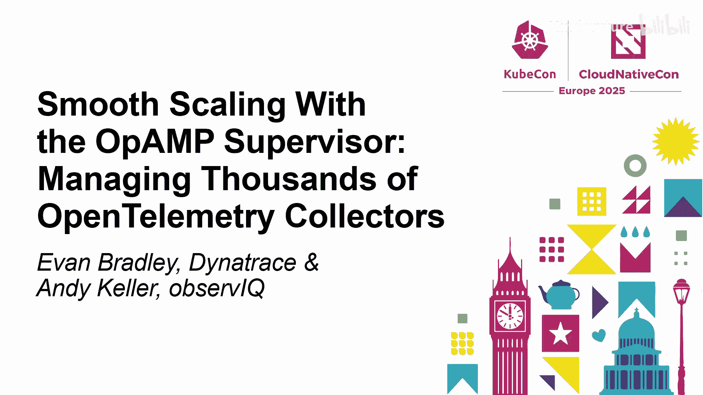
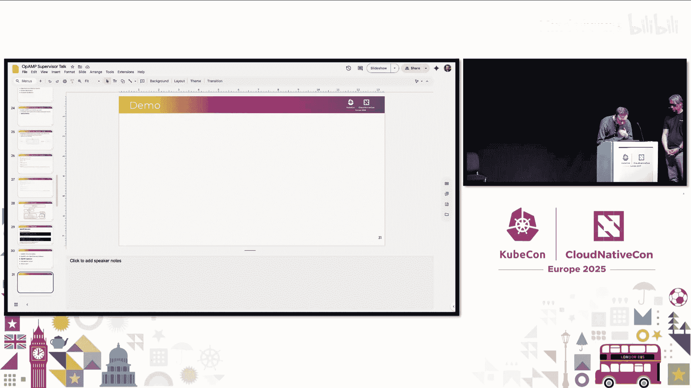
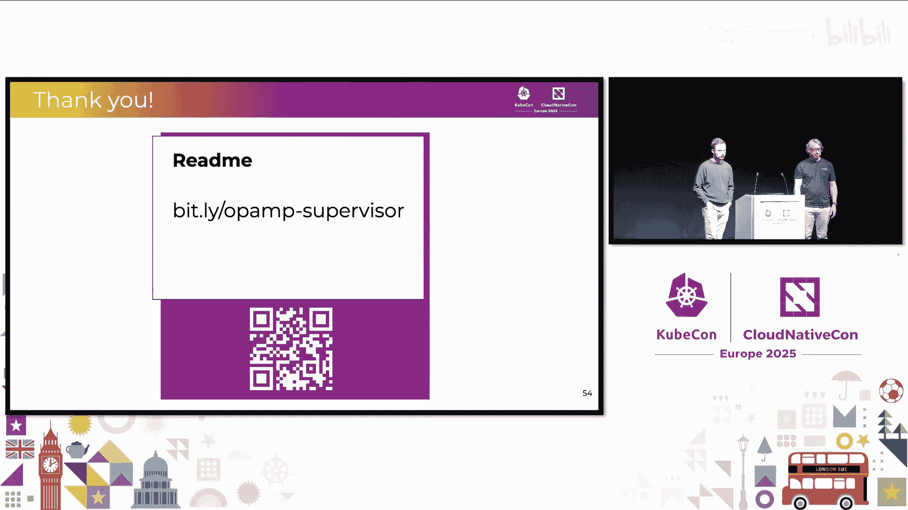

# 030：使用 OpAMP Supervisor 实现平滑扩展



在本教程中，我们将学习 Open Agent Management Protocol 及其在 OpenTelemetry Collector 中的实现。我们将了解 OpAMP Supervisor 的角色，并通过演示展示其如何管理大规模可观测性代理。

## 概述：什么是 OpAMP？

OpAMP 代表 Open Agent Management Protocol。它是一种用于远程管理大规模可观测性代理集群的网络协议。该协议允许服务器协调代理、发送配置、升级软件包，并为大型代理集群提供命令与控制接口。

## 协议基础与更新

上一节我们介绍了 OpAMP 的基本概念，本节中我们来看看协议的核心机制以及近期的关键更新。

OpAMP 定义了两类消息：**AgentToServer** 和 **ServerToAgent**。顾名思义，它们包含了双向传输的数据。

*   **AgentToServer 消息**：帮助服务器回答“我有哪些代理？”、“它们健康吗？”、“它们在做什么？”、“它们能做什么？”等问题。
*   **ServerToAgent 消息**：描述服务器能做什么，可以指示代理使用特定配置、提供用于修改代理的软件包，或向代理发送命令。

OpAMP 协议设计为与代理无关，并支持部分实现。这意味着只有代理和服务器都支持的能力才会被启用，同时协议本身也具有可扩展性。

过去一年，OpAMP 规范和实现有了多项改进。以下是三个重要的新特性：

### 心跳机制

心跳用于保持代理与服务器之间 WebSocket 连接的活性。大多数负载均衡器会终止空闲的 WebSocket 连接。定期发送空消息可以防止这种情况发生。

支持心跳的代理可以设置 `ReportsRemoteConfig` 能力。由于服务器更可能了解入站连接的保活要求，因此服务器会以首选的心跳间隔进行响应。

### 自定义消息

假设您想实现一个 OpAMP 协议未定义的功能。自定义消息允许通过现有的 OpAMP 连接在代理和服务器之间发送额外的消息，从而实现连接复用。

虽然自定义能力和消息的整体结构由规范定义，但消息的格式和内容则由实现者决定。要实现新的 OpAMP 功能，需要先定义一个自定义能力，并为每条消息定义消息类型和数据。只有当服务器和代理都表明支持该自定义能力时，消息才能被发送。

以下是一个使用自定义消息实现服务发现功能的示例：

```yaml
# 定义自定义能力
capability: com.example.discovery

# 定义消息类型
messages:
  - name: DiscoveryRequest
    direction: server_to_agent
  - name: DiscoveryResponse
    direction: agent_to_server
```

### 可用组件

这是 OpAMP 最新添加的功能。Supervisor 允许使用 OpAMP 管理自定义的 OpenTelemetry Collector 发行版。现在，您可以创建支持通过 OpAMP 进行远程管理的自定义 Collector 发行版。

代理在发送给服务器的消息中包含可用组件的哈希值。由于完整组件列表可能很长，服务器需要在响应中设置一个标志来请求完整列表。代理随后会响应完整列表。例如：

```json
{
  "components": {
    "receivers": {
      "filelog": "v0.89.0",
      "otlp": "v0.89.0"
    }
  }
}
```

通过完整的组件列表，服务器可以判断某个配置是否与代理兼容，并根据不同的组件版本提供选项。

## OpenTelemetry Collector 中的实现

了解了 OpAMP 在配置代理方面的通用能力后，我们来看看在 Collector 中实现时的一些具体考量和细节。

要控制 Collector，需要做两件事：
1.  向其发送配置（即来自服务器的远程配置部分）。
2.  Collector 向服务器返回状态和遥测信息，以便您进行监控。

从实现角度看，有两种方式：
1.  将所有 OpAMP 组件内置于 Collector 中，让 Collector 本身“说” OpAMP。
2.  通过一个外部进程进行“翻译”，它运行 Collector 进程，而 Collector 本身不一定需要知道 OpAMP 如何工作。



目前我们采用第二种方法，即使用 **OpAMP Supervisor**。这种方式更简单，无需担心将 OpAMP 嵌入 Collector 所带来的复杂生命周期管理问题。此外，它也更为强大，除了能通信崩溃信息，还能更轻松地执行二进制升级：只需下载新二进制文件，停止旧进程并启动新进程即可。


Supervisor 在 Collector 之前启动，负责与 OpAMP 服务器的所有通信。它通过将配置写入磁盘，并使用 Collector 的命令行参数传递该配置来配置 Collector。作为回报，Collector 可以向服务器返回任何必要的信息，以确保其健康状态。

Supervisor 的功能包括：
*   返回标识代理的属性。
*   报告支持的组件。
*   显示 Collector 当前运行的实际配置。
*   提供所有管道的活跃度信息。
*   通过标准输出收集日志，并确保它们最终进入您选择的遥测后端。
*   支持将其自身以及 Collector 的遥测数据转发到您选择的遥测后端。

要使用带有 Supervisor 的 Collector，您需要一个支持 OpAMP 扩展的发行版。您可以使用上游的 `contrib` 发行版进行测试，也可以使用供应商提供的支持 OpAMP 的发行版，或者构建自己的发行版。

在 Collector 中启用 OpAMP 非常简单，理想情况下只需要一个较新版本的 Collector 框架（v1.22+），并包含 `opamp` 扩展即可。

## 构建自定义发行版与自定义消息

上一节我们探讨了 Supervisor 的基本原理，本节我们将学习如何构建自定义 Collector 发行版，并深入了解自定义消息的实现。

使用 OpenTelemetry Collector Builder 可以轻松创建自定义 Collector 二进制文件。您只需要一个清单文件，指定您希望在 Collector 中包含的组件。关键是，您只需要包含 `opamp` 扩展。

以下是一个 OCB 清单文件的示例：

```yaml
dist:
  name: my-custom-collector
  version: 1.0.0
  otelcol_version: 0.89.0

exporters:
  - gomod: go.opentelemetry.io/collector/exporter/otlpexporter v0.89.0

extensions:
  - gomod: github.com/open-telemetry/opamp-go/extension v0.8.0 # OpAMP 扩展
```

接下来，我们描述一下去年添加到 OpAMP 的自定义消息功能，并展示其如何通过 Supervisor 实现。

OpAMP 扩展维护着一个自定义能力注册表。自定义消息从服务器发送到 Supervisor，Supervisor 将其转发给 Collector 中运行的 OpAMP 扩展，然后该扩展将这些消息分派给实现该自定义能力的组件。

实现使用自定义消息的自定义组件的步骤如下：
1.  组件向扩展注册，传递能力名称和一些选项。
2.  这将返回一个自定义能力处理器。
3.  该处理器提供一个通道来接收这些自定义消息，并允许您将自定义消息发送回服务器。

回到之前描述的服务发现示例，您可以实现一个能够进行服务发现的扩展，并在启动时注册其能力，然后使用生成的处理器与 OpAMP 服务器发送和接收这些发现消息。最后，将该扩展构建到您的发行版中，并添加到 Collector 配置中。

## 功能演示

理论部分已经介绍完毕，现在让我们通过实际演示来看看 OpAMP Supervisor 的运行效果。我们将展示一个基本的 Supervisor 设置，以及如何远程配置代理。


演示将展示一个正在运行的 Supervisor，它使用 OpAMP Go 仓库中的示例服务器。您需要一个 Supervisor 二进制文件、一个要运行的 Collector 二进制文件以及一个 Supervisor 配置文件。

一个基础的 Supervisor 配置文件需要指定：
*   要连接到的 OpAMP 服务器地址。
*   启用远程配置能力（默认禁用）。
*   Collector 二进制文件的位置。
*   用于存储运行时信息（如缓存配置）的本地目录。

启动 Supervisor 后，它会连接到服务器并报告代理信息。如果服务器尚未发送任何配置，Collector 将不会启动以节省资源。通过服务器界面，您可以向 Supervisor 远程发送新配置。Supervisor 接收配置后，将使用新配置重启 Collector（请注意，当前这不支持热重载，会触发进程重启）。

此演示还展示了从大规模管理角度出发的能力：您可以根据代理报告的属性（如主机架构）来选择性地更新特定代理组。所有这些属性也包含在 Collector 的遥测数据中，实现了可观测性管道的自观测。

另一个演示展示了使用自定义 Collector 发行版，以及“可用组件”功能如何让服务器了解 Collector 中可用的组件。当尝试应用一个包含 Collector 发行版中不存在的组件的配置时，服务器会给出兼容性警告。

## 大规模挑战与未来展望

我们已经看到了 OpAMP 和 Supervisor 的强大功能，但在大规模部署时会面临一些挑战。本节我们将探讨这些挑战，并展望未来的发展方向。

**大规模部署的挑战包括：**
*   **惊群问题**：当服务器重新部署时，所有代理会尝试同时重连，即使采用指数退避，管理大量涌入的连接也很困难。
*   **状态处理**：服务器需要处理所有代理发送的完整状态信息，并发送必要的配置更新。
*   **离线代理管理**：如何区分正在尝试连接但失败的代理与已被替换和删除的容器化代理？
*   **集群配置管理**：OpAMP 协议定义了单个代理与服务器的交互。但当拥有十万个代理时，如何确保向所有代理发送相同的配置？如何安排更新顺序？如何处理错误？这些都是具有挑战性的问题。

**未来发展路线图：**
*   **近期（未来6-12个月）**：主要目标是提高 Supervisor 的稳定性，进行重构，使其达到生产就绪状态（目前为 Alpha 阶段）。同时，计划实现更多 OpAMP 能力，如通过 Supervisor 进行 Collector 升级、增强 Collector 和 Supervisor 内部的遥测配置与报告。此外，正在与 Java SIG 合作，以在 Java SDK 中支持 OpAMP。
*   **中期**：寻求与 Kubernetes Operator 进行更多集成，使其更适应 Kubernetes 环境，例如处理高规模连接和高可用性。同时，计划扩展 Supervisor 的能力，使其能够运行多个 Collector 甚至非 Collector 代理（如 Java SDK）。
*   **远期愿景**：设计让 Collector 本身“说” OpAMP，从而在某些场景下无需 Supervisor。另一个很酷的特性是实现 Collector 配置的热重载，这将是高度复杂的，目前仍处于构思阶段。

## 总结



在本教程中，我们一起学习了 Open Agent Management Protocol 及其在管理 OpenTelemetry Collector 集群中的应用。我们介绍了 OpAMP 的基本原理、新特性（心跳、自定义消息、可用组件），深入探讨了 OpAMP Supervisor 的架构和优势，并演示了其如何实现远程配置和管理。最后，我们讨论了大规模部署面临的挑战以及 OpAMP 和 Supervisor 的未来发展计划。通过 OpAMP，我们可以更高效、更自动化地管理大规模的可观测性基础设施。