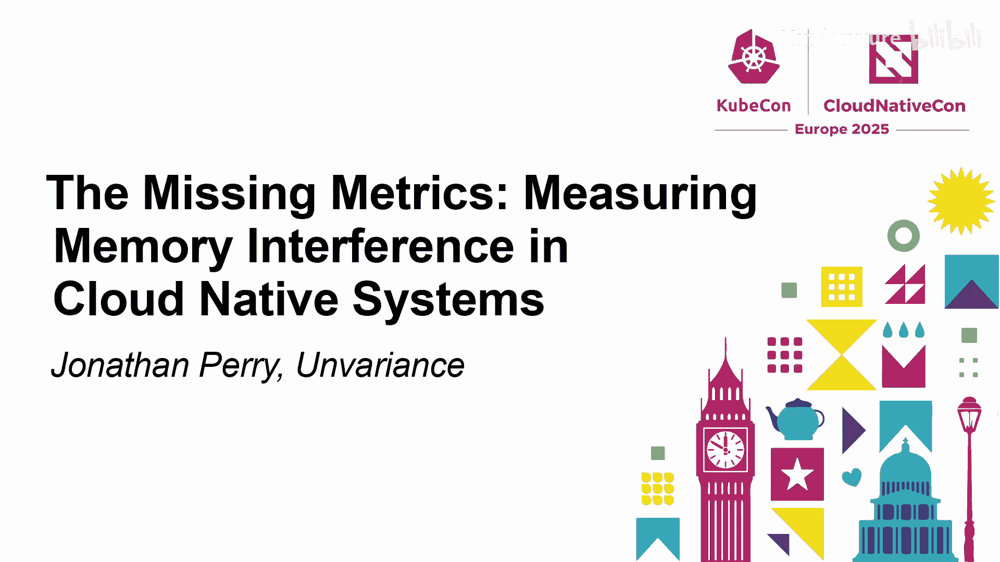
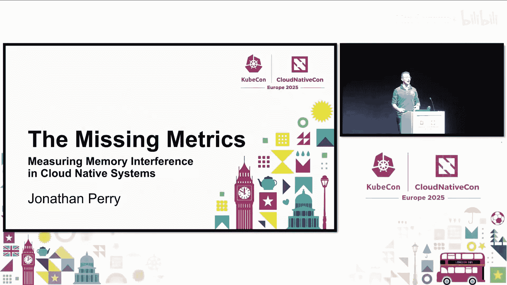
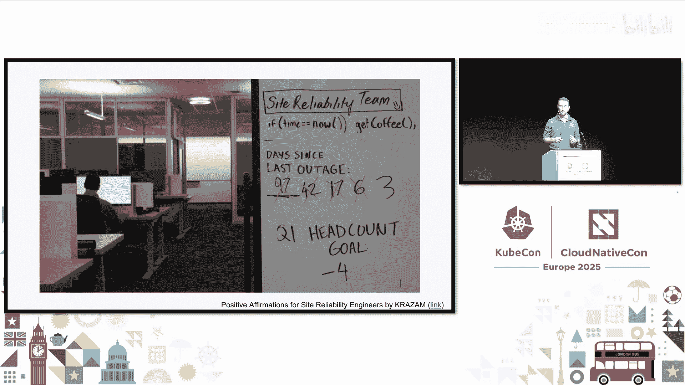
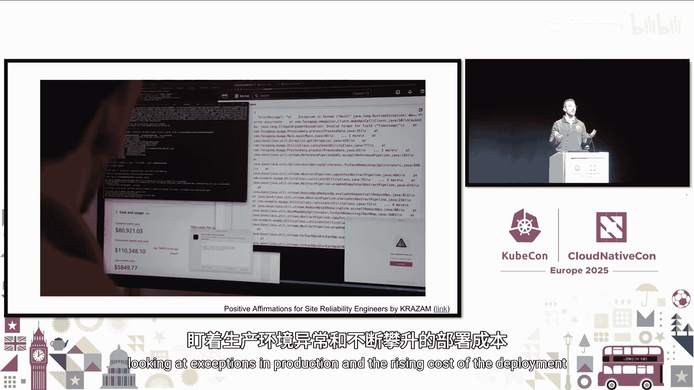
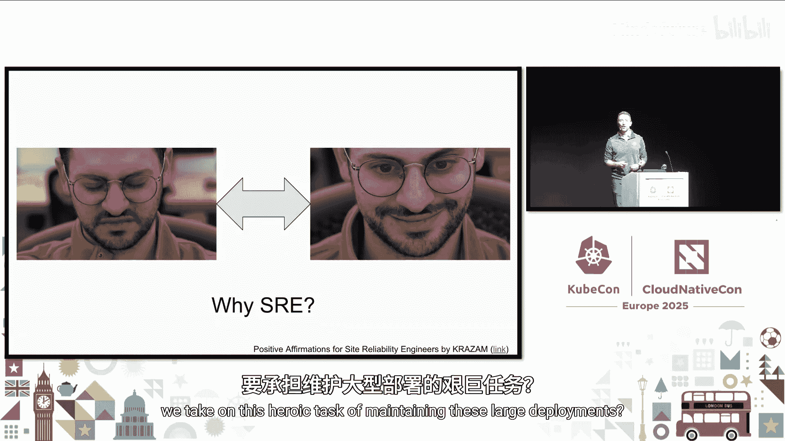
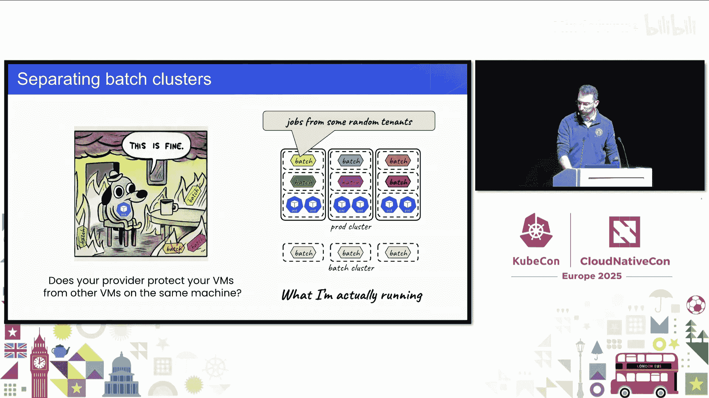
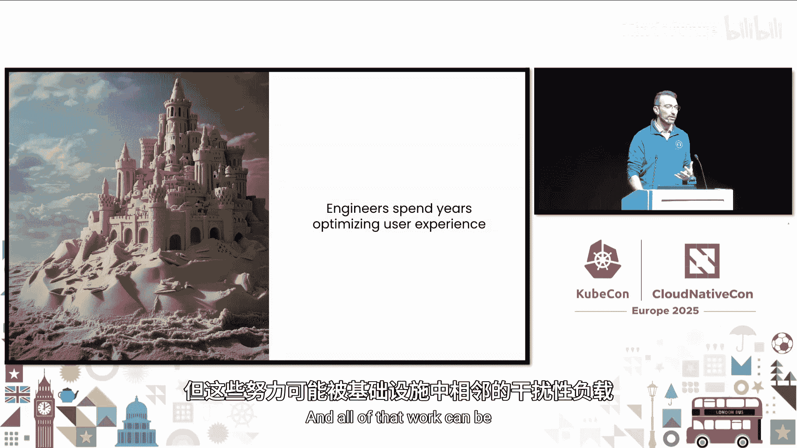
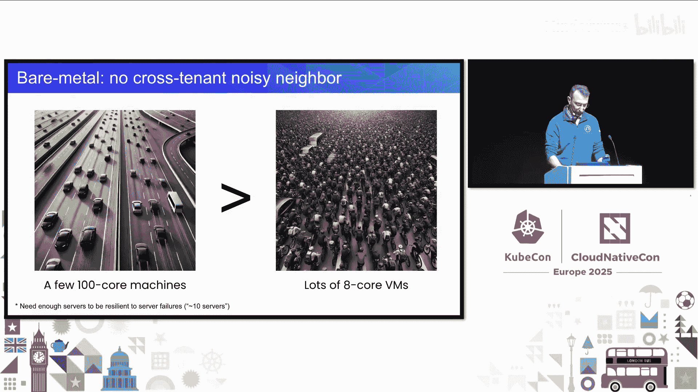

# 032：缺失的指标——测量云原生系统中的内存干扰

## 概述

在本节课中，我们将要学习云原生系统中一个关键但常被忽视的性能问题——“内存干扰邻居”。我们将探讨其定义、对应用性能的巨大影响、现有的硬件/软件缓解机制，以及一个旨在测量和解决此问题的开源项目。理解并解决内存干扰问题，是提升系统性能、降低成本、实现高效资源利用的关键一步。

---

## 什么是内存干扰邻居？🤔

我们的云原生应用最终运行在物理服务器上，这些应用必须共享服务器有限的资源。当出现“干扰邻居”时，一个应用会占用超过其公平份额的资源，导致其他应用无法获得所需资源，进而使其性能严重下降。

在本课程中，我们将主要讨论最后一级缓存（简称缓存）和内存带宽这两种资源的干扰。

## 缓存干扰是如何发生的？💥

通常，你的应用数据会存放在CPU的不同层级硬件缓存中。最热的工作集在L1缓存，而热、温、冷的工作集则分别在L2、L3缓存和主内存中。

当一个干扰邻居出现时，它会大量使用共享的L3缓存，并将你的应用数据从该缓存中驱逐出去。因此，当你的应用需要访问其温数据时，它不得不去访问主内存，而不是更快的L3缓存。

在更极端的情况下，如果干扰邻居运行在与你的应用相邻的超线程上，它甚至会将你的应用从L2缓存中驱逐。现在，你的应用必须去访问主内存，而原本它本可以访问快得多的L2缓存，速度差异可能高达50倍。这会导致应用性能显著下降。

在实践中，这种情况确实会发生。谷歌曾发布实验结果，他们在生产服务上使用不同的合成噪声生成器进行测试。你可以看到三个生产服务：网页搜索、在线机器学习文本分类系统和内存键值存储。他们发现，在不同系统负载下，性能下降幅度可达5倍到14倍。P95和P99延迟的退化是显著且剧烈的。

## 我们为何需要关注？📈

性能至关重要。亚马逊曾发布案例研究称，用户响应时间每增加100毫秒，他们就会损失1%的收入。多年来，有数十个案例研究都证实了这一结果。

其中一个我特别喜欢的案例来自日本在线杂货商Ray 1024。他们进行了一次A/B测试，运行两个功能完全相同但其中一个经过优化、速度快400毫秒的应用。结果令人震惊：更快的应用使用户人均收入增加了53%，跳出率降低了35%。

随着用户对功能的要求越来越高，我们的系统也变得越来越复杂。性能下降时，我们很容易归咎于复杂的“意大利面条式”代码或网络问题。但实际上，很多性能下降源于服务器上简单的资源争用，而我们对此缺乏可见性。这正是本次讨论的主题。

## 潜在的巨大收益 💰

想象一下，如果一小群工程师秘密创建了一种资源分配能力，使他们能在相同规模的服务器上多运行50%的事务，并将尾部延迟降低5到14倍。这听起来太棒了，不是吗？

事实上，这种能力确实存在，并且不是秘密开发的。十多年来，知名研究机构和超大规模云提供商已经发表了十几篇论文，探讨这种能力并详细说明了如何缓解这些“干扰邻居”。今天，我认为是时候让Kubernetes社区基于这项研究获得一个我们都能享用的解决方案了。

## 现有机制与测量方法 🛠️

现代CPU允许操作系统控制每个应用可以使用多少缓存和内存带宽。即使你的CPU不支持这些技术，你仍然可以通过将干扰邻居固定到少量核心上，并可能降低这些核心的频率，来限制它们对系统造成损害的能力。

我们经常被问到：容器不是应该做这个吗？我们期望容器能隔离工作负载，但今天它们并没有。这种性能隔离功能并未内置到我们的容器基础设施中。事实上，容器更擅长安全隔离，而非性能隔离。但并非没有希望，我们可以通过一个名为“资源控制”的不同子系统来访问这些机制，它可以通过Cgroups进行配置。

## 如何测量以形成闭环？📊

我们关心应用的服务时间，那么为什么不直接测量P95、P99，然后根据哪个应用的P95、P99不佳来调整资源分配呢？事实证明，这些测量本身就有噪声。首先，为了获得P95或P99的良好信号，我们至少需要测量几百个事务。这导致反应非常缓慢。

另一种方法是测量CPU效率。CPU希望执行一定数量的指令。如果存在大量内存争用，CPU必须等待内存，那么执行这些指令所需的周期数就会很大。如果没有太多内存争用，周期数就小。因此，每指令周期数这个比率可能是一个好的指标。

但问题在于，这个指标也很嘈杂，因为它测量了系统上发生的许多其他事情。而且这些系统最终会变得复杂，因为我们不知道一个好的“每指令周期数”值是多少。我们需要事先对应用进行分析。

然而，事实证明，谷歌自2013年起就在其所有共享集群上部署了这种类型的系统。另一种方法是直接测量内存争用本身，直接测量我们应用中内存带宽和缓存的利用率。然后，如果我们发现有人使用了超过其公平份额的资源，就限制他们。这实际上是一个很好的测量方法，也是我们开源收集器正在做的事情。

事实上，阿里巴巴发布信息称，他们拥有一个基于直接收集生产环境中内存争用事件的系统，截至2020年已在约百万核心上运行了两年多。

## 高频率测量的必要性 ⚡

如果我们想解决内存干扰邻居问题，就需要非常频繁的测量。下图模拟了之前看到的内存争用事件，以及底部每秒采样一次的内存指标。你可以看到，如果测量不够频繁，就会丢失所有信号。

因此，我们的收集器旨在以1毫秒的粒度进行测量。我们将其启动为一个Apache 2.0项目，名为“Unvariance Collector”，其理念是减少响应时间的方差。

## 收集器的架构与挑战 🏗️

我们希望在1毫秒内对所有运行中的核心进行测量，期望测量非常规律且质量高。但在实践中，我们会遇到“抖动”。有些核心响应这些定时器和进行测量可能需要更长的时间。

为了测量抖动，我们设置了1毫秒间隔的Linux高分辨率定时器。图表显示了每个核心响应定时器的时间与我们希望定时器触发的时间之间的差异。图表顶部的线表示响应最慢的核心。

我们发现在较小的系统上存在更多噪声，这可能是虚拟机管理程序带来的影响。这影响了我们构建收集器及其架构的方式。

## 收集器的工作原理 🔄

每当系统中有新的线程或任务产生时，收集器会为其分配一个资源监控ID。在应用程序之间的每次上下文切换时，收集器会告诉CPU当前哪个RMI ID是活跃的。你可以将其理解为给流量“着色”。

然后，每隔1毫秒，你可以询问CPU：你有多少蓝色字节？多少红色字节？缓存中有多少是蓝色或红色的？系统有数百种颜色可用，足以对应系统上的数百个容器。

所有这些以1毫秒为粒度的遥测数据，以及容器到RMI ID的分配信息，都会流入一个共享内存缓冲区。用户空间组件随后可以分析这些数据，并输出或采取行动。

## 当前进展与未来计划 🚀

我们目前的目标是将原始遥测数据输出到Parquet文件中，并开发良好的检测算法。想法是使用文件中的原始数据进行回测，以决定在任意给定时间谁是干扰邻居。

因此，我们目前正在寻找生产环境数据。我们正在构建合成工作负载，并寻找生产数据。如果你有一个可以运行收集器并共享数据的系统，我们非常乐意看到它，以便构建更好的检测器。

最终的想法是输出用于可观测性的检测统计信息。例如，这个Pod在1%的时间里是干扰邻居，那个Pod在1.5%的时间里是干扰邻居。有了这些对每1毫秒时间片的检测，我们希望能够通过配置资源控制来缓解干扰邻居问题。

## 关于开销的说明 ⚖️

我们设计的系统目标开销为0.1%，与流量处理在一条线上；而分析部分在用户空间，不在关键路径上，不会增加事务延迟。但即使开销较高，也几乎无关紧要。

假设你的服务平均响应时间从40毫秒增加到42毫秒，这是巨大的5%增长。我们的目标不是这样，我们目标是0.1%。但如果我们能将P95延迟从250毫秒降低到75毫秒，几乎每个与我交谈过的人都会说：是的，我们愿意做这个交换。当然，我们不会增加那么多开销，但这几乎不重要。

## 总结

本节课我们一起学习了云原生环境中的“内存干扰邻居”问题。我们了解到，当不同应用共享底层硬件资源时，一个资源密集型应用会通过争用缓存和内存带宽，显著降低其他关键应用的性能，导致尾部延迟飙升。

我们探讨了现有的硬件和操作系统机制，如缓存分配技术和内存带宽限制，它们有潜力缓解此问题，但目前在主流的容器编排平台中并未得到充分利用。关键在于缺乏高频率、精细粒度的测量手段来准确识别干扰源。

最后，我们介绍了一个开源项目，它旨在通过1毫秒级别的监控来检测内存干扰，并计划未来实现自动化的资源限制。解决内存干扰问题，能让我们在保持服务目标的同时，提高服务器利用率、降低运营成本，并允许产品团队更自由地增加功能，最终帮助我们更接近高性能、高成本效益和优秀用户体验的终极目标。

我们邀请所有人参与贡献，特别是如果你有可以贡献数据的测试或预生产集群，这将极大地帮助项目发展。希望这项工作能帮助我们更接近性能更好、成本更低、为用户提供更佳产品的理想状态。