# 033：你的 Pod 能在重启中存活吗？

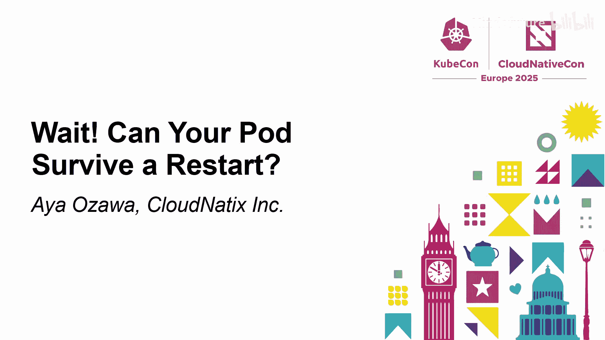


在本教程中，我们将学习如何确保你的 Kubernetes Pod 能够优雅地处理重启。Pod 重启是 Kubernetes 的核心操作之一，但若处理不当，可能导致服务中断或数据不一致。我们将通过三种不同类型的应用示例，探讨如何减少重启带来的影响。

## 为什么重启很重要？🚀

上一节我们介绍了课程目标，本节中我们来看看为什么 Pod 重启是 Kubernetes 的核心特性。

Kubernetes 将应用视为“牲口”而非“宠物”。宠物应用需要特殊照料和手动干预，而 Kubernetes 为“牲口”式应用优化，其强大的自愈、滚动升级和扩缩容功能都依赖于重启机制。因此，确保应用具备重启能力至关重要。

Pod 重启并非单一场景，主要发生在三个层面：

1.  **容器层面**：当容器退出或存活探针失败时，容器会被重启。
2.  **副本层面**：当 Pod 被驱逐时，控制器会自动创建新 Pod 以维持期望的副本数。
3.  **部署层面**：在滚动升级期间，Deployment 会先创建新 Pod，再终止旧 Pod。

## 基础应用：优雅终止 🛑

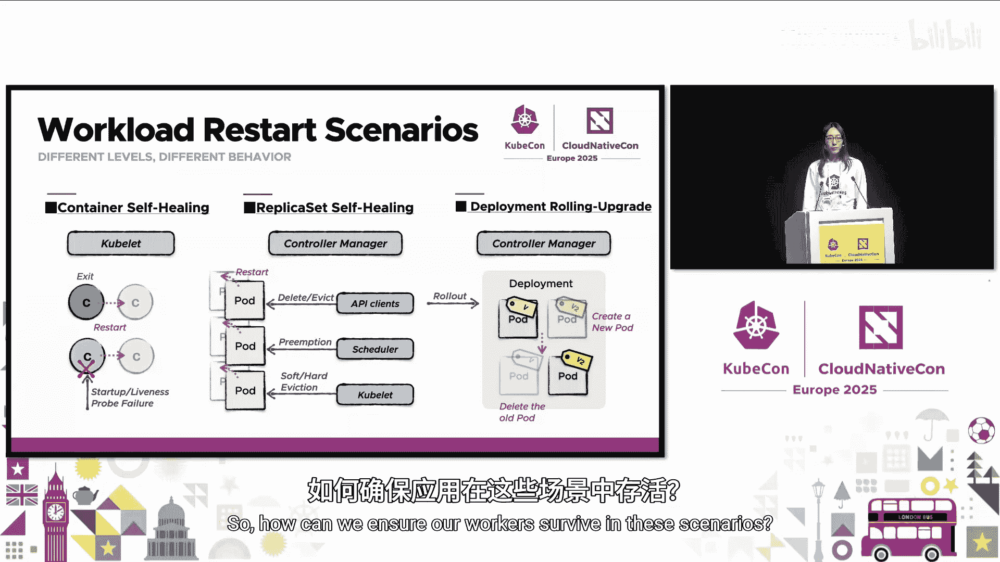

我们了解了重启的重要性，本节中我们来看看最简单场景下的 Pod 终止与重建流程。

假设我们有一个简单的 Deployment，它只定义了镜像和参数，没有处理任何信号。

```yaml
apiVersion: apps/v1
kind: Deployment
metadata:
  name: simple-app
spec:
  replicas: 1
  template:
    spec:
      containers:
      - name: app
        image: myapp:latest
        args: ["--port=8080"]
```

当我们使用 `kubectl delete pod` 删除此 Pod 时，Kubernetes 会向其发送默认的停止信号 `SIGTERM`。如果应用不处理此信号，它会在默认的 30 秒宽限期内继续运行。宽限期结束后，Pod 会被 `SIGKILL` 强制停止。同时，运行的 Pod 数量低于期望值，因此会触发 Pod 重建，包括调度、拉取镜像和启动容器。

你可能会疑惑，为什么 Pod 在收到 `SIGTERM` 后还在运行？在容器世界中，应用通常作为 PID 1 进程运行。Linux 对 PID 1 进程有特殊处理，如果应用不处理 `SIGTERM`，信号会被忽略，进程会一直运行直到被 `SIGKILL` 终止。

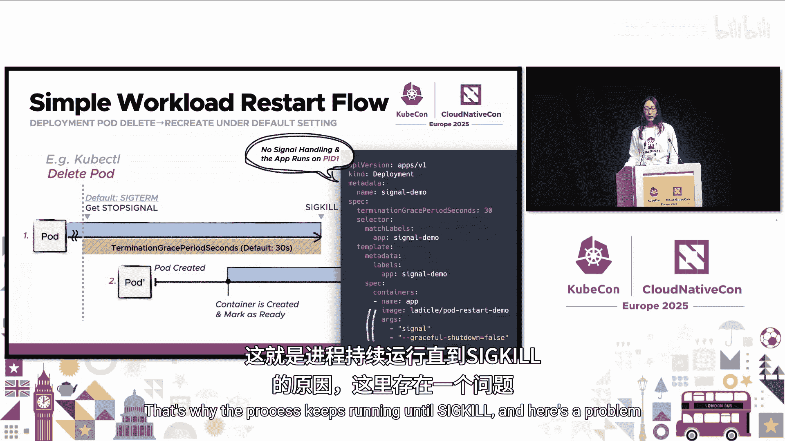

这里存在一个问题：如果应用只是等待整个宽限期结束，会浪费计算资源。此外，如果应用有关闭任务（如关闭数据库连接或写回数据），突然的关闭可能导致请求失败和数据不一致。因此，处理停止信号并在宽限期结束前优雅关闭应用非常重要。

## 处理自定义停止信号 🎯

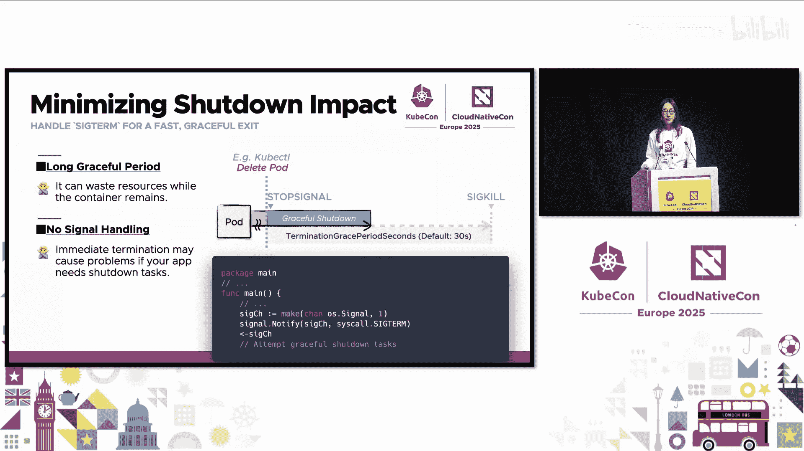

然而，有些应用使用不同的信号进行优雅关闭。例如，Nginx 期望 `SIGQUIT` 信号。如果你无法直接修改第三方应用的代码，有两种解决方案：Dockerfile 的 `STOPSIGNAL` 指令和 Kubernetes 的 `preStop` 钩子。

在 Dockerfile 中，你可以设置 `STOPSIGNAL` 来告知容器运行时你的应用期望接收哪种信号。

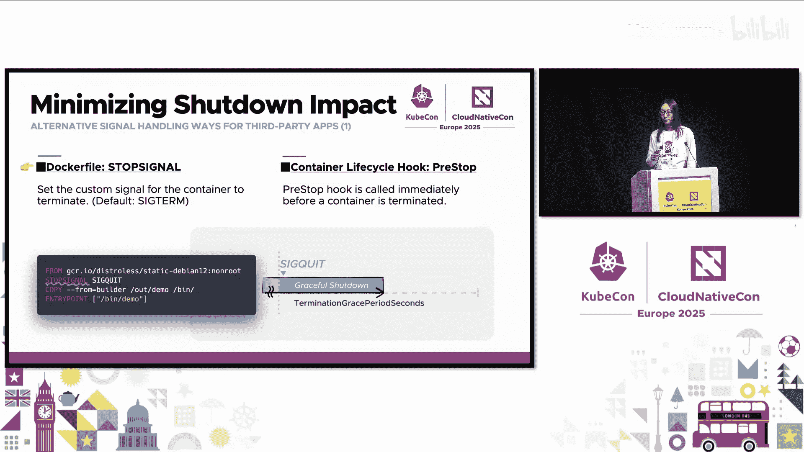

```dockerfile
FROM nginx:alpine
STOPSIGNAL SIGQUIT
```

第二种方法是使用 `preStop` 生命周期钩子，它在容器开始关闭前运行。有以下几种选项：

以下是 `preStop` 钩子的几种实现方式：

*   **Exec 钩子**：你可以在容器内直接发送期望的信号，例如使用 `kill -SIGQUIT 1`。但这要求你的应用容器中包含 `/bin/kill` 命令。
*   **HTTP 钩子**：调用你应用提供的 HTTP 端点来触发关闭，适用于支持基于 HTTP 的优雅关闭的应用。
*   **`lifecycle.stopSignal`**：这是一个即将推出的特性，允许直接在 Pod 清单中指定自定义停止信号。它的作用类似于 Dockerfile 的 `STOPSIGNAL`，但无需重新构建镜像。

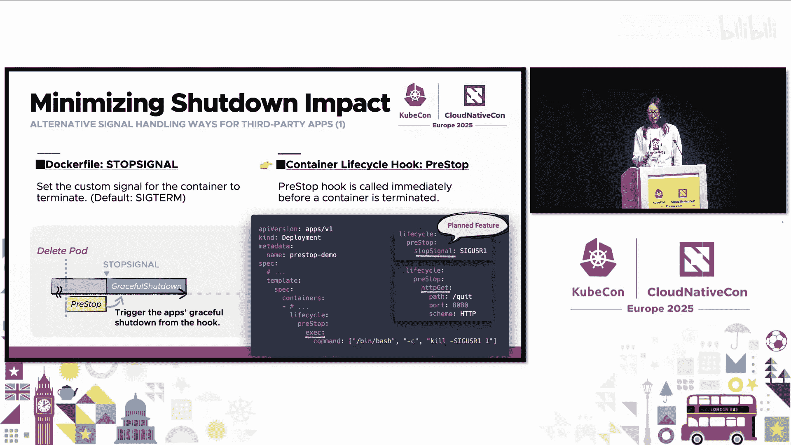

## 多容器 Pod 的关闭顺序 🔄

现在我们理解了单容器 Pod 的终止流程。但当你的 Pod 包含多个容器时会发生什么？

对于主容器，终止过程同时发生。但对于边车容器呢？边车容器设计模式（如日志代理）已存在多年，但作为原生 Kubernetes 功能的边车容器支持相对较新，并从 1.29 版本开始默认启用。此功能基于 `init` 容器，并且仅在重启策略设置为 `Always` 时应用。

以下是关闭过程：与主容器不同，边车容器按顺序关闭。一旦所有主容器退出，边车容器会一个接一个地收到停止信号，顺序与它们启动的顺序相反。例如，如果边车容器按 1、2、3 的顺序启动，则它们会按 3、2、1 的顺序停止。

需要注意的一点是，Pod 的宽限期由所有容器共享，因此要确保所有操作都能在此期限内完成。

## 宽限期的限制与挑战 ⚠️

到目前为止，我们学习了优雅关闭。然而，Pod 终止的宽限期并非总能得到保证。

当然，如果 Pod 因程序错误崩溃或被 OOM Killer 杀死，则没有宽限期。即使 Kubernetes 发起终止，宽限期有时也会被覆盖或忽略。例如，驱逐 API 可以覆盖此期限。如果你运行 `kubectl drain` 并指定 `--grace-period=1` 选项，Pod 将立即被终止，无论其 Pod 规格中的宽限期设置如何。

此外，当节点面临严重的资源压力时，kubelet 可能会发起驱逐以减少节点资源使用。在软驱逐中，宽限期被禁用；在硬驱逐中，Pod 会立即被驱逐，没有任何宽限期。

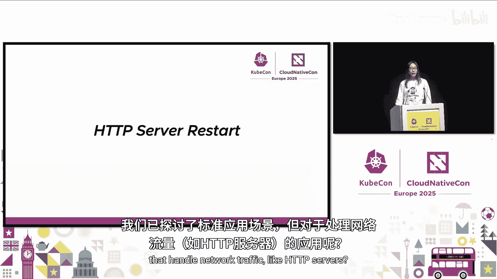

## HTTP 服务器：实现零宕机重启 🌐

我们已经探讨了标准应用，但如何处理像 HTTP 服务器这样处理网络流量的应用呢？

让我们考虑一个带有 Service 的 Deployment。当你删除一个 Pod 时，Kubernetes 会发送停止信号，最终从路由表中移除该 Pod。新 Pod 启动，一旦标记为就绪，流量就会被定向到它。

然而，即使我们实现了优雅关闭，也不足以保证零宕机时间，我们仍然面临两个挑战。

让我们看看第一个问题。右侧的 Go 代码展示了一个典型的 HTTP 服务器：在收到 `SIGTERM` 后，调用 `Shutdown` 函数进行优雅关闭。此函数会继续处理现有请求，但停止监听新请求。这里有一个关键点：服务器停止监听新请求，但新的传入请求仍会被路由到你的 Pod，导致请求被丢弃。

为了避免这个问题，关闭应该延迟到 Kubernetes 停止将流量路由到该 Pod 之后。有几种方法可以实现这种延迟。一种是修改你的应用代码，在关闭逻辑前添加延迟。另一种方法是使用 `preStop sleep`。从 1.30 版本开始，此功能默认可用，因此你可以直接在 Pod 清单中设置休眠秒数。

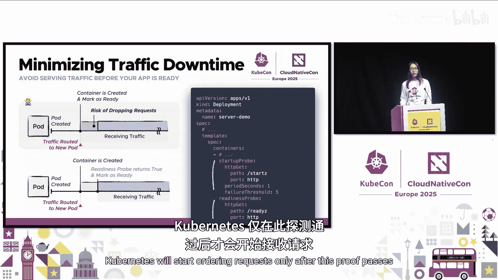

让我们继续下一个挑战。如果 Pod 在启动后没有立即准备就绪，Kubernetes 会立即开始向其发送请求，这些请求可能会被丢弃。就绪探针可以解决这个问题。此探针检查应用是否实际准备好处理请求。Kubernetes 只会在该探针通过后才开始路由请求。

## 启动探针与就绪探针的配合 🧪

然而，仅使用就绪探针有其局限性，因为此探针在整个容器生命周期内持续检查状态，而不仅仅是在启动期间。通常，启动阶段和启动后阶段需要不同的阈值或间隔。如果你为启动阶段依赖就绪探针，可能会导致启动变慢或过于严格的健康检查。

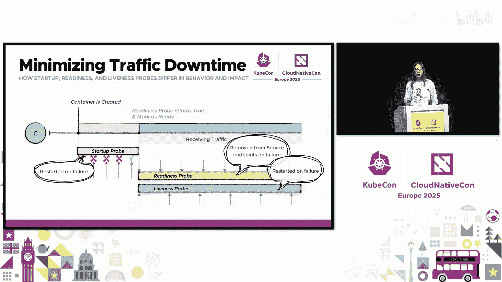

这时启动探针就派上用场了。此探针仅在初始化阶段运行。一旦启动探针成功，就绪探针和存活探针就会接管。这种分离允许你为启动配置探针，而不会影响启动后的探针。

## 实践演示：对比与优化 🎬

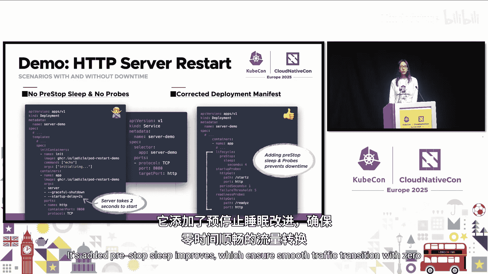

接下来，让我们看看实际的重启行为。左侧是一个没有特殊设置的 Deployment 和 Service 清单。右侧是修正后的版本。Deployment 添加了 `preStop` 休眠和探针，确保流量平滑过渡，实现零宕机时间。

让我们先看看问题案例。屏幕上每个面板显示问题案例 Deployment 的 Pod 和 Service 端点。现在我将删除一个 Pod。查看日志，我们的服务器收到了 `SIGTERM` 并开始关闭。然而，上方的端点列表尚未更新，流量仍被定向到该 Pod，导致请求被丢弃。现在，Kubernetes 创建了一个新 Pod，路由已切换，但我们仍然看到失败，这是因为新服务器尚未准备好处理请求。

接下来，让我们看看如何避免这些问题。这是修正后的 Deployment 版本，它包含了 `preStop` 休眠和探针。现在，我再次删除一个 Pod。这次，由于 `preStop` 休眠了 3 秒，Kubernetes 在发送 `SIGTERM` 信号前等待了 3 秒。当旧 Pod 正在关闭时，新 Pod 被创建。就绪探针成功后，端点列表也随之更新。如你所见，流量无缝过渡，没有任何丢弃。最后，旧 Pod 收到 `SIGTERM` 并退出。通过应用 `preStop` 休眠和探针，我们可以最大限度地减少 Pod 终止/启动期间的宕机时间。

## 流量切换时机与副本策略 📊

我们已经介绍了重启期间的流量处理，但尚未触及流量切换的确切时机。

通常，kube-proxy 不会将流量发送到正在终止的 Pod，但如果其他端点都未就绪，流量仍会流向正在关闭的 Pod。这会根据副本数量和重启类型改变重启行为。

在多副本场景中，Kubernetes 几乎在 Pod 被删除后立即移除其端点。然后等待新 Pod，并在其就绪后添加端点。当然，旧 Pod 停止和新 Pod 就绪之间存在间隙，但这没关系，因为其他副本可以处理这些请求。

接下来，在滚动升级期间，新 Pod 会首先被创建。因此，无论副本数量如何，流量都会在新 Pod 标记为就绪时切换。请注意，流量不会在删除的同时停止。正确的组件（如端点控制器和 kube-proxy）都从 API 服务器异步获取结果状态并进行处理，因此可能存在延迟。

那么，单副本工作负载的情况如何？如前所述，如果没有其他就绪的端点，流量会持续流向正在终止的 Pod。如左侧所示，旧 Pod 在开始关闭后仍持续接收流量。一旦新 Pod 就绪，流量即被切换。通过这种平滑的流量切换，即使是单副本工作负载，我们也能避免重启期间的请求丢弃。然而，正如我们在之前的演示中所学，如果旧 Pod 结束得太快，新 Pod 可能无法及时接管请求，这仍然可能导致请求被丢弃。因此，设置足够的 `preStop` 休眠和探针非常重要。

接下来，让我们看看当单副本 Pod 的存活探针失败时会发生什么。在容器级别的重启中，所有事件按顺序发生，因此在它恢复之前会有一个短暂的空隙。与滚动升级情况不同，此时没有其他 Pod 可以接管流量。因此，在此间隙期间，请求会被丢弃。这就是为什么在某些情况下，对于单副本应用，我们无法避免宕机。因此，对于重要的应用，建议使用多副本。

## 控制器应用：领导者选举 ⚙️

我们已经学习了简单应用和 HTTP 服务器，但控制器应用呢？

我们可以将相同的方法应用于控制器，但有一个额外因素：领导者选举。通常，控制器会实现领导者选举以防止冲突的更新。因此，让我们聚焦于此。这里，我们将以 controller-runtime 库为例，这是一个常用的实现控制器的库。

在此库中，一旦控制器收到关闭信号且上下文被取消，宽限期开始。它会经历几个终止过程，最终停止续租领导权。然后其他候选者获得领导权。

那么，我们如何减少选举期间的干扰呢？在讨论优化技术之前，让我们先看看 Kubernetes 领导者选举的行为。Kubernetes 为领导者选举提供了 Lease 资源，每个候选者持续尝试更新此共享资源。首先成功更新者成为领导者。

以下是影响领导者过渡的两个关键参数：
*   **`leaseDurationSeconds`**：领导权在没有续租的情况下持续的最长时间。默认周期为 15 秒。
*   **`renewDeadlineSeconds`**：候选者尝试获取领导权的频率。默认间隔为 2 秒。

使用这些默认值，在最坏情况下，领导权接管可能需要 17 秒。你可能会想，我们可以调整较短的租约持续时间来减少接管时间，但设置过短的周期会增加脑裂风险，例如多个 Pod 同时认为自己是领导者。

那么，我们如何安全地减少这个时间呢？controller-runtime 库提供了一个名为 `LeaderElectionReleaseOnCancel` 的选项。启用此选项后，领导者会主动放弃领导权，而不是等待租约过期。在内部，管理器仅在终止时将 `leaseDurationSeconds` 更新为 1 秒。通过此配置，领导权过渡时间可以加快到 3 秒，同时保持终止外的默认设置。

总之，虽然需要注意脑裂风险，但临时的租约持续时间更新允许你安全地加速领导权过渡。

## 使用 Pod 中断预算管理自愿中断 📉

到目前为止，我们已经讨论了应用如何优雅地处理重启。但如果跨多个 Pod 的维护操作（如节点排水）影响了整个工作负载，我们如何最大限度地减少这些中断呢？

Pod 中断预算（PDB）可以限制这些自愿中断。右侧是一个包含两个副本的 Deployment 清单，并受到 PDB 保护。此 PDB 只允许一个 Pod 不可用。

在左侧的场景中，驱逐请求成功，因为它尊重了我们设置的预算。在右侧的场景中，驱逐请求被拒绝，因为另一个 Pod 正在终止，驱逐将超出预算。

通过这种方式，当你设置 PDB 时，它会拒绝违反中断预算的请求，从而减少中断。

## PDB 的益处与局限 🤔

我们发现 PDB 有利于减少中断，但也存在一些局限性。

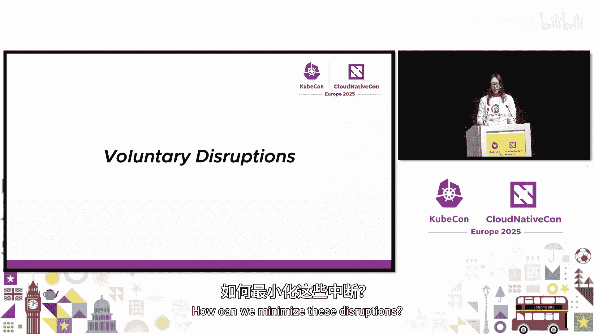

首先，与滚动升级不同，Pod 驱逐不会提前创建替换 Pod。因此，如果你希望在驱逐期间至少保留一个 Pod，你至少需要从两个正在运行的 Pod 开始。

其次，如果你将 PDB 设置得过于严格，它可能会永久性地阻塞驱逐请求。这在几种情况下会发生，例如工作负载只有一个副本、`maxUnavailable` 设置为 0，或者应用从未处于运行状态以进行备份等。这会使节点维护（如 `kubectl drain`）复杂化，并需要大量手动干预。

## 不健康 Pod 驱逐策略 🩺

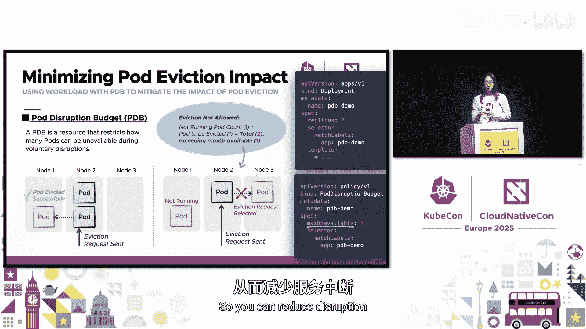

我提到应用 Pod 也可能阻塞驱逐，Kubernetes 为此提供了解决方案。从 1.27 版本开始，Kubernetes 默认支持不健康 Pod 驱逐策略。

当你将此策略设置为 `AlwaysAllow` 时，不健康的 Pod 将不会阻塞驱逐请求。

最后，请记住 PDB 仅适用于驱逐 API 和 `kubectl drain`。当然，如果你直接删除 Pod，PDB 约束将不适用。此外，当调度器尝试抢占较低优先级的 Pod 以腾出节点空间时，它通常会遵循它发现的任何 PDB 约束。但如果找不到合适的候选者，抢占可能会忽略 PDB。

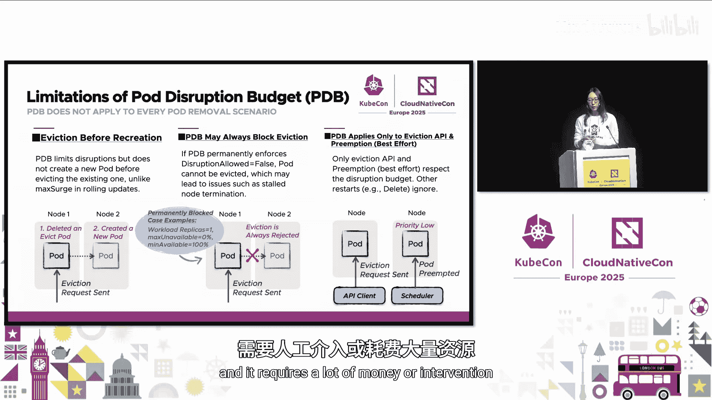

## 总结与要点 📝

本节课中我们一起学习了如何确保 Pod 在 Kubernetes 重启中存活的关键策略。

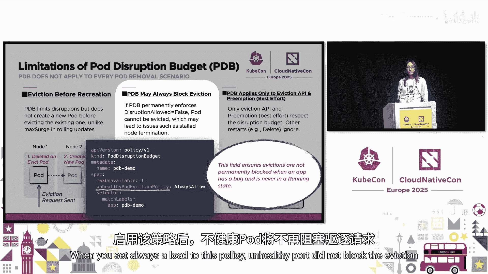

首先，确保你的应用能够处理 `SIGTERM` 并优雅关闭。如果需要其他信号，请使用 `STOPSIGNAL` 或 `preStop` 钩子。同时，边车容器按其启动顺序的逆序终止。记住，Pod 终止的宽限期并非总能得到保证。

其次，`preStop` 休眠和探针有助于最大限度地减少流量宕机时间。这两个功能都支持在重启期间平滑转移流量。

第三，如果你的控制器使用领导者选举，你可以通过在管理器停止时仅设置较短的租约持续时间来加速接管时间，但需注意脑裂风险。

最后，PDB 可以在不失去操作灵活性的情况下减轻自愿中断的影响。

这些实践将帮助你的 Pod 对中断更加友好，并充分利用 Kubernetes 的自动化功能。

所有示例代码均可在演讲者的代码仓库中找到。

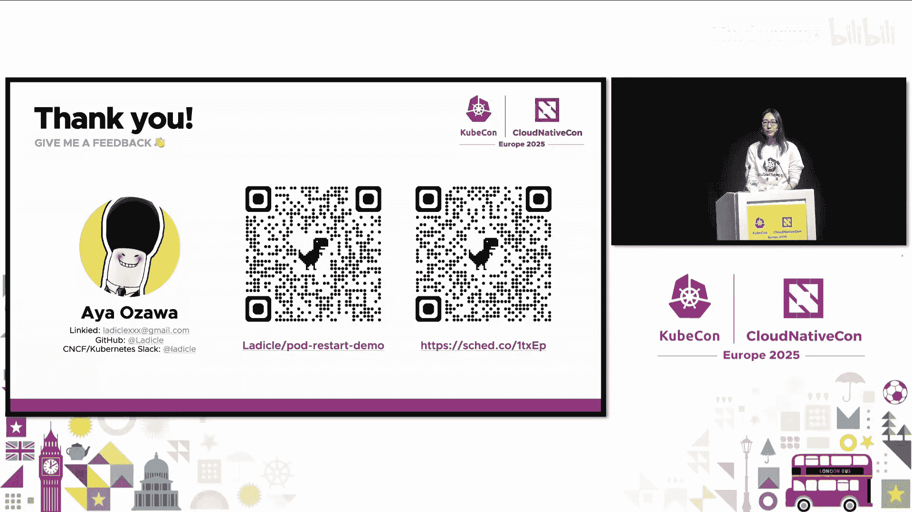

