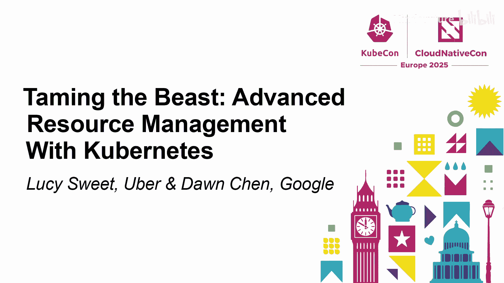
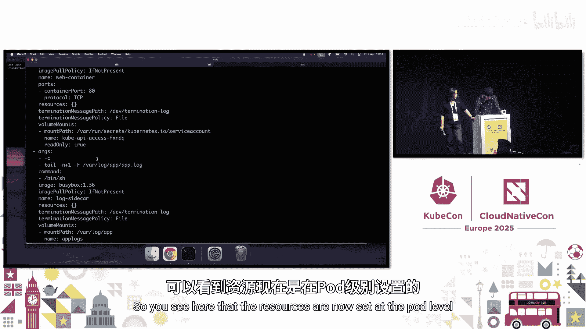
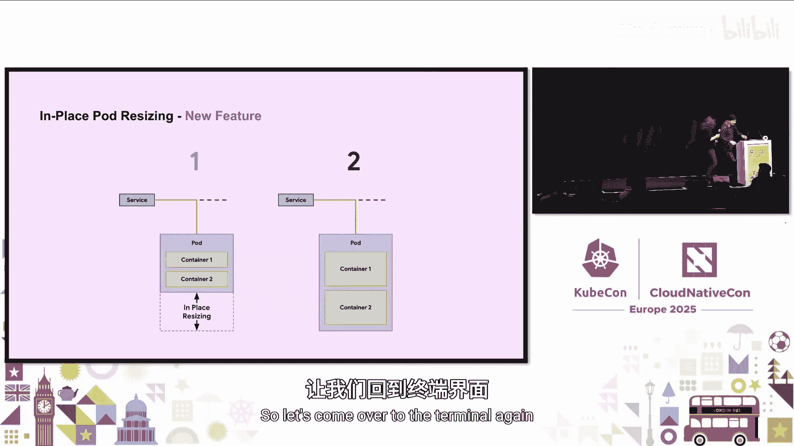
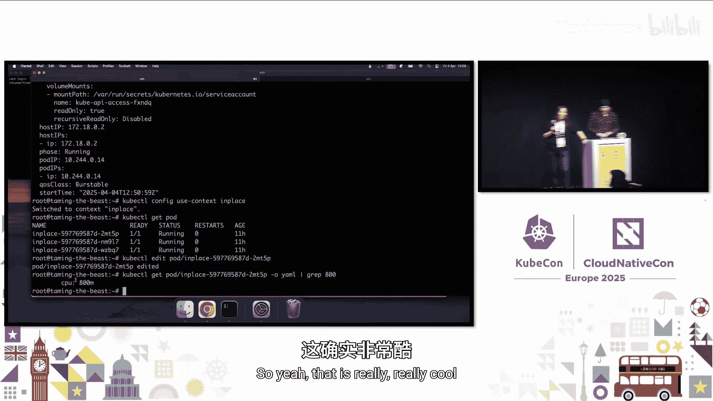
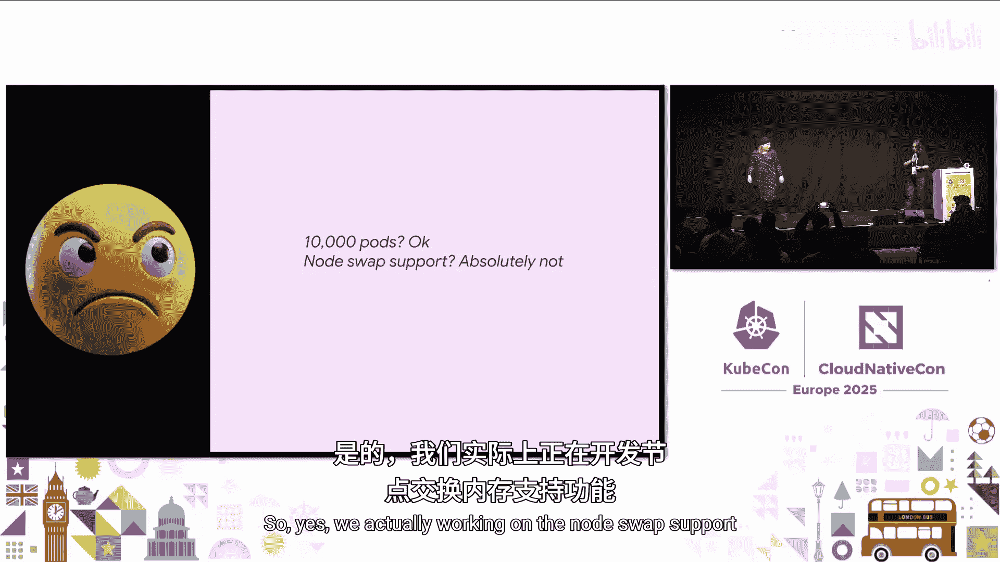
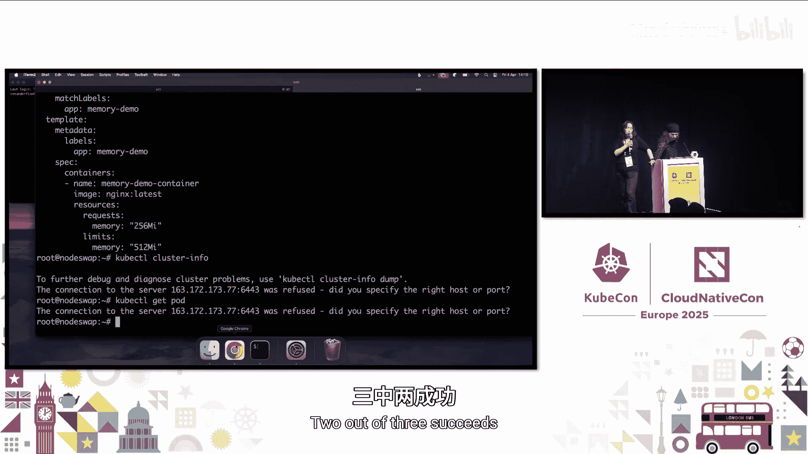
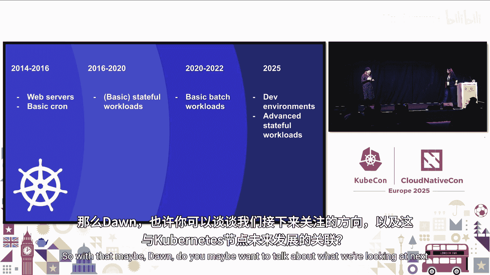

# 034：驯服野兽——高级资源管理 🐉



在本节课中，我们将学习Kubernetes中一系列新的高级资源管理功能。这些功能旨在帮助用户更好地控制和管理集群资源，特别是针对更复杂、有状态或资源需求多变的工作负载。我们将探讨Pod级别资源、原地资源调整以及节点交换支持等核心特性。

---

## Pod级别资源 🧩


上一节我们介绍了资源管理的传统挑战，本节中我们来看看如何通过Pod级别资源来简化配置并提升灵活性。

传统上，Kubernetes要求在容器级别设置资源请求和限制。这可能导致资源过度配置，因为每个容器都需要根据其峰值使用量预留资源，从而造成节点级别的资源浪费。或者，也可能导致资源不足，影响应用程序性能。



Pod级别资源功能允许您在Pod级别设置总的资源请求和限制，而不是为每个容器单独设置。这使得容器可以在Pod内共享资源池。

以下是Pod级别资源的YAML配置示例：

```yaml
apiVersion: v1
kind: Pod
metadata:
  name: example-pod
spec:
  # 资源定义在Pod级别
  resources:
    requests:
      memory: "64Mi"
      cpu: "250m"
    limits:
      memory: "128Mi"
      cpu: "500m"
  containers:
  - name: app
    image: nginx
    # 容器级别无需再定义resources
  - name: logger
    image: busybox
    command: ["sh", "-c", "while true; do echo logging; sleep 1; done"]
```

以下是Pod级别资源的主要优势：

*   **简化配置**：无需为每个容器精心计算资源，减少了配置复杂性和出错可能性。
*   **灵活组合**：您可以选择仅在Pod级别设置资源，或与容器级别资源混合使用，以满足不同需求。
*   **提升利用率**：允许容器之间根据实际需求动态共享资源，特别适用于一个容器高负载、另一个低负载，且负载模式会翻转的场景。



---

## 原地资源调整 ⚙️



上一节我们学习了如何更灵活地定义资源，本节中我们来看看如何在不中断服务的情况下动态调整已运行Pod的资源。

对于有状态工作负载（如数据库），传统的资源变更需要重建Pod，这会造成服务中断和数据迁移的负担。原地资源调整功能允许您直接修改运行中Pod的资源请求和限制，而无需重启Pod。

该功能在Kubernetes 1.27版本升级为Beta，并在1.28版本默认启用。您可以直接编辑Pod的YAML文件或通过API更新资源字段。

原地资源调整支持两种策略：

*   **`RestartPolicy`**： 这是以前的默认行为，变更资源会导致容器重启。
*   **`RestartNotRequired` (首选)**： 允许在不重启容器的情况下调整资源。但需注意，由于内核限制，内存缩容可能无法有效进行。

该功能可以与Pod级别资源结合使用。同时，它目前主要支持CPU和内存资源，扩展资源仍在开发中。此外，资源调整是原子性的；如果节点无法满足所有调整请求，整个请求将被拒绝。



---

## 节点交换支持 💾

上一节我们探讨了如何动态调整资源，本节中我们来看看如何利用交换空间来应对突发内存需求。


某些应用（如Java服务）在启动时内存需求很高，之后会下降。传统上，您必须为整个生命周期预留峰值内存，导致内存闲置。Kubernetes过去不支持交换空间，但现在正在开发节点交换支持功能。

该功能允许将Pod的可突发内存部分（即超过请求值但未超过限制值的内存）交换到磁盘。这有助于提高资源利用率，特别是在运行AI/机器学习等成本高昂的批处理作业时。



节点交换是一个节点级别的功能，需要在节点上启用。Kubernetes会根据原始内存使用量和交换使用量来做出调度和驱逐决策。目前，该功能尚未提供Pod级别的细粒度控制。

启用交换时需谨慎，因为它可能带来性能开销、磁盘活动激增以及安全考量。Kubernetes社区正在完善相关文档和最佳实践。


---

## 未来展望 🚀



Kubernetes因其能够“较好地运行大多数工作负载”而变得无处不在。随着工作负载格局的变化（从基础Web服务到有状态应用、批处理作业，再到AI/机器学习），Kubernetes需要不断演进以保持相关性。

未来的发展方向可能包括：

*   **引入Pod组概念**： 为需要紧密耦合、协同定位的分布式批处理工作负载提供一级抽象，作为自定义调度器的基础构建块。
*   **进一步使Pod动态化**： 探索在Pod运行时注入或移除容器的可能性，使资源调度和共享更加灵活。
*   **构建抽象层**： 在Kubernetes对象之上定义标准化抽象层，以便各种批处理工作负载调度器可以更高效地运行。

这些演进旨在让大多数工作负载都能在Kubernetes上顺畅运行，而无需用户成为专家。

---


本节课中我们一起学习了Kubernetes在高级资源管理方面的关键进展：**Pod级别资源**简化了配置并提升了共享效率；**原地资源调整**实现了无需中断服务的资源动态变更；**节点交换支持**为突发内存需求提供了缓冲。这些特性共同助力用户更高效、更灵活地“驯服”Kubernetes资源管理这头“野兽”，以支持日益多样化和复杂化的云原生工作负载。