# 035：揭秘世界为何构建于 Kubernetes 之上

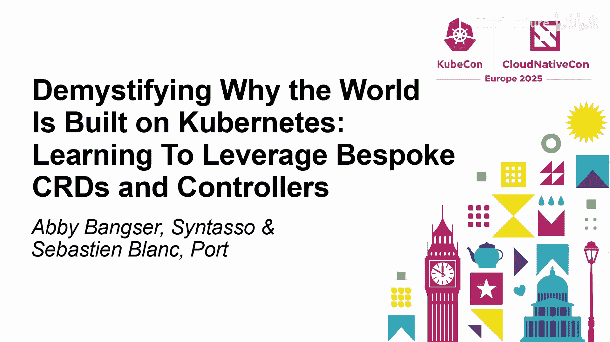

## 概述

在本节课中，我们将学习 Kubernetes 如何超越其作为容器编排器的传统角色，成为一个强大的 API 服务器和扩展平台。我们将重点探讨开发者如何通过自定义资源定义和控制器来扩展 Kubernetes 的功能，以满足组织的特定需求。

---

## 三种交互模型

Kubernetes 支持多种交互模型，理解这些模型有助于澄清不同用户如何使用它。

以下是三种主要的交互模型：

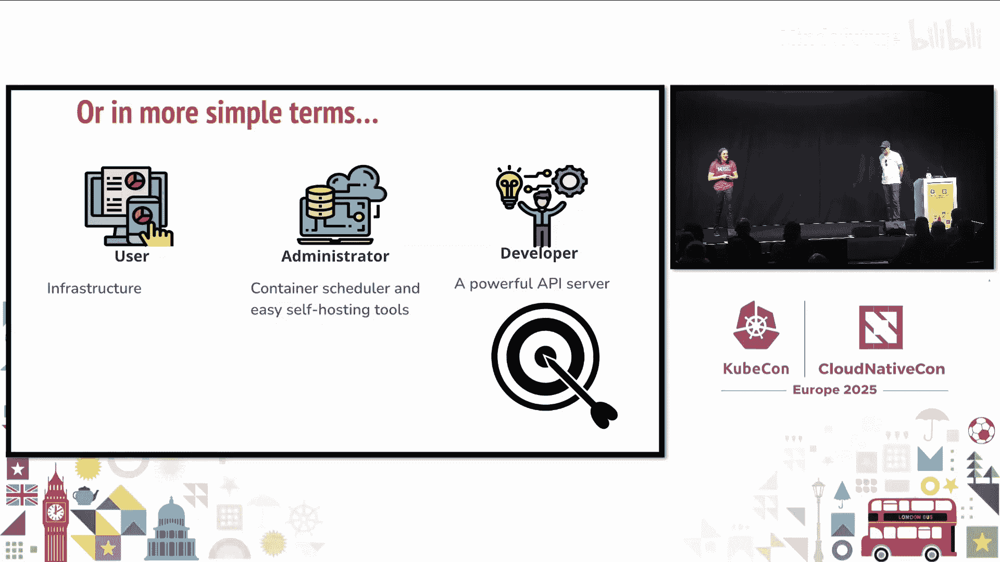

1.  **用户模型**：这类用户关注在集群中运行的应用程序。他们使用 `kubectl` 等命令行工具来查看 Pod 状态、获取日志等。对他们而言，Kubernetes 是运行应用的基础设施。
2.  **管理员模型**：这类用户更关注基础设施管理。他们负责创建节点、设置污点、升级 Kubernetes 本身，并制定 RBAC 等集群标准。
3.  **开发者模型**：这类用户着眼于扩展 Kubernetes。他们不满足于开箱即用的功能，而是希望构建自定义逻辑，为团队和组织带来更多价值。

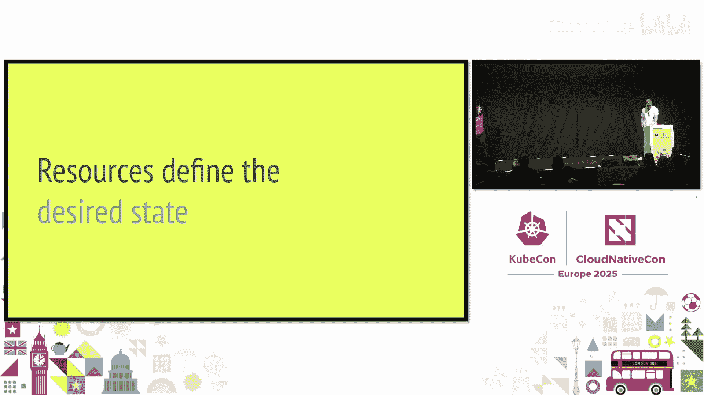

上一节我们介绍了 Kubernetes 的三种不同交互视角，本节中我们来看看其中最核心的扩展机制：自定义资源定义。

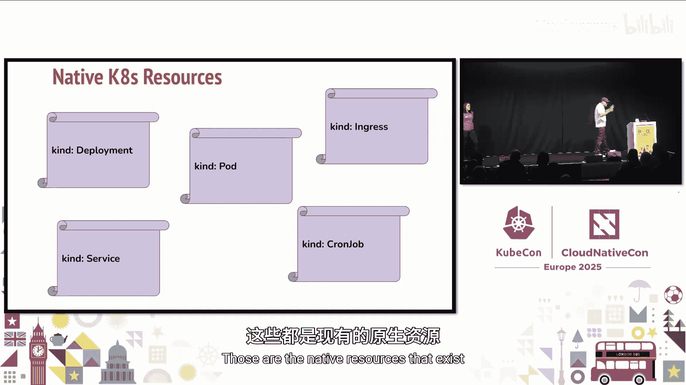

---

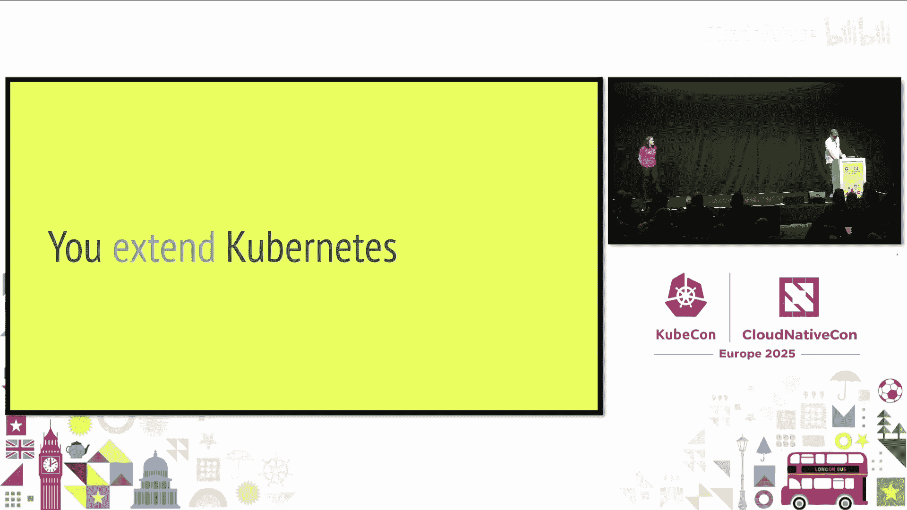

## 什么是 CRD？

CRD 代表 **自定义资源定义**。在 Kubernetes 中，资源代表一种期望状态。例如，一个 Deployment 资源定义了“我想要 3 个副本”的期望状态，集群会确保实际状态与之匹配。

我们熟知的原生 Kubernetes 资源包括 Deployment、Pod、Ingress、Service 等。

**自定义** 意味着开发者可以创建自己的资源类型并将其应用到 Kubernetes 中。这本质上是扩展了集群的 API。许多人认为，这是 Kubernetes 最强大的特性之一，因为它允许你以一种非常便捷的方式在其之上进行构建。

---

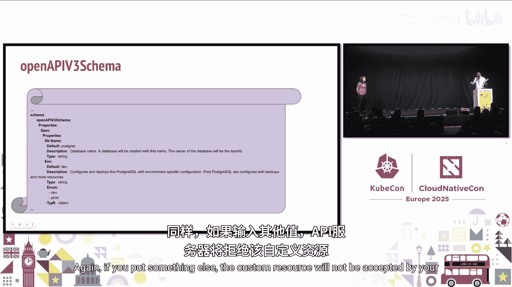

## CRD 的结构

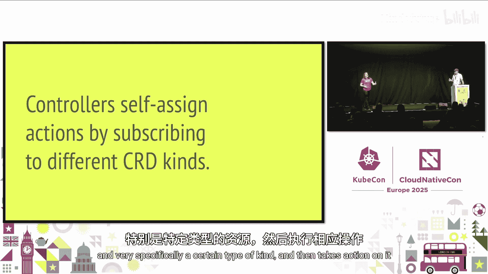

让我们具体看看 CRD 的构成。首先，它的结构与原生资源类似。

以下是一个简单的 CRD 示例结构：

```yaml
apiVersion: apiextensions.k8s.io/v1
kind: CustomResourceDefinition
metadata:
  name: widgets.example.com
spec:
  group: example.com
  versions:
    - name: v1
      served: true
      storage: true
      schema:
        openAPIV3Schema:
          type: object
          properties:
            spec:
              type: object
              properties:
                databaseName:
                  type: string
                size:
                  type: string
                environment:
                  type: string
                  enum: [dev, prod]
  scope: Namespaced
  names:
    plural: widgets
    singular: widget
    kind: Widget
    shortNames:
    - wg
```

*   **API 版本和类型**：与原生资源一样，包含 `apiVersion` 和 `kind`。
*   **元数据**：包含名称等标准信息。
*   **Spec 部分**：这是核心，你在此处定义资源的模式。它基于 OpenAPI v3 模式，允许你定义字段类型（如字符串、整数、布尔值），并添加约束（如最小值、最大值、是否必需、枚举值）。这确保了数据完整性，因为不符合约束的资源将无法被 API 服务器接受。

你可以将 **CRD** 类比为 Java 中的类定义，而 **自定义资源** 则是该类的实例对象。

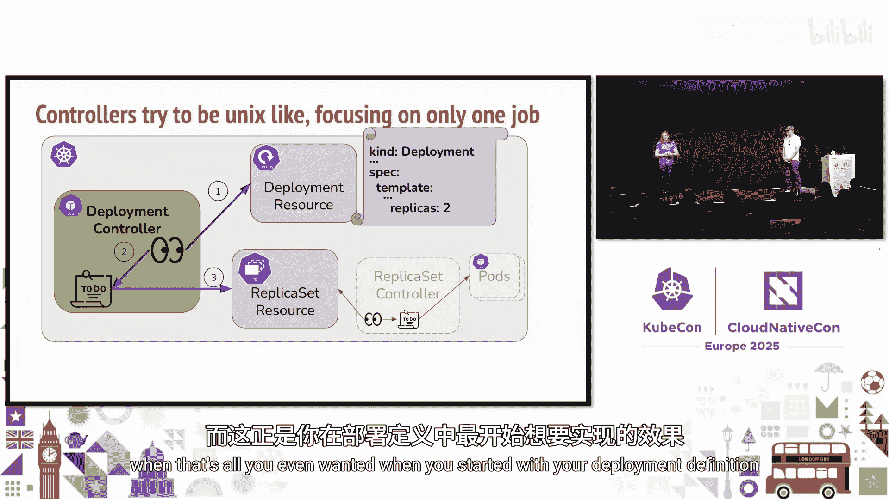

现在我们已经了解了如何定义新的资源类型，但仅仅定义它们并不会发生任何事情。接下来，我们需要一种机制来响应这些资源的创建和变更。

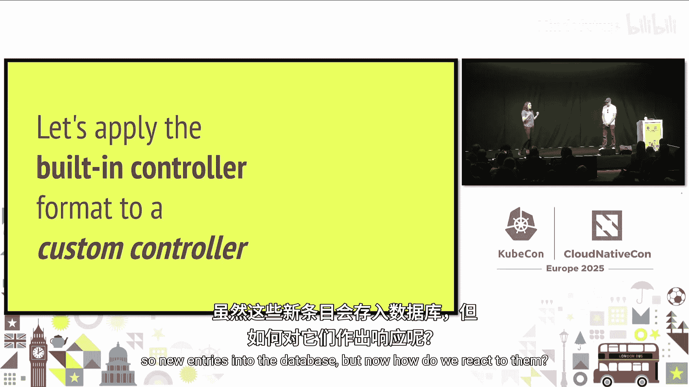

---

## 控制器：让资源“活”起来

自定义资源定义只是数据库中的一条记录。要让这些定义产生实际效果，需要 **控制器**。

控制器本质上是一个应用程序，它作为 Pod 运行在集群中。它的作用是监听集群状态（即存储在 etcd 中的数据）和发生的事件，然后根据指令执行操作。

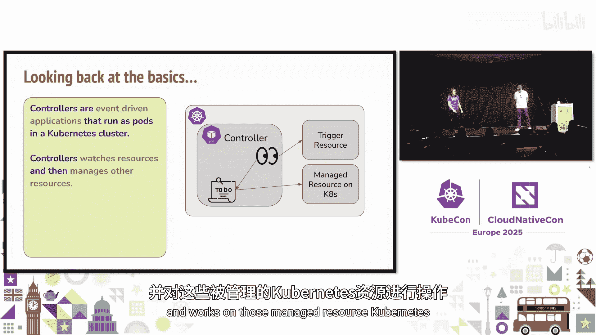

以下是控制器的工作原理：

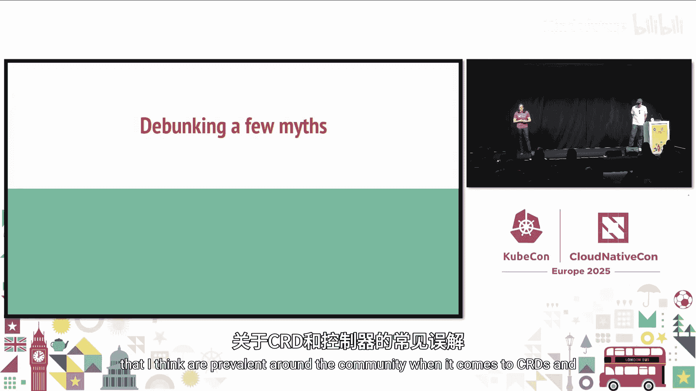

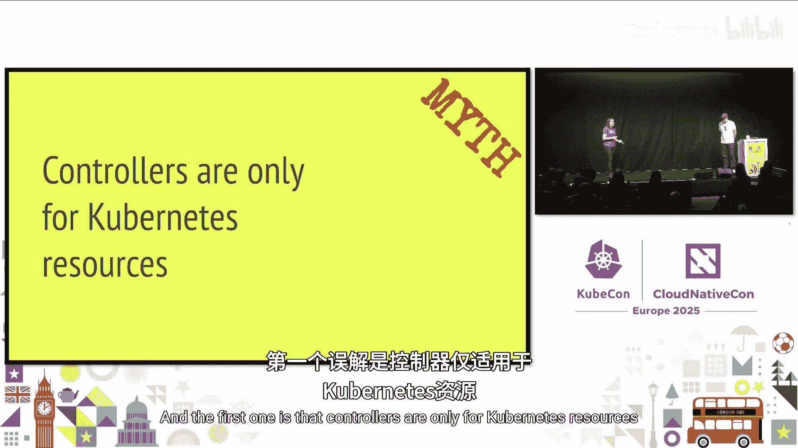

1.  **监听触发器资源**：控制器监听特定类型的资源（例如我们自定义的 Widget）。
2.  **生成待办事项**：当触发器资源发生变化（创建、更新、删除）时，控制器会生成一个待办事项列表，例如“创建某物”、“更新某物”、“删除某物”。
3.  **执行操作**：控制器执行这些操作，以协调期望状态与实际状态。

以 Kubernetes 内置的 **Deployment** 为例：
*   你创建一个 Deployment 资源（一条数据库记录）。
*   **Deployment 控制器** 监听到这个新记录，它的待办事项是创建一个 ReplicaSet。
*   **ReplicaSet 控制器** 监听到新创建的 ReplicaSet，它的待办事项是创建指定数量的 Pod。
*   最终，你得到了运行的 Pod，尽管你最初只定义了一个 Deployment。

这种链式反应体现了 Unix 哲学：每个组件只做好一件事，并通过组合完成复杂任务。

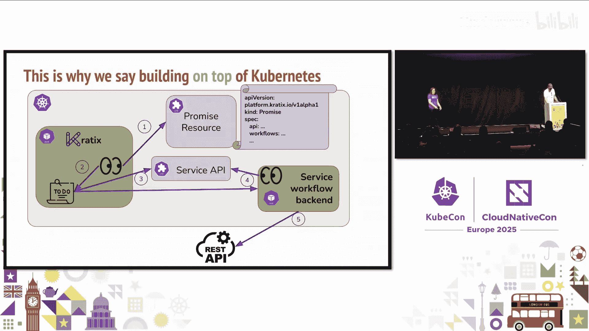

我们已经学习了如何通过 CRD 定义新资源，以及如何通过控制器响应这些资源。那么，如何将这两者结合起来，构建更高级的抽象呢？

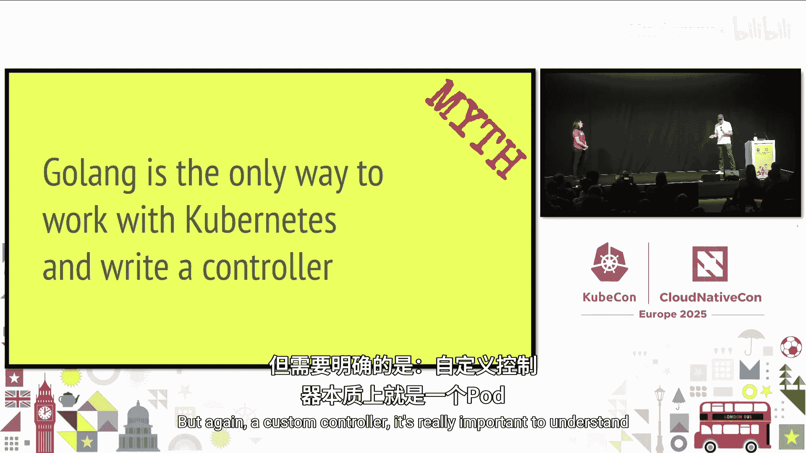

---

## 构建平台 API：CRD 与控制器的结合

许多云原生项目（如 Crossplane）正是通过结合 CRD 和控制器来构建更高级的平台 API。

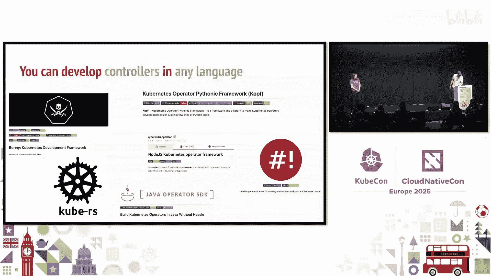

其工作流程通常如下：

1.  定义一个代表平台服务（如数据库服务）的 CRD（称为“承诺”或 Promise）。
2.  一个控制器监听这个 CRD。
3.  当该 CRD 被创建时，控制器执行其待办事项，可能包括：
    *   创建另一个更具体的 CRD（作为服务请求的 API 端点）。
    *   创建或调用后端服务（可能运行在 Kubernetes 内或外）来实现该承诺。
4.  另一个控制器监听新创建的具体 CRD，处理用户发起的服务请求。

通过这种方式，我们将底层的 CRD 和控制器抽象成了面向用户的 **平台 API**，简化了复杂基础设施的交付和管理。

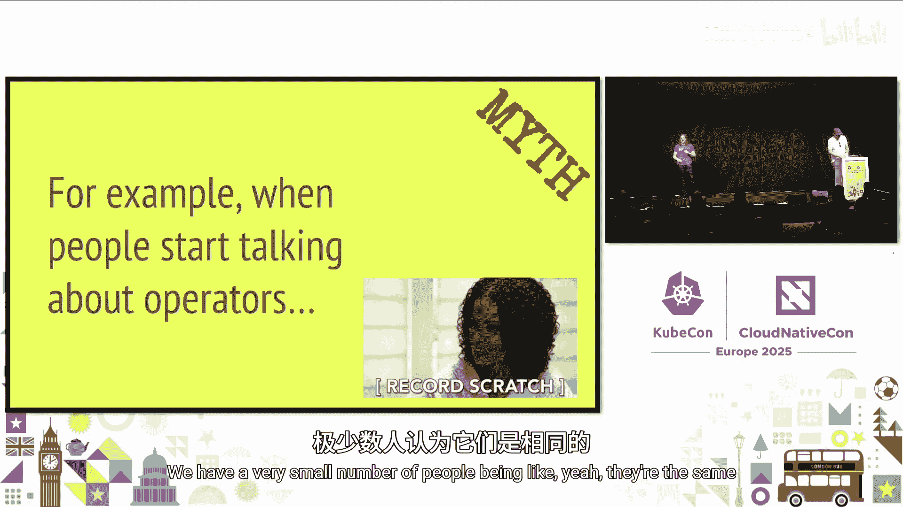

在结束之前，让我们澄清一些关于 CRD 和控制器的常见误解，这有助于我们更准确地理解它们的潜力。

---

## 澄清常见误解

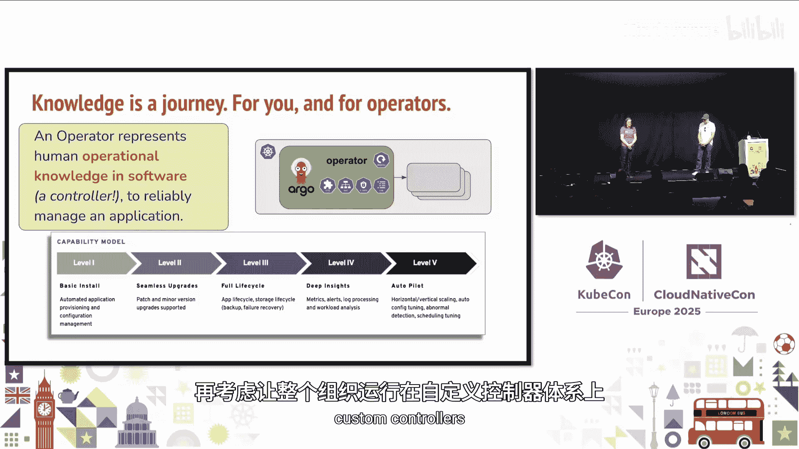

以下是几个需要澄清的关键点：

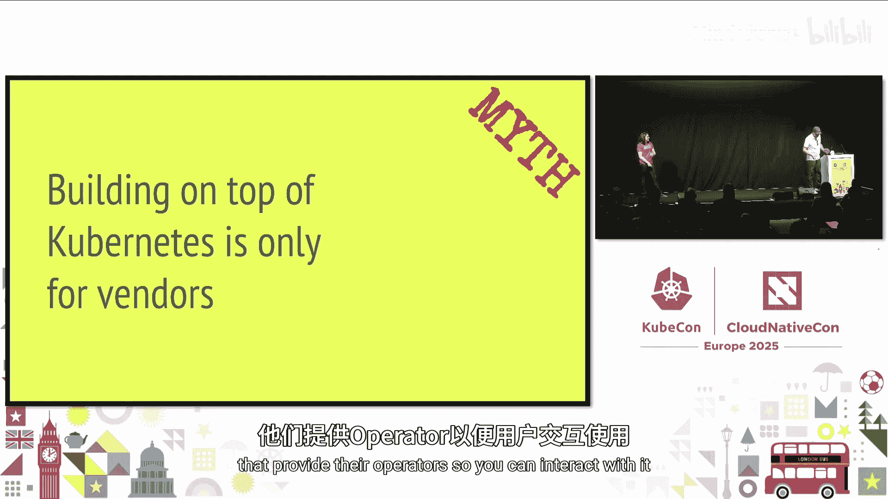

1.  **控制器仅管理 Kubernetes 资源？**
    *   **错误**。控制器虽然运行在 Kubernetes 中并使用其 API，但它们完全可以管理集群外的资源。例如，许多控制器可以调用云提供商 API、管理裸金属服务器、虚拟机或边缘设备。这使你能够通过统一的 Kubernetes 控制平面来管理整个复杂环境中的基础设施。

2.  **必须使用 Go 语言编写控制器？**
    *   **错误**。控制器只是一个运行在 Pod 里的应用程序。你可以使用任何编程语言来编写它。社区中已有多种 SDK 和框架：
        *   **Go**: Operator SDK (最流行)
        *   **Java**: Java Operator SDK
        *   **Python**: Kopf, Pythonic Operator Framework
        *   **JavaScript/TypeScript**: Node.js Operator Framework
        *   **Rust**: kube-rs
        选择你熟悉的语言，可以大大提升开发体验和效率。

3.  **控制器和运算符是一回事吗？**
    *   **存在区别，但入门时不必纠结**。可以这样类比：**所有运算符都是控制器，但并非所有控制器都是运算符**。
        *   **控制器**：更通用的概念，指监听一种资源并管理另一种资源的 Pod。
        *   **运算符**：特指那些封装了特定应用程序 **运维知识**（如安装、升级、备份、故障恢复等全生命周期管理）的控制器。这个概念由 Red Hat 的 Operator Framework 推广开来。对于初学者，理解控制器模式即可开始构建；随着深入，自然会理解运算符的特定要求和最佳实践。

4.  **构建于 Kubernetes 之上只是供应商的事？**
    *   **错误**。这对于任何希望构建 **内部开发者平台** 的组织都至关重要。
        *   **CRD 即 API**：将你的平台领域模型定义为 CRD，为你的平台产品提供清晰、一致的 API。
        *   **实现自助服务**：通过自定义的 CRD 和控制器，你可以向开发团队暴露受控的、抽象的自服务能力，使他们能够自主申请资源（数据库、缓存、消息队列等），无论这些资源最终部署在 Kubernetes 内部还是外部。
        *   **统一管理**：即使你使用多个 SaaS 供应商或遗留系统，也可以通过为它们创建相应的运算符/控制器，并将所有能力统一通过 Kubernetes CRD 暴露出来，从而简化和统一你的内部开发者体验。

---

## 总结

本节课中我们一起学习了：

*   **Kubernetes 的多面性**：它不仅是卓越的容器编排器，更是一个强大的、可扩展的 API 服务器。
*   **CRD**：自定义资源定义，如同数据库模式或 Java 类定义，允许你扩展 Kubernetes API，定义自己的资源类型。
*   **控制器**：作为 Pod 运行的应用程序，监听特定 CRD 类型的事件，并通过协调循环确保期望状态与实际状态一致。它们是让 CRD 产生实际效果的“引擎”。
*   **结合使用**：通过结合 CRD 和控制器，可以构建高级的平台 API 和内部开发者平台，实现基础设施即代码和自助服务。
*   **打破误解**：控制器可以管理集群外资源，可以用多种语言编写，是构建现代平台工程的关键组件。

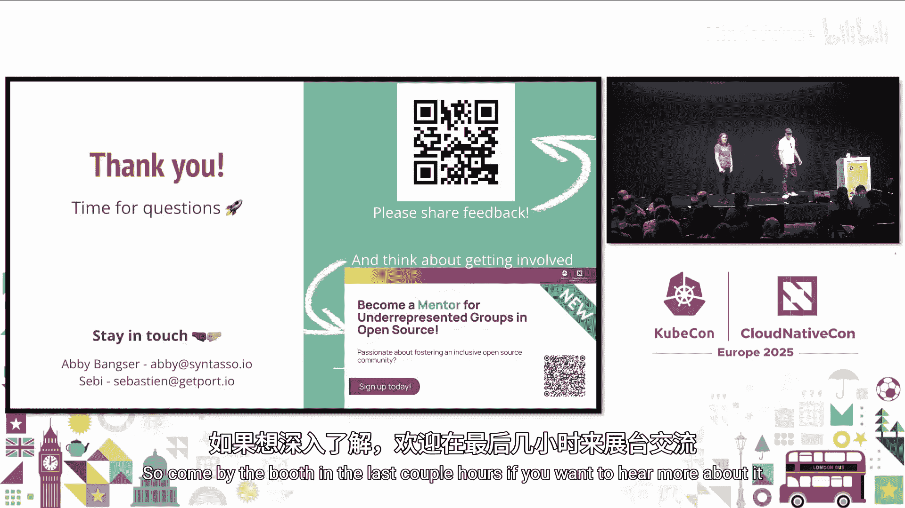

希望本教程帮助你揭开了 Kubernetes 作为可扩展平台的神秘面纱，并鼓励你开始探索如何利用 CRD 和控制器来解决自己组织的独特挑战。