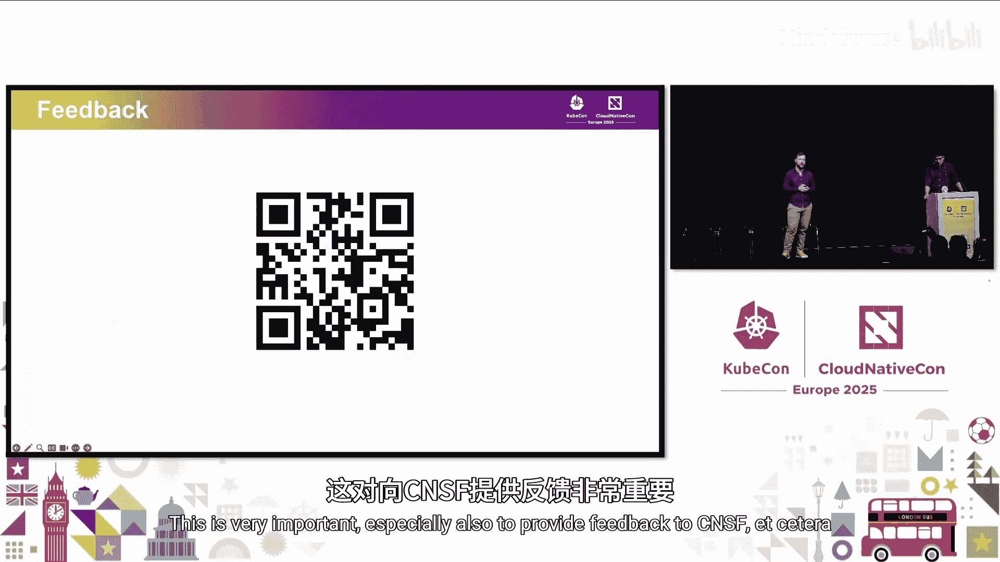

# 036：为你的Kubernetes栖息地选择合适的工具 🛡️

## 概述
在本节课中，我们将学习如何为Kubernetes环境选择合适的安全工具。我们将遵循构建、部署、启动和运行四个阶段，介绍每个阶段的核心安全工具，并通过类比帮助理解它们的作用。

## 构建阶段：扫描容器镜像

上一节我们介绍了课程的整体结构，本节中我们来看看构建阶段的安全实践。

容器镜像是一个静态的、分层的文件，类似于蛋糕的食谱。镜像基于操作系统层，例如Alpine，并叠加了应用程序代码和依赖。扫描镜像的目的是检查这些层中是否存在已知的安全漏洞。

以下是扫描镜像的核心步骤：
1.  **提取层**：获取镜像的各个只读层。
2.  **构建文件系统**：基于提取的层重建完整的文件系统视图。
3.  **识别包**：区分操作系统包（如`apt`、`yum`安装）和非操作系统包（如语言库`pip`、`npm`）。
4.  **交叉检查**：将识别出的包信息与漏洞数据库（如CVE）进行比对。

一个广泛使用的开源扫描工具是**Trivy**。运行Trivy后，你会得到类似下面的结果，它清晰地列出了基础镜像和各个包中的漏洞数量。

```bash
# 示例性 Trivy 扫描结果摘要
Base Image (python:3.9-slim): 0 vulnerabilities
Package `libssl1.1`: 1 vulnerability (CVE-2022-xxxx)
Package `requests`: 2 vulnerabilities (CVE-2021-xxxx, CVE-2020-xxxx)
Total: 3 vulnerabilities
```

这个阶段的工具可以类比为**浣熊**。浣熊会翻找垃圾桶，打开每一层寻找可用的食物，类似安全工具逐层扫描镜像以发现潜在威胁。

## 部署阶段：执行安全策略

在构建阶段我们确保了镜像安全，接下来在部署阶段，我们需要确保部署到集群的资源符合安全策略。

当通过`kubectl`或API发起创建Pod等请求时，请求会经过**准入控制器**。这是一个检查点，用于审查所有请求并强制执行已定义的策略。只有通过检查的请求，其对象才会被存储到ETCD中。

我们为此阶段选择的工具是**Kyverno**。它作为Kubernetes的准入控制器工作，使用大家熟悉的YAML语言来定义策略，降低了学习成本。

Kyverno主要提供两种钩子：
*   **变更钩子**：在请求被允许前，动态修改资源对象。例如，如果Pod定义忘了设置内存限制，Kyverno可以自动为其添加一个默认值。
*   **验证钩子**：检查资源对象是否符合策略，如果不符合则直接拒绝请求。例如，要求所有命名空间必须带有`environment=production`标签。

这个阶段的工具可以类比为**森林管理员**。管理员会检查进入森林的游客，如果游客忘了带灯（资源缺失关键配置），管理员会提供一盏灯（变更钩子）；如果游客携带了违禁品（资源违反策略），管理员会禁止其进入（验证钩子）。

## 启动阶段：安全管理密钥

部署策略确保后，在Pod真正启动运行前，我们需要安全地管理敏感信息，如密码、令牌和证书。

Kubernetes提供了**Secret**对象来存储这些敏感数据，避免将其硬编码在Pod定义中。然而，原生的Secret存在一些限制：缺乏自动轮换机制、版本管理不便、与外部管道（如Git）集成困难，并且难以与外部密钥管理系统（如HashiCorp Vault、AWS Secrets Manager）集成。

**External Secrets Operator** 项目解决了这些问题。它将密钥值从外部系统（如AWS Secrets Manager）同步到Kubernetes的Secret对象中。

其工作流程如下：
1.  配置External Secrets Operator，使其拥有访问外部密钥库（如通过IAM角色）的权限。
2.  Operator定期从外部密钥库获取最新的密钥值。
3.  它在Kubernetes集群中创建或更新对应的Secret对象，保持同步。

这样，你就获得了自动轮换、版本控制、易于与CI/CD集成等好处，同时对于应用开发者而言，他们仍然只需像往常一样从Kubernetes Secret中读取数据，无需关心密钥的来源。

这个阶段的工具可以类比为**松鼠**。松鼠会从外部世界（森林）收集资源（坚果），并将其带回巢穴（Kubernetes集群）储存，以备需要时食用。

## 运行阶段：运行时安全检测

即使我们做好了镜像扫描、策略执行和密钥管理，仍然需要在运行时进行保护，因为有些威胁只在应用运行时才会显现。

容器运行时，Pod中的进程通过系统调用与内核交互。为了监控这些行为而无需修改应用代码，我们可以使用**Falco**。Falco利用**eBPF**技术，以一种轻量且安全的方式在内核层拦截系统调用，从而监控容器行为。

面对海量的系统调用数据，Falco使用**规则**来定义需要关注的安全事件。例如：
*   监控对敏感路径（如`/etc/shadow`）的写操作。
*   检测容器内是否打开了shell（这可能是入侵迹象）。

一个著名的真实案例是“Ingress Nginx 安全漏洞”。该漏洞存在于Nginx的运行时配置中，无法通过镜像扫描或部署策略阻止。攻击者利用此漏洞可能获取集群内所有Secret的访问权限。这类运行时威胁只能通过像Falco这样的运行时安全工具来检测和告警。

这个阶段的工具可以类比为**猎鹰**。猎鹰在高空盘旋，凭借锐利的眼睛（Falco规则）识别特定的猎物行为（恶意系统调用），一旦发现目标便迅速做出反应。

## 总结与核心要点

本节课中，我们一起学习了在Kubernetes安全生命周期的四个关键阶段应使用的工具。

以下是需要牢记的核心要点：
1.  **区分镜像扫描与容器扫描**：镜像是静态的，容器是动态运行的。两者扫描的目标和意义不同。
2.  **主动执行安全策略**：不能依赖默认配置。使用Kyverno等工具主动定义并强制执行安全策略。
3.  **集成外部密钥管理**：利用External Secrets Operator等工具，在享受Kubernetes便利性的同时，不牺牲企业级密钥管理的功能（如轮换、版本控制）。
4.  **运行时安全是最后防线**：当其他防护措施失效或力所不及时，Falco等运行时安全工具能提供关键的检测和响应能力。

安全工具就像动物王国中拥有不同技能的捕食者，各有专长，适用于不同的场景。没有一种工具能解决所有问题，但通过组合使用，可以构建起强大的防御体系。

## 学习资源与反馈

我们理解安全入门可能存在困难。为了帮助你继续学习，我们提供了一些资源链接（可在CNCF官方页面找到）。同时，如果你能通过扫描现场二维码为我们提供反馈，将对CNCF和我们改进内容非常有帮助。




感谢你的参与。