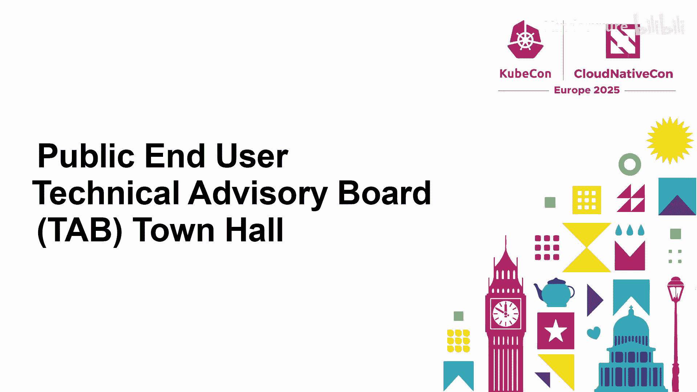
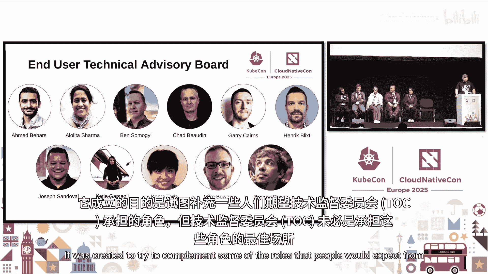
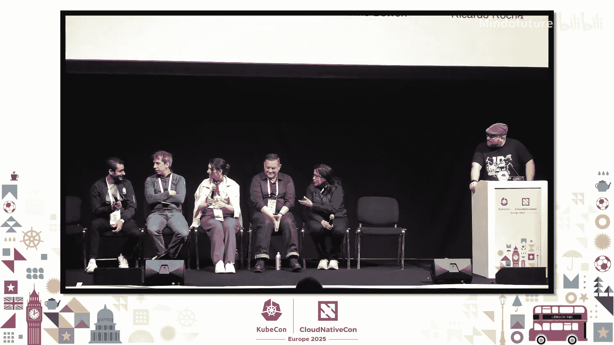

# 037：终端用户技术咨询委员会（TAB）介绍 🏛️

在本节课中，我们将学习云原生计算基金会（CNCF）中的一个重要治理机构——终端用户技术咨询委员会（TAB）。我们将了解TAB的成立目的、主要职责、当前的工作重点以及如何参与其中。

## TAB的定位与职责 🤝

上一节我们介绍了课程主题，本节中我们来看看TAB在CNCF中的定位。

终端用户技术咨询委员会（TAB）是CNCF的三大治理机构之一，与理事会（Governing Board）和技术监督委员会（Technical Oversight Committee, TOC）并列。

TAB成立于大约一年前，旨在补充TOC的某些职能，特别是那些需要大量终端用户视角的工作。其核心目标是：

*   为生态系统带来更多以终端用户为中心的视角。
*   改善项目与终端用户之间的互动。
*   处理需要终端用户深度参与的事务，例如参考架构的制定。

## TAB成员介绍 👥

以下是参与本次讨论的TAB成员及其背景：

*   **Alolita Sharma**：任职于Apple，负责可观测性工程。同时是CNCF中OpenTelemetry项目的维护者，并积极参与Cortex项目。
*   **Joseph Sambal**：任职于Adobe。同时是Kubernetes发布特别兴趣小组（SIG Release）的成员，并担任KubeCon联席主席。
*   **Katie Gamanji**：任职于Apple，担任软件工程师。同时是技术监督委员会（TOC）和TAB的成员。
*   **Ricardo Rocha**：任职于欧洲核子研究中心（CERN），领导平台基础设施团队。同时是TOC和TAB的成员，并曾担任TAB主席。
*   **Ahmed Becis**：任职于纽约时报，担任首席工程师。是TAB的新成员，代表终端用户和纽约时报的利益。

## TAB的核心工作与价值 💡

TAB的工作主要围绕两个层面展开，旨在为云原生生态系统创造价值。

### 层面一：促进终端用户与项目的反馈循环

TAB充当终端用户社区与CNCF项目之间的桥梁。

*   **收集反馈**：汇集终端用户社区对于所消费技术的反馈，衡量项目的成功与否。
*   **传递洞见**：将关于技术在生产环境中部署的担忧、有效与无效的经验反馈给项目和TOC。
*   **影响路线图**：与社区合作，共同影响项目的路线图，确保技术发展符合终端用户的实际需求。

### 层面二：赋能终端用户并打破孤岛

TAB致力于帮助不同规模公司的终端用户找到参与生态系统的途径并产生影响力。

*   **寻找切入点**：帮助终端用户无论公司规模大小，都能找到参与和驱动影响的入口。
*   **促进协作**：打破公司间的壁垒，让面临相似问题的团队能够集体发声，共同推动改进。
*   **建立沟通渠道**：在终端用户与CNCF、TOC之间建立清晰的沟通线路，共享行业实践中获得的反馈。

## 当前的重点倡议与挑战 🎯

TAB目前正在推进多项关键倡议，以应对终端用户面临的挑战。

### 重点倡议一：参考架构

这是去年最成功的倡议领域。参考架构的信息应由终端用户提供，而非项目或其他机构。目标是展示项目如何组合以解决特定问题，形成可复用的模式。

### 重点倡议二：项目健康度

CNCF项目有成熟度等级，但目前缺乏机制来持续评估已定级项目是否仍满足当初升级时的期望。终端用户可以在此领域发挥重要影响。

### 重点倡议三：终端用户景观图

云原生生态庞大且复杂，难以导航。TAB计划提供工具，帮助终端用户根据自身内部指标（不仅仅是成熟度）创建定制化的技术选型景观图。

### 重点倡议四：使用情况洞察

了解其他终端用户在生态系统中使用什么技术至关重要。像“雷达”这样的报告提供了项目使用范围和方式的额外视角，是TAB关注的重点。

## 互动问答环节精选 ❓

在公开讨论中，与会者提出了两个关键问题。

### 问题一：如何保证建议的中立与公平？

当多个项目解决相似问题时，TAB如何确保反馈和建议是中立、公平的？

**解答要点**：
1.  **标准化反馈**：致力于以更标准化的方式向项目提供反馈，供特定领域的所有项目审查。
2.  **项目路线图对齐**：反馈的采纳需与项目自身的技术路线图和发展愿景对齐。
3.  **上下文至关重要**：终端用户的决策总是基于特定用例和上下文（例如，选择存储方案是出于高吞吐量还是高可靠性需求）。参考架构将体现这种上下文。
4.  **建立公共待办清单**：TAB的目标是将终端用户的建议转化为跨项目可见的公共待办事项，以促进协同。

### 问题二：如何标注参考架构的适用前提？

参考架构公开后，如何告知使用者其所需的前提知识、技能或资源，避免“Hello World”示例无法满足实际需求的问题？

**解答要点**：
1.  **非蓝图，而是模式**：参考架构更像一个展示“如何构建”的起点或模式，而非可直接套用的蓝图。使用者需要根据自身情况调整。
2.  **扩展为成熟度模型**：可以考虑在参考架构中引入多维度成熟度模型，涵盖技术、专业知识、理解复杂度、生态依赖等因素。
3.  **提供入门指南**：探索提供“入门指南”或“实施建议”的可能性，帮助用户评估适配度。

## 如何参与TAB工作 🤝

对于希望参与TAB工作的人，有以下途径：

1.  **访问GitHub仓库**：这是主要的入口点，包含联系方式、会议时间等信息。TAB将很快开始举行公开会议。
2.  **加入现有终端用户组**：CNCF内有多个按领域划分的终端用户小组，它们定期举行会议，是很好的参与起点。
3.  **参与倡议**：即使不申请成为TAB正式成员，也可以对特定的交付物（如白皮书）做出贡献、参与评审或协作。
4.  **时间投入**：作为TAB成员，每周大约需要投入5-10小时，包括每周例会（计划在不同时区举行以方便参与）和线下工作组工作。TAB正借鉴TOC的经验，通过自动化、明确交付物和建立类似技术咨询小组的结构，来扩大社区参与规模。

## 总结 📚

本节课中我们一起学习了CNCF终端用户技术咨询委员会（TAB）。我们了解到TAB是一个代表终端用户利益、促进项目与用户间反馈循环的关键治理机构。它的工作重点包括制定参考架构、评估项目健康度、赋能终端用户决策。TAB通过标准化反馈、提供上下文和建立公共沟通渠道来确保工作的有效性。对于任何希望影响云原生技术发展方向的终端用户从业者，通过GitHub仓库或终端用户小组参与TAB的倡议，是一个直接而宝贵的途径。