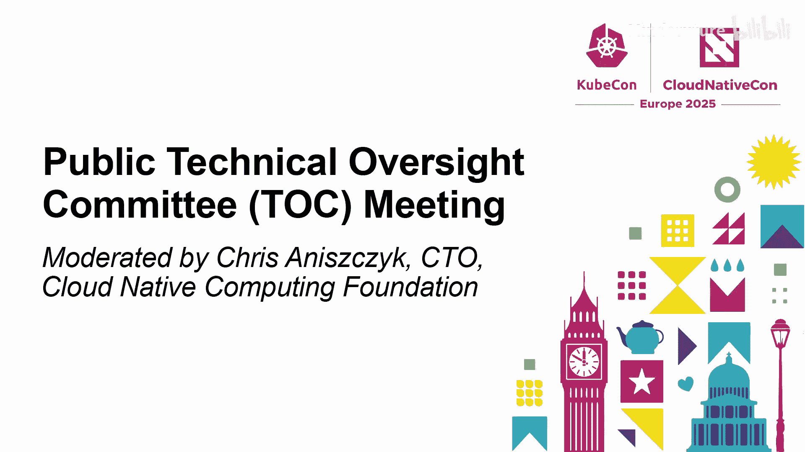
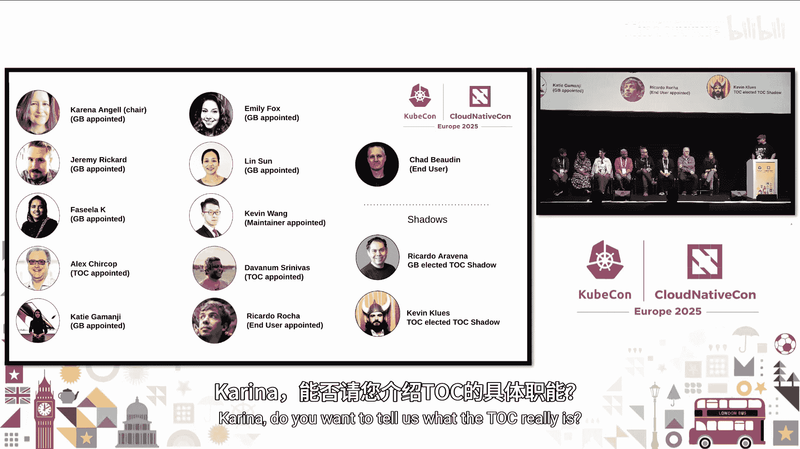

# 038：问答与展望

在本节课程中，我们将学习云原生计算基金会技术监督委员会的一次公开会议内容。我们将了解TOC的职责、当前面临的挑战、未来的工作重点，以及社区如何参与其中。

大家好，欢迎来到KubeCon的最后一天。感谢大家参加这次现场技术监督委员会会议。本次会议将采用“问我任何问题”或“专家问答”的形式。

对于不了解的观众，技术监督委员会是CNCF的三个最高管理机构之一。其主要职责是作为项目的管理者，并为CNCF设定技术愿景。

以下是我们的成员。大家可以做个简短的自我介绍。

大家好，我是Kariina Angel，现任TOC主席，在Red Hat工作。
大家好，我是Alex Curel，在Akaai工作。
大家好，我是Kevin Wan，参与多个项目，很高兴成为TOC的一员。
大家好，我是Jeremy Rickard，是Kubernetes发布团队的联合主席，在微软工作。
大家好，我的昵称是Dis，是Kubernetes社区的一员，在AWS工作。
大家好，我是Katie Amanji，在苹果工作，同时也是技术咨询小组的成员。
大家好，我是Fasilla，Istio社区成员，在Ericsson工作。
大家好，我是Ricardo，在CN工作，同时也是TOC和最终用户技术咨询委员会的成员。

我还想介绍一下我们新当选的TOC影子成员。TOC影子成员是本届任期的新事物，旨在协助TOC履行职责，或在需要时提供帮助，如果TOC成员需要卸任，影子成员也可以随时补上。

接下来，我们可以直接进入正题。Kariina，你能告诉大家TOC到底是什么吗？

TOC为生态系统内的所有项目提供技术监督。这包括许可证、商标、技术监督。我知道很多人都有项目经历过尽职调查或升级过程。TOC主要审查项目的技术细节，并确保最重要的是，这些项目对将要采用它们的最终用户是可行的，包括可持续性。包括确保发布过程透明。是的，所有好的方面。

那么，你认为未来几年TOC和项目面临的最大挑战是什么？其他人也可以补充。我知道我在看Ricardo和Katie。

从技术角度来看，我们今天在主题演讲中强调了生态系统内的一些主要差距。我再次提及它们，以防有人没机会参加主题演讲。主要有三个领域。我们出于特定原因对它们进行了分类。其中一个领域涉及多集群管理和可观测性。是的，这很有挑战性，尤其是在跨云提供商的情况下，可观测性在多集群环境中也很具挑战性。因此，我们希望将例如现有交付和可观测性领域的人员聚集在一起，以弥补这些差距。我们正努力通过识别这些差距以及重组技术咨询小组来促进跨领域协作。所以，我们有**多集群管理和可观测性**。另一个是**成本管理和可持续性**，因为我们确实需要关注成本支出，同时也需要考虑碳足迹，这些小组应该协同工作。最后，我们有**基础设施供应和密钥管理的工具**，这是多年来我们生态系统在完全开源工具方面的一个空白。我们肯定希望再次将来自不同小组的人员聚集起来，共同覆盖这个领域。

我认为另一个重点，随着CNCF进入第十个年头，以及去年Kubernetes的生日，正变得越来越重要。现在几乎有两个并行的重点：一是推动创新，填补Katie提到的那些空白，今天早上的主题演讲非常精彩；二是如何保持现有项目的健康运行，确保它们可持续、健康，并拥有适量的贡献者。当然，有时一个项目越成熟，对某些人来说可能就越不令人兴奋，因此我们必须随着发展保持这种势头。

我知道TOC本周进行了一些工作，为未来一年设定了愿景和方向。你愿意分享一些你们希望完成的事情以及发展方向吗？

我们做得不够好的一件事情是真正扩展社区中的技术专长。我们经历了很多人员流失和倦怠，疫情显然没有帮助。因此，我们现在正在进行技术咨询小组的重组，以帮助其扩展，并在项目申请进入CNCF或提升成熟度级别时提供更好的指导。

我们真正看到的一个问题是，孵化项目和毕业项目的申请仍然存在积压。这些项目希望达到更高的级别。我们看到的最大问题之一是它们尚未准备就绪。因此，一旦尽职调查开始，我们可能会发现他们在某些领域缺乏技术专长。如果他们能在这些领域获得指导，他们可能已经达到了可以升级到下一个级别的水平。这是我们明年将真正关注的事情，这项工作现在正在进行中。所以，在KubeCon之后，如果你有兴趣申请成为主席或技术负责人，请提名自己或你的同行。我们确实需要技术专长来帮助这些项目。

我还可以补充一点，我们提到的另一个新想法是除了子项目和技术咨询小组之外，设立“倡议”。这些倡议应该是**有时间限制的、具体的、可交付的成果**，并针对特定领域。本周对于讨论可能性和人们提出的想法非常有用。我们进行了非常好的对话，例如在冷恢复、灾难恢复方面非常先进的人们聚在一起，尝试标准化最佳实践。还有像汽车行业的Lego和其他公司，他们有非常具体的制造计划，并且在暴露PLC等设备方面面临挑战。这也可以成为一个倡议，让他们聚在一起，为部署制定最佳实践，以帮助其他有类似需求的最终用户。所以，如果你有想法，我们都在这里。请提出来并提议一个。它对任何人开放，欢迎大家来帮忙。

在Carina所说的基础上，在周一的维护者峰会上，我们举办了一个精彩的研讨会，涵盖了一些作为潜在倡议和项目的想法。我们还将专注于更好地整合TOC和最终用户技术咨询委员会，通过该系统获得更多反馈，并希望发展该社区。

我认为维护者峰会的研讨会非常酷，看到了人们带来的所有活力和对新倡议的思考。你能告诉我们一些关于研讨会的情况吗？

对于研讨会，我们做了什么……等等，谁参加了研讨会？谁参加了维护者峰会？谢谢。说实话，我更想听听一些观众成员在研讨会上的体验，如果有人想站起来分享的话。麦克风就在后面，如果人们想问问题的话。好的，太棒了。我们房间坐满了人，大约有11张桌子，每张桌子大约有8到10人，分成不同的领域，如开发者体验、操作弹性、测试、工作负载等。他们正在就哪些倡议可以促进互操作性等生成想法。我们听到了一些很棒的想法，比如测试网格。如果测试网格能从Kubernetes中独立出来，并用于帮助其他项目，那不是很棒吗？你们都在那里。你们最喜欢的倡议是什么？你们最喜欢哪些？

我和一群专注于安全的人一起工作。产生了几点想法。其中一点是关于围绕自我评估和联合评估实现更好的自动化，以保持其被审查、健康和最新。另一个倡议是关于如何更好地处理项目之间的依赖关系，例如用于漏洞管理的依赖关系，以及如何更根本地将SBOM集成到生态系统中。

我参与讨论的一个倡议是关于项目如何更好地处理下游供应商。很多维护者都遇到过这个问题：用户通过供应商使用项目，遇到问题后到上游社区提出问题，但结果发现由于不同供应商的环境可能差异很大，存在很多断点。这个想法是，实际上有些项目已经有了一致性测试程序。基本上，这个倡议讨论的是如何制定更实用的指南，或许还有一些工具，来帮助更多项目建立他们的一致性测试套件。以及项目在变得更加成熟时，如何通过这个过程拥有自己的一致性测试。

对我来说，个人感兴趣的是所有关于操作弹性的内容，因为这与我个人密切相关。我们桌子的工作方式是，一张桌子会讨论一个想法，然后传递给另一张桌子进行详细阐述。我们桌子得到的一个想法是，也许在现有的全景图上制作一个过滤器或类似的东西，更多地围绕角色来组织，这样会更容易导航和理解。我认为这很有趣。

我真正喜欢的是每个人都坚持到了最后。所有桌子都坐满了人，大家埋头交谈。看到这一点真的很棒。我和Kariina当时还在想，注意能量水平是否会下降，然后我们可以调整他们的工作内容，但我们从未感觉到能量水平在下降。所以，听到和看到房间里每个人的参与真的很好，我们真的希望他们能继续这项工作。

有一些人当时在想，我们真的必须把我们的想法交给别人吗？他们会怎么处理它？我们能自己完善它吗？所以我们不得不向他们保证，这是一个活的文档，他们可以继续在上面工作。所以，是的，总的来说，这对我来说真的很好。谢谢。

我想Katie需要麦克风。有一些技术问题。我只想附和Jim所说的，因为我们有很高的出席率，房间挤满了人，这绝对是出色的表现。技术咨询小组的重组可能是我们在TOC和全景图中所做的最大改变之一，涉及到我们全景图中不同微社区之间的互动方式。看到人们对此有如此大的兴趣，他们想讨论它，也许他们想应用这种新的倡议结构，这太棒了。这种热情是惊人的，我真的希望每个在房间里的人，以及今天在这里的每个人，都能与我们合作这些新倡议。也许我再次呼应这个信息：成为领导团队的一部分，成为技术咨询小组的主席或负责人。我们现在需要这样的人。我不确定倡议文档是否对公众开放，因为我们有一些相当有趣的倡议，但我想我们不会详细讨论它们，因为人们无论如何都会有机会接触到它们。所以，我只想呼应社区的热情。我认为那真的非常棒，在很多方面都很美好。

我想提到的关于我们桌子的另一件事是，当然那真的很好，同时也很多样化。在我们桌子上，我们有来自日本、欧洲以及美国和其他许多地方的人。所以出现的一个问题是关于时区问题，以及他们面临的语言问题。基本上，有些人担心他们无法参加某些会议，或者无法在会议上进行适当的沟通。这是一个问题，如果我们能在这方面做点什么，那会很好。

我没有太多要补充的。但也许在我桌子上，有很多想法。我认为最有趣的部分实际上是，人们不想把他们的想法传下去，但接收别人的想法是最有趣的。你可以看到不同的方法。第一轮有点天马行空。然后第二张桌子看着它，开始让它变得更有条理。所以，我想现在就看每个人如何审视它们，并真正使它们具体化。我认为我们有很多工作要做。

我只是想再次强调，因为你不能太频繁地重复行动号召。很高兴看到更多参与维护者峰会的社区成员，以及所有来听我们讲话的优秀人士，能够更积极地参与进来，提名自己、你的同事或社区中的其他人担任技术负责人和主席。我认为我们真的希望随着我们的成长，增加我们社区的活力。

我有一个问题，一个人如何做到这一点？如何参与进来？好的，所以如果你关注TOC的代码仓库，在KubeCon之后，我们会发布行动号召，同样也会在TOC邮件列表和TOC Slack频道中发布，就在CNCF Slack的#toc频道里。我们会把所有信息放在那里。倡议将被放入TOC代码仓库，所以你会看到它们出现在那里，然后我们会有一个项目看板，供有兴趣为某个倡议做出贡献的人使用。记住，你不需要成为技术咨询小组的一部分来帮助开展倡议工作，只要你有时间。我们真的希望将它们视为有时间限制的、较小的工作单元，这样你就可以在一年中有时间的时候参与进来。此外，我们将在亚特兰大举行另一次维护者峰会，届时我们将审查到那时为止已完成的工作。我知道我们还有另一个问题，请讲。

大家好，能成为维护者峰会的一部分真的很棒，这是我第一次参加。那种能量真的令人兴奋和鼓舞。所以，是的，我希望如果人群中有人没有参加过这类活动，他们会去尝试。我的问题是，我从环境可持续性技术咨询小组的角度出发，该小组正被合并到操作弹性技术咨询小组中。接下来的步骤将包括协作编写章程、目标和非目标，与将要并入这个新标签的其他技术咨询小组社区进行沟通。我知道我们正在为其他几个技术咨询小组做这件事。对于希望参与其中的人们，你们有什么临时的沟通渠道、目标或时间线可以与我们分享，并建议我们如何参与吗？

在KubeCon之后，我们将发布更多关于时间线的信息，因为我们现在正在重新整理代码仓库。我们将把它们全部集中到TOC代码仓库中，然后在那里提供说明等。所以请继续关注这些渠道，我们会发出号召。我们一直在与当前的几位领导层合作。所以，我们会联系每个当前的标签，以及任何其他社区成员。请继续关注这些渠道以获取更多信息。但不幸的是，这将在KubeCon之后，也就是今天之后。但请给我们几周时间来处理这些事情。谢谢你的问题。还有其他人有问题吗？实际上，这里有多少人经历过项目升级过程或参与过项目？至少有几个。那么，你认为项目升级时遇到的最大挑战是什么？Kevin，你想回答这个问题吗？

根据我的观察和经验，对于项目升级，尤其是在去年我们更新了很多关于模板清单的内容，以使项目团队更清楚地理解标准之后，我仍然看到一些项目首先，答案准备得不够充分。理想情况下，作为TOC或评审员，我们希望你对答案给出一些陈述，并提供参考链接，以证明你确实在实施你所说的内容，比如开放的社区治理、成熟的发布流程以及如何处理安全问题。除此之外，我们还增加了通用技术评审和领域特定技术评审，以帮助从技术角度评估项目的成熟度。所以，首先，我建议任何准备申请或正在申请过程中的人，至少再看一遍你的申请答案。

我想补充一点，谢谢Kevin。我想补充的另一件事是，我们看到项目可能没有优先考虑安全性，没有考虑他们的安全卫生状况、他们的计划。我们将审查当前流程中提出的要求，并进行去重。我知道现在在安全评估和安全审计之间有很多要求，我们将看看哪些适合移到审计中。但我确实看到安全技术咨询小组的成员在这里，他们一直非常宝贵，谢谢。我想帮助减轻他们的负担。

我想补充一点，所以项目也应该优先考虑安全性。我想提一下，除此之外，因为现在我们的队列实际上更短了，所以我们对项目的响应时间和参与度更快了。但有时会发生的情况是，维护者在为孵化或毕业打开PR后没有回应，这很关键，因为尽职调查过程是TOC和项目维护者之间的协作，保持沟通渠道畅通至关重要。所以，如果你打开一个问题或为孵化或毕业打开一个PR，请保持回应。这是我们试图帮助你达到下一个水平的事情，我们需要那种回应。我只是想强调这一点，因为我知道每个人都很忙，事情随时可能变得非常混乱，但这种沟通渠道非常重要。所以，请注意这一点。

通常发生的另一件事是，人们有截止日期。他们希望项目在KubeCon北美或KubeCon欧洲之前发布，或者像一些内部截止日期。所以我们试图做事，但这需要一些时间，而且我们管道中有项目，所以请注意这一点。另一件我们通常最终要做的事情是，我们写下了很多材料，有很多清单之类的东西，但有时我们真的必须坐下来与项目沟通，确切地解释为什么我们要问他们那些问题，或者为什么我们要他们做那些改变。简单的例子可能围绕着你如何看待社区与你的公司和产品，以及你在哪里划清界限。所以我们真的必须和他们进行坦诚的交谈。然后他们意识到，好吧，我们在治理中缺少这个，我们在这里缺少那个，也许这反映在我们如何进行CI/CD工件或我们如何为某些事情提供支持上。这是一个反复出现的事情，一次又一次地发生，我们不得不与来自不同项目的成员坐下来，确保他们理解我们要求他们做的事情的原因。

Ricardo，你是任职时间最长的TOC成员之一，很高兴听到……我们还有大约三分钟时间，我不想……是的，我们有问题，所以让我们快速回答一些问题。我想知道TOC是否有任何成功指标来衡量他们做得如何，比如每季度一次，你们如何报告？谢谢。谁想回答这个问题？通常是项目通过流程的速度。是的，我认为可能有两部分。一是我们帮助项目的速度，这通过升级的速率显示出来。还有一些我们最近才开始关注的指标。我认为Bob正在制作它们，即项目在申请变更级别之前，实际上在同一级别停留了多长时间。这个也很有趣，因为它们是相互关联的，但有时项目也需要一些帮助来推动他们。我认为这也是今年将更详细探讨的一个非常有趣的指标。

也许不一定是一个成功指标，而是一个成功迹象是，我们有时间改进我们的流程，而不仅仅是进行尽职调查。因为以前，TOC的大部分时间都集中在审查沙箱纳入申请、进行孵化和毕业尽职调查上，这就是我们能做的全部，那是我们的全职工作。因为我们一直非常专注于简化流程，因为我们试图尽可能清晰，我们试图自动化很多工作。甚至所有这些前瞻性的工作，比如倡议、工作负载、技术咨询小组重组等等，以及重塑和思考未来会发生什么。我认为这是我们扩展工作量的一个非常好的迹象，也许这也是一个成功的指标，可能无法用数字量化，但在我们与生态系统互动的整体动态中，绝对是。

我们时间快到了，你的问题是什么？我们看看能否回答。问题相对简短。当一个项目在完成任务或升级方面遇到困难，你们必须进行额外的协作和对话时，有时是否会出现结果未定义的问题？比如解释了原因和需要做什么，但没有明确期望的结果，而这最终成为问题没有解决的原因？

我们有很多例子。所有组合都存在，所以我们确实必须告诉他们我们在寻找什么，为什么寻找，以及我们通常如何……我们通常也会告诉他们，这里有一组我们希望你们思考的事情，看看你们需要在不同领域如何应用这些。而且我们也想看到它在实践中如何运作，比如不要只是更改README或治理文档，然后就说你完成了。我们想看到它在未来三个月或六个月内是如何实施的。然后有了证据，我们就能继续对话。

这又回到了上一个关于关键绩效指标的问题，很难量化。哦，我们现在超时一分钟了。所以，请之后继续交流，我会的，谢谢。

好的，谢谢大家来到这里，也谢谢所有提问的人，谢谢。