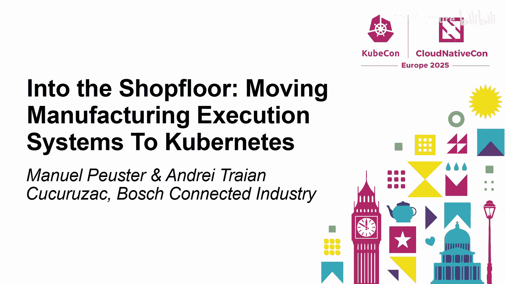
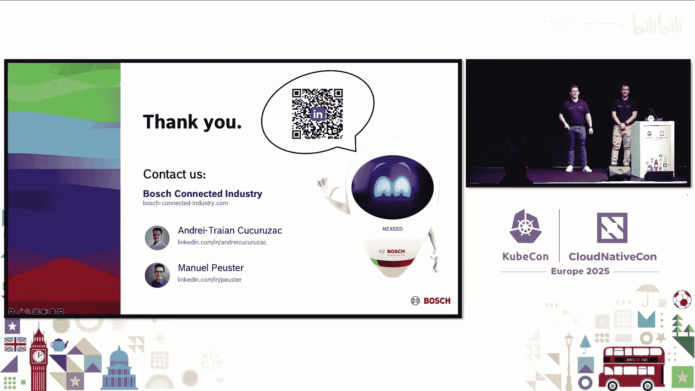
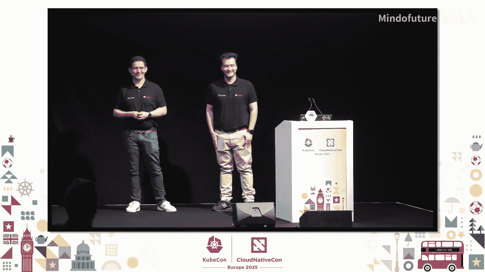

# 039：深入车间 - 将制造执行系统迁移至Kubernetes

## 概述
在本教程中，我们将跟随博世公司的工程师Manuel Peuster和Andre，学习他们如何将复杂的制造执行系统从传统的虚拟机环境迁移到Kubernetes平台。我们将了解MES系统的基本概念、迁移过程中面临的挑战，以及他们如何通过创新的技术方案（如库Helm图表）来解决这些问题，最终实现部署时间从数小时缩短到数分钟的巨大飞跃。

---

## 什么是制造执行系统？

上一节我们概述了课程内容，本节中我们来看看制造执行系统的核心定义。

制造执行系统是一种软件，用于实时监控、管理和优化车间生产。它充当企业系统与车间操作之间的桥梁。

为了更直观地理解，我们可以将工厂想象成一个人类身体：
*   **计算与存储能力**：这是**大脑**，处理决策，MES依赖于此来管理关键信息。
*   **外部系统**：这像**循环系统**，负责分发生产订单或库存数据等关键信息。
*   **消息代理**：这像**神经系统**，确保整个工厂的通信。
*   **工业协议与传感器**：这像**感官**，从机器收集温度、速度、压力等实时输入。
*   **车间设备**：这像**肌肉**，根据MES的指令执行生产任务。

---

## 传统MES面临的挑战

了解了MES的基本构成后，我们来看看它在传统部署方式下面临哪些问题。

传统MES系统虽然多年来成功支持了制造运营，但其架构和部署方式存在固有缺陷。

以下是传统MES的主要痛点：
1.  **高度个性化配置**：每个工厂甚至每条生产线都有不同的配置，难以标准化、复制、扩展和升级。
2.  **手动配置**：配置在两个层面进行：
    *   **运维层面**：由运维人员设置数据库、网络策略、用户权限等。
    *   **业务逻辑层面**：由应用工程师创建产品配方和路由规则。
3.  **缓慢的部署流程**：部署通常在单独订购的Windows虚拟机上完成，过程缓慢且资源密集。
4.  **高风险与高成本**：部署时间长，手动更改增加了配置错误的风险，可能导致系统故障。MES停机意味着生产停止、工人闲置，导致材料浪费、错过交付期限和巨额收入损失。

---

## 云原生转型之路

面对传统MES的挑战，博世团队决定拥抱云原生转型。他们采取了经典的“提升和转移”方法。

在第一阶段，团队将所有MES模块容器化。每个模块变成一组容器，30个不同的模块演变为200多个微服务。这些微服务被部署在Linux机器上。此阶段没有根本性的架构改变，只是现有应用的容器化版本，侧重于可移植性而非重设计。

当时有两种部署方法：
*   **本地环境**：使用Docker Compose打包微服务，通过Ansible部署。
*   **云环境**：使用Ansible渲染Kubernetes清单并部署到云。

无论哪种环境，最终都面临顺序部署、更新缓慢的问题，一次更新通常需要6到10小时。

---

## 现代架构与未来展望

经过多年发展，当前的架构已经演进。如今，云环境和本地环境使用相同的部署结构。

团队从使用Ansible的顺序部署，转变为在云场景的多集群节点或本地场景的单节点上，同时进行微服务的流水线部署。

此外，团队展望未来，正在构建一个“本地云”——博世制造与物流平台。可以将其视为一个“工厂应用商店”。在这个平台上，每个工厂的微服务都运行在多节点集群中，一切都被集中管理，并使用Argo自动应用变更。

---

## 迁移过程中的挑战与解决方案

现在我们已经了解了系统的演进历程，本节将深入探讨在使其更加云原生并迁移上云的过程中，团队遇到的具体挑战和学到的经验教训。

一旦开始“提升和转移”并将所有模块打包成不同的微服务，团队立即面临三个维度的复杂性：

1.  **制造环境的特异性**：大多数工厂甚至单条生产线都使用个性化配置，这与微服务世界中通常部署相同副本的模式不同。支持所有这些配置和部署参数并减少人为错误是一大挑战。
2.  **技术复杂性**：将所有现有软件组件打包并放到Kubernetes上。团队当时已具备一定的Kubernetes知识，所以这部分相对容易。添加缺失组件并部署后，一切运行正常。
3.  **人员与组织复杂性**：软件解决方案由30多个不同模块组成，每个模块又包含许多微服务。每个模块由独立的开发团队构建，而这些团队对Kubernetes的知识分布非常不均衡。有些团队完全没有Kubernetes知识。

这引出了一个核心问题：作为DevOps平台团队，如何确保构建的系统能够轻松部署和运维，同时不给开发团队带来过多负担或拖慢他们的日常工作？

---

### 解决方案：库Helm图表

团队早期做出的一个关键决策是：将所有模块打包为独立的Helm图表。但如何实现呢？

以下是几种可能的方法：
*   **方法A：分散式**：让每个开发团队创建自己的Helm图表。**优点**：团队灵活性高。**缺点**：难以强制执行标准；由于团队知识分布不均，结果可能不符合预期。
*   **方法B：集中式**：让一个中心团队负责为所有模块创建Helm图表。**优点**：能够强制执行质量标准；人员专业。**缺点**：会在组织中造成巨大的瓶颈，中心团队将成为所有其他团队的依赖，拖慢发布周期。
*   **方法C：库图表式（团队选择）**：编写一个**库Helm图表**，并授权所有开发团队使用该库图表。图表的设计使得各个模块Helm图表渲染的所有内容都通过该库图表进行。通过这种方式，团队可以严格控制开发人员能够做什么以及能够向集群渲染什么。这种方法被证明非常有效。

---

### 发布管理与职责分离

采用库图表方法后，需要解决发布和职责问题。

团队有一个特殊要求：尽管技术上可以部署单个服务，但为了外部客户，仍然需要将所有内容捆绑成一个版本。这通过创建一个**伞形Helm图表**作为最终发布工件来实现，满足了该要求。

在职责方面：
*   **模块Helm图表**由模块团队拥有。
*   **库图表、伞形图表和一些支持组件**由专门的**库团队**（或称DevOps团队、平台团队）拥有。

团队之间紧密协作，进行知识交流，这种设置运行良好。

---

### 库图表作为一等公民

如果采用库Helm图表方法，一个重要经验是：必须将库Helm图表视为**一等公民**。它不仅仅是部署代码，而是部署整个系统的核心，其变更会影响许多团队。

因此，需要为其采用完整的软件开发生命周期：制定路线图、进行需求管理、维护待办事项列表。团队还允许每个开发团队通过拉取请求为库图表做出贡献，以加速新功能的添加。

---

### 技术实现细节

在技术层面，每个模块团队都必须使用库Helm图表。当开发团队为其模块创建Helm图表时，他们只需在图表中放置一个模板。该模板通常只包含一行代码：调用库Helm图表渲染函数的代码。这是进入库图表的单一入口点。

一个特别之处是：开发人员需要将他们想要表达的所有其他内容直接放入`values.yaml`文件中。这看起来不常见，但带来了很多好处：
*   团队定义了一个**自定义的、固化的数据结构**，模块团队必须遵守。
*   这种结构有助于从大多数开发团队中抽象出许多细节（例如，入口定义无需显式表达，默认即可构建）。
*   它允许开发团队使用普通Helm图表的所有功能，只是他们不必手动编写。

---

### 模式验证与关注点分离

将所有内容放入`values.yaml`的另一个巨大好处是便于**模式验证**。验证在两个层面进行：
1.  **模块层面**：模块团队被要求在自身的模块Helm图表中放置模式文件，用于输入参数验证。
2.  **全局层面**：由库图表团队维护全局模式，用于进行结构检查，确保模块团队定义的总体数据结构正确且符合当前库图表版本。

在数据模型本身，团队也实现了关注点分离：
*   **全局级别**：通常由操作员（如库团队）填写，包含数据库服务器连接详情、端口信息等。
*   **模块级别**：团队仅需声明其模块需要何种数据库（如MS SQL或Oracle），以及所需的额外要求（如数据库角色）。

然后利用Helm模板将这两部分信息混合匹配，渲染出最终的部署配置。

---

### 高级技巧：跨模块共享配置与模板化

有时，模块团队需要确保不同模块间的某些参数设置相同，即需要在子图表间共享配置信息。Helm本身不直接支持此功能，但可以通过一个小技巧实现：利用Helm模板中的全局字典，将数据从子图表A导入到全局字典，即可使其对部署中的所有其他子图表可用。

关于模板化，团队仍然允许模块团队在`values.yaml`中进行简单的字符串格式化或模板功能。这是通过在渲染环境变量时，在适当的地方添加`{{ tpl .Values.someString . }}`函数调用实现的。这样，库团队可以控制团队在何处被允许进行模板化，有助于确保整体质量。

---

### 超越Helm：自定义操作符

Helm渲染和部署并不能解决所有问题。团队还构建了自定义操作符，主要分为两类：
1.  **基础设施操作符**：管理数据库、创建模式等，处理所有类型的基础设施事务。
2.  **应用集成操作符**：与自定义构建的身份和访问管理解决方案集成，确保不同模块在启动时正确注册、拥有访问其他模块的权限、交换密钥等。所有这些都通过操作符实现自动化，无需人工干预。

---

## 经验总结与展望

在本节中，我们将总结迁移过程中的关键经验教训，并展望未来的改进方向。

**经验教训：**
1.  **单元测试至关重要**：当库Helm图表拥有成千上万行模板代码并被所有人使用时，每个补丁都会影响所有人。`helm-unittest`插件非常有用。
2.  **注意Helm状态存储**：当将所有内容捆绑成一个Helm图表（即一个Helm发布）时，需要注意Helm状态的大小。单个系统实例可能包含约15,000个不同的Kubernetes资源，很容易达到1MB的边界，可能需要切换Helm后端。
3.  **拥抱开源改进**：开源社区的改进带来了巨大帮助。例如，Helm 3.14版本大幅提升了模板渲染性能，对于大量使用模板的团队，渲染时间从超过100秒降至10秒以内，节省了大量时间。

**总结：**
迁移到Kubernetes和采用Helm对团队来说是一个正确的决定。总体部署时间从数小时或数天缩短到数分钟。现在，团队可以在几分钟内部署一个制造系统，并且它能正常工作。

---

## 问答环节精要

在演讲的最后，讲者与听众进行了一些有价值的问答交流。

**问：如何处理那些遗留的、没有明确所有权且并非所有站点都有的组件？**
**答：** 对于无法直接“提升和转移”的遗留系统，有时可能不得不让它们继续留在Windows虚拟机中。未来，随着诸如Istio支持Windows等技术的发展，或许能更容易地将这些系统连接到Kubernetes集群，但彻底解决通常需要更换解决方案或完全重写。

**问：如何让为持久状态和固定运行环境设计的工业控制系统适应Kubernetes的无状态、临时性范例？**
**答：** 作为软件提供商，团队不仅在“提升和转移”，也在适时对软件进行重写以使其更加云原生。这仍然是一个挑战。一个有效的方法是**定期进行DevOps交流**，让具有云知识的工程师加入不同的开发团队，帮助他们解决在Helm图表、重试机制、状态处理等方面遇到的问题。通过知识传递，情况会逐渐改善。

**问：是否考虑过使用Kubernetes边缘项目来连接仍使用旧协议的遗留系统？**
**答：** 团队了解Kubernetes边缘项目，但目前对于需要保留在虚拟机上的混合工作负载，通常让虚拟机留在原地，通过本地集群与其余软件建立直接连接，而不是将虚拟机本身纳入Kubernetes集群。

**问：迁移到公有云的MES功能比例是多少？如何保证连接的可靠性和低延迟？**
**答：** 博世自身的工厂完全运行在内部的本地云上。公有云（如Azure）上的产品主要面向外部客户，提供的是**非延迟敏感型模块**的功能（如车间管理），而非直接控制生产线的部分。因此，博世工厂本身并不通过公有云控制。

---

## 总结
在本教程中，我们一起学习了博世公司将传统制造执行系统迁移到Kubernetes的完整历程。我们从了解MES的核心概念和传统挑战开始，逐步探索了“提升和转移”的初步尝试、现代云原生架构的演进，并深入分析了迁移过程中在技术、配置管理和组织协作方面遇到的具体挑战。关键解决方案——如采用库Helm图表实现标准化和管控、通过模式验证和关注点分离确保质量、利用自定义操作符实现自动化——为我们提供了宝贵的实践洞察。最终，这次转型成功地将系统部署时间从数小时缩短至数分钟，显著提升了制造业的敏捷性和效率。