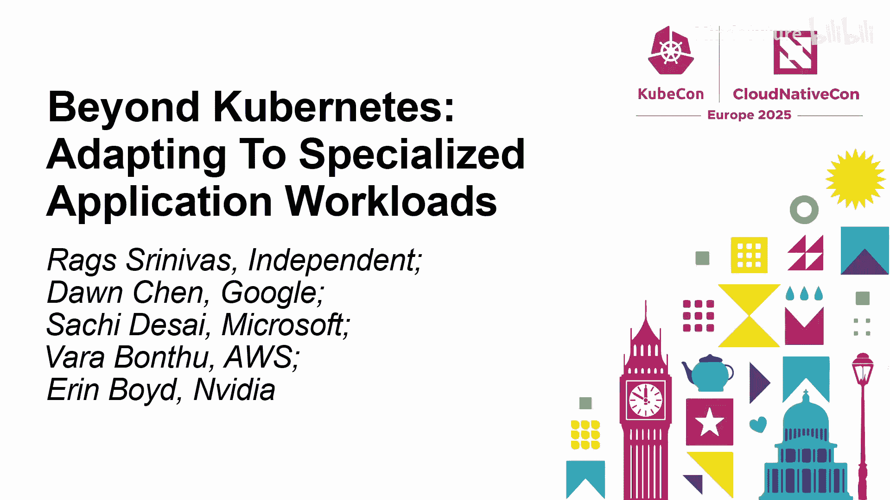
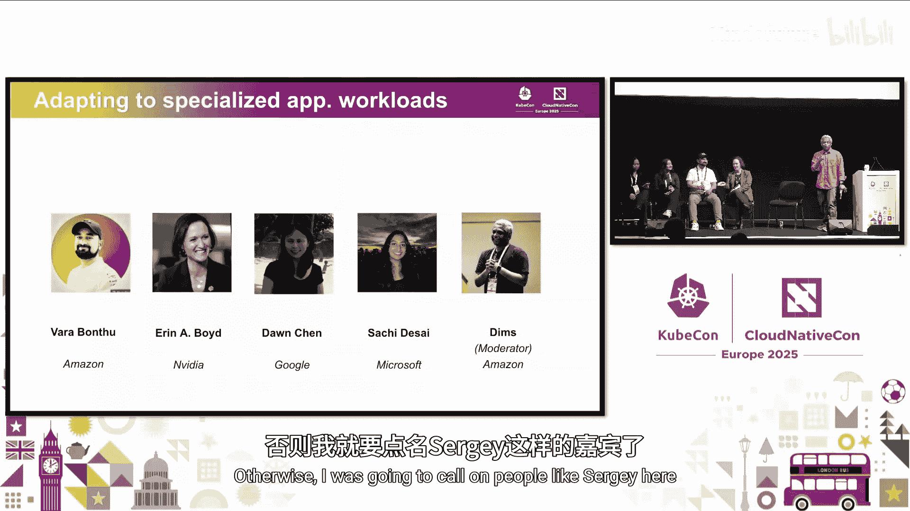
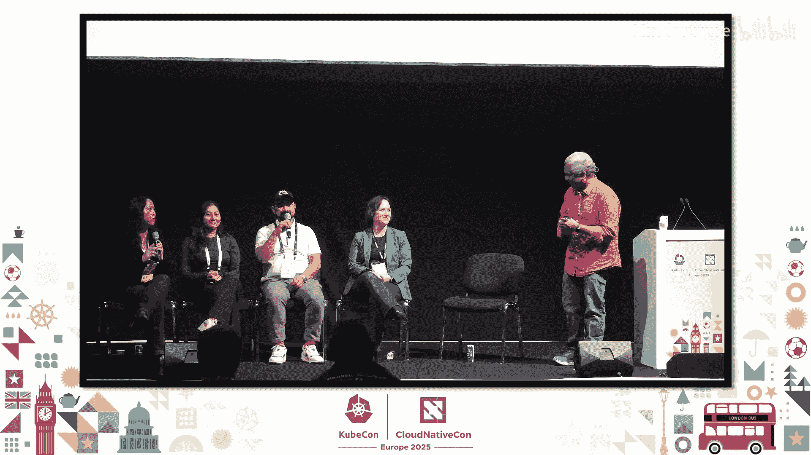

# 040：超越Kubernetes - 适应专业应用工作负载

## 概述

在本节课中，我们将探讨Kubernetes如何适应并支持日益增长的专业化应用工作负载，特别是人工智能和机器学习工作负载。我们将了解来自谷歌、微软、亚马逊和英伟达的专家们如何看待当前的技术现状、面临的挑战以及未来的发展方向。

---

## 章节 1：专家介绍与行业现状

大家好。我们今天在这里讨论如何让Kubernetes适应专业化的应用工作负载。

以下是我们的专家组成员。

**Dan Chen**：我是谷歌的软件工程师，也是Kubernetes自创立以来的技术负责人。目前我领导着SIG Node社区，并致力于推动Kubernetes支持AI/ML和HPC等专业化工作负载。

**Sachi Desai**：大家好，我是Sachi Desai，是Azure Kubernetes服务团队的产品经理，专注于将AI和GPU HPC部署到AKS和整个Kubernetes生态。我也参与了CNCF沙箱项目Kubernetes AI工具链算子。

**Vara Btu**：大家好，我是Vara Btu，AWS的首席开源专家。我的主要关注领域是在Kubernetes上扩展数据和ML工作负载，特别是在Amazon EKS上。我擅长使用Spark、Flink和Trino等数据框架在Kubernetes上构建数据管道和ML平台。

**Aaron Boyd**：我是英伟达的高级总监和杰出工程师。非常高兴来到这里。看到这么多人在周五参加这个会议，我感到非常激动。

现场调查显示，已经有不少听众在生产环境中运行AI工作负载，并且有更多人计划在未来几个月内部署。

---

## 章节 2：各云厂商的客户现状

上一节我们介绍了专家组成员，本节中我们来看看各大云厂商所观察到的客户现状。

**英伟达**：英伟达服务的客户群体非常广泛和多样化。我们既有进行前沿AI/ML研究的内部客户，也有大量外部客户。工作负载涵盖从托管DeepSeek等模型，到使用NIMs和蓝图创建、增强模型或进行微调和训练的各个方面。我们正看到Kubernetes与AI，以及HPC与Kubernetes的交叉融合，这正在迅速改变技术格局。

**AWS**：在AWS，许多客户都在Kubernetes上运行其AML工作负载。这些客户遍布各个垂直行业，如汽车、金融、供应链等。亚马逊零售自身构建AI的实践为许多客户提供了范例。他们利用Kubernetes和Amazon EKS中的开源解决方案，构建具有自定义调度、自动扩缩、推理和训练等功能的AML平台。

**Azure**：在Azure，我们看到用户处于AI旅程的不同阶段。有些用户刚开始尝试不同模型并进行基准测试；有些用户在进行模型服务和推理工作负载；更高级的用户则出于安全、数据治理等原因，希望从头开始训练自己的模型。我们的目标是支持他们旅程中的每一个阶段。

**谷歌**：谷歌的情况有些特殊。我们既有混合工作负载，也有处于不同阶段的客户。从训练、数据处理准备到推理服务。谷歌的独特之处在于，我们自己也生产硬件，因此客户来到谷歌不仅可以使用GPU，还可以出于成本效率等原因选择TPU。同时，谷歌自身也在构建模型，许多客户会就此寻求合作。这为我们提供了独特的视角，让我们思考如何构建标准的硬件和统一的框架来支持不同类型的客户需求。

---

## 章节 3：Kubernetes的演进与挑战

了解了行业现状后，本节我们深入探讨Kubernetes社区为支持这些工作负载所做的演进以及面临的挑战。

Kubernetes正在不断演进以适应AML工作负载。去年在巴黎和盐湖城的会议上，许多即将到来的新功能让大家感到兴奋。

**硬件标准化**：谷歌的特殊性让我们意识到标准化硬件以支持AI/ML工作负载的重要性。**设备插件框架** 正在尝试标准化并为Kubernetes构建抽象表示，以便Kubernetes能够管理和调度这类工作负载。DRA在这方面取得了很大进展，已接近生产就绪状态，但仍需解决监控、迁移等诸多问题。

**支持批处理工作负载**：除了硬件，还有更高层次的对象需求。Kubernetes最初是为Web服务设计的，后来演进到支持有状态应用，但在支持批处理工作负载，尤其是复杂的、有依赖关系的批处理工作负载方面做得并不好。因此，社区构建了许多项目来填补这些空白。

以下是社区为解决这些问题而构建的关键项目/概念：
*   **自定义调度器**：如Volcano、Kube-batch，用于处理队列和文件共享等任务。
*   **调度框架与插件**：如组调度、拓扑感知调度等KEP，用于优化AI工作负载的调度。
*   **工作流原语缺失**：Kubernetes目前缺乏定义对象来原生支持具有依赖关系的复杂批处理工作流。
*   **故障快速检测与恢复**：如何快速检测GPU等硬件问题，并进行智能的故障切换和修复，是模型训练任务面临的新挑战。

社区面临的一个关键问题是，随着各种自定义调度器的出现，可能会造成Kubernetes生态的碎片化。虽然为不同行业定制是合理的，但这也可能降低平台的效率和弹性。因此，需要在标准化的基础上进行创新。

---

## 章节 4：集成与实践：云厂商的视角

上一节我们讨论了社区层面的演进，本节我们从云厂商和集成者的角度，看看如何将这些进展落地，以及客户面临的实际挑战。

**Kubernetes AI工具链算子的角色**：作为一个工具链算子，它旨在成为整个AI管道中的一个可组合工具。它关注如何与可观测性、GPU节点健康检查等其他工具集成，并在整体上进行优化。它验证新的调度器插件如何协同工作，并重点关注节点健康与可靠性，确保训练等长时间运行的任务在遇到GPU健康问题时能够安全迁移，从而降低成本。

**客户挑战与解决方案**：在AWS，我们通过Data on Kubernetes等项目展示如何在Kubernetes上运行大规模Spark或AML训练工作负载。运行这些工作负载本身是直接的，但需要考虑很多方面。

以下是运行大规模数据/AI工作负载时需要考虑的关键方面：
*   **工作负载打包与调度**：需要使用自定义调度器进行GPU/CPU优化和工作负载打包。
*   **容错与恢复**：分布式计算部件在出错时能否恢复。
*   **可扩展性挑战**：Kubernetes对无状态服务支持很好，但对于有状态的数据/AI工作负载，可扩展性因工作负载类型而异。批处理工作负载可能扩展到2000个节点，而AML工作负载可能到200-300个节点，且需要大量调优。
*   **不断演进的技术栈**：缓存技术、篮子调度器、GPU分时共享等技术正在不断涌现，但社区仍有许多工作要做。

**英伟达的开源与协作**：英伟达正在加大对开源的投入，并认识到与社区合作的重要性。例如，开源项目SkyPilot允许动态更新作业参数以获得更好性能；即将发布的NV Sentinel用于监控节点健康状态。英伟达的DGX Cloud团队也积极与各大云提供商合作，提供技术和硬件支持。

---

## 章节 5：未来展望与现场问答

在讨论了现状和挑战之后，本节我们展望未来，并分享专家组成员对社区和行业的期望。

专家组成员对英伟达及整个生态提出了以下期望与建议：

**对英伟达的期望**：
1.  **分布式训练数据缓存**：在跨多GPU的分布式训练中，从S3等源流式读取数据可能很慢。需要更好的数据分片、跨节点缓存解决方案，避免数据重复。
2.  **GPU问题快速检测**：需要更快的GPU硬件问题检测能力，减少人工验证模型正确性的时间。
3.  **GPU更好、更安全地共享**：GPU成本高昂，需要探索更多共享方式和安全隔离方案。
4.  **GPU热插拔**：实现GPU的动态插拔，可以彻底改变云中节点的使用方式。
5.  **监控工具标准化**：希望像NVIDIA DCGM Exporter这样的工具能得到更广泛的支持，并易于集成到Prometheus和Grafana等标准监控栈中。

**未来的发展方向**：
*   **标准化是关键**：需要在硬件、调度层、自动扩缩原语等方面推动标准化。避免生态碎片化，同时允许上层框架创新。
*   **统一的管理平面**：用户希望拥有一个“单一管理面板”，能够跨不同GPU厂商甚至各种加速器进行细粒度控制和监控。
*   **网络与性能**：未来需要关注RDMA over InfiniBand等分布式网络技术，并使其标准化，这对基于延迟的基准测试至关重要。
*   **愿景**：理想的未来是数据科学家可以使用熟悉的API提交作业，而部署层是通用和标准化的。Kubernetes作为核心层，与具体工作负载的细节管理解耦。

---

## 总结

本节课中，我们一起学习了Kubernetes在支持AI/ML等专业化工作负载方面的最新进展和挑战。我们了解到：
1.  各大云厂商的客户正处于AI旅程的不同阶段，需求多样。
2.  Kubernetes社区正通过DRA、调度框架插件等项目在硬件抽象和批处理支持方面积极演进。
3.  在实际集成中，工作负载打包、容错、可扩展性和监控是客户面临的主要挑战。
4.  未来发展的核心在于**标准化**，包括硬件接口、调度原语、监控工具和网络，以避免生态碎片化，同时为上层创新提供坚实基础。
5.  社区需要通力合作，共同解决GPU共享、故障快速恢复、数据缓存等具体问题，并倾听来自用户和开发者的反馈。

感谢使用Kubernetes，并尝试在其上运行AI工作负载。请继续提供反馈和您的用例，这将帮助Kubernetes项目持续改进。

