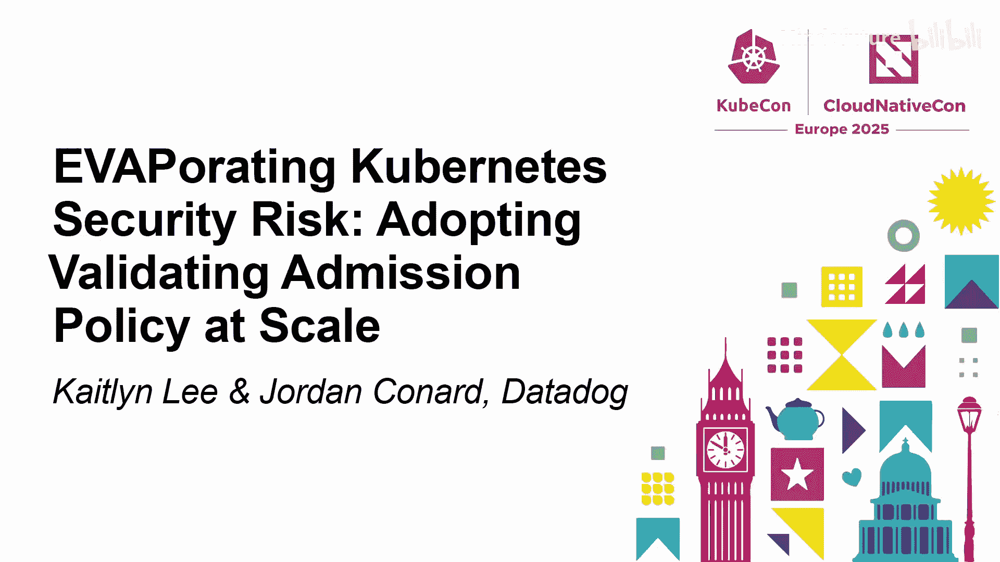
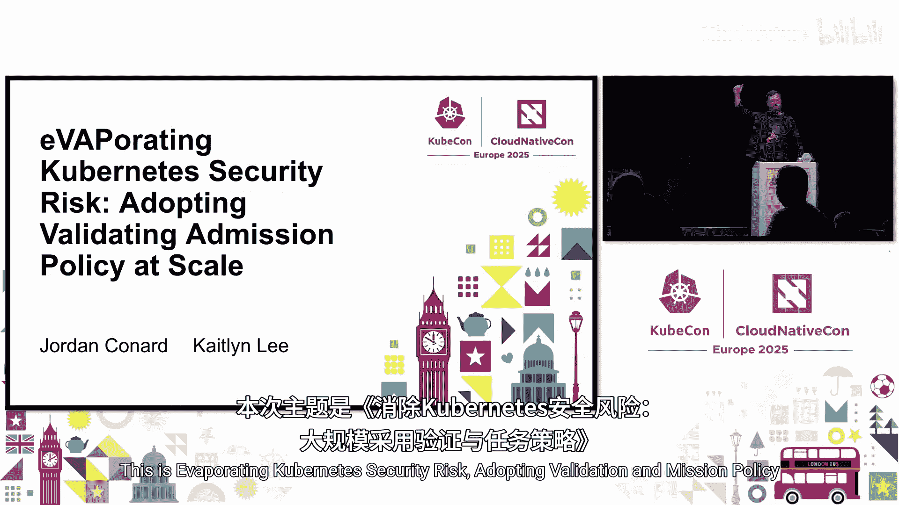
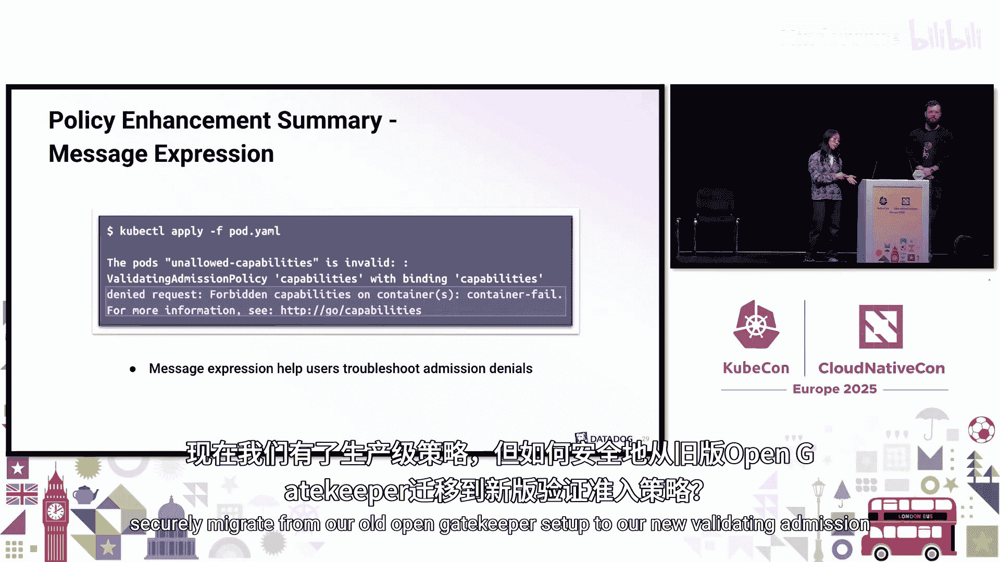
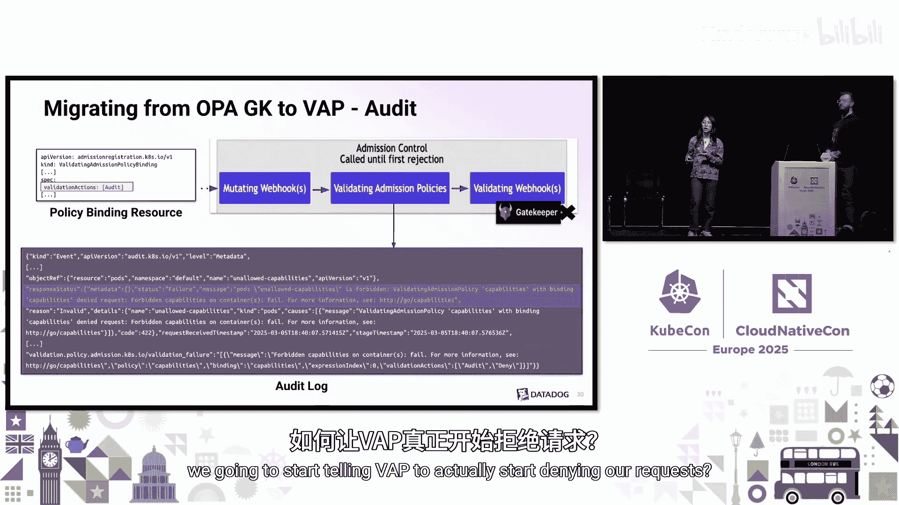
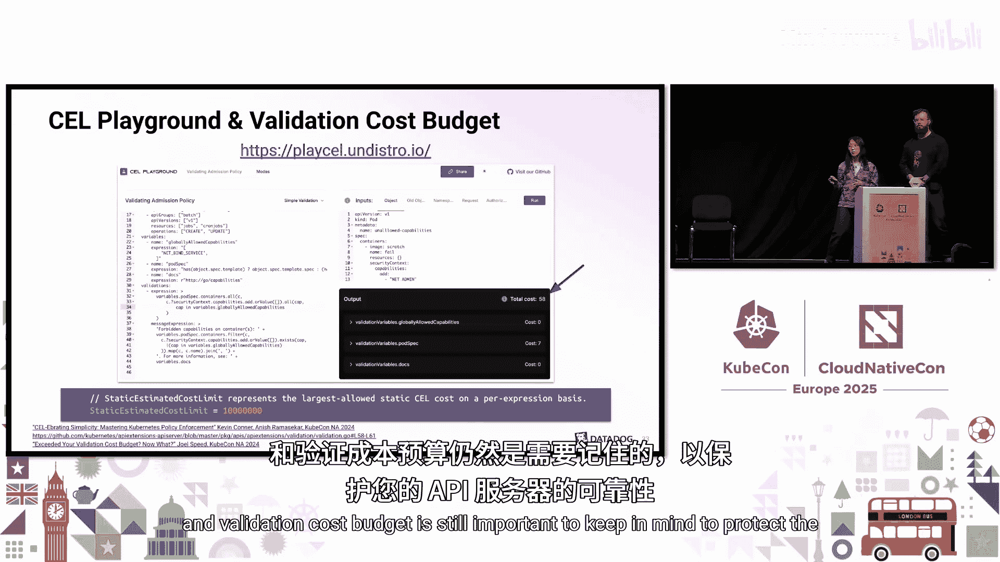
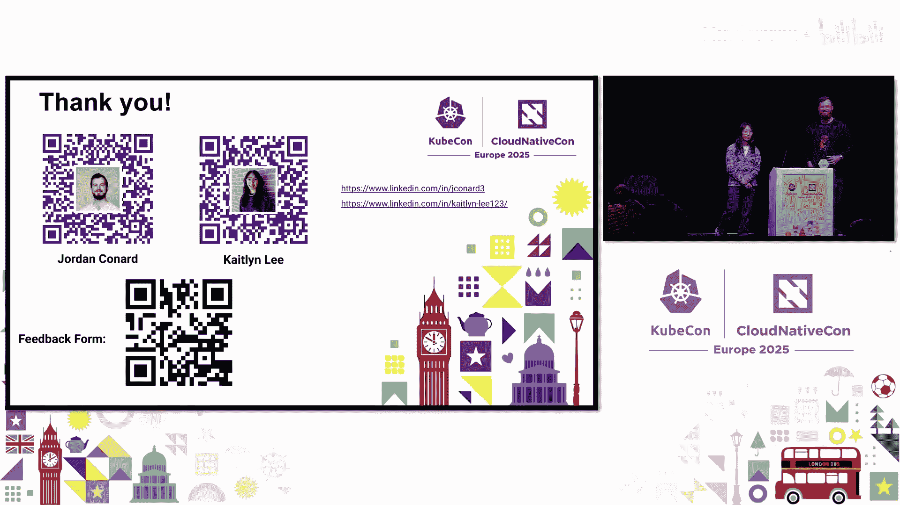
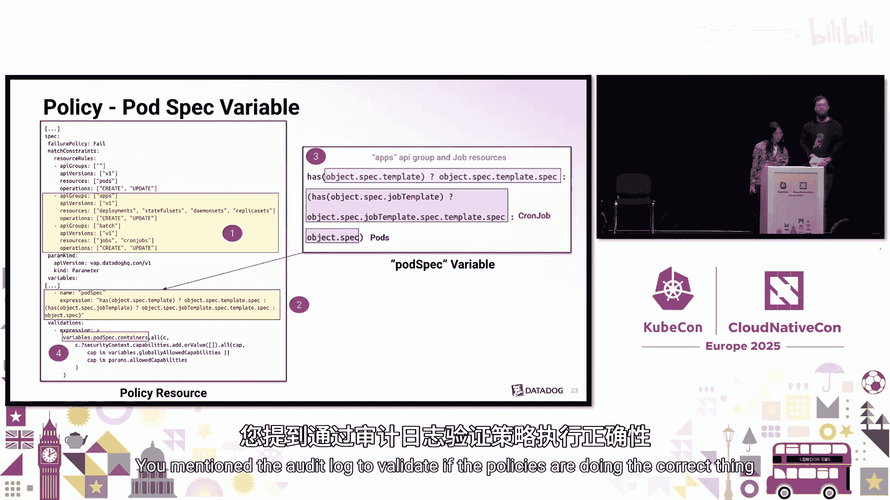
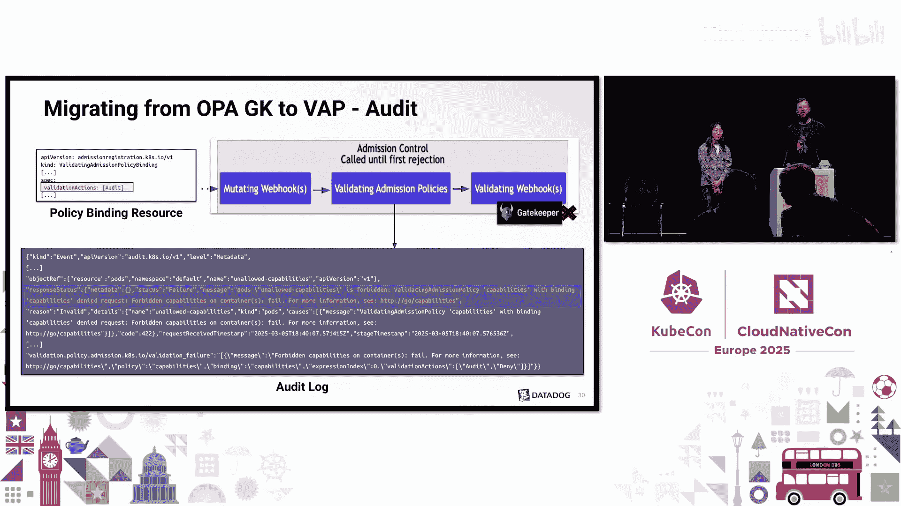

# 041：蒸发Kubernetes安全风险——规模化采用验证准入策略





## 概述

在本教程中，我们将学习如何将基础的验证准入策略（Validating Admission Policy, VAP）教程示例，转化为适合大规模生产环境部署的成熟策略。我们将以Datadog的实践经验为例，逐步介绍策略的增强、迁移、监控以及后续优化思路。

---

## Kubernetes在Datadog的规模

Datadog的工程团队拥有超过2000名员工。我们运行在多云环境上，管理着超过100个集群、10,000多个节点以及100,000多个Pod。我们所有的工作负载都运行在Kubernetes上，这包括了基础设施、平台以及应用程序。因此，我们需要一套精细且可配置的安全策略来匹配异构的工作负载。

---

## Datadog的准入控制历史

我们的准入策略历史始于2020年，当时Kubernetes正在弃用Pod安全策略（Pod Security Policies, PSP）。我们当时正在寻找替代方案，而Pod安全标准（Pod Security Standards, PSS）并不完全适合我们。那时，OPA Gatekeeper是生态系统中的默认解决方案，我们最终选择了它。

OPA Gatekeeper简介：OPA（开放策略代理）是一个已毕业的CNCF项目，旨在成为一个通用策略引擎，主要使用Rego语言编写策略。Gatekeeper则是将OPA引擎包装成验证准入Webhook的项目部分。

---

## 转向验证准入策略

自Kubernetes 1.30版本起，SIG API Machinery推出了一项名为验证准入策略的新功能，并且已进入稳定阶段。根据文档，验证准入策略提供了一种声明式的、进程内的替代方案，以取代验证准入Webhook。这意味着VAP验证直接在API服务器内评估，而不是像Gatekeeper那样作为准入Webhook运行。此外，VAP策略使用通用表达式语言（CEL）编写，而非Rego。

一旦我们接触到验证准入策略，我们进行了概念验证，并得出结论：它非常适合Datadog。我们总结了三个主要优势：
1.  **从外部Webhook移至进程内**：这将减少大量的运维复杂性，降低云资源成本和开销，并通过不运行外部Webhook来提升安全状况。
2.  **青睐CEL语言**：我们看到CEL在Kubernetes中的应用日益增多，例如在CRD的字段验证中。Datadog内部的一些开发者工具也在使用它。
3.  **命名空间范围的参数**：作为安全工程师，这非常棒，可以让我一眼看清整个命名空间的安全状况，并且与Datadog现有的命名空间所有权和RBAC边界非常契合。

---

## 策略演进：从教程到生产

决定迁移到验证准入策略后，我们需要做的第一件事就是将现有策略转化为验证准入策略。本节中，我们将以我们的“Capabilities策略”为例，展示如何逐步增强一个基础策略。

### 基础策略：限制容器能力

这个策略源自我们的Pod安全策略时期，其核心作用是限制容器在其安全上下文中可以添加的Linux能力（Capabilities）。

首先，我们需要几个组件来运行VAP：
1.  **ValidatingAdmissionPolicy资源**：定义策略规则。
2.  **ValidatingAdmissionPolicyBinding资源**：将策略绑定到特定的命名空间。

以下是一个基础的策略示例，它拒绝任何尝试在容器安全上下文中添加能力的Pod。

```yaml
# ValidatingAdmissionPolicy
apiVersion: admissionregistration.k8s.io/v1
kind: ValidatingAdmissionPolicy
metadata:
  name: "capabilities-policy"
spec:
  matchConstraints:
    resourceRules:
    - apiGroups:   [""]
      apiVersions: ["v1"]
      operations:  ["CREATE", "UPDATE"]
      resources:   ["pods"]
  validations:
    - expression: "object.kind == 'Pod' && !has(object.spec.containers) ? true : object.spec.containers.all(c, !has(c.securityContext.capabilities.add))"
---
# ValidatingAdmissionPolicyBinding
apiVersion: admissionregistration.k8s.io/v1
kind: ValidatingAdmissionPolicyBinding
metadata:
  name: "capabilities-policy-binding"
spec:
  policyName: "capabilities-policy"
  matchResources: {}
```

**策略说明**：
*   `matchConstraints` 指定此策略针对Pod资源的创建和更新操作。
*   `expression` 是一个CEL表达式，检查Pod的所有容器是否都没有在`securityContext.capabilities.add`字段中指定任何内容。如果有，则验证失败。

**局限性**：此策略是“全有或全无”的。要么完全禁止能力，要么通过命名空间选择器排除整个命名空间，但这又允许了所有能力。这无法满足合法的用例需求。

### 增强一：引入全局允许的能力变量

为了增加灵活性，我们可以在策略中定义变量，例如一个“全局允许的能力”列表。这些能力被认为在使用前不需要额外的安全审查。

```yaml
# ValidatingAdmissionPolicy (增强版)
apiVersion: admissionregistration.k8s.io/v1
kind: ValidatingAdmissionPolicy
metadata:
  name: "capabilities-policy"
spec:
  variables:
    - name: "globally_allowed_capabilities"
      expression: "['NET_ADMIN', 'SYS_TIME']" # 示例列表
  matchConstraints: ... # 同上
  validations:
    - expression: >-
        object.kind == 'Pod' &&
        object.spec.containers.all(c,
          (c.securityContext?.capabilities?.add.orValue([])).all(cap,
            cap in variables.globally_allowed_capabilities
          )
        )
```

**增强点**：
1.  `variables`：定义了`globally_allowed_capabilities`变量。
2.  **CEL可选字段与`orValue`函数**：表达式`c.securityContext?.capabilities?.add.orValue([])`使用了`?.`操作符进行可选字段选择。如果路径上的任何字段不存在，则使用`orValue([])`返回一个空列表。这避免了每次都需要检查字段是否存在，使表达式更简洁。

### 增强二：使用参数资源实现命名空间级配置

全局变量提供了灵活性，但我们可以更进一步。验证准入策略支持**参数资源**的概念，允许你将任何Kubernetes资源中的信息注入到策略中。在Datadog，我们创建了自定义资源定义（CRD）来打包策略所需的所有变量。

```yaml
# 1. 自定义参数资源CRD (示例)
apiVersion: apiextensions.k8s.io/v1
kind: CustomResourceDefinition
metadata:
  name: securitypolicies.datadog.com
spec:
  group: datadog.com
  names:
    kind: SecurityPolicy
    plural: securitypolicies
  scope: Namespaced
  versions:
    - name: v1alpha1
      schema: ... # 定义allowedCapabilities等字段
---
# 2. 命名空间中的参数资源实例
apiVersion: datadog.com/v1alpha1
kind: SecurityPolicy
metadata:
  name: namespace-xyz-policy
  namespace: xyz
spec:
  allowedCapabilities:
    - "NET_ADMIN"
    - "IPC_LOCK"
---
# 3. 更新Policy以引用参数
apiVersion: admissionregistration.k8s.io/v1
kind: ValidatingAdmissionPolicy
metadata:
  name: "capabilities-policy"
spec:
  paramKind:
    apiVersion: datadog.com/v1alpha1
    kind: SecurityPolicy
  variables: ... # 可保留全局变量
  matchConstraints: ... # 同上
  validations:
    - expression: >-
        object.kind == 'Pod' &&
        object.spec.containers.all(c,
          (c.securityContext?.capabilities?.add.orValue([])).all(cap,
            cap in variables.globally_allowed_capabilities ||
            (has(params) && cap in params.spec.allowedCapabilities)
          )
        )
---
# 4. 更新Binding以指定参数
apiVersion: admissionregistration.k8s.io/v1
kind: ValidatingAdmissionPolicyBinding
metadata:
  name: "capabilities-policy-binding"
spec:
  policyName: "capabilities-policy"
  paramRef:
    name: "namespace-xyz-policy" # 引用该命名空间中的参数资源
  matchResources: {}
```

**增强点**：
1.  `paramKind`：在策略中声明参数资源的类型。
2.  `paramRef`：在绑定中指定具体使用哪个参数资源实例。
3.  **表达式更新**：现在CEL表达式会同时检查全局允许列表和命名空间特定的参数资源中定义的允许列表。



这实现了**单策略，多配置**，允许根据每个命名空间的安全需求和能力需求进行差异化配置。

### 增强三：扩展策略以验证高层资源

目前策略只验证Pod资源。从安全角度可以接受，但从用户体验角度，最好能直接验证用户更常接触的、创建Pod的高层资源，如Deployment、Job、CronJob等。



挑战在于这些资源的Pod规范路径不同。解决方案是使用变量来抽象出Pod规范路径。

```yaml
# ValidatingAdmissionPolicy (支持高层资源)
apiVersion: admissionregistration.k8s.io/v1
kind: ValidatingAdmissionPolicy
metadata:
  name: "capabilities-policy"
spec:
  paramKind: ... # 同上
  variables:
    - name: "globally_allowed_capabilities"
      expression: "['NET_ADMIN', 'SYS_TIME']"
    - name: "pod_spec"
      expression: >-
        object.kind == 'Pod' ? object.spec :
        (object.kind == 'Deployment' || object.kind == 'ReplicaSet') ? object.spec.template.spec :
        object.kind.endsWith('Job') ? object.spec.jobTemplate.spec.template.spec :
        null # 不支持的资源类型
  matchConstraints:
    resourceRules:
    - apiGroups:   ["", "apps", "batch"]
      apiVersions: ["v1"]
      operations:  ["CREATE", "UPDATE"]
      resources:   ["pods", "deployments", "replicasets", "jobs", "cronjobs"]
  validations:
    - expression: >-
        variables.pod_spec != null &&
        variables.pod_spec.containers.all(c,
          (c.securityContext?.capabilities?.add.orValue([])).all(cap,
            cap in variables.globally_allowed_capabilities ||
            (has(params) && cap in params.spec.allowedCapabilities)
          )
        )
```

**增强点**：
1.  `matchConstraints`：扩展了资源规则，包含了Pod和高层控制器。
2.  `pod_spec`变量：使用三元条件运算符，根据资源类型动态提取Pod规范路径。
3.  **统一验证表达式**：现在验证表达式使用`variables.pod_spec`，可以统一处理所有支持的资源类型。

### 增强四：提供友好的拒绝消息

当资源被拒绝时，提供清晰的错误信息至关重要。我们可以使用`messageExpression`来实现。

```yaml
# ValidatingAdmissionPolicy (添加消息表达式)
apiVersion: admissionregistration.k8s.io/v1
kind: ValidatingAdmissionPolicy
metadata:
  name: "capabilities-policy"
spec:
  # ... paramKind, variables, matchConstraints 同上
  validations:
    - expression: >- # 验证表达式
        variables.pod_spec != null &&
        variables.pod_spec.containers.all(c, ... ) # 同上
      messageExpression: >- # 消息表达式
        ‘容器 ‘ + variables.pod_spec.containers.filter(c,
          !(c.securityContext?.capabilities?.add.orValue([])).all(cap,
            cap in variables.globally_allowed_capabilities ||
            (has(params) && cap in params.spec.allowedCapabilities)
          )
        ).map(c, c.name).join(‘, ‘) + ‘ 包含了未被允许的Linux能力。请参阅文档：’ + variables.docs_url
  variables:
    - name: "globally_allowed_capabilities"
      expression: "['NET_ADMIN', 'SYS_TIME']"
    - name: "pod_spec"
      expression: ... # 同上
    - name: "docs_url" # 新增文档链接变量
      expression: “‘https://internal-wiki/capabilities-policy'”
```

**增强点**：
1.  `messageExpression`：这是一个CEL表达式，在关联的验证表达式拒绝工作负载时被渲染和执行。
2.  **有用的信息**：消息不仅指出了违反策略的容器名称，还提供了查看详细文档的链接，帮助用户排查问题。

---



## 安全迁移与监控策略

现在我们已经有了一个生产级的策略，接下来需要安全地从旧的OPA Gatekeeper迁移到新的验证准入策略。

### 迁移步骤一：审计模式验证

首先，利用VAP的`audit`验证动作。在此模式下，VAP会将所有策略违规记录到指定的审计日志中，但不会拒绝请求。这为我们提供了时间来检查策略的有效性和行为。

```yaml
# ValidatingAdmissionPolicyBinding (审计模式)
apiVersion: admissionregistration.k8s.io/v1
kind: ValidatingAdmissionPolicyBinding
metadata:
  name: "capabilities-policy-binding"
spec:
  policyName: "capabilities-policy"
  paramRef: ...
  matchResources: ...
  validationActions: ["Audit"] # 关键：仅审计，不拒绝
```

**验证方法**：由于验证准入策略在准入链中先于验证准入Webhook（如Gatekeeper）执行，我们应该在VAP的审计日志中看到策略违规，随后在Gatekeeper中看到对应的请求被拒绝。通过比对，确保每一个被Gatekeeper拒绝的请求都能在VAP审计日志中找到匹配的违规记录。同时，我们为所有迁移的策略创建了单元测试和端到端测试，以确保行为一致。

### 迁移步骤二：切换为拒绝模式

当我们确信新策略行为正确后，可以将绑定资源的验证动作改为`Deny`。

```yaml
validationActions: ["Deny"] # 切换为拒绝模式
```



现在，请求将首先被VAP拒绝，而不会到达Gatekeeper。我们可以通过确认Gatekeeper中不再有准入拒绝来验证策略匹配成功。一旦确认，就可以安全地停用Gatekeeper，完成迁移。

### 迁移后监控：确保API服务器健康


VAP现在处于关键路径上，我们需要确保其运行可靠、平稳。主要监控点：



1.  **API服务器基础指标**：
    *   `apiserver_admission_webhook_rejection_count`：现在应主要关注VAP相关的拒绝。
    *   `apiserver_request_duration_seconds`：关注`admission`阶段的耗时，确保VAP评估没有引入显著延迟。

2.  **CEL特定指标**（聚合指标）：
    *   `apiserver_validating_admission_policy_compilation_duration_seconds`：CEL表达式编译耗时。
    *   `apiserver_validating_admission_policy_evaluation_duration_seconds`：CEL表达式评估耗时。
    *   **注意**：这些指标是API服务器上所有CEL表达式（包括CRD验证）的聚合值，但能提供整体影响的感觉。

3.  **使用CEL Playground进行排查**：
    *   这是一个在线工具，可以输入VAP策略和测试请求对象，用于检查策略和表达式的有效性。
    *   它还能显示**验证成本（Validation Cost）**。API服务器通过**验证成本预算（Validation Cost Budget）** 来防止失控的CEL表达式影响性能。每个表达式的静态估算成本上限硬编码为1000万。Playground会显示策略中每个变量和表达式的成本及总成本，帮助开发者优化高成本表达式（尤其是嵌套和链式宏）。

---

## 总结与展望

本节课中，我们一起学习了如何将验证准入策略从教程示例演进为生产级部署。

**回顾要点**：
1.  **迁移动机**：从外部Webhook（如OPA Gatekeeper）迁移到进程内的VAP，可以减少运维复杂度、成本，并提升安全性。
2.  **策略演进**：
    *   使用**变量**简化配置和表达式。
    *   利用**参数资源**实现命名空间级别的灵活配置。
    *   通过抽象`pod_spec`变量，使**单策略支持多种资源类型**。
    *   添加`messageExpression`提供**友好的错误信息**，改善用户体验。
3.  **安全迁移**：采用**审计（Audit）模式**先行验证，再切换至**拒绝（Deny）模式**，并通过日志比对和测试确保策略一致性。
4.  **生产监控**：关注API服务器和CEL相关的指标，利用CEL Playground工具进行成本分析和问题排查。

**未来展望（Day 2 Operations）**：
*   **扩展策略范围**：覆盖Init容器和临时容器（Ephemeral Containers）的能力限制。
*   **自动化Sidecar处理**：通过策略变量，根据容器镜像名自动允许特定Sidecar所需的能力，减少人工操作。
*   **完善测试框架**：继续使用Kubernetes的e2e框架进行端到端测试，确保策略无回归。
*   **构建自助服务平台**：开发API驱动的内部平台，让终端用户可以自助申请策略例外（参数资源内容），并集成安全评审流程。
*   **策略例外清理**：建立机制，识别并清理随时间推移不再需要的策略例外（例如，废弃的命名空间或已变更的工作负载），以持续降低安全风险。



通过以上步骤，你可以系统地、安全地在你的组织中规模化地采用验证准入策略，有效蒸发Kubernetes的安全风险。