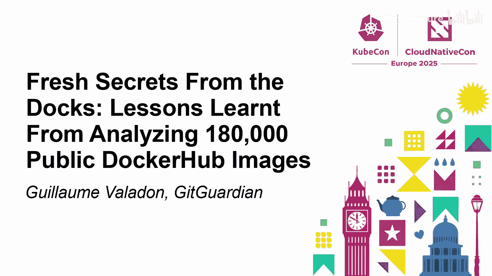
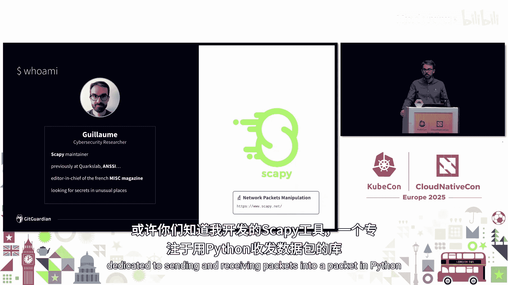
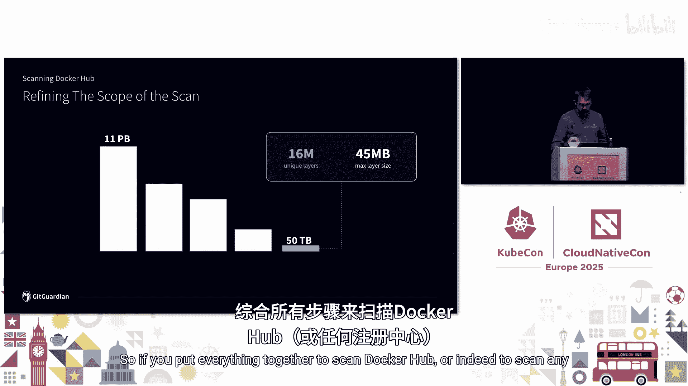
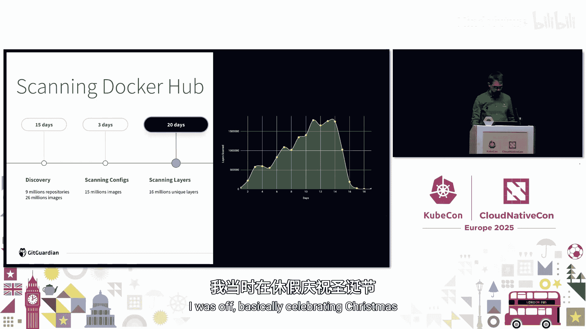
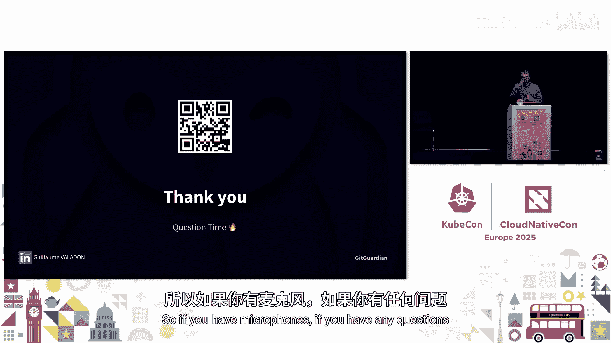

# 043：从公开Docker镜像中发现的秘密






在本教程中，我们将学习如何分析公开的Docker镜像以发现泄露的秘密。我们将探讨Docker镜像的结构、扫描方法、常见的安全隐患，并提供最佳实践建议，以帮助开发者和安全人员保护敏感信息。

## 概述

本次课程将基于对超过18万个公开Docker镜像的分析，揭示其中隐藏的秘密泄露问题。我们将从Docker镜像的基本结构讲起，逐步深入到扫描方法、数据分析，并最终总结出关键的教训和防护措施。

## Docker镜像结构解析

上一节我们介绍了课程的整体目标，本节中我们来看看Docker镜像的内部构成。理解镜像结构是后续扫描和分析的基础。

一个Docker镜像由多个层（Layer）组成，每个层对应Dockerfile中的一条指令。这些层也被称为Blob，通常是经过Gzip压缩的tar包。

除了存储文件系统的层，镜像还包含两个重要的JSON文件：
*   **Config文件**： 描述了镜像的元数据和配置，例如环境变量、入口点命令等。
*   **Manifest文件**： 一个清单，列出了构成该镜像的所有层（Blob）和Config文件。

因此，扫描Docker镜像中的秘密，本质上就是扫描这些JSON文件和tar包中的内容。

## 扫描方法与工具

了解了镜像结构后，我们来看看如何系统地扫描它们以发现秘密。

以下是扫描Docker镜像中秘密的基本步骤：
1.  **获取仓库列表**： 使用注册中心的API（如 `/v2/_catalog` 端点）列出所有仓库。
2.  **获取标签列表**： 对于每个仓库，获取其所有的镜像标签。
3.  **获取清单文件**： 对于每个标签，下载其Manifest文件。
4.  **下载并扫描Blob**： 根据Manifest下载所有层（Blob）和Config文件，并对这些文件进行秘密扫描。

对于Docker Hub，由于其公开搜索功能限制（最多返回1万条结果），需要使用一些技巧，例如通过枚举关键词（如 `aaa`, `aab`）来获取更全面的仓库列表。

在工具方面，可以使用 `Skopeo` 来下载和检查镜像内容。对于秘密扫描，GitGuardian的工具 `ggshield` 是一个专门的选择，它可以直接扫描Docker镜像。例如，扫描一个本地镜像：
```bash
ggshield secret scan docker my-image:latest
```

## 有效性验证与秘密分类

在扫描出大量潜在秘密后，我们需要判断哪些是真正可用的。这涉及到有效性验证和秘密分类。

有效性验证通常通过调用相应服务的API来实现。例如，验证一个GitHub令牌：
*   **有效令牌**： API返回 `200 OK`。
*   **无效令牌**： API返回 `401 Unauthorized`。
*   **无法验证**： 目标服务可能位于内网，无法从公网访问。这类秘密对内网攻击者可能仍有价值。



从攻击者视角，秘密可以分为两大类：
*   **特定类型秘密**： 具有已知模式和格式，可映射到特定服务（如AWS、GitHub）。这类秘密通常可以自动验证，是攻击者的主要目标。
*   **通用类型秘密**： 格式不明确，难以自动化识别和验证，需要人工分析上下文来判断其用途和风险。



## 数据分析与关键发现

我们应用上述方法对公开镜像进行了大规模扫描，以下是一些关键的数据发现：

*   **泄露比例**： 5%的公开仓库包含至少一个秘密。这意味着每20个仓库中就有一个存在泄露风险。
*   **来源**： 绝大多数秘密（超过99%）存在于镜像层（Layer）中，而非Dockerfile或Config文件。这表明秘密通常在构建过程中被意外打包进去。
*   **有效性**： 在发现的特定类型秘密中，**20%是当前有效的**。这意味着攻击者可以直接利用它们。
*   **秘密类型分布**：
    *   28% 与数据存储相关（如数据库、S3桶凭证），其中13%有效。
    *   13% 与云服务提供商相关（如AWS、GCP密钥），其中高达50%有效。
*   **持久性风险**： 60%的有效秘密是在2024年之前泄露的，甚至有2000个有效秘密可以追溯到5年前（2020年）。秘密一旦泄露，可能长期有效，构成持续威胁。

## 常见的Docker安全隐患与错误模式

数据分析揭示了惊人的风险，那么这些秘密是如何泄露的呢？本节我们来剖析常见的错误模式。

**1. Dockerfile中的“记忆”效应**
一个常见的误解是，在`RUN`指令中删除敏感文件（如 `.npmrc`）就能确保安全。例如：
```dockerfile
COPY .npmrc .
RUN npm ci && rm .npmrc
```
实际上，`rm`命令只会在容器运行时删除文件，而包含`.npmrc`的层（由`COPY`创建）仍然存在于镜像中，可以被轻易提取。

**2. 构建参数（Build Args）泄露**
使用`ARG`或`ENV`在Dockerfile中传递秘密是**极其危险**的做法。
```dockerfile
ARG AWS_ACCESS_KEY
RUN echo $AWS_ACCESS_KEY
```
这些参数的值会**明文存储在最终的镜像Config文件中**。Docker官方文档明确警告：构建参数和环境变量不适合传递秘密。

**3. 在RUN指令中泄露秘密**
即使使用了正确的秘密传递方式（如`--mount=type=secret`），如果在`RUN`指令中错误地处理，仍然会导致泄露。
```dockerfile
RUN --mount=type=secret,id=my_secret \
    export MY_SECRET=$(cat /run/secrets/my_secret) && \
    echo "Secret is: $MY_SECRET" # 错误！这将把秘密记录到层中。
```
这可能是最糟糕的情况：采用了最佳实践，却因一个操作失误而前功尽弃。

## 最佳实践与防护建议

认识到问题后，我们来看看如何正确、安全地在Docker构建中使用秘密。

**正确方式：使用Docker Build Secret**
这是Docker推荐的安全方法，秘密仅在构建时临时挂载，不会留存于任何镜像层中。
```dockerfile
# syntax=docker/dockerfile:1
RUN --mount=type=secret,id=my_secret,target=/run/secrets/my_secret \
    export MY_SECRET=$(cat /run/secrets/my_secret) && \
    # 使用MY_SECRET，但不要打印或将其写入任何文件
    my-command --api-key $MY_SECRET
```
构建命令示例：
```bash
docker build --secret id=my_secret,env=MY_SECRET_ENV_VAR -t my-app .
```

**关键行动建议**
1.  **主动审计**： 定期扫描你的公有和私有镜像仓库，查找泄露的秘密。可以将此作为CI/CD流水线的一个环节。
2.  **开展演练**： 从治理层面，假设公司发生了秘密泄露（如AWS根账户密钥被公开），组织一次应急响应演练。测试能否快速定位泄露源、撤销凭证、通知相关方。预防性演练比事后补救更有效。
3.  **提高意识**： 对开发团队进行安全教育，明确说明Docker构建中传递秘密的风险和正确方法。

## 总结

本节课中我们一起学习了如何分析Docker镜像以发现泄露的秘密。我们了解到：
1.  **公开镜像中秘密泄露现象普遍**，且大量秘密长期有效。
2.  **秘密主要泄露在镜像层中**，常见的错误包括误用构建参数、在RUN指令中处理不当等。
3.  **最安全的做法是使用 `--mount=type=secret`** 来在构建期间传递敏感信息。
4.  **防护需要技术和流程结合**： 通过工具自动化扫描，并通过演练和培训提升整体安全水位。

安全是一个持续的过程，希望本课程能帮助你更好地保护你的云原生应用和基础设施。



