# 044：容器运行时隔离与多租户的隐藏成本

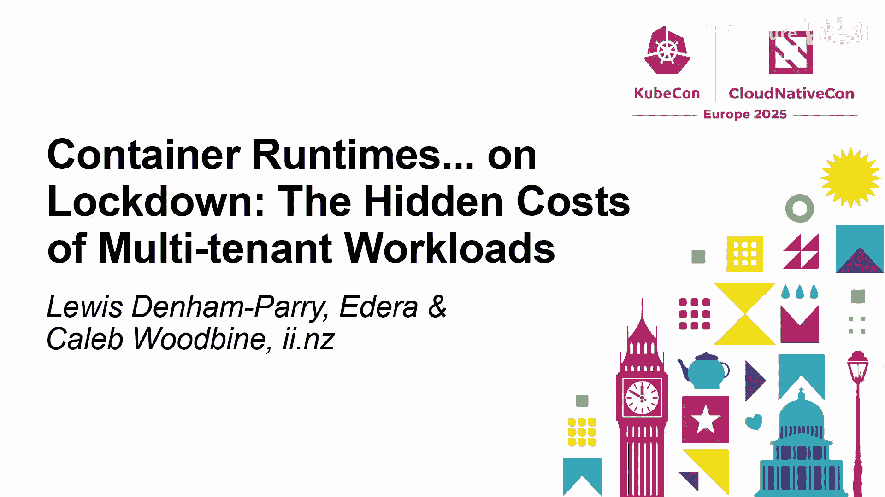

在本节课中，我们将要学习容器运行时隔离的重要性、不同类型的运行时实现、它们面临的风险，以及如何在多租户环境中做出合适的选择。我们将从基础概念开始，逐步深入到安全考量与性能权衡。

---

## 概述：为什么需要隔离？

有时，我们处理的信息可能过多，因此需要通过隔离部分信息来解决这个问题。在云原生环境中，隔离对于安全运行不同工作负载至关重要。

## 什么是容器运行时？

我们首先从定义开始，确保大家有一个共同的理解基础。

简单来说，容器运行时是指当我们提供一个希望在某个计算节点上运行的容器镜像时，负责启动并管理该容器的组件。它不会判断所运行的容器是否正确，只是执行运行过程。

### 深入解析 OCI 运行时规范

OCI 代表开放容器倡议，它制定了 OCI 运行时规范。该规范定义了我们在环境中选择运行时所使用的接口。从技术层面讲，它要求运行时能够处理创建、启动、终止、删除等命令。

以下是容器运行时依赖的几个关键 Linux 内核特性：

*   **Linux 命名空间**：提供了一种类似隔离的感觉。运行时创建诸如进程、挂载、用户等命名空间。
*   **Cgroups**：帮助我们限制资源使用，防止“吵闹的邻居”问题。
*   **Seccomp 和 AppArmor**：协助安全策略，本质上规定了容器可以做什么和不可以做什么，这是一种强制访问控制形式。
*   **文件系统**：为容器提供文件系统，从计算或存储节点挂载到容器中。

## 从安全角度看容器类型

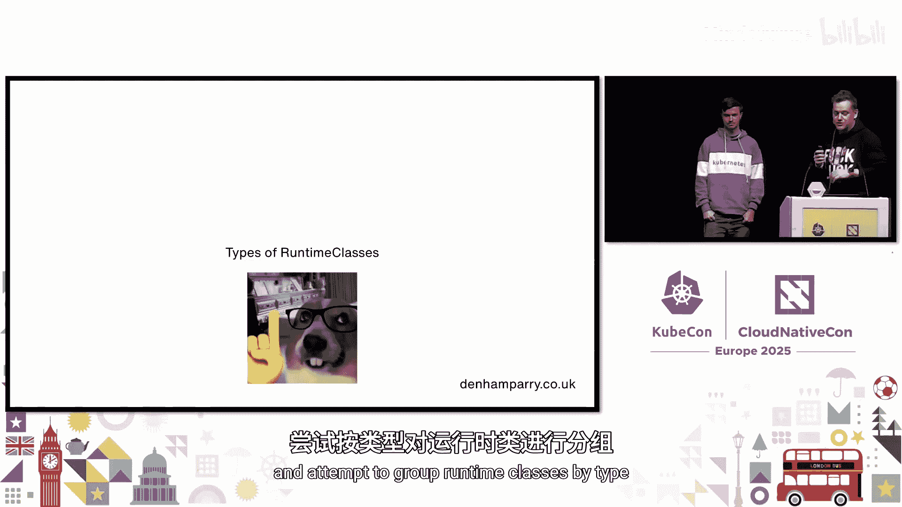

了解了容器运行时的基本原理后，我们来谈谈从安全上下文角度可能运行的几种容器类型。

以下是三种主要的安全上下文类型：

1.  **不受信任的代码或镜像**：这是来自互联网的随机镜像，是别人的代码。我们可能不知道其创建者、来源或托管位置，也缺乏可追溯其来源的证明。我们无法完全信任它，但目前没有太多机制阻止我们运行它。
2.  **远程代码执行即服务**：在 AI 开发等场景中，开发者需要本地笔记本电脑无法提供的硬件。像 Coder 和 Gitpod 这样的平台提供了带 IDE 的计算环境，并且现在这些计算环境配备了 GPU。这本质上是一种“远程代码执行即服务”，我们需要能够确保其安全。
3.  **敏感应用程序**：这不仅仅是支付信息。过去的数据泄露曾导致人们生命受到威胁。从容器角度看，我们可能部署了所有最好的安全措施，但回到进程层面，是否有人在“房间”里窥视我们的进程？工具固然重要，但实现方式同样关键。

## 容器运行时的安全风险

上一节我们介绍了不同的容器安全上下文，本节中我们来看看运行这些容器时可能面临的核心风险。

主要风险集中在两个方面：

1.  **内核与主机访问**：内核在安全中扮演着至关重要的角色，任何运行在其上的东西都会经过内核。内核庞大且重要，任何改动都可能对性能产生不利影响。主机访问则涉及拥有“上帝模式”的系统管理员，他们可以访问容器运行的主机并查看所有进程。如果管理员心怀恶意，或者你根本不知道管理你计算资源的人是谁，风险就产生了。
2.  **沙箱逃逸与资源竞争**：运行时是我们系统的关键点，一切都要经过这里。如果运行时被利用，攻击者就可能突破节点。例如，“Leaky Vessels”漏洞曾允许攻击者从容器运行时横向移动。此外，即使处于隔离环境，如果共享资源（如 CPU、内存、I/O）被其他进程耗尽，也会导致“吵闹的邻居”问题。

## 容器运行时分类

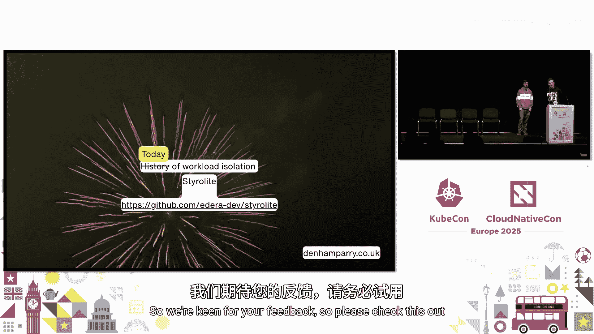

带着上述担忧，让我们更深入地探讨，并尝试按类型对运行时进行分类。

以下是主要的容器运行时类型：

*   **内核类型**：这是标准的运行时类别。如果你今天正在运行集群并且对此感到陌生，你可能就属于这一类。例如：`runc`、`crun`。它们通过基本的 Linux 命名空间和 Cgroups 实现沙箱化，可以运行通用工作负载。
*   **隔离增强型**：这类运行时专注于隔离，特别是多租户工作负载的隔离。例如：`gVisor`、`Kata Containers`、`Firecracker`。它们解决复杂问题的方式各不相同，但目标都是更强的隔离。
*   **其他类型**：例如 `Wasm`，它提供了一种在多租户环境中运行 Wasm 工作负载的方式，但可能需要重构应用程序。`crun` 的变种 `youki` 也是一个例子。

## 多租户与工作负载隔离

现在，让我们将多租户引入工作负载隔离的讨论中。

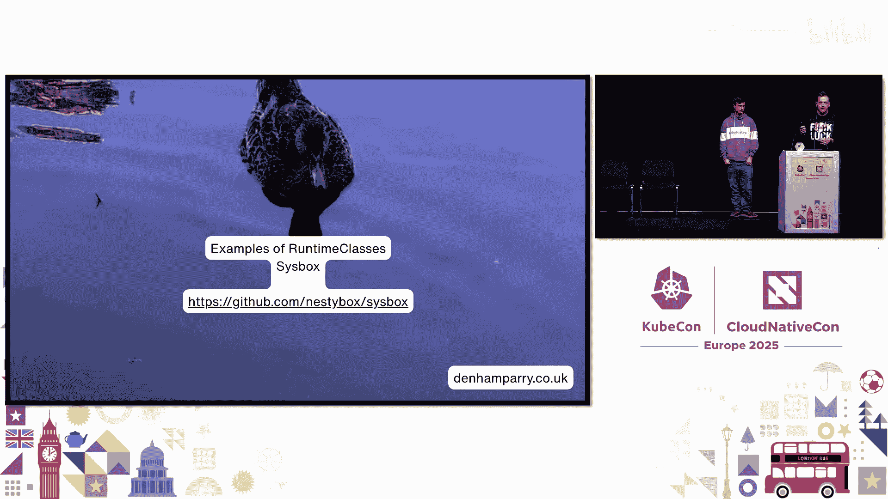

谁认为 Kubernetes 命名空间就是你所需要的全部？这在逻辑上类似于电脑上的文件夹。此外，我们还有 Linux 命名空间，这是一种位于内核中的不同“盒子”，可以提供特定的挂载和资源约束。但这需要 root 权限，而你的容器运行时确实拥有此权限。无根模式通过用户命名空间实现，但这可能违反内核自我保护准则。

以下是实现多租户隔离的几种方式：

1.  **不同节点**：为特定客户或工作负载分配专用节点池。
2.  **网络策略**：在网络层面隔离通信。
3.  **虚拟集群**：类似于“我想要一个虚拟机，但我说我想要一个 Pod”。这提供了良好的隔离。
4.  **使用特定的容器运行时**：这是本次讨论的重点，通过运行时本身提供更强的隔离边界。

## 性能与成本考量

追求安全隔离可能会带来成本。例如，为了实现强隔离（如使用独立内核），可能需要虚拟机，进而需要嵌套虚拟化，这会带来开销。你需要考虑这些已知的未知成本。

有时运行特定的容器运行时或虚拟机需要特定的硬件要求。在决定采用哪种方案时，必须将这些因素考虑在内。

性能基准测试显示，不同的运行时在启动时间、内存开销等方面存在差异。作为一个行业，我们希望在不牺牲内核类型运行时性能的前提下，获得高效的隔离。

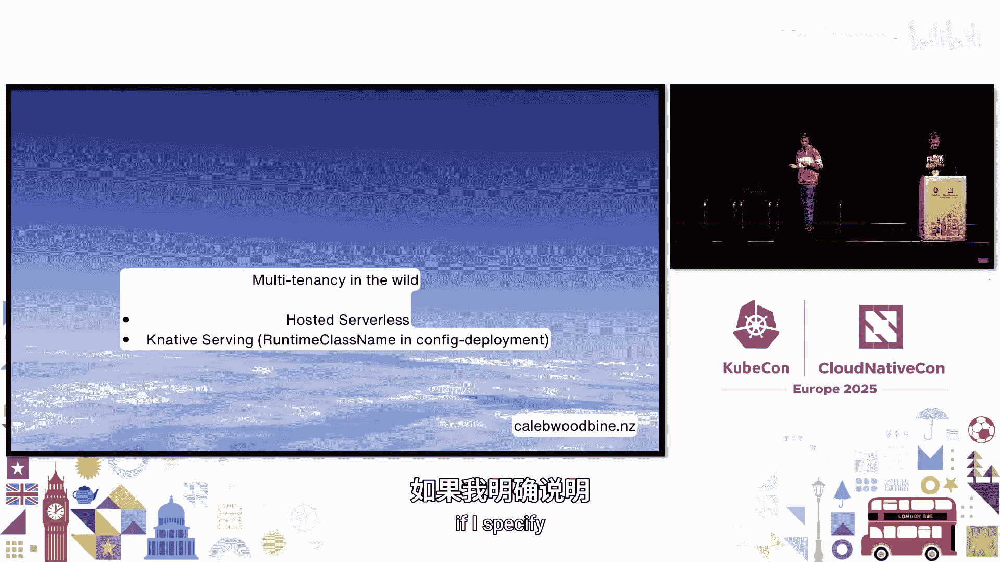

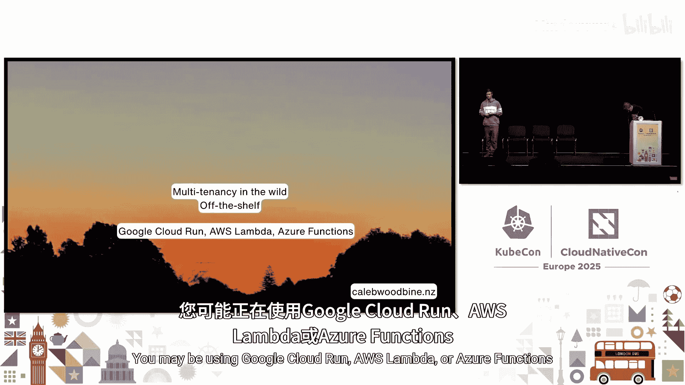

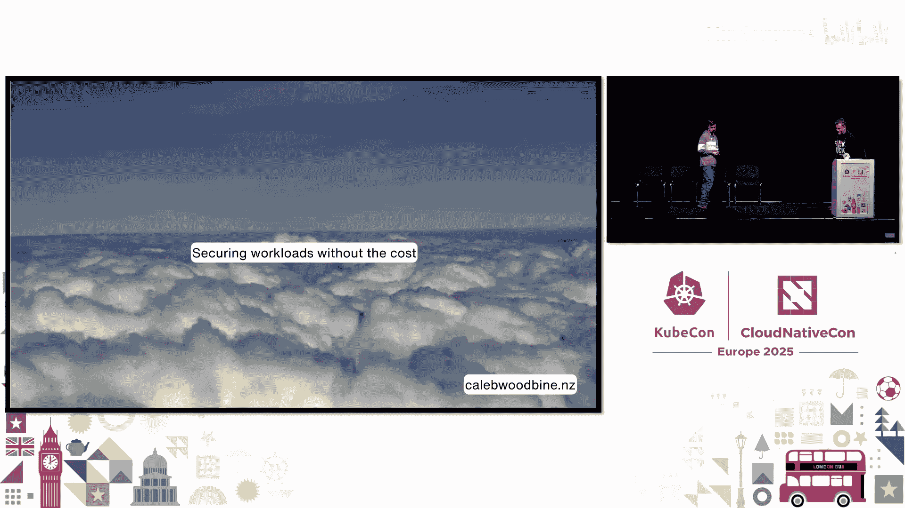

## 如何选择与配置

那么，如何与你的“医生”讨论哪种容器运行时适合你呢？

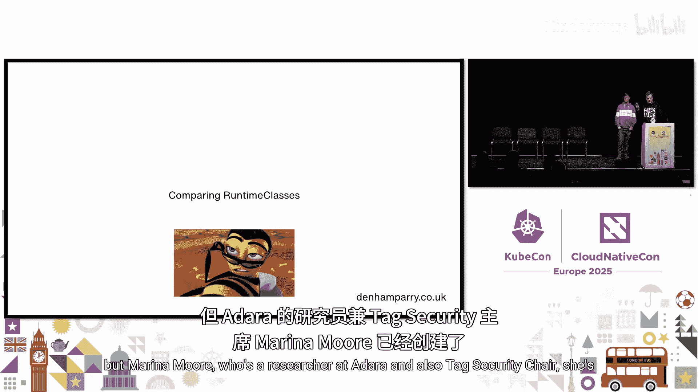

首先，诚实地评估你的需求。如果你是一家初创公司，只是做一个网站，可能不需要最高级别的安全隔离。但如果你是一家金融机构或医疗保健提供商，你可能需要经过独立评估的、更高级别的隔离。

其次，配置运行时。你可以通过 Kubernetes 的 `RuntimeClass` 资源来配置。一个想法是，也许可以不在节点上安装 `runc`，而只使用一种与你安全目标一致的运行时。

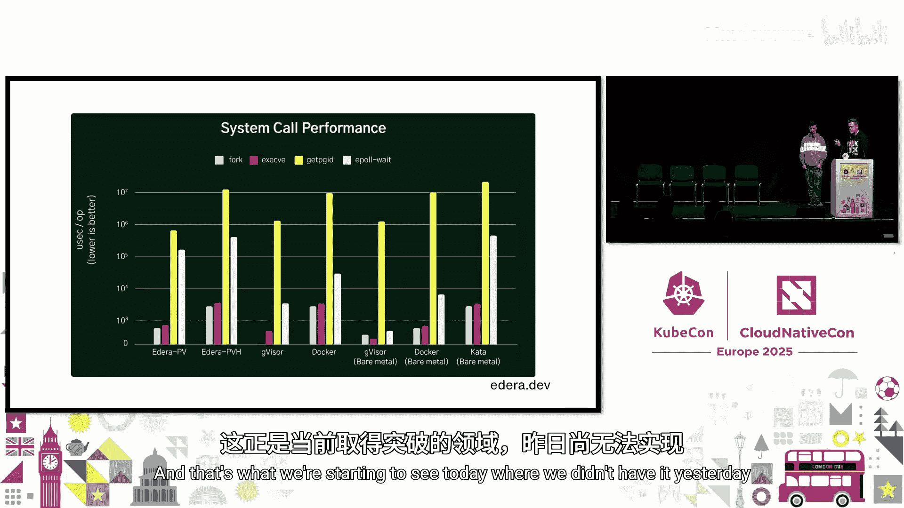

## 总结与工具

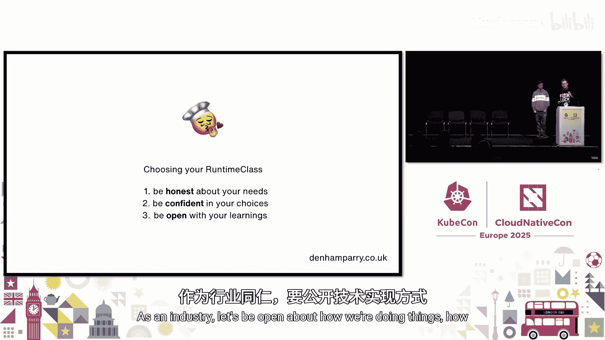

本节课中，我们一起学习了容器运行时隔离的核心概念、不同类型、相关风险以及多租户环境下的选择策略。

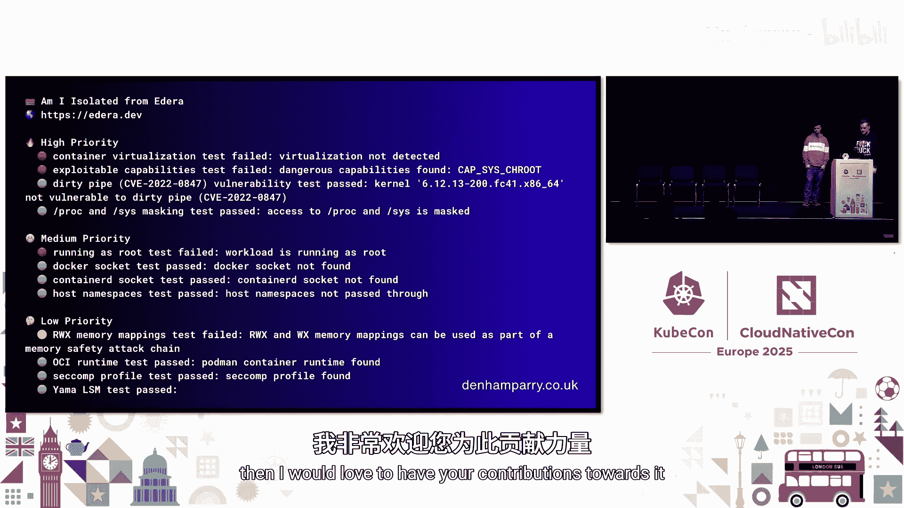

我们的结论是，你应该认真考虑使用除 `runc` 之外的其他运行时，尤其是在多租户场景下。这是一种确保工作负载之间隔离、优先考虑安全性的有效方式。

最后，我们介绍了一个开源工具 **`am-i-isolated`**。它旨在帮助你理解当前环境所处的隔离级别，是一个教育性质的工具，欢迎大家贡献反馈。

记住，即使拥有最好的技术，如果实施不当，也毫无意义。就像穿苏格兰裙，如果穿反了，功能就会大打折扣。容器的运行时就是这个低调但至关重要的基础，值得我们投入更多关注和正确的实施。