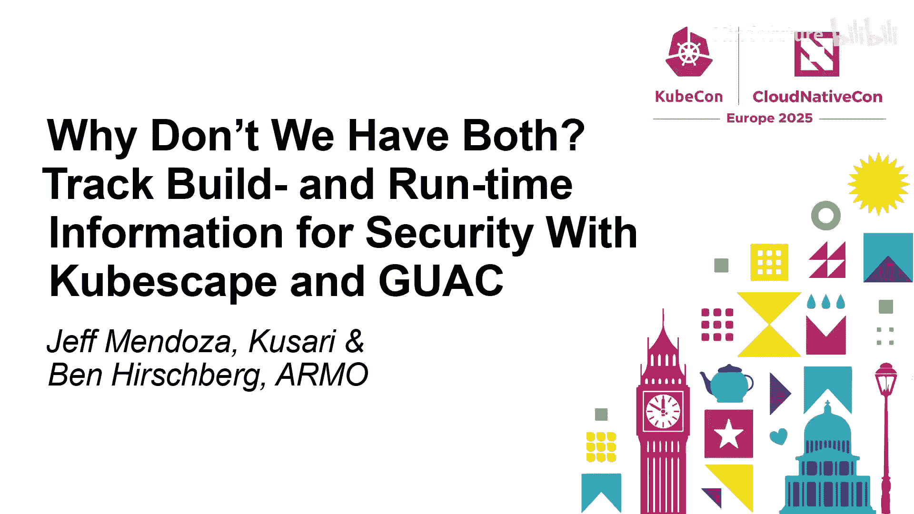
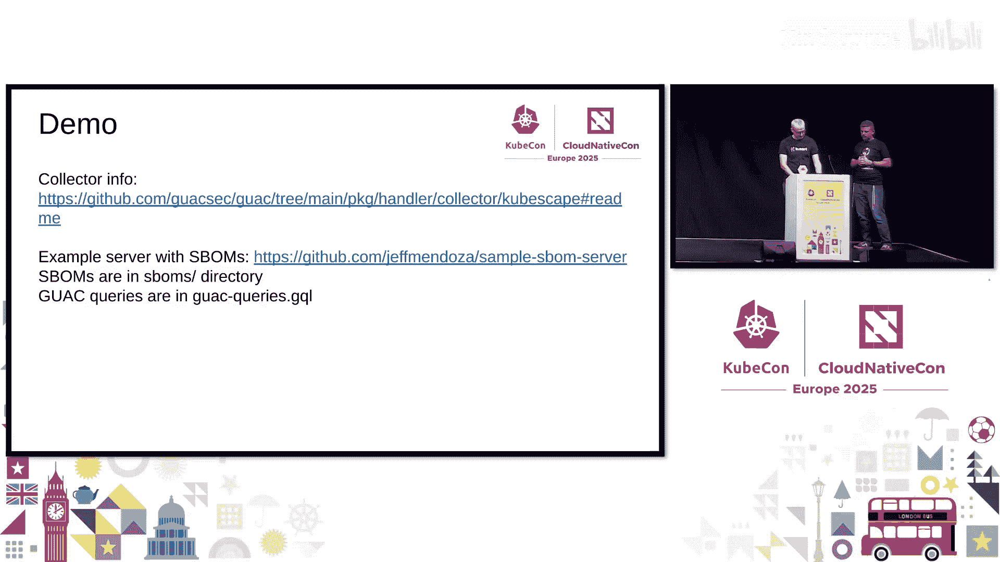
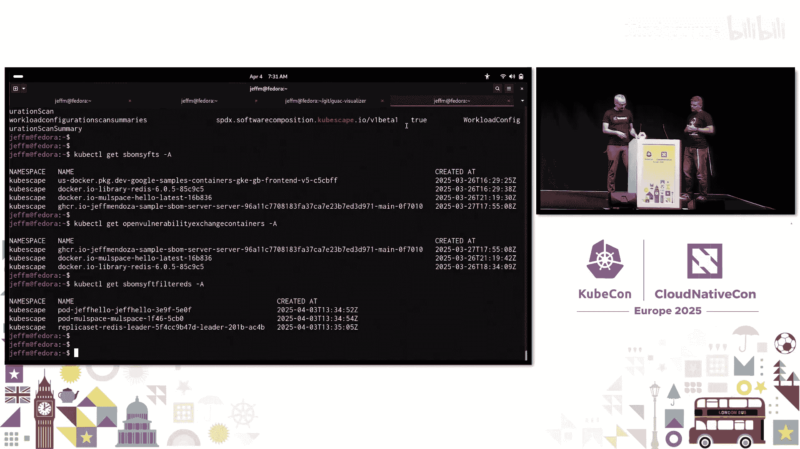
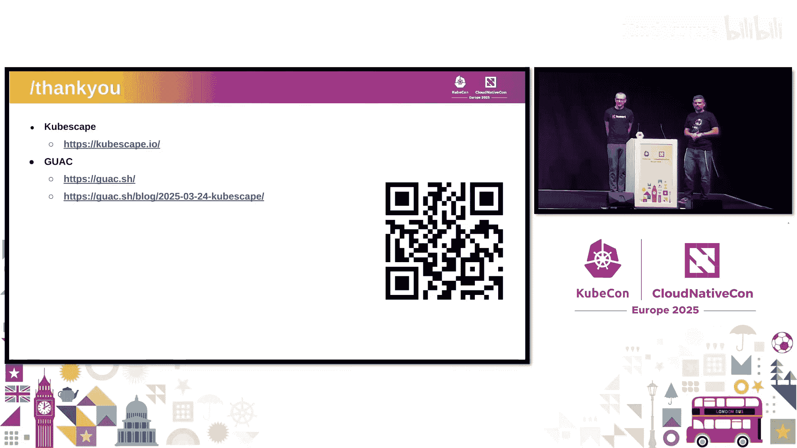
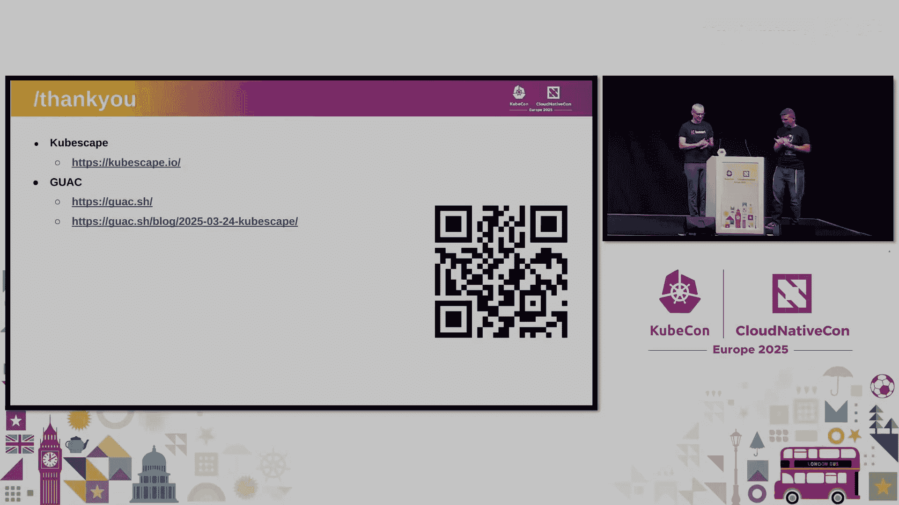

# 045：为什么不同时追踪构建时与运行时信息

在本节课中，我们将要学习如何结合使用 **Kubescape** 和 **GUAC** 这两个开源项目，来统一管理 Kubernetes 集群中的软件供应链信息。我们将探讨如何从源代码、构建过程、容器镜像到运行时等多个维度生成和分析软件物料清单，并理解不同阶段 SBOM 的差异与价值。

## 演讲者与项目介绍

大家好，我是 Jeff Mendoza，来自软件供应链安全初创公司 Qsari，同时也是开源项目 **GUAC** 的维护者。GUAC 是一个 Apache 2.0 许可的 OpenSSF 项目。

我是 Ben，是 **Kubescape** 项目的维护者之一。Kubescape 是一个 Kubernetes 安全平台，目前是 CNCF 的孵化项目。

本次演讲将简要介绍这两个项目，并展示一些刚刚发布的新功能演示。

## 深入理解 GUAC

上一节我们介绍了演讲者背景，本节中我们来看看 **GUAC** 项目。

**GUAC** 是一个缩写，代表 **G**raph for **U**nderstanding **A**rtifact **C**omposition。它的核心是一个 GraphQL API 系统，能够从各种来源（主要是软件物料清单 SBOM，也包括 SLSA 证明、Scorecard 分数、VEX 文档等）拉取供应链数据。

它将所有数据整合到一个系统中，你可以使用 GraphQL 查询来洞察整个软件供应链。单个 SBOM 只包含一个软件的内容，而 GUAC 将所有 SBOM 整合到一个大图中，从而揭示所有软件之间的相互联系。

典型的使用方式是，在构建流程中生成 SBOM，然后将其上传到正在运行的 GUAC 系统中。

以下是 GUAC 的核心组件构成：

*   **核心项目**：数据库和汇编器，负责运行 API。
*   **摄取器**：负责接收文档，并将文档转化为节点和边，以水合图数据。
*   **收集器**：监视新数据或主动获取数据。例如，文件收集器用于 SBOM 文件；GitHub 收集器会监视仓库的新版本发布，检查并下载关联的 SBOM。
*   **认证器**：连接漏洞源（如 OSV.dev），查看图中的软件包，并从外部源获取更多信息（如漏洞详情、Scorecard 分数），并将它们也作为节点添加到图中。

数据通过底层的各种收集器源输入 GUAC 系统。顶层的工具则用于通过 GraphQL API 访问所有信息，包括直接使用 GraphQL 查询、命令行工具、可视化器，以及各种集成插件。

## 深入理解 Kubescape

上一节我们介绍了供应链数据分析工具 GUAC，本节中我们来看看运行时安全与 SBOM 生成工具 **Kubescape**。

Kubescape 项目始于四年前，最初是一个用于扫描 Kubernetes 清单和 API 中安全错误配置的 CLI 工具。它基于 Open Policy Agent 构建，实现了大量安全控制框架。

项目迅速发展为一个功能完整的 Kubernetes 安全平台。它可以作为 Operator 安装在 Kubernetes 集群中，涵盖了许多 Kubernetes 本身未提供的安全管理功能。

Kubescape 的功能包括：
*   配置扫描
*   **漏洞扫描器**（本次讨论的重点）
*   基于 eBPF 的节点代理，提供网络策略建议、Seccomp 配置文件管理等功能
*   基于行为的运行时检测

Kubescape 以多种形式提供：Kubernetes Operator、CLI 工具、GitHub Action、VS Code 插件。

## Kubescape 的漏洞可及性分析

上一节我们了解了 Kubescape 的整体功能，本节中我们聚焦于其漏洞扫描与 SBOM 管理功能，及其与 GUAC 的连接。

漏洞管理的一个主要痛点是，我们需要不断扫描、修复和监控漏洞。然而，尽管所有漏洞在某种程度上都存在被利用的可能，但在 Kubernetes 集群中，大多数漏洞由于各种原因并未构成真正的威胁。

这就引出了 Kubescape 的 **可及性分析** 功能。

Kubescape 利用了另一个优秀的 CNCF 沙箱项目 **Inspektor Gadget** 的 eBPF 能力。我们提出了一个简单的想法：虽然一个容器镜像中可能包含数百个漏洞，但这些漏洞对应的软件包在运行时可能并未被加载到内存或使用。

我们通过 eBPF 监控容器运行时的文件活动，来回答“漏洞所属的软件包在运行时是否被使用”这个问题。具体流程如下：
1.  为运行在 Kubernetes 集群中的镜像创建一个 SBOM（使用 Syft 和 Grype）。
2.  从 Inspektor Gadget 获取文件操作的可观测性数据流。
3.  结合 SBOM 和运行时数据，标记出哪些软件包在运行时被容器“触及”或“加载”。

这使得我们能创建一个**过滤后的 SBOM**，它只包含在运行时被使用的软件包，从而移除了所有未被使用的部分。

以下是 Kubescape 的工作流程：
1.  Kubescape Operator 组件检测到集群中未曾见过的新镜像。
2.  触发 `kubescape` 组件扫描镜像并生成 SBOM。
3.  将 SBOM 存储为 Kubernetes 自定义资源。
4.  结合 eBPF 数据流，标记 SBOM 中的每个条目，并生成另一个称为“过滤后 SBOM”的 Kubernetes API 对象。

这种过滤能显著减少漏洞噪音。例如，在一个 Redis 示例中，漏洞数量从约 150-170 个减少到约 15 个，实现了近 90% 的噪音降低。对于基于 Ubuntu 或 Red Hat 等臃肿基础镜像的容器，过滤收益通常更高（70%-90%）；对于非常精简的容器镜像，收益相对较小。

## 集成：将 Kubescape SBOM 导入 GUAC

上一节我们看到了 Kubescape 如何生成精细化的运行时 SBOM，本节中我们来看看如何将这些有价值的数据导入 GUAC 进行统一分析。

我们有一个强大的供应链数据分析工具（GUAC），也生成了出色的供应链数据（Kubescape SBOM）。因此，将所有这些 Kubescape SBOM 和过滤后 SBOM 导入 GUAC 是顺理成章的。

我上周刚刚发布了一个 **Kubescape 收集器** 用于 GUAC。它的工作原理很简单：正如 Ben 所提到的，Kubescape 将所有 SBOM 作为自定义资源放入 API 服务器。这个收集器就是一个简单的 Kubernetes 客户端，它监视 API 服务器中的这些 SBOM，并自动将它们上传和摄取到正在运行的 GUAC 系统中。

## 演示：在 GUAC 中探索多阶段 SBOM

上一节我们介绍了集成方式，本节中我们通过一个演示来看看，当 GUAC 中拥有了这些不同阶段的 SBOM 后，我们能做哪些分析。

我运行了一个示例集群，其中包含：
*   常规的（完整的）镜像 SBOM
*   VEX 文档（本次不深入探讨）
*   过滤后的 SBOM 对象

我编写了一个简单的 Go 示例应用，包含一个 `server` 和一个 `job`。它们共享同一个 `go.mod` 文件，但编译成不同的二进制文件。
*   `go.mod` 依赖：`gorilla` 和 `zerolog`
*   `server` 代码只使用 `gorilla`
*   `job` 代码只使用 `zerolog`

GUAC 中已经摄取了多种 SBOM：
1.  **源代码 SBOM**：使用 OSD Scliber 生成，反映了整个代码仓库的依赖（包括 `gorilla` 和 `zerolog`）。
2.  **构建时 SBOM**：针对 `server` 构建生成，只包含实际编译进二进制文件的依赖（只有 `gorilla` 及其传递依赖）。
3.  **镜像 SBOM**：由 Kubescape 生成并放入 API 服务器，包含了镜像中的所有内容（Go 包、Wolfi 基础包如 `ca-certificates-bundle` 和 `tzdata`）。
4.  **过滤后 SBOM**：对于这个简单的 `server`，过滤后 SBOM 与镜像 SBOM 差异不大。但对于一个基于 Debian 的镜像示例，过滤后 SBOM 只列出了实际运行时加载的少数 Debian 包（如 `libssl`， `libc6`）。

通过 GUAC 的 GraphQL 查询和可视化器，我们可以探索这些 SBOM 之间的关系，看到镜像、各种依赖包以及它们在不同 SBOM 中的出现情况。

## 不同阶段 SBOM 的要点总结

通过探索这些 SBOM，我们得出以下要点：

*   **源代码/仓库 SBOM**：本质上是解析锁文件，获取仓库中的所有内容。这可能包括开发或测试依赖，但这些可能不是你的最高优先级。
*   **构建时 SBOM**：仅限于编译进该可执行文件的内容。它更接近你构建的产物，但要注意，用于测试的 CI 构建可能与你发布到生产环境的构建不同。
*   **镜像 SBOM**：扫描容器镜像得到。你得不到未编译进镜像的开发/测试库，但会得到操作系统层面的所有内容。这更接近你在生产环境运行的内容，但仍然是“一切”。
*   **过滤后 SBOM**：仅包含加载到内存中的二进制文件。这是你需要关注的最重要的部分。

不同的 SBOM 包含不同的信息，你需要了解它们各自的含义。使用像 GUAC 这样的工具可以帮助你探索 SBOM，并查看软件包与哪些 SBOM 具有正确的关系。

## 问答环节

**问：查询过滤后 SBOM 的时机是否重要？是否有可能错过一些漏洞？**

**答**：在 Kubescape 中，默认设置会监控容器一段时间（例如，启动后最初几分钟生成第一个过滤 SBOM，之后每10分钟更新）。默认在几小时后停止监控以减少负载。根据经验，在前几个小时未出现的项目通常不相关，但这个时间设置是可以自定义的。

**问：运行时软件包检测是 100% 准确吗？是否存在不准确性？**

**答**：这取决于两个输入源的准确性：
1.  **SBOM**：准确性取决于生成器（我们使用 Syft，它是一个顶级项目）。
2.  **eBPF 数据流**：监控文件访问。理论上，如果 CPU 过载，可能会丢失一些 eBPF 事件，导致本应被标记的包未被标记。在这种情况下，如果检测到 eBPF 事件丢失，我们会停止过滤过程以避免生成不准确的对象，并记录日志。不过，这种情况极少发生。

## 总结

本节课中我们一起学习了如何利用 **Kubescape** 和 **GUAC** 来构建一个从构建时到运行时的完整软件供应链视图。Kubescape 通过 eBPF 运行时分析提供了精准的“过滤后 SBOM”，极大地减少了漏洞管理的噪音。而 GUAC 作为一个统一的供应链数据图谱，能够集成来自不同阶段和来源的 SBOM，帮助我们进行深入的分析和洞察。结合使用这两个工具，可以为 Kubernetes 环境下的软件供应链安全提供强大的支持。