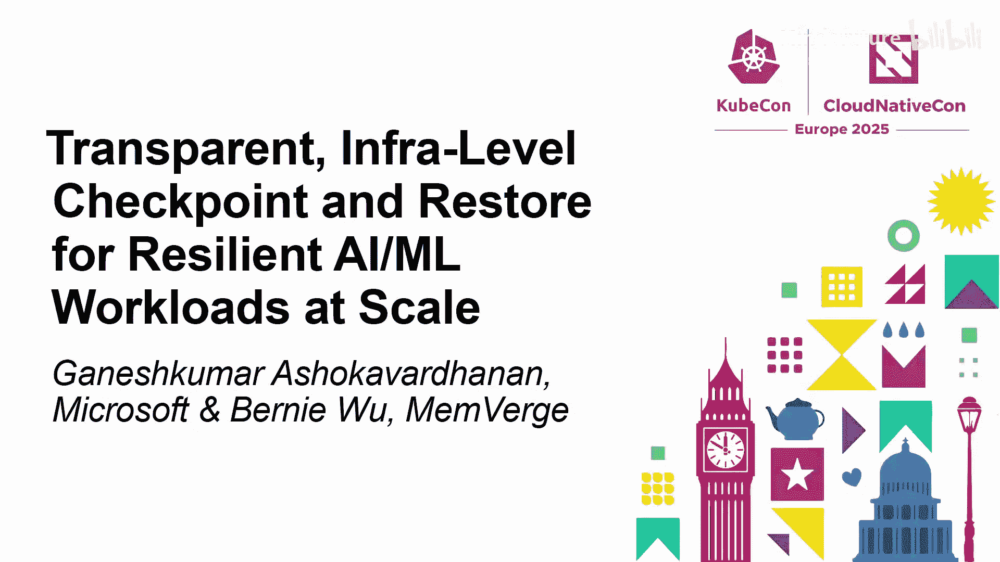
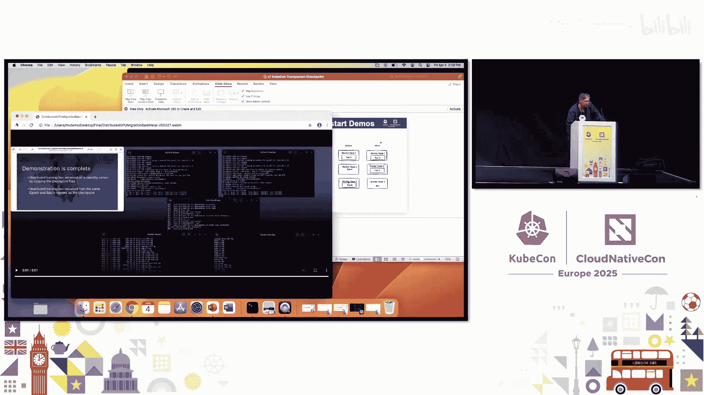
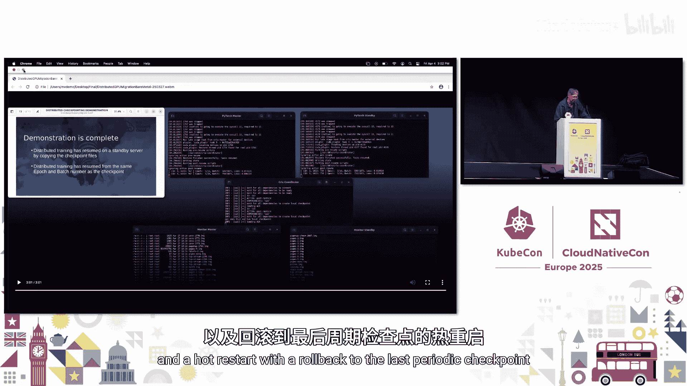
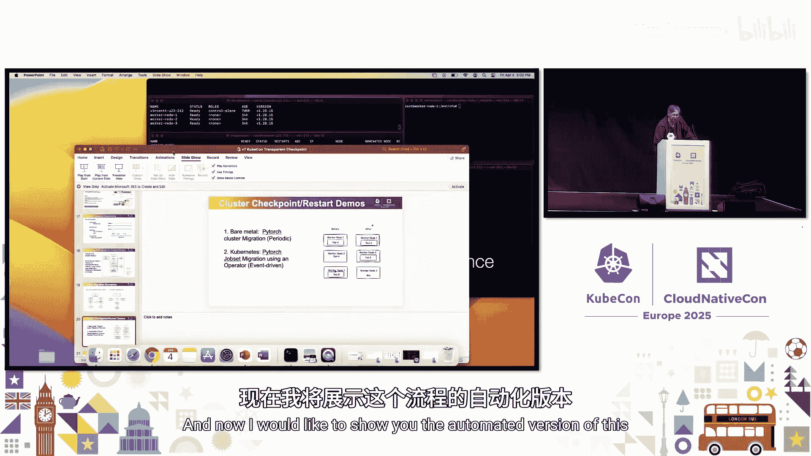
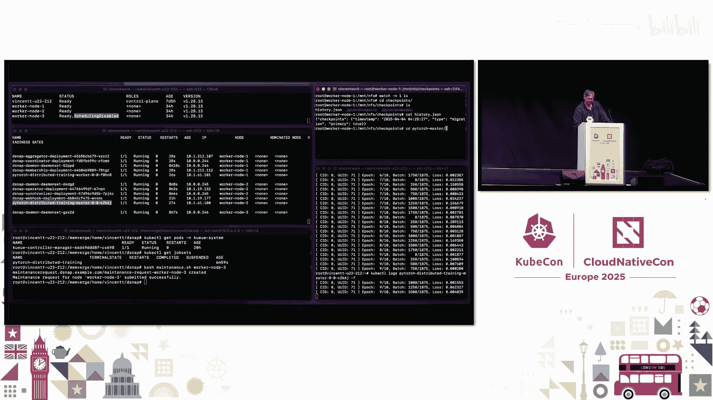
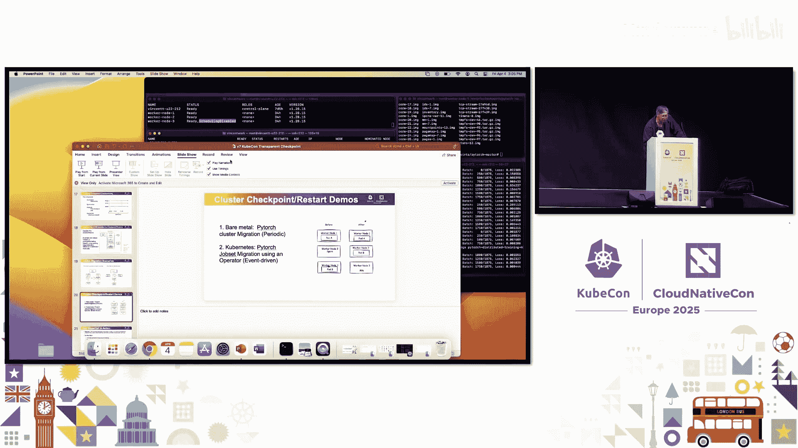

# 046：透明基础设施级检查点与恢复

## 概述

在本节课中，我们将学习一种提升云原生AI/ML工作负载弹性的关键技术：**透明基础设施级检查点与恢复**。我们将探讨其动机、定义、工作原理、应用场景、局限性，并通过实际演示来加深理解。

## P46.1：动机与现有方案

大家好，我是Ganesh，来自微软Azure Kubernetes服务团队。另一位演讲者是Bernie，来自Memverge公司。我们将探讨如何为弹性AI/ML工作负载实现基础设施级的透明检查点。

在开始之前，我们先进行一个简短的调查，了解大家面临的挑战。

以下是调查结果：
*   几乎所有人都曾在Kubernetes中运行过GPU工作负载。
*   几乎所有人对现有的弹性解决方案（如处理GPU故障或节点停机）不满意。
*   约一半的人更关心训练或微调任务的弹性。
*   几乎所有人都关注提升GPU基础设施的利用率。

这些挑战已被多项研究和报告证实。例如，LlaMA 3论文提到了GPU故障的频率，行业调查也显示约三分之一的用户GPU利用率低于或等于30%。

那么，当前是如何应对这些挑战的呢？

**现有方案一：GPU健康检查与补救**
许多用户运行集成了节点问题检测器的GPU健康检查，并结合补救控制器来采取行动，如重启节点或重置GPU。这有助于识别问题并采取缓解措施，但在高效处理应用方面仍有疑问，例如调度时间和缓慢的Pod启动。

**现有方案二：训练期间的模型检查点**
在训练过程中频繁保存模型检查点。如果节点宕机，可以从存储库恢复上一个检查点并继续训练。一些方法包括中断工作负载并将其迁移到新节点，或使用Kueue和Volcano等工具结合多实例GPU策略来简化流程。

然而，这些方法仍面临一些共同挑战，如端到端工作负载的加载和恢复时间慢、可能需要配置应用以支持从检查点恢复，并可能导致更高的成本。我们认为可以使其更具弹性。

## P46.2：定义与核心概念

上一节我们介绍了现有方案的挑战，本节我们来定义什么是**基础设施级透明检查点**。

*   **检查点**：指捕获运行中应用程序在某个时间点的完整状态，包括内存和所有关联文件，以便可以暂停、迁移并在之后热重启。
*   **透明**：指应用程序代码或框架无需更改。应用程序无需感知检查点过程。
*   **基础设施级**：指整个过程完全由编排器、调度器和平台本身处理，用户无需担心。

需要强调的是，这**不是模型检查点**。模型检查点只保存模型参数，而基础设施级检查点捕获的是容器内整个应用程序的状态。从使用角度看，真正关心此解决方案的是平台层的人员。

这是一个新兴话题，如果你刚接触，可能会有很多疑问：它的生产就绪程度如何？能否在不同GPU上恢复？能在哪些类型的机器上恢复？如何处理网络状态？执行这些额外计算需要多少时间？我们将在后续部分解答其中一些问题。

## P46.3：工作原理与用例

为了便于理解，我们可以做一个高层比喻：想象你是一个神经网络，正乘坐伦敦的双层巴士游览城市，学习并更新你的神经网络权重。不幸的是，巴士抛锚了。你的应用容器无法继续运行。接下来会发生什么？在你不知情的情况下，两分钟前的视图快照已被保存在大英博物馆。现在，我们希望能够恢复那个快照并继续运行。这就是检查点阶段。然后，你启动一个新节点继续运行应用，但无需经过特定应用逻辑，你就能从大约两分钟前恢复，并几乎像什么都没发生一样继续运行。因为你捕获了整个内存状态，它也会在此过程中恢复。

这有助于提高弹性，我们也将讨论它如何提升利用率。

以下是这种方法可以解决的一系列挑战，主要分为三类：

**1. 调度优化**
*   **抢占与优先级**：当有更高优先级的工作负载到来时。
*   **资源利用**：当有已调度但实际未利用的空闲资源时。
*   **Spot实例**：当可能随时被回收的Spot实例需要处理时。
*   **长时作业交接**：当长时运行作业需要被另一个作业接管时，需要一个无缝的过程来捕获状态、保存并恢复。

**2. 处理节点停机**
例如，处理原始图表中显示的GPU问题。你可以将此添加到端到端流程中，在GPU宕机前或排空节点时进行检查点，然后在迁移到新节点时恢复。

**3. 提升Pod启动时间**
许多公司已开始使用此技术来加速Pod启动时间。这些用例之所以成为可能，得益于加载新容器镜像和应用所需时间的缩短。

那么，有哪些AI/ML特定用例可以借此解决呢？

**推理场景**
许多人可能认为推理是无状态应用，但它真的无状态吗？根据定义，有状态应用存储过去和现在的信息，而无状态应用则不。对于LLM推理，你倾向于将键值缓存等值存储在内存中（包括GPU和CPU内存）。如果推理工作负载丢失，且KV缓存仅存在于原节点，那么这些内存将需要重新计算。通过透明检查点，有可能恢复该状态并继续运行应用，而无需大量重新计算。但一个要求是：重新加载KV缓存的时间必须少于重新计算它所需的时间。

**分布式ML训练**
在这个时间图表中，你可以看到检查点以固定节奏进行。需要说明的是，即使有了基础设施级检查点，模型级检查点仍会发生，因为模型级检查点对于实验和回滚到先前状态非常有用。我们将用基础设施级检查点来补充模型级检查点，可能进行更频繁的检查点，以便在两个模型检查点之间出现问题时进行恢复。在时间图表中，如果在检查点3和4之间发生故障，你将不得不从检查点3重新开始训练，这会浪费额外的GPU和CPU周期。在分布式训练中，集群中的许多其他节点也必须等待你的一个节点恢复并同步进度，因为在每个检查点结束时，它们通常需要同步梯度和权重。

## P46.4：局限性与权衡

上一节我们看到了检查点的强大用例，但这不是万能的，我们需要了解并解决一些局限性。

**局限性**
*   **检查点大小**：基础设施层不了解应用状态本身，这意味着与仅应用级检查点相比，检查点可能显著更大。例如，对于推理，模型本身会占用大部分空间，但加载到内存中的额外库和函数也会被复制。根据应用不同，两次检查点之间的内存差异也可能很大。
*   **恢复的严格性要求**：有时可能需要匹配机器配置，但这取决于所使用的检查点实现类型。显然，你需要在具有相同或更高内存的机器上恢复。
*   **资源考量**：计算所需时间会有所不同，这取决于采用**周期性检查点**还是**事件驱动检查点**。

**权衡分析**
下图是关于确定我们想要进行何种类型检查点所涉及的权衡的高层图表。
*   **Y轴**：运行工作负载的总成本。
*   **X轴**：检查点频率。

如果你的检查点频率非常低（即很长时间才检查点一次），检查点的额外计算开销会很低，但对错误的恢复能力和恢复时间会很高，因为如果出错，你可能需要重新计算大量工作。
另一方面，如果你检查点非常频繁，你的计算消耗将显著增加，整体弹性可能更好，但运行作业的总成本也会更高。
因此，我们需要找到一个最佳检查点频率，这将根据应用类型、GPU类型、错误率和其他因素而变化。

## P46.5：技术实现与演示

感谢Ganesh。正如他所讨论的，他已经定义了什么是基础设施级透明检查点，描述了我们看到的一些可能用例，也描述了检查点的局限性。现在我想深入探讨我们如何尝试为Kubernetes实现透明检查点。

一切围绕一个名为**CRIU**的开源项目展开。CRIU代表“Checkpoint/Restore In Userspace”，始于2012年，旨在检查点运行在Linux平台上的应用程序，并已广泛用于其他虚拟机平台的实时迁移。我的公司Memverge一直在使用CRIU作为公共云上长时运行HPC批处理工作负载的Spot实例迁移的一部分。此外，CRIU已被纳入Kubernetes，1.30版本支持容器的取证检查，这些容器就是由CRIU检查点的。去年在KubeCon巴黎，我简要介绍了我们与NVIDIA合作将GPU级检查点引入社区的工作，演示了一个可以对单个Pod上的工作负载进行GPU/CPU检查点并成功在其他地方重启的操作器。社区正在进行相关工作，他们为CRIU创建了一个非常棒的GPU插件，也将支持AMD GPU。

为了使这项技术适用于生产级工作负载，正如Ganesh提到的，我们需要解决检查点开销问题。在前一张幻灯片的U形曲线中，我们试图降低并拉平那条曲线，以获得一个非常高效的检查点技术。根据我们处理HPC批处理工作负载的经验，我们主要专注于减少检查点生产中断时间、检查点的空间消耗以及用于执行这些检查点的计算和内存资源。通过结合使用**异步检查点**、**压缩技术**和**增量检查点**，我们已成功应用于HPC工作负载。在异步检查点方面，我们能够将检查点生产中断窗口减少30到100倍。通过压缩，我们能够实现高达10:1的压缩比。增量快照也适用于处理抢占信号时间非常短的情况。我们希望将所有能力应用于Kubernetes问题。

操作化这种检查点还需要考虑安全问题。CRIU实际上必须在特权状态下运行，因为它需要检查点节点内的所有进程。此外，有时在检查点和迁移时，需要处理第三方许可证管理器。临时文件是另一个领域，目前允许将内存溢出到磁盘，并且工作负载中可能有临时文件，这些也需要被检查点并迁移到其他地方。

最后，我们继续与NVIDIA合作，改进检查点功能，例如支持分片GPU等，并提高整体性能和迁移到不同类型环境的灵活性。

**GPU检查点当前是一个两阶段过程：**
1.  第一阶段是暂停向GPU提交新任务（基于进程ID），等待特定进程完成，然后将其内存转储到系统内存。
2.  第二阶段是从系统内存（连同刚刚转储的GPU内存以及任何临时文件等）进行检查点，将所有内容转储到某个持久卷或目录。
恢复过程目前就是上述过程的逆序。

去年我展示了单节点检查点和热重启，我们希望将其扩展到分布式架构。其关键组件包括：
*   **高层协调器**：负责发现分布式集群的成员，通过映射所有工作节点之间的网络关系进行自发现，或查询JobSet API来查找工作节点。
*   **同步器**：确保所有工作节点在调用CRIU操作时并发执行。在CRIU设计中，有一个`pre-dump`阶段的操作脚本钩子，可以确保所有检查点同时发生；在检查点另一侧，有一个`post-dump`屏障，确保所有内容也同时释放。目的是确保没有传输中的消息因检查点不同步而丢失或损坏。
*   **Web钩子**：允许为特定应用提供检查点路径或持久卷路径。
*   **DaemonSet**：在每个主机上部署。我们使用修改版的`runc`，`runc`通常会从注册表拉取冷启动容器，但在这里，`runc`会去有检查点的目录路径加载镜像。

为了自动化这一切，我们将其放入一个**操作器**中。该操作器的目标是实现工作负载（无论是单个应用还是分布式应用）的优雅抢占和热重启。我们将其视为减少移动或休眠有状态长时运行工作负载摩擦的一种方式，许多AI/ML工作负载都具有这种特性。

有两种实现方式：作为Sidecar或通过DaemonSet部署。为了用于节点维护，我们将其实现为DaemonSet部署。除了修改`runc`以指向检查点路径加载检查点镜像外，其他基本都是现成的组件。

我们正在研究的一个用例是**JobSet迁移**：
1.  **调度器驱动迁移**：调度器将特定分布式集群中的一组Pod整体移动到其他位置，可用于帮助碎片整理基础设施或优先处理更高优先级作业以接管资源等。
2.  **节点维护迁移**：在会议期间我发现，几乎90%的GPU故障实际上可以通过排空节点并重启来纠正。因此，我们处理分布式集群，但只将故障节点或有问题节点迁移到一个热备节点，然后可能重启热备节点。我认为在预测哪些节点可能故障方面也取得了很大进展，这种技术将有助于已知的维护。

## P46.6：演示环节

在演示之前，我想解释一下我们要做什么。为简单起见，每个演示中我们只有三个工作节点。

**演示一：手动周期性检查点（裸金属）**
这是一个两节点PyTorch分布式集群的裸金属演示。我们将使用周期性检查点。你会看到我们手动触发检查点并模拟故障，然后故障转移到备用节点并恢复操作。因为是周期性的，你会看到它回滚到检查点发生时的epoch。

（演示过程：展示两个工作节点运行PyTorch分布式任务，显示epoch和batch滚动，验证GPU运行，显示TCP连接。手动触发协调的检查点，应用继续运行。将检查点文件手动复制到备用节点，杀死原工作节点，切换到备用节点监控。调用检查点协调器进行恢复，文件重新加载，系统重启，日志恢复滚动，并回滚到约epoch 5。）

**演示二：自动化事件驱动检查点（JobSet迁移）**
这个演示展示更自动化的过程，速度更快。这是一个事件驱动的JobSet迁移。事件是我们输入命令将节点置于维护状态，系统会自动将该节点置于维护状态，将工作负载迁移到备用节点并恢复操作。这一切都是通过Kueue和JobSets完成的。

（演示过程：展示三个节点和一个主节点的设置。使用Kueue项目将工作负载从节点3迁移到节点1。展示名为“PyT分布式训练”的JobSet。触发维护shell脚本，指定节点名。自动化过程开始：原容器终止，新容器在另一节点创建。日志显示工作负载几乎从离开的地方恢复，例如在epoch 9， batch 1000处继续。）

## P46.7：总结与下一步行动

我今天展示的是，我们证明了使用一个操作器来透明地检查点和热重启分布式PyTorch AI/ML工作负载以提高其弹性的可行性。

我们的下一步将是继续推进这项工作（可以称为爬、走、跑阶段）：
*   **开销优化与特性分析**：如何扩展规模。我们相信它应该具有高度可扩展性，因为检查点过程可以在每个节点上并行完成。
*   **后端网络**：可能从RDMA类连接开始。
*   **遥测与集成**：集成Prometheus。
*   **社区合作**：继续与Kubernetes和CRIU社区合作，改进功能和能力，并回馈社区。

**对大家的呼吁**：我们非常感谢任何反馈、评估或特定用例。如果你愿意早期尝试，那将很棒。我们非常有兴趣与调度器社区、编排器甚至应用框架合作，探索在此上下文中使用检查点或协调检查点的可能性，同时也关注Spot实例。我们希望继续扩大规模并进行验证。

感谢大家。我们稍后可以在走廊回答问题，也会上传幻灯片供参考，并附上之前相关演讲的链接。

---
**本节课总结**：我们一起学习了**透明基础设施级检查点与恢复**技术。我们从AI/ML工作负载面临的弹性挑战出发，定义了该技术的核心概念（检查点、透明、基础设施级），探讨了其在调度优化、节点故障处理和启动加速等方面的应用场景，也分析了其局限性与权衡。通过深入技术实现细节和观看实际演示，我们了解了如何利用CRIU等项目在Kubernetes中实现分布式工作负载的检查点与热重启。最后，我们看到了该领域的下一步发展方向和社区合作机会。这项技术有望显著提升昂贵GPU资源的利用率和AI工作负载的韧性。