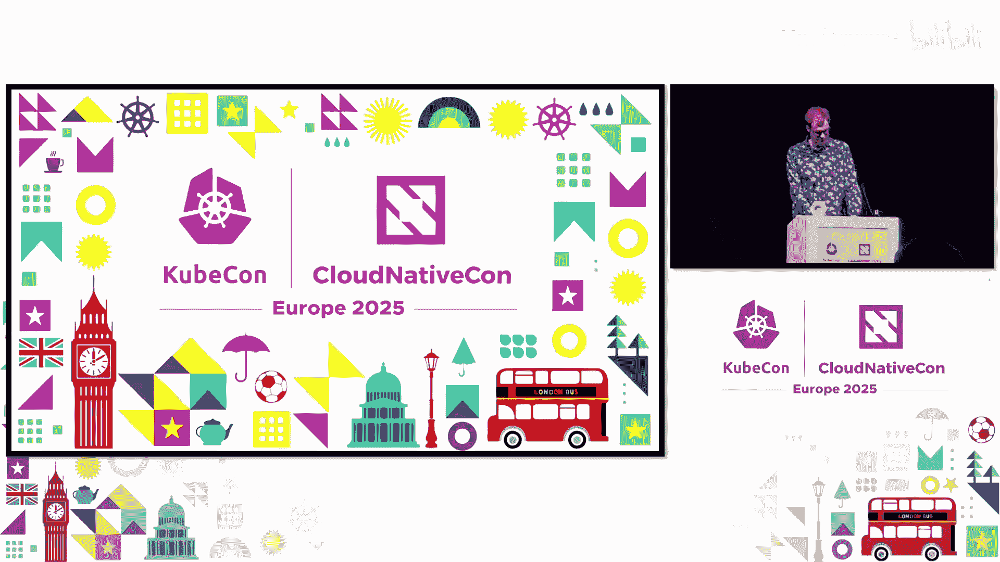

# 047：将超级计算机一对一映射到Kubernetes 🚀

在本教程中，我们将学习如何利用名为 **Subernetes** 的项目，将高性能计算（HPC）或超级计算机环境与云原生平台（Kubernetes）进行集成。我们将探讨两者的异同、集成的挑战，以及Subernetes如何作为一个“透明桥梁”来实现资源的统一管理和调度。

---

## 概述：云与高性能计算的异同

上一节我们介绍了课程背景，本节中我们来看看云计算与高性能计算在基础理念上的核心区别。

在最高层面上，云计算与高性能计算的区别如下：
*   云计算假设**资源是无限的**，而**需求是有限的**。
*   高性能计算则假设**资源是有限的**，而**需求是无限的**。

在实践中，这意味着：
*   云工作负载通常绑定在少量节点上运行，没有并行运行大量工作负载的能力。
*   高性能计算方面，单个工作负载可以跨越整个系统，仅受节点总数限制。

最初，这描绘了一幅图景：为云与为高性能计算平台构建应用时，存在根本不同的假设。然而，随着当今市场中人工智能工作负载的出现，情况发生了转变。如今，云和高性能计算的需求看起来越来越相似。工作负载对资源的需求在增加，而平台的限制开始显现。

---

## 架构对比：Kubernetes 与 Slurm

上一节我们了解了宏观差异，本节中我们深入到软件架构层面进行对比。

现代高性能计算和云的硬件实际上非常相似。因此，我们重点关注它们之间的不同之处，具体来说，是**软件栈**。
*   如今大多数云平台运行 **Kubernetes**。
*   而许多高性能计算系统运行名为 **Slurm** 的调度器。

简化到最基本的形式，我们可以观察到Kubernetes和Slurm在本质上是**非常相似的分布式系统**。

以下是两者架构的对比：

1.  **客户端/用户**：系统的使用者，通过API接口交互。
    *   Kubernetes端是 **API Server**。
    *   Slurm端本质上是通过批处理脚本调用的一系列命令。
2.  **控制器**：在两种系统中，都有一组控制器来改变和跟踪状态（包括用户部署的工作负载）。
3.  **数据库**：两种系统都依赖数据库来存储状态。
4.  **节点代理**：两种系统都有一组节点代理（每个节点一个），负责工作负载的实际执行。

两者之间的主要区别在于**组件之间的通信方式**。Kubernetes拥有管理一切的API Server，所有组件都连接到它。而在Slurm中，情况稍微复杂一些。

然而，即使在组件级别上架构看起来很相似，但高层架构和目标实际上**相当不同**。

*   **Kubernetes的优势**在于其**多功能性和调和（Reconciliation）能力**。你几乎可以在任何地方部署Kubernetes，其自我修复能力确保系统在升级和部分故障时持续运行。
*   **Slurm的优势**在于其作为HPC调度器，擅长**调度大规模多节点工作负载**，并能优化处理现代HPC系统和超级计算机中存在的复杂硬件拓扑。

在缺点方面：
*   Slurm相比Kubernetes暴露了**更低层次的抽象**。
*   Kubernetes目前在硬件控制方面的接口**有些有限**。
*   尽管社区在努力改进部署的简易性，但设置一个Kubernetes集群（尤其是在HPC规模上）仍然是一个有些复杂的过程。

我还将重点强调今天关注的Slurm生态系统中两个关键缺点：
1.  与Kubernetes相比，HPC软件栈**更加脆弱**，例如软件升级不是无缝的。
2.  **缺乏安全的**多租户和高可用性支持。

---

## 解决方案：引入 Subernetes

上一节我们看到了两个生态系统的优缺点，本节中我们来看看如何将它们结合起来。

大约一年前，这是我硕士论文研究的起点。我的探索始于Lumi超级计算机（目前世界排名第八，位于芬兰）。然而，我发现Lumi是此类研究中最棘手的超级计算机之一，我尝试的所有现有解决方案都无法工作。因此，我论文的范围突然扩大了很多。

于是，**Subernetes** 诞生了。

Subernetes是我的硕士论文项目，旨在**弥合云与高性能计算之间的鸿沟**。它是一个所谓的“透明桥梁”，将Kubernetes环境和Slurm环境连接在一起。关键是，Subernetes确实可以在Lumi上工作。

以下是Subernetes的架构，内容很多，让我们一步步了解其工作原理：

1.  顶部是一个Kubernetes集群，底部是一个HPC环境（本例中是Lumi）。
2.  在Lumi上，我们有一组节点。
3.  部署Subernetes时，它本身包含两个组件：
    *   **控制器**：作为一个Pod运行在你的Kubernetes集群中。
    *   **代理**：一个在HPC登录节点上启动的进程。
4.  首先，代理通过MTLS保护的gRPC反向隧道连接到控制器。
5.  然后，控制器请求代理发现HPC侧的节点。
6.  对于每个节点（一对一），控制器随后部署一个 **Virtual Kubelet** 实例。这本质上是一个没有后端部分的Kubernetes节点的虚拟表示。
7.  假设你部署了一个Pod（可以直接部署或通过Job等方式）。控制器会获取你的Pod，将其传递给代理。
8.  代理然后使用Slurm命令将其作为一个Job分发。在这个例子中，该Job被拆分成在两个节点上并行运行的两个任务。
9.  这些新Job被观察，并创建对应的Pod。它们的状态、日志等所有元数据都会在Virtual Kubelet节点上**双向同步**。我们需要这些所谓的“影子Pod”，因为无法像在HPC系统中通过任务拆分Job那样，在Kubernetes中将一个Pod跨节点拆分。
10. 最后，Subernetes将Job创建的Pod与你最初部署的Pod关联起来，让你可以像Pod原生运行在Kubernetes上一样查看状态和日志，因此它是完全透明的。
11. 自然地，HPC环境中运行的任何其他Job也会被观察和调和，从而使Kubernetes中的Virtual Kubelet节点能够获得其对应HPC集群节点状态的完整视图。这一点很重要，如果你在Kubernetes侧使用调度器，它们可以利用节点和Pod指标来做智能调度决策。

这一切的实现离不开强大的云原生GitOps工具 **FluxCD**（简称Flux），我修改并将其集成到Subernetes中以实现一致的同步。同时，也要感谢 **Virtual Kubelet** 项目的所有工作，它是首先将整个HPC系统镜像到Kubernetes的骨干。

---

## 功能对比：现有桥接方案

上一节我们深入了解了Subernetes，本节中我们拓宽视野，看看市场上还有哪些类似的解决方案。

Subernetes并非HPC到云桥接领域的唯一项目。以下是目前旨在弥合云和HPC生态系统差距的六个项目：

1.  **InterLink**
2.  **HPK**
3.  **Subernetes**（最近开发和维护的三个）
4.  **Knoc**（HPK的前身，已弃用）
5.  **KFoundry**（在之前的KubeCon上展示过，但据我所知仍未公开）
6.  **SlurmK8s Bridge**（来自Slurm开发者SchedMD的官方解决方案，但尚未开发）

以下是这些解决方案的关键能力对比：

*   **将K8s工作负载部署到HPC**：所有方案都能以某种方式实现。
*   **将HPC工作负载同步回K8s**：**只有Subernetes**能做到。
*   **为K8s提供完整的节点视图**：**只有Subernetes**能做到，这对于使用云原生调度器至关重要。
*   **暴露完整的HPC节点结构**：**只有Subernetes**能做到。
*   **处理HPC防火墙**：这是一个普遍挑战，Subernetes和InterLink需要复杂变通方案，HPK可能不需要，SlurmK8s Bridge尚无法评估。

然而，尽管Subernetes很强大，它也无法解决我之前强调的两个关键HPC环境问题：即**HPC侧的安全多租户和高可用性**。实际上，目前所有的HPC桥接解决方案都无法解决这个问题。

---

## 核心挑战：多租户与高可用性

上一节我们对比了各种方案，本节中我们重点分析当前HPC环境自身存在的两个核心挑战。

让我更详细地解释这两个问题：

**1. 多租户安全问题**
你可以把这想象成经营一家酒店。租户是预订房间进行工作和存放物品的客户。在这个语境下，租户可以是来自不同AI公司、从事不同项目、训练大语言模型的开发人员或团队。“工作”是训练过程，“物品”是训练数据和生成的模型。

目前，我们的“Lumi酒店”需要容纳大约3400人。为了正确支持多租户，租户之间必须相互隔离。在我们的酒店里，房间之间有墙（Unix权限防止直接访问其他租户的数据）。然而，我们的酒店房间门上**没有锁**。另一个租户可以直接走进网络走廊，进入任何其他租户的房间（例如，对方可能正在运行Jupyter Lab环境）。通过该环境，他们就可以访问第一个租户存放在房间里的机密数据和模型。

用技术术语来说，我们**没有内核或用户命名空间**。而且，由于我们也没有进程命名空间，房间之间的墙也是透明的，你基本上可以看到所有其他租户当前在做什么。在Kubernetes方面，已有成熟的解决方案来解决这些问题，例如利用网络策略（Network Policies）、SPIFFE/SPIRE和Cilium来“安装门锁”。容器本身也默认提供了不透明的“墙”，因为它们隔离了你的进程。

**2. 高可用性问题**
与云不同，HPC领域的硬件故障和软件升级常常涉及**停机时间**。这是一个成本效率问题。以Lumi为例，总成本约1.5亿欧元，计划寿命5年，年均摊销成本为3000万欧元。据此计算，**一天的停机时间成本约为8.2万欧元**。在过去一年中，Lumi经历了多次停机事件。如果累计起来，这代表了**28天的连续停机时间**。想象一下你的云平台离线一个月，这听起来很疯狂。使用相同的公式计算，这相当于**230万欧元的HPC系统容量无法使用**。而Lumi的继任者已计划投入2.5亿欧元，未来停机时间的成本很可能保持不变或增加。

---

## 未来愿景：无缝集成路线图

上一节我们明确了核心挑战，本节中让我们登上“无缝集成列车”，展望一下未来的解决方案。

我们从今天的车站（基础案例）出发，即像Lumi目前的设置：一个单一的HPC环境，所有租户共同访问。

**第一站：插入Kubernetes层**
首先，我们将用户层上移，然后插入一个**新的、支持Kubernetes的云环境**。为了保留Slurm的优点同时避免其缺点，并利用Kubernetes的优势，租户现在在**作为Pod运行在Kubernetes内部的、隔离的Slurm集群**中操作。这目前已由至少三个项目实现：SlurmK8s Operator（SchedMD）、Sunk（Curve）和Opera（Nebius AI）。

**第二站：桥接现有硬件（Stopgap Station）**
显然，我们仍然希望利用当前由裸机上现有Slurm安装管理的实际HPC硬件。这时，HPC云桥接方案（尤其是**Subernetes**）就派上用场了。Subernetes旨在将底层硬件和Slurm足够忠实地暴露给Kubernetes，以支持在Kubernetes集群内运行HPC调度器。这是在现有软件栈之上评估新环境的关键组件。到达此站，标志着一个**中间检查点**，可以在最小化对现有HPC客户和平台干扰的情况下实现。

**第三站：消除桥接，直接控制（最终站）**
当我们准备好进一步推进时，Subernetes连同底层的裸机Slurm安装实际上可以**被完全消除**。最终，Kubernetes可以直接下沉来控制硬件。至此，我们实现了结合云和HPC优势、同时最小化各自缺点的目标。

但为什么停在这里呢？在此过程中，我们还获得了运行云原生批处理生态系统、替代HPC调度器（如Flyte框架）甚至完全自定义流水线的“超能力”。并且，得益于社区中的各种多集群解决方案，将这个新的混合环境连接到外部云也不再是问题。不再需要临时的桥接方案，也无需重复造轮子，只有一个统一的现代平台来构建超级计算的未来。

---

## 总结与展望

本节课中我们一起学习了如何通过Subernetes等项目将高性能计算与云原生生态集成。

总结来说，我们作为一个社区，需要从现在开始思考如何将HPC连接到云。目前，我们已经有一套HPC桥接解决方案（包括Subernetes）可以作为过渡。在向更好解决方案过渡的过程中，我们需要注意改善HPC的安全状况和高可用性。

我希望今天能让大家相信，**Kubernetes是应对这些挑战的优秀候选者**。我们无需重复发明轮子，只需要社区为了更大的利益而携手合作。

最后，如果这个演讲引起了你的兴趣，欢迎联系我。我正在完成关于Subernetes的硕士论文，并寻找有趣的工作机会，让这种转变成为现实。

---
**本节课中我们一起学习了：**
1.  云计算与高性能计算在理念和架构上的根本区别与相似之处。
2.  Kubernetes和Slurm作为调度系统的核心异同及各自优劣。
3.  **Subernetes** 如何作为透明桥梁，实现Kubernetes与Slurm间工作负载和状态的双向同步。
4.  当前HPC环境面临的多租户安全和高可用性核心挑战。
5.  从当前状态到未来完全集成的分步演进路线图。
6.  社区合作与利用现有云原生技术（如Kubernetes）是推动超级计算现代化的关键。