# 048：在科学领域测试用于数字孪生的人工智能容器——一个云HPC方案

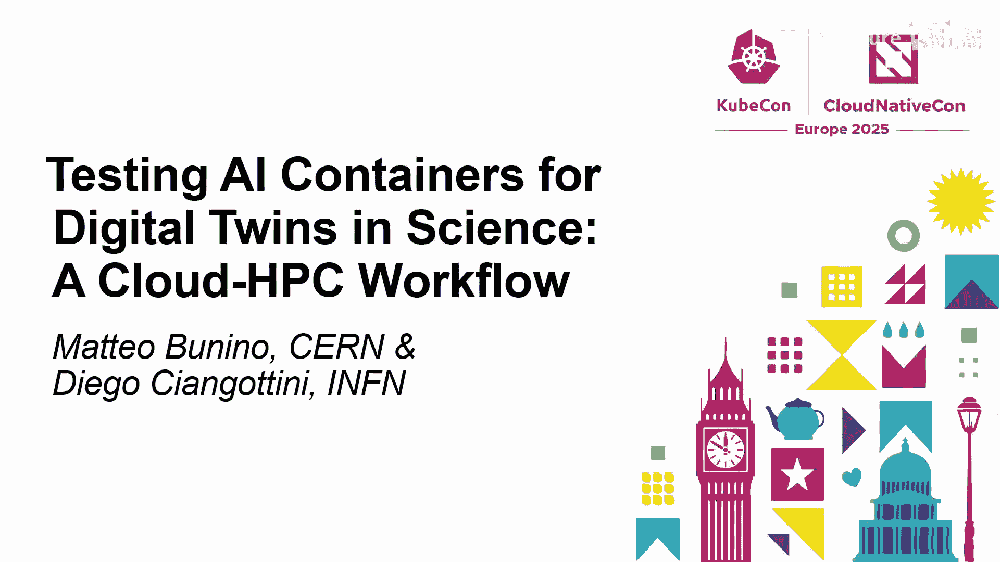

## 概述

在本教程中，我们将学习如何构建一个平台，用于在云与高性能计算（HPC）融合的场景下开发和创建数字孪生。我们将探讨如何利用云原生技术（特别是Kubernetes）和工具（如InterLink和Dagger），为异构的分布式计算资源提供统一接口，并实现可重复、可观测的自动化测试与部署流程，以支持科学领域的数字孪生应用。

---

## 1. 背景与挑战

大家好。今天我们将讨论一个非常特别的主题：我们如何成功开发并创建一个用于开发数字孪生的平台。

首先进行自我介绍。我来自意大利国家核物理研究所。与我同台的还有来自CERN开放实验室的同事。我们从事粒子物理研究。

那么，我们为何在此讨论数字孪生？这背后有多个原因，并且今天展示的内容涉及多个正在合作的研究所和项目。这里提供一些链接供大家后续深入了解。

数字孪生是什么？有一句话很好地概括了其本质：**数字孪生是现实世界系统的数字化表示**。例如，预测野火蔓延并希望模拟灾害发生时的情景，或者理解洪水对地貌的影响。此外，还有其他非常有用的数字孪生应用，例如之前讨论过的粒子探测。我们拥有用于拍摄粒子间相互作用细节图片的大型相机，为何不为这些大型相机创建一个数字孪生来简化工作呢？同样，对于需要精确测量的噪声，我们可以模拟噪声，或者训练机器来模拟现实环境中的噪声。

基于这些具有相似需求的使用案例，我们开始研究创建一个数字孪生引擎的可能性。这个引擎将服务于多个社区，并使他们能够采用和使用跨不同提供商共享的资源。我们正在一个名为InterTwin的欧洲项目中推进这项工作。

在一端，我们有资源提供商，范围涵盖云提供商到EuroHPC超级计算机。在另一端，用户使用各种框架来构建他们的数字孪生。

挑战在哪里？首先，必须提供一个能够支持所有不同用例和不同框架的平台。其次，必须将其与在不同类型后端（这些后端不一定能直接运行云负载）上运行负载的能力相结合。最后，由于存在多种后端，我们希望尽可能保持所有软件的互操作性，以便在任何类型的后端上复现完全相同的资源。

简而言之，挑战在于我们拥有**分布式的异构资源**，然后需要在顶层提供一个**通用接口**。由此产生两个问题：如何让用户访问这个平台？以及如何保持所有工作流彼此一致？例如，从软件和容器生态开始，它们可能来自不同的容器运行时接口。

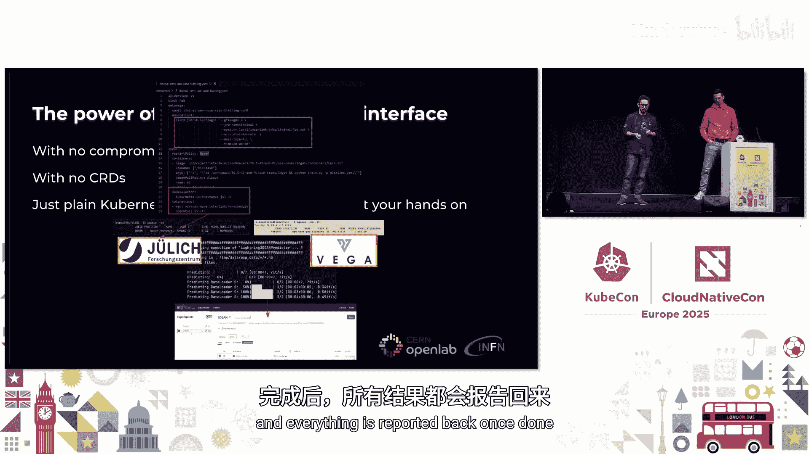

幸运的是，在粒子物理等领域，我们开始向一套云原生工具集收敛。我们面对的主要接口在大多数情况下是Kubernetes。因此，我们只剩下一个问题：如何将Kubernetes API访问与不同类型的资源融合？

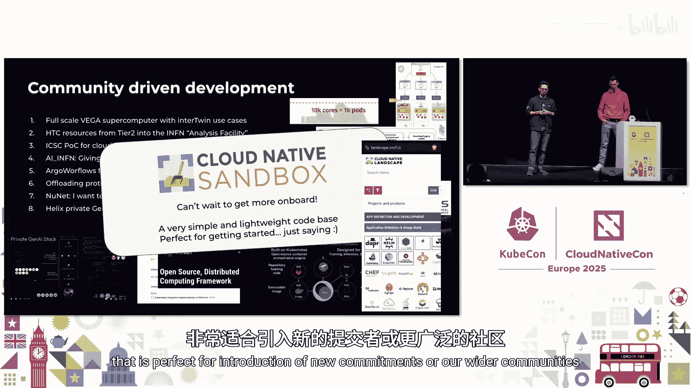

之前关于量子计算的讨论也面临类似的挑战。周二有一场关于InterLink技术的精彩演讲。这里简要介绍其解决方案的核心思想：创建一个插件式系统，在我们希望通过Kubernetes集群控制的远程资源之上放置适配器。我们努力使提供商端的侵入性要求尽可能低。基本上，你只需将你的边缘节点接入，就可以创建一个基于虚拟Kubelet技术的虚拟节点，该节点能够将Pod调度到你的Slurm超级计算机上。

选择这种方式的原因在于，我们能够为用户提供无妥协、无障碍的Kubernetes接口访问。一切就像运行普通的Kubernetes一样。你拥有带注解的Pod，选择一个虚拟节点，然后你的机器学习任务或数字孪生工作负载就会在超级计算机上启动，完成后所有结果都会返回。

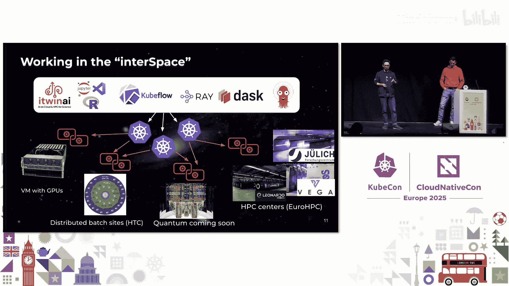

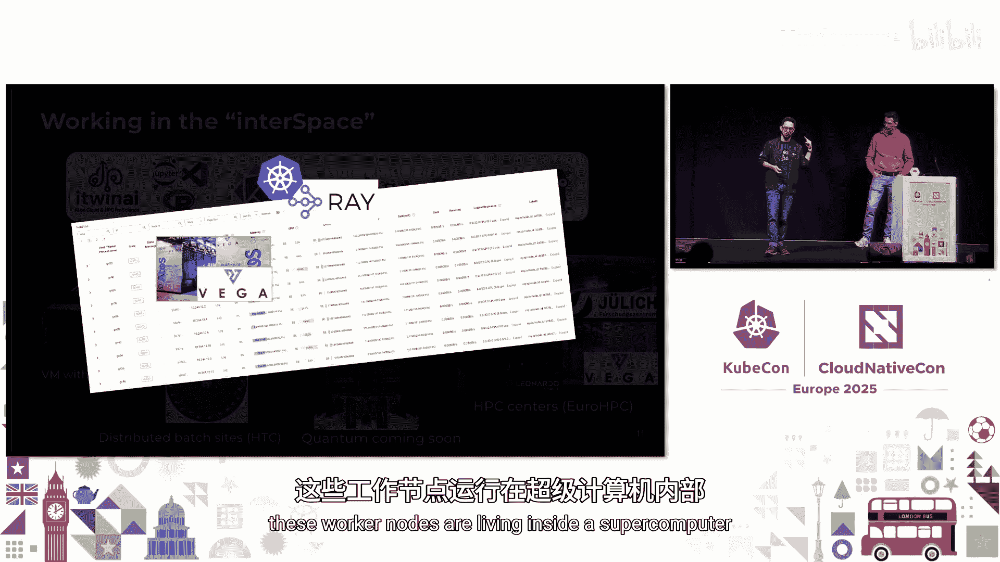

当然，这是一个社区共同努力的结果。社区对如何接入自己的提供商非常感兴趣。事实上，列表中不仅有科学用例，还有尝试以这种方式接入其容器即服务解决方案的企业。

最新消息是，该项目现已加入CNCF云原生沙箱。我们借此机会说明，这是一个非常精简和简单的接口，非常适合引入新的贡献者或更广泛的社区，我们非常期待更多人加入。

---

## 2. 解决方案架构：InterLink与统一接口

上一节我们介绍了在异构资源上运行数字孪生的核心挑战。本节中，我们来看看具体的解决方案架构。

我们拥有一个“中间空间”，即一组可以在不同Kubernetes集群上运行的框架。多亏了InterLink适配器，这些框架可以运行在带有GPU的虚拟机、像HTCondor这样的HTC系统上。我们正在尝试探索在Galicia超级计算机和量子计算上能做什么。此外，我们还有HPC中心，我们需要这类中心来创建数字孪生。

例如，我们从在笔记本电脑上运行Kubernetes开始。这会启动不同的工作节点，但请注意：这些工作节点实际上存在于一台超级计算机内部。整个过程对用户是无缝且完全透明的，用户完全感知不到底层细节。一切都在后台自动完成。

现在我们拥有了强大的能力，同时也承担了巨大的责任。因为我们需要为用户提供一致的环境。换句话说，我们需要一艘“宇宙飞船”。这艘飞船需要为我们提供工作流的一致性，我们需要检查工作流，需要可重复的结果。是的，我们可以利用现有的CI系统来实现，但这通常意味着将自己锁定在定制解决方案中，或者陷入众所周知的复制粘贴噩梦。

我们为此选择的解决方案是**Dagger**。它本质上是一个运行时，旨在创建可组合的软件。我们科学家热爱可组合的事物，因此我们研究了它，并且取得了相当不错的进展。现在我们能够实现结果的可重复性，能够以高效的方式组合所有软件，并且还能在构建和测试时观察发生了什么。

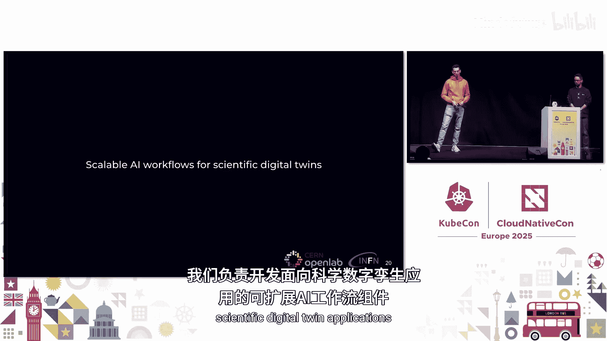

此外，我们拥有一个通用的DSL系统，可以高效地编写流水线代码。我们有一个无服务器平台，为我们的构件提供缓存，并具备内置的可观测性。最后，它还与LLM原生集成，这在未来几年可能会很有用。

当前的情况是，不同模块各司其职，可以组合起来创建不同的流水线。首先，你可以在自己的笔记本电脑上运行这些流水线。但完全相同的流水线，我们也可以在CI系统中的Docker引擎上运行。最后一个好消息是：在你的本地机器和远程机器之间传递的这个沙箱也可以托管一个“想象”，因此我们可以基于拼图中的各个部分来改进我们的工作流。我们还以弹性和高效的方式打包和分发所有软件。

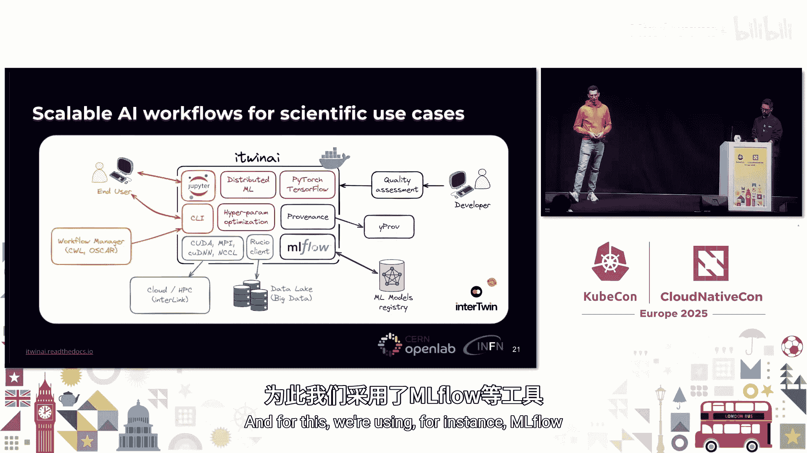

更多细节，请参考演示中提供的链接。现在，我们拥有了一个“接口空间”和一个“Dagger宇宙”，它们能够匹配，并通过Kubernetes集群提供在外部资源上运行的能力。而这些Kubernetes集群也可以在我们的CI流水线沙箱中运行，确保我们在将更改推送到生产环境之前，具备进行全面检查的能力。我们还在使用其他用例中也在使用的优秀模块。到目前为止，情况相当不错，我们非常满意。

---

## 3. 实践案例：I2AI与分布式AI工作流

上一节我们介绍了InterLink和Dagger如何提供统一的接口和可组合的CI。本节中，我们来看看在实践中如何利用它们进行具体的数字孪生开发。

首先介绍一下，我来自CERN开放实验室，这是CERN内部负责与工业界和学术界建立合作的实体。我们始终对新的合作持开放态度。正如之前所说，我们对数字孪生感兴趣，例如我们正在参与InterTwin项目。

在这个项目中，我们负责开发一个用于科学数字孪生应用的可扩展AI工作流组件。该组件实现为一个名为**I2AI**的Python库。你可以将其想象成一个工具包，为科学家提供不同的功能，以支持分布式机器学习训练、分布式超参数优化，支持PyTorch和TensorFlow，并且非常注重机器学习追踪，例如跟踪训练期间生成的机器学习元数据，还允许你连接到模型注册表来存储和版本化管理模型等。为此，我们使用了诸如MLflow等工具。

当谈到分布式机器学习训练时，我实际上考虑两种不同的模式。一种是纯数据并行分布式训练，模型在不同节点、不同GPU上复制，数据被分区，每个模型的本地副本将访问数据的特定子集。另一方面，我们也支持模型并行以及混合模式（模型并行与数据并行），如右图所示。在这种情况下，模型太大，无法放入单个GPU，这对于如今基于Transformer的非常大的语言模型来说很常见。此时，模型分布在多个GPU上。为此，我们依赖流行的框架，如PyTorch、Horovod、Ray和DeepSpeed。

另一个关键特性是超参数优化。在这种情况下，你可以定义一个训练调优配置，在其中指定超参数的范围。然后，I2AI训练器将确保在HPC基础设施上以并行和优化的方式运行各个训练试验。为此，我们使用Ray Tune。

让我们看一些已经集成到I2AI中的InterTwin数字孪生用例示例。第一个用例涉及环境科学领域，专注于水文建模和开发AI模型以改进干旱早期预警。另一个来自物理学，我们与从事Virgo干涉仪数据研究的团队合作，该仪器用于测量引力波信号。他们希望使用基于AI的模型来对探测器捕获的信号进行去噪。

这里我们可以看到使用I2AI进行的可扩展性分析示例。在左侧，我们比较了不同分布式框架在同一模型和数据集上的扩展情况。在右侧，我们看到了一个能耗基准测试示例。我们还对研究不同分布式框架在特定模型、特定用例和特定数据下的能耗情况感兴趣，换句话说，是为了突出不同的权衡。

另一个例子是，我们使用I2AI对水文建模模型进行超参数优化。通过I2AI，我们能够将验证损失降低近75%。

但是，我们如何确保在I2AI中开发的代码始终保持一致呢？I2AI是位于流行分布式机器学习框架之上的抽象层。用户提供训练配置和调优配置，然后训练器将抽象出底层的复杂性，这些复杂性基本上是不同的分布式机器学习框架以及HPC基础设施。

当然，我们可以编写一些测试，我们也确实这样做了。我们有一些单元测试和集成测试，用于测试我们为记录器或某些实用函数开发的抽象层，或者对任何功能进行通用的单元和集成测试。这些是传统的单元和集成测试，可以在任何地方运行，不是本次演讲的重点。

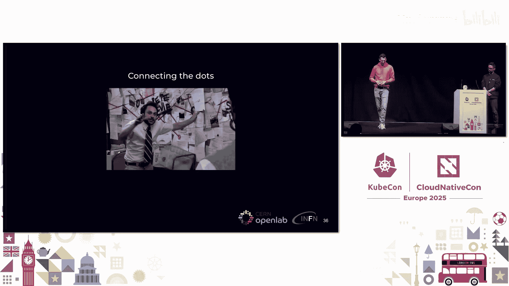

问题在于，I2AI的某些功能本质上是分布式的。我们如何测试这些功能？例如，工作进程排名分配。在数据并行训练中，分配给特定GPU的每个进程也被分配不同的排名，这些排名在集体通信（工作进程之间的通信）中是必需的。我们如何在笔记本电脑上测试这个？当然不能，我们需要特定的基础设施。集体操作（如all_gather、gather、barrier等）也是如此。那么，我们如何确保我们的软件正确实现了这些操作？

其他例子包括在分布式机器学习设置中保存和加载检查点，对分布式机器学习训练进行集成测试，以及测试我们是否可以在超参数优化下运行分布式机器学习训练。这里存在一种层次结构：高级别的分布是超参数优化，而每个试验本身也是分布式的。我们如何测试这个？

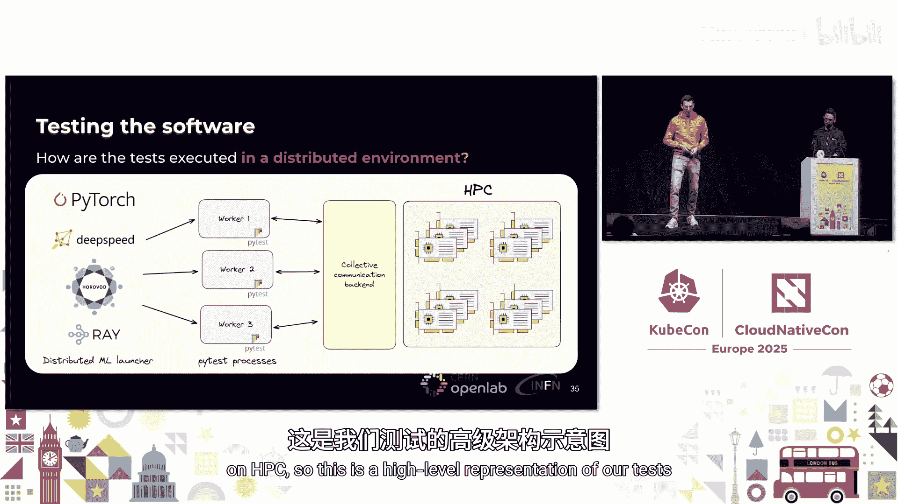

这正是本次演讲的主题。我们还希望对所有实际使用的框架重复这些测试，你可以看到这里正在构建一种矩阵。

---

## 4. 自动化测试流水线：集成Dagger与InterLink

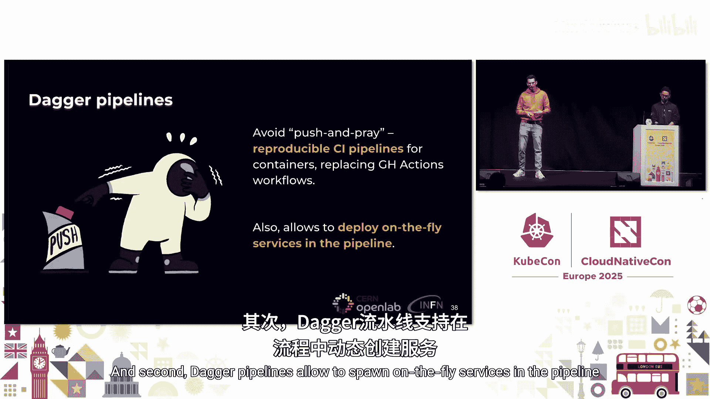

上一节我们探讨了测试分布式AI工作流的挑战。本节中，我们来看看如何利用Dagger和InterLink构建一个自动化的端到端测试流水线。

在实践中，我们如何运行测试呢？我们拥有与分布式机器学习框架兼容的分布式启动器。例如，对于PyTorch DDP，有`torchrun`命令，它可以启动多个进程，每个进程基本上就是一个`pytest`命令。然后，每个测试用例将使用分布式机器学习框架提供的集体通信后端与其他测试用例进行通信。这样，整个测试就可以在HPC上运行。

这是一个我们测试的高级表示。现在，让我们把所有内容整合起来。我们看到了数字孪生、HPC、AI、水文建模、引力波，内容很丰富。但在实践中，我们如何自动化在HPC上的测试呢？我们的代码在GitHub上，在GitHub上我们也维护CI工作流，如软件质量评估、单元测试，我们在HPC上构建Docker容器。但是，我们如何将HPC资源集成到GitHub中呢？

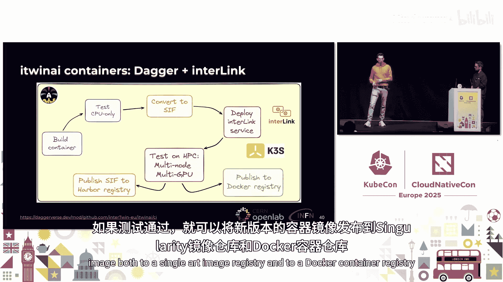

第一个要素是**Dagger流水线**。其最大的好处在于，你可以避免“推送并祈祷”的模式，拥有一个可重复的CI，可以在你的笔记本电脑上运行，也可以在GitHub上运行，无论在哪里，结果总是一样的。它基于容器，这对我们来说非常有用。其次，Dagger流水线允许在流水线中动态启动服务，这对于下一步与InterLink结合非常有用。

在左侧是云侧，GitHub调用CI流水线（基本上是Dagger流水线）。在右侧是HPC，即远程的HPC超级计算机。它们使用不同的技术。在云上，在GitHub上，我们可以构建Docker容器。但当我们需要在HPC上运行时，实际上需要Singularity容器。因此，CI流水线的一部分还包括在容器实际在HPC上测试之前，将Docker容器转换为Singularity容器。

让我们更详细地看看流水线的样子。首先，我们构建一个Docker容器，并运行一些单元测试，这些是可以在GitHub上运行的简单CPU测试。接下来，我们将Docker镜像转换为Singularity镜像文件，并将其推送到某个Singularity注册表。然后，我们实际上在Dagger流水线中动态部署K3s，并在K3s之上部署InterLink。现在，通过“魔法”，我们能够在这个流水线中使用InterLink并向HPC提交作业。最后，也是核心的一步，是实际在HPC上运行测试。我们使用InterLink提交作业。如果测试通过，我们就可以将新版本的容器镜像发布到Singularity镜像注册表和Docker容器注册表。

这实际上是作为一个Dagger模块实现的。你可以在Daggerverse上找到它。当然，这只是为了概述代码。在实践中，它看起来是怎样的？

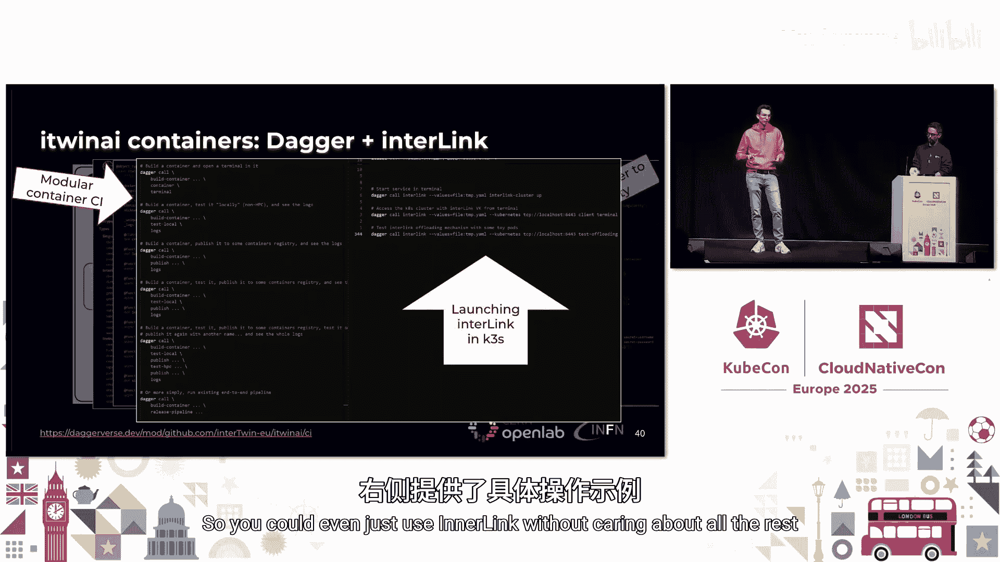

我们定义了三种Dagger类型。第一种是`I2AI`类型，其中包含构建容器、连接到InterLink、在HPC上运行测试以及转换Singularity镜像的逻辑。第二种是`InterLink`类型，用于引导InterLink服务。最后一种是`Singularity`类型，用于将Docker容器转换为Singularity镜像。

这里有一些关于如何使用此流水线的示例。在左侧，你可以看到如何以模块化方式构建CI流水线。我们可以只构建容器并发布它，或者构建容器并立即在其中打开终端，或者构建容器并在仅CPU环境中测试然后发布，这非常模块化。在右侧，有一些关于如何从同一个Dagger流水线启动InterLink并提交作业的示例。你甚至可以只使用InterLink而不关心其他部分。

让我们看一个端到端工作流的例子。我们推送代码到GitHub，这会触发一些GitHub Actions工作流，这些工作流在底层运行一个Dagger流水线。你可以在Dagger Cloud上看到流水线的痕迹，可以导航整个跟踪。在开始时，我们传递一些变量作为密钥，然后容器被构建，最后一步是发布流水线：部署InterLink，在HPC上运行测试，并推送最终镜像。最终，Docker镜像被推送到GitHub容器注册表，而Singularity镜像被推送到目前托管在CERN资源上的硬件注册表。

---

## 5. 总结与展望

在本教程中，我们一起学习了如何构建一个支持科学数字孪生的云HPC平台。我们探讨了利用InterLink为异构的HPC和云资源提供统一的Kubernetes接口，以及使用Dagger创建可重复、可组合的CI/CD流水线。通过I2AI库的案例，我们展示了如何测试和自动化分布式AI工作流，确保代码在投入大规模HPC作业前的正确性与效率。

**当前成果**：
*   借助Dagger，我们可以在可重复的CI流水线中构建容器。
*   通过InterLink，我们将实际的HPC资源集成到了GitHub中。
*   我们实现了整个流程的自动化，即通过GitHub Actions、Dagger和InterLink进行集成的HPC CI测试。

**下一步计划**：
1.  **扩展测试范围**：我们不仅关心代码能否运行，还希望确保在修改训练器时不会引入低效问题。可以建立基线代码，确保代码始终以相同甚至更好的方式扩展。同时，研究能耗情况。
2.  **集成新的HPC中心**：目前我们主要与斯洛文尼亚的Vega超级计算机合作，未来希望接入更多中心。
3.  **扩展至用户用例**：我们目前开发的整个CI是针对I2AI代码的。但可以将其扩展到任何希望为其机器学习训练等编写“干运行”测试的用例，帮助用户在提交耗时很长、需要长时间排队的大型HPC作业之前进行验证，避免资源浪费。

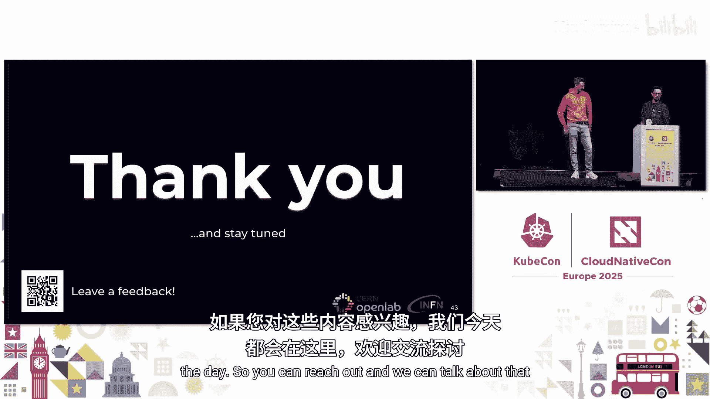

感谢大家的参与。如果您对其中任何内容感兴趣，欢迎与我们联系交流。