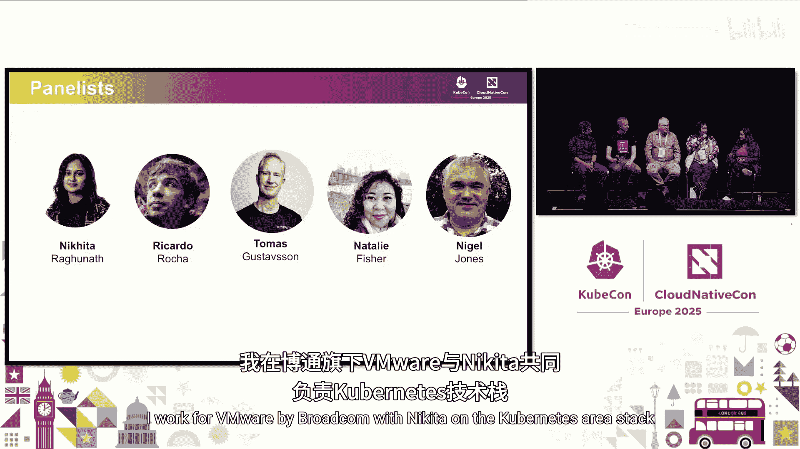
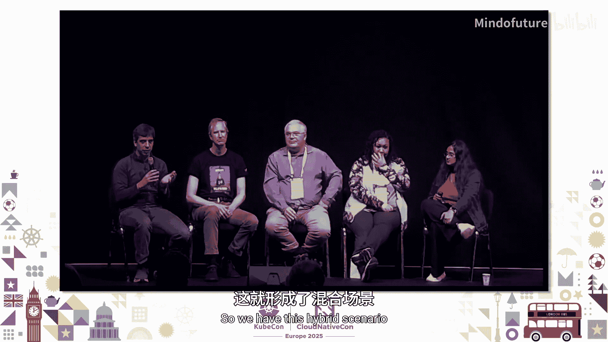
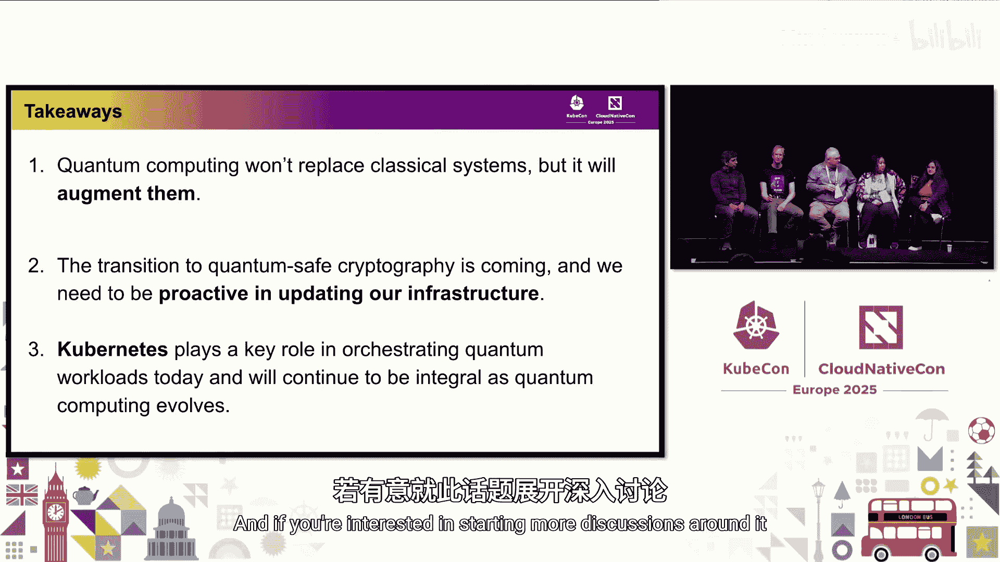

# 049：如何实现？ 🚀

在本节课中，我们将探讨量子计算与Kubernetes的交集，了解量子计算对云原生生态系统，特别是安全性和工作负载管理带来的挑战与机遇。我们将讨论后量子密码学的重要性、在Kubernetes上运行量子工作负载的现状，以及社区可以采取的行动。

---

## 量子计算与Kubernetes的现状

我们讨论了很多关于Kubernetes复杂性的问题。现在，将量子计算引入其中，使其变得更加复杂。大多数人将量子计算视为一种理论追求，尚未真正了解其实际应用场景、在Kubernetes上运行量子工作负载的意义，以及如何使Kubernetes和云原生生态系统实现量子安全。

既然我们已经讨论了很多关于人工智能的内容，为什么现在要讨论量子计算？因为人工智能已经足够复杂，如果我们现在不开始讨论量子计算，未来将会遇到麻烦。因此，我们需要趁还有时间时取得进展。由于时间有限，我们只有30分钟，我会尽量留出时间回答问题，让我们直接进入主题。

我们有一组出色的专家小组成员，请你们先做一下自我介绍。

*   **Natalie Fisher**：我在VMware/Broadcom与Nikita一起从事Kubernetes领域栈的工作，担任产品经理。
*   **Nigel Jones**：我在IBM研究院工作，从事后量子密码学和量子服务相关的工作，现在也做一些与人工智能交叉的研究。
*   **Thomas Gosson**：我是Key Factor的首席PKI官，过去30年一直从事网络安全、公钥基础设施和开源领域的工作。
*   **Ricardo**：我领导CERN的平台基础设施团队，负责云原生部署、机器学习部署，现在也开始研究量子计算管理。
*   **Nikita**：我也在Broadcom工作，是一名首席工程师。我长期参与Kubernetes领域，量子空间让我很感兴趣，所以想在KubeCon上多讨论这个话题。

---

## 量子炒作与现实应用

我们讨论了很多关于人工智能的炒作。现在我想回过头来谈谈量子炒作，它何时会发生？

我们都在学习量子计算机，并且仍在寻找现实世界的用例。但这些系统正在快速发展。我们知道，在某些方面，例如密码学，当前密码学所基于的一些数学问题可能会受到量子计算机的攻击。但这不仅仅是炒作，实际上已经有服务存在。例如，IBM在云端提供量子服务。关键是让这些服务对人们可用，以便他们可以开始实验和学习。

在CERN，我们有两个主要的量子计算倡议。第一个是CERN帮助领导欧洲的开放量子研究所，这个项目更多是关于治理和访问此类技术。另一个是量子技术倡议，目前正处于第二阶段，这更多是关于技术方面，不仅包括算法开发和识别匹配的用例，还包括确保我们能够高效且经济地管理这些工作负载。我们在内部参与度很高。

在后量子密码学领域，自NIST去年8月标准化了首批量子安全算法以来，它已成为最热门的话题之一，占据了我们大量时间，也是所有行业焦点或网络安全特定会议上的重要议题。

让我进入这个特定领域的原因之一是我们在讨论密码敏捷性，即如何快速更换加密密钥。听起来你们也在研究类似的东西。驱动我之前研究项目的一件事是，美国政府基本上在2022年宣布，到2035年必须支持量子计算。因为这个领域还很新兴，就像每个人都在说的，有很多我们不知道的事情，还有很多研究正在进行。真正重要的是尝试弄清楚我们如何实现目标，因为我们仍然相当落后。有一些公司，例如辉瑞这样的制药公司，正在使用它来测试分子，这是更实用的应用方式之一。此外，还有物流机会，这与人工智能工作负载以及量子计算相结合，他们试图找出最佳路线和出行方式。

---

## 密码学变革：后量子密码学的重要性

我认为你们都提出了一个非常好的观点，尤其是在密码学方面，我们需要进行很多改变。那么，我们能否多谈谈这一点？例如，在整个云原生生态系统或仅从Kubernetes开始，您认为需要引入哪些改变？

几乎所有安全原语，无论是MTLS、数字签名、JWT、代码签名，都依赖于非对称密码学。正如Nigel所说，这些算法（如RSA、椭圆曲线Diffie-Hellman）在足够大的量子计算机能够运行Shor算法时将被破解。当然，不仅是原语，整个社会都依赖于这些算法。这意味着我们必须更新事物，否则我们今天认为安全的东西将不再安全。

我认为另一部分是，我们需要了解我们实际在使用什么密码学。获取密码学清单，我们讨论过软件物料清单，还有一个名为CBOM的标准，它用有关密码学使用情况的信息来补充SBOM。这需要被了解，不仅仅是Kubernetes内部以及我们如何构建Kubernetes，还包括更广泛的认知和使用。因此，我认为了解你拥有什么、确定优先级非常重要。我们听说过“现在收获，以后解密”的概念，即我们现在可以捕获流量，保存起来，等到量子计算机能够破解时再回头处理。这涉及到风险评估，它可能与你那些具有长生命周期、在未来5到10年仍有价值的高价值数据相关，而对于你的短期数据可能无关紧要。因此，我认为了解你拥有什么，然后确定如何确定优先级真的非常重要。你无法一次性修复所有问题，我们开源社区必须提供帮助，像SBOM和CBOM可能是其中的一小部分。

---

## 社区中的现有工作

您是否已经看到任何项目或社区中有相关工作在进行？

我实际上是一个名为“后量子密码学协会”内项目的TSC负责人。我们实现了其中一些标准跟踪算法，如ML-DSA、ML-KEM，并致力于确保它们具有高保证性，以便我们可以开始将它们纳入技术栈。其他项目也有其他工作在进行，例如OpenSSL 3.5即将发布，它将增加对一些这些算法的支持，我们将看到这些支持通过技术栈向上渗透。因此，对于所有从事其他组件工作的项目维护者来说，关键是了解这些依赖项正在发生什么变化，并通过你的特定项目使其可用。

这不是要让您为难，但IBM正在开发一个开源的Qiskit SDK，对吧？所以人们也可以查看和试用它，但我不太了解细节。

Qiskit是一个用于开发量子应用程序的开源工具包，它绝对已经存在一段时间了，人们可以看看它。它本身是开源的，可以与多个后端一起工作。我肯定会说，如果你对量子计算感兴趣，很多公司都有相关的教育材料。所以我认为开始学习和理解它，以及理解为什么它不同，是件好事。量子计算不会取代经典计算，实际上是如何增强它，以及如何让那些恰好能在量子计算机上运行良好的小功能成为我们标准业务流程的一部分。

---

## 平台工程师视角：迁移到量子安全未来

我刚刚发现有趣的一点是，您说某些项目中已经在进行更改，这是我们未来将在技术栈中看到的情况。那么，从Kubernetes或平台工程师的角度来看，当我谈论将集群迁移到量子安全未来时，这到底意味着什么？

有几件事情。一是现代化，确保基础设施是现代的。所以一个先决条件可以说是TLS 1.3，在大多数通信情况下，它可能已经足够现代，正在使用TLS 1.3。但其他传统组织从TLS 1.2升级到TLS 1.3需要巨大的提升。完成这些之后，你还需要确保所有组件都可以轻松升级，你不能被遗留系统困住多年，现在必须更加敏捷、可更新和可追踪。然后就是密码敏捷性方面，项目不能再硬编码RSA或ECC，它必须是可配置的，以便在开发达到生产成熟度时易于更新。这样你就不会被困在那里，也不必重新开发太多组件。所以我认为，社区真正需要加强的是这三个关键方面。

我认为还有一点，当我们在软件栈中使用这些后量子算法时，有时密钥大小可能更大，数据包大小可能更大。在许多情况下，你可能使用混合方案，将传统加密（如椭圆曲线）与量子安全加密结合起来，这同样会增加资源大小和CPU使用率，对于非常小的交易或非常高流量的情况可能尤其重要。

对于某些应用来说，这可能完全无关紧要，但对于某些应用可能会产生巨大影响，所以在我们开始测试之前我们不知道。因此，我认为尽早开始尝试很重要。

---

## 在Kubernetes上运行量子工作负载

让我们稍微转换一下话题。我们讨论了很多关于安全性和密码学方面的事情，但是在Kubernetes上运行量子工作负载呢？您目前看到哪些差距，我们处于什么阶段？

密码学不是我研究量子计算的主要关注点。我们已经有一些工作负载从此中受益的明确用例。我举两个例子。一个是束流校准。我们有一个大型粒子加速器，质子束在其中运行。校准这些束流实际上是一项非常困难的任务。因此，人们一直在研究量子算法来帮助实时完成这项工作。他们实际上用实时质子束验证了这些算法，这很有趣。第二个是围绕量子机器学习的很多努力。我们谈到了在人工智能之后，量子计算给云原生领域带来了什么复杂性。实际上，在某些工作负载中，它们紧密相关。即使是像希格斯玻色子分析这样的事情，我们做的很多工作只是分析来自探测器的数据并试图发现新事物，也有量子机器学习算法可以帮助我们。由于问题的维度与当前量子计算机硬件不匹配，它们现在确实存在问题。这就是事情变得有趣的地方，因为你可以使用传统的机器学习算法来减少问题，然后使用量子算法进行第二步。我们在平台方面的主要挑战是，我们必须整合这种混合场景，即在同一技术栈中拥有更多经典和量子工作负载。因此，从平台角度来看，我们正在研究的是如何管理这些非常复杂的工作负载，如何在将长期存在的混合世界中管理它们。

还有其他更多属于基础设施方面的挑战，就是我们很可能不会很快在现场拥有量子计算机。所以它们是远程的。因此，我们需要以更像HPC的方式集成它们，将工作负载发送到云端或远程，获取结果，然后与你的其余分析集成，这比你在传统数据中心看到的紧密耦合的基础设施要多得多。

我认为，从提供商的角度来看，另一面是，当我们通过云提供量子服务时，Kubernetes对我们至关重要，因为你知道，发生在量子计算机上的实际计算只是其中一小部分，有很多预处理、后处理，围绕如何管理这些系统有很多控制工作，然后还有所有常见的“无聊”的东西，无论是CI/CD流程、登录还是身份验证，所有这些都基于Kubernetes。因此，Kubernetes是使这种效用对人们可用的关键部分。我认为与人工智能的类比在这种情况下也很好，因为当人工智能炒作几年前开始时，有一种观点是“云原生发生了什么？人工智能将走向何方？”但我们这些长期从事云原生工作的人认为，没有太多动力去重新发明整个技术栈，重做我们多年来依赖的所有工具。强烈的动机只是整合这种新型工作负载，也许调整现有系统以适当适应。我认为量子计算也会发生同样的情况。

我想补充一点，就Kubernetes目前如何与量子计算以及人工智能工作负载交互而言，它当然是作为编排组件方面发挥作用，但现在该领域的一切都是混合的。但我认为Ricardo提到的一点很有趣，那就是当它不是混合时，它将走向何方？我们讨论了很多基于量子机器学习等的QaaS。所以，如果观众中有人对此感兴趣，他们应该怎么做？下一步是什么？

---

## 如何开始：给初学者的建议

首先是量子机器学习。我认为第一步实际上是拥有一个可以受益的用例。机器学习实际上是量子计算一个相当好的用例。我不知道你是否听过人们谈论量子计算，正如之前提到的，很多人认为这将是下一代计算。显然情况并非如此，这将是一个混合世界。所以我要说，第一步是真正确定一个好的用例。第二点是之前提到的，有一些工具包可以模拟量子计算机，这是将你自己和你的工具引入此类工作负载的一个非常好的步骤，Qiskit就是一个很好的例子。第三点是量子计算机是真实的，你甚至可以通过公共云提供商访问它们，你可能已经可以访问。其中一些提供商在他们的目录中提供服务，让你可以访问量子计算机。我并不是说开始使用它们很容易。这就是为什么与Kubernetes的集成很有趣。存在挑战。我很乐意详细阐述其中一些。但你可以做到，这是真实的，它已经到来，而不是将要到来。

这里的讨论，我认为量子算法的工作方式与我们习惯的经典计算有很大不同，因此为了理解这些新机器的实际效用，是否存在相当陡峭的学习曲线？

幸运的是，这不是我的工作。我从事平台方面的工作，但我们有作为物理实验室的优势，所以很多人非常非常了解这项技术，甚至其背后的理论，他们正在推动边界。这就是为什么CERN在开放量子研究所和量子技术倡议中发挥主导作用，因为我们了解这些东西如何对我们以及其他潜在用例产生影响。我认为这个领域的另一件事是，随着我们对这些算法了解得更多，开发出更多算法，它们本身就会作为服务提供，供其他人直接消费。所以，如果你有某种金融工作负载并查看一些优化问题，你将会调用这个算法。从人工智能的角度来看，另一件变得有趣的事情是，你的AI模型可以调用工具。你的AI模型可以调用这些服务，因此它本身可以访问这些基于量子的算法，同时人工智能也被用来帮助你开发这些算法和编写软件，就像你编写普通软件一样。所以我认为人工智能在这个问题的多个方面都有很大潜力。

---

## 社区参与和下一步行动

这说得通。只是出于好奇，在座的有谁玩过量子计算机或在这方面有一些经验，无论是密码学方面？好的，大概两三个。那么，谁有兴趣或可能五个，谁有兴趣进入这个领域？好的，有一群人。那么，对于感兴趣的人来说，他们还能做什么？比如，有哪些具体的事情？例如，当我学习更多关于它的知识时，我觉得这很酷，但这看起来像是现在无法采取行动的事情。例如，有一些项目维护者或公司内部从事某些项目的人，他们应该做什么？他们的下一个行动项目是什么？

我想先说一下。我认为就我自己而言，当后量子密码学出现时，我已经研究这个很长时间了，你知道它很有趣，新事物，新算法以类似的方式应用，但非常有趣。所以你可以从中获得很多乐趣。但是，是的，你必须学习新算法是什么，它们如何工作，如何应用它们。所以有很多东西你可以研究，例如，新的混合密钥交换在TLS中如何工作。然后是密码敏捷性，无论你在哪个行业工作，无论是金融还是政府，现在都有大量新的白皮书涌现，关于如何应用密码敏捷性。就在几周前，NIST发布了一份非常好的、几乎是教育性的文件，关于在开发东西、在平台上部署东西时，当涉及到密码敏捷性时必须考虑的不同方面。所以有很多很好的材料可以阅读。

我同意这一点。我认为无论是密码学方面还是量子计算方面，都有很多材料。我想对于任何刚进入某个领域的人来说，我知道这对于维护项目来说是一件很棒的事情，当新人带着新想法出现，或者问为什么这么复杂，或者为什么文档这么差时，新贡献者的价值就非常巨大。你认为你来到一个主题领域，一无所知，但实际上你带来了额外的见解，然后帮助更广泛地传播信息。所以我鼓励人们尝试参与进来。

我还要补充一点，这是一个非常新的领域。我举一个例子来说明它有多早。有具体的用途，但还相当早期。例如，我们开始采购量子计算机的访问权限，因为全世界数量不多，没有标准来定义如何衡量工作负载，或者如何进行成本核算。现在，当你不知道如何实际定义你正在使用的成本时，采购资源真的非常困难。这就是为什么这个领域不仅需要量子计算专家和IT专家，还需要各种各样的人，需要业务人员来实际从这些服务中做出更具体的东西。当你开始研究时，你会发现每个量子计算机的定义有多么不同，如何提交工作负载，如何衡量效率，你如何实际请求访问和时间，这真的很有趣。所以，即使你不是量子专家，也有很多可以贡献的地方。

---

## 在CNCF社区内建立讨论空间

看起来有很多资源。在我组织这个小组讨论时，我可能想把这作为最后一个问题，并为观众问题留出一些时间。当我们组织这个小组讨论时，还有一位小组成员Paul来自IBM要加入我们。当我们讨论这个问题时，我们意识到在CNCF社区中确实没有一个我们可以讨论这个问题的论坛。Ricardo，我要让你为难了。你在TOC，那么现在这个论坛在哪里？我们应该怎么做？

我认为很好的是看看我们在人工智能方面做了什么。当时有很多需求，希望云原生基础设施能够发展以适应人工智能，这需要两个部分。一是管理所有这些项目并整合到生态系统中，所以我认为这个角色很大程度上属于技术监督委员会的职责范围。我们创建了这个人工智能工作组，让很多从事这项工作的人经常聚在一起，他们发布了一份白皮书，定义了生态系统的状态并给出了一些方向，说明我们应该走向何方。另一部分是平台更技术性的演进。我们从人工智能中学到，Kubernetes实际上非常灵活，可以适应不仅仅是管理节点或容器的工作负载。它成为了一堆东西的编排器。这是我们可以从为人工智能或HPC所做的工作中学到很多东西的领域，所有新的调度原语，我们在这方面所做的所有演进。这对于适应像量子计算这样的新事物至关重要。我们为人工智能成功做到这一点的事实，确实给了我们很多乐观情绪，相信我们也能为这个新时代做到同样的事情。

Nural，你想谈谈PQC协会吗？PQC协会，是的，正如我所说，在一个名为“后量子密码学协会”的组织中正在进行一些工作，围绕策划该领域的一些工作。它是Linux基金会的一部分，不是CNCF的一部分。我认为像PCA和CNCF这样的所有团体需要在这方面更紧密地合作，当然还有像OpenSSF这样的其他团体，当我们研究代码分析时。周一在维护者峰会上，我们举办了一个关于我们称之为“TAG重启”的研讨会，TAG是CNCF中的技术咨询小组。我们提议采用更灵活的方式来启动倡议。所以我认为，无论谁对这个领域感兴趣，我们都应该推动发起一项倡议，开始让人们更紧密地聚集和讨论，而不仅仅是在KubeCon期间有一个小组讨论，而是让这一整年都能持续进行。

是的，所以如果有人感兴趣，请在会后找到Ricardo，也许我们可以启动一些事情。

---

## 总结与关键要点

总结一下关键要点，并且真正简化它，我主要看到三个要点。一是量子计算不会取代经典系统，实际上会增强它们。第二点我们讨论了很多关于密码学的内容，所以向量子安全密码学的巨大转变即将到来，我们需要做大量的工作，我们需要立即开始。第三点，就像我们讨论人工智能一样，Kubernetes将在量子工作负载中发挥不可或缺的作用，我们需要开始着手填补那些空白并完成所有相关工作。说到这里，让我们在这里结束小组讨论，但我们开放给观众提问。那边有一个带支架的麦克风，如果有人感兴趣的话。

---

## 观众问答环节

**问题1（给Ricardo，但也开放给所有人）**：您提到在将量子工作负载与Kubernetes集成时面临的一些挑战。我有兴趣多听一些关于这些挑战的内容。

挑战仍然存在，我不会声称我们已经解决了。但我想总结一下，我们拥有这些工作负载，量子工作负载与经典工作负载集成。所以我们有这种混合场景，我们需要将一部分分析或过程委托给量子计算机，取回数据结果，然后继续。这个基础设施不在其余基础设施所在的位置，这本身就是一个问题。这与我们在社区中不断讨论的多云或混合部署问题是相同的。这个挑战在量子计算机中更加明显，因为接口不一定是我们所期望的。这就是为什么我认为，如果这些量子计算机的提供商开始提供我们期望的API，对每个人都有很大好处。第二个是我之前提到的，当我们想要采购或访问这些量子计算机时，我们定义工作负载的方式在我们访问的不同设备之间非常不同。在不同的量子计算机之间，没有定义计算单元的标准。这也是一个挑战。最后一点是，很多算法也适合特定的设备。由于缺乏标准化，一些工作负载适合特定类型的量子计算机或特定实现，这也带来了很多挑战，不仅是在编排这些事情方面，还要确保我们在那个特定设备上有可用的时间。我不知道，我们目前在人工智能方面都有这个问题，GPU稀缺，在量子计算机方面情况更糟。如果你有很多人感兴趣，实际上没有很多设备可用。所以，是的，我想说这就是我目前面临的。我相信如果你往上走，人们也面临着其他挑战。

**问题2（关于伦理）**：谢谢你们的小组讨论，非常棒。二月份，微软公布了一个主要的101量子比特处理单元。我的问题更多是关于伦理的，在它们开始大规模破解密码学之前，将它们发布给更广泛的受众是否有任何伦理考虑？谢谢。

这是一个难题。伦理，伦理。我想这就像任何服务一样。是的，我的意思是，安全长期以来一直有这种历史，伴随着CVE和漏洞利用之类的事情。当最终出现一个密码学相关的量子计算机时，它可能不是来自一个道德黑客组织或道德组织，谁知道呢。所以，我希望它会发生得非常渐进，并且当它发生时很明显，这样就不会……一个开玩笑的说法是，你怎么知道存在一个密码学相关的量子计算机？嗯，那就是当所有比特币都消失或你所有的比特币都被盗的时候。但希望不会发生在我们身上。所以，是的，像IBM这样构建这些东西的组织，可能沿着这些思路思考，不会轻易抛出一些东西，而且它会非常昂贵。我认为这也回到了优先级排序的观点，什么是你的高价值数据，专注于了解你使用什么密码学，其影响是什么，决定你现在需要在哪里实施这些保护。不要试图修复一切，而是专注于那个优先级，因为我们可能直到事后才知道它何时发生。

---

## 结束语

我想我们时间到了。如果你有更多问题，请在这个舞台附近找我们。如果你有兴趣围绕这个话题开始更多讨论，也请在这个舞台附近找我们。好的，谢谢大家。

---

本节课中，我们一起学习了量子计算与Kubernetes结合的前沿话题。我们探讨了后量子密码学转型的紧迫性、在Kubernetes生态中运行和管理量子混合工作负载的挑战与机遇，以及作为开发者和社区成员可以采取的初步行动。关键是要认识到量子计算是增强而非取代现有系统，并需要从现在开始为密码学升级和平台适应性做好准备。社区协作和持续学习将是应对这一变革的关键。