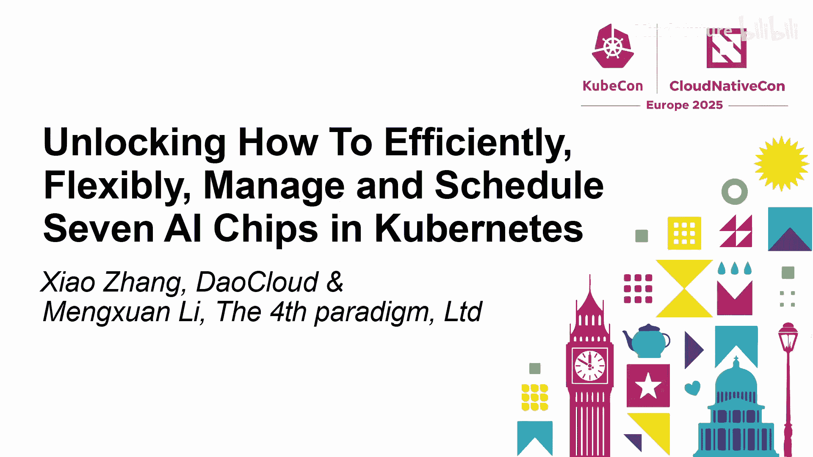
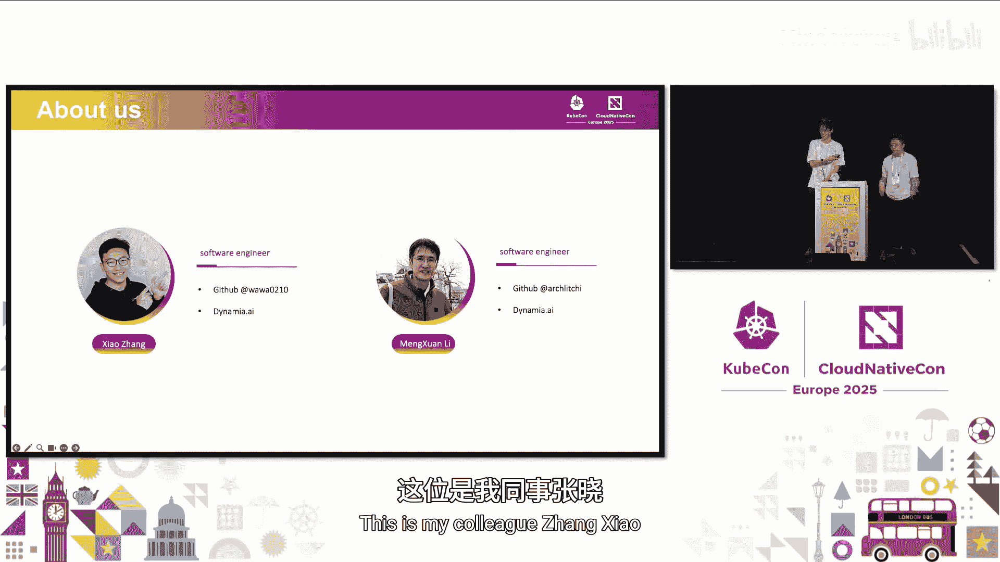
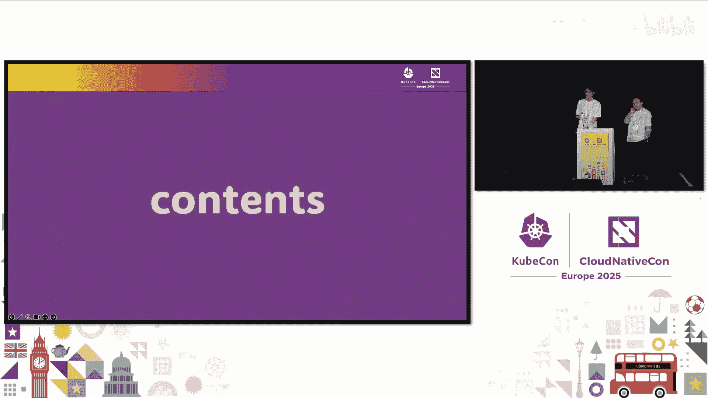
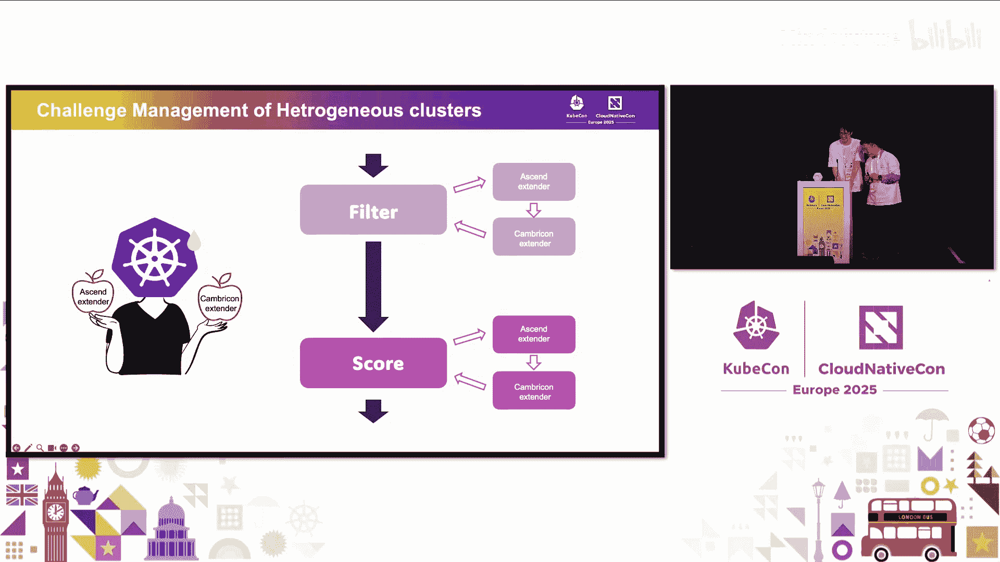

# 050：如何在Kubernetes中高效、灵活地管理和调度七种AI芯片








在本教程中，我们将学习如何提升Kubernetes集群中GPU的利用率，并统一管理来自不同厂商的异构AI计算芯片。我们将介绍一种名为Ham的解决方案，它能实现GPU共享、高级调度和统一监控。

## 背景与挑战

大家好，欢迎参加本次分享。本次分享的主题是解锁如何在Kubernetes中高效、灵活地管理和调度七种AI芯片。

这个标题有些抽象，但用一句话概括，就是**如何提升Kubernetes中的GPU利用率**。

本次分享由两位软件工程师带来。我是李牧贤，这是我的同事张潇。我们都来自一家名为Dyna Point AI的初创公司。


首先，让我介绍一些背景信息。

第一个背景是**算力需求的爆炸式增长**。全球GPU市场增长率超过60%，其中大部分增长来自英伟达，异构计算芯片的增长率也超过20%。从图中可以看出，自大语言模型兴起后，算力需求急剧增长。

由于我们来自中国大陆，高端英伟达显卡的进口受到限制。因此，我们必须使用替代方案，例如其他设备厂商的AI芯片。这些芯片是英伟达卡的替代方案，虽然性能可能不如英伟达，用户体验也可能稍逊，但**价格非常便宜**，足以在生产环境中使用，并且能提供不错的性能。

然而，我们遇到了挑战。在传统的Kubernetes中，**GPU无法被共享**。假设你有5块GPU，每块有40GB显存。如果运行一个只需要2GB显存的小模型，这块GPU就无法再运行其他任务，导致其他需要GPU的Pod处于Pending状态，从而使得集群的GPU利用率非常低。

另一个挑战是**异构集群的管理**。中国有许多设备厂商，其中许多都实现了自己的调度扩展器，这会劫持Kubernetes的筛选和评分过程。如果你的集群由多种AI芯片组成，就必须安装所有这些厂商的调度扩展器，导致调度流水线变得冗长。这会使Kubernetes的调度性能变得非常差，这是一个需要解决的问题。

## 现有解决方案：动态资源分配

一种解决方案是**动态资源分配**。这是Kubernetes中用于在Pod内部或Pod之间请求和共享资源的API，在Kubernetes 1.32版本中达到稳定状态。它需要定义资源声明和资源类，每个设备厂商都需要实现自己的DRA驱动程序，并与Kubelet通信以实现设备共享、调度和分配。

但它有许多限制：
*   它要求Kubernetes版本必须是最新的（1.32及以上）。
*   目前并非所有设备厂商都实现了DRA驱动程序。英伟达的DRA驱动程序仍在开发中，尚未达到生产就绪状态。
*   它需要创建资源声明和资源类。如果你想在Kubernetes内共享GPU，必须配置整个资源声明和资源类，并且需要显式启用此功能。

## 我们的解决方案：Ham

我们带来的解决方案叫做**Ham**。Ham是一个**异构AI计算虚拟化中间件**，用于提供GPU共享并管理来自多个设备厂商的异构AI计算设备。

它由一个**Mutating Webhook**、一个**调度扩展器**以及针对每个设备厂商的相应**设备插件**组成。此外，我们还为每个设备提供了**容器内资源控制**功能。

Ham是一个**插件化、非侵入式、标准化且轻量级**的解决方案，这意味着你可以非常容易地安装和卸载它。它也是CNCF的沙箱项目。

Ham的核心特性包括**设备共享**、**高级调度**和**统一监控**。

### 设备共享

设备共享是我们的核心特性。如下图所示，如果一个节点有4块GPU，两个用户各自提交一个需要2块GPU的任务。在没有Ham的情况下，每个任务会独占2块GPU，导致整体利用率低于50%。而使用Ham后，这两个任务可以共享在2块GPU上运行，将剩余的GPU留给其他任务，从而将GPU利用率提升至接近100%。


这个过程对用户是**透明的**，你不需要修改任务、镜像或源代码，只需指定需要使用的设备内存即可。

在容器内部，我们通过注入一个名为 `libcuda-control.so` 的库来实现设备限制。它劫持了从CUDA运行时到CUDA驱动程序的调用，从而精确控制每个容器内的设备内存分配。如果容器尝试使用的内存超过了任务中设置的限制，就会返回OOM错误。

Ham适用于广泛的CUDA和Kubernetes版本，唯一的要求是CUDA版本大于10.2，且英伟达驱动版本大于440。

以下是使用示例。你只需在容器中指定希望使用的GPU数量以及为每个容器分配的GPU显存。

```yaml
apiVersion: v1
kind: Pod
metadata:
  name: gpu-share-example
spec:
  containers:
  - name: test-container
    image: nvidia/cuda:11.0-base
    resources:
      limits:
        # 申请2块GPU，每块分配10GB显存
        nvidia.com/gpu: 2
        nvidia.com/gpu-memory: "10Gi"
```

在这个例子中，该任务需要2块GPU，每块使用10GB显存。Ham会为这个任务切割出10GB显存，剩余的22GB可供其他任务共享。我们提供的容器内资源控制功能可以确保显存使用上限被限制在10GB。

### 高级调度特性

除了基本共享，Ham还提供了一系列高级调度特性。

**设备指定**：你可以指定希望使用的GPU类型。例如，如果你只想使用A100，可以在Pod的注解中设置 `ham.io/use-gpu-type: a100`。或者，你也可以通过 `ham.io/no-use-gpu-type: a100` 来避免使用A100卡。

**任务优先级**：使用方法非常简单，只需设置一个名为 `CUDA_TASK_PRIORITY` 的环境变量。目前我们支持两种优先级：0代表高优先级，1代表低优先级。区别在于，只要高优先级Pod向某块GPU提交计算内核，运行在该GPU上的低优先级Pod就会被暂时挂起，等待高优先级Pod停止提交新内核后再恢复运行。这对任务是完全透明的。

**动态MIG配置**：你可以像示例中那样使用。只需指定希望使用的GPU数量以及希望分配的显存，Ham会根据模板搜索最合适的MIG实例供你使用。我们使用 `nvidia-mig-parted` 来为特定显卡动态生成MIG实例。用户无需关心具体的MIG实例名称，只需关心容器内希望使用的GPU数量和显存。

**设备内存控制扩展到其他设备**：此功能不仅适用于英伟达GPU，也适用于其他设备，如华为的昇腾AI芯片。例如，一块64GB的昇腾芯片，我们可以将其限制为16GB使用。该功能同样适用于昆仑、寒武纪等国产AI芯片。

**拓扑感知调度**：如果你需要分配超过1块GPU，例如部署一个跨多个节点和GPU的AI训练任务，你可能希望最小化GPU间的通信成本。为此，我们可以感知每块GPU之间的拓扑结构以及网络拓扑。通过这种方式，我们可以为AI训练任务分配物理上最近的GPU，以最小化通信成本。此功能已应用于昇腾等设备。

**装箱与分散调度策略**：每个任务可以指定自己的调度策略。`bin` 策略希望将任务调度到已经有Pod运行的GPU上，以最小化由GPU共享产生的碎片。`spread` 策略则相反，希望将任务调度到没有Pod运行的GPU上，以最大化性能。我们提供了GPU级别和节点级别的分散调度策略。

### 统一监控

在引入GPU共享后，除了DCGM Exporter提供的指标外，你还需要监控许多其他信息。例如，某块GPU已经分配了多少显存？还有多少显存可供其他任务使用？有多少工作负载正在该GPU上运行？这些工作负载对应的Pod名称、容器名称是什么？

Ham以Prometheus指标的形式提供了所有这些信息，可以轻松集成到Prometheus中，并通过Grafana仪表板进行展示。

## 生态系统集成

Ham也得到了其他生态项目的支持。

**Volcano VGPU**：如果你使用Volcano，可以在其项目页面找到关于Volcano VGPU的文档，这部分功能由我们贡献。社区负责容器内资源控制，而将剩余的调度过程留给Volcano调度器。

**Koordinator**：我们也已将GPU共享机制集成到Koordinator中。你可以在其官方网站上找到相关文档。

## 采用者与路线图

现在，让我将话筒交给我的同事，介绍采用者、路线图以及总结。

大家好，接下来我将介绍生态系统、采用者以及未来规划。

目前，Ham除了支持英伟达GPU，也开始支持如摩尔线程等更多AI芯片。我们希望在更多AI芯片的操作系统上支持Ham，并将其构建到AI系统中。在中国乃至全球，许多厂商也在其产品中集成了Ham，例如百度云、硅云、UCloud等。UCloud是中国最大的中立云提供商。

一些最终用户也使用Ham来解决GPU利用率低的问题。例如，一家南卡罗来纳州的公司在他们的生产环境中使用Ham来结合训练和推理任务。一家旅游公司以及一些关键用户，如P安全公司和SCBBC（一家银行和商业公司），也使用Ham来最大化GPU利用率并统一管理异构AI芯片。

截至目前，我们已有来自全球的近100家用户。

今年，Ham成为了CNCF沙箱项目。我们为2025年制定了清晰的路线图：
1.  首先，我们将支持更多异构AI芯片，例如昆仑芯片。我们也希望支持AMD、Intel或AWS的AI芯片。我们欢迎任何帮助。
2.  其次，我们希望支持动态资源分配。如何以兼容的方式将Ham与DRA集成是一个更大的挑战，因为许多用户已经在生产环境中使用了Ham。目前，越来越多的AI芯片公司已经完成了DRA的实现。
3.  我们还将创建一个Web UI，以便更轻松地使用。
4.  也许在年底，我们将申请成为CNCF孵化项目。

如果你想加入我们，我们非常欢迎。这是我们的GitHub仓库地址。

## 问答环节

**问：你们在调度方面遇到的最大挑战是什么？**
答：最大的挑战在于沟通。我们目前还无法联系到AMD。如果我们能联系到AMD，实现支持应该会容易得多。

**问：能否详细说明一下你们是如何实现调度的？例如，Pod迁移是如何处理的？或者如果运行Pod的节点宕机了会发生什么？**
答：调度部分是我们自己实现的调度扩展器。Ham由Mutating Webhook和调度扩展器组成。我们在调度扩展器中实现了额外的GPU筛选和节点评分逻辑。我们选择使用调度扩展器而不是调度框架，因为如果采用调度框架架构，我们需要兼容从Kubernetes 1.16到1.32的每一个版本，这对我们这样的开源项目来说非常困难。而使用调度扩展器，可以轻松插入从1.16到1.32的各个调度器版本。

## 总结

在本节课中，我们一起学习了在Kubernetes中管理异构AI芯片所面临的挑战，特别是GPU利用率低和调度性能差的问题。我们介绍了一种名为Ham的解决方案，它通过设备共享、高级调度策略和统一监控，有效地提升了集群资源利用率，并简化了多厂商设备的管理。Ham是一个轻量级、非侵入式的CNCF沙箱项目，拥有活跃的社区和清晰的未来发展路线。



