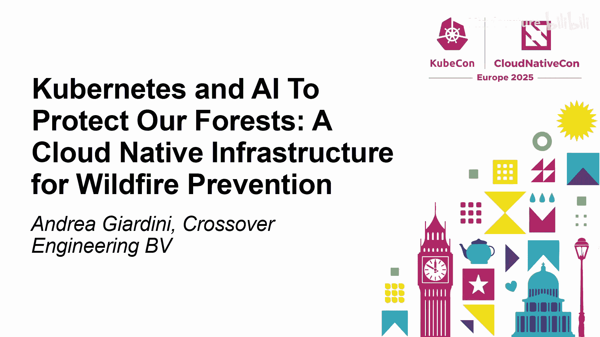
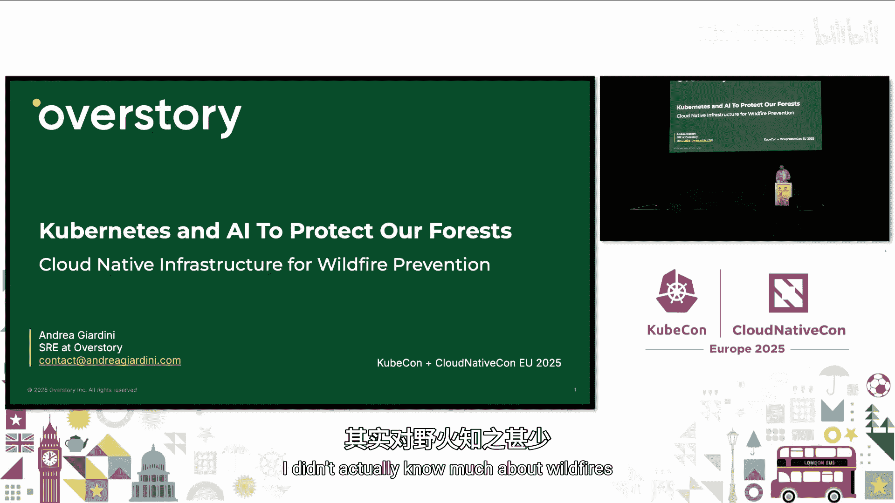
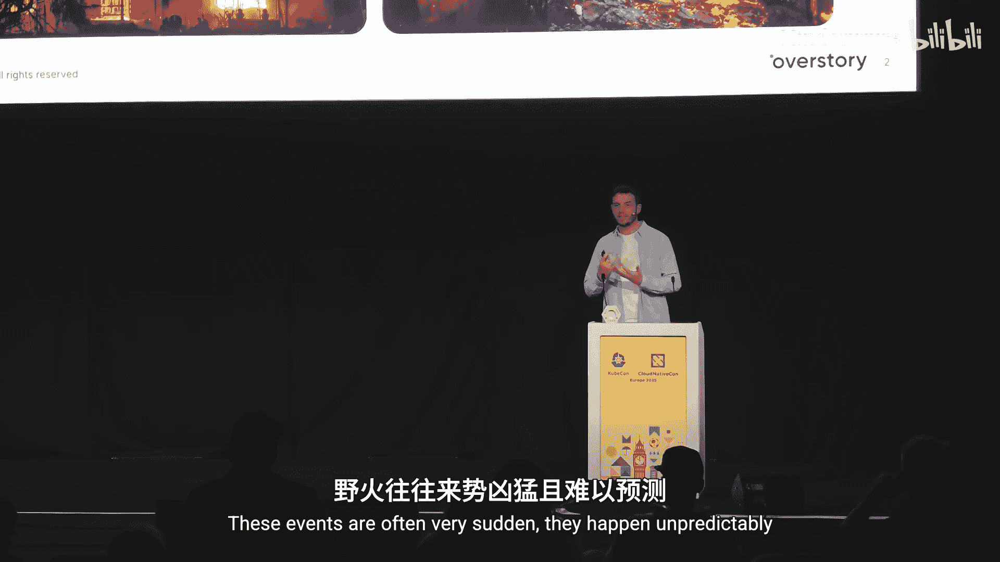
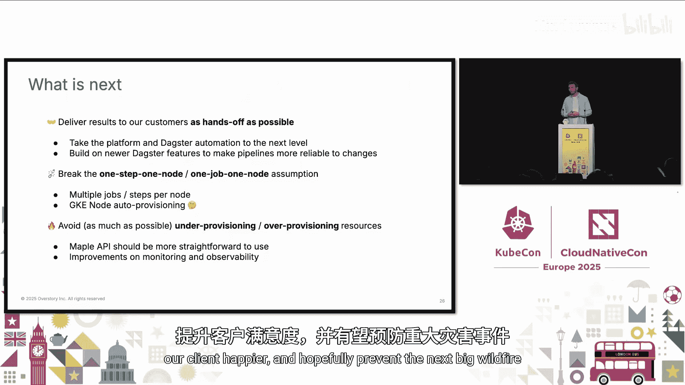

# 051：基于Kubernetes和AI的野火预防云原生基础设施教程








在本教程中，我们将学习如何利用Kubernetes和人工智能技术构建一个云原生基础设施，用于预防野火。我们将从理解野火问题的严重性开始，逐步深入到技术架构的演变，特别是如何从简单的Jupyter Notebook过渡到使用Dagster进行复杂的数据流水线编排，并最终构建一个自动化、可观测的交付平台。

## 野火问题的严重性与挑战

上一节我们介绍了本教程的主题。本节中，我们来看看野火问题的背景。

野火是极具破坏性的事件，对生命、社区、建筑和商业造成巨大损失。这些事件通常非常突然且难以预测。

例如，几个月前，美国南加州发生了一场大型野火，这是加州历史上第二大的野火。它导致超过29人死亡，超过20万人被疏散，18000所房屋被毁，超过57000英亩的土地被烧毁。

在加州，超过60%最具破坏性的野火是由有缺陷的电力线路引起的。这与许多人认为野火主要由人为因素（如未熄灭的烟头）引起的印象不同。

野火预防是一项艰巨的任务，原因如下：
*   **电力基础设施庞大且复杂**：电网覆盖范围广，包含大量不同的变电站，维护难度大，且需要接近100%的正常运行时间。
*   **故障突发且灾难性**：一个小型变电站的故障就可能导致大规模混乱，例如近期欧洲某机场附近变电站故障导致机场关闭24小时以上，影响数十万乘客。
*   **巡检困难且成本高**：电力线路常穿越私人领地，进行人工视觉巡检需要获得许可，过程耗时且昂贵。

## Overstory的解决方案：从天空获取洞察

鉴于上述挑战，Overstory提出了一种不同的方法：利用高分辨率卫星影像和机器学习技术，从天空监测基础设施状况，而不是进行人工地面巡检。

以下是其工作流程的三个核心步骤：
1.  **获取植被数据**：从不同来源（包括分辨率高达15厘米的卫星影像）获取植被数据。
2.  **结合基础设施数据**：获取能源提供商提供的电线杆、线路坐标及地形等信息。
3.  **生成风险地图**：结合上述两类数据，创建风险地图。当植被过于接近电力线路时，野火风险升高。公用事业公司可以据此地图，在野火蔓延前及时修剪植被。

这个方案的核心目标是让公用事业公司能够快速定位风险区域并采取行动，从而预防野火。

## 技术栈的演进：从Jupyter Notebook到Dagster

上一节我们介绍了业务解决方案。本节中我们来看看支撑该方案的技术架构是如何演进的。

作为一家初创公司，Overstory初期需要快速迭代。最初的技术栈非常简单：
*   **Kubernetes**：提供了灵活性与稳定性的平衡，能够支持从`1 CPU + 4GB内存`到`72 CPU + 数TB内存`的各种工作负载。
*   **Jupyter Hub**：允许数据科学家在不同资源配置的机器上运行Jupyter Notebook，以进行数据处理和分析实验。

然而，这种基于Jupyter Notebook的方式很快遇到了瓶颈：
*   **可重复性与追踪困难**：难以复现过去的实验，例如经常需要询问“一年前我们用的是哪个pandas版本？”。
*   **流程高度手动化**：每个客户交付都需要分配一名数据科学家手动逐步运行Notebook、修复问题，效率低下。

因此，团队设定了两个主要目标：
1.  摆脱对Jupyter Notebook的依赖，因为其难以维护、测试，且Git版本控制复杂（Notebook本质上是大型JSON文件）。
2.  自动化工作流运行，打破数据科学家数量与项目数量之间的绑定关系，需要一个数据工作流编排器。

经过探索，团队选择了**Dagster**。这是一个开源项目，具有以下优点：
*   **快速开发**：通过`dagster project scaffold`命令即可获得包含最佳实践的项目结构。
*   **易于本地测试和入门**：完全基于Python模块，深受数据科学家和工程师喜爱。
*   **云原生设计**：其架构理念与云原生高度契合。

## Dagster在Kubernetes中的架构与核心概念

现在，让我们深入了解Dagster在Kubernetes集群中的部署架构及其核心概念。

Overstory在Kubernetes集群中运行Dagster，其架构是一个经典的微服务架构：
*   **Dagit**：Web界面，用户可通过它查看系统概览、成功或失败的流水线。
*   **Dagster Daemon**：负责根据计划或条件运行流水线，监控运行状态，并在需要时重试步骤或通知用户。
*   **Code Locations**：每个代码位置是一个gRPC服务器，向Dagster Daemon和Web界面通告其包含的流水线、计划、传感器和资产等信息。每个代码位置是一个独立的Deployment，实现了团队间的高度隔离。

Dagster的云原生特性体现在其抽象能力上，以下两个概念尤为突出：

**I/O管理器**
它抽象了数据存储位置。开发者只需关注业务逻辑，Dagster会根据运行环境自动决定数据存储位置。例如：
*   在Kubernetes中运行时，输出保存到S3或Google Cloud Storage。
*   在本地运行时，输出保存到本地文件系统。
这使得代码无需为不同环境编写条件逻辑。

**资产**
在云时代，数据形式多样（BigQuery表、PostgreSQL数据库、云存储文件等）。Dagster引入了“资产”概念，任何数据实体都可以被定义为资产。其强大之处在于显式地建模资产之间的依赖关系，关注**数据如何关联**，而非数据如何构建。这使数据流经系统的路径一目了然。

## 构建内部库与资源调度优化

随着对Dagster的深入使用，团队开始构建内部库以封装通用模式和优化资源使用。

团队构建了一个名为`Maple`的内部库。在Dagster中，一个`op`代表流水线中的一个步骤。通过`Maple`，可以方便地定义步骤的资源需求。

以下是一个示例代码，展示了如何定义一个需要GPU和高内存的步骤，并申请临时存储空间：
```python
@op(
    required_resource_keys={“gpu”, “high_memory”},
    config_schema={
        “node_selector”: Field(dict, default_value={“cloud.google.com/gke-accelerator”: “nvidia-tesla-t4”}),
        “cpu_request”: Field(str, default_value=“32”),
        “memory_request”: Field(str, default_value=“390Gi”),
    }
)
def my_compute_intensive_step(context):
    # 步骤逻辑
    pass

# 在资源定义中申请临时卷
@resource(config_schema={“scratch_volume_size”: Field(str, default_value=“150Gi”)})
def ephemeral_volume_resource(context):
    # 创建临时卷的逻辑，利用Kubernetes临时卷特性
    # 临时卷的生命周期与Pod绑定，Pod终止时卷自动删除
    return scratch_volume_path
```

Dagster提供了灵活的步骤到Pod的映射策略：
*   **单Pod模式**：一个流水线的所有步骤在同一个Pod（节点）上运行，共享申请的资源。适用于步骤间数据交换频繁的场景。
*   **多Pod模式**：每个步骤在独立的Pod中运行，可以拥有不同的资源需求（CPU、GPU、内存）。这允许精确分配资源，例如只为需要使用GPU的步骤申请GPU，而不是为整个流水线预留，从而显著降低成本。

## 迈向平台化：增强可观测性与交付控制

尽管Dagster功能强大，但在某些方面仍存在局限，促使团队在其之上构建一个交付平台。

团队遇到的两个主要挑战是：
1.  **聚合性可观测性不足**：难以获取跨流水线的聚合统计数据（如过去30天某流水线的失败率）。
2.  **复杂依赖难以建模**：业务中某些复杂的触发条件和参数配置难以直接用Dagster原生概念建模。

因此，团队决定构建一个**平台层**。Dagster继续作为工作流引擎，但流水线的触发逻辑、参数和配置由外部平台控制。

平台架构如下：
*   **底层**：GKE集群中运行Dagster。
*   **平台层（Google Cloud Run）**：包含多个微服务（Starter, Router, Trigger, Watcher），它们通过Google Pub/Sub进行通信。
*   **流程**：当Starter触发新事件后，Router、Trigger和Watcher协同工作，通过Dagster API按特定顺序和设置触发任务，并监控执行状态。

## 实现全面的可观测性

平台各微服务间通过Pub/Sub通信，这为实现全面的可观测性提供了基础。

团队将所有Pub/Sub消息导出到BigQuery，同时使用OpenTelemetry将数据导出到Google Cloud Monitoring。最后，利用**Grafana**（支持多数据源）从BigQuery和Cloud Monitoring拉取数据，在一个统一的仪表板中展示，为团队提供完整的系统可视性。

这个“编排平台仪表板”使得团队能够：
*   跟踪每个交付任务的每一步状态。
*   识别需要关注或失败率异常高的步骤。
*   发现需要人工干预的环节（尽管团队正致力于减少此类情况）。



## 成果总结与未来展望

经过近一年的努力，团队取得了显著成果：首次实现了端到端零接触交付，在30分钟内完成了整个流程（复算旧交付以验证输出一致性）。这是平台团队与SRE团队紧密合作的结晶。

展望未来，团队计划在以下几个方向继续努力：
*   **进一步自动化**：最大限度减少人工干预，降低错误风险。
*   **采用Dagster新特性**：如**资产检查**，在资产物化时自动运行检查，确保不破坏下游API，提升流水线可靠性。
*   **优化资源调度**：探索打破“一步一节点”的假设，实现单节点多任务；研究GKE节点池自动配置和Kubernetes动态资源分配。
*   **改进资源预测**：由于输入图像数据差异导致处理资源需求波动大，团队希望改进资源预测，避免资源不足或过度配置。
*   **简化API与增强可观测性**：让`Maple` API更易用，进一步抽象Kubernetes细节，并持续监控和可观测性方面的改进。

通过所有这些努力，团队希望使交付更可靠，让客户更满意，并最终帮助预防下一场大型野火。

---

**本节课中我们一起学习了**如何利用云原生技术栈（特别是Kubernetes和Dagster）构建一个用于野火预防的AI驱动基础设施。我们从业务挑战出发，回顾了技术架构从简单到复杂的演进过程，深入探讨了Dagster的核心概念、资源调度优化、平台化构建以及可观测性实践。这套方法论不仅适用于野火预防，也为处理其他需要复杂数据流水线和资源管理的AI应用提供了宝贵参考。


