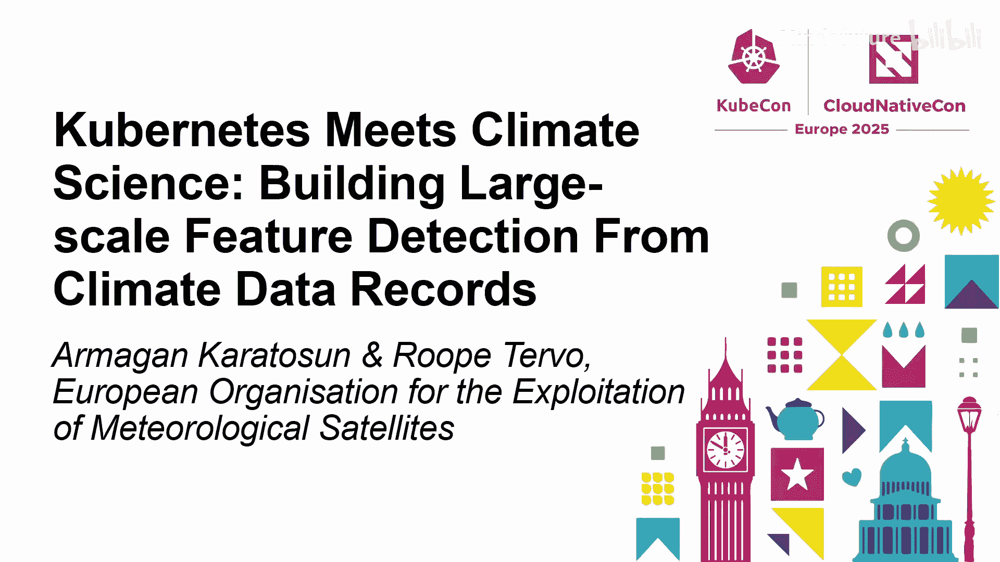
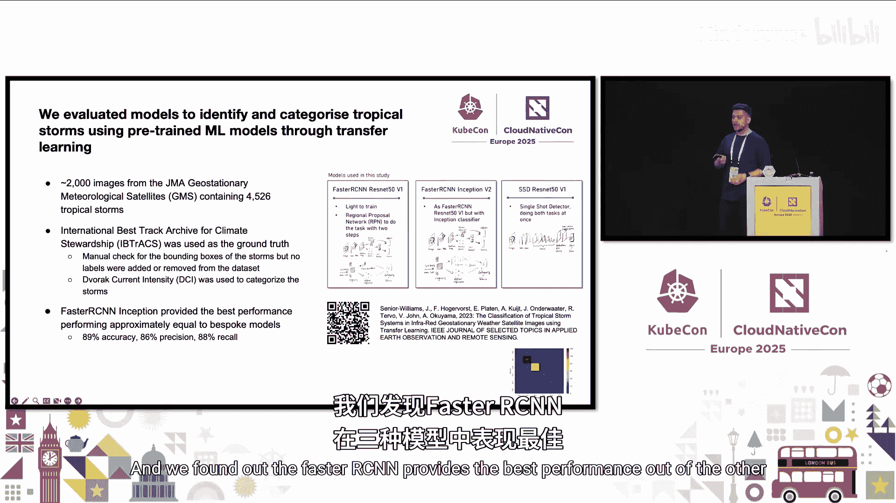
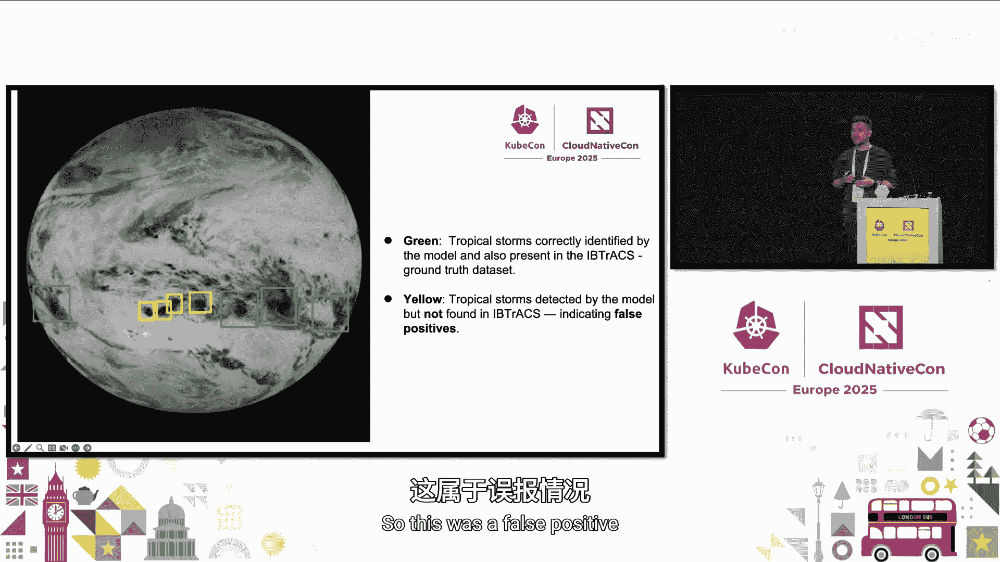
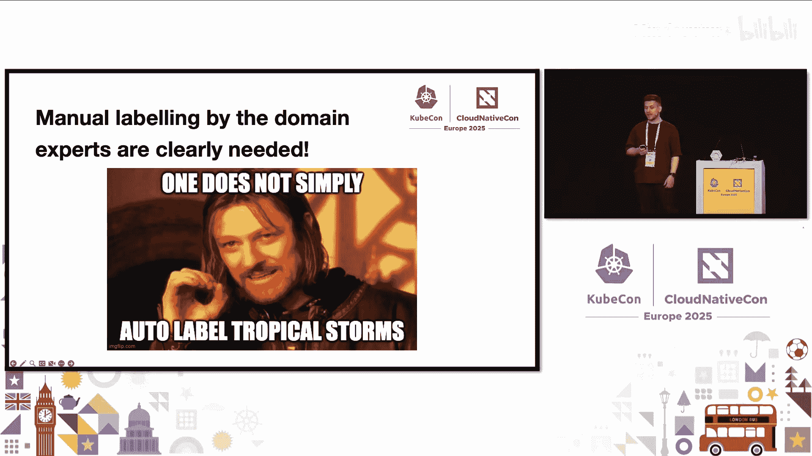
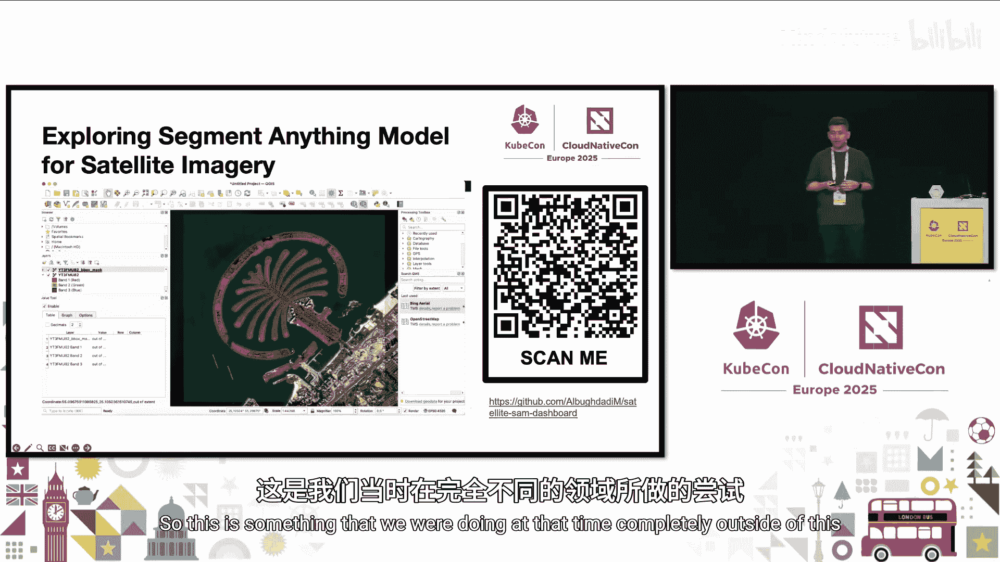
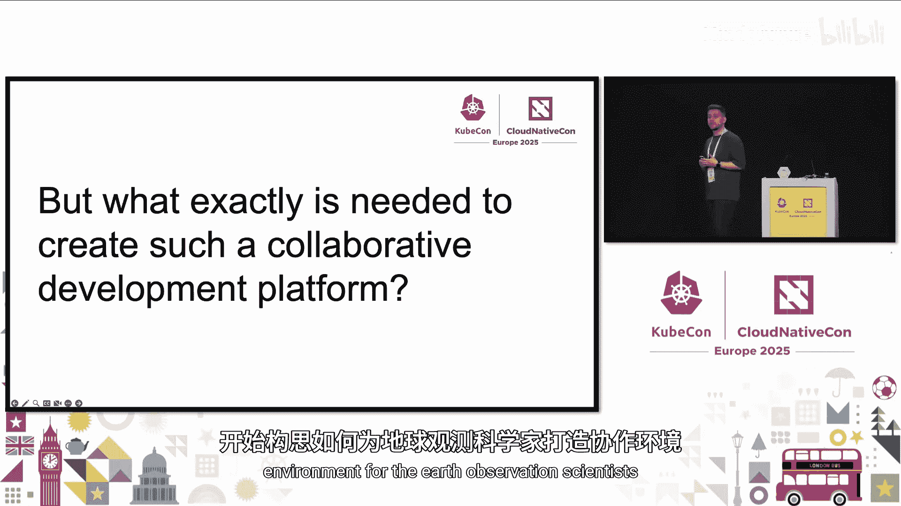
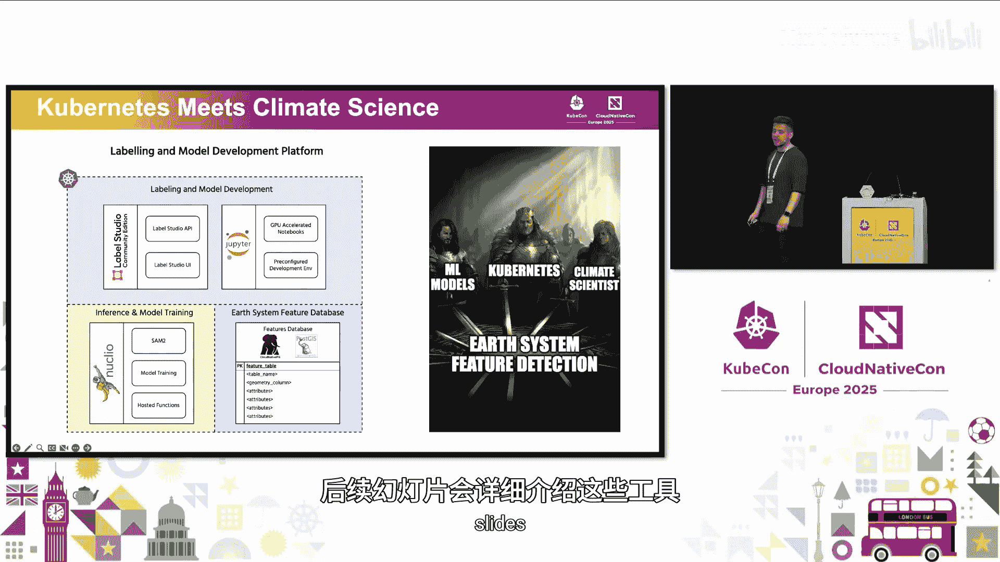
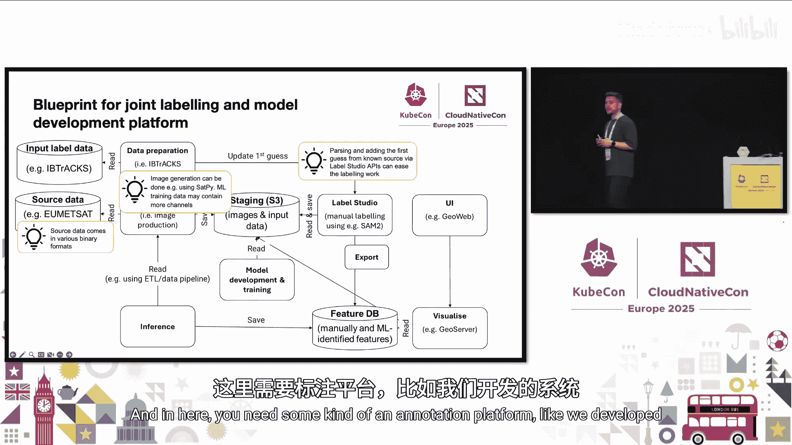
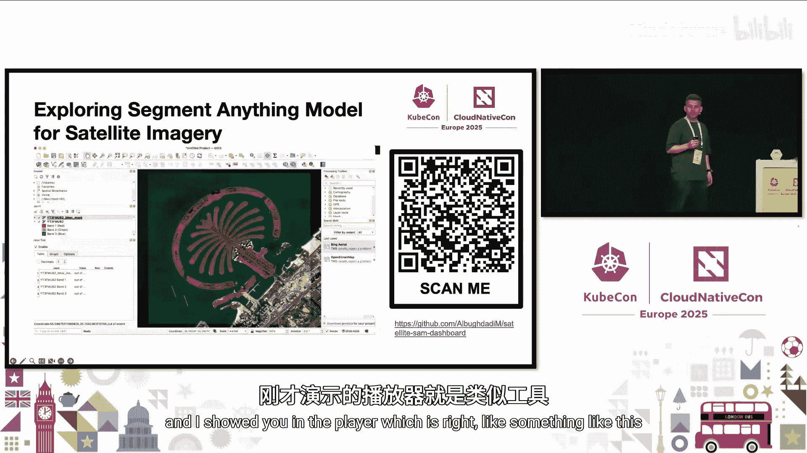
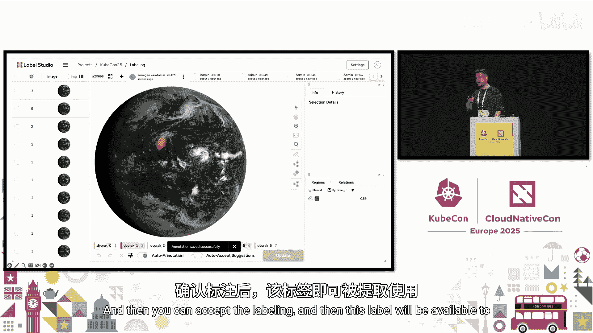

# 052：构建大规模地球系统特征检测平台 🛰️

## 概述

在本教程中，我们将学习如何结合云原生技术、机器学习和气候科学，构建一个用于大规模地球系统特征检测的协作平台。我们将探讨从数据获取、处理、标注到模型训练和可视化的完整流程，并了解如何利用Kubernetes等工具管理这一复杂系统。

---

## 第1章：背景与挑战 🌍

我是Arman，一名在线云数据访问服务专家。我与哈佛大学的同事、气候科学家团队以及实习生共同开展这个项目。

首先，我想介绍欧洲的公共航天部门。需要声明的是，我并非任何这些机构的官方代表，以下信息均基于公开资料。

*   **欧洲空间局**：欧洲通往太空的门户。ESA与各国机构、成员国合作，协调诸如伽利略或哥白尼等多项任务和计划。
*   **欧洲气象卫星开发组织**：负责运营用于监测天气、气候和环境的卫星。EUMETSAT同样与各国机构、成员国及其他航天相关机构合作。
*   **欧洲中期天气预报中心**：提供24/7的业务服务，生成并向其成员国和合作国传播数值天气预报。ECMWF拥有高性能计算设施、相关的通用云基础设施以及一个气象归档和检索系统。

我曾先后在EUMETSAT和ECMWF担任云计算工程师。

接下来，我们快速了解一下气候数据记录。CDR指的是任何经过校准的、对气候科学家或气候应用有用的长期数据记录。当前或过去的卫星数据或档案被用来生成CDR。

然而，问题在于这些数据量非常庞大，达到数PB级别。将数据从一个地方移动到另一个地方，或者下载到本地计算机进行处理都非常困难。我们拥有多个数据源和访问方法，通常每个新项目都有自己独特的数据归档和访问方式。源数据格式多样，有些是二进制格式，因此在开始处理气候数据之前需要进行某种预处理，这需要多个库来处理所有这些操作。

---

## 第2章：核心理念与欧洲气象云 ☁️

我们有一个想法，让最终用户的工作变得更简单：如果用户无法承担移动数据的成本，那就让计算靠近数据。这就是欧洲气象云诞生的初衷。其理念是将用户迁移到我们拥有的计算资源附近，并为他们分配一些计算资源。这是一种基础设施即服务的理念。

这并非私有云，因为我们向成员国和其他拥有研发资金的机构提供云资源。这也不是公有云，任何普通公民无法直接注册获取资源。因此，我们称之为**社区云**，一个为地球观测和科学家服务的社区云。

关键构想是让ECMWF的虚拟机进行数据缩减和降采样，然后仅将必要数据传输给EUMETSAT的虚拟机，后者进行卫星图像处理。

欧洲气象云带来的最大好处是，它为我们气象界提供了一个成熟的方式，让EUMETSAT、ECMWF和我们的成员国能够协同工作。我们拥有了一个可以共同合作的通用平台。

---

## 第3章：地球系统特征检测的目标 🎯

你可能会问，CDR为何重要，以及我们如何让它更易于访问。CDR提供了关于地球大气、陆地、冰冻圈和海洋在长时间尺度上如何、在哪里以及多大程度发生变化的长期校准信息。

例如，这对于分析过去几十年的海冰范围至关重要，可以为气候学家提供重要线索；或者，这可以成为航空领域大雾的早期预警。因此，高质量的系统特征识别对于进一步开发检测此类异常的应用程序和机器学习算法至关重要。

我们的项目有两个目标来构建这个地球系统特征检测平台：
1.  支持我们的成员国从地球观测数据中进行特征检测，以提供早期预警（例如之前提到的大雾示例）。
2.  为已识别特征的长时间序列收集一个全球数据库（例如40年的冰盖数据示例）。你需要收集长时间段内的这些特征，以便识别变化。

最终目标是建立一个社区平台来标注这些特征，维护这些特征的数据库，并提供探索、可视化、修改和导出所有这些已收集特征的可能性。

---

## 第4章：模型评估与挑战 🤖

为了实现这一目标，我们评估了使用预训练机器学习模型通过迁移学习来识别和分类热带风暴的模型。我们扫描了来自日本气象厅卫星的大约2000张图像，其中包含大约5000个热带风暴。我们使用国际气候管理最佳路径档案数据库作为地面实况，并利用德沃夏克强度指数来对这些风暴进行分类。

我们发现，在评估的模型中，Faster R-CNN提供了最佳性能。

然而，模型识别出的热带风暴数量异常多。对于我这样的IT专家来说，这些看起来都像热带风暴。但问题是，模型需要领域专家来检查所有这些不同的标注，因为有些被模型识别但未被IBTrACS数据库收录的风暴实际上是误报。

因此，领域专家的手动标注显然是必需的，无法实现完全自动标注。这意味着标注工作必须手动完成。我们有成千上万张需要识别的图像，需要气候科学家坐在电脑前手动标注所有内容。

---

## 第5章：SAM模型的启示与平台蓝图 💡

在另一个完全独立的项目中，我和朋友们探索了Segment Anything模型用于卫星图像分割。我们发现，尽管SAM并非在那种数据集上训练，但它实际上在分割卫星图像方面表现非常出色。

我们开发了一个小应用，用户可以在图像上选择感兴趣区域，SAM会从图像的其余部分分割出该区域。然后，可以将这些信息导出到任何可视化工具中使用。这给了我一个启发：也许我们可以创建一个环境，结合所有这些不同的工具。

我们需要为地球观测科学家创建这样一个协作环境。

我们构思的结果是：结合机器学习模型、Kubernetes和气候科学家，共同构建一个地球系统特征检测平台，作为气候科学家进行研究的协作平台。

以下是这个联合标注和模型开发平台的蓝图：
1.  **输入**：包括输入标签数据和源数据。
2.  **数据准备**：源数据格式多样，需要使用库进行预处理，生成图像并存储。
3.  **标注平台**：使用社区工具如Label Studio，并利用SAM帮助科学家标注他们检测到的特征。
4.  **数据库**：将标注的特征导出到数据库（例如使用PostGIS扩展的PostgreSQL）进行长期存储。
5.  **可视化**：通过任何网络地图服务进行可视化。

---

## 第6章：平台基础设施与资源管理 ⚙️

那么，底层的基础设施是什么？我们拥有来自欧洲气象云的基础设施即服务，它基于OpenStack。这是一个概念验证，用于确定收益以及未来如何在生产环境中实施。

我们使用Kubernetes，通过Rancher管理和配置Kubernetes集群。我们使用OpenStack云控制器管理器和CSI插件进行存储访问，并使用GPU Operator向Pod提供GPU资源。我们还有实例组来自动扩展工作节点。

我们的GPU资源非常有限，只有两块旧的A6000 GPU，以虚拟GPU形式提供。资源非常稀缺，因此我们需要格外小心地使用它们。

我们使用NVIDIA GPU Operator来简化安装、维护和操作。我们实施了时间切片以实现更好的资源共享和利用率。选择时间切片是因为我们的显卡不支持其他方式，并且这对于我们主要运行的重复性、大多无关的数据处理任务来说是一个不错的权衡。

---

## 第7章：设计原则与工具集成 🛠️

在平台构建过程中，我们识别了一些挑战：向地球观测科学家隐藏基础设施复杂性、集成多个工具、大规模部署和管理这些工具，以及缺乏有用的文档。

为此，我们制定了一些设计原则：
1.  使用开源和开放许可的生态系统。
2.  尝试通过GitOps和基础设施即代码实现一切自动化。
3.  采用Kubernetes优先的方法，优先使用官方Operator，如果不成熟或不存在，则使用得到良好支持的Helm图表，只有在没有其他选择时才构建自定义解决方案。

我们最终构建了一个灵活、开放、对机器学习友好的平台。为了让科学家更容易上手，我们为他们准备了一些高需求的数据。科学家们已经熟悉JupyterHub，因此我们提供了一个托管中心，让他们可以与平台中的其他工具交互，并拥有GPU处理能力。当然，他们也可以使用自己的工具。

我们使用GitOps管理所有应用。我们有一个Argo CD来管理所有应用：JupyterHub、Label Studio、Nuclio、运行在Nuclio上的函数、云原生PostgreSQL等。如果存在Operator，我们可以结合GitOps最佳实践，自动化所有工具，至少在一个单一事实来源中，这为我们向最终用户呈现平台的方式提供了一致性。

---

## 第8章：核心工具详解与挑战 🔧

*   **JupyterHub**：提供一个托管中心，预装了插件和工具，方便科学家使用。
*   **Label Studio**：用于标注。我们发现它在API和UI方面是最可扩展的，非常 customizable。
*   **Nuclio**：作为无服务器框架。它非常适合地球观测用例，维护开销低。它将代码视为一个整体，可以在运行时构建容器镜像，然后将其作为函数运行。这非常适合我们大多数情况下拥有的处理器链。但它的缺点包括缺乏内置的工作流管道，函数版本管理与模型注册表管理不同，并且调试已部署的函数可能比较棘手，镜像往往较大。
*   **机器学习后端集成**：Label Studio期望一个Docker Compose设置。我们做了一些手动工作，用Nuclio上已有的工具替换了它，并使用Label Studio的机器学习SDK来构建模型并以Label Studio期望的方式呈现。

---

## 第9章：平台演示与工作流 🖥️

在演示中，可以看到Label Studio中已经上传了大约1800张图像。我们有来自IBTrACS数据库的标签，以及使用SAM模型的标签。用户可以选择标签，放置关键点，SAM会进行分割并生成标签。标注完成后，可以接受标签，然后将这些信息提取到地球系统特征数据库中。

在可视化方面，可以看到大气运动矢量，即连续卫星图像中单个云或水汽模式的运动。当将所有标注导出到数据库并尝试重新可视化时，可以看到所有形状，展示了云或水汽的运动。

---

## 第10章：未来展望与总结 🚀

下一步，我们需要与EUMETSAT成员国合作开发数据准备工具。我们需要运行联合标注活动来标注更多数据。我们需要为每个特征确定最佳可用方法。当然，我们需要为专家提供更多数据，以便他们在模型开发方面做更多工作。我非常希望用标注数据训练机器学习模型或改进SAM集成。我也非常希望拥有更好的GPU。

我们还计划改进和扩展地球系统特征数据库，增加更多特性和能力。

## 总结

在本教程中，我们一起学习了如何构建一个结合云原生技术和机器学习的地球系统特征检测平台。我们从数据挑战出发，探讨了欧洲气象云的概念，明确了平台目标，评估了模型并认识到手动标注的必要性。我们看到了SAM模型的潜力，并设计了完整的平台蓝图。我们深入了解了基于Kubernetes的基础设施、资源管理策略、设计原则以及核心工具如JupyterHub、Label Studio和Nuclio的集成与挑战。最后，我们预览了平台工作流并展望了未来发展方向。这个项目展示了跨学科合作如何利用现代技术解决气候科学中的复杂问题。