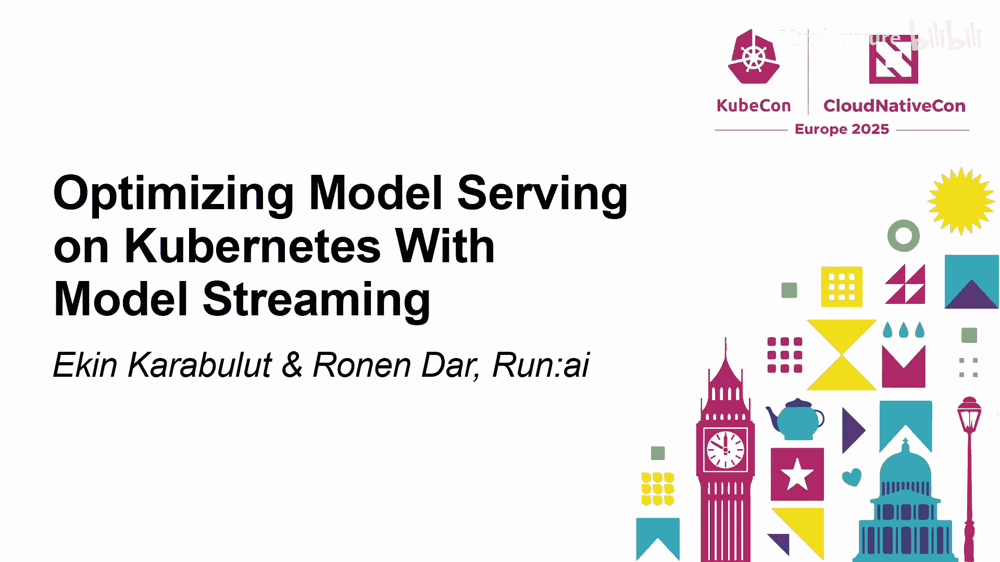
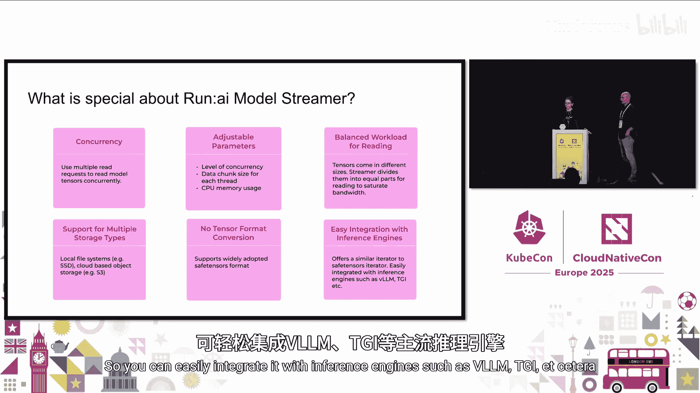
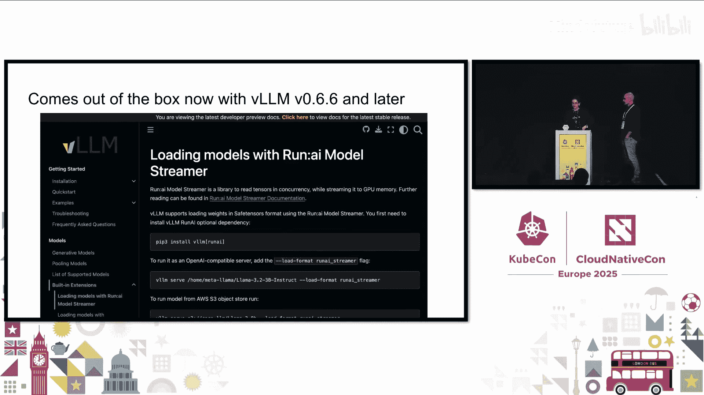
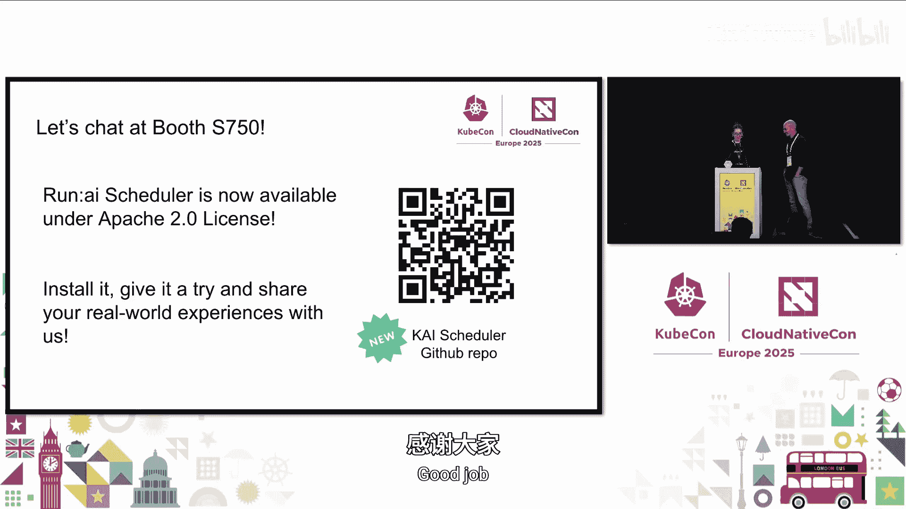

# 053：在Kubernetes上通过模型流式传输优化模型服务

在本教程中，我们将学习如何在Kubernetes上优化模型推理服务，特别是通过模型权重流式传输技术来解决模型加载的冷启动问题。我们将探讨传统方法的挑战，并详细介绍Run AI模型流式传输器的原理、优势和使用方法。

## 概述：模型推理与冷启动挑战

在理论层面，模型推理涉及使用训练好的模型处理新数据或用户查询，并生成预测或输出。在云原生环境中，如何在GPU上高效地为模型提供服务是核心议题。

传统Web应用通常使用自动扩缩器来处理流量波动。当流量上升时，会启动新的应用副本；当流量下降时，则缩减副本以节省成本。然而，在AI领域，这种做法面临巨大挑战，最主要的原因是**冷启动问题**。

启动一个新的AI模型服务副本需要很长时间，原因包括：
1.  **GPU机器资源调配**：相比CPU机器，GPU机器的资源调配通常更慢，因为云端GPU资源更稀缺，且需要安装CUDA驱动、容器运行时等大量软件库。
2.  **容器镜像加载**：AI应用的容器镜像通常很大，包含许多Python库，加载耗时。
3.  **推理引擎启动**：启动推理引擎本身也需要可观的时间。
4.  **模型权重加载**：从存储位置下载模型权重到GPU内存中，这个过程可能非常漫长。

本教程将重点讨论最后一点——**模型权重的加载优化**。以Llama 3模型为例，8B参数版本（使用16位精度）的权重文件大小约为15GB，而70B版本则超过100GB。对于像DiT这样的扩散模型，权重可能超过1TB。下载并加载这些权重可能需要数分钟甚至超过十分钟。

## 为什么优化模型加载至关重要？

优化模型加载时间对于以下几个推理场景至关重要：

以下是几种关键的推理用例：

*   **实时推理**：单个模型面临高负载，需要多个副本运行在GPU上。当流量激增需要扩容时，用户无法忍受数分钟的等待时间。通常的解决方案是**过度配置**，即预先启动更多GPU来运行服务副本，但这导致了高成本和低GPU利用率。
*   **多模型服务**：需要为不同用户提供多个模型，但每个模型的访问频率都不高。理想的方案是使用**缩容到零**，将不活跃的模型存储在别处，仅在用户查询时启动副本。但如果启动副本需要数分钟，就无法满足低延迟应用的需求。因此，常见的做法也是让所有模型常驻在GPU上，再次导致高成本和低利用率。
*   **离线推理**：运行批处理作业处理大量数据。作业启动时开始处理，完成后副本关闭。用户需要为副本启动的整个时间付费。如果启动时间长达数分钟，这部分成本就相当显著。

因此，减少冷启动时间，特别是加速模型加载到GPU的过程，具有重大意义。这也是Run AI模型流式传输器项目的目标。

上一节我们介绍了模型推理面临的冷启动挑战，接下来让我们深入模型加载过程，看看传统方法存在哪些瓶颈。

## 深入剖析：传统模型加载流程

让我们放大容器内部，仔细看看传统的模型加载过程。

模型通常存储在某种存储系统中，可能是本地存储或对象存储。加载过程分为两个主要步骤：

1.  **将模型移动到CPU内存**：首先需要将模型从存储读取到CPU内存。在此过程中，可能还会进行模型分片、量化等操作，这些都会增加额外时间。
2.  **将权重传输到GPU内存**：模型在CPU内存中就绪后，需要将其权重传输到GPU内存中。

**关键问题在于，这两个步骤是顺序执行的，没有并行化**。这种串行方式非常耗时。

在开始设计解决方案时，我们明确了几个核心需求：

以下是创建项目前我们确立的几个关键需求：

*   **并行化**：顺序加载无法满足性能要求，我们需要支持并行工作的方案。
*   **多存储类型支持**：需要支持多种存储类型（如本地文件系统、S3等）。某些现有库（如`safetensors`）对S3的支持有限，我们不希望用户为了适配存储类型而被迫更改代码库或存储方案。
*   **Safetensors格式兼容**：Safetensors正成为模型权重的标准格式，它非常安全。我们希望项目能原生支持此格式。
*   **易于与推理引擎集成**：我们不希望强制用户使用某个特定的推理引擎。项目应该能轻松集成到不同的推理引擎中，如VLLM、TGI等。

这些需求促使我们创建了**Run AI模型流式传输器**。

## 解决方案：Run AI模型流式传输器

我们创建了一个包含C++实现的Python SDK。它旨在加速从各种类型存储（网络文件系统、S3、磁盘等）将模型加载到GPU的过程。

该方案的两个关键技术点是：
*   **并发读取**：在将张量流式传输到GPU的同时，**并发地从存储中读取模型张量**。
*   **均衡工作负载**：将张量**划分为大小相等的部分进行读取**，以饱和存储带宽。

接下来，我们详细看看Run AI模型流式传输器的特别之处。

## Run AI模型流式传输器的核心特性

正如之前提到的，我们实现了并发性。我们使用多个读取请求从存储中并发读取模型张量，并同时将它们流式传输到GPU。

我们还提供了一些可调参数，您可以根据自己的存储类型和硬件配置进行调整：

以下是用户可以调整的关键参数：

*   **并发级别**：根据存储类型调整并发线程数。
*   **数据块大小**：选择如何划分safetensors文件，即每个线程读取的数据块大小。
*   **CPU内存使用量**：您可以定义流式传输器可使用的CPU内存上限，以适应有限或充裕的内存环境。

通过调整这些参数，Run AI模型流式传输器可以优化性能。

**均衡读取工作负载**至关重要。AI模型中的张量大小各异。我们将这些张量划分为相等的部分进行读取，以便更均匀地利用存储带宽。

我们支持多种存储类型，包括本地文件系统和基于云的对象存储。

您**无需转换任何张量格式**。我们支持广泛采用的Safetensors格式，无需将其转换并单独存储。

我们创建了Run AI模型流式传输器迭代器，它本质上是一个Safetensors迭代器。其工作方式与传统加载模型的Safetensors迭代器非常相似，因此可以轻松集成到VLLM、TGI等各种推理引擎中。

特别地，如果您使用的**VLLM版本高于0.66**，Run AI模型流式传输器现已内置在VLLM容器和版本中，您可以开箱即用。

现在，让我们看看它在实际中的性能表现。

## 性能基准测试

我们进行了一系列基准测试。这里简要概述一下测试设置，详细报告可通过文末的二维码获取。

我们使用**Meta Llama 2 8B**模型（约15GB），将其存储为单个Safetensors文件。硬件上，我们使用AWS上的单颗A10G GPU。我们测试了三种不同的存储类型：
1.  本地SSD（包括gp3和io2类型，其中io2 SSD具有更高的吞吐量）。
2.  与实例位于同一区域的Amazon S3。

我们主要测试了两个场景：
1.  **独立加载器性能**：比较Safetensors加载器、Run AI模型流式传输器和Tensorizer加载模型从存储到GPU所需的时间。
2.  **端到端启动时间**：测试使用VLLM时，启动引擎并加载模型的总时间。

测试结果显示，Run AI模型流式传输器带来了显著的性能提升。

从这些实验中，我们得出了一些关键结论：

以下是基准测试的主要发现：

*   **并发性驱动加速，但有上限**：增加并发性可以显著提升速度，但一旦达到存储带宽的饱和点，继续增加并发性将无法带来更多提升，这是物理定律的限制。
*   **均衡工作负载分布至关重要**：张量大小不一。将读取工作划分为均匀的块分配给线程，有助于优化带宽饱和，使流式传输过程更快。想象一下，如果一个张量是GB级别，另一个是MB级别，那么读取进程就需要等待那个GB级张量先读完。
*   **存储带宽影响巨大**：对于需要快速模型访问的部署，投资高性能存储非常重要。在应对冷启动问题时，更高的存储带宽可以大幅减少加载时间，尤其是在本地和混合云环境中。
*   **需要针对存储类型调优参数**：您应该检查并找到适合您特定存储类型的最佳并发级别。如果对CPU内存有特定要求，也需要调整流式传输器的参数，因为这些设置对冷启动时间影响很大。
*   **在S3上表现优异**：我们为S3设计的方案（**为每个线程创建一个AWS S3客户端，每个线程向后端发送多个异步请求**）效果非常好，性能提升显著。在某些测试中，结果好到难以在图表中直观显示。

此外，在云端测试中，我们还注意到一些与流式传输器本身无关但值得注意的情况：

以下是在云端进行基准测试时的额外发现：

*   **实际带宽可能低于理论值**：即使云服务商文档标明某个实例类型的存储带宽可达4GB/s，我们在实际测试中可能只观测到最高2GB/s。存在一些实际限制，需要提前规划。
*   **注意S3缓存效应**：在S3后端可能存在缓存。如果连续运行实验，可能会看到性能异常加速，这对于评估真实的冷启动性能是不利的。因此，在进行云上基准测试时，确保在测试之间留有足够的冷却期。

了解了当前的表现后，让我们看看未来的发展方向。

## 未来发展路线图

我们发布了新版本0.13，它包含完整的AWS S3原生身份验证支持。现在我们也支持**Google Cloud Storage**，并有一些可用性改进。

在路线图中，我们计划支持更多激动人心的功能：

以下是即将推出的功能：

*   **分片模型支持**：支持加载分布在多个文件中的大型模型。
*   **优化多GPU模型加载**：提升在多GPU环境下的加载效率。
*   **并行多文件加载**：同时从多个文件加载数据。
*   **支持GPU直接存储**：允许GPU直接访问存储，绕过CPU，进一步提升速度。

我们特别对GCS支持感到兴奋。我们正在与Google Kubernetes Engine团队合作，初步反馈非常积极。与直接从云对象存储下载并构建模型相比，结合VLLM使用模型流式传输器，他们观测到了**96%的模型加载时间减少**。

## 总结与资源

在本教程中，我们一起学习了在Kubernetes上优化模型推理服务所面临的冷启动挑战。我们深入探讨了传统串行加载模型的瓶颈，并介绍了Run AI模型流式传输器如何通过**并发读取**和**均衡负载**来显著加速模型从存储到GPU的加载过程。我们还回顾了基准测试的关键发现，并展望了该项目的未来发展方向。

优化模型加载时间对于实现高效的实时推理、多模型服务和降低成本至关重要。Run AI模型流式传输器作为一个开源工具，为应对这一挑战提供了有力的解决方案。

**相关资源：**
*   **GitHub仓库**：请扫描下方二维码访问项目源码。
*   **基准测试白皮书**：请扫描下方二维码获取包含详细结果的基准测试报告。

如果您有任何问题，欢迎讨论。此外，Run AI平台的核心——Run AI调度器，现已基于Apache许可证开源。如果您在调度AI工作负载，我们非常欢迎您的反馈、贡献或作为早期采用者进行尝试。