# 054：爱上端到端测试

在本教程中，我们将学习端到端测试的核心概念、实践方法以及如何将其集成到现代云原生应用的开发与部署流程中。我们将通过一个具体的汉堡店应用示例，演示如何使用Cypress、Kubernetes、GitHub Actions和Argo CD等工具构建一个完整的、自动化的端到端测试与部署流水线。

## 为什么需要测试？🧐

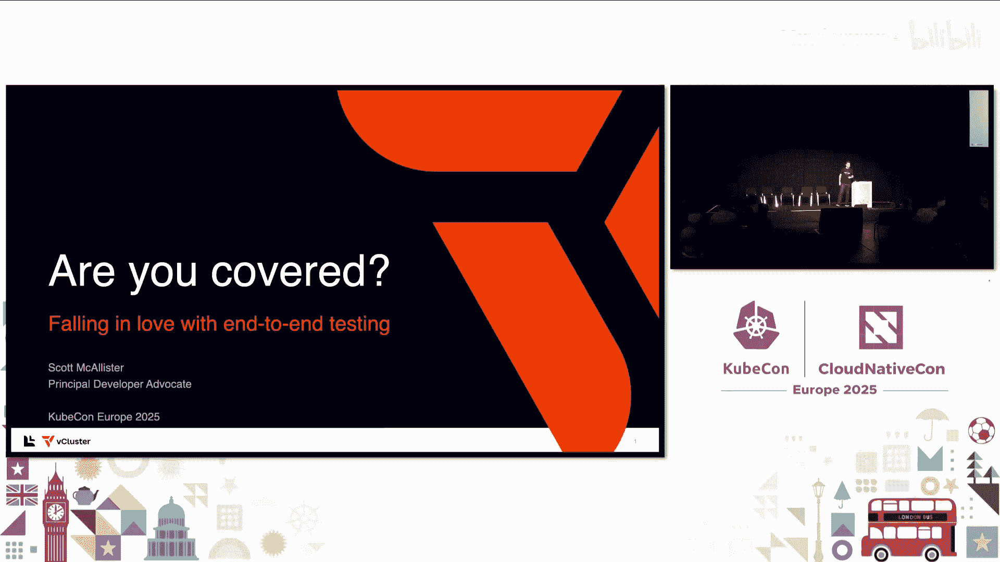

我们进行测试是为了评估和验证代码的行为是否符合预期。

软件开发中最重要的两件事是确保代码正常工作，以及能够快速推送变更。如果代码出现意外行为，用户遇到意外情况，这通常被称为Bug。我们不希望这种情况发生。

因此，通过测试，我们不仅要确保测试运行，还要实现测试自动化，以便能够快速推送变更，并确保软件运行着我们希望用户使用的最新功能。

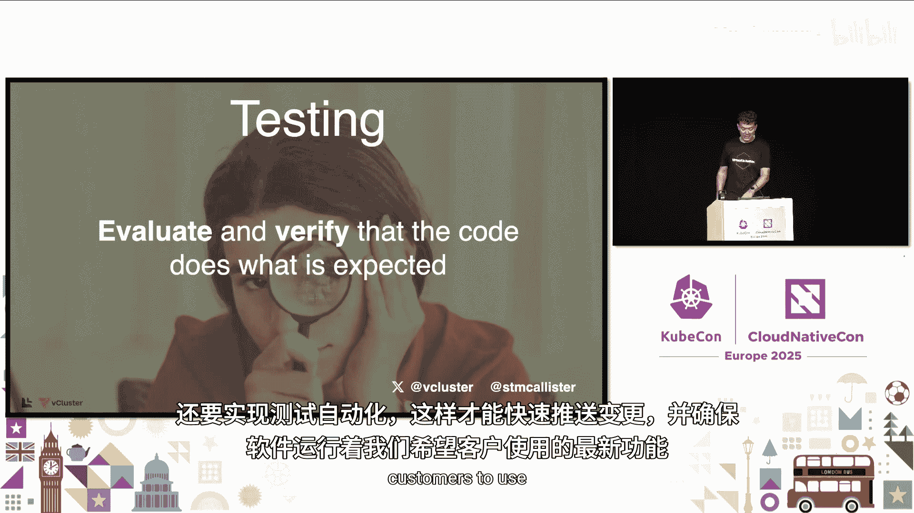

## 测试的价值 📚

我们的好朋友Adler也曾这样评价测试：它可以作为文档。对我而言，我经常通过先阅读测试来学习项目，运行它们，观察它们如何操作、如何影响代码，甚至稍作修改以确保我理解正在发生的事情。

此外，测试还能促成清晰的设计，并鼓励生产力。我们有信心，在推送变更时，它们不会对我们的系统产生不利影响。

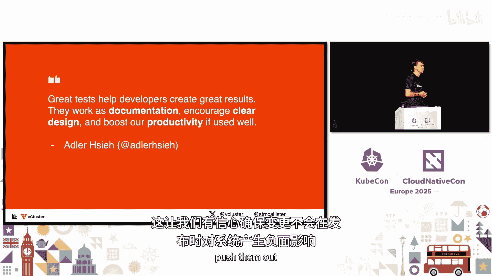

## 什么是端到端测试？🔄

端到端测试是一种测试类型，我们将测试整个流程。

在软件开发中，你可以进行多种不同类型的测试。有单元测试，测试尽可能小的对象或这些对象上的功能。然后是集成测试，我们将这些部分组合在一起。而端到端测试，我们将体验用户所体验的。

如果你有一个Web应用或移动应用，我们将测试与后端交互的用户界面，而后端又与我们的数据存储交互。我们希望整个流程都被覆盖。

你可能会想，这工作量很大。确实，编写这些测试需要时间，思考它们如何影响系统或如何构建流程需要时间，设置开发或测试环境也需要时间。这确实需要投入。

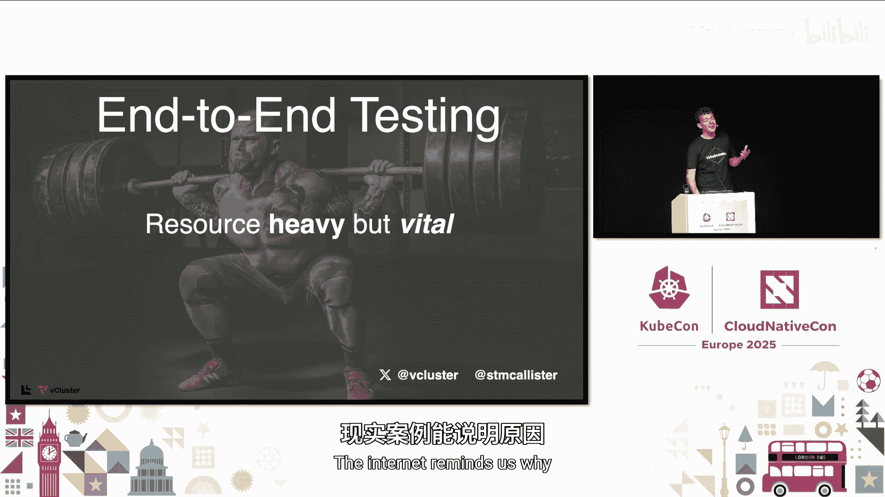

## 测试如同举重 🏋️

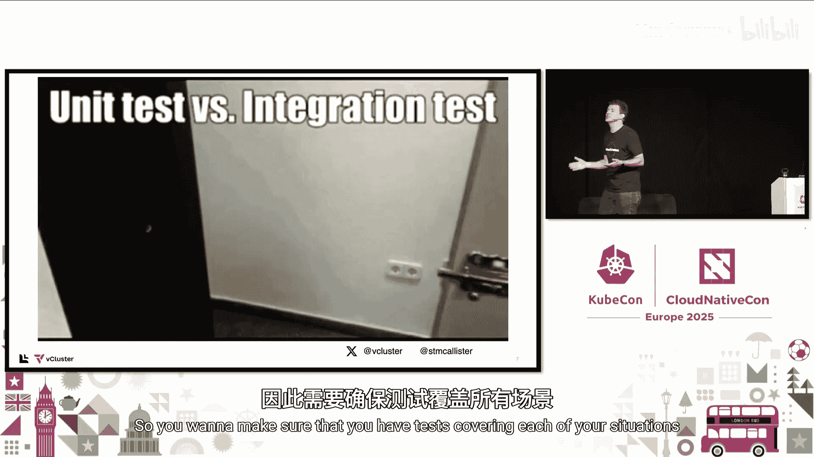

就像举重一样，好的测试让我们的应用更强大。不仅是端到端测试，我们还应该牢记其他类型的测试，如单元测试和集成测试，确保每个不同的方面都被覆盖。互联网上的一个例子提醒了我们原因。

## 一个现实世界的例子 🔒

这个锁经过了单元测试。它完全能用。或者它不能用。

谁写过这样的代码？我也写过。你写代码是为了做一件事，然后发现，哦，等等，它做了这个我不希望它做的事。因此，你需要确保有测试覆盖你的每一种情况。

## 测试环境的重要性 🎯

你还需要确保测试环境尽可能接近生产环境。

在我的职业生涯中，遇到过这样的情况：测试环境可能运行着最新、最先进的版本，而生产环境则更稳定，不常做改动。你需要确保两个环境相同，或尽可能接近。

就像我们的小英雄一样，他看到那个斜坡，心想：我能行，我能冲过去，轻松完成这个赛道。而现实中，它看起来更像是这样。用户可能会遇到生产环境中出现而测试环境中未出现的潜在问题，如内存问题、延迟或网络延迟。

因此，我们希望保持环境非常、非常相似。但这不正是容器的承诺吗？我们使用容器不正是为了这个吗？我们将应用代码和依赖项打包成一个整洁的小容器，然后我可以将这个容器分享给你，在你的系统上运行，它应该是一样的，应该以相同的方式运行。

但是，围绕该容器的配置以及该容器的运行方式呢？它们相同吗？思考一下。

## 演示应用：汉堡店追踪器 🍔

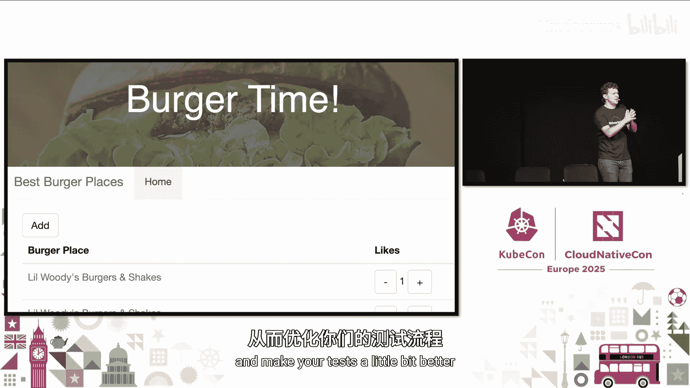

我想分享一个我构建的演示，主题是我非常热爱的。我喜欢汉堡。谁喜欢汉堡？我也喜欢。我总是可以吃汉堡，它们太棒了。所以我构建了这个应用来追踪我去过的所有汉堡店，并希望记住它们，同时也让我的朋友投票，看看他们是否也喜欢。

我想展示一张它的图片，因为我想让你看到我们为这个界面编写测试时的情况。好的，这就是我们要处理的界面，它有一个汉堡店列表、一个添加按钮和一些投票机制。这样你可以直观地看到它。

我是一个视觉学习者，我需要看到这个，我需要看到图表，但同时我也想看到代码。所以我今天会尝试向你展示这三者，以便每种不同类型的学习者都能理解正在发生的事情。希望在我分享这些想法和工具时，你能将它们带回你的团队。

工具是可以替换的。我可能会在这次讨论或演示中展示一个测试框架或其他类型的工具，而你说，嗯，我不使用那个，但我更喜欢另一个。这很好。希望你能采纳我谈论的原则，并将其应用到你的团队中，让你的测试变得更好。

## 测试工具：Cypress 🛠️

说到测试工具，我将使用Cypress。Cypress是一个用于JavaScript的开源框架，允许你为你的应用编写JavaScript测试来测试你的应用。

Cypress本质上允许你断言事物并检查UI的不同方面，在DOM中查找选择器，稍微操作它们，然后查看这些更改是否符合你的预期。

事实上，让我们看一下我们的测试代码。来到我的项目，我的应用相当简单。我有一个后端、一个前端和我的E2E目录。E2E目录将有自己的镜像，所以它们将成为我应用中的独立容器。

我的测试代码看起来像这样。来到Cypress E2E目录，这是spec文件。在这里，我设置了几个不同的值。首先，我获取一个前端URL。这个前端URL将测试Cypress如何访问我的应用，因为我想测试整个流程，而不仅仅是某个端口上的localhost，我想实际测试正在发生的入口流量。

然后，我将传入一些数据到我的应用中。所以我会在那里放一个新的汉堡店。现在，我将逐步执行每个测试。首先是检查页面是否加载，因为如果页面不加载，其余的测试都无法工作，对吧？所以你首先要在每个函数运行前检查页面是否加载。

因此，我们说我们正在访问汉堡店网站。然后我们在屏幕或页面窗口上找到一个元素。我们说，让我们找到这个带有“add”的锚标签。那是我们的添加按钮。在下一个测试中，我将点击那个添加按钮，因为我假设我找到了它。

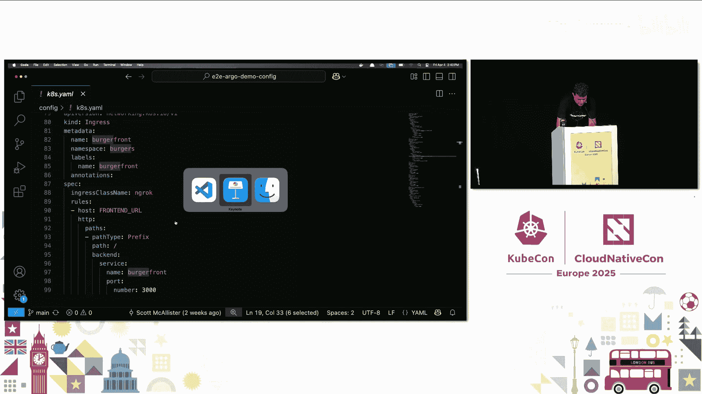

所以你逐步执行你的UI，逐步构建你的流程。所以我要点击它。点击之后，我希望它会打开一个表单让我添加我的汉堡店。然后我将保存它并检查我的列表。

这就是我的测试将为我的应用做的事情。如前所述，我的应用将包含两个容器。它们在一个集群中运行，定义如下。

我有一个后端的部署。它将引用我的后端镜像，我的汉堡后端镜像。它将带有一个在构建过程中定义的镜像标签。然后我有一个前端，非常类似。然后我定义了一个入口。

底部这里有很多入口提供商。我今天将使用ngrok，随着我讲解我的流程，我们会讨论原因。这就是代码。

## 环境架构图 🏗️

我们的环境将看起来像这样。再次强调，我喜欢看代码，也喜欢看图表，这样我可以直观地看到事物如何协同工作。

我试图让我的生产环境和测试站点尽可能一致，尽可能相似。两者都运行前端和后端Pod。然后我有一个测试代码容器，它将与我的测试集群交互。

流程我们稍后会看到。我们将使用GitHub Actions作为运行CI流程的平台，即构建测试然后部署应用的流程。在GitHub Action内部，我们将使用K3s，这是一个超轻量级的、优秀的Kubernetes发行版，允许你启动一个Kubernetes集群，然后在运行GitHub Action时将其关闭。

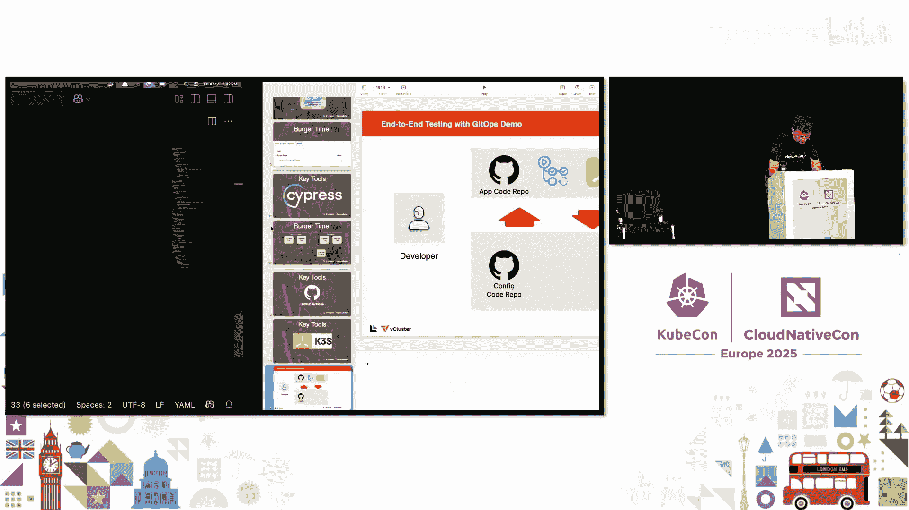

## 流程概览 🔄

我们的流程大致如下。作为开发者，我将有一个应用代码仓库，其中包含我的GitHub Action，运行我的K3s集群。这也将是运行我的Cypress代码的集群或区域。

然后，我将有我的配置仓库。这涉及到我想在此讨论的一些GitOps原则。

GitOps社区建议你将应用代码和配置代码放在两个不同的地方、两个不同的仓库中，因为两者有不同的生命周期。你对应用代码的更改时间会与对配置代码的更改时间不同。甚至不同的团队可能对这两个不同的仓库拥有访问权限。

因此，在这个演示中，我想将它们分开，以展示这可能是什么样子。在这种情况下，我们有我们的应用仓库，它将在GitHub Action期间检出配置代码。它将进行一些更改，因为它将构建我们的镜像并给它们打上标签，对吧？所以我们的配置仓库需要知道这些更改。因此，它会将这些更改提交回我们的配置仓库。

## 深入GitHub Action工作流 ⚙️

现在，让我们看看我们的GitHub Action。我会讲得快一点。我们的GitHub Action里有很多内容。请放心，最后我会提供一个链接，告诉你如何获取所有这些资源，包括仓库、GitHub Action以及我提到的所有资源。

在我的GitHub Action中，我让它运行在拉取请求上，每次你打开拉取请求时运行，不仅是在打开时，还包括他们所说的同步拉取请求时。在GitHub或任何你使用的Git仓库中，你打开一个拉取请求或合并请求。但通常，你会在打开后继续向它提交代码。这就是同步所做的。它会在你每次在该拉取请求上再提交时运行测试。

它将运行在任何试图与主分支合并的拉取请求上。

然后我们进入我们的依赖项。我们将指定GitHub Action在Ubuntu上运行。我们将检出当前仓库的代码。所以拉取请求进来了。

这里我们将指定使用K3s。然后我们将登录Docker，以便在处理镜像、推送镜像时，我们可以将它们推送到Docker Hub，推送到我们工作环境之外的远程Docker注册表，以便它可以在生产环境中部署和运行。

所以我们登录Docker。然后在这里，我们开始构建我们的Docker镜像。我们将构建后端和前端。我们将用提交的SHA值给它们打标签。这是另一个很好的实践。你总是希望你的容器和代码提交具有相同的标识，这样你就可以说，哦，等等，这个特定的镜像、这个特定的容器正在运行这个特定的代码修订版。确保它们对齐且相同。

我们将这些镜像推送到Docker Hub。然后现在我们将检出我们的配置代码，以便我们可以在GitHub Action内部从另一个仓库检出代码。所以我要从我的配置代码仓库检出它。然后，当我获取它时，我给它一个路径，我给它在中间的config_repo_path，这样我可以标识我从那个仓库检出的代码。

在配置仓库内部，它有点大，因为我想让它大一些以便你能看到。所以我将在这里向右滚动一下。我将引用config_repo。在配置目录中，我有我的Kubernetes清单文件，即我们之前展示的带有几个部署、几个服务和入口的K8s清单文件。我希望能够对这个文件执行查找和替换操作。

所以我要查找我的占位符值，即全大写的部分。然后我将为我的镜像标签插入我的SHA值，并为我的前端URL插入值。Vars.全大写。这些是保存在GitHub仓库中的变量值。

在这种情况下，我们使用`sed`命令。这是一个命令行命令，允许你在文件内部进行这种查找和替换。在这种情况下，你也可以使用模板引擎，比如Kustomize或Jinja。这取决于你想使用什么。再次强调，这回到了关于每个步骤都有许多不同工具的讨论。这些只是我今天使用的工具。

接下来在我们的GitHub Action中，我们将安装我们需要的Helm Chart。在这个特定情况下，我们需要一个Helm Chart。我们需要ngrok操作符，以便我们可以使用它来提供我们的入口。

我们选择ngrok的原因是，ngrok允许你设置URL并传递给ngrok服务，该服务引用该URL，而无需了解有关该集群的任何信息，除了它使用这个ngrok操作符与之关联，所以你不需要知道任何服务的IP地址等。这就是我们今天使用ngrok的原因。

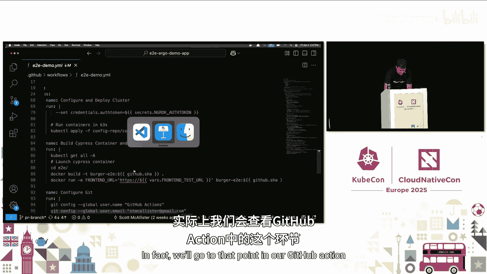

然后，我们应用K8s文件。随着集群运行，我们将构建我们的测试容器。然后我们将运行它。我们将传入我们拥有的前端测试URL。我们在测试代码中设置了那个前端测试URL，但我们也将其设置在GitHub仓库中。GitHub允许你存储变量和秘密等，这些就是你在这个文件中看到的带`vars.`的值。

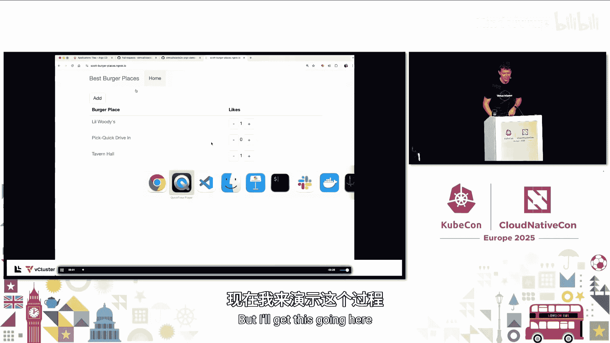

## 演示流程回放 ▶️

事实上，我们将进入那个时间点，在我们的GitHub Action中。我录制了整个过程。视频的好处是我们可以逐步查看，我可以暂停，可以跳过。不好的部分是，我不能真正改变分辨率。所以抱歉。

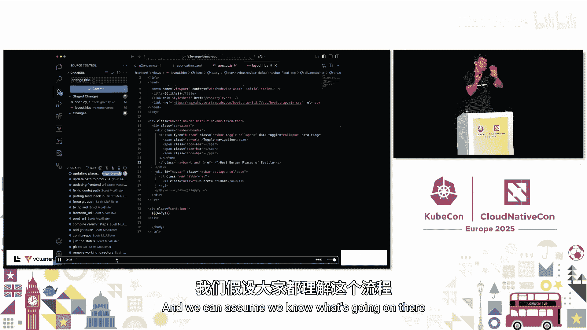

但我会开始播放。本质上，我所做的是，我看到我想在我的网站上做一个更改。我想更改标题，因为我意识到这不是一个全球所有汉堡店的列表，只是华盛顿州西雅图（我来自的地方）的汉堡店列表。所以我做了更改，说“西雅图汉堡店”。

然后我将推送该代码。所以我会提交它。我们可以假设我们知道那里发生了什么。

所以我会跳过那部分，它将把代码推送到GitHub。现在我打开一个拉取请求。那个拉取请求随后启动我们的GitHub Action。

观看这个的好处是，我不会让我们看整个过程，但它会开始构建并安装我们所有的依赖项。我们在开始之前看到它正在获取K3s，以便我们可以使用它。现在它将构建我们的后端和前端的Docker镜像。

我们将跳过那些部分，因为这需要时间。再次强调，这回到了整个幻灯片。记住举重者的比喻，它确实需要时间。然后现在，我们将跳到这里，我们的测试。然后，就在这里，我们的测试运行了。

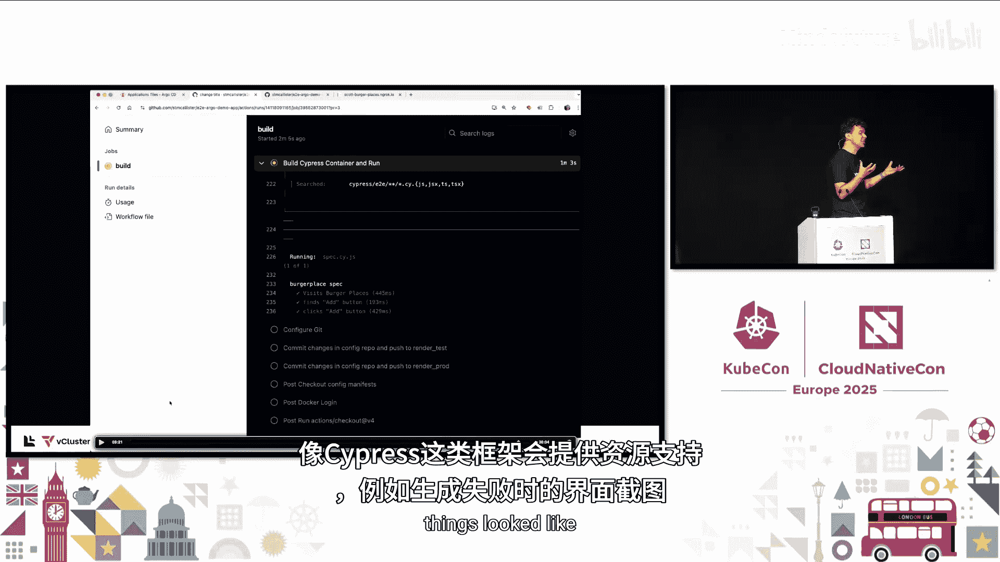

在众人面前做事总是更难。好了。我们将看到三个测试通过，所有四个测试通过。我保证我不想花时间试图快进到那里。但我们看到我们的测试通过了。

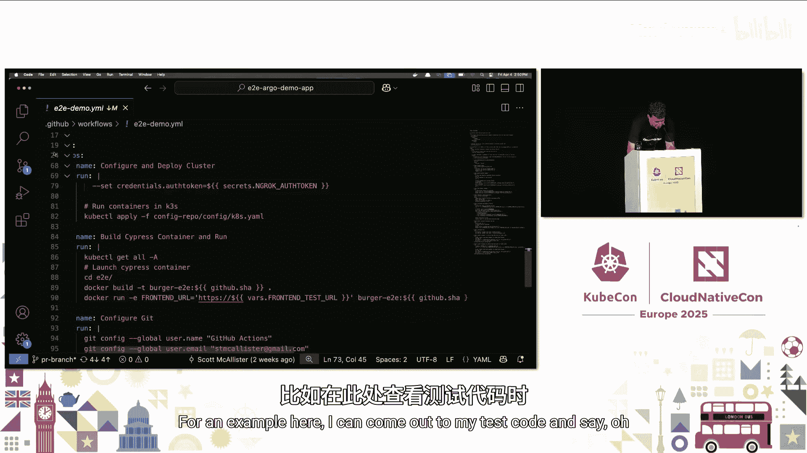

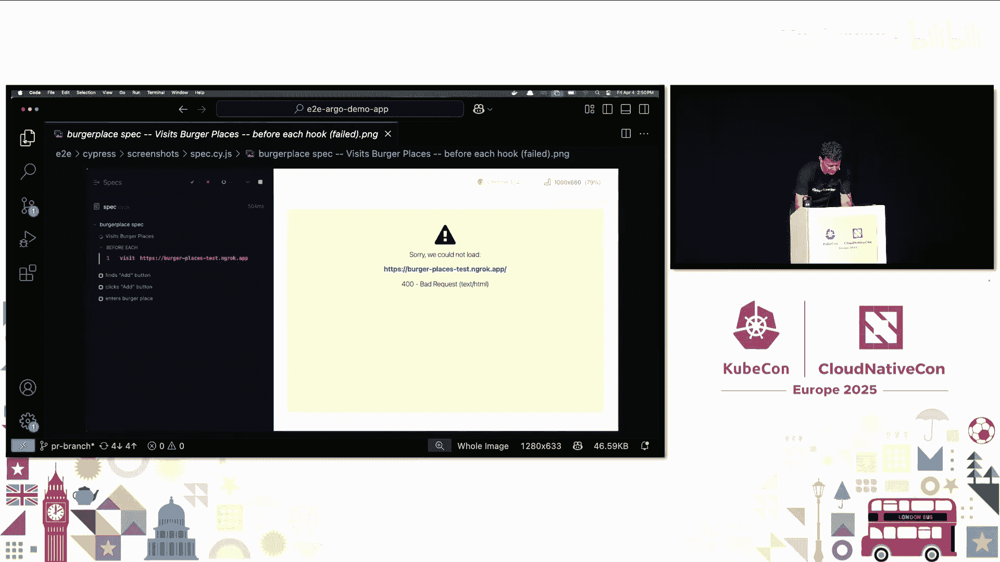

然后它可以继续我们GitHub Action中的后续步骤。如果我们的测试没有通过，像Cypress这样的框架可以提供资源，比如给你一张截图，显示当时的情况。

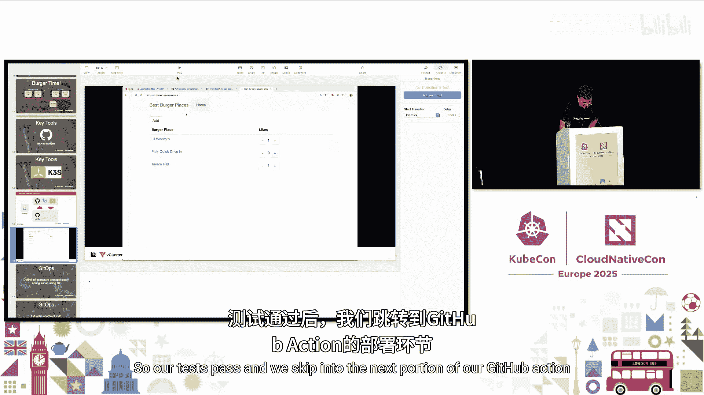

例如，在这里，我可以来到我的测试代码，说，哦，失败时是什么样子？我说，哦，这是它无法加载时的截图。那个第一个测试说，这就是我看到的。这就是Cypress所说的。所以你可以在运行测试时将其作为资源。

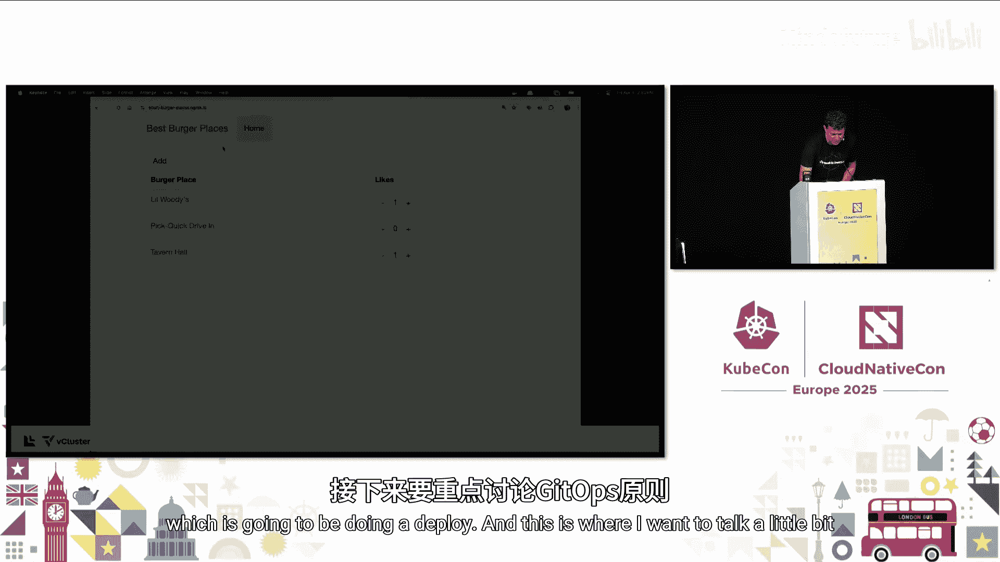

## 测试通过后的部署 🚀

所以我们的测试通过了，我们跳转到GitHub Action的下一部分，即进行部署。在这里，我想更多地谈谈我们的GitOps原则。

## GitOps原则 🤖

GitOps是一种哲学，本质上说我们的基础设施被定义为代码。我们应该使用Git作为单一事实来源。Git是我们应该存放一切的地方，所有配置都存储在那里。你不手动进行更改，而是通过提交到Git仓库来进行更改。

这样，现在你就有了你所做的每一次更改的历史记录，你确切地知道更改了什么、谁更改的以及何时更改的。这一切都发生在Git内部。但同时，你也有这些流程，比如我们刚刚看到的GitHub Action，它随着我们的Git流程发生，我们推送代码，然后可以开始在该代码上运行自动化，这样当我们推送配置更改时，我们可以测试以确保我们的配置实际工作，我们的应用实际工作。

Git作为我们的单一事实来源。接下来我要讨论的是GitOps社区中的另一个想法，他们称之为“渲染清单模式”。

这是一种模式，你的清单（即我们实际要用于部署的K8s配置文件）已经完全渲染好，包含我们要使用的值，并放置在仓库中，以便CD流程可以获取它们。CD流程不会找到一个模板然后替换值。我们实际上将拥有该清单的渲染版本。

在我们的例子中，在GitHub Action期间，测试通过后，我们让GitHub Action将更改提交回配置仓库。但它不是放到主分支，而是为测试创建了分支：`render-test`和`render-prod`。在这种情况下，我们创建了这些永远不会合并回主分支的分支。

它们将是CD流程监视的独立位置。主分支将保留模板，即包含占位符值的模板。而在渲染分支内部，我们有完全渲染的配置。

这样做的好处是，你再次拥有了应用配置的完整历史记录，不仅用于生产，也用于测试。那些测试分支中的配置是刚刚在GitHub Action中运行的。但现在你有了那个测试。如果你想在应用部署到外部世界后运行额外的测试，你也可以这样做。这被称为冒烟测试，以确保你能在用户发现问题之前发现问题。

在这个例子中，我们看到渲染清单中包含了镜像标签和测试分支中的URL值。然后我们也有……视频的好处，对吧？今天我们不演示这个。所以你还看到我们有镜像标签，它们带有来自git提交的SHA值，并且在我们清单内部。

## 引入Argo CD 🎯

现在我们已经有了渲染清单，它们位于分支中，准备被渲染和部署。我们将介绍今天的最后一个工具：Argo CD。Argo CD将监视我们的特定分支，并说，好的，我将监视特定分支，当该分支有更改时，我将部署它。

在我们的例子中，我们将查看`render-prod`分支。我将播放这个视频。你会想观看。你看到右下角那些青绿色的方框了吗？那就是你想看到更改同步的地方。

那将在我们推送到生产环境之前处理我们对集群的更改。我们看到，我们检查确保入口设置好了，部署设置好了。然后我们可以去查看我们的生产站点。更改已经完成。

所以我更改了标题，并且我有信心我做的更改没有对我的系统产生不利影响，并且完全按照我的意图执行。

现在，敏锐的眼睛会注意到这个列表是0。在开始填写表单之前，而前一个不是。嗯，这是因为这个应用运行在本地存储上。在现实生活中，你会希望有持久卷、一些持久存储，这样你就不会每次创建新镜像时丢失数据。

## 应对更复杂的应用：vcluster 🚀

所以你可能会想，Scott，这很好。但我的应用比两个部署或两个服务要大得多。我的应用有很多CRD。这将需要更长的时间来构建和测试。你没有错。

我最近了解到一个新项目，对我来说是新的：vcluster。vcluster是一个Kubernetes发行版，允许你在一个集群内部拥有另一个集群。从某种意义上说，你可以有一个临时的、短暂的Kubernetes集群运行在主机集群内部。

那么，这如何帮助测试呢？想象一下：你有一个集群运行在你的云或环境中，它运行着你生产环境的vcluster。这没问题。但主机集群内部安装了所有这些CRD。你想用相同的CRD、相同版本的CRD进行测试。使用vcluster，你能够启动一个新的vcluster，使用所有相同的CRD，测试完毕，然后将其关闭。

你可以在GitHub Action中完成所有这些。我上周刚加入这个团队，所以还没有准备好展示任何东西。但我有一个链接，指向我的同事Siam制作的一些资源，这些资源也可用，我稍后会通过二维码展示。你可以看到如何做到这一点。

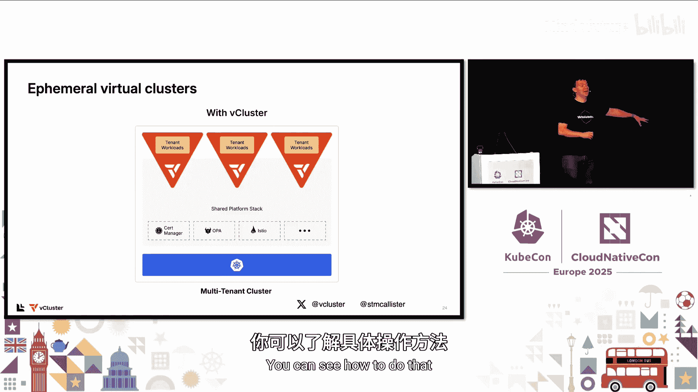

## 总结与资源 📖

事实上，我相信就是那个二维码。我在我们的社区GitHub社区Slack工作区创建了一个频道，用于测试的一般讨论，但也包含我看到的幻灯片的链接（实际上是扩展版本的幻灯片，因为我不得不删减了很多内容），以及仓库的链接，还有Siam关于如何在拉取请求中启动临时环境的文章链接，类似于我刚才所做的，但是使用vcluster。

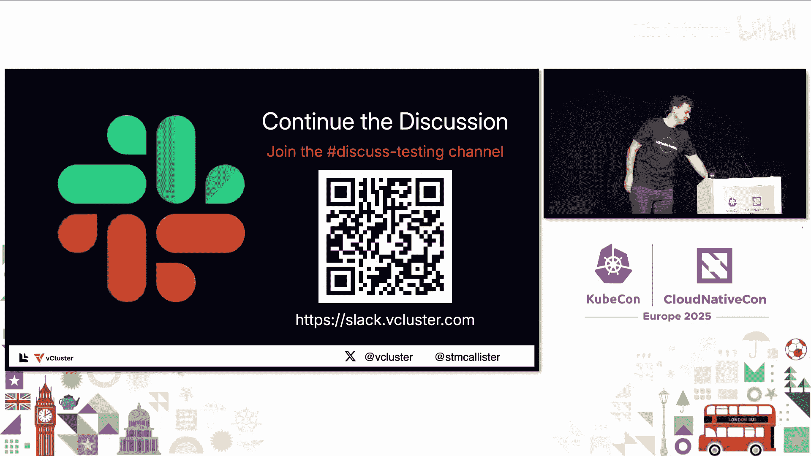

我是Scott McAllister，最近加入了vcluster的制造商GitLab，担任开发者布道师。非常感谢大家今天来听我的演讲，希望大家在接下来的演讲中度过愉快的一天，并祝旅途平安。

