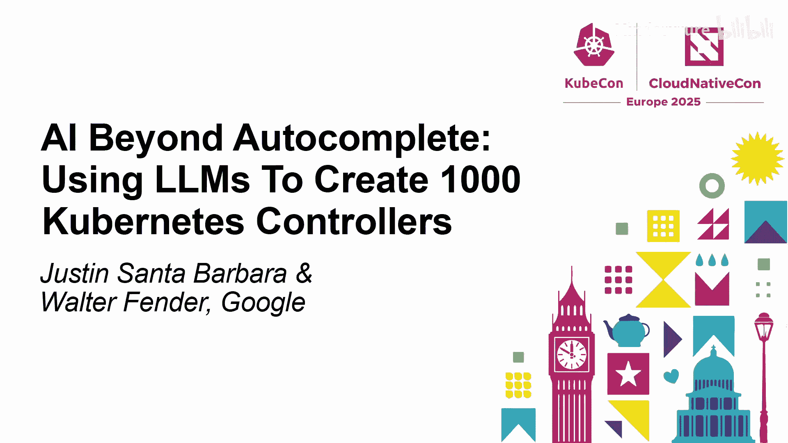
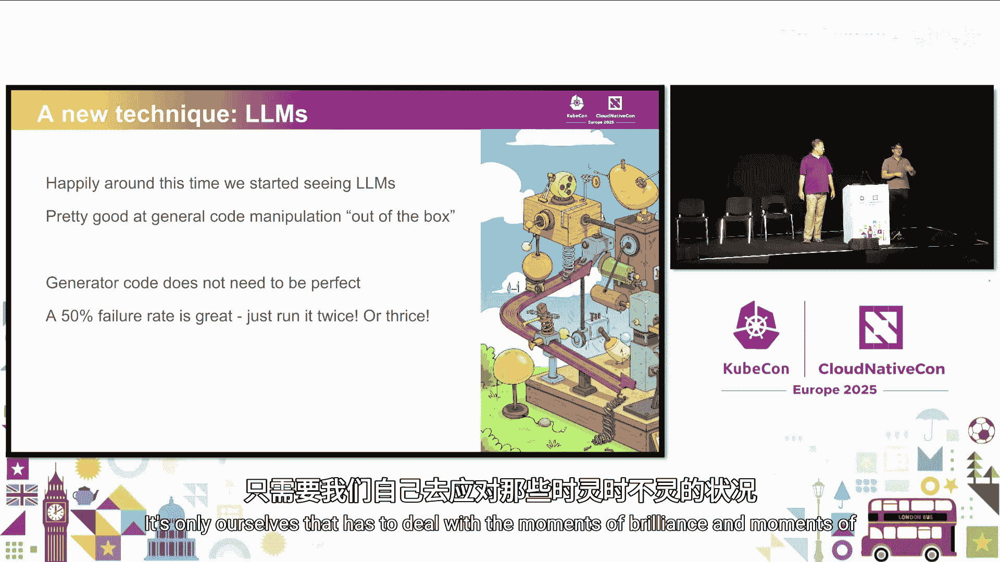
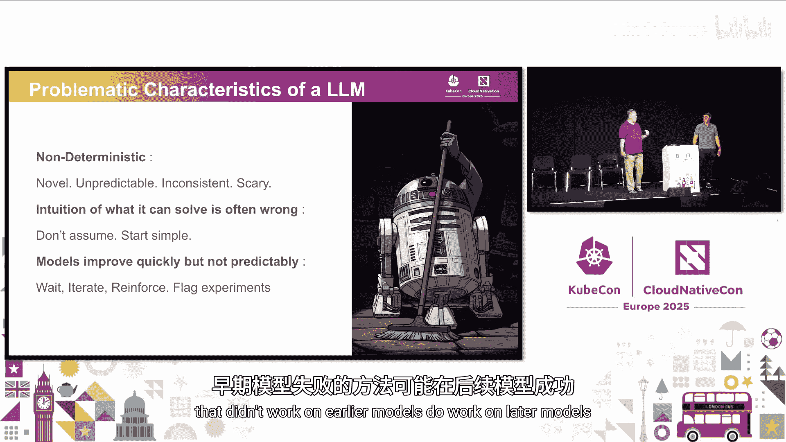
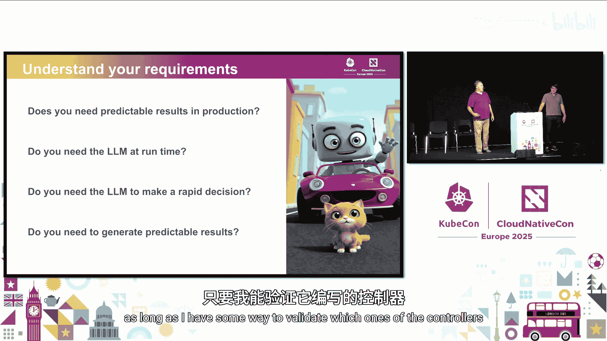
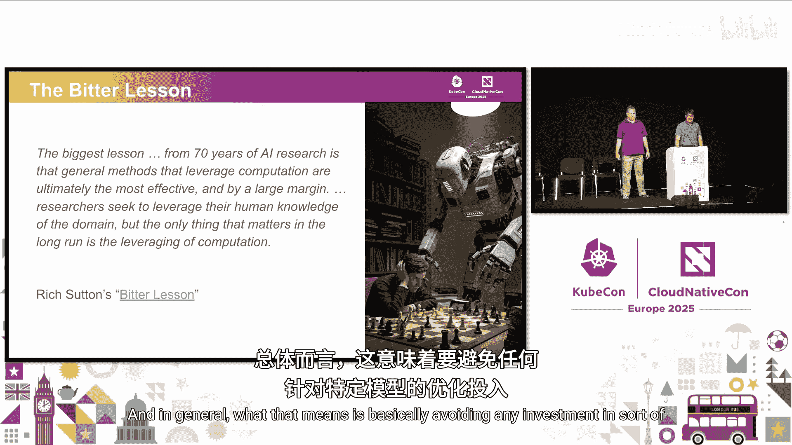
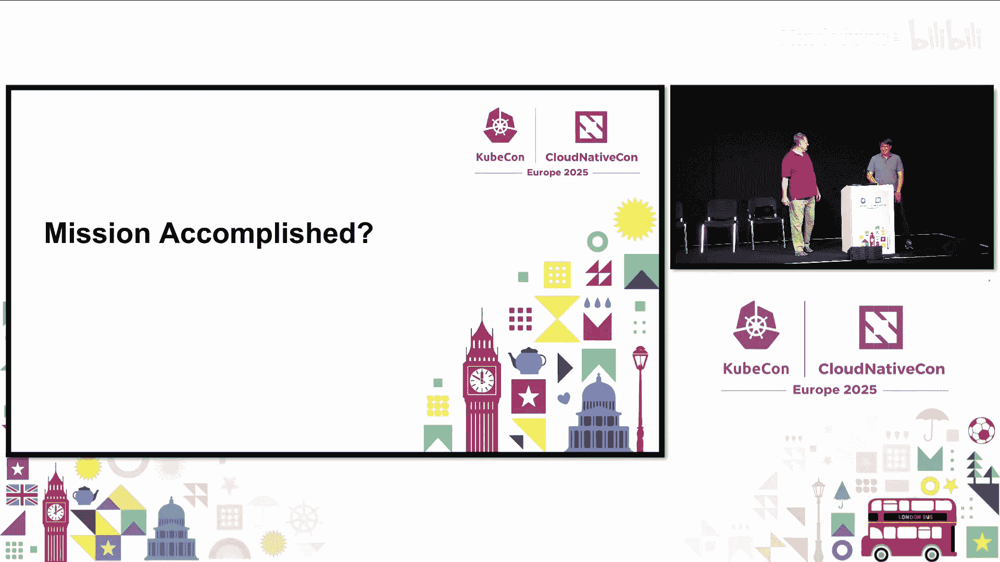
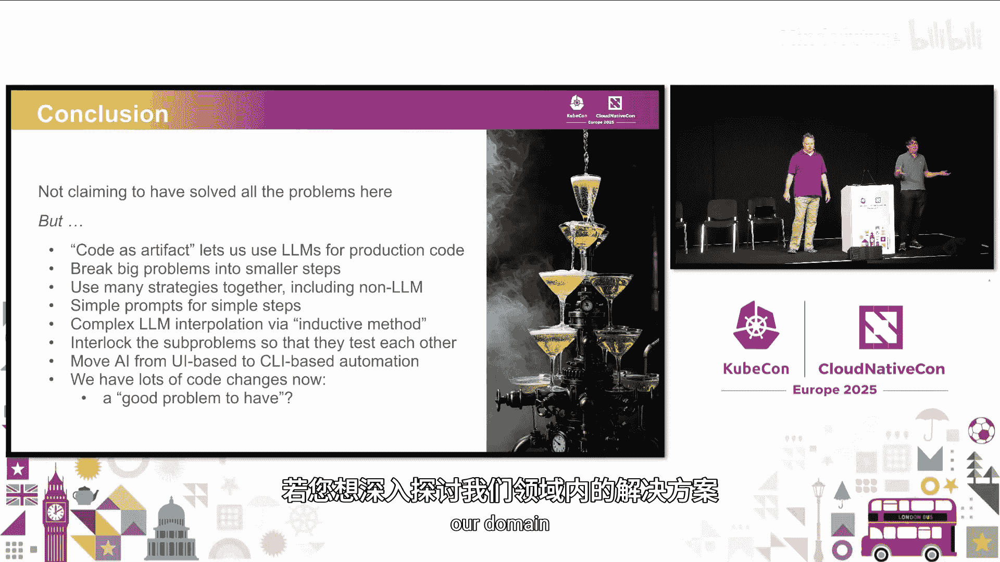
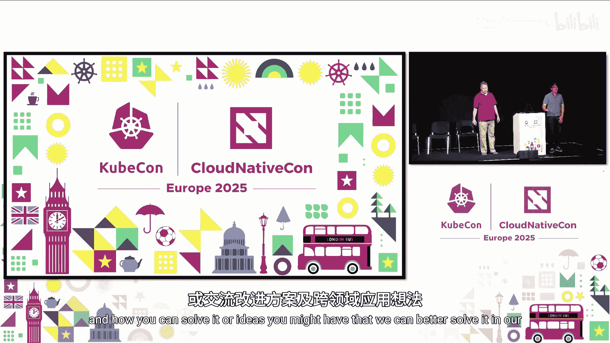
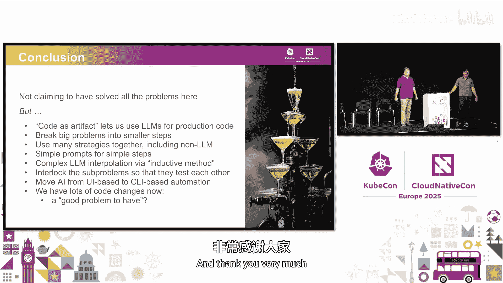

# 055：超越自动补全——利用大语言模型创建1000个Kubernetes控制器

在本教程中，我们将学习如何利用大语言模型（LLM）来大规模生成Kubernetes控制器。我们将以Google的Config Connector项目为例，该项目需要管理约1000个不同的Google云资源，因此需要编写1000个对应的控制器。我们将探讨如何从传统的“魔法机器”方法转向基于LLM的代码生成策略，并分享在实践过程中遇到的挑战、解决方案以及核心原则。

## 从“魔法机器”到代码即产物 🧠

上一节我们介绍了项目背景，本节中我们来看看核心思路的转变。

Config Connector项目的目标是为Google Cloud的REST API提供Kubernetes原生接口。这意味着每个云资源都需要一个对应的自定义资源定义（CRD）和控制器。最初，团队尝试基于Terraform等工具构建一个统一的、复杂的核心控制器（即“魔法机器”）。这种方法的问题是，任何针对单一资源的修改都可能意外破坏其他资源，维护成本极高，且难以响应简单的客户需求。

因此，团队提出了一个关键的理念转变：**将复杂性从运行时转移到构建时**。我们不再构建一个在客户环境中运行的、极其复杂的“魔法机器”，而是接受生成大量简单、独立的代码。只要每段代码都是简单且自包含的，代码总量多并不是问题。我们可以利用LLM这样的“终极魔法机器”在构建时高效生成这些简单代码，而最终交付给客户运行的是清晰、可维护的产物。

这种“代码即产物”的理念至关重要。代码本身定义了产品，是我们必须与之协作的主要工件。所有工具，特别是AI工具，都必须能够基于现有的代码库进行工作，做出小的增量改进，而不是假设它们从头创建了一切。

## 为何选择LLM而非传统工具？ ⚙️

上一节我们介绍了核心思路，本节中我们来看看为何选择LLM作为实现工具。

在采用LLM之前，团队尝试过基于抽象语法树（AST）的传统代码生成工具。虽然生成的代码质量不错，但构建和维护这套系统本身非常复杂，每次遇到新情况都需要大量人力投入，无法满足生成1000个控制器的目标。

恰逢其时，以ChatGPT为代表的LLM开始展现出强大的代码理解和生成能力。LLM的优势在于：
*   **开箱即用的代码处理能力**：无需像传统工具那样进行大量底层工程。
*   **对可靠性的要求不同**：我们不需要LLM达到100%的确定性。因为它只在构建时运行，我们可以接受它偶尔产生错误结果，通过多次运行或人工筛选来获得正确输出。这大大降低了使用门槛。

## 拥抱不确定性：LLM带来的新挑战 🤔

上一节我们看到了LLM的优势，本节中我们来看看随之而来的新挑战。

对于习惯确定性工具的工程师来说，LLM的非确定性特性带来了新的挑战和思维转变：
*   **测试失败的含义**：如果运行测试失败，是提示词有问题，还是只是LLM本次生成走了“坏路径”？可能需要重新运行多次。
*   **直觉可能误导**：不要轻易假设LLM“不能”做某事。例如，团队曾费力编写YAML解析逻辑，后来发现直接给LLM原始YAML它也能处理得很好。
*   **模型持续进化**：今天尝试无效的方法，可能在下一代模型上就有效了。因此，将实验过程标记以便在新模型上重新运行是非常有价值的。

理解自身需求对于设计解决方案至关重要：
*   **是否需要生产环境确定性**：我们不需要。LLM在构建时运行，生产环境运行的是生成的确定代码。
*   **是否需要快速决策**：不需要。构建过程可以花费较长时间（例如整夜运行）。
*   **是否需要可预测的结果**：需要，但不必每次都对。可以通过多次运行和验证来获得正确结果。

## 核心策略：接受“苦涩的教训” 🎯

上一节我们讨论了挑战，本节中我们来看看应对这些挑战的核心哲学。

Rich Sutton的“苦涩的教训”一文对AI研究和我们的软件工程实践都有启发。其核心思想是：研究人员或工程师会投入大量领域知识来优化当前的AI系统，并取得良好效果。然而，下一代AI模型、更多的算力或新硬件往往会轻松超越这些精心设计的优化。

因此，我们必须接受这一“苦涩的教训”，并采用不会因此失效的策略。这意味着：
*   **避免针对特定模型的深度优化**：例如，不过度花费数周时间微调提示词，因为新模型可能对提示词的反应完全不同。
*   **聚焦于通用技术**：
    *   **确保输入信息的质量**：遵循“垃圾进，垃圾出”的原则。想要输出中包含的信息，最好确保它出现在输入上下文中。
    *   **分解大问题**：将复杂任务拆解为多个小任务。
    *   **建立反馈循环**：持续改进我们的方法和工具。
    *   **利用LLM当前的优势**：例如，为其暴露工具或函数调用能力。

目标是，当新一代模型发布时，我们将其纯粹视为利好，而不是让所有前期工作作废。我们只需轻微调整提示词，就能看到结果变得更好。

## 构建工具链：“夹具”与“联锁”机制 🛠️

上一节我们确立了核心策略，本节中我们来看看具体的实现方法。

我们构建了许多小型工具（称为“夹具”），并设计让它们协同工作的“联锁”机制。

**简单任务：提示词模板与工具调用**
对于简单任务，我们使用基本的提示词注入或模板，并为LLM暴露一些简单函数（如写入文件、运行`gcloud help`命令）。例如，让LLM读取`gcloud`帮助文件并尝试构建一个测试用例。

**复杂任务：归纳循环**
对于编写控制器、CRD等复杂任务，简单的“氛围编码”效果不佳，需要更多结构。我们采用“归纳循环”方法：
1.  手动编写几个示例（如Fuzzer），并在代码中添加特定注解，将输入（注解）和输出（代码文件）配对。
2.  当需要生成下一个类似代码时，扫描代码库，将所有已有的输入-输出对放入LLM的上下文。
3.  向LLM提供新任务的输入（注解），要求它生成对应的输出（代码）。
4.  对LLM的输出进行修正（或重新运行），通过代码评审后提交到代码库，这就成为了新的示例。

这个过程可以有效地从2个示例扩展到3个、4个，直至覆盖大量资源。

**任务分解与联锁验证**
生成一个控制器大约需要12-15个步骤。每个步骤相对独立，并且包含验证机制（“联锁”）。例如，在生成HTTP日志的步骤中，如果发现大量404错误，流程就会暂停并标记问题，而其他成功的步骤可以继续。

这种分解的另一个假设是：**两个独立任务同时产生能够完美配合的幻觉错误的概率很低**。如果它们生成的代码能够正确协同工作，这本身就是它们可能正确的一个证据。

## 规模化与信任构建 📈

上一节我们介绍了生成单个控制器的流程，本节中我们来看看如何规模化并确保质量。

**规模化流水线**
我们构建了自动化流水线，将10-15个步骤串联起来，并支持基于元数据驱动地对大量资源进行并行处理。例如，可以一次性对1000个资源运行第一步，第二天检查结果，然后对成功的600个资源运行第二步，同时调试失败的400个。有些步骤也可以是非LLM的混合方案（如使用现有的CRD生成器）。

**构建信任机制**
生成了大量代码后，如何确保质量？
*   **代码审查**：有效但可能成为新的瓶颈。
*   **Linter**：使用针对CRD和代码的Linter捕获常见问题。
*   **可信测试**：如果已知输入和预期输出，生成的测试本身就提供了验证。还可以通过A/B测试，同时用模拟服务和真实服务运行测试来增强信心。
*   **使用不同LLM进行审查**：让另一个LLM专门查找特定类型的问题。
*   **人机协作**：将人类擅长的工作（如API设计评审）留给专家，自动化其他部分。

## 关键要点与总结 🏁

在本教程中，我们一起学习了如何利用LLM大规模生成Kubernetes控制器。我们探讨了从“魔法机器”到“代码即产物”的思维转变，拥抱LLM非确定性带来的挑战，并制定了接受“苦涩的教训”、聚焦通用技术的核心策略。通过构建“夹具”与“联锁”工具链，采用“归纳循环”方法分解复杂任务，我们实现了控制器的自动化生成。最后，我们讨论了通过流水线实现规模化以及构建多重验证机制来确保代码质量的实践。

**关键要点总结：**
*   **解决正确的问题**：明确你是否真的需要生产环境确定性或快速响应。
*   **验证至关重要**：在每个步骤建立验证机制，防止在错误的基础上继续构建。
*   **记录意图与结果**：记录给LLM的指令、反馈和错误，便于调试和迭代。
*   **可能不存在唯一解**：针对不同场景（如全新生成 vs. 向后兼容）可能需要不同的生成路径。
*   **与开源理念相通**：生成大量简单、可读的代码，有利于社区贡献和审查，这与优秀的开源项目实践是一致的。

虽然我们尚未解决所有问题，但上述技术在需要大规模生成代码或配置的领域具有广泛的适用性。希望这些经验能为你利用AI提升工程效率提供启发。

