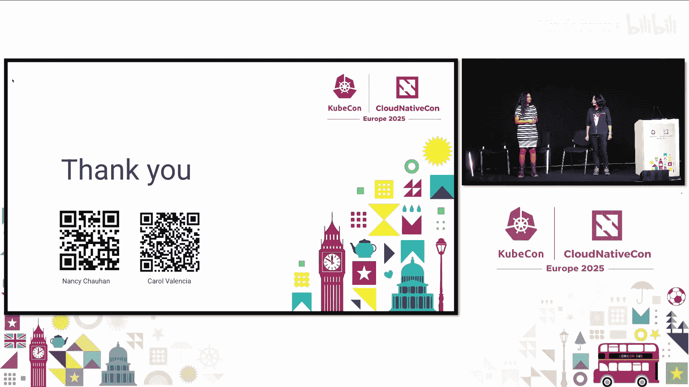
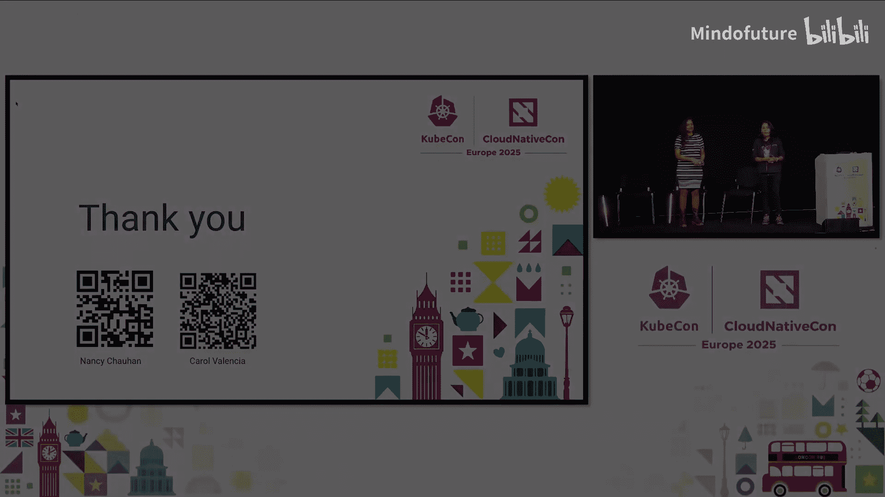

# 056：无需代码 - 从表情符号到贡献阶梯的荣耀之路

## 概述

在本节课中，我们将学习如何在不编写代码的情况下，为云原生和开源项目做出有意义的贡献。我们将探讨非代码贡献的重要性、多种贡献方式，并通过具体的项目（如Kubernetes和OpenTelemetry）实例，为你提供清晰的入门路径。

## 演讲者介绍

我是Nancy。我热爱产品，目前是一名工程师和开发者布道师，同时在康奈尔大学攻读硕士学位。我曾任职于电商初创公司B Ki，并曾为Gitford和LocalStack做布道工作。我是CNCF大使，并创立了“云原生女性社区”，正是在那里我结识了Carol并成为了好友。我还曾担任CNCF学生周的联合主席，以及技术环境可持续性特别兴趣小组的联合主席。我热爱自然、猫咪和旅行。

我是Carol Valencia。我专注于云原生安全领域，曾就职于Aqua Security，目前任职于El。我同样是CNCF大使，并与Nancy共同活跃于社区。我是拉丁美洲的云原生分会组织者，并参与Kubernetes发布团队的工作。由于英语并非我的母语，我也积极帮助进行西班牙语的本地化工作，主要参与Kubernetes和OpenTelemetry项目。我的经历让我深刻理解社区协作，尤其是对于非英语母语贡献者的重要性。

## 为什么非代码贡献至关重要？🤔

在深入探讨之前，我想问大家：有多少人曾因文档糟糕而感到困扰，并希望有人能修复它？我看到很多人举手了。这正是我们讨论的起点。

我们从咖啡社区和开源社区收集了许多观点，其中我最认同的一点是：**非代码贡献者是代码贡献的倍增器**。你无需编写代码也能为开源项目做出贡献。

许多人最初感到不知所措和胆怯，认为必须编写代码或构建复杂软件才能融入。但事实上，存在一篇很棒的文章《我为自己是一名非代码开源贡献者而自豪》，这激励了许多人。这也是我们今天演讲的核心：激励大家进行更多的非代码贡献。

非代码贡献是开源成功的秘诀。它们通过多种方式赋能开源项目，无论是改进文档、建议更好的用户体验，还是提供反馈。在今天的讨论中，我们将详细探讨这些方式，或许你能找到自己感兴趣的贡献方向。

## 非代码贡献实例：用户反馈 🔄

让我们看一个常见的例子，这也与我个人的经历相关。

在我职业生涯初期，我们使用Grafana的开源版本。我们对Grafana有很多反馈。后来在Kubernetes论坛上，我们有机会与Grafana团队坐在一起交流。我们提出了反馈：能否修复代码库中的某些问题？能否增加更多功能？

这就是一种贡献。用户提出问题或提供反馈，例如：“我试用了你们的产品，但入门流程可以更好，文档不够清晰。” 维护者接收并倾听这些输入。我相信在座的维护者会认同反馈的重要性。

随后，维护者从中获得见解和想法，改进功能并进行实验，最终交付更优秀的、用户喜爱的软件。**提供反馈就是一种重要的非代码贡献**。

## 社区构成与影响力 📊

这是一组来自KubeCon 2024巴黎大会的参会者数据。其中包括商务运营、高管、销售与市场、产品经理、教授、学者和学生。这些角色与产品直接相关，但他们并非都是开发者。这个比例相当可观。

为什么非代码贡献如此重要？因为**社区远不止于代码**。以Kubernetes为例，其成功背后有无数人在努力：有人负责文档，有人负责发布团队和沟通，有人负责问题分类。正是这些人的共同努力推动了开源项目的成功。

非代码贡献者驱动着影响力，无论是收集反馈还是连接社区。**技术在认可贡献时，并非只局限于代码，每个人都有属于自己的空间**。

## 非代码贡献角色清单 📝

以下是一个庞大的角色清单，你可以看看是否能与其中任何角色产生共鸣：

*   **文档与内容**：分享知识、撰写博客、帮助翻译。
*   **沟通**：在Slack等渠道提供帮助，这对所有开源项目都至关重要。
*   **问题分类**：审查GitHub issue和PR。
*   **质量保证**：测试、CI/CD、漏洞修复。

云原生计算基金会（CNCF）有超过1000个项目。虽然我们将重点讨论Kubernetes和OpenTelemetry这两个大型项目，但这里提到的所有贡献方式都可以应用于成千上万的CNCF项目中。

## 如何开始：阅读贡献者指南 🚪

每个开源项目通常都有一个贡献者指南，即使是沙箱阶段的项目也有贡献模板。你可以从中找到贡献方式：发现问题、进行测试等。

对于像Kubernetes和OpenTelemetry这样拥有复杂指南的大型项目，一个好的起点是尝试阅读它们。即使内容繁多，这就像进入一个新社区前需要了解规则一样。不要直接提issue问“为什么不行？”，可以先尝试理解项目。

另一个关键是建立联系。尝试接触项目的维护者，了解他们。这是第一步：认识社区成员，尝试理解项目，并通过Slack等渠道提问。这将是每个人开始贡献的良好开端。

## 聚焦：文档贡献 📄

文档是一个重要领域。一方面，有专业的技术文档工程师；另一方面，有产品经理。但在开源领域，有时这两者之间缺乏沟通。这可能导致文档难以理解，例如当由资深工程师撰写时，内容可能过于晦涩。

这时就需要可用性或用户体验方面的贡献。我们需要更多从用户视角出发的人，来创建更好的内容，考虑到所有可能使用该开源项目的用户类型。在开源世界中，并没有专职的这些角色，每个人都是在奉献自己的时间。你需要理解，维护者批准你的请求或给予反馈可能需要时间，但这正是宝贵的学习之路。

## 本地化：跨越语言障碍 🌍

对于非英语母语者或来自其他国家的贡献者，本地化工作至关重要。它有助于触及更广泛的受众。我们不一定需要翻译所有内容，但可以翻译基础知识。例如，Kubernetes和OpenTelemetry有复杂的概念，你可以翻译这些基础内容。

本地化不仅限于开源项目文档。例如，有一个很棒的项目为听障群体创建资源。我们可以帮助他们翻译，以触达更多属于这些少数群体的用户。翻译白皮书、建筑文本等，在考虑本地化时，有很多事情可以做，这贯穿于所有文本和整个CNCF生态。

## 贡献者阶梯与成长路径 📈

你可以从贡献者开始，尝试翻译、帮助进行问题分类、管理Slack频道或协助发布博客内容。之后，通过展示持续投入的韧性（在开源社区中，保持持续参与有时颇具挑战），你可以成为维护者。

开源社区中有优秀的领导者思考如何发展社区。例如，在Kubernetes中，有团队专门创建博客，展示即将开发的新功能，并考虑新手的体验。随着你在贡献者阶梯上成长，你还可以创建更多项目，帮助他人了解如何互助。

## Kubernetes社区：非代码贡献的组织范例 🏗️

Kubernetes社区规模庞大，是非代码贡献体验组织的一个绝佳范例。

*   **贡献者体验**：这是一个完整的GitHub项目。如果你擅长数据分析或希望参与导师计划（这需要管理并联系能互相帮助的人），可以加入其中。
*   **社区管理**：DevStats、活动等都是独立的项目。
*   **博客管理**：例如Kubernetes发布博客，其背后需要大量人员协调不同小组的工作。
*   **新贡献者培训**：每周录制视频，指导如何在Kubernetes中成为新贡献者。
*   **资讯项目**：汇总所有Kubernetes的新功能和新闻，供新用户参考。

Kubernetes社区投入了大量精力创建了一个关于非代码贡献的网站。你可以扫描二维码查看详情。无论你想从发布团队、文档还是其他方面开始贡献，都可以参与其中。

## 测试：确保项目稳定运行 🧪

测试是另一项关键的非代码贡献。你需要通过测试来确保一切按预期工作。每个人的环境设置都不同，这正是优势所在：你可以提供反馈。多样化的测试者能发现独特的可用性问题。

你可以通过多种方式帮助开源项目：测试功能、报告错误、验证修复、尝试复现问题。即使你只是运行项目时遇到障碍，也可以提出issue，指出某些地方无法正常工作。**测试功能本身就是一种贡献**。

## 问题分类：管理项目入口 🗂️

问题分类是一个流程，通过审查新的GitHub issue和PR来组织它们以便采取行动。像Kubernetes或OpenTelemetry这样的大型项目有大量issue和PR。你可以成为分类员，以此方式做出贡献。

这个过程根据优先级或紧急性等因素对issue和PR进行分类。这能让你深入了解项目环境和开源项目的运作方式。这是开始接触并熟悉项目的好方法。

同样，社区网站提供了如何入门的详细信息。

## 发布团队：参与项目周期 🚀

每个Kubernetes版本都有发布团队在辛勤工作。发布团队为熟悉Kubernetes项目及其生态系统提供了绝佳机会。

发布团队包含多个角色：增强功能负责人、通讯负责人、发布信号负责人、文档负责人、发布说明负责人等。你可以以不同方式参与。在任何软件发布中，都有大量的项目管理、博客发布和跨小组沟通工作。虽然这些工作可能不那么显眼，但它们至关重要。

发布路径在GitHub上可视化。扫描二维码可以访问发布团队的GitHub仓库，其中展示了与Kubernetes版本发布相关的许多部分：文档、通讯、CI/CD流水线等。我们确实需要更多人来贡献这些专业领域。

## 选择适合你的项目 🎯

Kubernetes可能让人望而生畏。我的建议是：从一个你更熟悉或更感兴趣的项目开始。如果你喜欢存储或安全，可以尝试参与相关项目。CNCF有上千个开源项目，你无需只专注于Kubernetes。

我们展示Kubernetes是因为它在沟通和组织方面经验丰富，但并非所有项目都像Kubernetes那样拥有完善的小组结构。其他项目，如OpenTelemetry，也拥有大量贡献者和类似的沟通需求。你可以访问OpenTelemetry社区，学习更多关于非代码角色的知识。

社区中还有最终用户小组，这非常有趣。在OpenTelemetry中，最终用户小组讨论如何实现供应商中立，他们进行大量访谈和非代码相关工作。所有这些小组——沟通、贡献者体验、开发者体验——都需要帮助。你可以将这个范例复制应用到其他项目，因为每个项目都需要提升这些方面的体验。

## 技术咨询小组：超越代码的协作 💡

技术咨询小组（TAG）听起来很技术性，似乎只涉及代码贡献，但事实并非如此。我来分享我的经历。

TAG是CNCF内由社区主导的小组，涵盖不同领域：环境可持续性、应用交付、网络安全、可观测性、网络、存储等。如果你对任何主题感兴趣，都可以参与。它们提供专家指导并推动跨焦点领域的协作，由维护者、用户和生态贡献者组成。

你可以通过多种方式参与：撰写白皮书、制定最佳实践、主持工作组、组织讨论等。例如，我参与了环境可持续性TAG，并领导了一项可持续发展倡议，在全球组织了22场以上的见面会。我作为项目维护者，运用了非代码技能来确保该倡议的成功。每个TAG都需要非代码技能，并且它们向所有人开放。你可以随时加入会议并做出贡献。

## 社区建设：连接志同道合者 🤝

社区建设同样重要。通过见面会，你可以结识志同道合的人，讨论工作或交流反馈。你可以查看相关网站，找到全球的社区小组并参与其中。这也是非代码技能的一部分。

## 成功贡献小贴士 ✨

我们采访了许多进行非代码贡献的人，以下是一些助你成功并可能在贡献阶梯上晋升为维护者或领导者的建议：

1.  **选择与工作或个人兴趣相关的主题**：这样更容易在本职工作之外坚持贡献，同时也能助力你的职业发展。
2.  **注重协作而非竞争**：在团队中互相帮助会让体验更愉快，结识更多人也能激励你持续贡献。
3.  **保持耐心与坚持**：理解开源社区的节奏，持续投入是成长的关键。

社区中有许多关键人物在非代码贡献方面做出了卓越工作，尤其是在Kubernetes和OpenTelemetry领域，还有无数人在幕后默默付出。

## 资源与总结

我们提供了一些主要与Kubernetes项目相关的资源，可以帮助你入门。幻灯片将会上传。

感谢大家的参与。如果你有任何问题，可以通过社交媒体联系我们。

## 总结

在本节课中，我们一起学习了非代码贡献在云原生和开源世界中的核心价值与多样途径。我们了解到，贡献远不止于编写代码，还包括文档、翻译、测试、问题分类、社区管理、参与发布团队和技术咨询小组等多种形式。无论是通过提供用户反馈，还是协助项目本地化，每个人都能找到适合自己的方式参与并产生影响力。记住，从你感兴趣或熟悉的领域开始，保持协作精神，持续投入，你就能在贡献阶梯上不断成长，成为开源社区中不可或缺的一员。