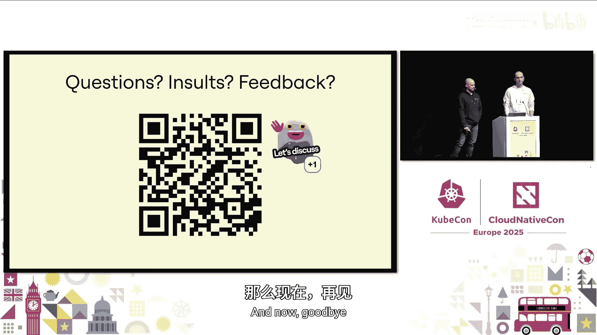

# 057：Kubernetes 中的有状态连接——无人提及的扩展秘诀


在本教程中，我们将跟随 Miro 公司的 André 和 Rodrigo，学习如何将关键的有状态 WebSocket 服务从传统的 EC2 架构迁移到 Kubernetes 平台。我们将深入探讨协议特性、系统约束、优雅关闭、自动扩缩容和负载均衡等核心概念，并揭示在迁移过程中遇到的挑战与解决方案。

## 1：背景与挑战

首先，让我们了解一下 Miro 的产品架构及其面临的挑战。

Miro 可以被视为企业协作的“游戏引擎”。其核心是一个有状态的“板服务器”，每个在协作白板上的用户都需要通过 WebSocket 连接到同一个后端服务器。这种有状态特性带来了显著的路由挑战：客户端如何知道应该连接到哪台服务器？

历史上，Miro 使用 Fabio 作为反向代理，并与 Consul 集成进行服务发现。板服务器启动时会向 Consul 注册，Fabio 则动态更新其路由表。从客户端到基础设施的路径基于 URL，其最后一部分直接代表了后端 EC2 实例的名称。

这种基于路径的路由方式虽然可行，但也带来了额外挑战。例如，如果承载某块白板的服务器宕机，客户端必须与后端服务器重新协商连接，增加了连接管理的复杂性。同时，基础设施侧可能存在潜在的“脑裂”问题，因为应用内部的服务注册逻辑可能与基础设施侧的 Consul 服务发现不同步。

尽管 Fabio 和 Consul 曾发挥重要作用，但变革的时机已经到来。

## 2：迈向云原生

在改造核心服务之前，让我们看看 Miro 在组织层面进行的云原生转型。

早在 2021 年，Miro 就认识到其遗留架构并非云原生，并开启了一场转型之旅。他们从零开始重建计算平台，承诺使用 Kubernetes 和 Amazon EKS 作为下一代应用的基础，推出了所谓的“计算平台”。

该平台由 Kubernetes 驱动，并集成了顶级的 Operator 和控制器，为开发人员提供了一个功能丰富的环境，使他们能够基于微服务架构快速构建和迭代新功能。他们采用了 Karpenter 作为集群自动扩缩器，Kyverno 作为动态准入控制器。

时间来到 2024 年，是时候将计算平台的益处扩展到最关键的工作负载了。但为什么要改变一个仍在运行的系统呢？

## 3：变革的驱动力

接下来，我们探讨推动这次迁移的具体业务和技术需求。

2024 年 Miro 的大型活动即将到来，团队希望展示产品中一些非常酷的新功能，例如文档和智能画布上的数据表格，这些功能将实现新的实时协作体验。然而，客户端（主要是浏览器）对连接到同一域名的同时打开连接数量有严格的限制。

打破单体设计意味着客户端应该能够打开到基础设施后端任意数量无状态工作负载的 WebSocket 连接，而不是像以前那样全部连接到单一端点。这促使我们需要一个更智能、支持多路复用的 WebSocket 路由，将后端的多个大连接通过单一的物理连接复用到客户端。

为了实现这一目标，来自三个不同团队的工程师集合在一起。云网络团队负责现有的 Fabio LB、Consul 和负载均衡器配置。计算团队（Rodrigo 和 André 所在团队）负责 EKS 集群和为微服务平台提供支持的 Operator。协作运行时团队则是新智能 WebSocket 代理和板服务器背后的“大脑”。

理解变革的需求、参与的角色以及我们使用的工具，为深入探讨 Kubernetes 中的有状态连接及其扩展秘诀奠定了重要基础。

## 4：理解有状态连接的基础

在进入具体实现之前，我们需要理解所面临的挑战，掌握有状态连接的基础知识。

首先要理解我们所使用协议的本质。不同的用例可能需要针对有线协议进行不同的考量。以 WebSocket 为例，它是 HTTP/1.1 协议的扩展。通信流程首先需要在客户端和服务器之间建立一个加密的安全 HTTP 连接，然后才能将此连接升级为 WebSocket 连接。这意味着在此过程中有两次握手：一次用于 TLS 部分，另一次用于 HTTP 升级。此后，客户端和服务器之间交换的双向消息才能被发送和接收。这使得建立新连接在我们的场景中成本更高，增加了资源消耗，并在过载时导致尾部延迟。

这引出了下一个与保活相关的话题。保活是我们必须接受的必要手段，但在配置时需要谨慎，需要适当调整通信流中每一跳之间的空闲超时时间，确保通信流中的每一方重用的连接永远不会被上游的另一方实际关闭。

最后，在 Linux 层面，我们会遇到临时端口。这些是操作系统为客户端连接分配的临时端口，对通信至关重要，但它们存在固有的限制。例如，由源 IP、目标 IP 和端口组成的连接四元组的上限略高于 65000。在 Linux 中，可用临时端口的范围由命名空间的 sysctl 配置定义。在 Kubernetes Pod 中运行时，其配置大约在 28000 个。如果这个范围耗尽，就无法建立新连接，导致连接失败，表现为请求丢弃和糟糕的用户体验。因此，我们必须考虑这些端口限制并设计可扩展的应用程序。

以下是查看和修改临时端口范围的示例：
```bash
# 查看当前临时端口范围
cat /proc/sys/net/ipv4/ip_local_port_range

# 在 Pod 的安全上下文中配置（示例片段）
# securityContext:
#   sysctls:
#   - name: net.ipv4.ip_local_port_range
#     value: "1024 65535"
```

除了临时端口，我们还需要考虑另一个关键的 Linux 组件：连接跟踪。这是 Linux 内核的一个核心功能，用于维护所有活动网络连接的表。此表对于有状态防火墙、网络地址转换和其他网络功能至关重要。然而，连接跟踪表也有固定大小。当此表变满时，新的连接尝试会被静默丢弃，影响应用程序的可用性，并导致难以诊断的问题。再次强调，了解这些限制并适当调整节点共享和邻域设置至关重要。

Rodrigo 已经勾勒出了我们在 WebSocket 下运作的约束：新连接成本高、需要调整各跳之间的超时、存在硬性限制阻止我们无限垂直扩展。在此背景下，让我们深入探讨最初的连接是如何建立的。

## 5：新架构与组件部署

现在，让我们看看新的内部构建的 WebSocket 管理器，我们如何将流量路由到那里，以及如何为那些重要的企业交易保持流量安全。

以下是我们的系统示意图，它将帮助我们突出显示各个组件以及它们为我们解决的问题。

首先是我们的明星组件：实时协作网关，它是 Fabio LB 和 Consul 的替代品。该团队完成的工作值得单独开一个话题来讨论，但这里有几个亮点：该应用使用与 VCPU 数量相等的线程来减少上下文切换；此外，所有入站和出站连接都在同一个线程中处理，这显著提高了性能；他们还用 jemalloc 替换了默认的内存分配器，这有助于防止因需要处理频率差异巨大的数据包大小而导致的内存碎片。

现在我们有了部署，如何将用户设备上的流量引导到我们闪亮的新 RTC 网关 Pod 上呢？AWS 负载均衡器控制器在这里发挥了关键作用。它原生支持 Kubernetes API，如 Ingress 和 Service，并且我们最终使用了名为 TargetGroupBinding 的自定义资源定义，它允许我们配置 ALB 如何将流量发送到我们的 Kubernetes Pod。

对于那些不熟悉目标组或 AWS 概念的人来说，它可以被概括为一种资源，允许我们配置负载均衡和流量协议如何工作到 Pod。

接下来，我们的 Pod 已经部署，流量正在流入，如何确保所有这些数据在传输过程中都是加密的，同时防止我们的 SRE 因为需要频繁轮换数千个证书而“跳窗”或“走消防通道”离开大楼呢？

这时，cert-manager 出现了，这是另一个非常宝贵的 CNCF 控制器。它使我们能够抽象出维护集群 PKI 的大部分工作。在这种情况下，我们可以自动配置有效期为一年、每月轮换的证书。结合我们节点最长 30 天的生命周期，意味着每个 Pod 在启动时都拥有一个崭新的证书。

## 6：优雅关闭与自动扩缩

如果你还记得 Rodrigo 之前展示的图表，我们从 EC2 上的有状态服务迁移到了 EKS 上的无状态服务。我们需要考虑的首要问题之一是如何处理关闭，如何优雅地排空连接。

我们将放大 ALB 目标组和 Pod 关闭生命周期之间的配置。首先，对于我们新的 RTC 网关 Pod，优雅关闭是什么样的？从用户体验的角度来看，我们不希望用户在缩容或滚动部署期间陷入连接频繁打开和关闭的卡顿循环中。

RTC 网关从应用侧通过实现一个协议来做到这一点，该协议可以向所有已连接的客户端发送关闭事件，然后对用户透明地获取到现有 Pod 的新连接。首先，我们确保 ALB 给予 RTC 网关充足的时间来完成每项任务。我们估计它应该能在两分钟内排空所有现有连接，因此我们将 ALB 上的注销延迟加倍设置为四分钟。接下来，我们不希望这些已关闭的连接再次连接到完全相同的 Pod。因此，使用我们的 `preStop` 钩子，我们确保在开始连接排空序列之前，Pod 已不再位于负载均衡池中。

现在我们的 Pod 可以平稳终止了，我们可以开始为预期负载做准备了。Rodrigo 之前指出了临时端口和连接跟踪等限制，强调了倾向于水平自动扩缩而非垂直自动扩缩的重要性。传统上，基于资源使用情况的扩缩在我们大约 80% 的情况下效果很好。

然而，由于这个 RTC 网关处理具有不同数据包大小和频率的连接（想象一下像这样的研讨会，每个人都在同一个白板上，与一个人在家里设计宇宙飞船的场景对比），仅靠基于资源的扩缩可能不够。幸运的是，对于代理来说，另一种有效管理饱和度的方法是限制每个 Pod 的并发活动连接数量。

团队随后进行了广泛的性能测试，以了解这里的资源比率概况，例如，处理一定数量的打开连接需要多少 CPU 和内存。然后，他们对 Pod 进行了优化和大小调整，以处理每个 Pod 大约 8000 个连接，同时它们可以远超这个峰值而不会出现任何性能下降。

这时，Keda 登场了。这个 Operator 允许我们基于打开连接的数量进行扩缩。以下是一个 Keda ScaledObject 的配置示例：
```yaml
apiVersion: keda.sh/v1alpha1
kind: ScaledObject
metadata:
  name: rtc-gateway-scaler
spec:
  scaleTargetRef:
    name: rtc-gateway-deployment
  pollingInterval: 30
  cooldownPeriod: 300 # 5分钟冷却期防止抖动
  minReplicaCount: 2
  maxReplicaCount: 100
  advanced:
    horizontalPodAutoscalerConfig:
      behavior:
        scaleDown:
          stabilizationWindowSeconds: 300 # 5分钟滚动窗口防止在指标骤降时过早缩容
          policies:
          - type: Pods
            value: 1
            periodSeconds: 300 # 每5分钟最多缩容1个Pod
  triggers:
  - type: prometheus
    metadata:
      serverAddress: http://prometheus-server.monitoring.svc.cluster.local:9090
      metricName: active_connections_per_pod
      threshold: "8000"
      query: |
        avg(rate(rtc_gateway_connections_active[2m])) by (pod)
```
我们为快速扩容进行了优化（注意向上扩容没有限制），缓慢缩容（每五分钟最多一个 Pod），并设置了滚动采样窗口以防止在指标骤降时过早缩容，以及五分钟的冷却期以防止抖动。Keda 允许我们基于自定义指标（在我们的案例中是活动连接数）进行扩缩，这使我们能够将部署保持在饱和度水平以下。

## 7：负载均衡与高可用性

一旦我们配置了优雅关闭和自动扩缩，下一步就是负载均衡。我们如何确保每个 Pod 都在发挥作用，而不是在那里打哈欠，而其他 Pod 却在拼命工作？

我们再次考虑了 ALB 和 RTC 网关之间可用的交互和杠杆。我们考虑的两个可行的 WebSocket 负载均衡算法是轮询和最少活跃连接。经过研究，我自豪地向团队建议为什么应该使用最少活跃连接，因为与轮询不同，它可以防止旧的 Pod 过载。但结果出了问题：我们让新的 Pod 遭受了大量 WebSocket 连接的冲击。我没有预见到我们需要大规模进行的 CPU 密集型工作（如 TLS 握手），以及我们需要承受的延迟峰值。这对客户体验的风险是不可接受的。

因此，我们回到实验室，需要重新评估轮询和最少活跃连接这两种选择，看看如何减轻各自的缺点。为了减轻最少活跃连接的冷启动问题，我们可以降低连接速率，但这并不简单，因为慢启动与最少活跃连接不兼容。另一种尝试是预热应用程序，但这也不简单，因为我们需要找出哪些代码点负责，以及哪些连接可能需要预先建立。

于是我们把目光转回轮询。如何阻止旧的 Pod 过载？如果我们看一下这两个参与者，我们意识到单个就绪端点通常对正常的 HTTP 流量很有效，但对于 WebSocket，行为则截然不同。如果我们关注一个旧的 Pod，当我们使其就绪检查失败时，在当前状态下会发生两件事：ALB 探测失败，这意味着没有新连接会打开到这个 Pod（因为它是饱和的，这很好）；然而，如果 Kubernetes 探测失败，Pod 将从服务中移除，从端点切片中移除，AWS 负载均衡器控制器会观察到这些变化，并在负载均衡器上开始排空序列。Pod 最终会超过优雅排空期，所有现有连接将被终止。由于 Rodrigo 指出建立新连接成本很高，并且再次失去连接的用户体验很差，这很糟糕。

因此，我们为目标组拆分出另一个专门的端点，以便我们可以单独发出信号，说明我们如何处理新连接和现有连接。然后，团队更新了 RTC 网关，当连接数超过 10000 时向目标组报告“未就绪”，当低于 9000 时再次报告“就绪”，同时持续告诉 Kubernetes 它是就绪的，这样我们就不会触碰那些现有连接。成功了！不再有冷启动，负载均衡了。

为了完成我们在高可用性方面的旅程，我想引导您了解我们遇到的两个有趣经历。

第一个与 HPA 算法本身有关。该算法具有容忍度，默认定义为 10%。在我们的案例中，由于我们使用 Amazon EKS，我们无法真正控制或更改它，因为我们无法访问 kube-controller-manager 设置。在许多情况下，这可能并不重要。但当我们谈论基于打开连接进行扩缩，谈论饱和度并避免在该场景下出错时，这就成了一个大问题。因此，在我们的案例中，开发人员真的希望基于定义的阈值进行扩缩，或者至少对阈值的位置有可预测的理解。所以在这种情况下，主要是关于理解容忍度，并在定义 ScaledObject 中的阈值时将其考虑在内。

第二个问题显示了 HPA 对可能急剧波动的指标有多么敏感，以及为什么您实际上应该在 ScaledObject 或 HPA 本身上定义扩容行为。正如 André 在开头展示 ScaledObject 定义时指出的，我们最初没有扩容策略。有趣的是，周三有一个来自 Keda 维护者的演讲，他们讨论了 Kubernetes 中扩缩的最佳实践，他们的第一个良好实践建议就是使用扩缩策略，而我们当时没有这样做。具体到我们的问题，在对我们的可观测性组件和 Keda 本身进行了一番“责任游戏”之后，我们查看了 keda-operator-metrics-apiserver 的代码、Keda Prometheus 标量器的代码，并在 Keda 和我们的 Prometheus 读取端点之间添加了一个代理，我们实际上发现并能够缩小范围，确定是我们的监控系统在这里行为不当，为查询提供了错误的数据点。即使您后来在图表或仪表板中历史性地查询该信息，那些行为不当的误导性信息也不再存在。但这只是进一步揭示了 HPA 系统会盲目且愉快地跟随那些行为不当的数据。解决方案在这里很简单，主要是定义扩缩策略，默认情况下，它允许每分钟最多扩容 100% 的 Pod 数量。这就是为什么我们在给定的扩缩事件中 Pod 数量翻倍的原因。我们通过控制和减少在一分钟时间范围内可以创建的 Pod 数量来缓解这个问题。

## 8：成果与总结

最后，我们已经快速浏览了将 WebSocket 管理器迁移到 Kubernetes 的旅程，重点介绍了一些使其成为可能的 Operator，以及我们发现的一些扩缩和负载均衡的“秘密”。让我们看看我们的成果。

这里展示了我们一个区域中一天内每个 Pod 的活动连接数。有三个事件我想提请你们注意：黄线标记了扩容开始被调用的时刻（当我们的平均值开始达到 8800 左右时）；红线标记了旧 Pod 停止向目标组报告就绪的时刻；蓝线标记了它们再次开始报告就绪的时刻。当这种情况发生时，我们可以看到新 Pod 上的新连接速率急剧增加。但到此时，它们已经准备就绪、完成预热，并且基本上在向 ALB 发出“嘲讽”。

我们的初始连接延迟下降了 10 倍，使我们能够保持真正的实时性。同时，从 EC2 上的有状态设置迁移到 EKS 上的无状态设置，使我们每年节省了大约 4 万美元，这让我们的财务团队对我们微笑并眨眼。

现在，我已经总结了成果，我想把话筒交回给 Rodrigo，让他简要介绍一下 Miro 云平台的下一个步骤，并说声再见。

我们很高兴地分享，经过几年在生产环境中基于 Kubernetes 运行容器化工作负载，我们作为一个组织已经准备好迈出一大步。对于今天在这里讨论的架构特定部分，这意味着我们也在将我们的板服务器迁移到 Kubernetes，这是我们组织在计算和云整合方面的一个方向。

顺便说一句，如果你发现自己路过阿姆斯特丹，请来我们的办公室坐坐，我们很乐意在那里接待你。现在，再见，谢谢！



在本节课中，我们一起学习了如何将关键的有状态 WebSocket 服务迁移到 Kubernetes。我们从业务驱动和技术挑战入手，深入探讨了 WebSocket 协议特性、Linux 系统限制（临时端口、连接跟踪）等基础。接着，我们逐步拆解了新架构的部署，包括 RTC 网关、ALB 控制器和 cert-manager 的角色。然后，我们重点研究了实现稳定运行的关键操作：如何配置优雅关闭以排空连接，如何利用 Keda 基于自定义指标（活动连接数）进行自动扩缩，以及如何通过巧妙的双就绪端点策略解决 WebSocket 负载均衡的冷启动问题。最后，我们回顾了迁移带来的显著成果：性能提升、成本节约，并为未来的架构演进奠定了基础。希望这些“无人提及的扩展秘诀”能对你的云原生旅程有所启发。